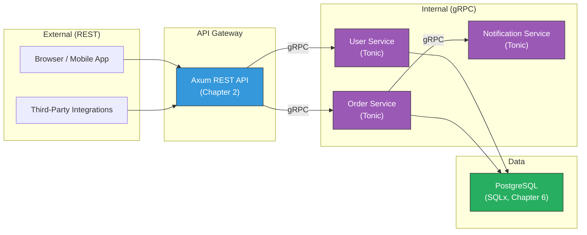

# 4. Protobufs and Tonic Basics 🟡

> **What you'll learn:**
> - Why gRPC and Protocol Buffers exist — the problems they solve that REST + JSON cannot (schema enforcement, binary efficiency, streaming).
> - How to define `.proto` service contracts and use `tonic-build` in `build.rs` to generate type-safe Rust server and client code.
> - How to implement a gRPC server by implementing the generated trait, and how to write a type-safe client.
> - The relationship between Tonic and Tower — and why the middleware you wrote in Chapter 3 works with gRPC too.

**Cross-references:** This chapter uses `build.rs` concepts from [Rust API Design, Chapter 7](../api-design-book/src/ch07-c-interop-and-code-generation.md). Streaming (beyond unary) is covered in [Chapter 5](ch05-bidirectional-streaming-and-channels.md).

---

## REST vs. gRPC: When to Use What

Before diving into Tonic, you need to understand *when* gRPC is the right tool. This is not a religious debate — it's an engineering tradeoff.

| Dimension | REST + JSON | gRPC + Protobuf |
|-----------|------------|-----------------|
| **Schema enforcement** | Optional (OpenAPI/Swagger) | Mandatory (`.proto` files) |
| **Serialization** | Text (JSON) — human-readable, ~10x larger | Binary — compact, ~10x faster to serialize |
| **Streaming** | Workarounds (SSE, WebSockets) | First-class (4 streaming modes) |
| **Code generation** | Optional, often diverges from schema | Generated code *is* the schema |
| **Browser support** | Native | Requires grpc-web proxy |
| **Debugging** | `curl`, browser dev tools | `grpcurl`, Bloom RPC |
| **Versioning** | URL paths (`/v1/`, `/v2/`) | Field numbers (additive-only) |

**Rule of thumb:** Use REST for public-facing APIs (browsers, third parties). Use gRPC for *internal* service-to-service communication where schema safety, binary efficiency, and streaming matter.



---

## Defining a `.proto` Contract

Protocol Buffers (protobuf) is a language-agnostic schema format. You write the contract once, and code generators produce types and RPC stubs for any language.

Create `proto/user.proto`:

```protobuf
syntax = "proto3";

package user.v1;

// The service definition — generates a Rust trait
service UserService {
    // Unary RPC: one request, one response
    rpc GetUser (GetUserRequest) returns (GetUserResponse);
    rpc CreateUser (CreateUserRequest) returns (CreateUserResponse);
    rpc ListUsers (ListUsersRequest) returns (ListUsersResponse);
    rpc DeleteUser (DeleteUserRequest) returns (DeleteUserResponse);
}

// Message types — generate Rust structs with Serialize/Deserialize
message GetUserRequest {
    int64 id = 1;
}

message GetUserResponse {
    User user = 1;
}

message CreateUserRequest {
    string name = 1;
    string email = 2;
}

message CreateUserResponse {
    User user = 1;
}

message ListUsersRequest {
    int32 page = 1;
    int32 per_page = 2;
}

message ListUsersResponse {
    repeated User users = 1;
    int32 total_count = 2;
}

message DeleteUserRequest {
    int64 id = 1;
}

message DeleteUserResponse {}

message User {
    int64 id = 1;
    string name = 2;
    string email = 3;
    // Protobuf timestamps for created_at, updated_at
    google.protobuf.Timestamp created_at = 4;
}
```

### Protobuf Naming Conventions

| Element | Convention | Example |
|---------|-----------|---------|
| Package | `lowercase.dotted.v1` | `user.v1` |
| Service | `PascalCase` + `Service` suffix | `UserService` |
| RPC methods | `PascalCase` | `GetUser`, `CreateUser` |
| Messages | `PascalCase` | `GetUserRequest`, `User` |
| Fields | `snake_case` | `user_id`, `created_at` |
| Enums | `PascalCase`, values `SCREAMING_SNAKE` | `Status`, `STATUS_ACTIVE` |

### Field Numbers: The Versioning Mechanism

Protobuf fields are identified by *number*, not name. This means:
- **Adding new fields** (with new numbers) is always backward compatible.
- **Removing fields** is fine — old data silently ignores unknown fields.
- **Changing a field's type** is a breaking change.
- **Reusing a deleted field number** is a *data corruption* hazard.

```protobuf
message User {
    int64 id = 1;        // Field 1 — never change this
    string name = 2;     // Field 2
    string email = 3;    // Field 3
    // Field 4 was deleted — DO NOT reuse 4
    reserved 4;
    string avatar_url = 5;  // New field — safe addition
}
```

---

## Code Generation with `tonic-build`

### `Cargo.toml` Dependencies

```toml
[dependencies]
tonic = "0.12"
prost = "0.13"                # Protobuf runtime (message serialization)
prost-types = "0.13"          # Well-known types (Timestamp, Duration)
tokio = { version = "1", features = ["macros", "rt-multi-thread"] }

[build-dependencies]
tonic-build = "0.12"          # The code generator
```

### `build.rs`

```rust
fn main() -> Result<(), Box<dyn std::error::Error>> {
    // Compile the .proto file into Rust code.
    // Generated code goes to $OUT_DIR (target/debug/build/...)
    tonic_build::configure()
        .build_server(true)     // Generate server traits
        .build_client(true)     // Generate client types
        .compile_protos(
            &["proto/user.proto"],  // Proto files to compile
            &["proto"],             // Include paths for imports
        )?;
    Ok(())
}
```

### Accessing Generated Code

The generated code lives in `$OUT_DIR`. Include it in your crate with:

```rust
// In src/lib.rs or src/main.rs
pub mod user_proto {
    tonic::include_proto!("user.v1");
}
```

This generates:
- **Message structs:** `User`, `GetUserRequest`, `GetUserResponse`, etc.
- **Server trait:** `user_service_server::UserService` — you implement this.
- **Server glue:** `user_service_server::UserServiceServer` — wraps your impl into a Tower service.
- **Client:** `user_service_client::UserServiceClient` — type-safe RPC caller.

---

## Implementing a gRPC Server

### The Generated Trait

`tonic-build` generates a trait you must implement:

```rust
// Auto-generated (simplified) — DO NOT write this yourself
#[tonic::async_trait]
pub trait UserService: Send + Sync + 'static {
    async fn get_user(
        &self,
        request: tonic::Request<GetUserRequest>,
    ) -> Result<tonic::Response<GetUserResponse>, tonic::Status>;

    async fn create_user(
        &self,
        request: tonic::Request<CreateUserRequest>,
    ) -> Result<tonic::Response<CreateUserResponse>, tonic::Status>;

    async fn list_users(
        &self,
        request: tonic::Request<ListUsersRequest>,
    ) -> Result<tonic::Response<ListUsersResponse>, tonic::Status>;

    async fn delete_user(
        &self,
        request: tonic::Request<DeleteUserRequest>,
    ) -> Result<tonic::Response<DeleteUserResponse>, tonic::Status>;
}
```

### Your Implementation

```rust
use tonic::{Request, Response, Status};
use sqlx::PgPool;

use crate::user_proto::{
    user_service_server::UserService,
    CreateUserRequest, CreateUserResponse,
    GetUserRequest, GetUserResponse,
    ListUsersRequest, ListUsersResponse,
    DeleteUserRequest, DeleteUserResponse,
    User,
};

pub struct UserServiceImpl {
    pool: PgPool,
}

impl UserServiceImpl {
    pub fn new(pool: PgPool) -> Self {
        Self { pool }
    }
}

#[tonic::async_trait]
impl UserService for UserServiceImpl {
    async fn get_user(
        &self,
        request: Request<GetUserRequest>,
    ) -> Result<Response<GetUserResponse>, Status> {
        let req = request.into_inner();

        let row = sqlx::query_as!(
            UserRow,
            "SELECT id, name, email FROM users WHERE id = $1",
            req.id
        )
        .fetch_optional(&self.pool)
        .await
        .map_err(|e| {
            tracing::error!(?e, "Database error in get_user");
            Status::internal("Internal database error")
        })?
        .ok_or_else(|| Status::not_found(format!("User {} not found", req.id)))?;

        Ok(Response::new(GetUserResponse {
            user: Some(User {
                id: row.id,
                name: row.name,
                email: row.email,
                created_at: None, // See Chapter 7 for timestamp handling
            }),
        }))
    }

    async fn create_user(
        &self,
        request: Request<CreateUserRequest>,
    ) -> Result<Response<CreateUserResponse>, Status> {
        let req = request.into_inner();

        // Validate inputs — gRPC uses Status codes, not HTTP status codes
        if req.name.trim().is_empty() {
            return Err(Status::invalid_argument("Name cannot be empty"));
        }

        let row = sqlx::query_as!(
            UserRow,
            "INSERT INTO users (name, email) VALUES ($1, $2) RETURNING id, name, email",
            req.name,
            req.email
        )
        .fetch_one(&self.pool)
        .await
        .map_err(|e| {
            tracing::error!(?e, "Database error in create_user");
            Status::internal("Failed to create user")
        })?;

        Ok(Response::new(CreateUserResponse {
            user: Some(User {
                id: row.id,
                name: row.name,
                email: row.email,
                created_at: None,
            }),
        }))
    }

    async fn list_users(
        &self,
        request: Request<ListUsersRequest>,
    ) -> Result<Response<ListUsersResponse>, Status> {
        let req = request.into_inner();
        let page = req.page.max(1);
        let per_page = req.per_page.clamp(1, 100);
        let offset = ((page - 1) * per_page) as i64;

        let users = sqlx::query_as!(
            UserRow,
            "SELECT id, name, email FROM users ORDER BY id LIMIT $1 OFFSET $2",
            per_page as i64,
            offset
        )
        .fetch_all(&self.pool)
        .await
        .map_err(|e| {
            tracing::error!(?e, "Database error in list_users");
            Status::internal("Failed to list users")
        })?;

        let count: i64 = sqlx::query_scalar!("SELECT COUNT(*) FROM users")
            .fetch_one(&self.pool)
            .await
            .map_err(|_| Status::internal("Count query failed"))?
            .unwrap_or(0);

        Ok(Response::new(ListUsersResponse {
            users: users.into_iter().map(|r| User {
                id: r.id,
                name: r.name,
                email: r.email,
                created_at: None,
            }).collect(),
            total_count: count as i32,
        }))
    }

    async fn delete_user(
        &self,
        request: Request<DeleteUserRequest>,
    ) -> Result<Response<DeleteUserResponse>, Status> {
        let req = request.into_inner();

        let result = sqlx::query!("DELETE FROM users WHERE id = $1", req.id)
            .execute(&self.pool)
            .await
            .map_err(|e| {
                tracing::error!(?e, "Database error in delete_user");
                Status::internal("Failed to delete user")
            })?;

        if result.rows_affected() == 0 {
            return Err(Status::not_found(format!("User {} not found", req.id)));
        }

        Ok(Response::new(DeleteUserResponse {}))
    }
}

// Helper struct for SQLx row mapping
struct UserRow {
    id: i64,
    name: String,
    email: String,
}
```

### gRPC Status Codes vs. HTTP Status Codes

| gRPC Status | Meaning | HTTP Equivalent |
|------------|---------|----------------|
| `OK` | Success | 200 |
| `NOT_FOUND` | Resource doesn't exist | 404 |
| `INVALID_ARGUMENT` | Client sent bad data | 400 |
| `ALREADY_EXISTS` | Duplicate resource | 409 |
| `PERMISSION_DENIED` | Authenticated but not authorized | 403 |
| `UNAUTHENTICATED` | No or invalid credentials | 401 |
| `INTERNAL` | Server bug | 500 |
| `UNAVAILABLE` | Transient failure, retry | 503 |
| `DEADLINE_EXCEEDED` | Timeout | 408 / 504 |
| `RESOURCE_EXHAUSTED` | Rate limited or quota | 429 |

---

## Running the gRPC Server

```rust
use tonic::transport::Server;
use crate::user_proto::user_service_server::UserServiceServer;

#[tokio::main]
async fn main() -> Result<(), Box<dyn std::error::Error>> {
    tracing_subscriber::fmt::init();

    let pool = sqlx::PgPool::connect(&std::env::var("DATABASE_URL")?).await?;
    let user_service = UserServiceImpl::new(pool);

    let addr = "0.0.0.0:50051".parse()?;
    tracing::info!(%addr, "gRPC server listening");

    Server::builder()
        // Tower middleware works here too! (from Chapter 3)
        .layer(tower_http::trace::TraceLayer::new_for_grpc())
        // Register the service
        .add_service(UserServiceServer::new(user_service))
        .serve(addr)
        .await?;

    Ok(())
}
```

### Key Point: `UserServiceServer` is a Tower `Service`

`UserServiceServer::new(user_service)` returns a type that implements `tower::Service<http::Request<Body>>`. This is why Tower middleware chains from Chapter 3 work identically:

```rust
Server::builder()
    .layer(TimeoutLayer::new(Duration::from_secs(30)))  // Same as Axum!
    .layer(TraceLayer::new_for_grpc())                   // Same as Axum!
    .add_service(UserServiceServer::new(user_service))
    .serve(addr)
    .await?;
```

---

## Writing a gRPC Client

```rust
use crate::user_proto::user_service_client::UserServiceClient;
use crate::user_proto::{CreateUserRequest, GetUserRequest, ListUsersRequest};

async fn demo_client() -> Result<(), Box<dyn std::error::Error>> {
    // Connect to the gRPC server
    let mut client = UserServiceClient::connect("http://localhost:50051").await?;

    // Create a user
    let response = client
        .create_user(CreateUserRequest {
            name: "Alice".into(),
            email: "alice@example.com".into(),
        })
        .await?;

    let user = response.into_inner().user.unwrap();
    println!("Created user: {} (id={})", user.name, user.id);

    // Get the user back
    let response = client
        .get_user(GetUserRequest { id: user.id })
        .await?;

    println!("Fetched: {:?}", response.into_inner().user);

    // List all users
    let response = client
        .list_users(ListUsersRequest {
            page: 1,
            per_page: 10,
        })
        .await?;

    let list = response.into_inner();
    println!("Total users: {}, page: {:?}", list.total_count, list.users);

    Ok(())
}
```

### Client-Side Metadata and Interceptors

gRPC metadata is the equivalent of HTTP headers:

```rust
use tonic::metadata::MetadataValue;
use tonic::Request;

// Attach metadata to a single request
let mut request = Request::new(GetUserRequest { id: 42 });
request.metadata_mut().insert(
    "authorization",
    MetadataValue::try_from("Bearer my-token")?,
);
let response = client.get_user(request).await?;

// Or use an interceptor for all requests
use tonic::service::Interceptor;

fn auth_interceptor(mut req: Request<()>) -> Result<Request<()>, Status> {
    let token = MetadataValue::try_from("Bearer my-token").unwrap();
    req.metadata_mut().insert("authorization", token);
    Ok(req)
}

let channel = tonic::transport::Channel::from_static("http://localhost:50051")
    .connect()
    .await?;

let client = UserServiceClient::with_interceptor(channel, auth_interceptor);
```

---

<details>
<summary><strong>🏋️ Exercise: Build a Complete gRPC Service with Error Handling</strong> (click to expand)</summary>

**Challenge:** Build a gRPC `TaskService` with the following requirements:

1. Define a `task.proto` with: `CreateTask(title, description) → Task`, `GetTask(id) → Task`, `CompleteTask(id) → Task`.
2. The `Task` message should have: `id`, `title`, `description`, `completed` (bool), `created_at` (Timestamp).
3. Implement the server with an in-memory `DashMap<i64, Task>` (no database for this exercise).
4. Return proper gRPC status codes: `INVALID_ARGUMENT` for empty titles, `NOT_FOUND` for missing tasks, `FAILED_PRECONDITION` if completing an already-completed task.
5. Write a client that creates 3 tasks, completes one, and lists them all.

<details>
<summary>🔑 Solution</summary>

**`proto/task.proto`:**
```protobuf
syntax = "proto3";
package task.v1;

import "google/protobuf/timestamp.proto";

service TaskService {
    rpc CreateTask (CreateTaskRequest) returns (CreateTaskResponse);
    rpc GetTask (GetTaskRequest) returns (GetTaskResponse);
    rpc CompleteTask (CompleteTaskRequest) returns (CompleteTaskResponse);
}

message CreateTaskRequest {
    string title = 1;
    string description = 2;
}

message CreateTaskResponse {
    Task task = 1;
}

message GetTaskRequest {
    int64 id = 1;
}

message GetTaskResponse {
    Task task = 1;
}

message CompleteTaskRequest {
    int64 id = 1;
}

message CompleteTaskResponse {
    Task task = 1;
}

message Task {
    int64 id = 1;
    string title = 2;
    string description = 3;
    bool completed = 4;
    google.protobuf.Timestamp created_at = 5;
}
```

**Server implementation:**
```rust
use dashmap::DashMap;
use prost_types::Timestamp;
use std::sync::atomic::{AtomicI64, Ordering};
use std::time::SystemTime;
use tonic::{Request, Response, Status};

// Generated code
pub mod task_proto {
    tonic::include_proto!("task.v1");
}

use task_proto::{
    task_service_server::{TaskService, TaskServiceServer},
    CompleteTaskRequest, CompleteTaskResponse,
    CreateTaskRequest, CreateTaskResponse,
    GetTaskRequest, GetTaskResponse,
    Task,
};

// ── In-memory storage ──────────────────────────────────────────────
pub struct TaskServiceImpl {
    // DashMap is a concurrent HashMap — no Mutex needed
    tasks: DashMap<i64, Task>,
    next_id: AtomicI64,
}

impl TaskServiceImpl {
    pub fn new() -> Self {
        Self {
            tasks: DashMap::new(),
            next_id: AtomicI64::new(1),
        }
    }

    fn now_timestamp() -> Option<Timestamp> {
        let duration = SystemTime::now()
            .duration_since(SystemTime::UNIX_EPOCH)
            .ok()?;
        Some(Timestamp {
            seconds: duration.as_secs() as i64,
            nanos: duration.subsec_nanos() as i32,
        })
    }
}

#[tonic::async_trait]
impl TaskService for TaskServiceImpl {
    async fn create_task(
        &self,
        request: Request<CreateTaskRequest>,
    ) -> Result<Response<CreateTaskResponse>, Status> {
        let req = request.into_inner();

        // ✅ Validate: INVALID_ARGUMENT for empty title
        if req.title.trim().is_empty() {
            return Err(Status::invalid_argument("Title cannot be empty"));
        }

        let id = self.next_id.fetch_add(1, Ordering::Relaxed);
        let task = Task {
            id,
            title: req.title,
            description: req.description,
            completed: false,
            created_at: Self::now_timestamp(),
        };

        self.tasks.insert(id, task.clone());

        Ok(Response::new(CreateTaskResponse { task: Some(task) }))
    }

    async fn get_task(
        &self,
        request: Request<GetTaskRequest>,
    ) -> Result<Response<GetTaskResponse>, Status> {
        let id = request.into_inner().id;

        // ✅ NOT_FOUND for missing tasks
        let task = self
            .tasks
            .get(&id)
            .map(|entry| entry.value().clone())
            .ok_or_else(|| Status::not_found(format!("Task {id} not found")))?;

        Ok(Response::new(GetTaskResponse { task: Some(task) }))
    }

    async fn complete_task(
        &self,
        request: Request<CompleteTaskRequest>,
    ) -> Result<Response<CompleteTaskResponse>, Status> {
        let id = request.into_inner().id;

        let mut entry = self
            .tasks
            .get_mut(&id)
            .ok_or_else(|| Status::not_found(format!("Task {id} not found")))?;

        // ✅ FAILED_PRECONDITION for already-completed tasks
        if entry.completed {
            return Err(Status::failed_precondition(
                format!("Task {id} is already completed"),
            ));
        }

        entry.completed = true;
        let task = entry.clone();

        Ok(Response::new(CompleteTaskResponse { task: Some(task) }))
    }
}

// ── Server main ────────────────────────────────────────────────────
#[tokio::main]
async fn main() -> Result<(), Box<dyn std::error::Error>> {
    let addr = "0.0.0.0:50051".parse()?;
    let service = TaskServiceImpl::new();

    println!("TaskService listening on {addr}");
    tonic::transport::Server::builder()
        .add_service(TaskServiceServer::new(service))
        .serve(addr)
        .await?;
    Ok(())
}
```

**Client test:**
```rust
use task_proto::task_service_client::TaskServiceClient;
use task_proto::{CreateTaskRequest, GetTaskRequest, CompleteTaskRequest};

#[tokio::main]
async fn main() -> Result<(), Box<dyn std::error::Error>> {
    let mut client = TaskServiceClient::connect("http://localhost:50051").await?;

    // Create 3 tasks
    for title in ["Design API", "Implement backend", "Write tests"] {
        let resp = client.create_task(CreateTaskRequest {
            title: title.into(),
            description: format!("Task: {title}"),
        }).await?;
        println!("Created: {:?}", resp.into_inner().task.unwrap());
    }

    // Complete task 1
    let resp = client.complete_task(CompleteTaskRequest { id: 1 }).await?;
    println!("Completed: {:?}", resp.into_inner().task.unwrap());

    // Try to complete task 1 again — should return FAILED_PRECONDITION
    match client.complete_task(CompleteTaskRequest { id: 1 }).await {
        Err(status) => {
            assert_eq!(status.code(), tonic::Code::FailedPrecondition);
            println!("Expected error: {}", status.message());
        }
        Ok(_) => panic!("Should have failed!"),
    }

    // Get task 2 — should still be incomplete
    let resp = client.get_task(GetTaskRequest { id: 2 }).await?;
    let task = resp.into_inner().task.unwrap();
    assert!(!task.completed);
    println!("Task 2 still pending: {}", task.title);

    Ok(())
}
```

</details>
</details>

---

> **Key Takeaways**
> - gRPC provides **schema-enforced contracts** via `.proto` files. The generated Rust code ensures client and server agree on types at compile time.
> - `tonic-build` runs in `build.rs` to generate server traits and client types. You never write serialization code.
> - Tonic servers implement a generated `#[tonic::async_trait]` trait. Each RPC method receives a `tonic::Request<T>` and returns `Result<tonic::Response<T>, tonic::Status>`.
> - **Tonic services are Tower services.** The `TimeoutLayer`, `TraceLayer`, and custom middleware from Chapter 3 work identically on gRPC.
> - Use gRPC `Status` codes (not HTTP status codes) for error handling. `INVALID_ARGUMENT`, `NOT_FOUND`, `FAILED_PRECONDITION` are your most common.

---

> **See also:**
> - [Chapter 5: Bidirectional Streaming and Channels](ch05-bidirectional-streaming-and-channels.md) — for streaming beyond unary RPC.
> - [Chapter 1: Hyper, Tower, and the Service Trait](ch01-hyper-tower-service-trait.md) — for why Tonic services are Tower services.
> - [Rust API Design, Chapter 7: Code Generation](../api-design-book/src/ch07-c-interop-and-code-generation.md) — for `build.rs` patterns beyond `tonic-build`.
> - [Chapter 8: Capstone](ch08-capstone-unified-polyglot-microservice.md) — for serving Tonic and Axum on the same port.
