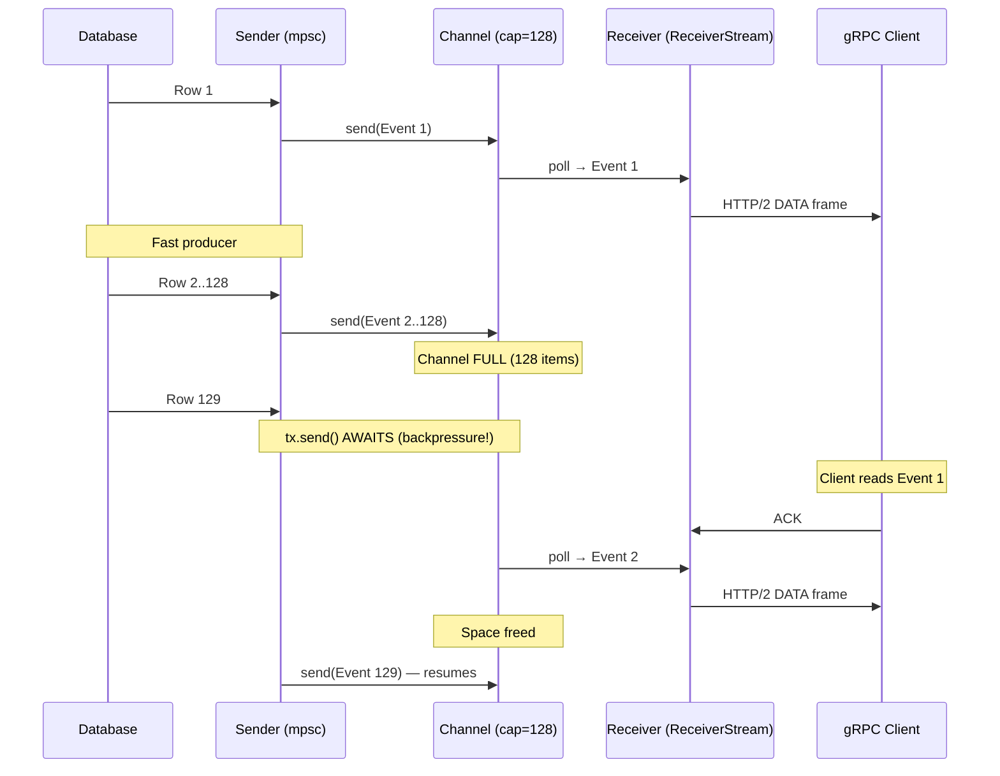

# 5. Bidirectional Streaming and Channels 🔴

> **What you'll learn:**
> - The four gRPC communication patterns — Unary, Server-Streaming, Client-Streaming, and Bidirectional — and when each is appropriate.
> - How to implement server-side streaming using Tokio `mpsc` channels wrapped with `tokio_stream::wrappers::ReceiverStream`.
> - How to handle client-side streaming with `tonic::Streaming<T>` and apply backpressure.
> - How to build a full-duplex bidirectional stream — the most complex and powerful gRPC pattern — with proper error propagation and graceful shutdown.

**Cross-references:** This chapter builds on the Tonic fundamentals from [Chapter 4](ch04-protobufs-and-tonic-basics.md). For the async channel internals, see [Async Rust: Streams](../async-book/src/SUMMARY.md). For the concurrency patterns, see [Concurrency in Rust](../concurrency-book/src/SUMMARY.md).

---

## The Four gRPC Streaming Topologies

gRPC defines four communication patterns. Chapter 4 covered Unary. This chapter covers the other three.

```mermaid
graph TB
    subgraph "① Unary (Chapter 4)"
        C1["Client"] -->|"1 Request"| S1["Server"]
        S1 -->|"1 Response"| C1
    end

    subgraph "② Server-Streaming"
        C2["Client"] -->|"1 Request"| S2["Server"]
        S2 -->|"N Responses (stream)"| C2
    end

    subgraph "③ Client-Streaming"
        C3["Client"] -->|"N Requests (stream)"| S3["Server"]
        S3 -->|"1 Response"| C3
    end

    subgraph "④ Bidirectional"
        C4["Client"] <-->|"N Requests ↔ N Responses"| S4["Server"]
    end

    style C1 fill:#3498db,stroke:#333,color:#fff
    style S1 fill:#27ae60,stroke:#333,color:#fff
    style C2 fill:#3498db,stroke:#333,color:#fff
    style S2 fill:#27ae60,stroke:#333,color:#fff
    style C3 fill:#3498db,stroke:#333,color:#fff
    style S3 fill:#27ae60,stroke:#333,color:#fff
    style C4 fill:#3498db,stroke:#333,color:#fff
    style S4 fill:#27ae60,stroke:#333,color:#fff
```



| Pattern | Use Case | Example |
|---------|----------|---------|
| **Unary** | Simple CRUD | `GetUser`, `CreateOrder` |
| **Server-Streaming** | Large result sets, live feeds | `ListAllEvents`, `SubscribeToUpdates` |
| **Client-Streaming** | Bulk uploads, aggregation | `UploadChunks`, `StreamMetrics` |
| **Bidirectional** | Real-time collaboration, chat | `Chat`, `LiveSync`, `GameState` |

---

## Proto Definitions for Streaming

```protobuf
syntax = "proto3";
package stream.v1;

service EventService {
    // ② Server-Streaming: client sends one request, server streams back events
    rpc Subscribe (SubscribeRequest) returns (stream Event);

    // ③ Client-Streaming: client streams metrics, server returns a summary
    rpc IngestMetrics (stream Metric) returns (IngestSummary);

    // ④ Bidirectional: real-time echo/transform — both sides stream simultaneously
    rpc Chat (stream ChatMessage) returns (stream ChatMessage);
}

message SubscribeRequest {
    string topic = 1;
}

message Event {
    int64 id = 1;
    string topic = 2;
    string payload = 3;
    int64 timestamp_ms = 4;
}

message Metric {
    string name = 1;
    double value = 2;
    int64 timestamp_ms = 3;
}

message IngestSummary {
    int64 metrics_received = 1;
    double average_value = 2;
}

message ChatMessage {
    string user = 1;
    string text = 2;
    int64 timestamp_ms = 3;
}
```

The `stream` keyword before a message type is what makes gRPC streaming work. `tonic-build` generates different Rust types for each pattern.

---

## Server-Streaming: `mpsc` + `ReceiverStream`

The server sends multiple responses over time for a single client request. This is the most common streaming pattern.

### The Naive Way: Collect Everything, Send At Once

```rust
// ⚠️ PRODUCTION HAZARD: Loads ALL events into memory before sending.
// If there are 10 million events, this OOMs the server.
async fn subscribe(
    &self,
    request: Request<SubscribeRequest>,
) -> Result<Response<Vec<Event>>, Status> {
    let events = self.load_all_events(&request.into_inner().topic).await?;
    Ok(Response::new(events))  // 10 million events in one response = OOM
}
```

### The Production Way: Stream via `mpsc` Channel

```rust
use tokio::sync::mpsc;
use tokio_stream::wrappers::ReceiverStream;
use tonic::{Request, Response, Status};

type EventStream = ReceiverStream<Result<Event, Status>>;

#[tonic::async_trait]
impl EventService for EventServiceImpl {
    // ✅ The return type is a stream, not a single response.
    // Tonic generates this type signature from the `stream` keyword in the proto.
    type SubscribeStream = EventStream;

    async fn subscribe(
        &self,
        request: Request<SubscribeRequest>,
    ) -> Result<Response<Self::SubscribeStream>, Status> {
        let topic = request.into_inner().topic;
        let pool = self.pool.clone();

        // Create a bounded channel — this is the backpressure mechanism.
        // If the client is slow, the channel fills up and the sender pauses.
        let (tx, rx) = mpsc::channel(128);

        // Spawn a background task that produces events into the channel.
        tokio::spawn(async move {
            // Stream from the database using a cursor (not loading all at once)
            let mut stream = sqlx::query_as!(
                EventRow,
                "SELECT id, topic, payload, timestamp_ms FROM events WHERE topic = $1 ORDER BY id",
                &topic
            )
            .fetch(&pool); // ← .fetch() returns a Stream, not a Vec

            use futures::StreamExt;
            while let Some(result) = stream.next().await {
                let event = match result {
                    Ok(row) => Ok(Event {
                        id: row.id,
                        topic: row.topic,
                        payload: row.payload,
                        timestamp_ms: row.timestamp_ms,
                    }),
                    Err(e) => {
                        tracing::error!(?e, "Database error during streaming");
                        Err(Status::internal("Stream interrupted"))
                    }
                };

                // If the receiver is dropped (client disconnected), stop.
                if tx.send(event).await.is_err() {
                    tracing::info!(topic, "Client disconnected, stopping stream");
                    break;
                }
            }
            // Channel is dropped here, signaling end-of-stream.
        });

        // Return the receiver as a stream.
        Ok(Response::new(ReceiverStream::new(rx)))
    }
}
```

### How Backpressure Works



The bounded `mpsc::channel(128)` is the backpressure valve. When the channel is full:
- The producer (`tokio::spawn` task) *pauses* at `tx.send().await`.
- The consumer (gRPC transport) *drains* the channel as the client reads.
- Flow naturally adjusts without dropping data or OOMing.

---

## Client-Streaming: Processing a Stream of Requests

The client sends a stream of messages; the server processes them and returns a single response.

```rust
use tonic::Streaming;
use futures::StreamExt;

#[tonic::async_trait]
impl EventService for EventServiceImpl {
    async fn ingest_metrics(
        &self,
        request: Request<Streaming<Metric>>,
    ) -> Result<Response<IngestSummary>, Status> {
        let mut stream = request.into_inner();

        let mut count: i64 = 0;
        let mut sum: f64 = 0.0;

        // Process each metric as it arrives — constant memory usage
        while let Some(result) = stream.next().await {
            let metric = result.map_err(|e| {
                tracing::error!(?e, "Error receiving metric from client stream");
                Status::internal("Stream receive error")
            })?;

            count += 1;
            sum += metric.value;

            // Optionally batch-insert into the database every N metrics
            if count % 1000 == 0 {
                tracing::info!(count, "Ingested {count} metrics so far");
            }
        }

        // Stream ended — client sent all metrics
        let average = if count > 0 { sum / count as f64 } else { 0.0 };

        Ok(Response::new(IngestSummary {
            metrics_received: count,
            average_value: average,
        }))
    }
}
```

### Client-Side Streaming Code

```rust
use tokio_stream::iter;

async fn send_metrics(
    client: &mut EventServiceClient<tonic::transport::Channel>,
) -> Result<(), Box<dyn std::error::Error>> {
    // Create a stream of metrics from an iterator
    let metrics = vec![
        Metric { name: "cpu".into(), value: 0.85, timestamp_ms: 1000 },
        Metric { name: "cpu".into(), value: 0.92, timestamp_ms: 2000 },
        Metric { name: "mem".into(), value: 0.45, timestamp_ms: 3000 },
    ];

    let stream = tokio_stream::iter(metrics);

    let response = client.ingest_metrics(stream).await?;
    let summary = response.into_inner();
    println!(
        "Ingested {} metrics, average: {:.2}",
        summary.metrics_received, summary.average_value
    );

    Ok(())
}
```

---

## Bidirectional Streaming: Full-Duplex Communication

This is the most complex pattern. Both client and server stream simultaneously — neither waits for the other. Think real-time chat, multiplayer game state, or live data transformation.

### Server Implementation

```rust
use tokio::sync::mpsc;
use tokio_stream::wrappers::ReceiverStream;
use tokio_stream::StreamExt;

#[tonic::async_trait]
impl EventService for EventServiceImpl {
    type ChatStream = ReceiverStream<Result<ChatMessage, Status>>;

    async fn chat(
        &self,
        request: Request<Streaming<ChatMessage>>,
    ) -> Result<Response<Self::ChatStream>, Status> {
        let mut inbound = request.into_inner();
        let (tx, rx) = mpsc::channel(128);

        // Spawn a task that reads from the client and writes back.
        // In a real app, this would broadcast to other connected clients.
        tokio::spawn(async move {
            while let Some(result) = inbound.next().await {
                match result {
                    Ok(msg) => {
                        tracing::info!(
                            user = %msg.user,
                            text = %msg.text,
                            "Received chat message"
                        );

                        // Echo back with a server-side transformation
                        let response = ChatMessage {
                            user: "server".into(),
                            text: format!("Echo: {}", msg.text),
                            timestamp_ms: chrono::Utc::now().timestamp_millis(),
                        };

                        if tx.send(Ok(response)).await.is_err() {
                            // Client disconnected
                            break;
                        }
                    }
                    Err(e) => {
                        tracing::error!(?e, "Error in client stream");
                        // Send the error to the response stream
                        let _ = tx.send(Err(Status::internal("Stream error"))).await;
                        break;
                    }
                }
            }
            // inbound stream ended — client closed their side
            tracing::info!("Client stream ended, closing response stream");
        });

        Ok(Response::new(ReceiverStream::new(rx)))
    }
}
```

### Client Implementation

```rust
use tokio::sync::mpsc;
use tokio_stream::wrappers::ReceiverStream;

async fn chat_demo(
    client: &mut EventServiceClient<tonic::transport::Channel>,
) -> Result<(), Box<dyn std::error::Error>> {
    let (tx, rx) = mpsc::channel(128);

    // Spawn a task that sends messages to the server
    tokio::spawn(async move {
        let messages = vec!["Hello!", "How are you?", "Goodbye!"];
        for text in messages {
            let msg = ChatMessage {
                user: "alice".into(),
                text: text.into(),
                timestamp_ms: chrono::Utc::now().timestamp_millis(),
            };
            if tx.send(msg).await.is_err() {
                break;
            }
            // Simulate typing delay
            tokio::time::sleep(Duration::from_millis(500)).await;
        }
        // Drop tx to signal end-of-stream
    });

    // Start the bidirectional stream
    let response = client.chat(ReceiverStream::new(rx)).await?;
    let mut inbound = response.into_inner();

    // Read server responses concurrently
    while let Some(result) = inbound.next().await {
        match result {
            Ok(msg) => println!("[{}] {}", msg.user, msg.text),
            Err(e) => {
                eprintln!("Server error: {e}");
                break;
            }
        }
    }

    Ok(())
}
```

---

## Real-World Pattern: Broadcast Hub

A production chat service doesn't just echo — it broadcasts to all connected clients. Here's the pattern using `tokio::sync::broadcast`:

```rust
use tokio::sync::broadcast;

pub struct ChatHub {
    // broadcast::Sender allows multiple receivers (one per client).
    // Messages are cloned to each receiver.
    tx: broadcast::Sender<ChatMessage>,
}

impl ChatHub {
    pub fn new(capacity: usize) -> Self {
        let (tx, _) = broadcast::channel(capacity);
        Self { tx }
    }
}

#[tonic::async_trait]
impl EventService for ChatHub {
    type ChatStream = ReceiverStream<Result<ChatMessage, Status>>;

    async fn chat(
        &self,
        request: Request<Streaming<ChatMessage>>,
    ) -> Result<Response<Self::ChatStream>, Status> {
        let mut inbound = request.into_inner();
        let broadcast_tx = self.tx.clone();
        let mut broadcast_rx = self.tx.subscribe();
        let (response_tx, response_rx) = mpsc::channel(128);

        // Task 1: Read from client → broadcast to all
        let tx_clone = broadcast_tx.clone();
        tokio::spawn(async move {
            while let Some(Ok(msg)) = inbound.next().await {
                // Broadcast to all subscribers (including ourselves)
                let _ = tx_clone.send(msg);
            }
        });

        // Task 2: Read from broadcast → send to this client
        tokio::spawn(async move {
            while let Ok(msg) = broadcast_rx.recv().await {
                if response_tx.send(Ok(msg)).await.is_err() {
                    break; // Client disconnected
                }
            }
        });

        Ok(Response::new(ReceiverStream::new(response_rx)))
    }
}
```

---

## Error Handling in Streams

| Scenario | Server Behavior | Client Sees |
|----------|----------------|-------------|
| DB error during server stream | Send `Err(Status::internal(...))` via channel, then break | `Status::INTERNAL` on next `stream.next()` |
| Client disconnects | `tx.send().await` returns `Err` → break spawn task | N/A — client is gone |
| Client sends malformed message | `stream.next()` returns `Err` → log and break | Depends on client error handling |
| Server shuts down | Drop all `tx` channels | `stream.next()` returns `None` (clean EOF) |
| Channel full (backpressure) | Producer awaits at `tx.send()` | Consumer continues reading normally |

---

<details>
<summary><strong>🏋️ Exercise: Build a Live Metrics Dashboard Stream</strong> (click to expand)</summary>

**Challenge:** Build a `MetricsDashboard` service with these RPCs:

1. `PushMetric (stream Metric) returns (PushSummary)` — client streams metrics to server (client-streaming).
2. `WatchMetrics (WatchRequest) returns (stream MetricSnapshot)` — server streams aggregated snapshots every 1 second (server-streaming).
3. The server should maintain a running average per metric name (using `DashMap`).
4. `WatchMetrics` should send the current state of ALL metrics to the client every second, even if no new data arrived.

<details>
<summary>🔑 Solution</summary>

```rust
use dashmap::DashMap;
use std::sync::Arc;
use std::time::Duration;
use tokio::sync::mpsc;
use tokio_stream::wrappers::ReceiverStream;
use tonic::{Request, Response, Status, Streaming};
use futures::StreamExt;

// Shared state: metric name → (sum, count)
struct MetricsState {
    data: DashMap<String, (f64, u64)>,
}

impl MetricsState {
    fn new() -> Self {
        Self { data: DashMap::new() }
    }

    fn record(&self, name: &str, value: f64) {
        self.data
            .entry(name.to_owned())
            .and_modify(|(sum, count)| {
                *sum += value;
                *count += 1;
            })
            .or_insert((value, 1));
    }

    fn snapshot(&self) -> Vec<MetricSnapshot> {
        self.data
            .iter()
            .map(|entry| {
                let (sum, count) = *entry.value();
                MetricSnapshot {
                    name: entry.key().clone(),
                    average: sum / count as f64,
                    count: count as i64,
                }
            })
            .collect()
    }
}

pub struct MetricsDashboardImpl {
    state: Arc<MetricsState>,
}

#[tonic::async_trait]
impl MetricsDashboard for MetricsDashboardImpl {
    // Client-streaming: receive metrics, store them
    async fn push_metric(
        &self,
        request: Request<Streaming<Metric>>,
    ) -> Result<Response<PushSummary>, Status> {
        let mut stream = request.into_inner();
        let state = self.state.clone();
        let mut count: i64 = 0;

        while let Some(Ok(metric)) = stream.next().await {
            state.record(&metric.name, metric.value);
            count += 1;
        }

        Ok(Response::new(PushSummary {
            metrics_received: count,
        }))
    }

    // Server-streaming: send snapshots every second
    type WatchMetricsStream = ReceiverStream<Result<MetricSnapshot, Status>>;

    async fn watch_metrics(
        &self,
        _request: Request<WatchRequest>,
    ) -> Result<Response<Self::WatchMetricsStream>, Status> {
        let state = self.state.clone();
        let (tx, rx) = mpsc::channel(32);

        tokio::spawn(async move {
            let mut interval = tokio::time::interval(Duration::from_secs(1));

            loop {
                interval.tick().await;

                // Take a snapshot of all current metrics
                let snapshots = state.snapshot();

                for snapshot in snapshots {
                    if tx.send(Ok(snapshot)).await.is_err() {
                        // Client disconnected
                        return;
                    }
                }
            }
        });

        Ok(Response::new(ReceiverStream::new(rx)))
    }
}
```

**Key design decisions:**
- `DashMap` for lock-free concurrent writes from multiple client streams.
- `Arc<MetricsState>` shared between the push handler and the watch spawned task.
- `tokio::time::interval` for periodic snapshots — it handles drift automatically.
- The watch loop runs until the client disconnects (`tx.send()` returns `Err`).
- Each watch client gets an independent `mpsc` channel — their read speeds don't interfere.

</details>
</details>

---

> **Key Takeaways**
> - gRPC supports four patterns: **Unary**, **Server-Streaming**, **Client-Streaming**, and **Bidirectional**. The `stream` keyword in `.proto` determines the type.
> - Server-streaming uses `tokio::sync::mpsc` + `ReceiverStream` to bridge between a spawned producer task and Tonic's response stream.
> - **Bounded channels are backpressure**: `mpsc::channel(N)` ensures the producer pauses when the consumer falls behind. This prevents OOM.
> - Client-streaming receives a `tonic::Streaming<T>` — iterate with `while let Some(result) = stream.next().await`.
> - Bidirectional streaming combines both patterns: spawn a task for each direction, connected via channels.
> - For broadcast (one-to-many), use `tokio::sync::broadcast` instead of `mpsc`.

---

> **See also:**
> - [Chapter 4: Protobufs and Tonic Basics](ch04-protobufs-and-tonic-basics.md) — for unary gRPC and proto fundamentals.
> - [Async Rust: Streams and StreamExt](../async-book/src/SUMMARY.md) — for the `Stream` trait and combinators.
> - [Concurrency in Rust: Channels](../concurrency-book/src/SUMMARY.md) — for deep-dive on `mpsc`, `broadcast`, and `watch` channels.
> - [Chapter 8: Capstone](ch08-capstone-unified-polyglot-microservice.md) — where streaming gRPC runs alongside REST on the same port.
