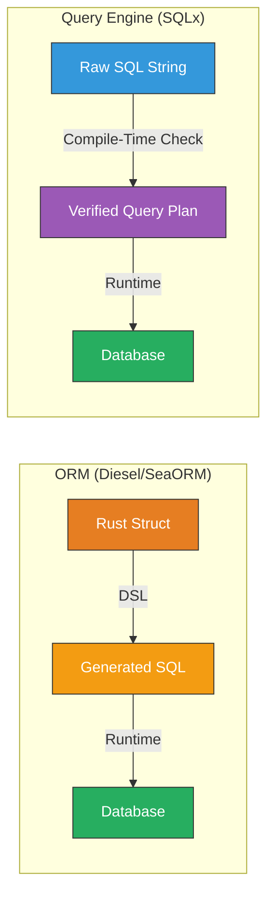
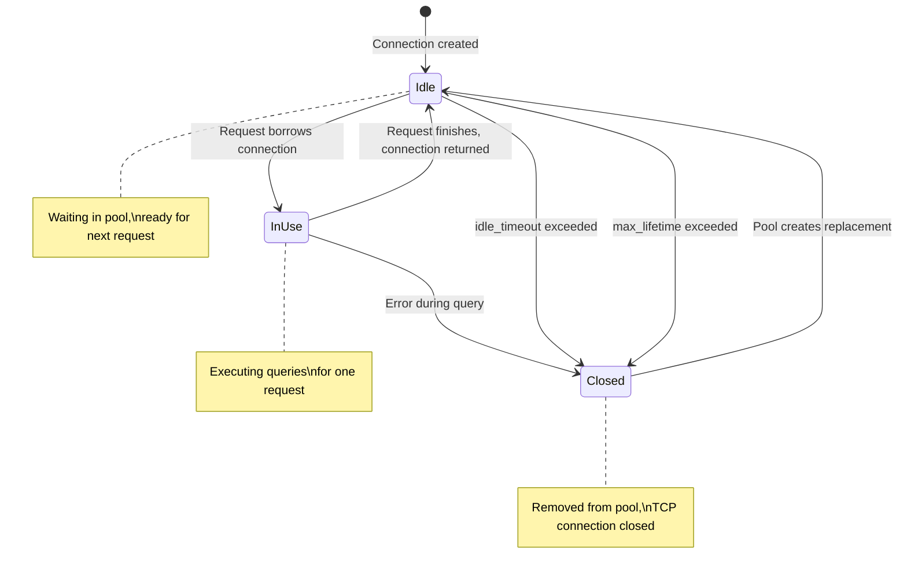

# 6. Async Databases and SQLx 🟡

> **What you'll learn:**
> - Why SQLx is an async, pure-Rust *query engine* — not an ORM — and how that changes your mental model compared to Diesel, SeaORM, or ActiveRecord.
> - How connection pooling works: creating and configuring `PgPool`, understanding idle connections, max connections, and connection lifetime.
> - How to run database migrations programmatically at startup — eliminating deployment footguns.
> - The critical difference between `.fetch()` (streaming), `.fetch_all()` (buffered), `.fetch_one()` (exactly one), and `.fetch_optional()` (zero or one).

**Cross-references:** This chapter sets up the database layer used in [Chapter 7: Compile-Time Checked Queries](ch07-compile-time-checked-queries.md) and the [Chapter 8 Capstone](ch08-capstone-unified-polyglot-microservice.md). For async fundamentals, see [Async Rust](../async-book/src/SUMMARY.md).

---

## SQLx vs. ORMs: A Fundamental Choice

The Rust database ecosystem offers two philosophies:

| Approach | Crate | Model | Query Style |
|----------|-------|-------|-------------|
| **ORM** | Diesel, SeaORM | Define Rust structs → generate SQL | DSL / method chains |
| **Query Engine** | SQLx | Write SQL directly → verify at compile time | Raw SQL strings |

SQLx chose the *query engine* path. You write real SQL, and SQLx ensures it's correct.



### When to Use What

| Choose SQLx When | Choose an ORM When |
|-----------------|-------------------|
| You know SQL well and want full control | You want rapid prototyping with migrations |
| You need complex queries (CTEs, window functions, lateral joins) | Your queries are simple CRUD |
| You want compile-time SQL verification | You're OK with runtime query building |
| Your team has DBA expertise | Your team is Rust-first, SQL-second |
| Performance-critical path (no ORM overhead) | Developer velocity matters more |

---

## Connection Pooling: `PgPool`

### Why Connection Pooling Matters

Opening a database connection is expensive: TCP handshake, TLS negotiation, authentication, session setup. Without pooling, each request opens and closes a connection:

```rust
// ⚠️ PRODUCTION HAZARD: New connection per request.
// At 1000 req/s, this exhausts PostgreSQL's max_connections (default: 100).
async fn handle_request() {
    let conn = PgConnection::connect("postgres://localhost/mydb").await.unwrap();
    sqlx::query("SELECT 1").execute(&conn).await.unwrap();
    // Connection dropped here — TCP teardown
}
```

A connection pool maintains a set of reusable connections:

```rust
// ✅ FIX: Create the pool ONCE at startup, share it across all requests.
let pool = PgPool::connect("postgres://localhost/mydb").await?;

// Every request borrows a connection, uses it, and returns it.
async fn handle_request(pool: &PgPool) {
    sqlx::query("SELECT 1").execute(pool).await.unwrap();
    // Connection returned to pool — no TCP overhead
}
```

### Pool Configuration

```rust
use sqlx::postgres::PgPoolOptions;
use std::time::Duration;

let pool = PgPoolOptions::new()
    // Maximum number of connections in the pool.
    // Rule of thumb: (2 * CPU cores) + disk spindles.
    // For cloud Postgres (RDS, Cloud SQL): check the instance's max_connections.
    .max_connections(20)

    // Minimum number of idle connections kept open.
    // Prevents cold-start latency after traffic lulls.
    .min_connections(5)

    // How long to wait for a connection from the pool before timing out.
    // If all 20 connections are busy and this expires → error.
    .acquire_timeout(Duration::from_secs(3))

    // Maximum lifetime of a connection. After this, it's closed and replaced.
    // Prevents issues with PgBouncer, proxies, or long-lived connection drift.
    .max_lifetime(Duration::from_mins(30))

    // How long a connection can sit idle before being closed.
    .idle_timeout(Duration::from_mins(10))

    // Run a test query when checking out a connection.
    // Catches stale connections that the server has closed.
    .test_before_acquire(true)

    .connect(&std::env::var("DATABASE_URL")?)
    .await?;
```

### Pool State Machine



### Pool Sizing: The Critical Production Decision

| Setting | Too Low | Too High | Sweet Spot |
|---------|---------|---------|------------|
| `max_connections` | Requests queue up, timeouts | Overwhelms PostgreSQL | `(2 × CPU cores) + spindles` |
| `min_connections` | Cold-start latency spikes | Wastes idle resources | 20–50% of max |
| `acquire_timeout` | Requests fail on brief spikes | Requests hang forever | 3–5 seconds |

---

## Database Migrations

### Migration Files

SQLx uses numbered migration files. Create a `migrations/` directory:

```
migrations/
├── 20240101_000001_create_users.sql
├── 20240102_000001_create_posts.sql
└── 20240103_000001_add_user_email_index.sql
```

Each file contains the SQL DDL:

```sql
-- migrations/20240101_000001_create_users.sql
CREATE TABLE IF NOT EXISTS users (
    id BIGSERIAL PRIMARY KEY,
    name TEXT NOT NULL,
    email TEXT NOT NULL UNIQUE,
    created_at TIMESTAMPTZ NOT NULL DEFAULT NOW(),
    updated_at TIMESTAMPTZ NOT NULL DEFAULT NOW()
);

CREATE INDEX idx_users_email ON users(email);
```

### Running Migrations Programmatically

```rust
use sqlx::migrate::Migrator;
use std::path::Path;

// The macro approach — embeds migrations in the binary at compile time.
// No need to ship migration files alongside the binary.
static MIGRATOR: Migrator = sqlx::migrate!("./migrations");

async fn run_migrations(pool: &PgPool) -> Result<(), sqlx::Error> {
    tracing::info!("Running database migrations...");
    MIGRATOR.run(pool).await?;
    tracing::info!("Migrations complete");
    Ok(())
}
```

### Migration at Startup Pattern

```rust
#[tokio::main]
async fn main() -> anyhow::Result<()> {
    tracing_subscriber::fmt::init();

    let pool = PgPoolOptions::new()
        .max_connections(20)
        .connect(&std::env::var("DATABASE_URL")?)
        .await?;

    // Run migrations BEFORE starting the server.
    // If migrations fail, the process exits — no serving on a broken schema.
    run_migrations(&pool).await?;

    // Now start the HTTP/gRPC server...
    let app = build_router(pool);
    axum::serve(TcpListener::bind("0.0.0.0:3000").await?, app).await?;
    Ok(())
}
```

---

## Query Execution Methods

SQLx offers four fetch methods, each with different semantics:

| Method | Returns | Rows | Use When |
|--------|---------|------|----------|
| `.fetch()` | `impl Stream<Item = Result<Row>>` | 0..N (streaming) | Large result sets — constant memory |
| `.fetch_all()` | `Vec<Row>` | 0..N (buffered) | Small result sets you need entirely |
| `.fetch_one()` | `Row` | Exactly 1, errors if 0 or 2+ | Primary key lookups |
| `.fetch_optional()` | `Option<Row>` | 0 or 1 | "Find or not found" patterns |

### The Naive Way: `fetch_all` for Everything

```rust
// ⚠️ PRODUCTION HAZARD: Loads all 10 million rows into a Vec.
// OOMs the server.
let all_events = sqlx::query("SELECT * FROM events")
    .fetch_all(&pool)
    .await?;
```

### The Production Way: `.fetch()` for Large Datasets

```rust
use futures::StreamExt;

// ✅ FIX: Stream rows one at a time — constant memory.
let mut stream = sqlx::query("SELECT * FROM events WHERE topic = $1")
    .bind(&topic)
    .fetch(&pool);

while let Some(row) = stream.next().await {
    let row = row?;
    let id: i64 = row.get("id");
    let payload: String = row.get("payload");
    process_event(id, payload).await;
}
```

### `fetch_one` vs. `fetch_optional`

```rust
// fetch_one: panics/errors if the row doesn't exist
// Use for: things that MUST exist (e.g., after INSERT RETURNING)
let user = sqlx::query_as!(User, "INSERT INTO users (name) VALUES ($1) RETURNING *", name)
    .fetch_one(&pool)
    .await?;

// fetch_optional: returns None if the row doesn't exist
// Use for: lookups that might miss (e.g., GET /users/{id})
let maybe_user = sqlx::query_as!(User, "SELECT * FROM users WHERE id = $1", id)
    .fetch_optional(&pool)
    .await?
    .ok_or_else(|| AppError::NotFound(format!("User {id} not found")))?;
```

---

## Row Mapping: `query_as!` vs. `query`

### Untyped: `query` + manual `row.get()`

```rust
let row = sqlx::query("SELECT id, name, email FROM users WHERE id = $1")
    .bind(user_id)
    .fetch_one(&pool)
    .await?;

let id: i64 = row.get("id");
let name: String = row.get("name");
let email: String = row.get("email");
```

This works but has no compile-time safety — typos in column names are runtime errors.

### Typed: `query_as!` with Structs

```rust
#[derive(sqlx::FromRow, serde::Serialize)]
struct User {
    id: i64,
    name: String,
    email: String,
}

// Compile-time checked (see Chapter 7 for the full story)
let user = sqlx::query_as!(User, "SELECT id, name, email FROM users WHERE id = $1", user_id)
    .fetch_one(&pool)
    .await?;
```

This is the recommended approach. Chapter 7 explains how the compile-time verification works.

---

## Integrating PgPool with Axum and Tonic

The pool is your shared state. Here's how it flows through the entire application:

```rust
use axum::{extract::State, Router, routing::get};
use sqlx::PgPool;

#[derive(Clone)]
struct AppState {
    db: PgPool,
}

// Axum: extract pool via State
async fn list_users(State(state): State<AppState>) -> impl axum::response::IntoResponse {
    let users = sqlx::query_as!(User, "SELECT id, name, email FROM users")
        .fetch_all(&state.db)
        .await
        .unwrap();
    axum::Json(users)
}

// Tonic: store pool in service struct
struct UserGrpcService {
    pool: PgPool,
}

#[tonic::async_trait]
impl UserService for UserGrpcService {
    async fn get_user(&self, req: tonic::Request<GetUserRequest>) -> /* ... */ {
        let user = sqlx::query_as!(User, "SELECT * FROM users WHERE id = $1", req.into_inner().id)
            .fetch_optional(&self.pool)
            .await
            .map_err(|_| tonic::Status::internal("db error"))?;
        // ...
        todo!()
    }
}

// Both share the SAME pool instance — created once at startup
#[tokio::main]
async fn main() -> anyhow::Result<()> {
    let pool = PgPool::connect(&std::env::var("DATABASE_URL")?).await?;
    sqlx::migrate!().run(&pool).await?;

    // Same pool → Axum state
    let axum_app = Router::new()
        .route("/api/users", get(list_users))
        .with_state(AppState { db: pool.clone() });

    // Same pool → Tonic service
    let grpc_service = UserGrpcService { pool: pool.clone() };

    // Both share the same 20-connection pool.
    // Total connections = 20, NOT 20 + 20.
    Ok(())
}
```

---

<details>
<summary><strong>🏋️ Exercise: Configure a Production-Ready PgPool</strong> (click to expand)</summary>

**Challenge:**

1. Create a `database.rs` module that exports a `create_pool()` function accepting configuration from environment variables: `DATABASE_URL`, `DB_MAX_CONNECTIONS` (default: 10), `DB_MIN_CONNECTIONS` (default: 2), `DB_ACQUIRE_TIMEOUT_SECS` (default: 5).
2. Run migrations from an embedded `migrations/` directory.
3. Add a `/health/db` endpoint that verifies the pool can execute `SELECT 1`.
4. Handle the case where the database is temporarily unreachable at startup — retry with exponential backoff up to 5 attempts.

<details>
<summary>🔑 Solution</summary>

```rust
// src/database.rs
use sqlx::postgres::PgPoolOptions;
use sqlx::PgPool;
use std::time::Duration;

/// Configuration parsed from environment variables
struct DbConfig {
    url: String,
    max_connections: u32,
    min_connections: u32,
    acquire_timeout: Duration,
}

impl DbConfig {
    fn from_env() -> Result<Self, std::env::VarError> {
        Ok(Self {
            url: std::env::var("DATABASE_URL")?,
            max_connections: std::env::var("DB_MAX_CONNECTIONS")
                .unwrap_or_else(|_| "10".into())
                .parse()
                .unwrap_or(10),
            min_connections: std::env::var("DB_MIN_CONNECTIONS")
                .unwrap_or_else(|_| "2".into())
                .parse()
                .unwrap_or(2),
            acquire_timeout: Duration::from_secs(
                std::env::var("DB_ACQUIRE_TIMEOUT_SECS")
                    .unwrap_or_else(|_| "5".into())
                    .parse()
                    .unwrap_or(5),
            ),
        })
    }
}

/// Create the connection pool with retry logic.
///
/// Retries up to `max_retries` times with exponential backoff.
/// This handles the common case where the database container
/// starts slower than the application container in Docker Compose / K8s.
pub async fn create_pool() -> anyhow::Result<PgPool> {
    let config = DbConfig::from_env()?;
    let max_retries = 5u32;
    let mut delay = Duration::from_secs(1);

    for attempt in 1..=max_retries {
        tracing::info!(attempt, max_retries, "Connecting to database...");

        match PgPoolOptions::new()
            .max_connections(config.max_connections)
            .min_connections(config.min_connections)
            .acquire_timeout(config.acquire_timeout)
            .max_lifetime(Duration::from_mins(30))
            .idle_timeout(Duration::from_mins(10))
            .test_before_acquire(true)
            .connect(&config.url)
            .await
        {
            Ok(pool) => {
                tracing::info!("Database connected (pool size: {})", config.max_connections);
                return Ok(pool);
            }
            Err(e) if attempt < max_retries => {
                tracing::warn!(
                    attempt,
                    error = %e,
                    retry_in = ?delay,
                    "Database connection failed, retrying..."
                );
                tokio::time::sleep(delay).await;
                delay *= 2; // Exponential backoff: 1s, 2s, 4s, 8s, 16s
            }
            Err(e) => {
                tracing::error!(error = %e, "Database connection failed after {max_retries} attempts");
                return Err(e.into());
            }
        }
    }

    unreachable!()
}

/// Run embedded migrations
pub async fn run_migrations(pool: &PgPool) -> anyhow::Result<()> {
    tracing::info!("Running database migrations...");
    sqlx::migrate!("./migrations").run(pool).await?;
    tracing::info!("Migrations complete");
    Ok(())
}

/// Health check handler — verifies the pool can execute a query.
pub async fn health_db(
    axum::extract::State(pool): axum::extract::State<PgPool>,
) -> impl axum::response::IntoResponse {
    match sqlx::query_scalar::<_, i32>("SELECT 1")
        .fetch_one(&pool)
        .await
    {
        Ok(_) => (axum::http::StatusCode::OK, "db: ok"),
        Err(e) => {
            tracing::error!(error = %e, "Database health check failed");
            (axum::http::StatusCode::SERVICE_UNAVAILABLE, "db: unreachable")
        }
    }
}
```

**Integration in `main.rs`:**
```rust
mod database;

#[tokio::main]
async fn main() -> anyhow::Result<()> {
    tracing_subscriber::fmt::init();

    // Connect with retry
    let pool = database::create_pool().await?;

    // Run migrations before serving traffic
    database::run_migrations(&pool).await?;

    let app = Router::new()
        .route("/health/db", get(database::health_db))
        .route("/api/users", get(list_users))
        .with_state(pool);

    let listener = TcpListener::bind("0.0.0.0:3000").await?;
    tracing::info!("Server listening on :3000");
    axum::serve(listener, app).await?;

    Ok(())
}
```

**Key points:**
- Exponential backoff handles container orchestration race conditions (database starts after the app).
- `test_before_acquire(true)` detects stale connections at checkout time.
- `sqlx::migrate!()` embeds migration files in the binary — no external file dependencies.
- The health check endpoint is critical for Kubernetes liveness/readiness probes.

</details>
</details>

---

> **Key Takeaways**
> - SQLx is a **query engine**, not an ORM. You write real SQL and SQLx verifies it at compile time against a live database.
> - **`PgPool` is your connection pool.** Create it once at startup, share it via `Arc` implicitly (it's already `Clone`). Configure `max_connections` based on your database instance.
> - **Run migrations at startup** using `sqlx::migrate!()` — this embeds SQL files in the binary and applies them before serving traffic.
> - Use `.fetch()` for large result sets (streaming, constant memory), `.fetch_all()` for small sets, `.fetch_one()` for guaranteed-single rows, and `.fetch_optional()` for "find or 404" patterns.
> - The same `PgPool` instance is shared between Axum (via `State`) and Tonic (via struct field) — this is central to the Chapter 8 capstone.

---

> **See also:**
> - [Chapter 7: Compile-Time Checked Queries](ch07-compile-time-checked-queries.md) — for the `query!` macro's compile-time verification.
> - [Chapter 2: RESTful APIs with Axum](ch02-restful-apis-with-axum.md) — for `State<PgPool>` extraction patterns.
> - [Chapter 4: Protobufs and Tonic Basics](ch04-protobufs-and-tonic-basics.md) — for using the pool in gRPC service implementations.
> - [Async Rust: Futures and Streams](../async-book/src/SUMMARY.md) — for understanding `.fetch()` streaming internals.
