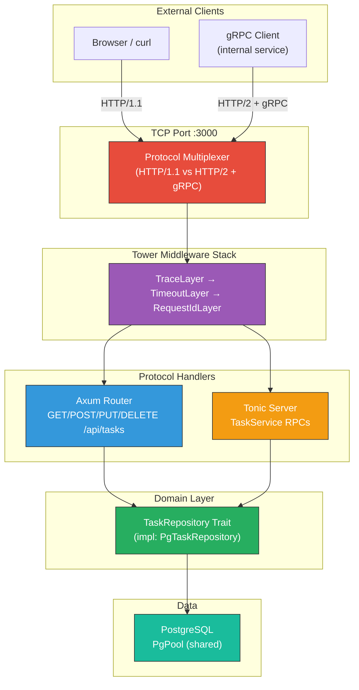
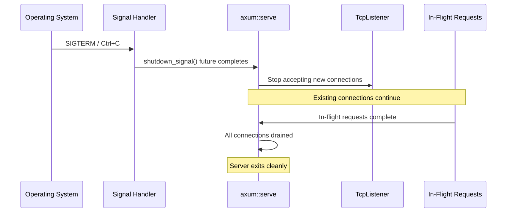

# 8. Capstone: The Unified Polyglot Microservice 🔴

> **What you'll learn:**
> - How to build a production-grade microservice that exposes **both** a REST API (Axum) and a gRPC API (Tonic) on the same TCP port using protocol multiplexing.
> - How to define a clean domain layer with a generic `Repository` trait that is shared between REST handlers and gRPC service implementations.
> - How to set up a `PgPool`, run migrations at startup, and wire Tower middleware across both protocol stacks.
> - How to implement graceful shutdown tied to `tokio::signal::ctrl_c()` so in-flight requests complete before the process exits.

**Cross-references:** This chapter synthesizes every concept from the book: Tower services ([Ch 1](ch01-hyper-tower-service-trait.md)), Axum routing ([Ch 2](ch02-restful-apis-with-axum.md)), Tower middleware ([Ch 3](ch03-tower-middleware-and-telemetry.md)), Tonic gRPC ([Ch 4](ch04-protobufs-and-tonic-basics.md)), streaming ([Ch 5](ch05-bidirectional-streaming-and-channels.md)), SQLx pools ([Ch 6](ch06-async-databases-and-sqlx.md)), and compile-time queries ([Ch 7](ch07-compile-time-checked-queries.md)).

---

## Architecture Overview

The capstone service is a task management microservice. It exposes the same underlying domain logic through two protocols:

1. **REST (Axum)** — for external clients, browsers, and third-party consumers.
2. **gRPC (Tonic)** — for internal service-to-service communication.

Both share `PgPool`, Tower middleware, and the domain `Repository` layer.



---

## Project Structure

```
capstone/
├── Cargo.toml
├── build.rs                    # tonic-build for proto compilation
├── proto/
│   └── task.proto              # gRPC service definition
├── migrations/
│   └── 20240101_000001_create_tasks.sql
└── src/
    ├── main.rs                 # Entrypoint: pool, migrations, server
    ├── config.rs               # Environment-based configuration
    ├── domain.rs               # Task model + Repository trait
    ├── repository.rs           # PgTaskRepository implementation
    ├── rest.rs                 # Axum handlers
    ├── grpc.rs                 # Tonic service implementation
    ├── error.rs                # Shared error types
    └── proto.rs                # Generated protobuf module
```

---

## Step 1: Domain Models and Repository Trait

The domain layer is protocol-agnostic. It knows nothing about HTTP, gRPC, or Axum.

```rust
// src/domain.rs
use chrono::{DateTime, Utc};
use serde::Serialize;

/// The core domain model — used by both REST and gRPC layers.
#[derive(Debug, Clone, Serialize, sqlx::FromRow)]
pub struct Task {
    pub id: i64,
    pub title: String,
    pub description: Option<String>,
    pub completed: bool,
    pub created_at: DateTime<Utc>,
    pub updated_at: DateTime<Utc>,
}

/// Input for creating a task — no id, no timestamps.
#[derive(Debug)]
pub struct CreateTask {
    pub title: String,
    pub description: Option<String>,
}

/// Input for updating a task.
#[derive(Debug)]
pub struct UpdateTask {
    pub title: Option<String>,
    pub description: Option<String>,
    pub completed: Option<bool>,
}

/// The Repository trait: a clean boundary between domain logic and persistence.
/// Both the REST and gRPC layers depend on this trait, not on PgPool directly.
/// This makes the domain testable with mock repositories.
#[trait_variant::make(Send)]
pub trait TaskRepository: Send + Sync {
    async fn find_by_id(&self, id: i64) -> Result<Option<Task>, RepositoryError>;
    async fn find_all(&self, limit: i64, offset: i64) -> Result<Vec<Task>, RepositoryError>;
    async fn create(&self, input: CreateTask) -> Result<Task, RepositoryError>;
    async fn update(&self, id: i64, input: UpdateTask) -> Result<Option<Task>, RepositoryError>;
    async fn delete(&self, id: i64) -> Result<bool, RepositoryError>;
}

/// Repository-level errors — independent of HTTP or gRPC status codes.
#[derive(Debug, thiserror::Error)]
pub enum RepositoryError {
    #[error("Database error: {0}")]
    Database(#[from] sqlx::Error),

    #[error("Unique constraint violation: {0}")]
    Conflict(String),
}
```

---

## Step 2: PostgreSQL Repository Implementation

```rust
// src/repository.rs
use crate::domain::*;
use sqlx::PgPool;

/// Concrete implementation backed by PostgreSQL.
pub struct PgTaskRepository {
    pool: PgPool,
}

impl PgTaskRepository {
    pub fn new(pool: PgPool) -> Self {
        Self { pool }
    }
}

impl TaskRepository for PgTaskRepository {
    async fn find_by_id(&self, id: i64) -> Result<Option<Task>, RepositoryError> {
        let task = sqlx::query_as!(
            Task,
            r#"SELECT id, title, description, completed, created_at, updated_at
               FROM tasks WHERE id = $1"#,
            id
        )
        .fetch_optional(&self.pool)
        .await?;

        Ok(task)
    }

    async fn find_all(&self, limit: i64, offset: i64) -> Result<Vec<Task>, RepositoryError> {
        let tasks = sqlx::query_as!(
            Task,
            r#"SELECT id, title, description, completed, created_at, updated_at
               FROM tasks ORDER BY id LIMIT $1 OFFSET $2"#,
            limit,
            offset
        )
        .fetch_all(&self.pool)
        .await?;

        Ok(tasks)
    }

    async fn create(&self, input: CreateTask) -> Result<Task, RepositoryError> {
        let task = sqlx::query_as!(
            Task,
            r#"INSERT INTO tasks (title, description)
               VALUES ($1, $2)
               RETURNING id, title, description, completed, created_at, updated_at"#,
            input.title,
            input.description
        )
        .fetch_one(&self.pool)
        .await
        .map_err(|e| {
            if let sqlx::Error::Database(ref db_err) = e {
                if db_err.code().as_deref() == Some("23505") {
                    return RepositoryError::Conflict(
                        format!("Task '{}' already exists", input.title)
                    );
                }
            }
            RepositoryError::Database(e)
        })?;

        Ok(task)
    }

    async fn update(&self, id: i64, input: UpdateTask) -> Result<Option<Task>, RepositoryError> {
        // Use COALESCE to only update provided fields
        let task = sqlx::query_as!(
            Task,
            r#"UPDATE tasks SET
                title = COALESCE($1, title),
                description = COALESCE($2, description),
                completed = COALESCE($3, completed),
                updated_at = NOW()
               WHERE id = $4
               RETURNING id, title, description, completed, created_at, updated_at"#,
            input.title,
            input.description,
            input.completed,
            id
        )
        .fetch_optional(&self.pool)
        .await?;

        Ok(task)
    }

    async fn delete(&self, id: i64) -> Result<bool, RepositoryError> {
        let result = sqlx::query!("DELETE FROM tasks WHERE id = $1", id)
            .execute(&self.pool)
            .await?;

        Ok(result.rows_affected() > 0)
    }
}
```

---

## Step 3: Axum REST Handlers

The REST layer adapts domain types to HTTP semantics:

```rust
// src/rest.rs
use crate::domain::*;
use crate::error::AppError;
use axum::{
    extract::{Path, Query, State},
    http::StatusCode,
    response::IntoResponse,
    routing::{delete, get, post, put},
    Json, Router,
};
use serde::Deserialize;
use std::sync::Arc;

#[derive(Deserialize)]
pub struct Pagination {
    #[serde(default = "default_page")]
    page: u32,
    #[serde(default = "default_per_page")]
    per_page: u32,
}
fn default_page() -> u32 { 1 }
fn default_per_page() -> u32 { 20 }

#[derive(Deserialize)]
pub struct CreateTaskRequest {
    title: String,
    description: Option<String>,
}

#[derive(Deserialize)]
pub struct UpdateTaskRequest {
    title: Option<String>,
    description: Option<String>,
    completed: Option<bool>,
}

// Generic over any TaskRepository implementation.
// In production: PgTaskRepository.
// In tests: MockTaskRepository.
pub fn rest_router<R: TaskRepository + 'static>(repo: Arc<R>) -> Router {
    Router::new()
        .route("/tasks", get(list_tasks::<R>).post(create_task::<R>))
        .route(
            "/tasks/{id}",
            get(get_task::<R>).put(update_task::<R>).delete(delete_task::<R>),
        )
        .with_state(repo)
}

async fn list_tasks<R: TaskRepository>(
    State(repo): State<Arc<R>>,
    Query(pagination): Query<Pagination>,
) -> Result<Json<Vec<Task>>, AppError> {
    let offset = ((pagination.page.saturating_sub(1)) * pagination.per_page) as i64;
    let limit = pagination.per_page as i64;
    let tasks = repo.find_all(limit, offset).await?;
    Ok(Json(tasks))
}

async fn get_task<R: TaskRepository>(
    State(repo): State<Arc<R>>,
    Path(id): Path<i64>,
) -> Result<Json<Task>, AppError> {
    let task = repo
        .find_by_id(id)
        .await?
        .ok_or_else(|| AppError::NotFound(format!("Task {id} not found")))?;
    Ok(Json(task))
}

async fn create_task<R: TaskRepository>(
    State(repo): State<Arc<R>>,
    Json(payload): Json<CreateTaskRequest>,
) -> Result<(StatusCode, Json<Task>), AppError> {
    if payload.title.trim().is_empty() {
        return Err(AppError::BadRequest("Title cannot be empty".into()));
    }
    let task = repo
        .create(CreateTask {
            title: payload.title,
            description: payload.description,
        })
        .await?;
    Ok((StatusCode::CREATED, Json(task)))
}

async fn update_task<R: TaskRepository>(
    State(repo): State<Arc<R>>,
    Path(id): Path<i64>,
    Json(payload): Json<UpdateTaskRequest>,
) -> Result<Json<Task>, AppError> {
    let task = repo
        .update(id, UpdateTask {
            title: payload.title,
            description: payload.description,
            completed: payload.completed,
        })
        .await?
        .ok_or_else(|| AppError::NotFound(format!("Task {id} not found")))?;
    Ok(Json(task))
}

async fn delete_task<R: TaskRepository>(
    State(repo): State<Arc<R>>,
    Path(id): Path<i64>,
) -> Result<StatusCode, AppError> {
    let deleted = repo.delete(id).await?;
    if deleted {
        Ok(StatusCode::NO_CONTENT)
    } else {
        Err(AppError::NotFound(format!("Task {id} not found")))
    }
}
```

---

## Step 4: Tonic gRPC Service

The gRPC layer adapts the same domain types to protobuf messages:

```rust
// src/grpc.rs
use crate::domain::*;
use crate::proto::task_service_server::TaskService;
use crate::proto::*;
use std::sync::Arc;
use tonic::{Request, Response, Status};

pub struct TaskGrpcService<R: TaskRepository> {
    repo: Arc<R>,
}

impl<R: TaskRepository> TaskGrpcService<R> {
    pub fn new(repo: Arc<R>) -> Self {
        Self { repo }
    }
}

// Convert domain errors to gRPC Status codes
impl From<RepositoryError> for Status {
    fn from(err: RepositoryError) -> Self {
        match err {
            RepositoryError::Database(e) => {
                tracing::error!(?e, "Database error");
                Status::internal("Internal database error")
            }
            RepositoryError::Conflict(msg) => Status::already_exists(msg),
        }
    }
}

// Convert domain Task to protobuf Task message
fn domain_to_proto(task: Task) -> ProtoTask {
    ProtoTask {
        id: task.id,
        title: task.title,
        description: task.description.unwrap_or_default(),
        completed: task.completed,
        created_at: Some(prost_types::Timestamp {
            seconds: task.created_at.timestamp(),
            nanos: task.created_at.timestamp_subsec_nanos() as i32,
        }),
    }
}

#[tonic::async_trait]
impl<R: TaskRepository + 'static> TaskService for TaskGrpcService<R> {
    async fn get_task(
        &self,
        request: Request<GetTaskRequest>,
    ) -> Result<Response<GetTaskResponse>, Status> {
        let id = request.into_inner().id;
        let task = self
            .repo
            .find_by_id(id)
            .await
            .map_err(Status::from)?
            .ok_or_else(|| Status::not_found(format!("Task {id} not found")))?;

        Ok(Response::new(GetTaskResponse {
            task: Some(domain_to_proto(task)),
        }))
    }

    async fn create_task(
        &self,
        request: Request<CreateTaskRequest>,
    ) -> Result<Response<CreateTaskResponse>, Status> {
        let req = request.into_inner();
        if req.title.trim().is_empty() {
            return Err(Status::invalid_argument("Title cannot be empty"));
        }

        let task = self
            .repo
            .create(CreateTask {
                title: req.title,
                description: if req.description.is_empty() { None } else { Some(req.description) },
            })
            .await
            .map_err(Status::from)?;

        Ok(Response::new(CreateTaskResponse {
            task: Some(domain_to_proto(task)),
        }))
    }

    async fn list_tasks(
        &self,
        request: Request<ListTasksRequest>,
    ) -> Result<Response<ListTasksResponse>, Status> {
        let req = request.into_inner();
        let page = req.page.max(1);
        let per_page = req.per_page.clamp(1, 100);
        let offset = ((page - 1) * per_page) as i64;

        let tasks = self
            .repo
            .find_all(per_page as i64, offset)
            .await
            .map_err(Status::from)?;

        Ok(Response::new(ListTasksResponse {
            tasks: tasks.into_iter().map(domain_to_proto).collect(),
        }))
    }

    async fn delete_task(
        &self,
        request: Request<DeleteTaskRequest>,
    ) -> Result<Response<DeleteTaskResponse>, Status> {
        let id = request.into_inner().id;
        let deleted = self.repo.delete(id).await.map_err(Status::from)?;

        if !deleted {
            return Err(Status::not_found(format!("Task {id} not found")));
        }

        Ok(Response::new(DeleteTaskResponse {}))
    }
}
```

---

## Step 5: Protocol Multiplexing — REST + gRPC on One Port

This is the capstone's signature technique. Both Axum and Tonic speak HTTP, but:
- REST uses **HTTP/1.1** (and sometimes HTTP/2).
- gRPC **requires HTTP/2** and uses the `content-type: application/grpc` header.

We can distinguish them by inspecting the content-type:

```rust
// src/main.rs
use axum::Router;
use hyper::Request;
use hyper_util::rt::TokioIo;
use std::sync::Arc;
use tokio::net::TcpListener;
use tower::ServiceBuilder;
use tower_http::trace::TraceLayer;

mod config;
mod domain;
mod error;
mod grpc;
mod repository;
mod rest;

pub mod proto {
    tonic::include_proto!("task.v1");
}

use domain::TaskRepository;
use repository::PgTaskRepository;

#[tokio::main]
async fn main() -> anyhow::Result<()> {
    // ── Initialize tracing ─────────────────────────────────────────
    tracing_subscriber::registry()
        .with(tracing_subscriber::EnvFilter::try_from_default_env()
            .unwrap_or_else(|_| tracing_subscriber::EnvFilter::new("info")))
        .with(tracing_subscriber::fmt::layer().json())
        .init();

    // ── Database setup ─────────────────────────────────────────────
    let pool = sqlx::postgres::PgPoolOptions::new()
        .max_connections(20)
        .min_connections(5)
        .connect(&std::env::var("DATABASE_URL")?)
        .await?;

    sqlx::migrate!("./migrations").run(&pool).await?;
    tracing::info!("Migrations applied");

    // ── Shared domain layer ────────────────────────────────────────
    let repo = Arc::new(PgTaskRepository::new(pool.clone()));

    // ── Build the Axum REST router ─────────────────────────────────
    let rest_app = Router::new()
        .route("/health", axum::routing::get(|| async { "ok" }))
        .nest("/api", rest::rest_router(repo.clone()));

    // ── Build the Tonic gRPC service ───────────────────────────────
    let grpc_service = tonic::transport::Server::builder()
        .add_service(
            proto::task_service_server::TaskServiceServer::new(
                grpc::TaskGrpcService::new(repo.clone()),
            ),
        )
        .into_service();

    // ── Shared Tower middleware ─────────────────────────────────────
    // This middleware wraps BOTH protocols.
    let tower_middleware = ServiceBuilder::new()
        .layer(
            TraceLayer::new_for_http()
                .make_span_with(tower_http::trace::DefaultMakeSpan::new()
                    .level(tracing::Level::INFO))
                .on_response(tower_http::trace::DefaultOnResponse::new()
                    .level(tracing::Level::INFO)),
        )
        .layer(tower_http::timeout::TimeoutLayer::new(
            std::time::Duration::from_secs(30),
        ));

    // ── Protocol multiplexer ───────────────────────────────────────
    // Inspect the incoming request to decide: gRPC or REST?
    let rest_svc = rest_app.into_service();

    let multiplexer = MultiplexService::new(rest_svc, grpc_service);

    // ── Bind and serve with graceful shutdown ──────────────────────
    let listener = TcpListener::bind("0.0.0.0:3000").await?;
    tracing::info!("Serving REST + gRPC on :3000");

    axum::serve(listener, multiplexer)
        .with_graceful_shutdown(shutdown_signal())
        .await?;

    tracing::info!("Server shutdown complete");
    Ok(())
}

/// Wait for Ctrl+C or SIGTERM (for Kubernetes).
async fn shutdown_signal() {
    let ctrl_c = async {
        tokio::signal::ctrl_c()
            .await
            .expect("Failed to install Ctrl+C handler");
    };

    #[cfg(unix)]
    let terminate = async {
        tokio::signal::unix::signal(tokio::signal::unix::SignalKind::terminate())
            .expect("Failed to install SIGTERM handler")
            .recv()
            .await;
    };

    #[cfg(not(unix))]
    let terminate = std::future::pending::<()>();

    tokio::select! {
        _ = ctrl_c => tracing::info!("Received Ctrl+C, shutting down..."),
        _ = terminate => tracing::info!("Received SIGTERM, shutting down..."),
    }
}
```

### The Multiplexer

The key component: a Tower service that inspects each request and routes it to either the REST or gRPC handler.

```rust
/// A Tower service that routes gRPC requests to Tonic and everything else to Axum.
///
/// gRPC requests are identified by:
/// - HTTP/2 protocol
/// - `content-type: application/grpc` header
#[derive(Clone)]
struct MultiplexService<Rest, Grpc> {
    rest: Rest,
    grpc: Grpc,
}

impl<Rest, Grpc> MultiplexService<Rest, Grpc> {
    fn new(rest: Rest, grpc: Grpc) -> Self {
        Self { rest, grpc }
    }
}

impl<Rest, Grpc, Body> tower::Service<Request<Body>> for MultiplexService<Rest, Grpc>
where
    Rest: tower::Service<Request<Body>, Response = axum::response::Response>
        + Clone + Send + 'static,
    Rest::Future: Send + 'static,
    Rest::Error: Into<Box<dyn std::error::Error + Send + Sync>> + Send,
    Grpc: tower::Service<Request<Body>, Response = axum::response::Response>
        + Clone + Send + 'static,
    Grpc::Future: Send + 'static,
    Grpc::Error: Into<Box<dyn std::error::Error + Send + Sync>> + Send,
    Body: Send + 'static,
{
    type Response = axum::response::Response;
    type Error = Box<dyn std::error::Error + Send + Sync>;
    type Future = std::pin::Pin<
        Box<dyn std::future::Future<Output = Result<Self::Response, Self::Error>> + Send>,
    >;

    fn poll_ready(
        &mut self,
        cx: &mut std::task::Context<'_>,
    ) -> std::task::Poll<Result<(), Self::Error>> {
        // Both services must be ready
        match self.rest.poll_ready(cx) {
            std::task::Poll::Ready(Ok(())) => {}
            other => return other.map_err(Into::into),
        }
        self.grpc.poll_ready(cx).map_err(Into::into)
    }

    fn call(&mut self, req: Request<Body>) -> Self::Future {
        // Check if this is a gRPC request by inspecting the content-type header.
        let is_grpc = req
            .headers()
            .get("content-type")
            .and_then(|ct| ct.to_str().ok())
            .is_some_and(|ct| ct.starts_with("application/grpc"));

        if is_grpc {
            let mut grpc = self.grpc.clone();
            std::mem::swap(&mut self.grpc, &mut grpc);
            Box::pin(async move { grpc.call(req).await.map_err(Into::into) })
        } else {
            let mut rest = self.rest.clone();
            std::mem::swap(&mut self.rest, &mut rest);
            Box::pin(async move { rest.call(req).await.map_err(Into::into) })
        }
    }
}
```

---

## Step 6: Database Migration

```sql
-- migrations/20240101_000001_create_tasks.sql
CREATE TABLE IF NOT EXISTS tasks (
    id          BIGSERIAL     PRIMARY KEY,
    title       TEXT          NOT NULL,
    description TEXT,
    completed   BOOLEAN       NOT NULL DEFAULT FALSE,
    created_at  TIMESTAMPTZ   NOT NULL DEFAULT NOW(),
    updated_at  TIMESTAMPTZ   NOT NULL DEFAULT NOW()
);

CREATE INDEX idx_tasks_completed ON tasks(completed);
CREATE INDEX idx_tasks_created_at ON tasks(created_at DESC);
```

---

## Step 7: Graceful Shutdown Sequence



The `axum::serve(...).with_graceful_shutdown(shutdown_signal())` call:
1. Stops accepting **new** TCP connections immediately.
2. Lets **existing** connections finish their in-flight requests.
3. Exits only when all connections are fully drained.

This is critical for Kubernetes rolling deployments: the pod receives SIGTERM, stops accepting new traffic, completes existing requests, and exits — no dropped connections.

---

## Testing the Capstone

```bash
# Start the server
DATABASE_URL=postgres://localhost/capstone cargo run

# ── REST API tests ──────────────────────────────────────────────────

# Create a task
curl -X POST http://localhost:3000/api/tasks \
  -H "Content-Type: application/json" \
  -d '{"title": "Write capstone", "description": "Build the unified service"}'

# List tasks
curl http://localhost:3000/api/tasks

# Get a specific task
curl http://localhost:3000/api/tasks/1

# Update a task
curl -X PUT http://localhost:3000/api/tasks/1 \
  -H "Content-Type: application/json" \
  -d '{"completed": true}'

# Delete a task
curl -X DELETE http://localhost:3000/api/tasks/1

# Health check
curl http://localhost:3000/health

# ── gRPC API tests (using grpcurl) ─────────────────────────────────

# Create via gRPC
grpcurl -plaintext -d '{"title": "gRPC task", "description": "Created via gRPC"}' \
  localhost:3000 task.v1.TaskService/CreateTask

# List via gRPC
grpcurl -plaintext -d '{"page": 1, "per_page": 10}' \
  localhost:3000 task.v1.TaskService/ListTasks

# Get via gRPC
grpcurl -plaintext -d '{"id": 1}' \
  localhost:3000 task.v1.TaskService/GetTask
```

Both protocols hit the **same database**, through the **same repository**, on the **same port**. A task created via REST is immediately visible via gRPC and vice versa.

---

## `Cargo.toml` Dependencies

```toml
[package]
name = "capstone"
version = "0.1.0"
edition = "2021"

[dependencies]
# Web
axum = "0.8"
tonic = "0.12"
tower = "0.5"
tower-http = { version = "0.6", features = ["trace", "timeout", "cors", "compression-gzip"] }
hyper = "1"
hyper-util = { version = "0.1", features = ["tokio", "service"] }

# Async
tokio = { version = "1", features = ["full"] }
tokio-stream = "0.1"
futures = "0.3"

# Protobuf
prost = "0.13"
prost-types = "0.13"

# Database
sqlx = { version = "0.8", features = ["runtime-tokio", "tls-rustls", "postgres", "chrono", "migrate"] }

# Serialization
serde = { version = "1", features = ["derive"] }
serde_json = "1"
chrono = { version = "0.4", features = ["serde"] }

# Observability
tracing = "0.1"
tracing-subscriber = { version = "0.3", features = ["env-filter", "json"] }

# Error handling
anyhow = "1"
thiserror = "2"

# Utilities
trait-variant = "0.1"

[build-dependencies]
tonic-build = "0.12"
```

---

<details>
<summary><strong>🏋️ Exercise: Extend the Capstone</strong> (click to expand)</summary>

**Challenge:** Now that you have the unified service running, extend it with these production features:

1. **Pagination metadata**: For `ListTasks`, return a JSON envelope with `{ data: [...], page: N, per_page: N, total: N }` on the REST side, and add a `total_count` field to the gRPC `ListTasksResponse`.
2. **Request ID middleware**: Add the `inject_request_id` middleware from Chapter 3 that applies to BOTH REST and gRPC requests (hint: apply it as a Tower layer on the multiplexer, not on individual routers).
3. **Database health check**: Add a `/health/db` endpoint that runs `SELECT 1` and returns 503 if the pool is exhausted.
4. **Graceful shutdown with timeout**: If in-flight requests don't complete within 10 seconds after SIGTERM, force-exit.

<details>
<summary>🔑 Solution</summary>

```rust
// ── 1. Pagination Envelope ─────────────────────────────────────────
#[derive(serde::Serialize)]
struct PaginatedResponse<T: serde::Serialize> {
    data: Vec<T>,
    page: u32,
    per_page: u32,
    total: i64,
}

async fn list_tasks<R: TaskRepository>(
    State(repo): State<Arc<R>>,
    Query(pagination): Query<Pagination>,
) -> Result<Json<PaginatedResponse<Task>>, AppError> {
    let offset = ((pagination.page.saturating_sub(1)) * pagination.per_page) as i64;
    let limit = pagination.per_page as i64;

    let tasks = repo.find_all(limit, offset).await?;
    let total = repo.count().await?; // Add count() to TaskRepository trait

    Ok(Json(PaginatedResponse {
        data: tasks,
        page: pagination.page,
        per_page: pagination.per_page,
        total,
    }))
}

// Add to TaskRepository trait:
// async fn count(&self) -> Result<i64, RepositoryError>;


// ── 2. Request ID as Tower Layer (applies to both protocols) ───────
use axum::http::{Request, HeaderValue};
use tower::{Layer, Service};
use uuid::Uuid;
use std::future::Future;
use std::pin::Pin;

#[derive(Clone)]
struct RequestIdLayer;

impl<S> Layer<S> for RequestIdLayer {
    type Service = RequestIdService<S>;
    fn layer(&self, inner: S) -> Self::Service {
        RequestIdService { inner }
    }
}

#[derive(Clone)]
struct RequestIdService<S> {
    inner: S,
}

impl<S, B> Service<Request<B>> for RequestIdService<S>
where
    S: Service<Request<B>, Response = axum::response::Response> + Clone + Send + 'static,
    S::Future: Send + 'static,
    S::Error: Send + 'static,
    B: Send + 'static,
{
    type Response = S::Response;
    type Error = S::Error;
    type Future = Pin<Box<dyn Future<Output = Result<Self::Response, Self::Error>> + Send>>;

    fn poll_ready(&mut self, cx: &mut std::task::Context<'_>) -> std::task::Poll<Result<(), Self::Error>> {
        self.inner.poll_ready(cx)
    }

    fn call(&mut self, mut req: Request<B>) -> Self::Future {
        let request_id = Uuid::new_v4().to_string();

        // Add to request headers (visible to both REST and gRPC handlers)
        req.headers_mut().insert(
            "x-request-id",
            HeaderValue::from_str(&request_id).unwrap(),
        );

        let mut inner = self.inner.clone();
        std::mem::swap(&mut self.inner, &mut inner);
        let id = request_id.clone();

        Box::pin(async move {
            let mut response = inner.call(req).await?;
            // Add to response headers too
            response.headers_mut().insert(
                "x-request-id",
                HeaderValue::from_str(&id).unwrap(),
            );
            Ok(response)
        })
    }
}

// Apply to the multiplexer:
// let service = ServiceBuilder::new()
//     .layer(RequestIdLayer)
//     .layer(TraceLayer::new_for_http())
//     .service(MultiplexService::new(rest_svc, grpc_svc));


// ── 3. Database health check ───────────────────────────────────────
async fn health_db(State(pool): State<PgPool>) -> impl IntoResponse {
    match sqlx::query_scalar::<_, i32>("SELECT 1")
        .fetch_one(&pool)
        .await
    {
        Ok(_) => (StatusCode::OK, "db: ok"),
        Err(_) => (StatusCode::SERVICE_UNAVAILABLE, "db: unreachable"),
    }
}


// ── 4. Graceful shutdown with force timeout ────────────────────────
#[tokio::main]
async fn main() -> anyhow::Result<()> {
    // ... setup ...

    let server = axum::serve(listener, multiplexer)
        .with_graceful_shutdown(shutdown_signal());

    // Race the server against a force-kill timer
    tokio::select! {
        result = server => {
            result?;
            tracing::info!("Server shut down gracefully");
        }
        // This arm never fires unless the server hangs during shutdown
    }

    Ok(())
}

async fn shutdown_signal() {
    tokio::signal::ctrl_c().await.expect("Ctrl+C handler");
    tracing::info!("Shutdown signal received, draining connections...");

    // Give in-flight requests 10 seconds to complete
    tokio::time::sleep(std::time::Duration::from_secs(10)).await;
    tracing::warn!("Force-exiting after 10s shutdown timeout");
    std::process::exit(0);
}
```

**Key points:**
- `RequestIdLayer` is a proper Tower layer — it works on both REST and gRPC because it operates at the `Service<Request>` level.
- The health check endpoint is separate from the API routes and uses the pool directly.
- The force-exit timeout is a last resort. A well-behaved service should drain within seconds. The 10s timeout catches pathological cases (stuck database connections, deadlocked handlers).
- Pagination metadata makes the REST API self-describing — clients know how many pages exist without guessing.

</details>
</details>

---

> **Key Takeaways**
> - A **domain layer** (`Repository` trait) decouples business logic from protocols. The same `TaskRepository` serves both REST and gRPC.
> - **Protocol multiplexing** routes gRPC (identified by `content-type: application/grpc`) to Tonic and everything else to Axum — both on the same TCP port.
> - **Shared `PgPool`** means one connection pool serves all protocols. Configure `max_connections` once, benefit everywhere.
> - **Tower middleware** (tracing, timeout, request ID) wraps the multiplexer — applying transparently to both REST and gRPC traffic.
> - **Graceful shutdown** with `tokio::signal` and `with_graceful_shutdown()` ensures in-flight requests complete before the process exits — critical for Kubernetes zero-downtime deployments.

---

> **See also:**
> - [Chapter 1: Hyper, Tower, and the Service Trait](ch01-hyper-tower-service-trait.md) — the foundation that makes the multiplexer possible (everything is a `Service`).
> - [Architecture & Design Patterns: Hexagonal Architecture](../architecture-book/src/SUMMARY.md) — for the theoretical basis of the Repository pattern.
> - [Enterprise Rust: OpenTelemetry](../enterprise-rust-book/src/SUMMARY.md) — for exporting traces to Jaeger/Zipkin in production.
> - [Appendix A: Microservices Reference Card](appendix-a-reference-card.md) — quick-reference cheat sheet for everything in this book.
