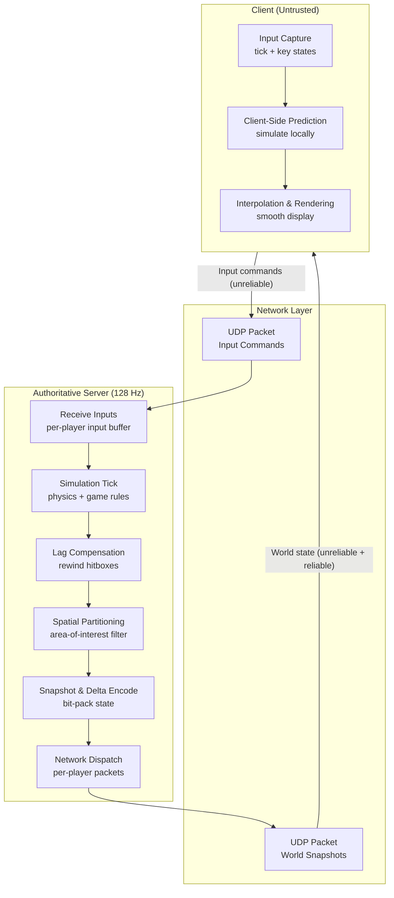

# System Design: The Authoritative Multiplayer Server

## Speaker Intro

This handbook is written from the perspective of a **Principal Game Engine Architect** who has designed, shipped, and firefighted networked multiplayer systems—from 60-player competitive shooters to 100-player battle royale instances—running at 128-tick on dedicated server fleets. The content draws from first-hand experience wrestling with packet loss, desync, rubber-banding, and the iron laws of physics that govern the speed of light across undersea cables.

## Who This Is For

- **Game programmers** who have built single-player game loops and are ready to add deterministic, server-authoritative networking.
- **Backend engineers** curious about why multiplayer game servers are fundamentally different from REST/gRPC microservices—and what makes them among the hardest real-time systems to build.
- **Systems programmers** who want a concrete Rust project that exercises `unsafe`, raw UDP sockets, fixed-point arithmetic, ring buffers, and bit-packing at the byte level.
- **Anyone who has died behind a wall** in an online shooter and wanted to understand *exactly* why—and how the server decided the shot was valid 150 ms in the past.

## Prerequisites

| Concept | Where to Learn |
|---|---|
| Intermediate Rust (ownership, traits, `async`) | [Async Rust](../async-book/src/SUMMARY.md) |
| Basic networking (TCP, UDP, sockets) | [Tokio Internals](../tokio-internals-book/src/SUMMARY.md) |
| Systems-level thinking (memory layout, cache lines) | [Hardware Sympathy](../hardware-sympathy-book/src/SUMMARY.md) |
| Familiarity with a game loop (update → render cycle) | Any game programming introduction |

## How to Use This Book

| Emoji | Meaning |
|---|---|
| 🟢 | **Architecture** — foundational game-loop design and server structure |
| 🟡 | **Network Protocols** — transport layer, reliability, and packet formats |
| 🔴 | **State Synchronization** — prediction, reconciliation, lag compensation, spatial optimization |

Each chapter tackles **one critical challenge** of real-time multiplayer networking. Read them in order—the game loop from Chapter 1 is the foundation every later chapter extends.

## The Problem We Are Solving

> Design an **authoritative multiplayer game server** in Rust capable of hosting a 64-player competitive action game at **128 server ticks per second**, with sub-frame lag compensation, client-side prediction, and bandwidth consumption under **256 Kbps per player**—all while keeping the server authoritative so that cheating is structurally impossible from the client.

The system we will build has these non-negotiable requirements:

| Requirement | Target |
|---|---|
| Tick rate | 128 Hz (7.8125 ms per tick) |
| Max players per instance | 64 |
| Transport | Custom reliable-UDP over raw sockets |
| Client prediction error | Corrected within 1 frame, no visible snap |
| Hit registration window | Rewind up to 250 ms of server history |
| Bandwidth per player | ≤ 256 Kbps outbound (≤ 32 KB/s) |
| Packet size | < 1280 bytes (safe UDP MTU) |
| State authority | Server-authoritative; clients are untrusted |

## Pacing Guide

| Chapter | Topic | Time | Checkpoint |
|---|---|---|---|
| Ch 0 | Introduction & Architecture Overview | 30 min | Understand the design constraints |
| Ch 1 | The Game Loop and Tick Rates | 4–6 hours | Fixed-timestep loop running at 128 Hz |
| Ch 2 | UDP vs TCP — Custom Reliability | 6–8 hours | Reliable-UDP channel with selective retransmission |
| Ch 3 | Client-Side Prediction & Reconciliation | 6–8 hours | Predicted movement reconciled against server snapshots |
| Ch 4 | Lag Compensation & Hit Registration | 6–8 hours | Server-side hitbox rewinding with historical state buffer |
| Ch 5 | Spatial Partitioning & Data Serialization | 5–7 hours | Area-of-interest filtering and bit-packed delta compression |

**Total: ~28–38 hours** of focused study.

## Table of Contents

### Part I: Server Foundations
- **Chapter 1 — The Game Loop and Tick Rates 🟢** — The heartbeat of the server. Designing a fixed-timestep game loop in Rust running at 128 Hz. Separating the simulation step from the network dispatch step. Understanding why a variable timestep is a desync factory.

### Part II: Network Transport
- **Chapter 2 — UDP vs TCP — Custom Reliability 🟡** — Why TCP head-of-line blocking kills action games. Opening a raw UDP socket. Architecting a custom reliable-UDP protocol that only retransmits critical state (like damage events) while letting ephemeral state (like position snapshots) drop gracefully.

### Part III: State Synchronization
- **Chapter 3 — Client-Side Prediction and Server Reconciliation 🔴** — Hiding the ping. How the client simulates movement instantly while waiting for the server. Handling server corrections seamlessly without snapping or rubber-banding the player—even at 200 ms RTT.
- **Chapter 4 — Lag Compensation and Hit Registration 🔴** — "I shot him on my screen!" Implementing a historical state buffer on the server. Rewinding the hitboxes of all players to the exact millisecond the shooter pressed the trigger to verify the shot.
- **Chapter 5 — Spatial Partitioning and Data Serialization 🔴** — Bandwidth optimization. Using grid-based spatial hashing so the server only sends updates to players about entities within their area of interest. Bit-packing state updates with delta compression to keep packets well under the 1280-byte safe MTU.

## Architecture Overview

## Why Rust?

Game servers written in C++ suffer from use-after-free bugs that crash production instances at 3 AM. Game servers in C# or Java suffer from GC pauses that spike frame times above the tick budget. Rust gives us:

| Property | Benefit for Game Servers |
|---|---|
| No garbage collector | Deterministic tick durations—no 20 ms GC pauses |
| Ownership model | Eliminate data races in the ECS and network threads |
| Zero-cost abstractions | Bit-packing, SIMD math, and arena allocators at C speed |
| `unsafe` escape hatch | Raw UDP sockets and `mmap` ring buffers when needed |
| Fearless concurrency | Separate simulation and I/O threads without locks on the hot path |

## Companion Guides

This handbook builds on concepts from several other books in the Rust Training curriculum:

| Book | Relevant Concepts |
|---|---|
| [Async Rust](../async-book/src/SUMMARY.md) | Tokio runtime, `async`/`await`, cancellation |
| [Hardware Sympathy](../hardware-sympathy-book/src/SUMMARY.md) | Cache lines, SIMD, memory layout for ECS |
| [Zero-Copy Architecture](../zero-copy-book/src/SUMMARY.md) | `io_uring`, ring buffers, `rkyv` serialization |
| [Tokio Internals](../tokio-internals-book/src/SUMMARY.md) | `mio`, `epoll`, reactor pattern for UDP |
| [Algorithms & Concurrency](../algorithms-concurrency-book/src/SUMMARY.md) | Lock-free queues, SPSC ring buffers |
