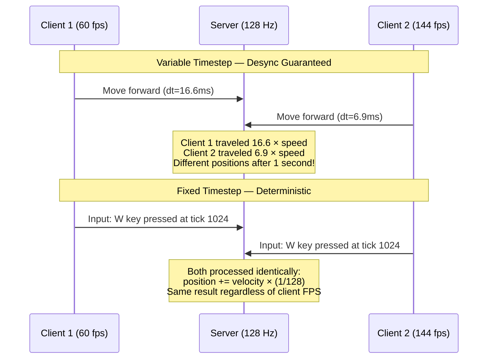
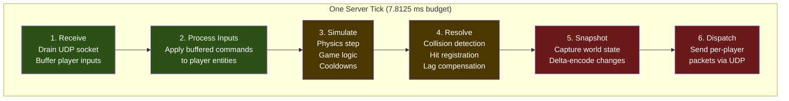
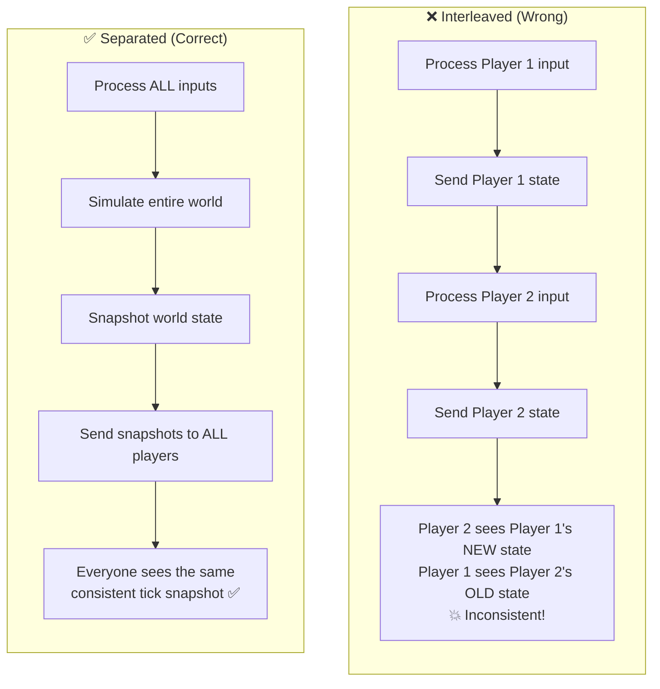
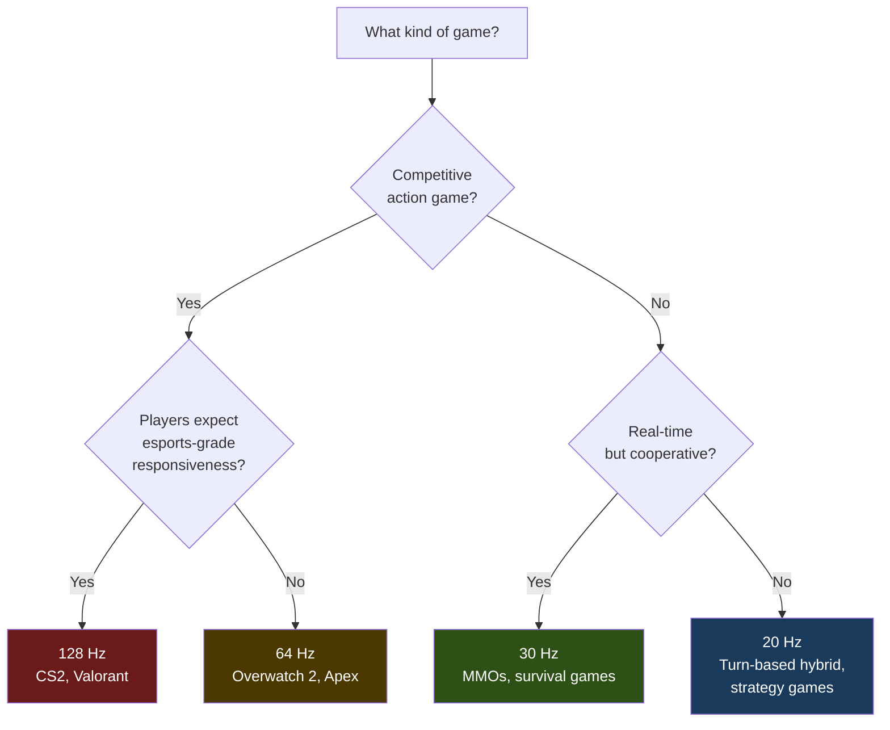
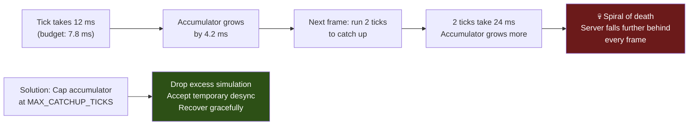

# 1. The Game Loop and Tick Rates 🟢

> **The Problem:** A multiplayer game server must advance the entire simulation—physics, game logic, hit detection, cooldowns—in **perfectly deterministic, fixed-size time steps**. If the loop runs at a variable rate, two clients observing the same inputs will diverge within seconds. If the loop takes longer than 7.8 ms (at 128 Hz), the server falls behind real time and players experience "server lag." Designing this loop correctly is the single most important architectural decision in any multiplayer game.

---

## Why Fixed Timestep Is Non-Negotiable

In a single-player game, you can get away with a variable timestep (`delta_time = time_since_last_frame`). The physics might jitter slightly, but nobody notices. In multiplayer, variable timestep is a **desync factory**:

| Property | Variable Timestep | Fixed Timestep |
|---|---|---|
| Determinism | ❌ Floating-point drift across machines | ✅ Bit-identical simulation given same inputs |
| Reproducibility | ❌ Cannot replay — different `dt` each frame | ✅ Replay by feeding same input sequence |
| Server authority | ❌ Clients and server diverge | ✅ Server and clients agree on world state |
| Physics stability | ❌ Explosions at high `dt`, tunneling | ✅ Consistent collision detection |
| Tick budget analysis | ❌ No fixed deadline to measure against | ✅ Clear 7.8 ms budget at 128 Hz |

### The Desync Problem Visualized



---

## Anatomy of a 128 Hz Server Tick

Every tick, the server performs a precise sequence of operations within a **7.8125 ms budget**:



### Budget Breakdown (128 Hz = 7812 μs per tick)

| Phase | Typical Budget | Notes |
|---|---|---|
| 1. Receive inputs | ~200 μs | Non-blocking `recvmmsg` batch read |
| 2. Process inputs | ~300 μs | Validate and apply to ECS components |
| 3. Simulate | ~2000 μs | Physics, AI, game rules |
| 4. Resolve | ~2500 μs | Collision, hit reg, lag compensation |
| 5. Snapshot | ~1500 μs | Delta encoding, bit-packing |
| 6. Dispatch | ~800 μs | `sendmmsg` batch write |
| **Headroom** | **~512 μs** | Safety margin for spikes |

If the total exceeds 7812 μs, the server misses the tick deadline and must **catch up**—running simulation steps without networking until it's back on schedule.

---

## The Fixed-Timestep Loop in Rust

### Naive Approach: `thread::sleep` per tick

```rust,ignore
use std::time::{Duration, Instant};

const TICK_RATE: u64 = 128;
const TICK_DURATION: Duration = Duration::from_nanos(1_000_000_000 / TICK_RATE);

fn naive_game_loop() {
    let mut tick: u64 = 0;
    loop {
        let tick_start = Instant::now();

        // --- Simulation ---
        simulate_tick(tick);
        dispatch_snapshots(tick);

        tick += 1;

        // 💥 PROBLEM: sleep() has ~1-15 ms jitter on most OSes.
        // At 128 Hz (7.8 ms budget), a 5 ms oversleep means we
        // effectively run at ~50 Hz for that tick.
        let elapsed = tick_start.elapsed();
        if elapsed < TICK_DURATION {
            std::thread::sleep(TICK_DURATION - elapsed);
        }
    }
}
# fn simulate_tick(_: u64) {}
# fn dispatch_snapshots(_: u64) {}
```

**Why this fails:** `std::thread::sleep` delegates to the OS scheduler. On Linux, the default timer resolution is ~1–4 ms. On Windows, it's ~15.6 ms unless you call `timeBeginPeriod(1)`. A 128 Hz server cannot tolerate this jitter.

### Production Approach: Accumulator Loop with Spin-Wait

The correct pattern uses a **time accumulator** that decouples wall-clock time from simulation steps, combined with a **spin-wait** for the final microseconds:

```rust,ignore
use std::time::{Duration, Instant};

const TICK_RATE: u64 = 128;
const TICK_DURATION: Duration = Duration::from_nanos(1_000_000_000 / TICK_RATE);
const MAX_CATCHUP_TICKS: u32 = 5; // prevent spiral of death

struct GameServer {
    tick: u64,
    accumulator: Duration,
    last_time: Instant,
}

impl GameServer {
    fn new() -> Self {
        Self {
            tick: 0,
            accumulator: Duration::ZERO,
            last_time: Instant::now(),
        }
    }

    fn run(&mut self) {
        loop {
            // Measure elapsed wall time since last iteration
            let now = Instant::now();
            let frame_time = now - self.last_time;
            self.last_time = now;

            // Add elapsed time to the accumulator
            self.accumulator += frame_time;

            // Cap accumulator to prevent spiral of death:
            // If the server falls behind by more than MAX_CATCHUP_TICKS,
            // we drop simulation steps rather than freezing the network.
            let max_accumulator = TICK_DURATION * MAX_CATCHUP_TICKS;
            if self.accumulator > max_accumulator {
                eprintln!(
                    "WARNING: Server overloaded, dropping {} ms of simulation",
                    (self.accumulator - max_accumulator).as_millis()
                );
                self.accumulator = max_accumulator;
            }

            // Consume accumulated time in fixed-size steps
            let mut ticks_this_frame = 0u32;
            while self.accumulator >= TICK_DURATION {
                self.accumulator -= TICK_DURATION;
                self.simulate(self.tick);
                self.tick += 1;
                ticks_this_frame += 1;
            }

            // Only dispatch network after ALL simulation steps are done.
            // This prevents sending intermediate states.
            if ticks_this_frame > 0 {
                self.dispatch_snapshots(self.tick - 1);
            }

            // Spin-wait for remaining time (sub-millisecond precision)
            self.precise_sleep(TICK_DURATION.saturating_sub(self.accumulator));
        }
    }

    fn precise_sleep(&self, duration: Duration) {
        if duration.is_zero() {
            return;
        }
        // Sleep for the bulk of the wait (leave 1 ms for spin)
        let spin_threshold = Duration::from_millis(1);
        if duration > spin_threshold {
            std::thread::sleep(duration - spin_threshold);
        }
        // Spin-wait for the remaining microseconds
        let target = Instant::now() + duration.min(spin_threshold);
        while Instant::now() < target {
            std::hint::spin_loop();
        }
    }

    fn simulate(&self, _tick: u64) {
        // Physics, game logic, cooldowns — all at fixed dt = 1/128
    }

    fn dispatch_snapshots(&self, _tick: u64) {
        // Build per-player snapshots, delta-encode, send via UDP
    }
}
```

---

## Separating Simulation from Network Dispatch

A critical architectural insight: **never interleave simulation and networking**. The network dispatch must only happen *after* the full simulation step completes.

### Why Separation Matters



### Two-Thread Architecture

For servers that need maximum throughput, you can separate the simulation and network threads entirely using a **double-buffer** pattern:

```rust,ignore
use std::sync::atomic::{AtomicBool, Ordering};
use std::sync::Arc;

/// A double-buffered snapshot for lock-free sim→net communication.
/// The simulation thread writes to the back buffer, then swaps.
/// The network thread always reads from the front buffer.
struct DoubleBuffer<T> {
    buffers: [std::sync::Mutex<T>; 2],
    /// false = buffer[0] is front, true = buffer[1] is front
    front_index: AtomicBool,
}

impl<T: Default> DoubleBuffer<T> {
    fn new() -> Self {
        Self {
            buffers: [
                std::sync::Mutex::new(T::default()),
                std::sync::Mutex::new(T::default()),
            ],
            front_index: AtomicBool::new(false),
        }
    }

    /// Simulation thread: get mutable access to the BACK buffer.
    fn back_buffer(&self) -> std::sync::MutexGuard<'_, T> {
        let back = !self.front_index.load(Ordering::Acquire);
        self.buffers[back as usize].lock().unwrap()
    }

    /// Simulation thread: swap front and back after writing.
    fn swap(&self) {
        let current = self.front_index.load(Ordering::Acquire);
        self.front_index.store(!current, Ordering::Release);
    }

    /// Network thread: read the FRONT buffer (latest complete snapshot).
    fn front_buffer(&self) -> std::sync::MutexGuard<'_, T> {
        let front = self.front_index.load(Ordering::Acquire);
        self.buffers[front as usize].lock().unwrap()
    }
}
```

This pattern ensures the network thread never reads a partially-written state—it always gets the **last fully completed tick snapshot**.

---

## Tick Rates: 60 Hz vs 128 Hz

The tick rate determines the temporal resolution of your simulation. Higher tick rates mean smoother gameplay but cost more CPU:

| Property | 60 Hz | 128 Hz |
|---|---|---|
| Tick duration | 16.67 ms | 7.81 ms |
| Input sampling | 60 samples/sec | 128 samples/sec |
| Physics resolution | Coarse — fast objects may tunnel | Fine — reliable collision |
| Network bandwidth | ~60 snapshots/sec | ~128 snapshots/sec (2× bandwidth) |
| CPU cost per player | Baseline | ~2× baseline |
| Use case | MMOs, cooperative games | Competitive shooters, fighting games |

### Choosing Your Tick Rate



### The Bandwidth Tradeoff

At 128 Hz with 64 players, each needing ~40 bytes of delta state per entity visible to them:

$$\text{Outbound per player} = \text{tick rate} \times \text{visible entities} \times \text{bytes per entity}$$

$$128 \times 30 \times 40 = 153{,}600 \text{ bytes/sec} = 150 \text{ KB/s} \approx 1.2 \text{ Mbps}$$

That's over our 256 Kbps budget! This is exactly why **Chapters 3–5** exist: delta compression, spatial filtering, and bit-packing will reduce this by 6–8×.

---

## Handling Overload: The Spiral of Death

If a single tick takes longer than the tick duration, the accumulator grows. The server then tries to run **multiple simulation steps** to catch up—but each step takes time, making the accumulator grow even more. This is the **spiral of death**.



The `MAX_CATCHUP_TICKS` constant in our loop caps the accumulator. If the server falls behind by more than 5 ticks, it *drops* the excess time and logs a warning. This causes a momentary physics skip, but the server recovers instead of spiraling into a freeze.

---

## Measuring Tick Performance

In production, every tick must be profiled. Here's a lightweight tick profiler:

```rust,ignore
use std::time::{Duration, Instant};

struct TickProfiler {
    tick_times: Vec<Duration>,  // ring buffer of recent tick durations
    index: usize,
    capacity: usize,
}

impl TickProfiler {
    fn new(capacity: usize) -> Self {
        Self {
            tick_times: vec![Duration::ZERO; capacity],
            index: 0,
            capacity,
        }
    }

    fn record(&mut self, duration: Duration) {
        self.tick_times[self.index % self.capacity] = duration;
        self.index += 1;
    }

    fn average(&self) -> Duration {
        let count = self.index.min(self.capacity);
        if count == 0 {
            return Duration::ZERO;
        }
        let sum: Duration = self.tick_times[..count].iter().sum();
        sum / count as u32
    }

    fn p99(&self) -> Duration {
        let count = self.index.min(self.capacity);
        if count == 0 {
            return Duration::ZERO;
        }
        let mut sorted: Vec<_> = self.tick_times[..count].to_vec();
        sorted.sort();
        sorted[(count as f64 * 0.99) as usize]
    }

    fn over_budget(&self, budget: Duration) -> f64 {
        let count = self.index.min(self.capacity);
        if count == 0 {
            return 0.0;
        }
        let over = self.tick_times[..count]
            .iter()
            .filter(|&&t| t > budget)
            .count();
        over as f64 / count as f64 * 100.0
    }
}
```

Alert thresholds for a 128 Hz server:

| Metric | Healthy | Warning | Critical |
|---|---|---|---|
| Average tick time | < 5 ms | 5–7 ms | > 7 ms |
| P99 tick time | < 7 ms | 7–7.5 ms | > 7.5 ms |
| Ticks over budget | 0% | < 1% | > 1% |
| Catchup ticks/min | 0 | < 10 | > 10 |

---

## Putting It All Together: The Server Skeleton

Here is the complete skeleton that ties the game loop, profiler, and two-phase (simulate → dispatch) architecture together:

```rust,ignore
use std::time::{Duration, Instant};

const TICK_RATE: u64 = 128;
const TICK_DURATION: Duration = Duration::from_nanos(1_000_000_000 / TICK_RATE);
const MAX_CATCHUP_TICKS: u32 = 5;

pub struct GameServer {
    tick: u64,
    accumulator: Duration,
    last_time: Instant,
    // world: GameWorld,          // ECS or custom world state
    // net: NetworkLayer,         // UDP socket + connection map
    // profiler: TickProfiler,    // from above
}

impl GameServer {
    pub fn run(&mut self) -> ! {
        self.last_time = Instant::now();

        loop {
            let now = Instant::now();
            self.accumulator += now - self.last_time;
            self.last_time = now;

            // Cap accumulator to prevent spiral of death
            let max = TICK_DURATION * MAX_CATCHUP_TICKS;
            if self.accumulator > max {
                self.accumulator = max;
            }

            // Fixed-timestep simulation loop
            let mut ticks_simulated = 0u32;
            while self.accumulator >= TICK_DURATION {
                let tick_start = Instant::now();

                // Phase 1: Drain and buffer all player inputs
                // self.net.receive_inputs(&mut self.world);

                // Phase 2: Apply inputs to entities
                // self.world.apply_inputs(self.tick);

                // Phase 3: Simulate one fixed step (dt = 1/128)
                // self.world.simulate();

                // Phase 4: Resolve hits with lag compensation
                // self.world.resolve_hits(self.tick);

                self.accumulator -= TICK_DURATION;
                self.tick += 1;
                ticks_simulated += 1;

                let _tick_time = tick_start.elapsed();
                // self.profiler.record(tick_time);
            }

            // Phase 5+6: Snapshot and dispatch AFTER all sim steps
            if ticks_simulated > 0 {
                // let snapshot = self.world.snapshot(self.tick - 1);
                // self.net.dispatch(&snapshot);
            }

            // Precise sleep until next tick
            let remaining = TICK_DURATION.saturating_sub(self.accumulator);
            self.precise_sleep(remaining);
        }
    }

    fn precise_sleep(&self, duration: Duration) {
        if duration.is_zero() {
            return;
        }
        let spin_start = Duration::from_millis(1);
        if duration > spin_start {
            std::thread::sleep(duration - spin_start);
        }
        let target = Instant::now() + duration.min(spin_start);
        while Instant::now() < target {
            std::hint::spin_loop();
        }
    }
}
```

This skeleton will be extended in every subsequent chapter. Chapter 2 fills in the UDP socket and packet layer. Chapter 3 adds client prediction and reconciliation. Chapter 4 adds the historical state buffer for lag compensation. Chapter 5 adds spatial partitioning and bit-packing to fit everything under the bandwidth budget.

---

> **Key Takeaways**
>
> 1. **Fixed timestep is non-negotiable** for multiplayer—variable `dt` guarantees desync across clients and server.
> 2. **Separate simulation from dispatch:** simulate all ticks first, then send one snapshot. Never interleave per-player I/O with the simulation step.
> 3. **Use an accumulator loop** with spin-wait for sub-millisecond precision. `thread::sleep` alone is too coarse for 128 Hz.
> 4. **Cap the accumulator** to prevent the spiral of death. It's better to drop simulation time than to freeze the server.
> 5. **Profile every tick** in production. If p99 exceeds 7 ms at 128 Hz, you're one CPU spike away from dropped ticks.
