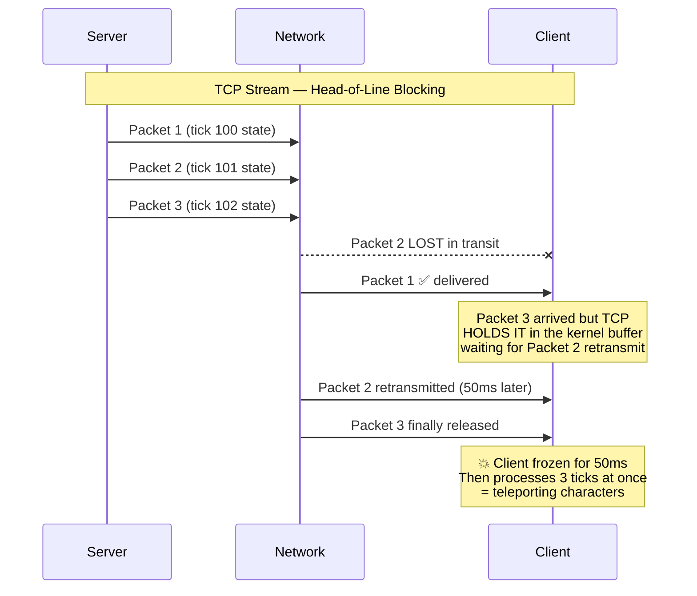
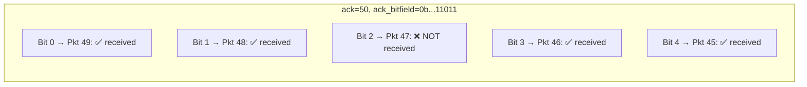
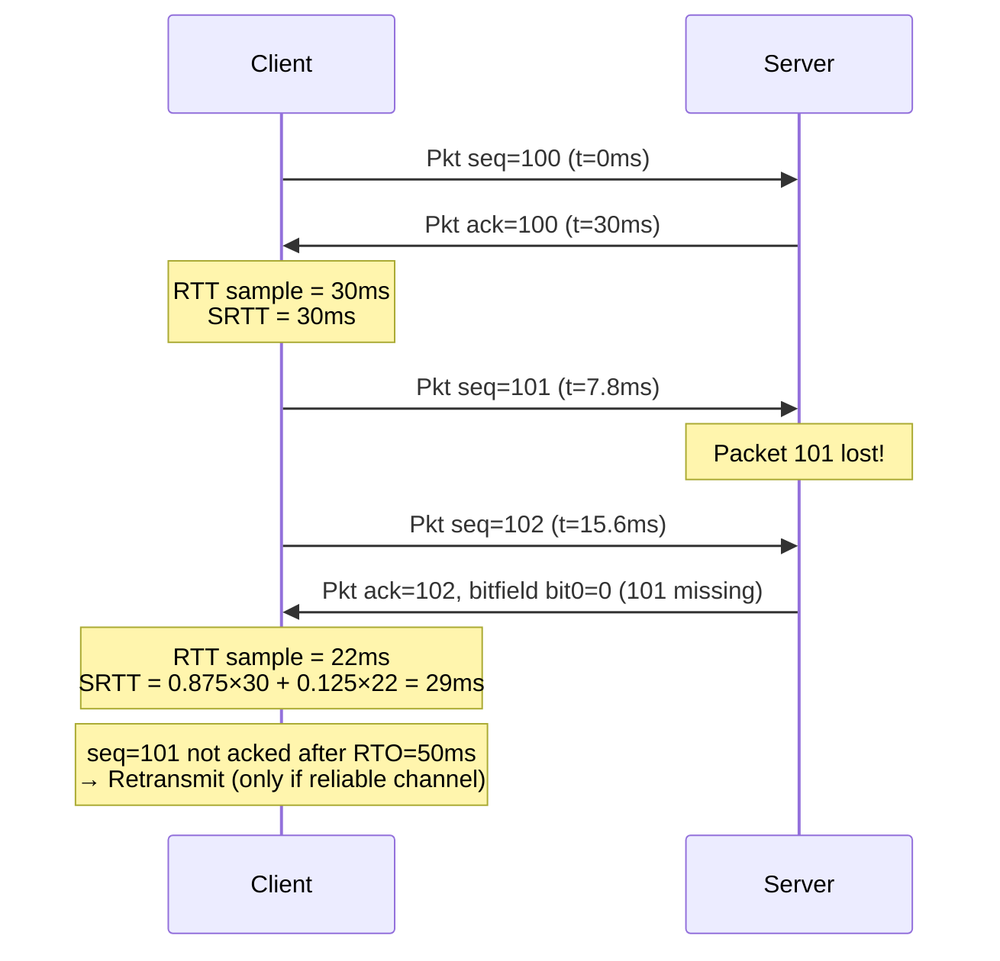
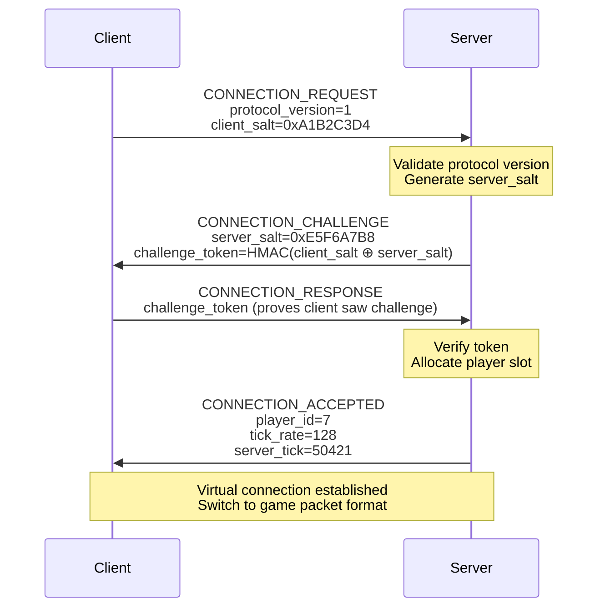

# 2. UDP vs TCP — Custom Reliability 🟡

> **The Problem:** TCP guarantees that every byte arrives, in order, exactly once. This sounds perfect—until you realize it means a *single dropped packet* stalls the entire stream while TCP retransmits and reorders. In a 128 Hz game server, a 50 ms stall means 6 missed ticks, and the player's character teleports forward in a sickening lurch. We need a transport that delivers fresh data immediately, even when older packets are lost—custom reliability built on top of raw UDP.

---

## Why TCP Kills Action Games

TCP was designed for file transfers and web pages, where **completeness matters more than latency**. Games have the opposite requirement: **freshness matters more than completeness**.

### Head-of-Line Blocking



With TCP, even a **single lost packet** blocks all subsequent data, regardless of whether that data is independent. This is **head-of-line (HoL) blocking** and it is fundamentally unfixable—it's baked into TCP's specification.

### The Core Problem: Game State Has Two Categories

| Category | Examples | Lost Packet Impact | Correct Transport |
|---|---|---|---|
| **Ephemeral** (overwritten every tick) | Player position, rotation, velocity, animation state | None — next tick overwrites it | **Unreliable UDP** — drop and move on |
| **Critical** (must arrive exactly once) | Damage event, kill, item pickup, ability activation | Game-breaking — player health desyncs | **Reliable UDP** — retransmit if lost |

TCP treats *everything* as critical. We need a transport that lets us choose **per-message** whether delivery is reliable or fire-and-forget.

---

## Opening a Raw UDP Socket in Rust

### TCP Blocking Approach (What NOT to Do)

```rust,ignore
use std::io::{Read, Write};
use std::net::TcpStream;

fn tcp_game_client() -> std::io::Result<()> {
    let mut stream = TcpStream::connect("game.server:7777")?;

    // 💥 This blocks until ALL bytes arrive, in order.
    // If packet 2 of 3 is lost, we wait for TCP retransmit.
    let mut buf = [0u8; 1024];
    let n = stream.read(&mut buf)?; // Blocks here during HoL stall

    // By the time we get data, it may be 50-100ms stale
    process_stale_state(&buf[..n]);
    Ok(())
}
# fn process_stale_state(_: &[u8]) {}
```

### UDP Non-blocking Approach (Correct)

```rust,ignore
use std::net::UdpSocket;

fn udp_game_server() -> std::io::Result<()> {
    let socket = UdpSocket::bind("0.0.0.0:7777")?;
    socket.set_nonblocking(true)?;

    let mut buf = [0u8; 1280]; // Safe MTU size
    loop {
        match socket.recv_from(&mut buf) {
            Ok((len, src)) => {
                // ✅ Each datagram is independent.
                // Lost packets don't block subsequent ones.
                // We always process the FRESHEST data available.
                process_packet(&buf[..len], src);
            }
            Err(ref e) if e.kind() == std::io::ErrorKind::WouldBlock => {
                // No data ready — continue the game loop
            }
            Err(e) => return Err(e),
        }
    }
}
# fn process_packet(_: &[u8], _: std::net::SocketAddr) {}
```

Key differences:

| Property | TCP | UDP |
|---|---|---|
| Delivery | Guaranteed, ordered | Best-effort, unordered |
| Unit | Byte stream (no message boundaries) | Datagrams (discrete packets) |
| HoL blocking | Yes — one lost byte stalls everything | No — each datagram independent |
| Connection | Stateful (SYN/ACK handshake) | Connectionless |
| Overhead per packet | 20+ bytes (TCP header) + timestamps | 8 bytes (UDP header) |
| Congestion control | TCP manages it (can throttle game) | You manage it (full control) |

---

## Designing a Custom Reliable-UDP Protocol

Raw UDP gives us no guarantees. We need to build a thin reliability layer on top—but *only for messages that need it*.

### Packet Header Format

Every UDP datagram we send starts with a compact header:

```
┌──────────────────────────────────────────────────────────┐
│  protocol_id: u32    (4 bytes)  — Magic number 0xG4M3    │
│  sequence: u16       (2 bytes)  — Sender's packet seq#   │
│  ack: u16            (2 bytes)  — Last received seq#      │
│  ack_bitfield: u32   (4 bytes)  — Acks for previous 32    │
│  channel_count: u8   (1 byte)   — Channels in this packet │
│  payload: [u8]       (variable) — Channel messages         │
└──────────────────────────────────────────────────────────┘
Total header: 13 bytes
```

```rust,ignore
/// Header prepended to every UDP datagram.
#[repr(C, packed)]
struct PacketHeader {
    /// Magic number to reject non-game traffic.
    protocol_id: u32,
    /// Monotonically increasing sequence number (wraps at u16::MAX).
    sequence: u16,
    /// The most recent remote sequence number we have received.
    ack: u16,
    /// Bitfield: bit N = 1 means we received (ack - N - 1).
    /// Covers ack history for the previous 32 packets.
    ack_bitfield: u32,
    /// Number of channel messages packed into this datagram.
    channel_count: u8,
}
```

### The Ack Bitfield Trick

Instead of sending explicit ACK packets (wasting bandwidth), we **piggyback** acknowledgments on every outgoing packet. The `ack` field says "I received your packet #X" and `ack_bitfield` encodes which of the 32 packets *before* X we also received:



```rust,ignore
/// Check whether a specific sequence number has been acknowledged.
fn is_acked(ack: u16, ack_bitfield: u32, sequence: u16) -> bool {
    if sequence == ack {
        return true;
    }
    // Handle wrapping subtraction for u16 sequence numbers
    let diff = ack.wrapping_sub(sequence);
    if diff == 0 || diff > 32 {
        return false; // Too old or in the future
    }
    // diff=1 → bit 0, diff=2 → bit 1, etc.
    (ack_bitfield & (1 << (diff - 1))) != 0
}
```

This gives us ACK coverage for the last 33 packets (ack + 32 bits) in just **6 bytes**. Since we send packets at 128 Hz, 33 packets covers ~258 ms—more than enough for round-trip acknowledgment.

---

## Channel Architecture: Unreliable, Reliable-Ordered, Reliable-Unordered

We multiplex different message types onto **logical channels** within a single UDP datagram:

| Channel | Semantics | Use Case | Behavior on Loss |
|---|---|---|---|
| **0: Unreliable** | Fire-and-forget | Position, rotation, velocity | Drop — next tick supersedes |
| **1: Reliable-Ordered** | Retransmit, deliver in order | Chat, game events sequence | Hold until gap filled |
| **2: Reliable-Unordered** | Retransmit, deliver immediately | Damage, item pickup, ability | Deliver as soon as received |

```rust,ignore
#[derive(Clone, Copy, PartialEq)]
enum ChannelType {
    Unreliable,
    ReliableOrdered,
    ReliableUnordered,
}

/// A message queued for sending on a specific channel.
struct OutgoingMessage {
    channel: ChannelType,
    data: Vec<u8>,
    sequence: u16,            // per-channel sequence number
    first_sent_tick: u64,
    last_sent_tick: u64,
    acked: bool,
}

/// Per-connection state for the reliable-UDP layer.
struct Connection {
    remote_addr: std::net::SocketAddr,

    // Packet-level sequencing (for the ack bitfield)
    local_sequence: u16,
    remote_sequence: u16,

    // Per-channel send and receive buffers
    send_buffers: [Vec<OutgoingMessage>; 3],
    recv_buffers: [Vec<Option<Vec<u8>>>; 3],

    // RTT estimation (for retransmit timing)
    rtt_ms: f32,
    rtt_variance: f32,
}
```

---

## Selective Retransmission

The key insight: **only retransmit messages on reliable channels**. Unreliable messages (Channel 0) are sent once and forgotten. Reliable messages are kept in the send buffer until they are acknowledged via the ack bitfield.

```rust,ignore
impl Connection {
    /// Called every tick to build the next outgoing packet.
    fn build_packet(&mut self, current_tick: u64) -> Vec<u8> {
        let mut packet = Vec::with_capacity(1280);

        // Write header
        let header = PacketHeader {
            protocol_id: 0x47344D33, // "G4M3"
            sequence: self.local_sequence,
            ack: self.remote_sequence,
            ack_bitfield: self.compute_ack_bitfield(),
            channel_count: 0, // patched later
        };
        packet.extend_from_slice(&header.protocol_id.to_le_bytes());
        packet.extend_from_slice(&header.sequence.to_le_bytes());
        packet.extend_from_slice(&header.ack.to_le_bytes());
        packet.extend_from_slice(&header.ack_bitfield.to_le_bytes());
        let channel_count_offset = packet.len();
        packet.push(0); // placeholder

        let mut channel_count = 0u8;

        // Channel 0: Unreliable — send newest, discard old
        if let Some(msg) = self.send_buffers[0].pop() {
            Self::write_channel_message(&mut packet, 0, &msg.data);
            channel_count += 1;
            // Don't keep in buffer — fire and forget
        }

        // Channel 1 & 2: Reliable — send un-acked, retransmit if needed
        for ch in 1..=2u8 {
            for msg in &mut self.send_buffers[ch as usize] {
                if msg.acked {
                    continue;
                }
                let retransmit_threshold = self.retransmit_timeout();
                let ticks_since_sent = current_tick.saturating_sub(msg.last_sent_tick);
                let time_since_sent_ms = ticks_since_sent as f32 * 7.8125;

                if msg.last_sent_tick == 0 || time_since_sent_ms >= retransmit_threshold {
                    // Room check: don't exceed MTU
                    if packet.len() + msg.data.len() + 4 > 1280 {
                        break; // defer to next packet
                    }
                    Self::write_channel_message(&mut packet, ch, &msg.data);
                    msg.last_sent_tick = current_tick;
                    channel_count += 1;
                }
            }
        }

        // Patch channel count
        packet[channel_count_offset] = channel_count;

        self.local_sequence = self.local_sequence.wrapping_add(1);
        packet
    }

    fn write_channel_message(packet: &mut Vec<u8>, channel: u8, data: &[u8]) {
        packet.push(channel);
        packet.extend_from_slice(&(data.len() as u16).to_le_bytes());
        packet.extend_from_slice(data);
    }

    /// Adaptive retransmission timeout based on smoothed RTT.
    /// Uses Jacobson's algorithm (same concept as TCP, but we control it).
    fn retransmit_timeout(&self) -> f32 {
        // RTO = SRTT + 4 × RTTVAR, clamped to [50ms, 500ms]
        (self.rtt_ms + 4.0 * self.rtt_variance).clamp(50.0, 500.0)
    }

    fn compute_ack_bitfield(&self) -> u32 {
        // Implementation: for each of the 32 packets before remote_sequence,
        // set bit N if we received that packet.
        0 // placeholder — real impl checks receive history ring buffer
    }
}
```

---

## RTT Estimation

Accurate round-trip-time measurement is essential for setting retransmit timeouts. We use the same exponential smoothing as TCP (Jacobson's algorithm), computed from our ack bitfield:

```rust,ignore
impl Connection {
    /// Called when we detect (via incoming ack bitfield) that our
    /// packet `seq` was received by the remote end.
    fn on_ack_received(&mut self, seq: u16, sent_tick: u64, current_tick: u64) {
        let sample_ms = (current_tick - sent_tick) as f32 * 7.8125;

        if self.rtt_ms == 0.0 {
            // First sample
            self.rtt_ms = sample_ms;
            self.rtt_variance = sample_ms / 2.0;
        } else {
            // Jacobson's algorithm
            let alpha = 0.125f32;
            let beta = 0.25f32;
            let diff = (sample_ms - self.rtt_ms).abs();
            self.rtt_variance = (1.0 - beta) * self.rtt_variance + beta * diff;
            self.rtt_ms = (1.0 - alpha) * self.rtt_ms + alpha * sample_ms;
        }
    }
}
```

### RTT Visualization



---

## Packet Structure on the Wire

Here's what a complete datagram looks like carrying both unreliable position data and a reliable damage event:

```
UDP Datagram (total: 87 bytes)
├─ IP Header (20 bytes, not counted in our budget)
├─ UDP Header (8 bytes)
└─ Payload (59 bytes):
   ├─ PacketHeader (13 bytes)
   │  ├─ protocol_id: 0x47344D33
   │  ├─ sequence: 4071
   │  ├─ ack: 4068
   │  ├─ ack_bitfield: 0xFFFFFFFF (all 32 received)
   │  └─ channel_count: 2
   ├─ Channel Message 0 (36 bytes)
   │  ├─ channel: 0 (unreliable)
   │  ├─ length: 33
   │  └─ data: [tick:u32, pos_x:f32, pos_y:f32, pos_z:f32,
   │            rot_yaw:u16, rot_pitch:u16, velocity:u16,
   │            animation_state:u8, crouch:u1, jump:u1, ...]
   └─ Channel Message 1 (10 bytes)
      ├─ channel: 2 (reliable-unordered)
      ├─ length: 7
      └─ data: [event:DAMAGE, target_id:u16, amount:u16,
                 weapon:u8, headshot:u1, ...]
```

Total: 59 bytes payload + 8 UDP header = **67 bytes per packet**. At 128 packets/sec, that's **8.6 KB/s** — well within our bandwidth budget.

---

## Connection Handshake (Without TCP)

Since UDP is connectionless, we need our own handshake to establish a "virtual connection" and exchange protocol versions:



This three-way handshake prevents IP spoofing (the client must respond to the challenge sent to its address) and negotiates protocol parameters without TCP overhead.

```rust,ignore
#[repr(u8)]
enum ConnectionPacketType {
    Request = 0,
    Challenge = 1,
    Response = 2,
    Accepted = 3,
    Denied = 4,
    Disconnect = 5,
}

struct ConnectionRequest {
    protocol_version: u32,
    client_salt: u64,
}

struct ConnectionChallenge {
    server_salt: u64,
    challenge_token: [u8; 32], // HMAC-SHA256
}

struct ConnectionAccepted {
    player_id: u16,
    tick_rate: u16,
    server_tick: u64,
}
```

---

## Comparison: TCP vs Our Reliable-UDP

| Scenario | TCP | Our Reliable-UDP |
|---|---|---|
| No packet loss | ~Identical latency | ~Identical latency |
| 1% packet loss | 50–200 ms stalls per loss event | Unreliable: 0 ms (next tick overwrites), Reliable: 50–80 ms retransmit |
| 5% packet loss | Frequent freezes, TCP window collapse | Smooth for positions, occasional reliable retransmit |
| Bandwidth per player (128 Hz) | ~12–15 KB/s (TCP overhead, Nagle, acks) | ~8–10 KB/s (compact headers, piggybacked acks) |
| Congestion control | TCP may throttle below game needs | We control rate — always send at tick rate |
| Message boundaries | Must frame manually (length-prefix) | Native datagram boundaries |
| Implementation cost | `TcpStream::connect()` | ~1500 lines of channel/ack/retransmit code |

---

## Handling Packet Reordering

UDP datagrams can arrive out of order. For unreliable messages, we simply **discard stale packets**:

```rust,ignore
impl Connection {
    /// Returns true if this sequence number is newer than the last received.
    /// Handles u16 wrapping correctly.
    fn is_more_recent(incoming: u16, last_received: u16) -> bool {
        // Half the sequence space as threshold for detecting wraps
        let half = u16::MAX / 2;
        (incoming != last_received)
            && (incoming.wrapping_sub(last_received) < half)
    }

    fn on_receive_packet(&mut self, data: &[u8]) {
        let sequence = u16::from_le_bytes([data[4], data[5]]);

        if !Self::is_more_recent(sequence, self.remote_sequence) {
            // Stale packet — drop it for unreliable channels.
            // Reliable channels still process it (might fill a gap).
            return;
        }

        self.remote_sequence = sequence;
        // Process channel messages...
    }
}
```

---

## Production Hardening Checklist

Before shipping your reliable-UDP layer:

- [ ] **Amplification protection:** Connection handshake requires client to prove it received the challenge (prevents DDoS reflection attacks).
- [ ] **Protocol ID filtering:** Discard any datagram whose first 4 bytes don't match `0x47344D33` — reject non-game traffic immediately.
- [ ] **Sequence wrapping:** All sequence comparisons use wrapping arithmetic (u16 wraps every ~512 seconds at 128 Hz).
- [ ] **MTU safety:** Never exceed 1280 bytes payload. Fragmented UDP datagrams that lose any fragment are silently dropped by the OS.
- [ ] **Rate limiting:** Cap incoming packets per address to prevent flooding (e.g., max 256 packets/sec per peer).
- [ ] **Timeout & disconnect:** If no packet received from a peer in 5 seconds, consider the connection dead.
- [ ] **Encryption:** In production, encrypt payloads with a session key exchanged during the handshake (e.g., XChaCha20-Poly1305). Never send game state in plaintext.

---

> **Key Takeaways**
>
> 1. **TCP's head-of-line blocking makes it unsuitable** for real-time action games. A single lost packet stalls all subsequent data.
> 2. **Game state is either ephemeral or critical.** Use unreliable UDP for positions/rotations (overwritten every tick) and reliable UDP for damage events, kills, and state changes.
> 3. **Piggyback acks on every outgoing packet** using an ack bitfield. This eliminates dedicated ACK packets and covers ~260 ms of history in 6 bytes.
> 4. **Retransmit only reliable channel messages** using adaptive RTO based on smoothed RTT (Jacobson's algorithm).
> 5. **Keep packets under 1280 bytes** to avoid IP fragmentation. Our compact headers use only 13 bytes — the rest is game data.
