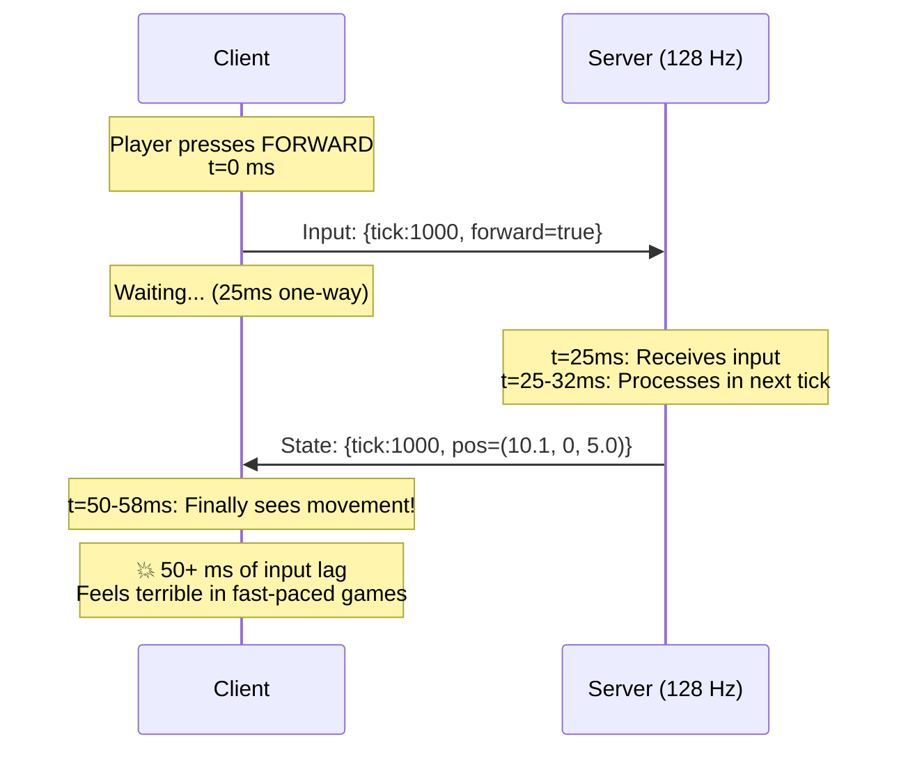
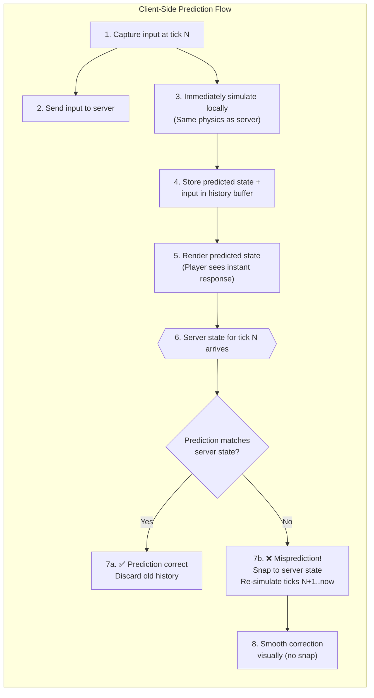
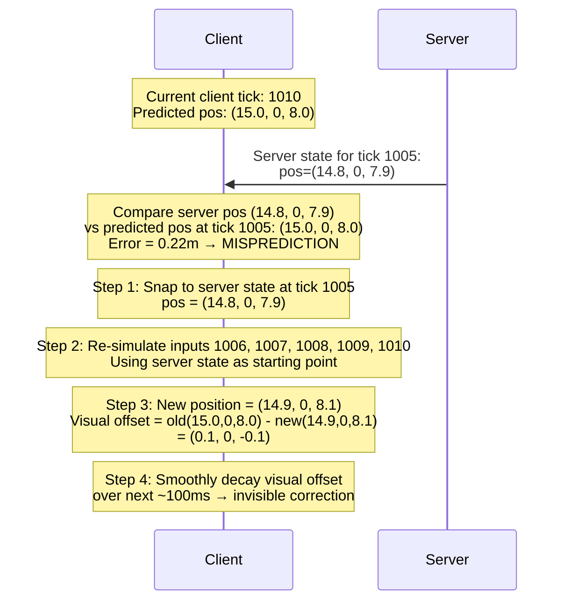
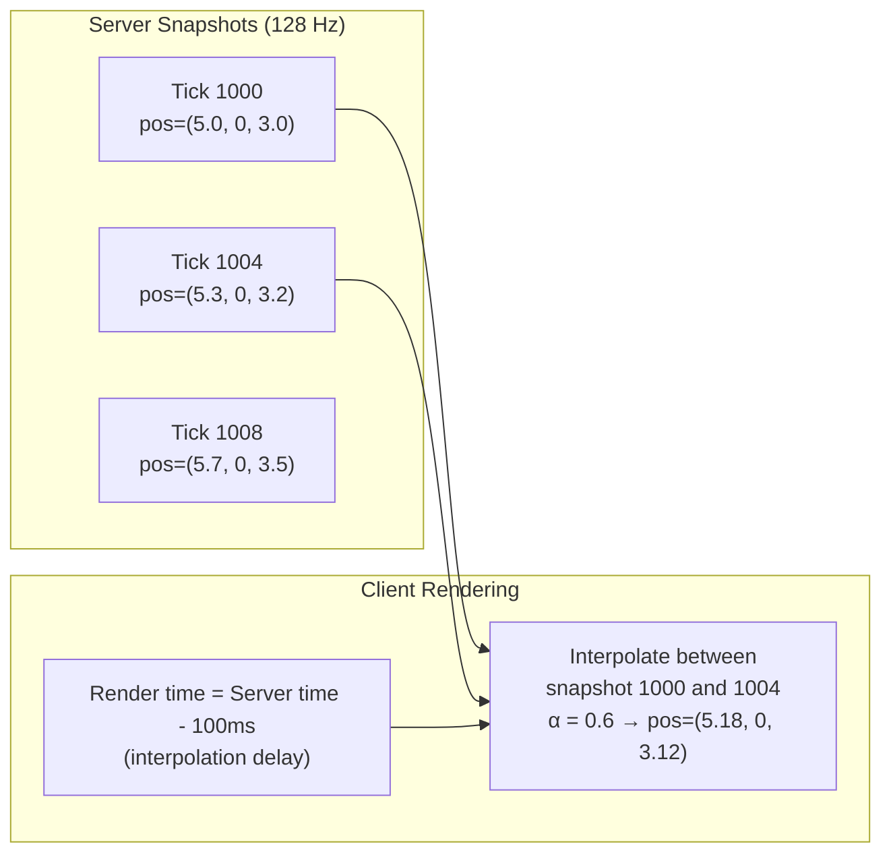
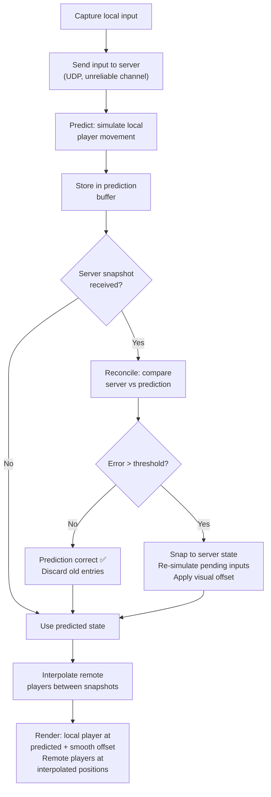

# 3. Client-Side Prediction and Server Reconciliation 🔴

> **The Problem:** A player presses the W key to move forward. At 50 ms ping (25 ms one-way), the input takes 25 ms to reach the server, the server simulates it during the next tick (up to 7.8 ms later), and the result takes another 25 ms to come back. That's **50–58 ms of nothing happening** after pressing a key—an eternity in a competitive shooter. Without client-side prediction, every game feels like it's running through molasses. But naive prediction creates a second problem: when the server's authoritative result disagrees with the client's prediction, the player **snaps** to a corrected position. We need to predict instantly *and* correct seamlessly.

---

## The Latency Timeline Without Prediction



At 100 ms RTT (typical for cross-continent play), the player waits **100+ ms** before seeing any response to their input. This is unacceptable for any action game.

---

## How Client-Side Prediction Works

The solution: the client doesn't wait. It **immediately simulates** the effect of its own input using the same physics code as the server, then reconciles when the server's authoritative result arrives.



### The Core Insight

The client and server run **identical simulation code** for player movement. Given the same input and the same starting state, they produce the same result. The client just runs it **immediately** instead of waiting for the round trip.

---

## The Prediction Buffer

The client maintains a circular buffer of every input it has sent and the predicted state that resulted:

```rust,ignore
use std::collections::VecDeque;

/// One entry in the client's prediction history.
#[derive(Clone)]
struct PredictionEntry {
    tick: u64,
    input: PlayerInput,
    predicted_position: Vec3,
    predicted_velocity: Vec3,
}

/// The client's input and prediction buffer.
struct PredictionBuffer {
    entries: VecDeque<PredictionEntry>,
    /// Maximum entries to keep (covers RTT + jitter).
    /// At 128 Hz and 250 ms max RTT: 128 × 0.25 = 32 entries.
    max_entries: usize,
}

#[derive(Clone, Copy)]
struct PlayerInput {
    tick: u64,
    forward: bool,
    backward: bool,
    left: bool,
    right: bool,
    jump: bool,
    yaw: f32,
    pitch: f32,
}

#[derive(Clone, Copy, Default)]
struct Vec3 {
    x: f32,
    y: f32,
    z: f32,
}

impl PredictionBuffer {
    fn new(max_entries: usize) -> Self {
        Self {
            entries: VecDeque::with_capacity(max_entries),
            max_entries,
        }
    }

    /// Record a new prediction.
    fn push(&mut self, entry: PredictionEntry) {
        if self.entries.len() >= self.max_entries {
            self.entries.pop_front();
        }
        self.entries.push_back(entry);
    }

    /// Discard all entries up to and including the given tick.
    /// Called when the server confirms state for that tick.
    fn discard_through(&mut self, tick: u64) {
        while self.entries.front().is_some_and(|e| e.tick <= tick) {
            self.entries.pop_front();
        }
    }

    /// Get all entries after a given tick (for re-simulation).
    fn entries_after(&self, tick: u64) -> impl Iterator<Item = &PredictionEntry> {
        self.entries.iter().filter(move |e| e.tick > tick)
    }
}
```

---

## Server Reconciliation: Handling Mispredictions

When the server's authoritative state for tick N arrives, the client compares it against its predicted state for tick N. If they differ beyond a threshold, the client must **reconcile**:

1. **Snap** the authoritative state to the server's position.
2. **Re-simulate** every input from tick N+1 through the current tick.
3. **Smooth** the visual correction to hide the snap from the player.

```rust,ignore
/// Server sends this snapshot periodically.
struct ServerSnapshot {
    tick: u64,
    player_position: Vec3,
    player_velocity: Vec3,
}

struct ClientPrediction {
    buffer: PredictionBuffer,
    current_tick: u64,
    position: Vec3,
    velocity: Vec3,

    // Visual smoothing for corrections
    visual_offset: Vec3,   // decays toward zero
    smooth_factor: f32,    // 0.1 = smooth over ~10 frames
}

impl ClientPrediction {
    /// Called every tick BEFORE rendering.
    fn on_local_input(&mut self, input: PlayerInput) {
        // 1. Record the input
        let entry = PredictionEntry {
            tick: self.current_tick,
            input,
            predicted_position: self.position,
            predicted_velocity: self.velocity,
        };

        // 2. Simulate locally (same code as server)
        self.simulate_movement(&input);

        // 3. Update prediction after simulation
        let mut entry = entry;
        entry.predicted_position = self.position;
        entry.predicted_velocity = self.velocity;
        self.buffer.push(entry);

        self.current_tick += 1;
    }

    /// Called when a server snapshot arrives.
    fn on_server_snapshot(&mut self, snapshot: ServerSnapshot) {
        // 1. Check prediction accuracy for the server's tick
        let error = self.position_error(&snapshot);

        if error < 0.01 {
            // Prediction was correct — just discard old history
            self.buffer.discard_through(snapshot.tick);
            return;
        }

        // 2. Misprediction! Snap to server state
        let old_position = self.position;
        self.position = snapshot.player_position;
        self.velocity = snapshot.player_velocity;

        // 3. Re-simulate all inputs AFTER the server's tick
        let replay_inputs: Vec<PlayerInput> = self.buffer
            .entries_after(snapshot.tick)
            .map(|e| e.input)
            .collect();

        for input in &replay_inputs {
            self.simulate_movement(input);
        }

        // 4. Calculate visual offset (old rendered pos - new corrected pos)
        self.visual_offset = Vec3 {
            x: old_position.x - self.position.x,
            y: old_position.y - self.position.y,
            z: old_position.z - self.position.z,
        };

        // 5. Discard old history
        self.buffer.discard_through(snapshot.tick);
    }

    fn position_error(&self, snapshot: &ServerSnapshot) -> f32 {
        let dx = self.position.x - snapshot.player_position.x;
        let dy = self.position.y - snapshot.player_position.y;
        let dz = self.position.z - snapshot.player_position.z;
        (dx * dx + dy * dy + dz * dz).sqrt()
    }

    fn simulate_movement(&mut self, input: &PlayerInput) {
        // Identical to server-side movement simulation.
        // Uses fixed dt = 1/128 second.
        let dt: f32 = 1.0 / 128.0;
        let speed: f32 = 5.0; // meters per second

        let (yaw_sin, yaw_cos) = input.yaw.sin_cos();

        let mut move_dir = Vec3::default();
        if input.forward  { move_dir.x += yaw_cos; move_dir.z += yaw_sin; }
        if input.backward { move_dir.x -= yaw_cos; move_dir.z -= yaw_sin; }
        if input.left     { move_dir.x -= yaw_sin; move_dir.z += yaw_cos; }
        if input.right    { move_dir.x += yaw_sin; move_dir.z -= yaw_cos; }

        // Normalize
        let len = (move_dir.x * move_dir.x + move_dir.z * move_dir.z).sqrt();
        if len > 0.001 {
            move_dir.x /= len;
            move_dir.z /= len;
        }

        self.velocity.x = move_dir.x * speed;
        self.velocity.z = move_dir.z * speed;

        self.position.x += self.velocity.x * dt;
        self.position.y += self.velocity.y * dt;
        self.position.z += self.velocity.z * dt;
    }
}
```

---

## The Re-Simulation Process Visualized



---

## Visual Smoothing: Hiding the Correction

The re-simulation gives us the correct position, but it's different from what the player was just seeing. A raw snap to the new position causes **rubber-banding**—the character visibly teleports. Instead, we apply a **visual offset** that decays smoothly:

```rust,ignore
impl ClientPrediction {
    /// Called every render frame (may be higher than tick rate).
    fn render_position(&mut self, render_dt: f32) -> Vec3 {
        // Exponential decay of the visual offset
        let decay = (-10.0 * render_dt).exp(); // ~100ms half-life
        self.visual_offset.x *= decay;
        self.visual_offset.y *= decay;
        self.visual_offset.z *= decay;

        // Snap to zero if negligible
        let offset_mag = (self.visual_offset.x * self.visual_offset.x
            + self.visual_offset.y * self.visual_offset.y
            + self.visual_offset.z * self.visual_offset.z)
            .sqrt();
        if offset_mag < 0.001 {
            self.visual_offset = Vec3::default();
        }

        // Rendered position = simulation position + smoothing offset
        Vec3 {
            x: self.position.x + self.visual_offset.x,
            y: self.position.y + self.visual_offset.y,
            z: self.position.z + self.visual_offset.z,
        }
    }
}
```

### Smoothing Comparison

| Technique | Behavior | Feel |
|---|---|---|
| No smoothing (raw snap) | Character teleports to corrected position | Terrible — visible rubber-banding |
| Linear interpolation | Move from old to new over N frames | Better, but feels "mushy" |
| Exponential decay | Quick initial correction, tapers off | Best — barely noticeable |
| Threshold check | Only correct if error > 0.5m; teleport if > 2m | Hybrid — avoids micro-corrections |

---

## Entity Interpolation for Other Players

Client-side prediction only applies to the **local player** (whose inputs we know). For all other players, we use **interpolation** — rendering their positions slightly in the past, smoothly blended between two known server snapshots:



```rust,ignore
/// Stores recent server snapshots for interpolation.
struct InterpolationBuffer {
    snapshots: VecDeque<EntitySnapshot>,
    interp_delay_ms: f32, // typically 100ms (2-3 server ticks behind)
}

#[derive(Clone)]
struct EntitySnapshot {
    tick: u64,
    position: Vec3,
    rotation: f32,
}

impl InterpolationBuffer {
    fn interpolated_position(&self, render_tick: f64) -> Option<Vec3> {
        // Find the two snapshots that bracket render_tick
        let mut before = None;
        let mut after = None;

        for snap in &self.snapshots {
            if (snap.tick as f64) <= render_tick {
                before = Some(snap);
            } else {
                after = Some(snap);
                break;
            }
        }

        let (a, b) = match (before, after) {
            (Some(a), Some(b)) => (a, b),
            (Some(a), None) => return Some(a.position), // extrapolate (risky)
            _ => return None,
        };

        // Linear interpolation factor
        let range = (b.tick - a.tick) as f64;
        let alpha = if range > 0.0 {
            ((render_tick - a.tick as f64) / range).clamp(0.0, 1.0) as f32
        } else {
            0.0
        };

        Some(Vec3 {
            x: a.position.x + (b.position.x - a.position.x) * alpha,
            y: a.position.y + (b.position.y - a.position.y) * alpha,
            z: a.position.z + (b.position.z - a.position.z) * alpha,
        })
    }
}
```

---

## Prediction vs Interpolation: When to Use Each

| | Client-Side Prediction | Entity Interpolation |
|---|---|---|
| **Applied to** | Local player only | All remote entities |
| **Latency** | ~0 ms (instant) | +100 ms (intentional delay) |
| **Requires** | Shared simulation code | Two buffered snapshots |
| **Risk** | Misprediction → correction needed | Smooth but slightly in the past |
| **Complexity** | High (re-simulation, smoothing) | Low (linear lerp) |
| **Used in** | Every competitive multiplayer game | Every competitive multiplayer game |

---

## Common Misprediction Causes

Mispredictions happen when the client's predicted state diverges from the server's authoritative result. Common causes:

| Cause | Example | Mitigation |
|---|---|---|
| Floating-point non-determinism | Different CPU = different `sin()` result | Use fixed-point math or ensure identical hardware via server authority |
| Missing server-side state | Client doesn't know about another player's wall | Accept corrections; they're usually small |
| Input arrives too late | Server processes tick before receiving input | Input buffering: server holds inputs for 1–2 ticks |
| Physics collision | Client predicts walking through a door; server says door is closed | Client replays with server's authoritative door state |
| Server-side anti-cheat | Server rejects movement as impossible (speed hack) | Client snaps to server position |

### Input Buffering to Reduce Mispredictions

The server can buffer inputs for 1–2 extra ticks to account for jitter, reducing the chance that an input arrives "too late" for its intended tick:

```rust,ignore
struct InputBuffer {
    /// Indexed by player, stores pending inputs sorted by tick.
    per_player: Vec<VecDeque<PlayerInput>>,
    /// How many ticks ahead of "now" we accept inputs.
    buffer_size: u64, // typically 2
}

impl InputBuffer {
    fn add_input(&mut self, player: usize, input: PlayerInput) {
        self.per_player[player].push_back(input);
    }

    /// Get the input for a specific player at a specific tick.
    /// If the input hasn't arrived yet, repeat the last known input.
    fn get_input(&mut self, player: usize, tick: u64) -> PlayerInput {
        while self.per_player[player]
            .front()
            .is_some_and(|i| i.tick < tick)
        {
            self.per_player[player].pop_front();
        }

        if let Some(input) = self.per_player[player].front() {
            if input.tick == tick {
                return *input;
            }
        }

        // Input not available — repeat last known
        // This introduces 1 tick of latency but prevents gaps
        PlayerInput {
            tick,
            forward: false,
            backward: false,
            left: false,
            right: false,
            jump: false,
            yaw: 0.0,
            pitch: 0.0,
        }
    }
}
```

---

## The Complete Client Frame

Putting prediction, reconciliation, interpolation, and rendering together:



---

> **Key Takeaways**
>
> 1. **Client-side prediction** simulates the local player's inputs immediately, eliminating perceived input lag even at 200+ ms RTT.
> 2. **Server reconciliation** corrects mispredictions by snapping to the server's authoritative state and replaying all subsequent inputs—the player never sees the correction if visual smoothing is done well.
> 3. **Visual smoothing** (exponential decay of correction offset) hides corrections from the player—a 0.2m correction at 200 ms RTT is completely invisible.
> 4. **Entity interpolation** renders other players slightly in the past (~100 ms) by blending between two known server snapshots—always smooth, never stuttering.
> 5. **Input buffering** on the server (1–2 ticks) absorbs network jitter and significantly reduces misprediction frequency.
