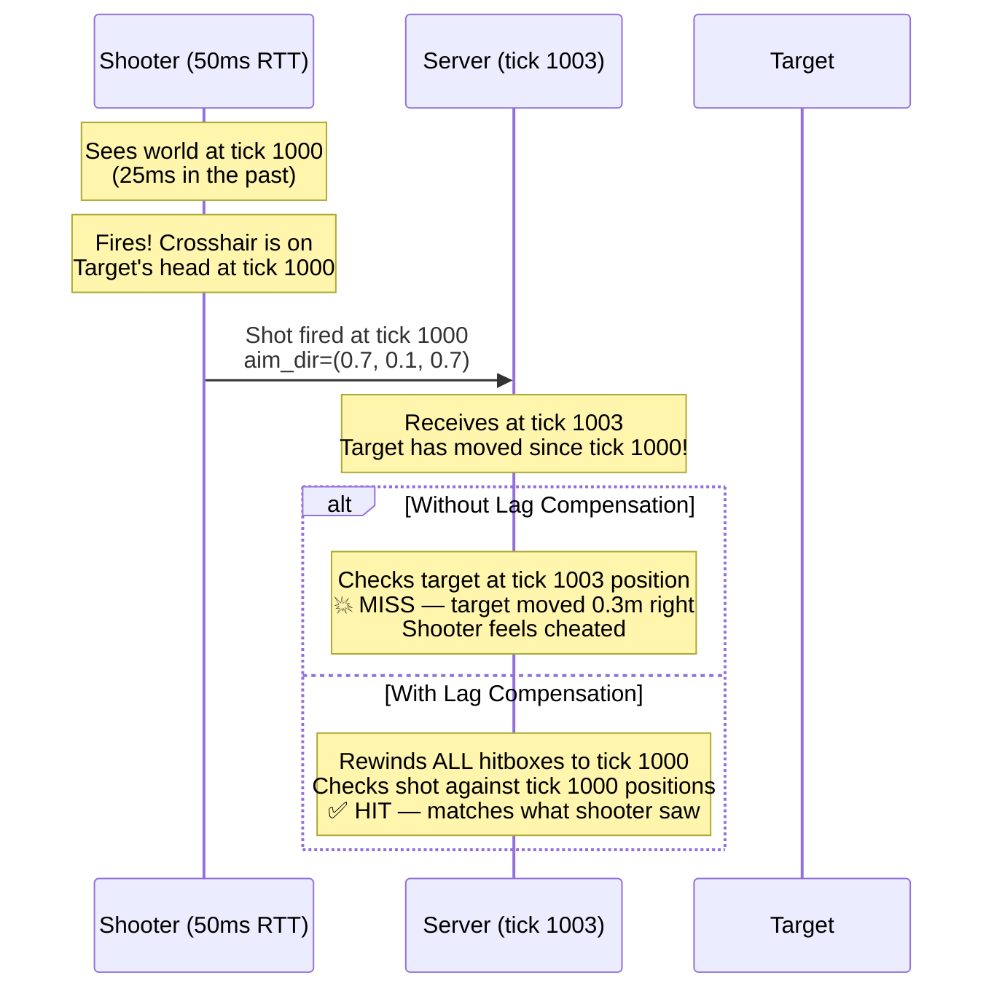
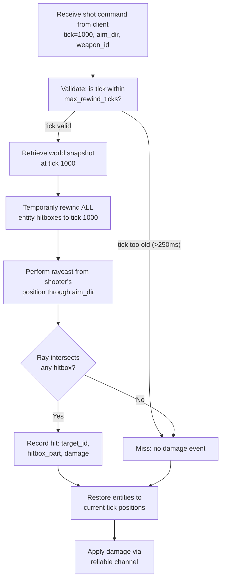
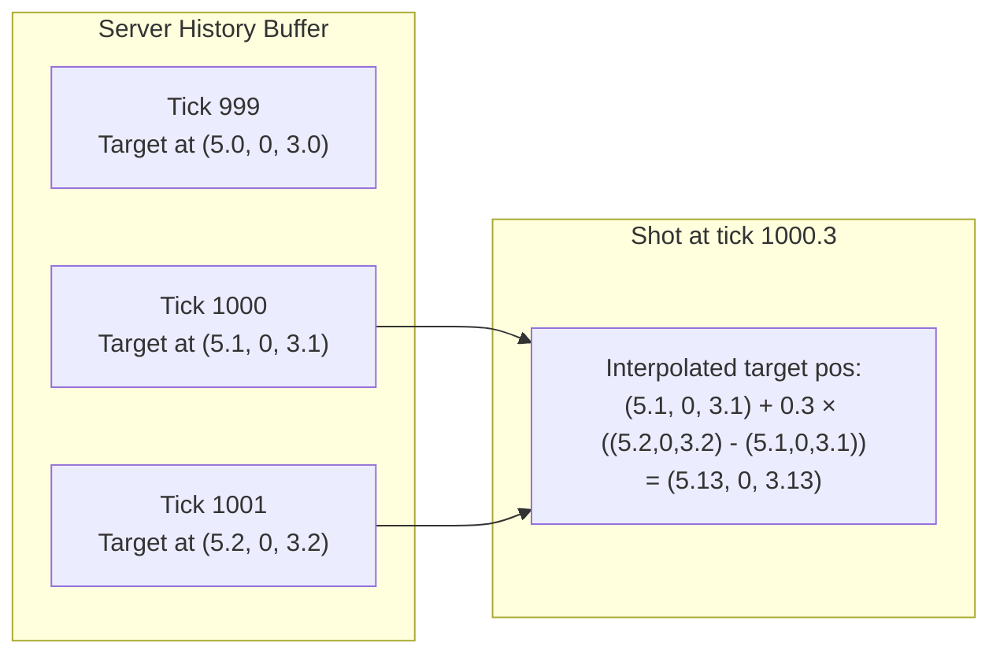
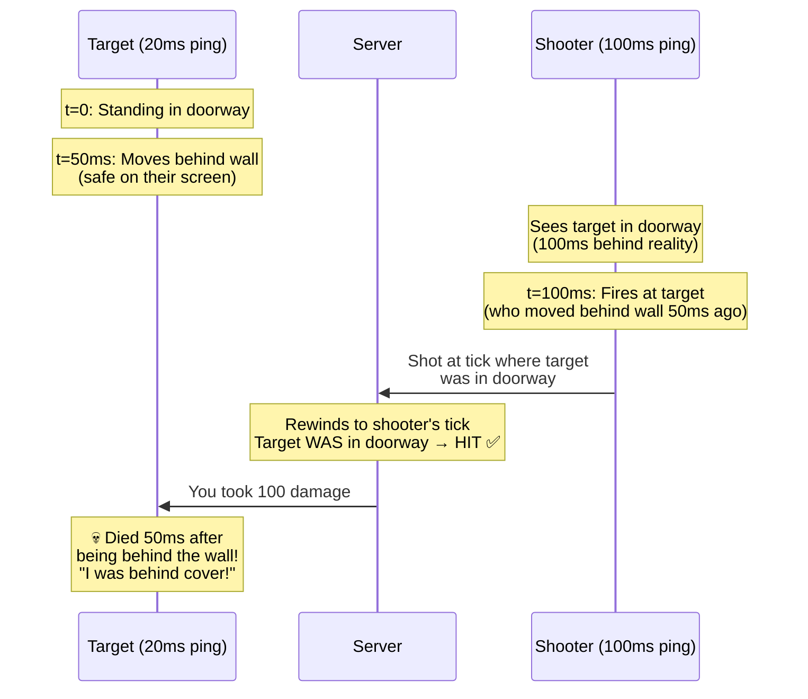
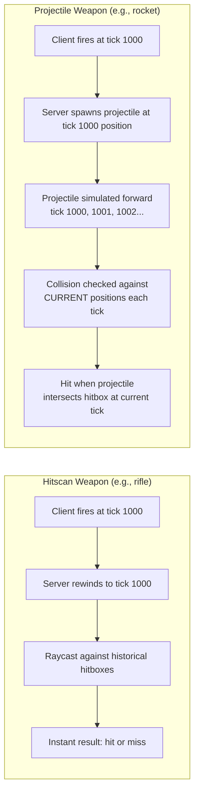

# 4. Lag Compensation and Hit Registration 🔴

> **The Problem:** Player A shoots Player B on their screen. The shot looks perfect—crosshair right on the head. But by the time the shot reaches the server (25 ms later), Player B has moved. The server processes the shot against Player B's *current* position and declares it a miss. Player A screams "I shot him on my screen!" This is the most rage-inducing bug in multiplayer gaming, and the solution—**lag compensation with server-side hitbox rewinding**—is one of the most technically demanding systems in game server architecture.

---

## The Core Problem: Time Disagreement

Every player sees the world **in the past** relative to the server. When a player fires at tick 1000 on their screen, the server is already at tick 1003 (due to network latency). The target has moved during those 3 ticks. Without lag compensation, the server evaluates the shot against the target's *current* position—which is different from what the shooter saw.



---

## The Historical State Buffer

The server maintains a **ring buffer** of recent world snapshots. Each entry records the positions and hitboxes of every entity at a specific tick. When a shot arrives, the server rewinds to the tick the shooter *claims* they fired at and evaluates the shot against that historical state.

```rust,ignore
use std::collections::VecDeque;

const HISTORY_BUFFER_SIZE: usize = 64; // ~500ms at 128 Hz

/// Axis-aligned bounding box for simple collision.
#[derive(Clone, Copy)]
struct Aabb {
    min_x: f32, min_y: f32, min_z: f32,
    max_x: f32, max_y: f32, max_z: f32,
}

/// Per-entity hitbox data, potentially multi-part (head, torso, limbs).
#[derive(Clone)]
struct EntityHitboxes {
    entity_id: u16,
    position: Vec3,
    /// Multiple hitbox volumes per entity (head=2x damage, torso=1x, limbs=0.75x).
    parts: Vec<HitboxPart>,
}

#[derive(Clone)]
struct HitboxPart {
    name: &'static str,     // "head", "torso", "legs"
    bounds: Aabb,            // relative to entity position
    damage_multiplier: f32,  // head=2.0, torso=1.0, limbs=0.75
}

/// A complete snapshot of all entity hitboxes at a single tick.
#[derive(Clone)]
struct WorldSnapshot {
    tick: u64,
    entities: Vec<EntityHitboxes>,
}

/// The server's ring buffer of historical world states.
struct HistoryBuffer {
    snapshots: VecDeque<WorldSnapshot>,
    max_rewind_ticks: u64, // max ticks we allow rewinding (e.g., 32 = 250ms)
}

#[derive(Clone, Copy, Default)]
struct Vec3 {
    x: f32,
    y: f32,
    z: f32,
}

impl HistoryBuffer {
    fn new(max_rewind_ticks: u64) -> Self {
        Self {
            snapshots: VecDeque::with_capacity(HISTORY_BUFFER_SIZE),
            max_rewind_ticks,
        }
    }

    /// Called every tick: save the current world state.
    fn record(&mut self, snapshot: WorldSnapshot) {
        if self.snapshots.len() >= HISTORY_BUFFER_SIZE {
            self.snapshots.pop_front();
        }
        self.snapshots.push_back(snapshot);
    }

    /// Retrieve the world state at or nearest to the requested tick.
    fn get_snapshot(&self, tick: u64) -> Option<&WorldSnapshot> {
        // Binary search for the exact tick
        self.snapshots.iter().find(|s| s.tick == tick)
    }

    /// Get interpolated state between two ticks for sub-tick accuracy.
    fn get_interpolated(&self, tick: u64, fraction: f32) -> Option<WorldSnapshot> {
        let before = self.snapshots.iter().rev().find(|s| s.tick <= tick)?;
        let after = self.snapshots.iter().find(|s| s.tick > tick)?;

        let t = (tick as f32 - before.tick as f32 + fraction)
            / (after.tick - before.tick) as f32;

        Some(interpolate_snapshots(before, after, t.clamp(0.0, 1.0)))
    }
}

fn interpolate_snapshots(a: &WorldSnapshot, b: &WorldSnapshot, t: f32) -> WorldSnapshot {
    let mut result = a.clone();
    for (i, entity) in result.entities.iter_mut().enumerate() {
        if let Some(b_entity) = b.entities.get(i) {
            entity.position.x = a.entities[i].position.x
                + (b_entity.position.x - a.entities[i].position.x) * t;
            entity.position.y = a.entities[i].position.y
                + (b_entity.position.y - a.entities[i].position.y) * t;
            entity.position.z = a.entities[i].position.z
                + (b_entity.position.z - a.entities[i].position.z) * t;
        }
    }
    result
}
```

---

## The Lag Compensation Algorithm

When a shot arrives at the server, the full algorithm is:



### Implementation

```rust,ignore
struct ShotCommand {
    shooter_id: u16,
    tick: u64,          // tick when the client fired
    origin: Vec3,       // shooter's eye position at that tick
    direction: Vec3,    // normalized aim direction
    weapon_id: u8,
}

struct HitResult {
    target_id: u16,
    hitbox_part: &'static str,
    damage_multiplier: f32,
    distance: f32,
}

struct LagCompensator {
    history: HistoryBuffer,
    current_tick: u64,
}

impl LagCompensator {
    fn process_shot(&self, shot: &ShotCommand) -> Option<HitResult> {
        // 1. Validate the rewind request
        let rewind_ticks = self.current_tick.saturating_sub(shot.tick);
        if rewind_ticks > self.history.max_rewind_ticks {
            // Client claims to have fired too far in the past — reject.
            // This limits the advantage of high-ping players.
            return None;
        }

        // 2. Retrieve historical state
        let snapshot = self.history.get_snapshot(shot.tick)?;

        // 3. Perform raycast against historical hitboxes
        let mut best_hit: Option<HitResult> = None;
        let mut best_distance = f32::MAX;

        for entity in &snapshot.entities {
            // Don't hit yourself
            if entity.entity_id == shot.shooter_id {
                continue;
            }

            for part in &entity.parts {
                // Transform hitbox to world space
                let world_aabb = Aabb {
                    min_x: entity.position.x + part.bounds.min_x,
                    min_y: entity.position.y + part.bounds.min_y,
                    min_z: entity.position.z + part.bounds.min_z,
                    max_x: entity.position.x + part.bounds.max_x,
                    max_y: entity.position.y + part.bounds.max_y,
                    max_z: entity.position.z + part.bounds.max_z,
                };

                if let Some(dist) = ray_aabb_intersection(
                    &shot.origin,
                    &shot.direction,
                    &world_aabb,
                ) {
                    if dist < best_distance {
                        best_distance = dist;
                        best_hit = Some(HitResult {
                            target_id: entity.entity_id,
                            hitbox_part: part.name,
                            damage_multiplier: part.damage_multiplier,
                            distance: dist,
                        });
                    }
                }
            }
        }

        best_hit
    }
}

/// Ray vs AABB intersection test (slab method).
fn ray_aabb_intersection(origin: &Vec3, dir: &Vec3, aabb: &Aabb) -> Option<f32> {
    let inv_dir_x = 1.0 / dir.x;
    let inv_dir_y = 1.0 / dir.y;
    let inv_dir_z = 1.0 / dir.z;

    let t1 = (aabb.min_x - origin.x) * inv_dir_x;
    let t2 = (aabb.max_x - origin.x) * inv_dir_x;
    let t3 = (aabb.min_y - origin.y) * inv_dir_y;
    let t4 = (aabb.max_y - origin.y) * inv_dir_y;
    let t5 = (aabb.min_z - origin.z) * inv_dir_z;
    let t6 = (aabb.max_z - origin.z) * inv_dir_z;

    let tmin = t1.min(t2).max(t3.min(t4)).max(t5.min(t6));
    let tmax = t1.max(t2).min(t3.max(t4)).min(t5.max(t6));

    if tmax < 0.0 || tmin > tmax {
        None // No intersection
    } else {
        Some(tmin.max(0.0))
    }
}
```

---

## Sub-Tick Accuracy: Interpolated Rewinding

Players don't always fire exactly on a tick boundary. If a player fires at tick 1000 + 0.3 (30% between tick 1000 and 1001), we need to interpolate between the two snapshots for sub-tick precision:



This is especially important for hitscan weapons (instant-hit guns) where the difference between a headshot and a body shot can be a few centimeters.

---

## The Tradeoffs of Lag Compensation

Lag compensation is not free. It creates a fundamental tension between the shooter's experience and the target's experience:

| Perspective | Without Lag Comp | With Lag Comp |
|---|---|---|
| **Shooter (high ping)** | Shots miss even when aimed perfectly | ✅ Shots hit if aimed correctly on their screen |
| **Target (low ping)** | ✅ Can dodge shots by moving | ❌ Can die "behind cover" — was visible to shooter N ms ago |
| **Fairness** | Low-ping players have massive advantage | More equitable — skill matters more than ping |
| **Exploitability** | None | High-ping players get a wider rewind window |

### The "Dying Behind Cover" Problem



This is an **inherent tradeoff** with no perfect solution. Most competitive games choose lag compensation because:
1. The shooter's experience is more important (they aimed correctly).
2. Without it, high-ping players can't hit anything.
3. The "dying behind cover" window is bounded by `max_rewind_ticks`.

---

## Limiting Lag Compensation

To prevent abuse and bound the "dying behind cover" window:

```rust,ignore
struct LagCompensationConfig {
    /// Maximum rewind time. 250ms = 32 ticks at 128 Hz.
    /// Higher-ping players beyond this threshold get no compensation.
    max_rewind_ms: f32,

    /// Interpolation delay added to rewind calculation.
    /// Accounts for the client's entity interpolation buffer.
    interp_delay_ms: f32,

    /// Maximum allowed position discrepancy between claimed and
    /// historical position. Prevents position-spoofing exploits.
    max_origin_error: f32,

    /// Number of historical snapshots to keep.
    history_size: usize,
}

impl Default for LagCompensationConfig {
    fn default() -> Self {
        Self {
            max_rewind_ms: 250.0,
            interp_delay_ms: 100.0,
            max_origin_error: 1.0, // meters
            history_size: 64,
        }
    }
}

impl LagCompensator {
    fn validated_process_shot(
        &self,
        shot: &ShotCommand,
        config: &LagCompensationConfig,
        player_rtt_ms: f32,
    ) -> Option<HitResult> {
        // 1. Calculate actual rewind time
        let rewind_ms = (player_rtt_ms / 2.0) + config.interp_delay_ms;
        if rewind_ms > config.max_rewind_ms {
            // Player's ping is too high for full compensation.
            // Options: partial compensation or no compensation.
            return None;
        }

        // 2. Validate shooter's claimed position
        let historical = self.history.get_snapshot(shot.tick)?;
        let shooter_record = historical.entities
            .iter()
            .find(|e| e.entity_id == shot.shooter_id)?;
        let origin_error = distance(&shot.origin, &shooter_record.position);
        if origin_error > config.max_origin_error {
            // Client claims to be somewhere they weren't — reject.
            return None;
        }

        // 3. Proceed with standard lag compensation
        self.process_shot(shot)
    }
}

fn distance(a: &Vec3, b: &Vec3) -> f32 {
    let dx = a.x - b.x;
    let dy = a.y - b.y;
    let dz = a.z - b.z;
    (dx * dx + dy * dy + dz * dz).sqrt()
}
```

---

## Multi-Part Hitboxes: Head, Torso, Limbs

Competitive games use precise multi-part hitboxes for differentiated damage:

```
    ┌──────┐         Head hitbox: 2.0× damage
    │ HEAD │         Aabb { min: (-0.15, 1.6, -0.15), max: (0.15, 1.85, 0.15) }
    └──┬───┘
   ┌───┴────┐        Torso hitbox: 1.0× damage
   │ TORSO  │        Aabb { min: (-0.25, 0.9, -0.15), max: (0.25, 1.6, 0.15) }
   └───┬────┘
   ┌───┴────┐
   │  LEGS  │        Legs hitbox: 0.75× damage
   │        │        Aabb { min: (-0.2, 0.0, -0.15), max: (0.2, 0.9, 0.15) }
   └────────┘
```

```rust,ignore
fn standard_player_hitboxes() -> Vec<HitboxPart> {
    vec![
        HitboxPart {
            name: "head",
            bounds: Aabb {
                min_x: -0.15, min_y: 1.60, min_z: -0.15,
                max_x:  0.15, max_y: 1.85, max_z:  0.15,
            },
            damage_multiplier: 2.0,
        },
        HitboxPart {
            name: "torso",
            bounds: Aabb {
                min_x: -0.25, min_y: 0.90, min_z: -0.15,
                max_x:  0.25, max_y: 1.60, max_z:  0.15,
            },
            damage_multiplier: 1.0,
        },
        HitboxPart {
            name: "legs",
            bounds: Aabb {
                min_x: -0.20, min_y: 0.00, min_z: -0.15,
                max_x:  0.20, max_y: 0.90, max_z:  0.15,
            },
            damage_multiplier: 0.75,
        },
    ]
}
```

---

## Memory Budget for the History Buffer

Each snapshot must be as compact as possible since we store one per tick:

| Data | Per Entity | 64 Players |
|---|---|---|
| Entity ID (u16) | 2 bytes | 128 bytes |
| Position (3 × f32) | 12 bytes | 768 bytes |
| Hitbox parts (3 × Aabb = 3 × 24 bytes) | 72 bytes | 4,608 bytes |
| **Total per snapshot** | 86 bytes | **5,504 bytes** |
| **64 snapshots (500 ms)** | — | **352 KB** |

352 KB for half a second of complete rewind history for 64 players. This fits comfortably in L2 cache, keeping rewind lookups fast.

---

## Projectile Weapons: Forward Simulation

Hitscan weapons (instant raycast) are the simple case. Projectile weapons (rockets, grenades) require a different approach: instead of rewinding, the server **forward-simulates** the projectile from its spawn tick:



Projectile weapons don't need lag compensation for the projectile itself—they're simulated in real time. Lag compensation only applies if the projectile's *spawn position* matters (e.g., the server needs to verify the shooter was where they claimed to be).

---

## Server Authority: Anti-Cheat Validation

The server never trusts anything from the client. Every shot command undergoes validation:

```rust,ignore
struct ShotValidator;

impl ShotValidator {
    fn validate(
        shot: &ShotCommand,
        history: &HistoryBuffer,
        weapon_db: &WeaponDatabase,
        player_state: &PlayerState,
    ) -> Result<(), ShotRejection> {
        // 1. Rate limiting: weapon fire rate check
        let weapon = weapon_db.get(shot.weapon_id)
            .ok_or(ShotRejection::InvalidWeapon)?;
        let ticks_since_last_shot = shot.tick
            .saturating_sub(player_state.last_shot_tick);
        if ticks_since_last_shot < weapon.fire_rate_ticks {
            return Err(ShotRejection::TooFast);
        }

        // 2. Ammo check
        if player_state.ammo[shot.weapon_id as usize] == 0 {
            return Err(ShotRejection::NoAmmo);
        }

        // 3. Position plausibility: was the player near the claimed origin?
        let historical = history.get_snapshot(shot.tick)
            .ok_or(ShotRejection::TickTooOld)?;
        let record = historical.entities.iter()
            .find(|e| e.entity_id == shot.shooter_id)
            .ok_or(ShotRejection::PlayerNotFound)?;
        if distance(&shot.origin, &record.position) > 1.0 {
            return Err(ShotRejection::PositionMismatch);
        }

        // 4. Direction plausibility: is the aim angle reasonable?
        let dir_len = (shot.direction.x * shot.direction.x
            + shot.direction.y * shot.direction.y
            + shot.direction.z * shot.direction.z)
            .sqrt();
        if (dir_len - 1.0).abs() > 0.01 {
            return Err(ShotRejection::InvalidDirection);
        }

        Ok(())
    }
}

struct WeaponDatabase;
impl WeaponDatabase {
    fn get(&self, _id: u8) -> Option<Weapon> { None }
}
struct Weapon { fire_rate_ticks: u64 }
struct PlayerState { last_shot_tick: u64, ammo: Vec<u32> }

enum ShotRejection {
    InvalidWeapon,
    TooFast,
    NoAmmo,
    TickTooOld,
    PlayerNotFound,
    PositionMismatch,
    InvalidDirection,
}
```

---

## Industry Approaches Compared

| Game | Tick Rate | Lag Comp | Max Rewind | Notes |
|---|---|---|---|---|
| CS2 | 64–128 Hz | Full rewind | ~200 ms | Server-authoritative, favor the shooter |
| Valorant | 128 Hz | Full rewind | ~200 ms | Plus anti-cheat (Vanguard) validation |
| Overwatch 2 | 63 Hz | Full rewind | ~250 ms | Favors shooter for hitscan, forward-sim for projectiles |
| Fortnite | 30 Hz | Partial | ~150 ms | Lower tick rate, bigger rewind window per tick |
| Rocket League | 120 Hz | Physics-based | N/A | No hitscan — pure physics prediction |

---

> **Key Takeaways**
>
> 1. **Lag compensation is essential** for any game with ranged combat. Without it, high-ping players can't hit anything, and the game feels broken.
> 2. **The server maintains a ring buffer** of historical world snapshots (~350 KB for 64 players × 500 ms), enabling sub-millisecond rewind lookups.
> 3. **When a shot arrives, the server rewinds** all entity hitboxes to the tick the shooter claims to have fired at, then performs the raycast against historical positions.
> 4. **The tradeoff is "dying behind cover"** — targets can be hit up to `max_rewind_ms` after leaving the shooter's line of sight. This window must be bounded (typically 200–250 ms).
> 5. **Server authority is non-negotiable:** every shot command is validated for fire rate, ammo, position plausibility, and direction before lag compensation is even attempted.
