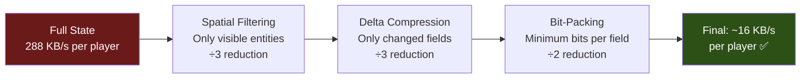
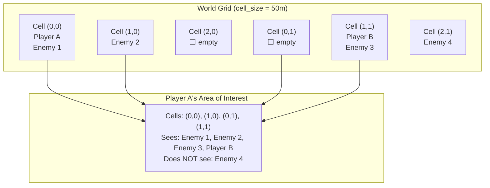
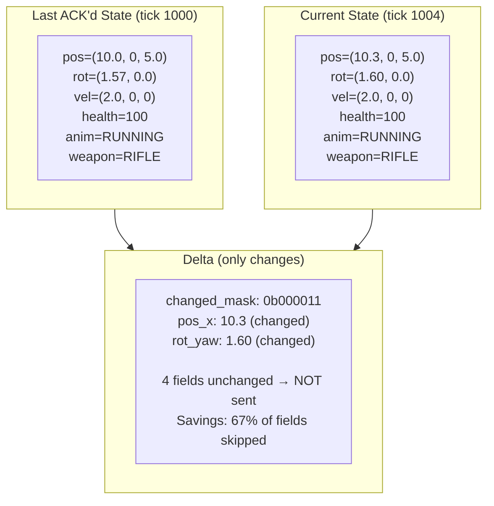
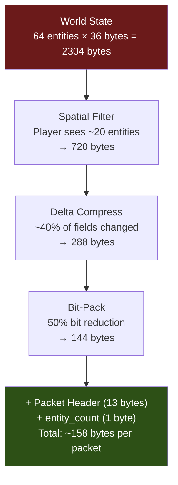
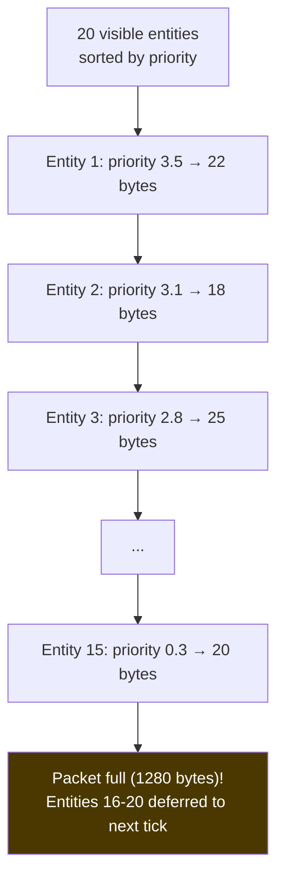
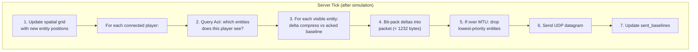

# 5. Spatial Partitioning and Data Serialization 🔴

> **The Problem:** A 64-player server running at 128 Hz generates an enormous amount of state data. If we naively send every entity's state to every player every tick, the math is brutal: 64 players × 64 entities × 40 bytes × 128 ticks/sec = **21 MB/s total outbound bandwidth**. That's ~330 KB/s per player — far above our 32 KB/s budget. We need two techniques working in concert: **spatial partitioning** (only send data about entities the player can actually see) and **bit-packing with delta compression** (encode only what changed, using the minimum number of bits).

---

## The Bandwidth Problem

Let's calculate the naive case for a 64-player server at 128 Hz:

| Component | Per Entity | Naive Total (64 entities × 128 Hz) |
|---|---|---|
| Position (x, y, z as f32) | 12 bytes | 98,304 bytes/sec |
| Rotation (yaw, pitch as f32) | 8 bytes | 65,536 bytes/sec |
| Velocity (x, y, z as f32) | 12 bytes | 98,304 bytes/sec |
| Health (u16) | 2 bytes | 16,384 bytes/sec |
| Animation state (u8) | 1 byte | 8,192 bytes/sec |
| Weapon + flags (u8) | 1 byte | 8,192 bytes/sec |
| **Total per entity** | **36 bytes** | — |
| **Per player (64 entities)** | — | **294,912 bytes/sec = 288 KB/s** |

288 KB/s per player is 9× over our 32 KB/s budget. We need a **9× reduction**.

### The Three-Pronged Solution



---

## Part 1: Spatial Partitioning — Area of Interest

Not every player needs to know about every entity. A player at position `(10, 0, 20)` doesn't need updates about an enemy at `(500, 0, 800)`. **Area-of-Interest (AoI)** filtering sends each player only the entities within their relevant area.

### Grid-Based Spatial Hashing

The simplest and most cache-friendly approach: divide the world into a uniform grid and assign each entity to a cell. Players receive updates only for entities in their cell and neighboring cells.



```rust,ignore
use std::collections::{HashMap, HashSet};

const CELL_SIZE: f32 = 50.0; // meters per cell

#[derive(Hash, Eq, PartialEq, Clone, Copy)]
struct CellCoord {
    x: i32,
    z: i32,
}

struct SpatialGrid {
    cells: HashMap<CellCoord, Vec<u16>>,  // cell → entity IDs
}

struct Vec3 { x: f32, y: f32, z: f32 }

impl SpatialGrid {
    fn new() -> Self {
        Self {
            cells: HashMap::new(),
        }
    }

    /// Assign an entity to the grid based on its position.
    fn insert(&mut self, entity_id: u16, pos: &Vec3) {
        let cell = Self::pos_to_cell(pos);
        self.cells.entry(cell).or_default().push(entity_id);
    }

    /// Clear the grid (called at start of each tick before re-inserting).
    fn clear(&mut self) {
        for entities in self.cells.values_mut() {
            entities.clear();
        }
    }

    /// Get all entities visible to a player at the given position.
    /// Returns entities in the player's cell and all 8 neighbors.
    fn query_aoi(&self, pos: &Vec3) -> Vec<u16> {
        let center = Self::pos_to_cell(pos);
        let mut result = Vec::new();

        for dx in -1..=1 {
            for dz in -1..=1 {
                let cell = CellCoord {
                    x: center.x + dx,
                    z: center.z + dz,
                };
                if let Some(entities) = self.cells.get(&cell) {
                    result.extend_from_slice(entities);
                }
            }
        }

        result
    }

    fn pos_to_cell(pos: &Vec3) -> CellCoord {
        CellCoord {
            x: (pos.x / CELL_SIZE).floor() as i32,
            z: (pos.z / CELL_SIZE).floor() as i32,
        }
    }
}
```

### AoI Filtering Effectiveness

| Map Size | Players | Avg. Visible Entities | Reduction Factor |
|---|---|---|---|
| Small (arena, 100×100m) | 64 | ~50 (most visible) | 1.3× |
| Medium (300×300m) | 64 | ~20 | 3.2× |
| Large (1000×1000m) | 64 | ~8 | 8× |
| Battle Royale (2000×2000m) | 100 | ~5 | 20× |

For our medium-sized competitive map, AoI filtering reduces visible entities from 64 to ~20, cutting bandwidth by **3.2×**.

---

## Part 2: Delta Compression — Only Send What Changed

Most entities don't change every field every tick. A standing player's position stays the same. A running player's health doesn't change. **Delta compression** compares the current state to the last state *acknowledged* by that client and sends only the differences.

### The Delta Encoding Strategy



```rust,ignore
/// Bit flags indicating which fields changed.
#[derive(Clone, Copy)]
struct ChangedMask(u16);

impl ChangedMask {
    const POS_X: u16     = 1 << 0;
    const POS_Y: u16     = 1 << 1;
    const POS_Z: u16     = 1 << 2;
    const ROT_YAW: u16   = 1 << 3;
    const ROT_PITCH: u16 = 1 << 4;
    const VEL_X: u16     = 1 << 5;
    const VEL_Y: u16     = 1 << 6;
    const VEL_Z: u16     = 1 << 7;
    const HEALTH: u16    = 1 << 8;
    const ANIM: u16      = 1 << 9;
    const WEAPON: u16    = 1 << 10;
    const FLAGS: u16     = 1 << 11;
}

/// Full entity state for comparison.
#[derive(Clone, PartialEq)]
struct EntityState {
    pos_x: f32,
    pos_y: f32,
    pos_z: f32,
    rot_yaw: f32,
    rot_pitch: f32,
    vel_x: f32,
    vel_y: f32,
    vel_z: f32,
    health: u16,
    anim_state: u8,
    weapon: u8,
    flags: u8,  // crouching, sprinting, reloading, etc.
}

impl EntityState {
    /// Compute the changed fields between two states.
    fn diff(&self, prev: &EntityState) -> ChangedMask {
        let mut mask = 0u16;
        if self.pos_x != prev.pos_x     { mask |= ChangedMask::POS_X; }
        if self.pos_y != prev.pos_y     { mask |= ChangedMask::POS_Y; }
        if self.pos_z != prev.pos_z     { mask |= ChangedMask::POS_Z; }
        if self.rot_yaw != prev.rot_yaw { mask |= ChangedMask::ROT_YAW; }
        if self.rot_pitch != prev.rot_pitch { mask |= ChangedMask::ROT_PITCH; }
        if self.vel_x != prev.vel_x     { mask |= ChangedMask::VEL_X; }
        if self.vel_y != prev.vel_y     { mask |= ChangedMask::VEL_Y; }
        if self.vel_z != prev.vel_z     { mask |= ChangedMask::VEL_Z; }
        if self.health != prev.health   { mask |= ChangedMask::HEALTH; }
        if self.anim_state != prev.anim_state { mask |= ChangedMask::ANIM; }
        if self.weapon != prev.weapon   { mask |= ChangedMask::WEAPON; }
        if self.flags != prev.flags     { mask |= ChangedMask::FLAGS; }
        ChangedMask(mask)
    }
}
```

Delta compression typically reduces the amount of data to send by **60–80%** because most fields remain unchanged between ticks.

---

## Part 3: Bit-Packing — Minimum Bits Per Field

Even for changed fields, we don't need full 32-bit floats. Quantize values to the minimum bits needed:

| Field | Full Size | Quantized Size | Encoding |
|---|---|---|---|
| Position X, Z (0..1000m, 1cm precision) | 32 bits (f32) | 17 bits | `(pos * 100) as u32` → 17 bits for 0–131071 |
| Position Y (0..50m, 1cm precision) | 32 bits (f32) | 12 bits | `(pos * 100) as u32` → 12 bits for 0–4095 |
| Rotation yaw (0..2π) | 32 bits (f32) | 10 bits | 1024 steps = 0.35° precision |
| Rotation pitch (-π/2..π/2) | 32 bits (f32) | 9 bits | 512 steps = 0.35° precision |
| Velocity X, Z (-20..20 m/s) | 32 bits (f32) | 10 bits | `((vel + 20) * 25.6) as u16` |
| Velocity Y (-10..10 m/s) | 32 bits (f32) | 9 bits | `((vel + 10) * 25.6) as u16` |
| Health (0..100) | 16 bits (u16) | 7 bits | 0–127 |
| Animation state | 8 bits (u8) | 5 bits | 32 animation slots |
| Weapon | 8 bits (u8) | 4 bits | 16 weapon slots |
| Flags | 8 bits (u8) | 4 bits | 4 boolean flags |

### A Compact Bit Writer

```rust,ignore
/// Writes individual bits into a byte buffer.
struct BitWriter {
    buffer: Vec<u8>,
    current_byte: u8,
    bit_position: u8,  // 0-7, bits written in current byte
}

impl BitWriter {
    fn new() -> Self {
        Self {
            buffer: Vec::with_capacity(128),
            current_byte: 0,
            bit_position: 0,
        }
    }

    /// Write `num_bits` (1–32) from the low bits of `value`.
    fn write_bits(&mut self, value: u32, num_bits: u8) {
        debug_assert!(num_bits <= 32);
        for i in (0..num_bits).rev() {
            let bit = (value >> i) & 1;
            self.current_byte |= (bit as u8) << (7 - self.bit_position);
            self.bit_position += 1;
            if self.bit_position == 8 {
                self.buffer.push(self.current_byte);
                self.current_byte = 0;
                self.bit_position = 0;
            }
        }
    }

    /// Write a boolean as a single bit.
    fn write_bool(&mut self, value: bool) {
        self.write_bits(value as u32, 1);
    }

    /// Flush any remaining bits (pad with zeros).
    fn finish(mut self) -> Vec<u8> {
        if self.bit_position > 0 {
            self.buffer.push(self.current_byte);
        }
        self.buffer
    }

    /// Current size in bytes (including partial byte).
    fn byte_count(&self) -> usize {
        self.buffer.len() + if self.bit_position > 0 { 1 } else { 0 }
    }
}

/// Corresponding reader.
struct BitReader<'a> {
    data: &'a [u8],
    byte_index: usize,
    bit_position: u8,
}

impl<'a> BitReader<'a> {
    fn new(data: &'a [u8]) -> Self {
        Self { data, byte_index: 0, bit_position: 0 }
    }

    fn read_bits(&mut self, num_bits: u8) -> u32 {
        let mut value = 0u32;
        for _ in 0..num_bits {
            let byte = self.data.get(self.byte_index).copied().unwrap_or(0);
            let bit = (byte >> (7 - self.bit_position)) & 1;
            value = (value << 1) | bit as u32;
            self.bit_position += 1;
            if self.bit_position == 8 {
                self.byte_index += 1;
                self.bit_position = 0;
            }
        }
        value
    }

    fn read_bool(&mut self) -> bool {
        self.read_bits(1) != 0
    }
}
```

### Encoding a Delta-Compressed Entity

```rust,ignore
fn encode_entity_delta(
    writer: &mut BitWriter,
    entity_id: u16,
    state: &EntityState,
    prev: &EntityState,
) {
    let mask = state.diff(prev);

    // Entity header: ID (6 bits for 64 players) + changed mask (12 bits)
    writer.write_bits(entity_id as u32, 6);
    writer.write_bits(mask.0 as u32, 12);

    // Only write changed fields, bit-packed
    if mask.0 & ChangedMask::POS_X != 0 {
        let quantized = (state.pos_x * 100.0) as u32;
        writer.write_bits(quantized, 17);
    }
    if mask.0 & ChangedMask::POS_Y != 0 {
        let quantized = (state.pos_y * 100.0) as u32;
        writer.write_bits(quantized, 12);
    }
    if mask.0 & ChangedMask::POS_Z != 0 {
        let quantized = (state.pos_z * 100.0) as u32;
        writer.write_bits(quantized, 17);
    }
    if mask.0 & ChangedMask::ROT_YAW != 0 {
        let quantized = ((state.rot_yaw / std::f32::consts::TAU) * 1024.0) as u32;
        writer.write_bits(quantized & 0x3FF, 10);
    }
    if mask.0 & ChangedMask::ROT_PITCH != 0 {
        let quantized = (((state.rot_pitch + std::f32::consts::FRAC_PI_2)
            / std::f32::consts::PI) * 512.0) as u32;
        writer.write_bits(quantized & 0x1FF, 9);
    }
    if mask.0 & ChangedMask::VEL_X != 0 {
        let quantized = ((state.vel_x + 20.0) * 25.6) as u32;
        writer.write_bits(quantized & 0x3FF, 10);
    }
    if mask.0 & ChangedMask::VEL_Y != 0 {
        let quantized = ((state.vel_y + 10.0) * 25.6) as u32;
        writer.write_bits(quantized & 0x1FF, 9);
    }
    if mask.0 & ChangedMask::VEL_Z != 0 {
        let quantized = ((state.vel_z + 20.0) * 25.6) as u32;
        writer.write_bits(quantized & 0x3FF, 10);
    }
    if mask.0 & ChangedMask::HEALTH != 0 {
        writer.write_bits(state.health as u32, 7);
    }
    if mask.0 & ChangedMask::ANIM != 0 {
        writer.write_bits(state.anim_state as u32, 5);
    }
    if mask.0 & ChangedMask::WEAPON != 0 {
        writer.write_bits(state.weapon as u32, 4);
    }
    if mask.0 & ChangedMask::FLAGS != 0 {
        writer.write_bits(state.flags as u32, 4);
    }
}
```

---

## The Complete Snapshot Pipeline

Putting spatial filtering, delta compression, and bit-packing together in the tick dispatch phase:



```rust,ignore
struct SnapshotBuilder {
    grid: SpatialGrid,
    /// Last acknowledged state per (player, entity) pair.
    /// Used as the baseline for delta compression.
    baselines: HashMap<(u16, u16), EntityState>,
}

impl SnapshotBuilder {
    /// Build a per-player snapshot packet.
    fn build_snapshot(
        &mut self,
        player_id: u16,
        player_pos: &Vec3,
        all_entities: &[(u16, EntityState)],
        tick: u64,
    ) -> Vec<u8> {
        // 1. Spatial filter: which entities does this player see?
        let visible_ids: HashSet<u16> = self.grid
            .query_aoi(player_pos)
            .into_iter()
            .collect();

        // 2. Start bit-packing the snapshot
        let mut writer = BitWriter::new();

        // Write tick number (32 bits) and entity count (6 bits)
        writer.write_bits(tick as u32, 32);
        let visible_entities: Vec<_> = all_entities
            .iter()
            .filter(|(id, _)| visible_ids.contains(id) && *id != player_id)
            .collect();
        writer.write_bits(visible_entities.len() as u32, 6);

        // 3. Delta-encode + bit-pack each visible entity
        for (entity_id, state) in &visible_entities {
            let baseline_key = (player_id, *entity_id);
            let baseline = self.baselines
                .get(&baseline_key)
                .cloned();

            match baseline {
                Some(ref prev) => {
                    writer.write_bool(true); // has baseline
                    encode_entity_delta(&mut writer, *entity_id, state, prev);
                }
                None => {
                    writer.write_bool(false); // full state (no baseline)
                    encode_entity_full(&mut writer, *entity_id, state);
                }
            }

            // Update baseline for next delta
            self.baselines.insert(baseline_key, (*state).clone());
        }

        writer.finish()
    }
}

fn encode_entity_full(writer: &mut BitWriter, entity_id: u16, state: &EntityState) {
    writer.write_bits(entity_id as u32, 6);
    writer.write_bits((state.pos_x * 100.0) as u32, 17);
    writer.write_bits((state.pos_y * 100.0) as u32, 12);
    writer.write_bits((state.pos_z * 100.0) as u32, 17);
    writer.write_bits(
        ((state.rot_yaw / std::f32::consts::TAU) * 1024.0) as u32 & 0x3FF,
        10,
    );
    writer.write_bits(
        (((state.rot_pitch + std::f32::consts::FRAC_PI_2) / std::f32::consts::PI) * 512.0)
            as u32 & 0x1FF,
        9,
    );
    writer.write_bits(((state.vel_x + 20.0) * 25.6) as u32 & 0x3FF, 10);
    writer.write_bits(((state.vel_y + 10.0) * 25.6) as u32 & 0x1FF, 9);
    writer.write_bits(((state.vel_z + 20.0) * 25.6) as u32 & 0x3FF, 10);
    writer.write_bits(state.health as u32, 7);
    writer.write_bits(state.anim_state as u32, 5);
    writer.write_bits(state.weapon as u32, 4);
    writer.write_bits(state.flags as u32, 4);
}
```

---

## Bandwidth Accounting: Final Numbers

With all three optimizations working together:

| Stage | Per Player Per Tick | Per Player Per Second (128 Hz) |
|---|---|---|
| Naive (all 64 entities, full state) | 2304 bytes | 295 KB/s |
| After spatial filter (~20 entities) | 720 bytes | 92 KB/s |
| After delta compression (~40% changed) | 288 bytes | 37 KB/s |
| After bit-packing (~50% reduction) | 144 bytes | 18 KB/s |
| + Packet overhead (header, framing) | 158 bytes | 20 KB/s |

**20 KB/s per player** — well under our 32 KB/s budget, with headroom for reliable events (damage, kills, chat) on the separate reliable channel.

### Total Server Outbound

$$\text{Total outbound} = 64 \text{ players} \times 20 \text{ KB/s} = 1.28 \text{ MB/s} = 10.24 \text{ Mbps}$$

A single 1 Gbps NIC handles this with 99% headroom. Even a modest cloud VM with 100 Mbps can host multiple instances.

---

## Priority-Based Entity Updates

When bandwidth is tight (e.g., during a 64-player firefight where many entities are visible and changing), we can **prioritize** which entities get updated this tick:

```rust,ignore
struct EntityPriority {
    entity_id: u16,
    priority: f32,
}

fn compute_priority(
    viewer_pos: &Vec3,
    viewer_aim: &Vec3,
    entity_pos: &Vec3,
    ticks_since_update: u32,
) -> f32 {
    // Distance: closer entities are higher priority
    let dx = entity_pos.x - viewer_pos.x;
    let dz = entity_pos.z - viewer_pos.z;
    let distance = (dx * dx + dz * dz).sqrt();
    let distance_score = 1.0 / (1.0 + distance * 0.1);

    // Aim direction: entities the player is looking at are higher priority
    let to_entity_x = dx / distance.max(0.001);
    let to_entity_z = dz / distance.max(0.001);
    let dot = viewer_aim.x * to_entity_x + viewer_aim.z * to_entity_z;
    let aim_score = (dot + 1.0) * 0.5; // 0..1

    // Staleness: entities not updated recently get a boost
    let stale_score = (ticks_since_update as f32 * 0.1).min(2.0);

    distance_score + aim_score + stale_score
}
```

Each tick, sort visible entities by priority and include as many as fit within the MTU:



Deferred entities get a higher staleness score next tick, ensuring every entity eventually gets updated.

---

## Handling Baseline Desync

Delta compression depends on the client and server agreeing on the baseline (previous state). If a packet is lost, the baselines diverge and deltas become meaningless. Solution: **baseline acknowledgment**.

```rust,ignore
struct BaselineTracker {
    /// For each (player, entity), track:
    /// - The last baseline we sent
    /// - The last baseline the client ACK'd
    sent_baselines: HashMap<(u16, u16), (u64, EntityState)>,    // (tick, state)
    acked_baselines: HashMap<(u16, u16), (u64, EntityState)>,   // (tick, state)
}

impl BaselineTracker {
    /// When we receive an ack from the client for tick T,
    /// promote sent baselines at tick T to acked.
    fn on_client_ack(&mut self, player_id: u16, acked_tick: u64) {
        let keys: Vec<_> = self.sent_baselines.keys()
            .filter(|(pid, _)| *pid == player_id)
            .copied()
            .collect();

        for key in keys {
            if let Some((tick, state)) = self.sent_baselines.get(&key) {
                if *tick <= acked_tick {
                    self.acked_baselines.insert(key, (*tick, state.clone()));
                    self.sent_baselines.remove(&key);
                }
            }
        }
    }

    /// Get the baseline to delta against.
    /// Uses the ACKED baseline (safe), not the sent one.
    fn get_baseline(&self, player_id: u16, entity_id: u16) -> Option<&EntityState> {
        self.acked_baselines
            .get(&(player_id, entity_id))
            .map(|(_, state)| state)
    }
}
```

If no acked baseline exists (first time seeing an entity, or baseline desync), we fall back to sending the full state. This is self-healing: even after packet loss, the system recovers within one round trip.

---

## MTU Safety: Keeping Packets Under 1280 Bytes

IP fragmentation is the silent killer of UDP games. If a datagram exceeds the path MTU, intermediate routers fragment it. If **any** fragment is lost, the **entire datagram** is dropped. The safe minimum MTU across the internet is **1280 bytes** (IPv6 minimum).

```
┌─────────────────────────────────────────────────────────────┐
│ Max UDP payload: 1280 - 40 (IPv6) - 8 (UDP) = 1232 bytes   │
│                                                             │
│ Our header: 13 bytes                                        │
│ Available for game data: 1219 bytes                         │
│                                                             │
│ At ~8 bytes per delta-encoded entity:                       │
│ Max entities per packet: ~150                               │
│ (More than enough for 20 visible entities per tick)         │
└─────────────────────────────────────────────────────────────┘
```

```rust,ignore
const MAX_PAYLOAD: usize = 1232; // 1280 - 40 (IPv6) - 8 (UDP)
const HEADER_SIZE: usize = 13;
const MAX_GAME_DATA: usize = MAX_PAYLOAD - HEADER_SIZE; // 1219 bytes

fn build_packet_safe(
    header: &[u8],
    entity_data: &mut BitWriter,
) -> Option<Vec<u8>> {
    let data = entity_data.byte_count();
    if data + HEADER_SIZE > MAX_PAYLOAD {
        // Would exceed MTU — need to split across ticks or
        // drop lowest-priority entities.
        return None;
    }
    let mut packet = Vec::with_capacity(HEADER_SIZE + data);
    packet.extend_from_slice(header);
    // entity_data written after header
    Some(packet)
}
```

---

## Octrees vs Grid Hashing: When to Use Each

| Property | Uniform Grid | Octree |
|---|---|---|
| Memory | Fixed: `O(grid_width²)` | Dynamic: `O(entities)` |
| Insert | `O(1)` — hash to cell | `O(log depth)` — traverse tree |
| Query (AoI) | `O(neighbors)` — 9 cells | `O(log N)` — recursive descent |
| Best for | Fixed-size maps, uniform density | Huge maps, clustered entities |
| Cache behavior | Excellent (flat array) | Poor (pointer chasing) |
| Implementation | ~50 lines | ~300 lines |
| Used in | CS2, Valorant, Overwatch | MMOs, open-world games |

For competitive action games on bounded maps, **grid hashing is the clear winner**. Its simplicity and cache efficiency outweigh the octree's theoretical advantages.

---

## Putting Everything Together: The Dispatch Phase

Here's how the snapshot pipeline integrates into the game loop from Chapter 1:



---

> **Key Takeaways**
>
> 1. **Spatial partitioning** (grid hashing) reduces visible entities from 64 to ~20 on a medium map — a 3× bandwidth reduction with O(1) insert and O(9) query.
> 2. **Delta compression** against the last ACK'd baseline sends only changed fields — typically 60–80% savings. Self-healing via full-state fallback on desync.
> 3. **Bit-packing** quantizes floats to minimum precision (position: 17 bits, rotation: 10 bits, health: 7 bits) — another 50% reduction over raw types.
> 4. **Combined, these three techniques reduce bandwidth from 288 KB/s to ~20 KB/s per player** — a 14× improvement that fits comfortably within the 32 KB/s budget.
> 5. **Always respect the 1280-byte MTU.** Fragmented UDP is silently dropped. Use priority-based entity culling if a snapshot exceeds the limit.
