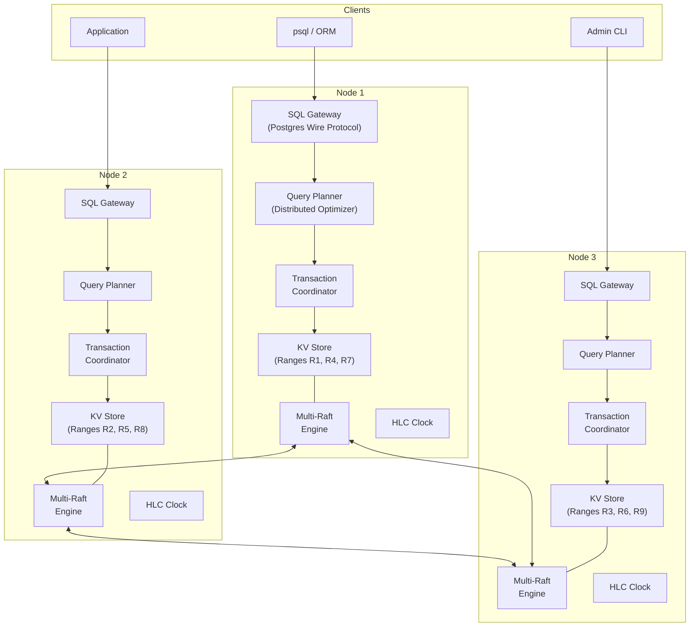

# System Design: Architecting a Distributed NewSQL Database

## Speaker Intro

This handbook is written from the perspective of a **Principal Database Architect** who has designed, shipped, and operated distributed SQL databases serving millions of transactions per second in production. The content draws from first-hand experience building storage engines, consensus layers, and distributed transaction managers at the intersection of database theory, systems programming, and distributed systems research—the kind of systems that underpin CockroachDB, TiDB, YugabyteDB, and Google Spanner.

## Who This Is For

- **Backend engineers** who use Postgres or MySQL daily but have never understood what happens *beneath* the SQL layer—how rows become bytes, how commits span machines, and how clocks determine correctness.
- **Infrastructure engineers** evaluating NewSQL databases (CockroachDB, TiDB, Spanner) and who need to understand the architectural trade-offs to make informed deployment, tuning, and debugging decisions.
- **Systems programmers** who want a concrete, end-to-end walkthrough of how a modern distributed database is built—from the wire protocol to the clock synchronization layer.
- **Anyone preparing for Staff+ system design interviews** where "Design a distributed SQL database" is a common question, and hand-waving about "just use sharding" won't cut it.

## Prerequisites

| Concept | Where to Learn |
|---|---|
| Intermediate Rust (ownership, traits, `async`) | [Async Rust](../async-book/src/SUMMARY.md) |
| Basic SQL (SELECT, INSERT, JOIN, transactions) | [SQL Rosetta Stone](../sql-rosetta-book/src/SUMMARY.md) |
| Database internals (B-Trees, buffer pools, MVCC) | [Database Internals](../database-internals-book/src/SUMMARY.md) |
| Distributed systems basics (consensus, replication) | [Distributed Systems](../distributed-systems-book/src/SUMMARY.md) |
| Networking (TCP, RPC, serialization) | [Tokio Internals](../tokio-internals-book/src/SUMMARY.md) |

## How to Use This Book

| Emoji | Meaning |
|---|---|
| 🟢 | **Architecture** — foundational design decisions, data flow, and component layout |
| 🟡 | **Consensus & Routing** — distributed coordination, shard management, key encoding |
| 🔴 | **Advanced** — distributed transactions, clock synchronization, correctness proofs |

Each chapter tackles **one layer of the database stack** in strict bottom-up order. Later chapters assume the layers beneath them exist. Read them sequentially.

## The Problem We Are Solving

> Design a **distributed, strongly-consistent SQL database** (like CockroachDB, TiDB, or Google Spanner) that provides a standard Postgres-compatible SQL interface while transparently distributing data across a cluster of commodity servers with **automatic sharding**, **multi-region replication**, and **serializable distributed transactions**.

The system we will build has these non-negotiable requirements:

| Requirement | Target |
|---|---|
| SQL compatibility | PostgreSQL wire protocol, standard SQL syntax |
| Consistency | Strict Serializability (the strongest guarantee) |
| Availability | Survive any single-node (or single-datacenter) failure |
| Sharding | Automatic range-based partitioning, no manual shard keys |
| Transactions | Cross-shard ACID with distributed 2PC |
| Scalability | Linear read/write throughput scaling with added nodes |
| Clock model | Hybrid Logical Clocks (no atomic clock hardware required) |

## Pacing Guide

| Chapter | Topic | Time | Checkpoint |
|---|---|---|---|
| Ch 0 | Introduction & Problem Statement | 30 min | Understand the full architecture and design canvas |
| Ch 1 | The SQL Gateway & Query Planner | 6–8 hours | Postgres wire protocol handler and distributed query plan |
| Ch 2 | Sharding & The Key-Value Layer | 6–8 hours | Row-to-KV encoding, range splits, range routing |
| Ch 3 | High Availability via Multi-Raft | 8–10 hours | Multi-Raft engine with 10 K concurrent consensus groups |
| Ch 4 | Distributed Transactions (2PC) | 8–10 hours | Distributed 2PC with intent locks and deadlock detection |
| Ch 5 | Time, Clocks, and MVCC | 6–8 hours | HLC implementation with MVCC read/write protocol |

**Total: ~35–45 hours** of focused study.

## Table of Contents

### Part I: The SQL Surface
- **Chapter 1 — The SQL Gateway and Query Planner 🟢** — Fooling the client: speaking the PostgreSQL wire protocol so any `psql` or ORM connects natively. Parsing SQL into an AST, building a cost-based optimizer, and generating distributed query plans that target specific physical shards.

### Part II: The Storage Engine
- **Chapter 2 — Sharding and The Key-Value Layer 🟡** — Tables don't exist at the storage layer. Encoding rows and indexes into ordered Key-Value pairs. Automatically splitting data into 64 MB Ranges, maintaining a global range directory, and routing reads/writes to the correct node.

### Part III: Consensus & Replication
- **Chapter 3 — High Availability via Multi-Raft 🔴** — Surviving datacenter fires. Running the Raft consensus algorithm at the *Range* level so a single server participates in thousands of independent Raft groups simultaneously, with batched heartbeats, coalesced I/O, and automatic leader rebalancing.

### Part IV: Distributed Transactions
- **Chapter 4 — Distributed Transactions (2PC) 🔴** — The nightmare scenario: atomically updating Row A on Server 1 and Row B on Server 2. A highly optimized two-phase commit protocol with transaction coordinator nodes, write intents, parallel commits, and distributed deadlock detection.

### Part V: Time & Correctness
- **Chapter 5 — Time, Clocks, and MVCC 🔴** — Ordering events across the globe when the speed of light limits you. The problem of clock skew. Google's TrueTime (atomic clocks) vs. CockroachDB's Hybrid Logical Clocks—and how either guarantees strict serializability for Multi-Version Concurrency Control without central coordination.

## Architecture Overview

Every node in the cluster is **identical**. Any node can accept SQL connections, plan queries, coordinate transactions, and store data. There is no single point of failure, no dedicated "master", and no manual shard routing. The entire system looks like a single Postgres database to the client.

## Companion Guides

| Book | Relevance |
|---|---|
| [Database Internals](../database-internals-book/src/SUMMARY.md) | Deep dive on B-Trees, buffer pools, WAL, single-node MVCC |
| [Distributed Systems](../distributed-systems-book/src/SUMMARY.md) | Consensus theory, CAP, clock models, failure detectors |
| [System Design: Message Broker](../system-design-book/src/SUMMARY.md) | Complementary system design — append-only logs, Raft replication |
| [Concurrency in Rust](../concurrency-book/src/SUMMARY.md) | Lock-free structures, atomics, and thread-safe patterns |
| [Hardware Sympathy](../hardware-sympathy-book/src/SUMMARY.md) | CPU caches, NUMA, io_uring — the performance layer beneath storage |

> **Key Takeaways**
>
> - A NewSQL database is **five independent systems** glued together: SQL gateway, KV engine, consensus layer, transaction manager, and clock.
> - Every node is a **peer**—the architecture is symmetric, with no single master.
> - The SQL interface is a **facade**: underneath, everything is ordered Key-Value pairs replicated via Raft.
> - Correctness depends entirely on **clocks and timestamps**, not on locks held across the network.
> - This book builds each layer in sequence—each chapter depends on the one before it.
