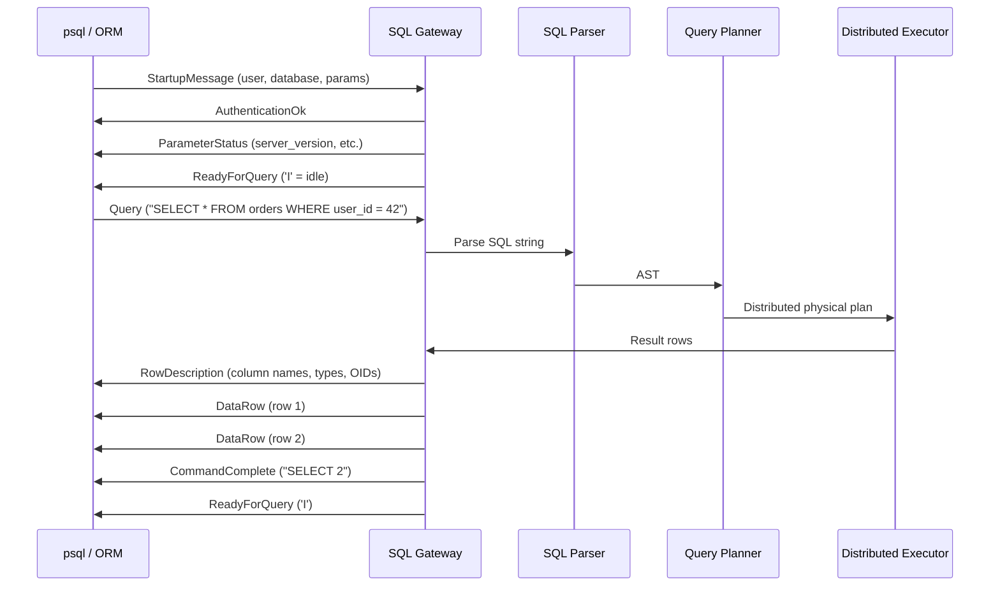
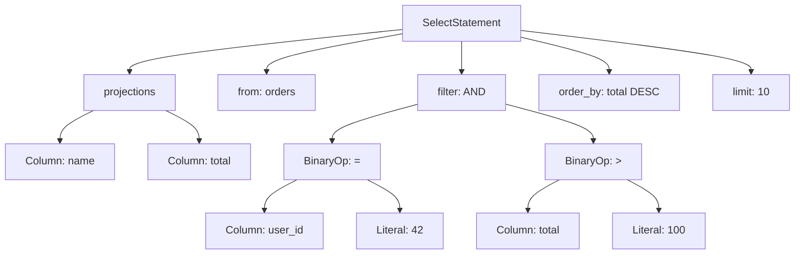
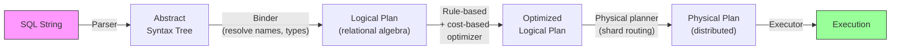
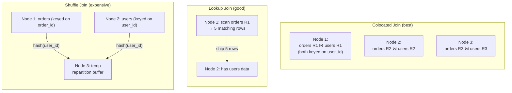
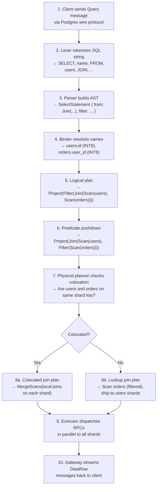

# 1. The SQL Gateway and Query Planner 🟢

> **The Problem:** Your database distributes data across dozens of servers, but the client connects with `psql` and runs `SELECT * FROM orders WHERE user_id = 42`. The client has no idea that the `orders` table is split across five physical machines. You need a gateway that speaks the PostgreSQL wire protocol fluently enough to fool *any* Postgres driver, parses the SQL into a structured representation, and builds an execution plan that routes each operation to the exact shard that holds the relevant data—all in single-digit milliseconds.

---

## Why Postgres Wire Protocol?

Building a proprietary binary protocol is tempting but strategically catastrophic. The Postgres ecosystem has **decades** of tooling: `psql`, pgAdmin, every ORM in every language, connection poolers like PgBouncer, and observability tools like pg_stat_statements. By speaking the Postgres wire protocol, you inherit all of that for free.

| Approach | Pros | Cons |
|---|---|---|
| **Custom binary protocol** | Full control, minimal overhead | Must build drivers for every language, no tooling ecosystem |
| **MySQL wire protocol** | Large ecosystem, simpler protocol | Weaker type system, less expressive SQL dialect |
| **PostgreSQL wire protocol** | Richest SQL dialect, massive tooling ecosystem, strong type system | More complex protocol (extended query, COPY, NOTIFY) |
| **HTTP/REST or gRPC** | Universally accessible | Terrible for transactional workloads, no cursor/streaming semantics |

CockroachDB, YugabyteDB, and Amazon Aurora all chose the Postgres wire protocol. There's a reason.

---

## The PostgreSQL Wire Protocol

The Postgres wire protocol is a message-based, binary protocol over TCP. Every interaction follows the same lifecycle:



### The Message Format

Every message (after the initial startup) has a one-byte tag followed by a four-byte length:

```
┌─────────┬─────────────┬──────────────────────────┐
│ Tag (1B)│ Length (4B)  │ Payload (Length - 4 bytes)│
└─────────┴─────────────┴──────────────────────────┘
```

Key message types:

| Tag | Name | Direction | Purpose |
|---|---|---|---|
| `Q` | Query | Client → Server | Simple query (SQL string) |
| `P` | Parse | Client → Server | Extended query: prepare statement |
| `B` | Bind | Client → Server | Extended query: bind parameters |
| `E` | Execute | Client → Server | Extended query: execute portal |
| `T` | RowDescription | Server → Client | Column metadata |
| `D` | DataRow | Server → Client | One row of data |
| `C` | CommandComplete | Server → Client | "SELECT 5", "INSERT 0 1", etc. |
| `Z` | ReadyForQuery | Server → Client | Transaction state: `I` / `T` / `E` |
| `E` | ErrorResponse | Server → Client | SQLSTATE code + message |

### Connection Handler in Rust

```rust,ignore
use tokio::net::TcpListener;
use tokio::io::{AsyncReadExt, AsyncWriteExt};
use bytes::{Buf, BytesMut};

/// Each connection gets its own task. The gateway holds no
/// per-connection state in shared memory — everything lives
/// on the stack of this async fn.
async fn handle_connection(mut stream: tokio::net::TcpStream) -> anyhow::Result<()> {
    let mut buf = BytesMut::with_capacity(8192);

    // Phase 1: Startup handshake.
    // The client sends a StartupMessage (no tag byte — special case).
    stream.read_buf(&mut buf).await?;
    let _startup = parse_startup_message(&buf)?;
    buf.clear();

    // Send AuthenticationOk (tag 'R', auth type 0 = OK).
    send_auth_ok(&mut stream).await?;
    send_parameter_status(&mut stream, "server_version", "14.0").await?;
    send_ready_for_query(&mut stream, b'I').await?; // 'I' = idle

    // Phase 2: Query loop.
    loop {
        buf.clear();
        let n = stream.read_buf(&mut buf).await?;
        if n == 0 { break; } // Client disconnected.

        let tag = buf[0];
        let _len = (&buf[1..5]).get_u32() as usize;

        match tag {
            b'Q' => {
                // Simple Query protocol.
                let sql = std::str::from_utf8(&buf[5..buf.len() - 1])?; // null-terminated
                let result = execute_query(sql).await?;
                send_result_set(&mut stream, &result).await?;
                send_ready_for_query(&mut stream, b'I').await?;
            }
            b'P' => {
                // Extended Query: Parse (prepared statement).
                handle_parse(&mut stream, &buf).await?;
            }
            b'X' => break, // Terminate.
            _ => {
                send_error(&mut stream, "XX000", "Unsupported message type").await?;
            }
        }
    }
    Ok(())
}
```

### Simple vs. Extended Query Protocol

| Feature | Simple Query (`Q`) | Extended Query (`P`/`B`/`E`) |
|---|---|---|
| Round trips | 1 (send SQL, get results) | 3+ (Parse → Bind → Execute) |
| Parameter binding | String interpolation (SQL injection risk) | Binary parameter binding (safe) |
| Plan caching | No (re-plans every time) | Yes (Parse once, Execute many) |
| Streaming | Entire result set at once | Portal-based cursor with `max_rows` |
| Used by | `psql` interactive, simple scripts | Every production ORM (SQLAlchemy, JDBC, etc.) |

The extended query protocol is critical for performance. A prepared statement is parsed and planned **once**, then executed thousands of times with different parameters. The gateway must maintain a per-connection cache of prepared statements:

```rust,ignore
use std::collections::HashMap;

struct ConnectionState {
    /// Named prepared statements: "stmt_1" → (AST, PhysicalPlan).
    prepared: HashMap<String, PreparedStatement>,
    /// Named portals: "portal_1" → bound plan with concrete params.
    portals: HashMap<String, Portal>,
    /// Current transaction state: Idle, InTransaction, or Failed.
    txn_state: TransactionState,
}

struct PreparedStatement {
    sql: String,
    ast: Statement,
    plan: LogicalPlan,
    param_types: Vec<Oid>,
}

struct Portal {
    plan: PhysicalPlan,
    params: Vec<Datum>,
    cursor_position: usize,
}

enum TransactionState {
    Idle,          // 'I' — no active transaction
    InTransaction, // 'T' — inside BEGIN...COMMIT
    Failed,        // 'E' — error occurred, must ROLLBACK
}
```

---

## SQL Parsing: From Text to AST

Once the gateway extracts the SQL string, it must be parsed into a structured **Abstract Syntax Tree (AST)**. The standard approach:

1. **Lexer (tokenizer):** Breaks the SQL string into tokens: keywords (`SELECT`, `FROM`, `WHERE`), identifiers (`orders`, `user_id`), literals (`42`), operators (`=`, `AND`).
2. **Parser:** Consumes tokens and builds a tree that represents the *logical structure* of the query.

### The AST Representation

```rust,ignore
/// A simplified SQL AST for SELECT queries.
enum Statement {
    Select(SelectStatement),
    Insert(InsertStatement),
    Update(UpdateStatement),
    Delete(DeleteStatement),
    CreateTable(CreateTableStatement),
    Begin,
    Commit,
    Rollback,
}

struct SelectStatement {
    /// The columns to return: `*`, `user_id`, `COUNT(*)`, etc.
    projections: Vec<Expr>,
    /// The table(s) to read from, including JOINs.
    from: Vec<TableRef>,
    /// The WHERE clause filter.
    filter: Option<Expr>,
    /// GROUP BY columns.
    group_by: Vec<Expr>,
    /// HAVING filter (post-aggregation).
    having: Option<Expr>,
    /// ORDER BY clauses.
    order_by: Vec<OrderByExpr>,
    /// LIMIT N.
    limit: Option<u64>,
    /// OFFSET N.
    offset: Option<u64>,
}

enum Expr {
    Column(ColumnRef),
    Literal(Value),
    BinaryOp { left: Box<Expr>, op: BinaryOperator, right: Box<Expr> },
    Function { name: String, args: Vec<Expr> },
    Subquery(Box<SelectStatement>),
}

struct ColumnRef {
    table: Option<String>,
    column: String,
}

enum Value {
    Integer(i64),
    Float(f64),
    Text(String),
    Bool(bool),
    Null,
}
```

For `SELECT name, total FROM orders WHERE user_id = 42 AND total > 100 ORDER BY total DESC LIMIT 10`, the AST looks like:



### Build vs. Buy: SQL Parser Strategy

| Strategy | Examples | Pros | Cons |
|---|---|---|---|
| **Write from scratch** | Hand-rolled recursive descent | Total control, minimal dependencies | Months of work, SQL spec is enormous |
| **Parser generator** | LALR/PEG grammar + codegen | Grammar is declarative, easy to extend | Error messages are often poor |
| **Fork an existing parser** | `sqlparser-rs` crate | Covers 90%+ of SQL, actively maintained | Must track upstream, dialect mismatches |
| **Embed the real Postgres parser** | Extract `gram.y` from PG source | Perfect compatibility | C dependency, harder to modify |

In practice, most NewSQL databases start with a parser library and extend it. CockroachDB originally forked the Go `yacc` grammar from Postgres; TiDB uses a Go parser inspired by MySQL's grammar.

```rust,ignore
use sqlparser::dialect::PostgreSqlDialect;
use sqlparser::parser::Parser;

fn parse_sql(sql: &str) -> Result<Vec<sqlparser::ast::Statement>, sqlparser::parser::ParserError> {
    let dialect = PostgreSqlDialect {};
    Parser::parse_sql(&dialect, sql)
}

// Example usage:
// let stmts = parse_sql("SELECT * FROM orders WHERE user_id = 42")?;
// stmts[0] is a Statement::Query(Query { body: Select { ... } })
```

---

## The Distributed Query Optimizer

This is where a NewSQL database diverges completely from a single-node database. A traditional optimizer chooses between index scans, sequential scans, hash joins, and merge joins. A **distributed** optimizer must also decide:

1. **Which shards hold the relevant data?** (Range routing)
2. **Can the query be pushed down to a single shard?** (Single-shard fast path)
3. **Does data need to move between servers?** (Distributed joins, shuffles)
4. **Where should aggregation happen?** (Partial aggregation at the shard, final aggregation at the gateway)

### The Optimization Pipeline



### Stage 1: Binding (Name Resolution)

The binder resolves unqualified names against the catalog:

- `orders` → `public.orders` (table OID 12345)
- `user_id` → `public.orders.user_id` (column index 0, type INT8)
- `total` → `public.orders.total` (column index 3, type NUMERIC)

It also checks types: `user_id = 42` is valid (INT8 = INT8), but `user_id = 'hello'` is a type error.

```rust,ignore
struct Catalog {
    tables: HashMap<String, TableDescriptor>,
}

struct TableDescriptor {
    id: u64,
    name: String,
    columns: Vec<ColumnDescriptor>,
    primary_key: Vec<usize>,  // Column indices
    indexes: Vec<IndexDescriptor>,
    /// The key ranges this table spans.
    /// Updated by the range directory as splits happen.
    ranges: Vec<RangeDescriptor>,
}

struct ColumnDescriptor {
    name: String,
    data_type: DataType,
    nullable: bool,
    default: Option<Expr>,
}

struct RangeDescriptor {
    range_id: u64,
    start_key: Vec<u8>,
    end_key: Vec<u8>,
    /// Which node is the Raft leader for this range?
    leader_node: NodeId,
    /// All replicas (for follower reads).
    replicas: Vec<NodeId>,
}
```

### Stage 2: Logical Plan

The AST is converted to **relational algebra**—a canonical representation of the query as a tree of operators:

```rust,ignore
enum LogicalPlan {
    Scan {
        table: TableDescriptor,
        filter: Option<Expr>,
        columns: Vec<usize>,  // Projection pushdown
    },
    Filter {
        input: Box<LogicalPlan>,
        predicate: Expr,
    },
    Project {
        input: Box<LogicalPlan>,
        exprs: Vec<Expr>,
    },
    Join {
        left: Box<LogicalPlan>,
        right: Box<LogicalPlan>,
        on: Expr,
        join_type: JoinType,
    },
    Aggregate {
        input: Box<LogicalPlan>,
        group_by: Vec<Expr>,
        aggregates: Vec<AggregateExpr>,
    },
    Sort {
        input: Box<LogicalPlan>,
        order_by: Vec<OrderByExpr>,
    },
    Limit {
        input: Box<LogicalPlan>,
        count: u64,
        offset: u64,
    },
}
```

### Stage 3: Rule-Based Optimization

Before cost-based optimization, apply **heuristic rules** that are always beneficial:

| Rule | Example | Benefit |
|---|---|---|
| **Predicate pushdown** | Push `WHERE user_id = 42` below JOIN | Reduces data volume before join |
| **Projection pushdown** | Only read columns `name`, `total` from disk | Reduces I/O |
| **Constant folding** | `1 + 1` → `2` | Eliminates runtime computation |
| **Subquery decorrelation** | `WHERE x IN (SELECT ...)` → semi-join | Enables join optimizations |
| **Filter merge** | `Filter(Filter(Scan))` → `Filter(Scan)` | Reduces operator overhead |

### Stage 4: Cost-Based Optimization (CBO)

The CBO estimates the **cost** of each possible physical plan and picks the cheapest. Cost depends on:

- **Cardinality estimates:** How many rows will each operator produce? (Uses per-column histograms and distinct-value counts from `ANALYZE`.)
- **Network cost:** Moving 1 GB across servers is 100× more expensive than reading 1 GB from local SSD.
- **Shard locality:** If `user_id = 42` maps to a single range on Node 3, the entire query can be executed there with zero network hops.

```rust,ignore
struct PlanCost {
    /// Estimated number of rows produced.
    estimated_rows: f64,
    /// CPU cost (arbitrary units — comparison ops, hashing, etc.).
    cpu_cost: f64,
    /// Disk I/O cost (bytes read from storage).
    io_cost: f64,
    /// Network cost (bytes transferred between nodes).
    network_cost: f64,
}

impl PlanCost {
    fn total(&self) -> f64 {
        // Network is ~100x more expensive than local I/O.
        self.cpu_cost + self.io_cost + (self.network_cost * 100.0)
    }
}
```

### Stage 5: Physical Plan — The Distributed Dimension

The physical planner converts the optimized logical plan into a **distributed execution plan** by consulting the range directory:

```rust,ignore
enum PhysicalPlan {
    /// Read from a single range on a specific node.
    RangeScan {
        range: RangeDescriptor,
        filter: Option<Expr>,
        columns: Vec<usize>,
    },
    /// Merge results from multiple range scans (parallel fan-out).
    MergeScans {
        scans: Vec<PhysicalPlan>,
    },
    /// Send data from one node to another for a distributed join.
    Exchange {
        input: Box<PhysicalPlan>,
        /// Hash partition the data by these columns.
        partition_by: Vec<usize>,
        target_nodes: Vec<NodeId>,
    },
    /// Local operations (filter, project, sort, etc.) on a single node.
    LocalOperator {
        op: LocalOp,
        input: Box<PhysicalPlan>,
    },
    /// Two-phase aggregation: partial at each shard, final at gateway.
    DistributedAggregate {
        partial_plan: Box<PhysicalPlan>,  // Runs on each shard
        final_plan: Box<PhysicalPlan>,    // Runs at gateway
    },
}
```

### Example: Single-Shard vs. Multi-Shard Query

**Query:** `SELECT * FROM orders WHERE user_id = 42`

The optimizer checks: is `user_id` the primary key (or a prefix of it)? If yes, it can compute the exact KV key for `user_id = 42`, look up the range directory, and route the entire query to a **single shard**:

```
Plan A (single-shard — preferred):
  RangeScan(range=R7, node=Node3, filter=user_id=42)
  Cost: { rows: 15, cpu: 0.01, io: 0.1, network: 0.0 }
```

**Query:** `SELECT user_id, SUM(total) FROM orders GROUP BY user_id`

This must scan *all* ranges of the `orders` table. The optimizer generates a **distributed aggregation plan**:

```
Plan B (distributed aggregation):
  DistributedAggregate(
    partial: MergeScans([
      RangeScan(R1, Node1, columns=[user_id, total]),
      RangeScan(R2, Node1, columns=[user_id, total]),
      RangeScan(R3, Node2, columns=[user_id, total]),
      RangeScan(R4, Node3, columns=[user_id, total]),
    ]),
    final: Aggregate(group_by=[user_id], agg=[SUM(partial_sum)])
  )
  Cost: { rows: 10_000, cpu: 5.0, io: 50.0, network: 2.0 }
```

Each shard computes a **partial SUM** locally, then the gateway merges the partial results. This minimizes network traffic—only the partial aggregates (one row per `user_id` per shard) cross the network, not the full table.

---

## Distributed JOIN Strategies

JOINs across sharded tables are the hardest problem in distributed query planning. There are three strategies:

| Strategy | When to Use | Cost |
|---|---|---|
| **Colocated join** | Both tables sharded on the join key | Zero network — join executes locally on each shard |
| **Lookup join** | One side is small or filtered to a single shard | Ship filtered rows to the other shard |
| **Shuffle (hash) join** | Neither side is colocated | Repartition both sides by join key — expensive |



### Colocation: The Secret Weapon

If `orders` and `users` are both sharded on `user_id`, then for any given `user_id`, both the `orders` rows and the `users` row live on the **same physical node**. The join executes locally with zero network hops. This is why NewSQL databases let you define **colocation groups**:

```sql
-- CockroachDB syntax: colocate tables by interleaving
CREATE TABLE users (
    user_id INT PRIMARY KEY,
    name TEXT
);

CREATE TABLE orders (
    order_id INT,
    user_id INT REFERENCES users(user_id),
    total NUMERIC,
    PRIMARY KEY (user_id, order_id)  -- user_id is prefix → colocated
);
```

By making `user_id` the prefix of the `orders` primary key, the KV encoding guarantees that `orders` rows for user 42 are stored in the **same range** as the `users` row for user 42.

---

## The Execution Engine

Once the physical plan is built, the **execution engine** dispatches it:

```rust,ignore
async fn execute_plan(
    plan: PhysicalPlan,
    local_kv: &KvStore,
    rpc_client: &RpcClient,
) -> Result<Vec<Row>, QueryError> {
    match plan {
        PhysicalPlan::RangeScan { range, filter, columns } => {
            if range.leader_node == local_node_id() {
                // Fast path: data is local.
                local_kv.scan(&range, filter.as_ref(), &columns).await
            } else {
                // Send RPC to the remote node.
                rpc_client.remote_scan(range.leader_node, &range, filter, &columns).await
            }
        }
        PhysicalPlan::MergeScans { scans } => {
            // Fan out all scans in parallel.
            let futures: Vec<_> = scans.into_iter()
                .map(|s| execute_plan(s, local_kv, rpc_client))
                .collect();
            let results = futures::future::try_join_all(futures).await?;
            Ok(results.into_iter().flatten().collect())
        }
        PhysicalPlan::DistributedAggregate { partial_plan, final_plan } => {
            // Phase 1: execute partial aggregation on each shard.
            let partials = execute_plan(*partial_plan, local_kv, rpc_client).await?;
            // Phase 2: final aggregation at the gateway.
            aggregate_final(&final_plan, partials)
        }
        // ... Exchange, LocalOperator, etc.
        _ => todo!(),
    }
}
```

### Fan-out and Parallel Execution

For a `MergeScans` over 50 ranges, the gateway sends 50 RPCs **in parallel**. The latency is determined by the *slowest* shard (tail latency), not the sum. This is why p99 latency monitoring is critical—a single slow node degrades every multi-shard query.

Mitigation strategies for tail latency:

| Strategy | How It Works |
|---|---|
| **Hedged requests** | After 10ms with no response, re-send the RPC to a replica |
| **Speculative execution** | Send to both leader and a follower from the start, take whichever responds first |
| **Adaptive timeouts** | Track per-node p99 and set node-specific timeouts |
| **Shard rebalancing** | Move hot ranges off overloaded nodes |

---

## Query Plan Caching

Re-optimizing every query is wasteful. The gateway maintains a **plan cache** keyed by the SQL fingerprint (the SQL string with literals replaced by `$N` placeholders):

```rust,ignore
use std::collections::HashMap;
use std::hash::{Hash, Hasher};

struct PlanCache {
    /// Key: SQL fingerprint, Value: optimized physical plan.
    cache: HashMap<String, CachedPlan>,
    max_entries: usize,
}

struct CachedPlan {
    plan: PhysicalPlan,
    /// Invalidate when the table schema or range layout changes.
    schema_version: u64,
    range_generation: u64,
    hit_count: u64,
}

impl PlanCache {
    fn get(&mut self, fingerprint: &str, current_schema: u64, current_ranges: u64) -> Option<&PhysicalPlan> {
        let entry = self.cache.get_mut(fingerprint)?;
        // Invalidate if the schema or range directory has changed.
        if entry.schema_version != current_schema || entry.range_generation != current_ranges {
            self.cache.remove(fingerprint);
            return None;
        }
        entry.hit_count += 1;
        Some(&entry.plan)
    }

    /// Fingerprint: "SELECT * FROM orders WHERE user_id = $1 AND total > $2"
    fn fingerprint(sql: &str) -> String {
        // Replace literal values with numbered placeholders.
        // "WHERE user_id = 42 AND total > 100"
        //   → "WHERE user_id = $1 AND total > $2"
        replace_literals_with_placeholders(sql)
    }
}
```

**Cache invalidation triggers:**
- `ALTER TABLE` changes the schema version.
- A range split or merge changes the range generation.
- `ANALYZE` updates table statistics (cardinality estimates change).

---

## Putting It All Together: A Query's Journey

Let's trace `SELECT name FROM users JOIN orders ON users.id = orders.user_id WHERE orders.total > 1000` through the entire pipeline:



---

## Production Considerations

### Connection Pooling

Each TCP connection consumes ~50 KB of kernel buffer space plus the `ConnectionState` on the heap. At 10,000 concurrent connections, that's 500 MB just for buffers. Strategies:

- **Server-side pooling:** Multiplex many client connections onto a smaller pool of internal execution slots.
- **External pooler:** Use PgBouncer or Odyssey in front of the gateway for connection reuse.
- **HTTP/2 multiplexing:** For microservice clients, offer a gRPC alternative that multiplexes on a single TCP connection.

### Authentication and TLS

The Postgres wire protocol supports multiple authentication methods:

- `trust` (no auth — development only)
- `md5` (legacy, weak)
- `scram-sha-256` (modern, standard)
- `cert` (mutual TLS client certificates)

In production, enforce **SCRAM-SHA-256** or **mutual TLS**. Never allow `trust` outside of development.

### Observability

Every query that passes through the gateway should emit:

| Metric | Purpose |
|---|---|
| `query_latency_seconds` (histogram) | p50/p99 latency by query fingerprint |
| `query_count` (counter) | QPS by statement type (SELECT/INSERT/UPDATE/DELETE) |
| `plan_cache_hit_ratio` (gauge) | Optimizer cache effectiveness |
| `active_connections` (gauge) | Connection pool utilization |
| `distributed_fan_out` (histogram) | Number of shards touched per query |

---

> **Key Takeaways**
>
> - The SQL Gateway speaks the **Postgres wire protocol** so all existing tooling works unmodified.
> - SQL is parsed into an **AST**, then converted to a **logical plan** (relational algebra), then optimized and converted to a **distributed physical plan** that targets specific shards.
> - The **distributed optimizer** is the core differentiator: it decides which shards to touch, whether a join can be colocated, and how to minimize network transfer.
> - **Plan caching** avoids re-optimizing repeated queries but must be invalidated when schemas or range layouts change.
> - **Colocated joins** (same shard key prefix) are the key to making distributed JOINs perform like local JOINs.
> - The gateway is **stateless per query** (no shared mutable state between connections), making it easy to scale horizontally by adding more gateway nodes.
