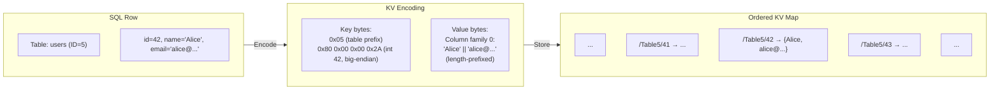
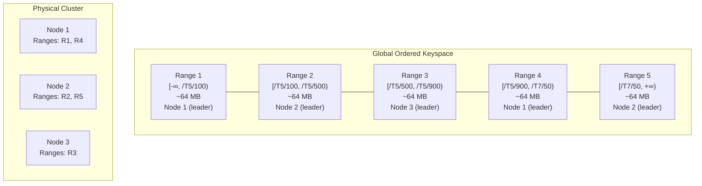
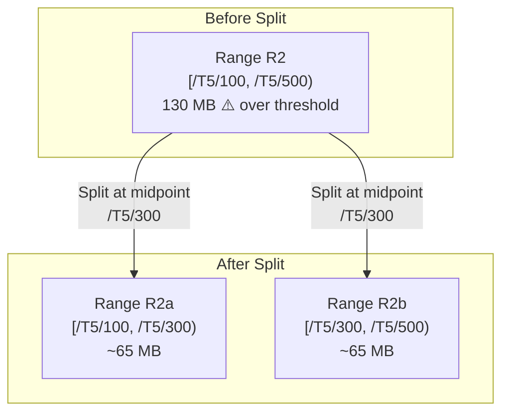
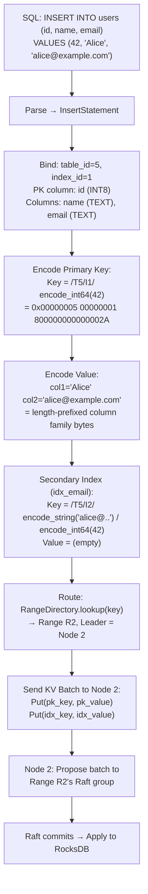

# 2. Sharding and The Key-Value Layer 🟡

> **The Problem:** The client thinks they're querying tables with rows and columns. But underneath, your distributed database stores *everything* as sorted Key-Value pairs in an ordered map. You need a translation layer that encodes every row, every index entry, and every piece of metadata into a deterministic byte sequence—and then automatically partitions that byte space into ~64 MB chunks called "Ranges" that can be independently moved, split, merged, and replicated across physical servers.

---

## Why Key-Value? The Great Unification

A relational database has tables, rows, columns, primary keys, secondary indexes, foreign keys, sequences, and system catalog entries. Building a distributed storage engine that understands all of these natively would be nightmarishly complex.

Instead, every successful NewSQL database uses the same trick: **flatten everything into a single, ordered Key-Value map**.

| What the Client Sees | What the KV Layer Stores |
|---|---|
| `INSERT INTO users (id, name, email) VALUES (42, 'Alice', 'alice@example.com')` | `Key: /Table/users/42` → `Value: {name: "Alice", email: "alice@example.com"}` |
| `CREATE INDEX idx_email ON users(email)` | `Key: /Index/idx_email/"alice@example.com"/42` → `Value: (empty or covering columns)` |
| `SELECT * FROM users WHERE id = 42` | `Get(/Table/users/42)` |
| `SELECT * FROM users WHERE id BETWEEN 10 AND 20` | `Scan(/Table/users/10, /Table/users/20)` |
| `SELECT * FROM users WHERE email = 'alice@example.com'` | `Get(/Index/idx_email/"alice@example.com"/42)` → PK `42` → `Get(/Table/users/42)` |

The KV layer needs exactly **two operations**: point `Get` and range `Scan`. Everything else—joins, aggregations, sorting—happens *above* the KV layer in the SQL execution engine.

---

## The SQL-to-KV Translation

### Primary Key Encoding

Every row is stored as a single KV pair. The **key** is the encoded primary key; the **value** is the encoded column data.

The key must be **order-preserving**: if `pk_a < pk_b` in SQL semantics, then `encode(pk_a) < encode(pk_b)` in raw byte comparison. This lets range scans work with simple byte comparisons.



### Order-Preserving Encoding Rules

The encoding must handle all SQL types while preserving sort order under byte comparison:

| SQL Type | Encoding Strategy | Example |
|---|---|---|
| `INT8` / `BIGINT` | Big-endian, flip the sign bit so negatives sort before positives | `42` → `0x80 0x00 0x00 0x00 0x00 0x00 0x00 0x2A` |
| `TEXT` / `VARCHAR` | Escaped encoding: `0x00` → `0x00 0xFF`, terminated by `0x00 0x00` | `"Alice"` → `0x41 0x6C 0x69 0x63 0x65 0x00 0x00` |
| `FLOAT8` | IEEE 754 → flip sign bit, if negative flip all bits | Preserves total ordering |
| `BOOL` | `false` → `0x00`, `true` → `0x01` | Direct byte comparison |
| `TIMESTAMP` | Encode as microseconds-since-epoch, big-endian INT8 | Chronological sort = byte sort |
| `NULL` | Special sentinel byte `0x00` (sorts before all values) | NULLs sort first |
| `COMPOSITE` | Concatenate encoded components with separators | `(user_id, order_id)` → `encode(user_id) || encode(order_id)` |

```rust,ignore
/// Order-preserving encoding for signed 64-bit integers.
/// Flips the sign bit so that negative numbers sort before positive
/// numbers under unsigned byte comparison.
fn encode_int64(val: i64) -> [u8; 8] {
    // Flip the sign bit: -1 (0xFFFFFFFFFFFFFFFF) → 0x7FFFFFFFFFFFFFFF
    //                      0 (0x0000000000000000) → 0x8000000000000000
    //                      1 (0x0000000000000001) → 0x8000000000000001
    let unsigned = (val as u64) ^ (1u64 << 63);
    unsigned.to_be_bytes()
}

fn decode_int64(bytes: [u8; 8]) -> i64 {
    let unsigned = u64::from_be_bytes(bytes) ^ (1u64 << 63);
    unsigned as i64
}

/// Order-preserving encoding for strings.
/// Uses escaped encoding so that 0x00 bytes in the input don't
/// corrupt the sort order.
fn encode_string(val: &str) -> Vec<u8> {
    let mut result = Vec::with_capacity(val.len() + 2);
    for &b in val.as_bytes() {
        if b == 0x00 {
            result.push(0x00);
            result.push(0xFF); // Escape null bytes
        } else {
            result.push(b);
        }
    }
    result.push(0x00);
    result.push(0x00); // Terminator
    result
}
```

### Full Key Encoding: Table + Primary Key

The complete key format:

```
┌───────────────┬────────────────┬──────────────────────────┐
│ Table ID (4B) │ Index ID (4B)  │ Encoded PK columns       │
│ (big-endian)  │ (1 = primary)  │ (order-preserving)       │
└───────────────┴────────────────┴──────────────────────────┘
```

```rust,ignore
struct KeyEncoder {
    buf: Vec<u8>,
}

impl KeyEncoder {
    fn new() -> Self {
        Self { buf: Vec::with_capacity(64) }
    }

    fn encode_table_prefix(&mut self, table_id: u32, index_id: u32) {
        self.buf.extend_from_slice(&table_id.to_be_bytes());
        self.buf.extend_from_slice(&index_id.to_be_bytes());
    }

    fn encode_primary_key(&mut self, pk_columns: &[Datum]) {
        for datum in pk_columns {
            match datum {
                Datum::Int64(v) => self.buf.extend_from_slice(&encode_int64(*v)),
                Datum::String(v) => self.buf.extend_from_slice(&encode_string(v)),
                Datum::Null => self.buf.push(0x00),
                // ... other types
                _ => todo!(),
            }
        }
    }

    fn finish(self) -> Vec<u8> {
        self.buf
    }
}

// Example: table_id=5, index_id=1 (primary), pk=42
// Key = [0x00,0x00,0x00,0x05, 0x00,0x00,0x00,0x01, 0x80,0x00,0x00,0x00,0x00,0x00,0x00,0x2A]
```

### Value Encoding: Column Families

The value contains the non-primary-key columns. NewSQL databases group columns into **column families** to optimize wide tables:

```rust,ignore
/// Column family: a group of columns stored together in a single KV value.
/// By default, all columns are in family 0. Users can define custom families
/// for wide tables to avoid reading all columns on every access.
struct ColumnFamily {
    family_id: u32,
    columns: Vec<(usize, Datum)>, // (column_index, value)
}

fn encode_value(families: &[ColumnFamily]) -> Vec<u8> {
    let mut buf = Vec::new();
    for family in families {
        // Each column: type tag (1B) + length-prefixed data.
        for (col_idx, datum) in &family.columns {
            buf.extend_from_slice(&(*col_idx as u16).to_be_bytes());
            match datum {
                Datum::Int64(v) => {
                    buf.push(0x01); // type tag: INT64
                    buf.extend_from_slice(&v.to_be_bytes());
                }
                Datum::String(v) => {
                    buf.push(0x02); // type tag: STRING
                    buf.extend_from_slice(&(v.len() as u32).to_be_bytes());
                    buf.extend_from_slice(v.as_bytes());
                }
                Datum::Null => {
                    buf.push(0x00); // type tag: NULL
                }
                _ => todo!(),
            }
        }
    }
    buf
}
```

---

## Secondary Index Encoding

A secondary index on `email` produces **additional KV pairs** for each row:

```
Index key:  [table_id, index_id, encode(email), encode(pk)]
Index value: (empty for non-covering index, or covering columns)
```

The primary key is **appended to the index key** to ensure uniqueness—two users could have the same email (if the column allows it), but the composite `(email, pk)` is always unique.

```rust,ignore
fn encode_secondary_index_key(
    table_id: u32,
    index_id: u32,
    index_columns: &[Datum],
    pk_columns: &[Datum],
) -> Vec<u8> {
    let mut enc = KeyEncoder::new();
    enc.encode_table_prefix(table_id, index_id);
    // Index columns first (for index-scan ordering).
    for datum in index_columns {
        match datum {
            Datum::Int64(v) => enc.buf.extend_from_slice(&encode_int64(*v)),
            Datum::String(v) => enc.buf.extend_from_slice(&encode_string(v)),
            _ => todo!(),
        }
    }
    // Primary key columns at the end (for uniqueness + row lookup).
    enc.encode_primary_key(pk_columns);
    enc.finish()
}
```

### Index Scan → Primary Lookup

When the query optimizer chooses an index scan:

```
SELECT name FROM users WHERE email = 'alice@example.com'
```

1. **Index scan:** `Get(/Index/idx_email/"alice@example.com"/*)` → finds key ending with PK `42`.
2. **Primary lookup:** `Get(/Table/users/42)` → reads the `name` column.

A **covering index** avoids step 2 by storing the needed columns in the index value:

```sql
CREATE INDEX idx_email_covering ON users(email) STORING (name);
```

Now the index value contains `name`, and the query completes in a single KV read.

---

## Ranges: The Unit of Distribution

The entire KV keyspace is divided into contiguous, non-overlapping **Ranges** (called "Regions" in TiDB, "Tablets" in YugabyteDB):



### Range Properties

| Property | Value | Rationale |
|---|---|---|
| **Target size** | 64 MB (CockroachDB) / 96 MB (TiDB) | Small enough to move quickly, large enough to amortize metadata |
| **Replication factor** | 3 (default) | Survives 1 node failure, tolerates 1 slow node |
| **Consensus** | Independent Raft group per range | Fine-grained replication and leadership |
| **Key range** | `[start_key, end_key)` | Half-open interval, no gaps or overlaps |
| **Max size before split** | 128 MB (2× target) | Triggers automatic split |
| **Min size before merge** | 16 MB (0.25× target) | Triggers automatic merge with neighbor |

### The Range Directory (Meta Ranges)

Every node needs to answer: "Given this KV key, which Range and which Node holds it?" This is maintained by a **Range Directory** (also called the "PD" or "Placement Driver" in TiDB):

```rust,ignore
/// The Range Directory is itself stored as a Range (the "meta range")
/// and replicated via Raft for high availability.
struct RangeDirectory {
    /// Sorted list of all ranges in the system.
    ranges: BTreeMap<Vec<u8>, RangeDescriptor>,
}

struct RangeDescriptor {
    range_id: u64,
    start_key: Vec<u8>,
    end_key: Vec<u8>,
    /// The Raft group replicas and their nodes.
    replicas: Vec<ReplicaDescriptor>,
    /// Which replica is the current Raft leader?
    leader_replica: Option<ReplicaId>,
    /// Monotonically increasing generation — incremented on every split/merge.
    generation: u64,
}

struct ReplicaDescriptor {
    replica_id: u64,
    node_id: NodeId,
    /// VOTER_FULL, VOTER_INCOMING, VOTER_OUTGOING, LEARNER, etc.
    replica_type: ReplicaType,
}

impl RangeDirectory {
    /// O(log N) lookup: find the range that contains this key.
    fn lookup(&self, key: &[u8]) -> Option<&RangeDescriptor> {
        // Find the range whose start_key ≤ key < end_key.
        self.ranges
            .range(..=key.to_vec())
            .next_back()
            .map(|(_, desc)| desc)
            .filter(|desc| key < desc.end_key.as_slice())
    }
}
```

### Range Directory Caching

Every node **caches** the range directory locally. When a request is routed to a node that no longer holds the Range (because the leader moved), the node returns a `RangeNotFound` or `NotLeader` error with a hint about the new leader. The client updates its cache and retries:

```rust,ignore
async fn route_request(
    key: &[u8],
    cache: &mut RangeDirectoryCache,
    rpc: &RpcClient,
) -> Result<Response, RoutingError> {
    loop {
        let desc = cache.lookup(key)
            .ok_or(RoutingError::NoRangeFound)?;

        let leader = desc.leader_replica
            .ok_or(RoutingError::NoLeader)?;

        match rpc.send(leader.node_id, Request::Get(key.to_vec())).await {
            Ok(resp) => return Ok(resp),
            Err(RpcError::NotLeader { new_leader, updated_desc }) => {
                // Update cache with fresher information.
                cache.update(updated_desc);
                continue; // Retry with new leader.
            }
            Err(RpcError::RangeNotFound { suggested_desc }) => {
                cache.update(suggested_desc);
                continue;
            }
            Err(e) => return Err(e.into()),
        }
    }
}
```

---

## Automatic Range Splitting

When a Range grows beyond its maximum size threshold (e.g., 128 MB), it must be **split** into two smaller Ranges:



### Split Point Selection

Choosing the split point is critical. A naive midpoint (bisect the byte range) can produce pathological splits on non-uniform data. Better strategies:

| Strategy | How It Works | Pros | Cons |
|---|---|---|---|
| **Size-based midpoint** | Track cumulative bytes, split at 50% of size | Even size distribution | May split in the middle of a row |
| **Key-based midpoint** | Track key count, split at the median key | Even key distribution | Uneven sizes if value sizes vary |
| **Write-heat split** | Split at the hottest write region | Reduces contention | Complex tracking |
| **Table boundary split** | Always split at table/index boundaries | Clean separation | Some ranges may be tiny |

```rust,ignore
struct RangeSplitter {
    /// Maximum range size before triggering a split.
    max_range_size: u64,  // e.g., 128 MB
    /// Check interval.
    check_interval: Duration,
}

impl RangeSplitter {
    async fn maybe_split(&self, range: &Range, kv_engine: &KvEngine) -> Option<Vec<u8>> {
        let size = kv_engine.range_size(range).await;
        if size < self.max_range_size {
            return None; // No split needed.
        }

        // Find the approximate midpoint by size.
        let split_key = kv_engine.approximate_midpoint(
            &range.start_key,
            &range.end_key,
        ).await;

        // Ensure we don't split in the middle of a row (for composite PKs).
        let split_key = snap_to_row_boundary(split_key);

        Some(split_key)
    }
}
```

### The Split Protocol

A split is a **metadata-only operation** in the Raft log—no data moves:

1. The leader of Range R proposes a `Split` command to its Raft group.
2. Once committed, all replicas update their local state: Range R becomes `[start, split_key)`, and a new Range R' is created as `[split_key, end)`.
3. R' inherits the same set of replicas (same Raft group members).
4. The Range Directory is updated (also via Raft, on the meta ranges).
5. Both R and R' immediately start serving requests for their respective key ranges.

**Key insight:** The split is committed through Raft, so all replicas agree on the split point atomically. There is no window where some replicas know about the split and others don't.

---

## Automatic Range Merging

The inverse of splitting: when two adjacent Ranges both fall below the minimum size threshold (e.g., 16 MB each), they should **merge** to reduce metadata overhead and the number of Raft groups:

```rust,ignore
async fn maybe_merge(
    left: &RangeDescriptor,
    right: &RangeDescriptor,
    kv_engine: &KvEngine,
) -> bool {
    // Only merge adjacent ranges.
    if left.end_key != right.start_key {
        return false;
    }

    let left_size = kv_engine.range_size_bytes(&left).await;
    let right_size = kv_engine.range_size_bytes(&right).await;

    // Only merge if the combined size is below the target.
    let min_range_size: u64 = 16 * 1024 * 1024; // 16 MB
    let target_range_size: u64 = 64 * 1024 * 1024; // 64 MB

    left_size < min_range_size
        && right_size < min_range_size
        && (left_size + right_size) < target_range_size
}
```

Merges are more complex than splits because the two Ranges may have **different Raft group memberships**. The merge protocol must first align the replica sets, then perform a joint Raft operation.

---

## Range Rebalancing

Even without splits or merges, the cluster must **rebalance** Ranges to maintain even load distribution. The rebalancer considers:

| Signal | What It Measures | Action |
|---|---|---|
| **Range count** | Number of ranges per node | Move ranges from overloaded to underloaded nodes |
| **Disk usage** | GB used per node | Move large ranges to nodes with free space |
| **QPS** | Queries per second per range | Move hot ranges away from already-hot nodes |
| **Leader count** | Number of Raft leader replicas per node | Transfer leadership for load balancing |
| **Zone constraints** | Rack/DC diversity requirements | Ensure replicas span failure domains |

```rust,ignore
struct Rebalancer {
    target_range_count_per_node: usize,
}

impl Rebalancer {
    fn compute_moves(&self, nodes: &[NodeState]) -> Vec<RebalanceMove> {
        let total_ranges: usize = nodes.iter().map(|n| n.range_count).sum();
        let target = total_ranges / nodes.len();
        let mut moves = Vec::new();

        let mut overloaded: Vec<_> = nodes.iter()
            .filter(|n| n.range_count > target + 1)
            .collect();
        let mut underloaded: Vec<_> = nodes.iter()
            .filter(|n| n.range_count < target)
            .collect();

        // Greedily move ranges from overloaded to underloaded nodes.
        for over in &overloaded {
            for under in &mut underloaded {
                if over.range_count <= target + 1 { break; }
                moves.push(RebalanceMove {
                    range_id: over.pick_coldest_range(),
                    from_node: over.node_id,
                    to_node: under.node_id,
                });
            }
        }
        moves
    }
}
```

### Rebalancing via Raft Membership Change

Moving a Range from Node A to Node C:

1. **Add learner:** Add Node C as a non-voting learner to the Raft group. C starts receiving log entries and catches up.
2. **Promote to voter:** Once C is caught up, promote it to a full voting member.
3. **Remove old member:** Remove Node A from the Raft group.
4. **Transfer leadership (optional):** If Node A was the leader, transfer leadership to another replica before removal.

This is a **Raft joint consensus** operation—at no point does the cluster lose its replication guarantees.

---

## The Underlying Storage Engine

Each node stores its KV data in a local **embedded storage engine**. The industry standard is RocksDB (an LSM-tree), but the choice matters:

| Engine | Type | Strengths | Used By |
|---|---|---|---|
| **RocksDB** | LSM-tree | Write-optimized, battle-tested, tunable compaction | CockroachDB, TiKV, YugabyteDB |
| **Pebble** | LSM-tree (Go) | CockroachDB-specific, MVCC-aware, deterministic compaction | CockroachDB (replacing RocksDB) |
| **BadgerDB** | LSM-tree (Go, value-separated) | Large values don't bloat LSM | Dgraph |
| **B-Tree** | B+Tree | Read-optimized, lower space amplification | FoundationDB |

```rust,ignore
/// Abstraction over the local storage engine.
/// Each node has one instance, shared across all Ranges on that node.
trait LocalEngine: Send + Sync {
    /// Point read.
    fn get(&self, key: &[u8]) -> Result<Option<Vec<u8>>, EngineError>;

    /// Range scan: returns all KV pairs in [start, end).
    fn scan(
        &self,
        start: &[u8],
        end: &[u8],
        limit: usize,
    ) -> Result<Vec<(Vec<u8>, Vec<u8>)>, EngineError>;

    /// Atomic write batch (used to apply Raft log entries).
    fn write_batch(&self, batch: WriteBatch) -> Result<(), EngineError>;

    /// Create a consistent point-in-time snapshot for reads.
    fn snapshot(&self) -> Result<Box<dyn Snapshot>, EngineError>;
}

struct WriteBatch {
    puts: Vec<(Vec<u8>, Vec<u8>)>,
    deletes: Vec<Vec<u8>>,
}
```

### Why LSM-Trees Win for NewSQL

An LSM-tree (Log-Structured Merge-tree) buffers writes in memory (the **memtable**), flushes them as sorted files (**SSTables**), and merges them in the background (**compaction**). This fits NewSQL perfectly:

1. **Write amplification is acceptable** because Raft already provides durability via the write-ahead log—the LSM's WAL is technically redundant (but useful for crash recovery).
2. **Sequential write I/O** maximizes SSD throughput.
3. **Snapshots are free:** An LSM naturally keeps old versions (pre-compaction), which is exactly what MVCC needs (Chapter 5).
4. **Range scans are efficient** because SSTables are sorted—merging iterators across levels is O(N) in the result size.

---

## Data Layout: Single KV Map Per Node

All Ranges on a single node share **the same RocksDB instance**. Range boundaries are enforced in the KV layer above RocksDB, not within it:

```
Node 1's RocksDB instance:
  Key: /T5/001  → Value: ...   ← Range R1
  Key: /T5/042  → Value: ...   ← Range R1
  Key: /T5/099  → Value: ...   ← Range R1
  Key: /T5/100  → Value: ...   ← Range R2 (different Raft group!)
  Key: /T5/200  → Value: ...   ← Range R2
  ...
  Key: /T9/001  → Value: ...   ← Range R7
```

Using a **single RocksDB instance per node** (instead of one per Range) avoids thousands of open file handles, reduces compaction overhead, and enables efficient cross-range scans.

The Range layer adds a **key prefix filter** to every read/write to ensure a Range only accesses keys within its `[start_key, end_key)` interval:

```rust,ignore
struct RangeStore {
    range_id: u64,
    start_key: Vec<u8>,
    end_key: Vec<u8>,
    engine: Arc<dyn LocalEngine>,
}

impl RangeStore {
    fn get(&self, key: &[u8]) -> Result<Option<Vec<u8>>, RangeError> {
        // Ensure the key falls within this Range's boundaries.
        if key < self.start_key.as_slice() || key >= self.end_key.as_slice() {
            return Err(RangeError::KeyOutOfRange);
        }
        self.engine.get(key).map_err(RangeError::Engine)
    }

    fn scan(
        &self,
        start: &[u8],
        end: &[u8],
        limit: usize,
    ) -> Result<Vec<(Vec<u8>, Vec<u8>)>, RangeError> {
        // Clamp the scan to this Range's boundaries.
        let effective_start = std::cmp::max(start, self.start_key.as_slice());
        let effective_end = std::cmp::min(end, self.end_key.as_slice());
        if effective_start >= effective_end {
            return Ok(Vec::new());
        }
        self.engine.scan(effective_start, effective_end, limit)
            .map_err(RangeError::Engine)
    }
}
```

---

## End-to-End: INSERT to Bytes

Let's trace `INSERT INTO users (id, name, email) VALUES (42, 'Alice', 'alice@example.com')` through the full stack:



The INSERT produces **two KV puts**: one for the primary row and one for the secondary index. Both must be applied atomically (they might even land in different Ranges—handled by the distributed transaction layer in Chapter 4).

---

## System Tables and Metadata

The database's own metadata (table schemas, user accounts, zone configurations) is stored **in the KV layer itself**, using a reserved table ID range:

| System Table | Table ID | Contents |
|---|---|---|
| `system.descriptor` | 1 | Table and database descriptors (schemas) |
| `system.users` | 2 | Authentication credentials |
| `system.zones` | 3 | Replication zone configurations |
| `system.rangelog` | 4 | History of range splits, merges, moves |
| `system.leases` | 5 | Table and range lease records |
| `system.jobs` | 6 | Background job state (schema changes, backups) |

This is **dogfooding at its finest**: the database uses itself to store its own metadata. This means metadata is automatically replicated, transactional, and consistent—no separate coordination service needed.

```rust,ignore
/// Reserved table IDs for system tables.
const SYSTEM_DESCRIPTOR_TABLE_ID: u32 = 1;
const SYSTEM_USERS_TABLE_ID: u32 = 2;
const SYSTEM_ZONES_TABLE_ID: u32 = 3;

/// User tables start at ID 100.
const MIN_USER_TABLE_ID: u32 = 100;
```

---

> **Key Takeaways**
>
> - Under the SQL surface, **everything is Key-Value pairs** in a single, globally ordered map. Tables, rows, indexes, and metadata all share the same keyspace.
> - Keys use **order-preserving encoding** (big-endian integers, escaped strings) so that SQL range scans translate directly to byte-range scans.
> - The KV keyspace is divided into **Ranges** (~64 MB each)—the fundamental unit of replication, distribution, and load balancing.
> - Ranges **split automatically** when they grow too large and **merge** when they shrink—no manual sharding required.
> - A **Range Directory** (itself Raft-replicated) maps keys to Ranges to nodes. Every node caches this directory and updates it on routing errors.
> - All Ranges on a node share a **single RocksDB (LSM-tree) instance** for efficient resource utilization.
> - Secondary indexes are **just additional KV pairs** with the indexed columns as the key prefix and the primary key appended for uniqueness.
> - The database stores its **own metadata in the KV layer**—no external coordination service required.
