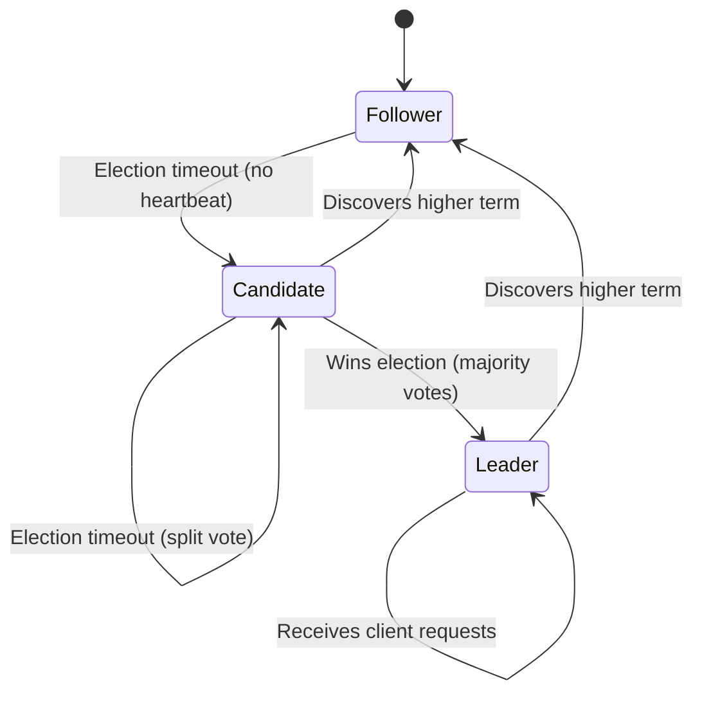
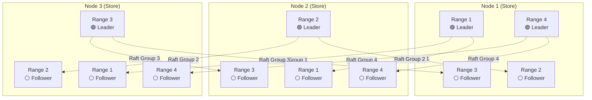
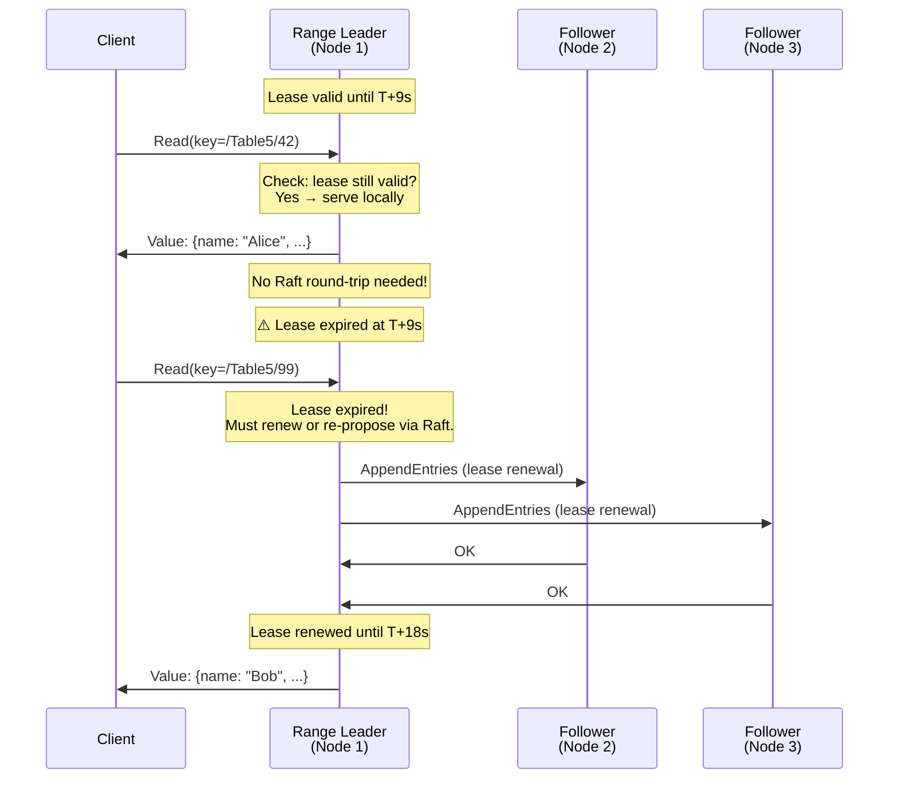
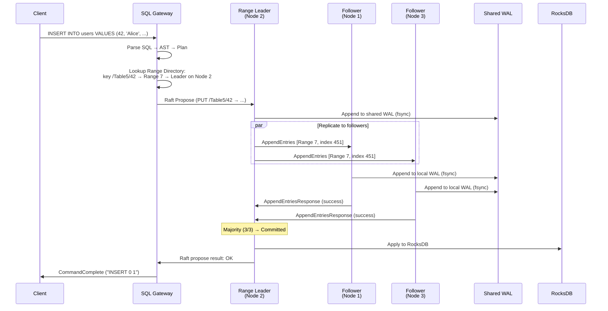

# 3. High Availability via Multi-Raft 🔴

> **The Problem:** Your database has split its keyspace into thousands of Ranges, each ~64 MB. A single server failure must not lose data or cause downtime for *any* query. You need every Range to be independently replicated across multiple servers using a consensus algorithm—but you can't afford the overhead of thousands of completely independent Raft clusters. You need *Multi-Raft*: a system where a single server participates in 10,000+ Raft groups simultaneously, sharing network connections, disk I/O, and heartbeats without collapsing under the weight.

---

## Why Raft? The Consensus Landscape

Distributed consensus solves a deceptively simple problem: how do N servers agree on a sequence of operations, even when some servers crash?

| Algorithm | Understandability | Leader-Based | Production Systems | Key Trade-off |
|---|---|---|---|---|
| **Paxos** | Notoriously difficult | Optional (Multi-Paxos) | Google Spanner, Chubby | Correct but hard to implement right |
| **Raft** | Designed for clarity | Yes (strong leader) | CockroachDB, etcd, TiKV | Slightly less flexible, much easier to reason about |
| **EPaxos** | Very complex | No (leaderless) | Research systems | Lower latency for non-conflicting ops, complex conflict resolution |
| **Viewstamped Replication** | Moderate | Yes | Academic, some KV stores | Similar to Raft, less ecosystem support |

Raft won the NewSQL world because it is **understandable**. When your system has 50,000 Raft groups running simultaneously, you need operators to be able to debug why Range #37,421 is stuck. Raft's state machine—with explicit terms, a single leader, and append-only logs—makes that possible.

---

## Raft in 5 Minutes

A Raft group consists of an **odd number** of replicas (typically 3 or 5). At any moment, each replica is in one of three states:



### The Raft Log

Every mutation is an entry in an ordered log. The leader appends entries and replicates them to followers. An entry is **committed** once a majority of replicas have persisted it.

```
Leader Log:     [1:SET a=1] [2:SET b=2] [3:SET a=3] [4:DEL b]   ← committed (3/3)
Follower-A Log: [1:SET a=1] [2:SET b=2] [3:SET a=3]             ← committed (3/3 for entries 1-3)
Follower-B Log: [1:SET a=1] [2:SET b=2]                         ← catching up
```

**Committed** means a majority have the entry. Even if the leader crashes, at least one surviving replica has every committed entry. That's the fundamental safety guarantee.

### Election Protocol

1. A follower's **election timer** fires (randomized 150–300ms).
2. It increments its **term**, transitions to Candidate, and votes for itself.
3. It sends `RequestVote` RPCs to all peers.
4. If it receives votes from a **majority**, it becomes Leader for that term.
5. The leader immediately sends heartbeats (empty `AppendEntries`) to prevent new elections.

### Log Replication Protocol

1. Client sends a write to the leader.
2. Leader appends the entry to its local log.
3. Leader sends `AppendEntries` RPCs to all followers.
4. Each follower appends the entry and responds with success.
5. Once a **majority** respond, the leader marks the entry as committed.
6. Leader applies the entry to the state machine (RocksDB) and responds to the client.

```rust,ignore
/// Core Raft message types.
#[derive(Debug, Clone)]
enum RaftMessage {
    /// Leader → Follower: Replicate log entries + heartbeat.
    AppendEntries {
        term: u64,
        leader_id: NodeId,
        prev_log_index: u64,
        prev_log_term: u64,
        entries: Vec<LogEntry>,
        leader_commit: u64,
    },
    /// Response to AppendEntries.
    AppendEntriesResponse {
        term: u64,
        success: bool,
        match_index: u64,
    },
    /// Candidate → All: Request a vote.
    RequestVote {
        term: u64,
        candidate_id: NodeId,
        last_log_index: u64,
        last_log_term: u64,
    },
    /// Response to RequestVote.
    RequestVoteResponse {
        term: u64,
        vote_granted: bool,
    },
}

#[derive(Debug, Clone)]
struct LogEntry {
    term: u64,
    index: u64,
    command: Command,
}

#[derive(Debug, Clone)]
enum Command {
    Put { key: Vec<u8>, value: Vec<u8> },
    Delete { key: Vec<u8> },
    /// No-op entry appended by new leader to commit
    /// pending entries from previous terms.
    Noop,
}
```

---

## The Multi-Raft Architecture

### The Problem with Single-Raft

If you ran one giant Raft group for the entire database, you'd have:
- **One leader** that must process every single write → bottleneck.
- **Full data replication** to every server → storage scales poorly.
- **No independent failure isolation** → a slow follower slows everything.

### The Insight: One Raft Group per Range

Each Range (the ~64 MB chunk from Chapter 2) is an independent Raft group:



**Key properties:**
- **Leadership is distributed.** Node 1 leads Ranges 1 and 4; Node 2 leads Range 2; Node 3 leads Range 3. Writes spread across all nodes.
- **Failure is isolated.** If Node 3 crashes, Ranges 1, 2, and 4 are unaffected. Range 3 elects a new leader from Node 1 or Node 2.
- **Scaling is transparent.** Add a 4th node → the system rebalances some Range replicas to it, and leadership naturally redistributes.

---

## The N-to-N Multiplexing Problem

A 100-node cluster with 100,000 Ranges (3 replicas each = 300,000 Raft group members) cannot open a separate TCP connection per Raft group pair. That would be millions of connections.

### Solution: Multiplexed Transport

All Raft messages between any two nodes share a **single gRPC stream** (or a small connection pool). Each message carries a `range_id` header, and the receiving node routes it to the correct Raft state machine.

```rust,ignore
/// A Raft message envelope that multiplexes many Raft groups
/// over a single transport connection between two nodes.
#[derive(Debug, Clone)]
struct RaftMessageBatch {
    /// All messages from this node to a specific peer node.
    messages: Vec<RangeRaftMessage>,
}

#[derive(Debug, Clone)]
struct RangeRaftMessage {
    range_id: u64,
    from_replica: ReplicaId,
    to_replica: ReplicaId,
    message: RaftMessage,
}

/// The transport layer: one connection per peer, batched sends.
struct RaftTransport {
    /// node_id → sender channel for outbound messages.
    peers: HashMap<NodeId, mpsc::Sender<RaftMessageBatch>>,
}

impl RaftTransport {
    /// Send a batch of Raft messages to a peer node.
    /// Messages for different Ranges are batched together.
    async fn send_batch(&self, to_node: NodeId, batch: RaftMessageBatch) -> Result<()> {
        if let Some(sender) = self.peers.get(&to_node) {
            sender.send(batch).await.map_err(|_| Error::PeerDisconnected)
        } else {
            Err(Error::UnknownPeer(to_node))
        }
    }
}
```

### Heartbeat Coalescing

In standard Raft, every leader sends heartbeats to every follower every ~100ms. If Node 1 leads 10,000 Ranges and Node 2 has followers for all of them, that's **10,000 heartbeat messages per tick** between just two nodes.

**Solution:** Coalesce heartbeats. Instead of per-Range heartbeats, send a **single coalesced heartbeat** per tick that says: "I'm still leader for Ranges {1, 4, 17, 42, ...}."

```rust,ignore
/// Coalesced heartbeat: a single message for all Ranges
/// where this node is a leader and the peer has a follower.
#[derive(Debug, Clone)]
struct CoalescedHeartbeat {
    from_node: NodeId,
    /// (range_id, current_term, leader_commit_index)
    ranges: Vec<(u64, u64, u64)>,
}

impl RaftNode {
    /// Called every tick (~100ms). Collects all Ranges where we are
    /// leader and the target node has a follower, then sends one message.
    fn send_coalesced_heartbeats(&self, peer: NodeId) {
        let mut ranges = Vec::new();
        for (range_id, raft_group) in &self.raft_groups {
            if raft_group.is_leader() && raft_group.has_follower(peer) {
                ranges.push((*range_id, raft_group.term(), raft_group.commit_index()));
            }
        }
        if !ranges.is_empty() {
            self.transport.send_coalesced(peer, CoalescedHeartbeat {
                from_node: self.node_id,
                ranges,
            });
        }
    }
}
```

**Impact:** 10,000 per-Range heartbeats become **one** coalesced message. Network overhead drops by orders of magnitude.

---

## Raft Log Storage: Shared WAL Architecture

Each Raft group maintains its own logical log, but writing to 10,000 separate files would destroy disk throughput.

### One WAL per Store

All Raft groups on a node share a **single Write-Ahead Log** (WAL). Entries are tagged with their Range ID and interleaved in write order:

```
WAL Offset 0:   [Range 42, Term 5, Index 101, PUT key=... val=...]
WAL Offset 128: [Range 7,  Term 3, Index 450, DEL key=...]
WAL Offset 256: [Range 42, Term 5, Index 102, PUT key=... val=...]
WAL Offset 384: [Range 99, Term 8, Index 12,  PUT key=... val=...]
```

This converts thousands of random writes into a **single sequential write stream**—the storage pattern that both SSDs and HDDs handle best.

```rust,ignore
/// A WAL entry that combines Raft metadata with the KV operation.
#[derive(Debug)]
struct WalEntry {
    range_id: u64,
    term: u64,
    index: u64,
    command: Command,
}

/// Shared WAL for all Raft groups on this store.
struct SharedWal {
    file: File,
    /// Buffer for batching writes before fsync.
    write_buffer: Vec<WalEntry>,
}

impl SharedWal {
    /// Append entries from potentially many Raft groups,
    /// then fsync once for all of them.
    fn write_batch(&mut self, entries: &[WalEntry]) -> io::Result<()> {
        for entry in entries {
            // Serialize: [range_id(8)][term(8)][index(8)][cmd_len(4)][cmd_bytes...]
            self.file.write_all(&entry.range_id.to_le_bytes())?;
            self.file.write_all(&entry.term.to_le_bytes())?;
            self.file.write_all(&entry.index.to_le_bytes())?;
            let cmd_bytes = entry.command.serialize();
            self.file.write_all(&(cmd_bytes.len() as u32).to_le_bytes())?;
            self.file.write_all(&cmd_bytes)?;
        }
        // Single fsync for potentially hundreds of Raft groups.
        self.file.sync_data()?;
        Ok(())
    }
}
```

### State Machine Application

Once a Raft entry is committed, it is applied to the **RocksDB state machine**. All Ranges on a node share a single RocksDB instance (from Chapter 2). The applied data uses the Range-prefixed key encoding, so each Range occupies a contiguous key slice.

```
Raft Log (consensus layer)       State Machine (storage layer)
┌────────────────────────┐       ┌─────────────────────────┐
│ Range 42: [101, 102]   │──────▶│ RocksDB: /Table5/42 →.. │
│ Range 7:  [450]        │──────▶│ RocksDB: /Table3/7  →.. │
│ Range 99: [12]         │──────▶│ RocksDB: /Index2/.. →.. │
└────────────────────────┘       └─────────────────────────┘
```

---

## Snapshots and Log Truncation

The Raft log grows without bound if not truncated. But you can only truncate entries that have been applied to the state machine.

### The Problem: Slow Followers

If a follower falls behind by more entries than the leader has in its log (because the leader truncated old entries), the follower can't catch up via normal `AppendEntries`. The leader must send a **snapshot**.

### RocksDB Checkpoints as Snapshots

RocksDB supports **zero-copy checkpoints**: creating a point-in-time snapshot by hard-linking SST files. This is nearly instantaneous regardless of data size.

```rust,ignore
/// Create a Raft snapshot for a specific Range using RocksDB checkpoint.
fn create_range_snapshot(
    db: &rocksdb::DB,
    range_id: u64,
    range_start: &[u8],
    range_end: &[u8],
    applied_index: u64,
    applied_term: u64,
) -> Result<RangeSnapshot> {
    // RocksDB checkpoint: O(1) hard-link of SST files.
    let checkpoint = rocksdb::checkpoint::Checkpoint::new(db)?;
    let snap_path = format!("/tmp/snapshots/range-{}-{}", range_id, applied_index);
    checkpoint.create_checkpoint(&snap_path)?;

    Ok(RangeSnapshot {
        range_id,
        range_start: range_start.to_vec(),
        range_end: range_end.to_vec(),
        applied_index,
        applied_term,
        data_path: snap_path,
    })
}

#[derive(Debug)]
struct RangeSnapshot {
    range_id: u64,
    range_start: Vec<u8>,
    range_end: Vec<u8>,
    applied_index: u64,
    applied_term: u64,
    data_path: String,
}
```

The snapshot is streamed to the slow follower via chunked gRPC, and the follower replaces its local Range data with the received snapshot.

---

## Lease-Based Reads: Avoiding Consensus on Reads

Raft guarantees linearizable writes, but what about reads? A naive approach sends every read through Raft (propose a read entry, wait for commit). This is **correct** but doubles read latency.

### Range Leases

The leader holds a **time-bound lease** (e.g., 9 seconds). As long as the lease is valid, the leader knows it's still the leader and can serve reads **locally** without any Raft round-trip.



```rust,ignore
/// Range lease for local read serving.
#[derive(Debug)]
struct RangeLease {
    range_id: u64,
    holder: NodeId,
    /// Expiration based on the hybrid-logical clock (Chapter 5).
    expiration: HlcTimestamp,
    /// The epoch, incremented on each lease transfer.
    epoch: u64,
}

impl RangeLease {
    fn is_valid(&self, now: HlcTimestamp) -> bool {
        now < self.expiration
    }
}

impl RaftGroup {
    /// Serve a read request—fast path if lease is valid.
    fn read(&self, key: &[u8], now: HlcTimestamp) -> Result<Option<Vec<u8>>> {
        if self.lease.is_valid(now) {
            // Fast path: read directly from RocksDB.
            self.state_machine.get(key)
        } else {
            // Slow path: renew lease through Raft.
            self.propose_lease_renewal()?;
            self.state_machine.get(key)
        }
    }
}
```

**Trade-off:** Lease-based reads depend on **clock synchronization**. If clocks drift by more than the lease duration, a stale leader could serve stale reads. This ties directly into Chapter 5's discussion of hybrid-logical clocks.

---

## Leader Balancing and Rebalancing

### The Problem: Hot Nodes

If leadership election is purely random, one node might end up leading 60% of all Ranges while another leads 5%. This creates hotspots.

### Lease Transfer

The system periodically evaluates leader distribution and **transfers leadership** from overloaded nodes to underloaded ones:

```rust,ignore
/// Lease transfer: the current leader voluntarily steps down
/// and helps a specific follower become the new leader.
impl RaftGroup {
    fn transfer_leadership(&mut self, target: ReplicaId) -> Result<()> {
        // 1. Stop accepting new proposals.
        self.accepting_proposals = false;

        // 2. Ensure the target follower is caught up.
        self.send_append_entries(target)?;

        // 3. Send a TimeoutNow message: tells the target
        //    to immediately start an election.
        self.transport.send(target, RaftMessage::TimeoutNow {
            term: self.term,
        });

        Ok(())
    }
}
```

### Replica Rebalancing

When a new node joins (or a node fails permanently), the system must **move replicas** to maintain the replication factor and balance load:

| Event | Action |
|---|---|
| Node added | Move some Range replicas to the new node |
| Node removed (permanent) | Create new replicas on surviving nodes to restore RF |
| Node temporarily down | Wait for it to come back (don't rebalance immediately) |
| Range split | Each new Range inherits the replica placement, may rebalance later |
| Hot Range detected | Add a learner replica near the hotspot, transfer leadership |

The rebalancer runs as a background process on a designated **meta node** (or as a Raft-replicated job itself):

```rust,ignore
struct Rebalancer {
    cluster_state: Arc<ClusterState>,
    target_replication_factor: usize,
}

impl Rebalancer {
    /// Evaluate and generate rebalancing actions.
    fn plan(&self) -> Vec<RebalanceAction> {
        let mut actions = Vec::new();
        for range in self.cluster_state.all_ranges() {
            let replicas = range.replica_nodes();

            // Under-replicated: add a replica.
            if replicas.len() < self.target_replication_factor {
                if let Some(target) = self.least_loaded_node_not_in(&replicas) {
                    actions.push(RebalanceAction::AddReplica {
                        range_id: range.id,
                        target_node: target,
                    });
                }
            }

            // Over-replicated: remove excess replica.
            if replicas.len() > self.target_replication_factor {
                if let Some(victim) = self.most_loaded_node_in(&replicas) {
                    actions.push(RebalanceAction::RemoveReplica {
                        range_id: range.id,
                        from_node: victim,
                    });
                }
            }
        }

        // Leadership balancing: transfer leadership from overloaded nodes.
        self.plan_leadership_transfers(&mut actions);
        actions
    }
}

enum RebalanceAction {
    AddReplica { range_id: u64, target_node: NodeId },
    RemoveReplica { range_id: u64, from_node: NodeId },
    TransferLeadership { range_id: u64, from: NodeId, to: NodeId },
}
```

---

## Locality and Zone-Aware Replication

In a geo-distributed deployment, you don't want all 3 replicas in the same datacenter—a datacenter fire would lose the Range.

### Zone Configuration

Operators define **zones** (datacenter, rack, availability zone) and the system ensures replicas are spread across them:

```rust,ignore
/// Locality descriptor for a node.
#[derive(Debug, Clone)]
struct Locality {
    region: String,      // e.g., "us-east-1"
    zone: String,        // e.g., "us-east-1a"
    rack: Option<String>,
}

/// Zone configuration for a Range.
#[derive(Debug, Clone)]
struct ZoneConfig {
    /// Minimum number of replicas.
    num_replicas: usize,
    /// Constraints: e.g., "at least one replica in us-east, one in us-west."
    constraints: Vec<ReplicaConstraint>,
    /// Lease preference: prefer leadership in a specific zone
    /// (to minimize read latency for the primary region).
    lease_preferences: Vec<LeasePreference>,
}

#[derive(Debug, Clone)]
enum ReplicaConstraint {
    /// At least N replicas must be in this zone.
    Required { zone: String, min_count: usize },
    /// Prefer replicas in this zone but don't require it.
    Preferred { zone: String },
    /// Never place replicas in this zone.
    Prohibited { zone: String },
}
```

This allows table-level or even row-level control over data placement. For example: "European user data must have all replicas in EU datacenters" (GDPR compliance).

---

## Failure Scenarios and Recovery

### Scenario 1: Single Node Failure

```
Before:  Range 1: [Node1=Leader, Node2=Follower, Node3=Follower]
Event:   Node1 crashes.
Step 1:  Node2 and Node3 stop receiving heartbeats.
Step 2:  One of them (say Node2) times out first, starts election.
Step 3:  Node2 sends RequestVote to Node3.
Step 4:  Node3 votes for Node2 (Node2 has all committed entries).
Step 5:  Node2 becomes Leader. Committed entries preserved.
After:   Range 1: [Node2=Leader, Node3=Follower] (RF=2, degraded)
```

The system immediately begins adding a new replica on another node to restore RF=3.

### Scenario 2: Network Partition

```
Before:    [Node1=Leader] ←→ [Node2=Follower] ←→ [Node3=Follower]
Partition: Node1 isolated from Node2 and Node3.

Minority side (Node1):
  - Node1 is still leader but can't reach majority.
  - All writes to Node1 will timeout (can't commit).
  - Lease expires → Node1 stops serving reads.

Majority side (Node2, Node3):
  - Node2 or Node3 wins election (they form a majority).
  - New leader serves reads and writes normally.

Partition heals:
  - Node1 discovers higher term from Node2/Node3.
  - Node1 steps down to Follower.
  - Node1's log is truncated to match the new leader's log.
  - Normal operation resumes.
```

### Scenario 3: Datacenter Fire

```
Setup: 5 replicas across 3 DCs: DC-A(2), DC-B(2), DC-C(1)
Event: DC-A destroyed (both replicas lost).

Surviving: DC-B(2) + DC-C(1) = 3 replicas = majority of 5. ✅
Action:    New leaders elected from surviving replicas.
           Rebalancer creates 2 new replicas in DC-B and DC-C.
Result:    Zero data loss, brief (seconds) unavailability during election.
```

---

## Performance: Multi-Raft at Scale

| Metric | Single-Raft | Multi-Raft (10K groups) |
|---|---|---|
| Write throughput | Limited by single leader | Distributed across all nodes |
| Read throughput | All reads go to one leader | Reads distributed via per-Range leases |
| Failure blast radius | Entire database | Only Ranges on failed node |
| Rebalancing granularity | All-or-nothing | Per-Range, incremental |
| Heartbeat overhead (naive) | 1 per pair per tick | 10,000 per pair per tick |
| Heartbeat overhead (coalesced) | 1 per pair per tick | **1 per pair per tick** ✅ |
| WAL writes | 1 sequential stream | **1 sequential stream** (shared WAL) ✅ |

---

## Putting It All Together: Life of a Write



**Latency breakdown (same-datacenter):**
| Phase | Typical Latency |
|---|---|
| SQL parse + plan | ~0.1ms |
| Range Directory lookup (cached) | ~0.01ms |
| Leader WAL write + fsync | ~0.1ms |
| Replicate to followers (parallel) | ~0.2ms (network RTT) |
| Follower WAL write + fsync | ~0.1ms (in parallel with other follower) |
| Apply to RocksDB | ~0.05ms |
| **Total** | **~0.5–1ms** |

---

> **Key Takeaways**
>
> - Each Range is an **independent Raft consensus group**. A 100,000-Range cluster has 100,000 Raft groups, with leadership distributed across all nodes.
> - **Multi-Raft** makes this feasible through three key optimizations: multiplexed transport (one connection per node pair), coalesced heartbeats (one message per tick per pair), and a shared WAL (one sequential write stream per node).
> - **Lease-based reads** allow leaders to serve reads locally without Raft round-trips, reducing read latency to a single RocksDB lookup.
> - **Snapshots** use RocksDB's zero-copy checkpoint feature, enabling O(1) snapshot creation for sending to slow or new followers.
> - **Zone-aware replication** ensures replicas are spread across failure domains (racks, availability zones, regions), surviving datacenter-level failures.
> - The **rebalancer** continuously monitors replica distribution and leadership, moving replicas and transferring leadership to maintain even load.
> - A single-node failure causes only **seconds** of unavailability for affected Ranges. The majority of the database continues serving reads and writes uninterrupted.
