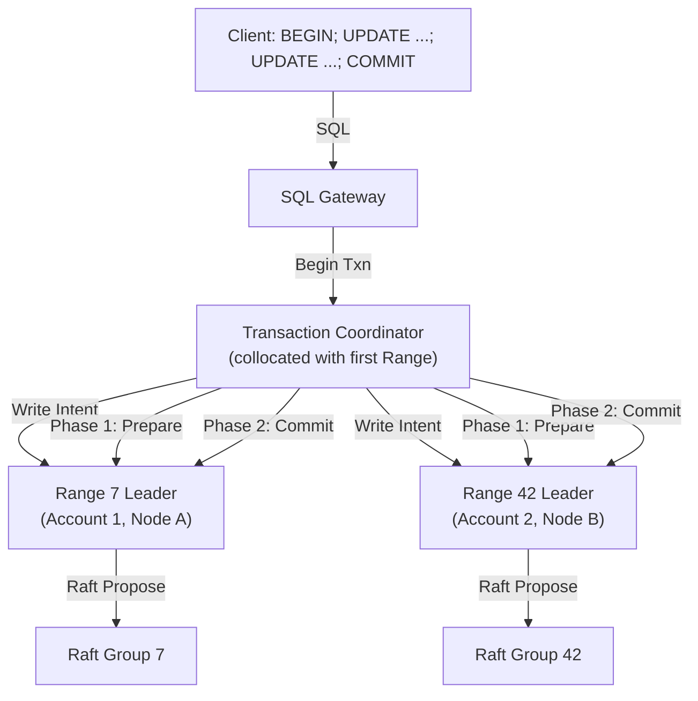
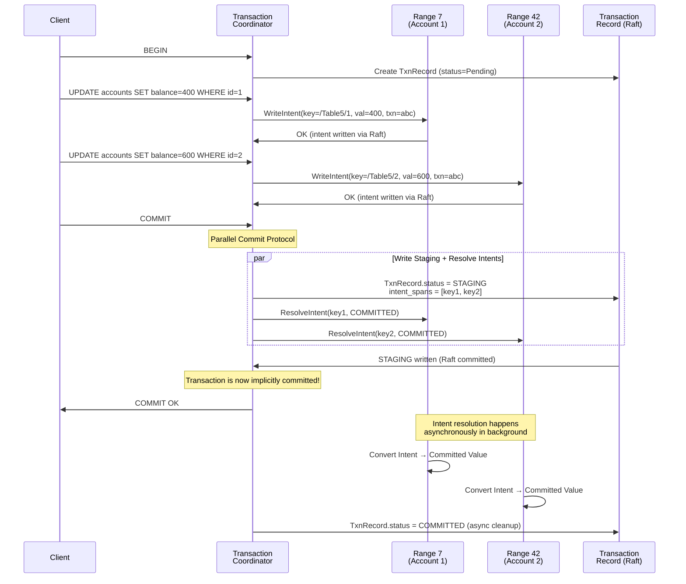
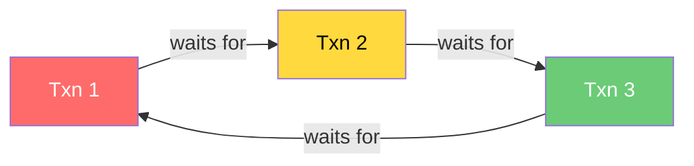

# 4. Distributed Transactions (2PC) 🔴

> **The Problem:** A client runs `UPDATE accounts SET balance = balance - 100 WHERE id = 1; UPDATE accounts SET balance = balance + 100 WHERE id = 2;` inside a single transaction. Account 1 lives in Range 7 on Node A. Account 2 lives in Range 42 on Node B. The transfer must be **atomic**: either both updates are visible, or neither is. A crash between the two updates must not leave money created or destroyed. You need a Distributed Two-Phase Commit protocol that coordinates across independent Raft groups, handles coordinator failures, and prevents deadlocks—all while maintaining single-digit millisecond latency for the common case.

---

## Why Distributed Transactions Are Hard

Single-node transactions are (relatively) straightforward: the database uses a local lock manager and a local WAL. If it crashes mid-transaction, it replays the WAL on recovery—committed transactions are replayed, uncommitted ones are rolled back.

Distributed transactions break this model:

| Property | Single-Node | Distributed |
|---|---|---|
| **Atomicity** | Local WAL guarantees all-or-nothing | Must coordinate across N nodes—any of which can crash independently |
| **Isolation** | Local lock manager | Locks span multiple nodes; deadlocks are now *distributed* deadlocks |
| **Durability** | One fsync to one WAL | Must fsync on *all* participants before acknowledging commit |
| **Failure modes** | One machine crashes | Coordinator crashes, participant crashes, network partitions—*independently* |

The classic solution is **Two-Phase Commit (2PC)**, invented by Jim Gray in 1978. But naive 2PC has a fatal flaw: if the coordinator crashes after sending "prepare" but before sending "commit", participants are **stuck**—they can't commit (they don't know the coordinator's decision) and they can't abort (another participant might have committed). This is the **blocking problem**.

NewSQL databases solve this by making the coordinator and participants **Raft-replicated**. The coordinator's decision is durably committed via Raft before any participant acts on it. A coordinator crash simply triggers a Raft leader election, and the new leader replays the commit/abort decision.

---

## Transaction Architecture Overview



### Transaction Record

Every transaction is represented by a **Transaction Record** stored in the KV layer itself. This record is the single source of truth for the transaction's status.

```rust,ignore
/// The durable transaction record, stored as a KV pair.
/// Key: /Transaction/{txn_id}
#[derive(Debug, Clone)]
struct TransactionRecord {
    /// Globally unique transaction ID.
    id: TxnId,
    /// Current status.
    status: TxnStatus,
    /// The timestamp at which this transaction reads and writes.
    /// Determined by the MVCC layer (Chapter 5).
    write_timestamp: HlcTimestamp,
    /// The read timestamp (may differ in read-refresh scenarios).
    read_timestamp: HlcTimestamp,
    /// Keys that have been written (intent keys).
    intent_spans: Vec<KeySpan>,
    /// The Range that "owns" the transaction record.
    /// This is the coordinator Range.
    coordinator_range: RangeId,
    /// Heartbeat timestamp—proves the coordinator is alive.
    last_heartbeat: HlcTimestamp,
}

#[derive(Debug, Clone, Copy, PartialEq)]
enum TxnStatus {
    /// Transaction is in progress. Intents are provisional.
    Pending,
    /// Transaction committed. Intents should be resolved to committed values.
    Committed,
    /// Transaction aborted. Intents should be cleaned up.
    Aborted,
    /// Staging: all writes are prepared, waiting for final commit decision.
    Staging,
}
```

The transaction record is stored in the **coordinator Range**—the Range that received the first write of the transaction. This means the coordinator is automatically Raft-replicated.

---

## Intent-Based Writes

### What Is an Intent?

When a transaction writes a key, it doesn't write the final value directly. Instead, it writes an **intent**: a provisional value plus a pointer back to the transaction record.

```
Regular KV entry:   Key: /Table5/42 → Value: {name: "Alice", balance: 500}
Intent KV entry:    Key: /Table5/42 → Intent{txn_id: "txn-abc", value: {name: "Alice", balance: 400}}
```

An intent is both:
1. A **lock** — it tells other transactions "this key is being modified by txn-abc."
2. A **provisional value** — it holds what the value *will become* if the transaction commits.

```rust,ignore
/// A KV value that may be a committed value or a transactional intent.
#[derive(Debug, Clone)]
enum MvccValue {
    /// A committed value at a specific MVCC timestamp.
    Value {
        timestamp: HlcTimestamp,
        data: Vec<u8>,
    },
    /// A transactional intent—provisional write not yet committed.
    Intent {
        txn_id: TxnId,
        txn_timestamp: HlcTimestamp,
        provisional_value: Vec<u8>,
    },
}
```

### Writing an Intent

```rust,ignore
impl RangeLeader {
    /// Write an intent for a transaction.
    fn write_intent(
        &self,
        key: &[u8],
        value: &[u8],
        txn: &TransactionRecord,
    ) -> Result<()> {
        // Check for conflicting intents from other transactions.
        if let Some(existing) = self.get_intent(key)? {
            if existing.txn_id != txn.id {
                // Another transaction has an intent on this key.
                // Must resolve the conflict (see "Intent Resolution" below).
                return self.resolve_intent_conflict(key, &existing, txn);
            }
        }

        // Write the intent: stored at a special "intent" keyspace
        // that sorts before all MVCC versions of the key.
        let intent = MvccValue::Intent {
            txn_id: txn.id,
            txn_timestamp: txn.write_timestamp,
            provisional_value: value.to_vec(),
        };

        // Propose through Raft for durability.
        self.raft_propose(Command::PutIntent {
            key: key.to_vec(),
            intent,
        })
    }
}
```

---

## The Two-Phase Commit Protocol

### Phase 1: Prepare (Staging)

When the client sends `COMMIT`, the coordinator begins the protocol:

1. Write all intents to their respective Ranges (already done during the transaction).
2. Transition the transaction record to `Staging` status.
3. **Implicitly prepared:** In CockroachDB's optimized 2PC, participants are considered "prepared" the moment they acknowledge the intent write. There is no explicit `PREPARE` message—the intent *is* the prepare.

```rust,ignore
impl TransactionCoordinator {
    /// Client sends COMMIT. Begin the parallel commit protocol.
    async fn commit(&mut self) -> Result<CommitResult> {
        // Verify all intent writes succeeded.
        // (They were written during the transaction's execution.)
        assert!(self.all_intents_written());

        // Transition to STAGING: this is the "prepare" phase.
        // Write the new status to the transaction record via Raft.
        self.txn_record.status = TxnStatus::Staging;
        self.txn_record.intent_spans = self.written_keys.clone();
        self.write_txn_record().await?;

        // The transaction is now in the "staging" state.
        // At this point, the commit is *implicitly* decided:
        // - If ALL intents are present → committed.
        // - If ANY intent is missing → aborted.
        //
        // We don't need to wait for an explicit Phase 2!

        Ok(CommitResult::Staged)
    }
}
```

### The Parallel Commit Optimization

The key insight from CockroachDB's **parallel commit** protocol: the commit decision doesn't require an explicit Phase 2 message. Instead:

1. **Staging** atomically records the list of all intent keys in the transaction record.
2. Any observer can determine the transaction's outcome by checking whether **all listed intents still exist**.
3. If all intents exist → the transaction is **implicitly committed**.
4. If any intent is missing → the transaction **must be aborted**.



**Why this is faster:** The client gets `COMMIT OK` as soon as the `STAGING` record is Raft-committed. Intent resolution (the traditional "Phase 2") happens **asynchronously**. This cuts transaction latency by one Raft round-trip.

---

## Intent Resolution

After a transaction commits (or aborts), its intents must be **resolved**:
- **Committed:** Convert the intent into a regular MVCC value at the commit timestamp.
- **Aborted:** Delete the intent entirely.

```rust,ignore
impl RangeLeader {
    /// Resolve an intent: convert to committed value or delete.
    fn resolve_intent(
        &self,
        key: &[u8],
        txn_id: TxnId,
        status: TxnStatus,
        commit_timestamp: HlcTimestamp,
    ) -> Result<()> {
        match status {
            TxnStatus::Committed => {
                // Read the intent's provisional value.
                let intent = self.get_intent(key)?
                    .ok_or(Error::IntentNotFound)?;

                // Write the committed value at the commit timestamp.
                self.raft_propose(Command::ResolveCommitted {
                    key: key.to_vec(),
                    timestamp: commit_timestamp,
                    value: intent.provisional_value,
                })
            }
            TxnStatus::Aborted => {
                // Simply delete the intent.
                self.raft_propose(Command::DeleteIntent {
                    key: key.to_vec(),
                    txn_id,
                })
            }
            _ => Err(Error::InvalidResolution),
        }
    }
}
```

Intent resolution is **idempotent**: resolving an already-resolved intent is a no-op. This is critical for correctness when retries happen after network failures.

---

## Conflict Resolution: What Happens When Transactions Collide

### Read-Write Conflicts

Transaction T2 tries to **read** a key that T1 has an intent on:

```
T1 (pending): Intent on /Table5/42 at timestamp 10
T2 (reading): SELECT * FROM users WHERE id = 42 at timestamp 15
```

T2 encounters T1's intent. T2 must determine T1's status:

1. **T1 is committed** → T2 reads T1's committed value.
2. **T1 is aborted** → T2 ignores T1's intent, reads the previous committed version.
3. **T1 is pending** → T2 must **wait** for T1 to complete, or **push** T1's timestamp.

```rust,ignore
impl RangeLeader {
    /// Handle a read encountering an intent from another transaction.
    fn handle_read_intent_conflict(
        &self,
        key: &[u8],
        reader_ts: HlcTimestamp,
        intent: &Intent,
    ) -> Result<ReadResult> {
        // Look up the transaction record for the intent's transaction.
        let txn_record = self.lookup_txn_record(intent.txn_id)?;

        match txn_record.status {
            TxnStatus::Committed => {
                // Intent is committed—read the committed value.
                Ok(ReadResult::Value(intent.provisional_value.clone()))
            }
            TxnStatus::Aborted => {
                // Intent is garbage—clean it up and read previous version.
                self.resolve_intent(key, intent.txn_id, TxnStatus::Aborted, HlcTimestamp::ZERO)?;
                self.read_committed_version(key, reader_ts)
            }
            TxnStatus::Pending | TxnStatus::Staging => {
                // Transaction still in progress.
                if intent.txn_timestamp > reader_ts {
                    // Intent is at a *higher* timestamp than our read.
                    // We can safely read the previous committed version.
                    self.read_committed_version(key, reader_ts)
                } else {
                    // Intent is at a *lower* timestamp than our read.
                    // We must wait or push. Enter the wait queue.
                    Err(Error::WriteIntentError {
                        key: key.to_vec(),
                        txn_id: intent.txn_id,
                    })
                }
            }
        }
    }
}
```

### Write-Write Conflicts

Transaction T2 tries to **write** a key that T1 already has an intent on. Only one transaction can win:

| Scenario | Resolution |
|---|---|
| T1 has a higher priority (lower timestamp) | T2 waits or is pushed to a higher timestamp |
| T2 has a higher priority (lower timestamp) | T1 is aborted (T2 "pushes" T1 out) |
| T1's coordinator is dead (heartbeat expired) | T1 is aborted, T2 proceeds |

```rust,ignore
/// Determine whether to wait or push when encountering a conflicting intent.
fn resolve_write_conflict(
    pusher: &TransactionRecord,
    pushee: &TransactionRecord,
) -> ConflictResolution {
    // If the pushee's heartbeat has expired, it's likely abandoned.
    if pushee.last_heartbeat.elapsed() > TXN_HEARTBEAT_TIMEOUT {
        return ConflictResolution::AbortPushee;
    }

    // Lower timestamp = higher priority (arrived first).
    if pusher.write_timestamp < pushee.write_timestamp {
        // Pusher has higher priority → abort the pushee.
        ConflictResolution::AbortPushee
    } else {
        // Pushee has higher priority → pusher must wait.
        ConflictResolution::WaitForPushee
    }
}

enum ConflictResolution {
    AbortPushee,
    WaitForPushee,
}
```

---

## Deadlock Detection

Distributed deadlocks occur when transactions form a wait cycle:

```
T1 holds lock on Key-A, waits for Key-B (held by T2)
T2 holds lock on Key-B, waits for Key-A (held by T1)
```

### Wait-For Graph

The system maintains a **distributed wait-for graph**. Each node tracks local wait-for edges (which transaction is waiting for which). A background process aggregates these into a global graph and detects cycles.



When a cycle is detected, the transaction with the **youngest timestamp** (lowest priority) is aborted to break the cycle:

```rust,ignore
/// Distributed deadlock detector.
struct DeadlockDetector {
    /// Local wait-for edges: (waiter_txn_id → blocking_txn_id).
    local_edges: HashMap<TxnId, HashSet<TxnId>>,
}

impl DeadlockDetector {
    /// Add a wait-for edge when a transaction starts waiting.
    fn add_edge(&mut self, waiter: TxnId, blocker: TxnId) {
        self.local_edges.entry(waiter).or_default().insert(blocker);
    }

    /// Remove edges when a transaction completes or stops waiting.
    fn remove_edges(&mut self, txn_id: TxnId) {
        self.local_edges.remove(&txn_id);
        for blockers in self.local_edges.values_mut() {
            blockers.remove(&txn_id);
        }
    }

    /// Detect cycles using DFS.
    fn detect_cycles(&self) -> Vec<Vec<TxnId>> {
        let mut cycles = Vec::new();
        let mut visited = HashSet::new();
        let mut path = Vec::new();
        let mut on_stack = HashSet::new();

        for &start in self.local_edges.keys() {
            if !visited.contains(&start) {
                self.dfs(start, &mut visited, &mut path, &mut on_stack, &mut cycles);
            }
        }
        cycles
    }

    fn dfs(
        &self,
        node: TxnId,
        visited: &mut HashSet<TxnId>,
        path: &mut Vec<TxnId>,
        on_stack: &mut HashSet<TxnId>,
        cycles: &mut Vec<Vec<TxnId>>,
    ) {
        visited.insert(node);
        on_stack.insert(node);
        path.push(node);

        if let Some(neighbors) = self.local_edges.get(&node) {
            for &neighbor in neighbors {
                if !visited.contains(&neighbor) {
                    self.dfs(neighbor, visited, path, on_stack, cycles);
                } else if on_stack.contains(&neighbor) {
                    // Cycle detected: extract it.
                    let cycle_start = path.iter().position(|&n| n == neighbor).unwrap();
                    cycles.push(path[cycle_start..].to_vec());
                }
            }
        }

        path.pop();
        on_stack.remove(&node);
    }
}
```

---

## Transaction Heartbeats and Abandoned Transaction Cleanup

### The Problem: Ghost Intents

If a client crashes mid-transaction, its intents remain in the KV layer like ghosts—blocking other transactions indefinitely.

### Heartbeat Protocol

The transaction coordinator sends periodic **heartbeats** (every 5 seconds) to the transaction record, proving the transaction is still alive:

```rust,ignore
impl TransactionCoordinator {
    /// Background heartbeat loop: keeps the transaction record alive.
    async fn heartbeat_loop(&self) {
        let mut interval = tokio::time::interval(Duration::from_secs(5));
        loop {
            interval.tick().await;
            if self.txn_record.status != TxnStatus::Pending {
                break; // Transaction completed.
            }
            // Update the heartbeat timestamp in the transaction record.
            self.txn_record.last_heartbeat = HlcTimestamp::now();
            if self.write_txn_record().await.is_err() {
                break; // Lost contact with the coordinator Range.
            }
        }
    }
}
```

### Abandoned Transaction Detection

When a transaction encounters an intent from another transaction, it checks the heartbeat:

```rust,ignore
/// Check if a transaction is abandoned (no heartbeat for too long).
fn is_abandoned(txn_record: &TransactionRecord, now: HlcTimestamp) -> bool {
    let elapsed = now.wall_time_since(txn_record.last_heartbeat);
    elapsed > Duration::from_secs(30) // 6 missed heartbeats
}
```

An abandoned transaction is **aborted by any observer** that discovers it. This is safe because:
1. If the coordinator is truly dead, no one will commit the transaction.
2. If the coordinator is alive but partitioned, it will discover the abort when the partition heals and will not try to commit.

---

## Read Refreshes and Timestamp Pushing

### The Problem: Serialization Anomalies

Transaction T1 reads Key-A at timestamp 10, then later tries to commit at timestamp 10. But between T1's read and commit, Transaction T2 wrote Key-A at timestamp 8 and committed. T1's read is now **stale**—it didn't see T2's write, violating serializability.

### Read Refresh

Instead of aborting T1, the system **refreshes** T1's read: it re-reads Key-A at the new commit timestamp to check if the value changed.

```rust,ignore
impl TransactionCoordinator {
    /// Attempt to refresh all reads at a new (higher) timestamp.
    fn refresh_reads(&mut self, new_timestamp: HlcTimestamp) -> Result<()> {
        for read_span in &self.read_spans {
            // Re-scan the key range: has anything been written
            // between our original read timestamp and the new timestamp?
            let changed = self.check_for_writes_between(
                &read_span.start_key,
                &read_span.end_key,
                self.txn_record.read_timestamp,
                new_timestamp,
            )?;

            if changed {
                // A conflicting write exists. Cannot refresh.
                // Must abort and retry the entire transaction.
                return Err(Error::ReadRefreshFailed);
            }
        }

        // No conflicts found. Bump the read timestamp.
        self.txn_record.read_timestamp = new_timestamp;
        self.txn_record.write_timestamp = new_timestamp;
        Ok(())
    }
}
```

If the refresh succeeds (no conflicting writes), the transaction continues without restarting. This dramatically reduces the abort rate for long-running transactions.

---

## Optimizations for Common Cases

### 1PC: Single-Range Transactions

If all writes in a transaction touch keys in a **single Range**, no distributed coordination is needed. The transaction commits as a single Raft proposal—no 2PC, no staging.

```rust,ignore
impl TransactionCoordinator {
    fn commit_fast_path(&mut self) -> Result<CommitResult> {
        if self.touched_ranges().len() == 1 {
            // All writes in one Range: skip 2PC entirely.
            // Convert all intents to committed values in a single Raft batch.
            let range = self.touched_ranges()[0];
            range.commit_single_range_txn(&self.txn_record)?;
            return Ok(CommitResult::Committed1PC);
        }
        // Multi-range: use full parallel commit.
        self.commit().await
    }
}
```

This optimization is **critical** because the vast majority of transactions (80–90% in typical workloads) touch only one or two Ranges.

### Pipelining

Writes don't need to wait for Raft consensus before the next write begins. The coordinator **pipelines** writes: it sends the next intent write as soon as the previous one is dispatched (not committed).

```
Without pipelining:
  Write Key-A → wait for Raft commit → Write Key-B → wait for Raft commit → COMMIT
  Total: 3 Raft round-trips sequential

With pipelining:
  Write Key-A (dispatched) → Write Key-B (dispatched) → COMMIT (all in parallel)
  Total: 1 Raft round-trip (they overlap)
```

### Txn ID–Keyed Locks vs. Key-Keyed Locks

Intents serve as **key-keyed locks**: the lock is stored at the key itself in the KV layer. This has a crucial advantage over a separate lock table: lock state is **co-located with the data** and automatically replicated via Raft. No separate lock manager service is needed.

---

## End-to-End Example: A Money Transfer

Let's trace a complete distributed transaction:

```sql
BEGIN;
UPDATE accounts SET balance = balance - 100 WHERE id = 1;  -- Range 7, Node A
UPDATE accounts SET balance = balance + 100 WHERE id = 2;  -- Range 42, Node B
COMMIT;
```

**Step-by-step:**

| Step | Actor | Action |
|---|---|---|
| 1 | Client | Sends `BEGIN` to SQL Gateway |
| 2 | Gateway | Assigns `txn_id = "txn-abc"`, creates TxnRecord in Range 7 (first write's Range) |
| 3 | Client | Sends `UPDATE ... WHERE id = 1` |
| 4 | Coordinator | Reads current balance for id=1 from Range 7: balance=500 |
| 5 | Coordinator | Writes intent: `/Table/accounts/1` → `Intent{txn: abc, balance: 400}` via Raft to Range 7 |
| 6 | Client | Sends `UPDATE ... WHERE id = 2` |
| 7 | Coordinator | Reads current balance for id=2 from Range 42: balance=300 |
| 8 | Coordinator | Writes intent: `/Table/accounts/2` → `Intent{txn: abc, balance: 400}` via Raft to Range 42 |
| 9 | Client | Sends `COMMIT` |
| 10 | Coordinator | Parallel commit: write TxnRecord `status=STAGING, intents=[key1, key2]` via Raft |
| 11 | Coordinator | STAGING committed → responds `COMMIT OK` to client |
| 12 | Background | Resolve intent on key1: convert to `MVCC value @ commit_ts` |
| 13 | Background | Resolve intent on key2: convert to `MVCC value @ commit_ts` |
| 14 | Background | Update TxnRecord `status=COMMITTED` (final cleanup) |

**Total latency (same datacenter):**
| Phase | Latency |
|---|---|
| Read balance for id=1 (lease-based, local) | ~0.1ms |
| Write intent to Range 7 (Raft) | ~0.5ms |
| Read balance for id=2 (cross-node) | ~0.3ms |
| Write intent to Range 42 (Raft) | ~0.5ms |
| Write STAGING record (Raft) | ~0.5ms |
| **Total client-visible latency** | **~2ms** |

Intent resolution adds another ~1ms but happens **after** the client gets `COMMIT OK`.

---

> **Key Takeaways**
>
> - Distributed transactions use **intent-based writes**: each write creates a provisional value (intent) that doubles as a lock. No separate lock manager is needed—intents are co-located with data and Raft-replicated.
> - The **Transaction Record** is the single source of truth for a transaction's status. It lives in the KV layer (Raft-replicated), so coordinator crashes don't lose the commit decision.
> - **Parallel Commit** eliminates the explicit Phase 2. The commit is decided the moment the STAGING record is Raft-committed. Intent resolution happens asynchronously, cutting one Raft round-trip from commit latency.
> - **Single-Range transactions** (the common case) skip 2PC entirely and commit in a single Raft proposal.
> - **Deadlock detection** uses a distributed wait-for graph with DFS cycle detection. The youngest transaction in a cycle is aborted.
> - **Transaction heartbeats** prevent ghost intents from abandoned transactions. Any observer can abort a transaction whose heartbeat has expired.
> - **Read refreshes** allow transactions to bump their timestamp without restarting, dramatically reducing the abort rate for long-running transactions.
