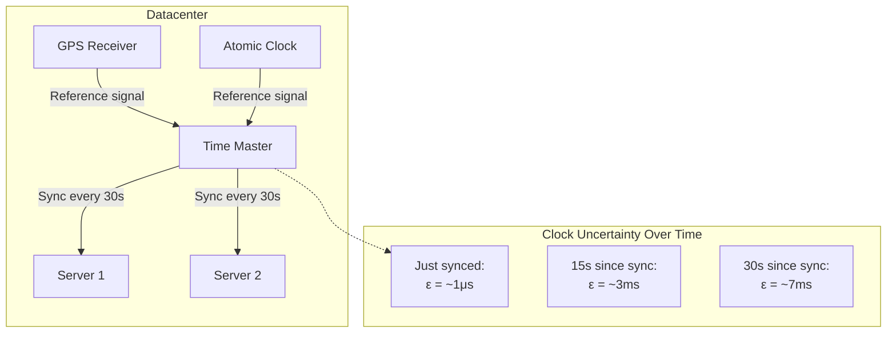
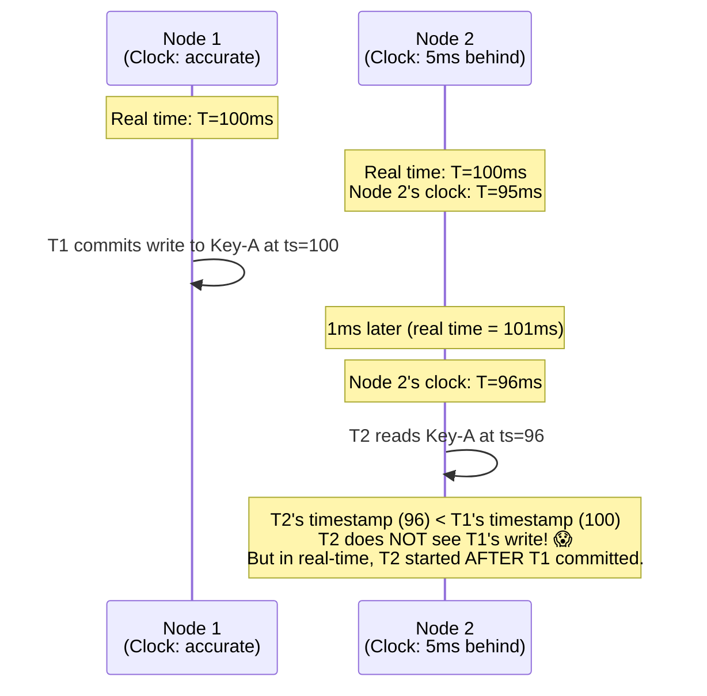
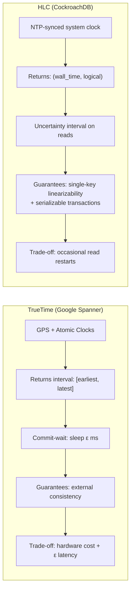

# 5. Time, Clocks, and MVCC 🔴

> **The Problem:** Your distributed database runs across five datacenters on three continents. A transaction commits in Tokyo at what Tokyo's clock says is `T=100`. One millisecond later, a transaction reads the same key in Frankfurt at what Frankfurt's clock says is `T=99`. Frankfurt's clock is *behind*—so it believes its read happened *before* the Tokyo write, and it misses the update entirely. You've just violated serializability. The speed of light guarantees you **cannot** perfectly synchronize clocks across the globe. You need a mechanism to order events consistently despite clock skew, enabling Multi-Version Concurrency Control (MVCC) that provides snapshot isolation or strict serializability without a single global lock.

---

## Why Clocks Matter in Distributed Databases

In a single-node database, ordering is trivial: events happen in the order they're processed by the single CPU. In a distributed database, there is **no global clock**. Each node has its own clock, and those clocks drift.

| Clock Type | Sync Accuracy | Cost | Who Uses It |
|---|---|---|---|
| **NTP (Network Time Protocol)** | 1–10ms typical, 100ms+ worst case | Free (software) | Everyone, by default |
| **PTP (Precision Time Protocol)** | 1–100μs | Moderate (NIC support) | Financial exchanges, some cloud providers |
| **GPS receiver** | ~100ns | Moderate (hardware) | AWS Time Sync, some cloud datacenters |
| **Atomic clock (cesium/rubidium)** | ~1ns local, depends on distribution | Very expensive | Google (TrueTime) |

The fundamental question: **How do you assign a globally meaningful timestamp to a transaction when clocks disagree?**

---

## Approach 1: Google TrueTime (Absolute Certainty)

Google's Spanner introduced **TrueTime**, a clock API that doesn't return a single timestamp—it returns a **confidence interval**.

```
TrueTime.now() → TT{earliest: 100, latest: 107}
```

This means: "The real, absolute time right now is somewhere between 100 and 107." The width of the interval (the **uncertainty window**, ε) depends on how recently the local clock was synchronized with GPS/atomic references.

### How TrueTime Works



Each datacenter has multiple **time masters** with GPS receivers and atomic clocks. Servers sync to these masters every ~30 seconds. Immediately after sync, uncertainty ε ≈ 1μs. It grows (due to crystal oscillator drift) until the next sync, peaking at ~7ms.

### The Commit-Wait Rule

To guarantee that if transaction T1 commits before T2 starts, then `T1.timestamp < T2.timestamp`, Spanner uses **commit-wait**:

```rust,ignore
/// TrueTime: returns an interval [earliest, latest] such that
/// the real absolute time is guaranteed to be within this interval.
#[derive(Debug, Clone, Copy)]
struct TrueTimeInterval {
    earliest: Timestamp,
    latest: Timestamp,
}

impl TrueTimeInterval {
    /// The uncertainty window.
    fn uncertainty(&self) -> Duration {
        self.latest - self.earliest
    }
}

/// Spanner's commit protocol with commit-wait.
fn commit_with_truetime(txn: &mut Transaction) -> Result<()> {
    // 1. Choose the commit timestamp as TrueTime.now().latest.
    //    This guarantees the commit timestamp is in the future
    //    (real-time hasn't reached it yet, or has just reached it).
    let tt = truetime_now();
    let commit_ts = tt.latest;
    txn.commit_timestamp = commit_ts;

    // 2. Commit-wait: sleep until we're certain that
    //    real-time has passed the commit timestamp.
    //    After this sleep, any future TrueTime.now().earliest
    //    will be > commit_ts.
    let wait_duration = commit_ts - tt.earliest;
    std::thread::sleep(wait_duration);

    // 3. Now safe to release locks and acknowledge the commit.
    //    Any transaction that starts after this point will
    //    have a timestamp > commit_ts, guaranteed.
    txn.release_locks();
    Ok(())
}
```

**The trade-off:** Commit-wait adds **ε latency** (the uncertainty window) to every transaction. With GPS/atomic clocks keeping ε < 7ms, this is acceptable. Without that hardware, ε could be 100ms+ — catastrophic for latency.

### TrueTime Guarantees

| Property | Guarantee |
|---|---|
| **External consistency** | If T1 commits before T2 starts (in real-time), then `T1.ts < T2.ts` |
| **No stale reads** | A read at timestamp T sees all transactions committed before real-time T |
| **Cost** | ~ε latency per commit (~4–7ms average, dedicated hardware required) |

---

## Approach 2: Hybrid Logical Clocks (Software-Only)

CockroachDB can't require every operator to install atomic clocks. Instead, it uses **Hybrid Logical Clocks (HLCs)**, invented by Kulkarni et al. (2014).

An HLC combines:
- A **physical component** (wall clock time, from NTP) for rough ordering.
- A **logical component** (a counter) for breaking ties and enforcing causal ordering.

```rust,ignore
/// Hybrid Logical Clock timestamp.
#[derive(Debug, Clone, Copy, PartialEq, Eq, PartialOrd, Ord)]
struct HlcTimestamp {
    /// Wall clock time in nanoseconds since Unix epoch.
    /// Taken from the local NTP-synchronized system clock.
    wall_time: u64,
    /// Logical counter: breaks ties when wall_time is equal.
    logical: u32,
}

impl HlcTimestamp {
    fn new(wall_time: u64, logical: u32) -> Self {
        Self { wall_time, logical }
    }

    fn zero() -> Self {
        Self { wall_time: 0, logical: 0 }
    }
}
```

### HLC Update Rules

The HLC has three operations, each maintaining the invariant that timestamps **always move forward**:

```rust,ignore
struct HybridLogicalClock {
    /// The current HLC timestamp on this node.
    current: HlcTimestamp,
    /// Maximum allowed clock offset from other nodes.
    max_offset: Duration,
}

impl HybridLogicalClock {
    /// Local event or send event: generate a new timestamp.
    fn now(&mut self) -> HlcTimestamp {
        let physical = system_clock_nanos();

        if physical > self.current.wall_time {
            // Physical clock advanced: use it, reset logical.
            self.current = HlcTimestamp::new(physical, 0);
        } else {
            // Physical clock hasn't advanced (same nanosecond
            // or clock went backward): increment logical.
            self.current.logical += 1;
        }
        self.current
    }

    /// Receive event: update local HLC based on a remote timestamp.
    fn update(&mut self, remote: HlcTimestamp) -> HlcTimestamp {
        let physical = system_clock_nanos();

        if physical > self.current.wall_time && physical > remote.wall_time {
            // Local physical clock is ahead of both: use it.
            self.current = HlcTimestamp::new(physical, 0);
        } else if self.current.wall_time == remote.wall_time {
            // Same wall time: take max logical + 1.
            self.current.logical = self.current.logical.max(remote.logical) + 1;
        } else if self.current.wall_time > remote.wall_time {
            // Local wall time is ahead: just increment logical.
            self.current.logical += 1;
        } else {
            // Remote wall time is ahead: adopt it, increment logical.
            self.current = HlcTimestamp::new(remote.wall_time, remote.logical + 1);
        }
        self.current
    }
}
```

### HLC Properties

| Property | Guarantee |
|---|---|
| **Causality** | If event A *happens-before* event B (A sends a message that B receives), then `HLC(A) < HLC(B)` |
| **Physical closeness** | `HLC.wall_time` is always within `max_offset` of the real physical time |
| **No hardware required** | Uses standard NTP-synchronized system clocks |
| **No commit-wait** | Doesn't need to sleep during commit |

But HLCs **cannot** guarantee external consistency like TrueTime. Two transactions on different nodes that don't communicate might get timestamps out of real-time order. CockroachDB uses additional mechanisms to handle this.

---

## The Clock Skew Problem



This is a **causal violation**: T2 should see T1's write (T1 committed before T2 started in real time), but the clock skew made T2's timestamp lower.

### CockroachDB's Solution: Uncertainty Intervals

Each transaction carries an **uncertainty interval**: the range of timestamps that *might* be in the future from the transaction's perspective (due to clock skew).

```rust,ignore
/// A transaction's view of time uncertainty.
#[derive(Debug, Clone)]
struct UncertaintyInterval {
    /// The transaction's chosen read timestamp.
    read_timestamp: HlcTimestamp,
    /// The upper bound: read_timestamp + max_clock_offset.
    /// Any value with a timestamp in (read_timestamp, global_uncertainty_limit]
    /// MIGHT have been committed before this transaction started.
    global_uncertainty_limit: HlcTimestamp,
    /// Per-node observed timestamps: if we've already communicated
    /// with a node, we know its clock, so we can tighten the interval.
    observed_timestamps: HashMap<NodeId, HlcTimestamp>,
}

impl UncertaintyInterval {
    fn new(read_ts: HlcTimestamp, max_offset: Duration) -> Self {
        Self {
            read_timestamp: read_ts,
            global_uncertainty_limit: HlcTimestamp::new(
                read_ts.wall_time + max_offset.as_nanos() as u64,
                0,
            ),
            observed_timestamps: HashMap::new(),
        }
    }

    /// The effective uncertainty limit for a specific node.
    /// If we've observed this node's clock, we can tighten the interval.
    fn uncertainty_limit_for(&self, node: NodeId) -> HlcTimestamp {
        match self.observed_timestamps.get(&node) {
            Some(&observed) => observed.min(self.global_uncertainty_limit),
            None => self.global_uncertainty_limit,
        }
    }
}
```

### How Uncertainty Intervals Work

When a transaction encounters a value whose timestamp falls **within its uncertainty interval**, it can't be sure whether the value was written before or after the transaction started. The transaction **restarts at a higher timestamp** to include that value.

```rust,ignore
impl RangeLeader {
    fn read_with_uncertainty(
        &self,
        key: &[u8],
        txn: &mut Transaction,
    ) -> Result<Option<Vec<u8>>> {
        let value = self.mvcc_get(key, txn.read_timestamp)?;
        
        // Check for values in the uncertainty interval.
        let uncertainty_limit = txn.uncertainty.uncertainty_limit_for(self.node_id);
        
        // Scan for any committed value in (read_timestamp, uncertainty_limit].
        let uncertain_value = self.mvcc_get_in_range(
            key,
            txn.read_timestamp,
            uncertainty_limit,
        )?;

        if let Some(uncertain_val) = uncertain_value {
            // Found a value in the uncertainty window!
            // We can't tell if it was written before or after our txn started.
            // Conservative action: restart at a higher timestamp.
            return Err(Error::ReadWithinUncertaintyInterval {
                existing_ts: uncertain_val.timestamp,
                // Restart at or above the uncertain value's timestamp
                // to guarantee we see it.
            });
        }

        // After reading from this node, record its clock.
        // Future reads from this node won't have uncertainty.
        txn.uncertainty.observed_timestamps
            .insert(self.node_id, self.hlc.now());

        Ok(value)
    }
}
```

**Key insight:** After the first read from a node, the transaction **observes** that node's clock. Future reads from the same node have **zero uncertainty** (the observed timestamp tightens the interval to nothing). This means uncertainty restarts happen at most **once per node per transaction**.

---

## Multi-Version Concurrency Control (MVCC)

MVCC is the mechanism that makes all of this work. Instead of overwriting values in place, every write creates a **new version** of the key, tagged with a timestamp. Reads choose which version to see based on their read timestamp.

### MVCC Key Layout

```
Key in RocksDB:     [user_key_bytes][timestamp_bytes_descending]
```

Timestamps are stored in **descending order** so that a forward RocksDB scan finds the **newest** version first:

```
/Table5/42/ts=150 → {name: "Alice", balance: 400}     ← newest
/Table5/42/ts=100 → {name: "Alice", balance: 500}     ← older
/Table5/42/ts=50  → {name: "Alice", balance: 1000}    ← oldest
```

A read at timestamp `120` sees the version at `ts=100` (the latest version ≤ 120).

```rust,ignore
/// MVCC key encoding: user key + inverted timestamp.
fn encode_mvcc_key(user_key: &[u8], timestamp: HlcTimestamp) -> Vec<u8> {
    let mut key = Vec::with_capacity(user_key.len() + 12);
    key.extend_from_slice(user_key);
    // Invert timestamp bytes so RocksDB's ascending sort
    // gives us descending timestamp order.
    key.extend_from_slice(&(!timestamp.wall_time).to_be_bytes());
    key.extend_from_slice(&(!timestamp.logical).to_be_bytes());
    key
}

/// MVCC point read: find the latest version at or before `read_ts`.
fn mvcc_get(
    db: &rocksdb::DB,
    user_key: &[u8],
    read_ts: HlcTimestamp,
) -> Result<Option<VersionedValue>> {
    // Seek to user_key + inverted(read_ts).
    // The first entry we find will be the latest version ≤ read_ts.
    let seek_key = encode_mvcc_key(user_key, read_ts);
    let mut iter = db.raw_iterator();
    iter.seek(&seek_key);

    if iter.valid() {
        let (found_user_key, found_ts) = decode_mvcc_key(iter.key().unwrap());
        if found_user_key == user_key {
            let value = iter.value().unwrap().to_vec();
            return Ok(Some(VersionedValue {
                timestamp: found_ts,
                data: value,
            }));
        }
    }
    Ok(None)
}
```

### MVCC Writes

```rust,ignore
/// MVCC write: create a new version of the key at the given timestamp.
fn mvcc_put(
    db: &rocksdb::DB,
    user_key: &[u8],
    timestamp: HlcTimestamp,
    value: &[u8],
) -> Result<()> {
    let mvcc_key = encode_mvcc_key(user_key, timestamp);
    db.put(&mvcc_key, value)?;
    Ok(())
}
```

### MVCC with Intents

Intents (from Chapter 4) are stored at a **special "zero timestamp"** that sorts before all real versions:

```
/Table5/42/ts=0   → Intent{txn: abc, val: {balance: 400}}  ← intent (always first)
/Table5/42/ts=150 → {balance: 400}                          ← committed
/Table5/42/ts=100 → {balance: 500}                          ← committed
```

When reading, the MVCC layer first checks for an intent at timestamp 0. If found, it follows the conflict resolution rules from Chapter 4.

---

## Garbage Collection of Old Versions

MVCC accumulates old versions indefinitely. A **GC process** periodically removes versions older than a configurable threshold (the **GC TTL**, e.g., 25 hours):

```rust,ignore
/// MVCC garbage collection: remove versions older than the GC threshold.
fn mvcc_gc(
    db: &rocksdb::DB,
    user_key: &[u8],
    gc_threshold: HlcTimestamp,
) -> Result<usize> {
    let mut iter = db.raw_iterator();
    let prefix = encode_mvcc_key(user_key, HlcTimestamp::zero());
    iter.seek(&prefix);

    let mut deleted = 0;
    let mut found_live_version = false;

    while iter.valid() {
        let (found_key, ts) = decode_mvcc_key(iter.key().unwrap());
        if found_key != user_key {
            break;
        }

        if ts < gc_threshold && found_live_version {
            // This version is older than the GC threshold
            // AND there's a newer version that survives.
            // Safe to delete.
            db.delete(iter.key().unwrap())?;
            deleted += 1;
        } else {
            // This is the latest surviving version (or within GC window).
            // Keep it—it might be needed for ongoing long-running reads.
            found_live_version = true;
        }
        iter.next();
    }

    Ok(deleted)
}
```

The GC TTL determines how far back in time you can read. This enables:
- **`AS OF SYSTEM TIME` queries:** Read the database as it was 1 hour ago.
- **Backup consistency:** Point-in-time backups without pausing writes.
- **CDC (Change Data Capture):** Stream all changes since a specific timestamp.

---

## TrueTime vs. HLC: The Complete Comparison



| Dimension | TrueTime (Spanner) | HLC (CockroachDB) |
|---|---|---|
| **Hardware** | GPS receivers + atomic clocks in every DC | Standard NTP (no special hardware) |
| **Clock uncertainty** | ε ≈ 1–7ms (measured, bounded) | `max_offset` ≈ 250–500ms (configured, assumed) |
| **Commit latency overhead** | +ε ms per commit (commit-wait) | None (no commit-wait) |
| **Read correctness** | Always correct (wait ensures it) | Uncertainty restarts if value in uncertainty window |
| **External consistency** | ✅ Guaranteed | ⚠️ Best-effort; violated if clock skew exceeds `max_offset` |
| **Operational complexity** | High (maintain GPS/atomic infrastructure) | Low (standard servers) |
| **Availability during clock issues** | Commit-wait grows but system stays correct | System halts nodes with excessive clock drift |
| **Best for** | Global deployments with strict correctness | Standard cloud deployments, cost-sensitive environments |

### When Does It Matter?

For **most** applications, HLCs are sufficient. The scenarios where TrueTime's stronger guarantees matter:

1. **Global financial transactions:** Two traders in different cities must see a consistent order of trades.
2. **Legal compliance:** A European court order to "freeze the account at exactly 14:00 UTC" must be globally precise.
3. **Cross-datacenter causal consistency:** Session A writes in US-East, Session B reads in EU-West—B must see A's write if B started after A completed.

For CockroachDB's HLC approach, the `max_offset` parameter (default 250ms in older versions, 500ms currently) is the safety margin. If real clock skew exceeds this, correctness degrades. CockroachDB **halts nodes** whose clocks drift beyond half of `max_offset` to prevent this.

---

## Putting It All Together: Read and Write Timelines

### Write Path (with HLC)

```
1. Client: BEGIN transaction
2. Coordinator: HLC.now() → ts=1000 (wall: 1000, logical: 0)
   → This becomes the provisional write timestamp.
3. Client: UPDATE accounts SET balance=400 WHERE id=1
4. Coordinator: Write intent at MVCC key /accounts/1/ts=0 → Intent{txn, val=400}
5. Client: COMMIT
6. Coordinator: HLC.now() → ts=1002 (clock advanced)
   → Commit timestamp = 1002.
7. Raft replicates STAGING record.
8. Intent resolved: /accounts/1/ts=1002 → val=400 (committed version created).
```

### Read Path (with Uncertainty)

```
1. Client: SELECT balance FROM accounts WHERE id=1
2. Gateway → Range Leader for /accounts/1
3. Leader: HLC.now() → ts=1005 (transaction read timestamp)
   Uncertainty interval: [1005, 1005 + max_offset(250ms) = 1255]
4. MVCC scan at ts=1005:
   - Found: /accounts/1/ts=1002 → val=400 ✅ (≤ 1005, visible)
   - Check uncertainty: any version in (1005, 1255]?
     - No → safe to return val=400.
5. Record observed timestamp for this node.
6. Return balance=400 to client.
```

### The Uncertainty Restart Scenario

```
1. Node A's clock: 1000 (accurate).
   Node B's clock: 997 (3ms behind).
2. T1 (on Node A): writes /key at ts=1000, commits.
3. T2 (on Node B): starts, HLC.now() → ts=997.
   Uncertainty interval: [997, 997 + 250 = 1247].
4. T2 reads /key from Node A.
   - Found version at ts=1000.
   - 1000 is in T2's uncertainty interval (997, 1247].
   - T2 can't tell: did T1 commit before or after T2 started?
5. T2 restarts at ts=1001 (just above the uncertain value).
   - New uncertainty interval: [1001, 1001 + 250 = 1251].
   - Re-read: /key at ts=1000 is now ≤ 1001 → visible, no uncertainty.
6. T2 continues normally.
```

The restart adds **one extra read round-trip** but guarantees correctness. After observing Node A's clock, all future reads from Node A within this transaction have no uncertainty.

---

## Clock Skew Protection

CockroachDB actively protects against clock skew:

```rust,ignore
/// On every inter-node RPC, check the remote node's clock.
fn check_clock_offset(local_hlc: &HybridLogicalClock, remote_ts: HlcTimestamp) -> Result<()> {
    let local_now = system_clock_nanos();
    let remote_wall = remote_ts.wall_time;
    let offset = if remote_wall > local_now {
        remote_wall - local_now
    } else {
        local_now - remote_wall
    };

    let max_allowed = local_hlc.max_offset / 2;
    if Duration::from_nanos(offset) > max_allowed {
        // Clock skew exceeds safety margin.
        // This node should be taken offline.
        return Err(Error::ClockSkewExceeded {
            offset: Duration::from_nanos(offset),
            max_allowed,
        });
    }
    Ok(())
}
```

If a node's clock drifts beyond `max_offset / 2`, it **self-quarantines**: it stops accepting reads and writes and alerts operators. This fail-fast behavior prevents silent correctness violations.

---

## Snapshot Reads and Time-Travel Queries

MVCC + timestamps enable powerful features:

### AS OF SYSTEM TIME

```sql
-- Read the database as it was 1 hour ago.
SELECT * FROM accounts AS OF SYSTEM TIME '-1h';

-- Read at an exact HLC timestamp.
SELECT * FROM accounts AS OF SYSTEM TIME '1617235200.000000000';
```

This reads at the specified historical timestamp. The MVCC layer returns the version that was current at that time. No locks, no conflicts—historical reads never block writes.

### Follower Reads

A read at a sufficiently old timestamp (older than the Raft lease duration) can be served by **any replica**, not just the leader. The follower knows that all writes up to that timestamp have been applied.

```rust,ignore
impl RangeReplica {
    /// Can this replica serve a read at the given timestamp?
    fn can_serve_follower_read(&self, read_ts: HlcTimestamp) -> bool {
        // The closed timestamp: the highest timestamp at which
        // the leader has promised not to accept new writes.
        // All writes at or below this timestamp are applied.
        read_ts <= self.closed_timestamp
    }
}
```

**Impact:** Follower reads distribute read load across all replicas and enable low-latency reads from geographically close replicas, even if the leader is far away.

### Change Data Capture (CDC)

CDC streams all MVCC changes since a given timestamp:

```sql
-- Stream all changes to the accounts table since 1 hour ago.
CREATE CHANGEFEED FOR accounts
  WITH updated, resolved, cursor = '-1h';
```

The MVCC layer scans for all versions newer than the cursor timestamp and streams them, maintaining ordering guarantees.

---

> **Key Takeaways**
>
> - **Clock skew is the fundamental enemy** of distributed databases. Two events that happen in real-time order might get timestamps in the wrong order if clocks disagree.
> - **TrueTime** (Google Spanner) solves this with GPS + atomic clocks that provide a bounded uncertainty interval ε. The **commit-wait** rule (sleep for ε) guarantees external consistency—at the cost of specialized hardware and ε latency per commit.
> - **Hybrid Logical Clocks** (CockroachDB) solve this with software-only clocks that combine wall-time and logical counters. They guarantee causality for communicating nodes but use **uncertainty intervals** and **read restarts** to handle clock skew between non-communicating nodes.
> - **MVCC** stores every write as a new timestamped version. Reads select the appropriate version based on their read timestamp. Old versions enable time-travel queries, follower reads, and CDC.
> - MVCC keys are encoded with **descending timestamps** so that a forward scan finds the newest version first—a single RocksDB seek for the common case.
> - **Uncertainty restarts** happen at most once per node per transaction. After the first communication with a node, its clock is "observed" and future reads from that node have zero uncertainty.
> - **GC of old MVCC versions** is governed by a configurable TTL (e.g., 25 hours), which determines how far back time-travel queries can reach.
> - In practice, **HLC is sufficient for the vast majority of deployments**. TrueTime's stronger guarantees matter primarily for global financial systems and strict regulatory requirements.
