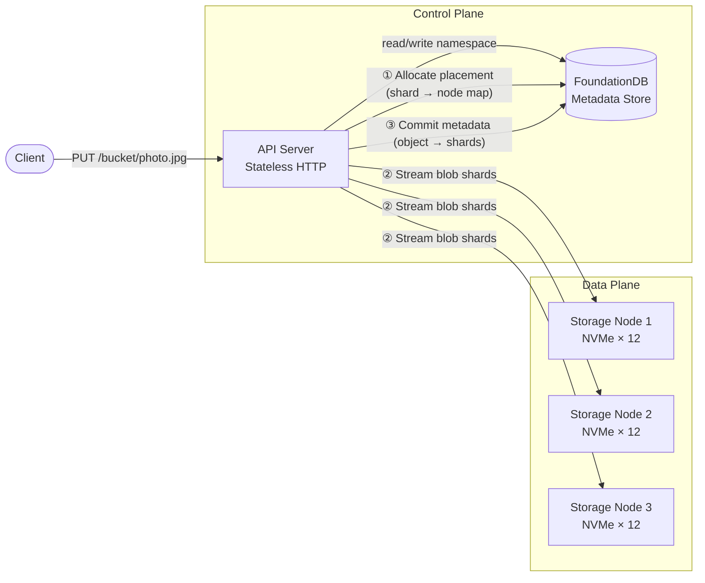
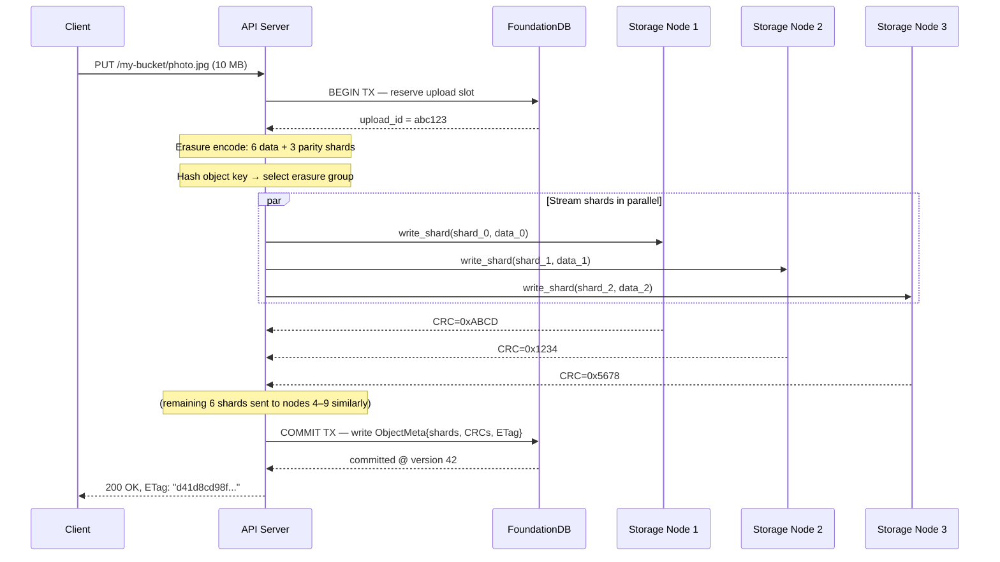
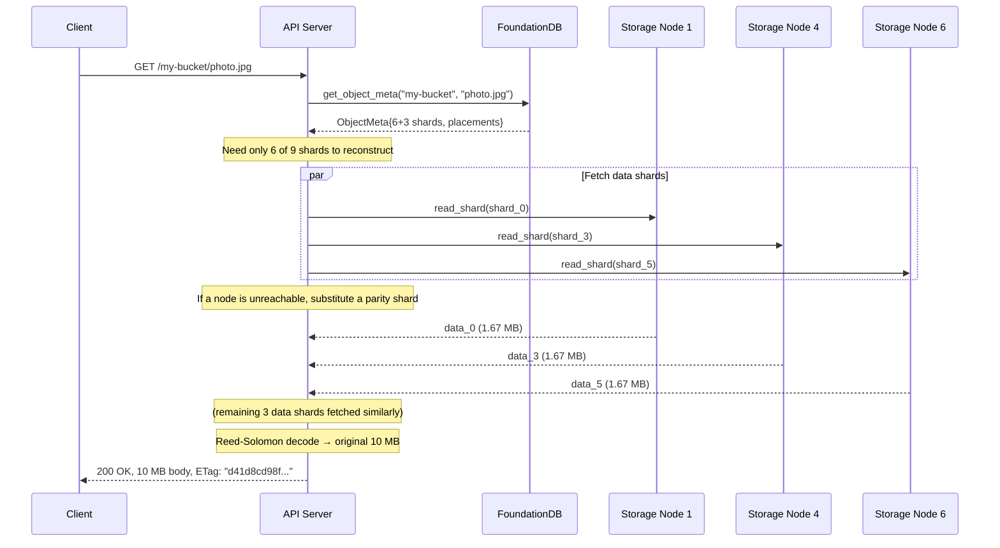

# 1. The Control Plane vs. The Data Plane 🟢

> **The Problem:** A naive object store puts everything—metadata, permissions, routing tables, and the actual bytes—on the same server. At 1 PB this server becomes the bottleneck for every operation. Metadata lookups (tiny, latency-critical) compete for disk I/O with blob reads (large, throughput-critical). We need to cleanly separate the *brain* of the system (where is the data?) from the *muscle* (the raw bytes on disk).

---

## Why Separation Matters

Every object store operation begins with a metadata question:

1. **PUT** — "Which erasure group should store this object?"
2. **GET** — "Where are the shards for this object right now?"
3. **DELETE** — "Mark this object as tombstoned; schedule garbage collection."
4. **LIST** — "Show me all objects with prefix `images/2025/`."

These are fundamentally **key-value lookups** over a namespace tree—small records, sub-millisecond latency, indexed by bucket + key. The actual *bytes* of the object (a 10 MB photo, a 5 TB database backup) live on completely different hardware optimized for sequential throughput.

Mixing them on the same node creates three fatal problems:

| Problem | Effect |
|---|---|
| **I/O contention** | A 5 GB blob read saturates the NVMe queue, starving metadata lookups that need < 1 ms |
| **Scaling mismatch** | Metadata scales with *object count* (billions of keys); blob storage scales with *total bytes* (exabytes). These grow at different rates. |
| **Failure blast radius** | A crashed metadata node should not take blobs offline; a dead disk should not lose the namespace |

### The Two-System Architecture



**Key insight:** The API server is *stateless*. It looks up placement in the metadata store, streams bytes directly to/from storage nodes, and commits the final mapping. Horizontal scaling is trivial—add more API servers behind a load balancer.

---

## The Control Plane: Metadata Store

### What the Metadata Store Holds

| Record Type | Key | Value | Example Size |
|---|---|---|---|
| **Object record** | `(bucket, key, version)` | Shard list, size, ETag, timestamps, ACL | ~256 B |
| **Bucket record** | `(account, bucket)` | Region, policy, quota | ~128 B |
| **Placement map** | `(erasure_group_id)` | List of node IDs, group health | ~64 B |
| **Upload manifest** | `(upload_id)` | Part list, expiry, state machine | ~512 B |

At 10 billion objects, the metadata corpus is:

```
10 × 10⁹ objects × 256 B = 2.56 TB
```

This fits comfortably in a FoundationDB cluster with a handful of SSDs. Compare this to 10 billion objects × 10 MB average = **100 PB** of blob data requiring thousands of storage nodes.

### Why FoundationDB?

| Property | etcd | FoundationDB | Custom Raft KV |
|---|---|---|---|
| Max dataset size | ~8 GB (practical) | Unlimited (sharded) | Unlimited (you build it) |
| Transaction support | Single-key CAS | Multi-key ACID | You build it |
| Watch / change feed | Yes | Yes (versionstamps) | You build it |
| Proven at scale | Kubernetes-scale (~100K objs) | Apple CloudKit (exabytes) | Depends on implementation |
| Operational burden | Low | Medium | High |

FoundationDB wins for object stores because it supports **multi-key transactions** (e.g., atomically creating an object record *and* updating a bucket byte counter) and **ordered key ranges** (enabling efficient `LIST` with prefix scans).

### Rust Metadata Client

We interact with FoundationDB via the `foundationdb` crate. Here is the core abstraction:

```rust,ignore
use foundationdb::{Database, TransactOption, Transaction};
use serde::{Deserialize, Serialize};

/// An object's metadata record stored in FoundationDB.
#[derive(Debug, Serialize, Deserialize)]
struct ObjectMeta {
    bucket: String,
    key: String,
    version: u64,
    size_bytes: u64,
    etag: String,
    /// The erasure group that holds this object's shards.
    erasure_group_id: u64,
    /// Ordered list of (node_id, shard_index) for each shard.
    shard_placements: Vec<(u32, u8)>,
    created_at: i64,
    content_type: String,
}

/// Encode a metadata key for FoundationDB.
/// Format: ("obj", bucket, key, version) — lexicographically ordered.
fn meta_key(bucket: &str, key: &str, version: u64) -> Vec<u8> {
    let mut k = Vec::with_capacity(4 + bucket.len() + key.len() + 8);
    k.extend_from_slice(b"obj\x00");
    k.extend_from_slice(bucket.as_bytes());
    k.push(0x00);
    k.extend_from_slice(key.as_bytes());
    k.push(0x00);
    // Big-endian so lexicographic order matches numeric order (newest last).
    k.extend_from_slice(&version.to_be_bytes());
    k
}
```

### Writing an Object Record (Transactional)

```rust,ignore
/// Atomically write an object record and update the bucket byte counter.
async fn put_object_meta(
    db: &Database,
    meta: &ObjectMeta,
) -> Result<(), Box<dyn std::error::Error>> {
    let key = meta_key(&meta.bucket, &meta.key, meta.version);
    let value = bincode::serialize(meta)?;

    db.run(|tx, _maybe_committed| async move {
        // 1. Write the object record.
        tx.set(&key, &value);

        // 2. Atomically increment the bucket's total byte counter.
        //    FoundationDB atomic operations avoid read-modify-write conflicts.
        let counter_key = format!("bucket_bytes\x00{}", meta.bucket);
        tx.atomic_op(
            counter_key.as_bytes(),
            &meta.size_bytes.to_le_bytes(),
            foundationdb::options::MutationType::Add,
        );

        Ok(())
    })
    .await?;

    Ok(())
}
```

### Reading an Object Record

```rust,ignore
/// Look up the latest version of an object.
async fn get_object_meta(
    db: &Database,
    bucket: &str,
    key: &str,
) -> Result<Option<ObjectMeta>, Box<dyn std::error::Error>> {
    let result = db
        .run(|tx, _maybe_committed| async move {
            // Range scan for all versions of this object, take the last (newest).
            let start = meta_key(bucket, key, 0);
            let end = meta_key(bucket, key, u64::MAX);

            let range = tx
                .get_range(
                    &foundationdb::RangeOption {
                        begin: foundationdb::KeySelector::first_greater_or_equal(&start),
                        end: foundationdb::KeySelector::first_greater_or_equal(&end),
                        limit: Some(1),
                        reverse: true, // newest first
                        ..Default::default()
                    },
                    0,
                    false,
                )
                .await?;

            if let Some(kv) = range.first() {
                let meta: ObjectMeta = bincode::deserialize(kv.value())
                    .map_err(|e| foundationdb::FdbError::from(1000))?;
                Ok(Some(meta))
            } else {
                Ok(None)
            }
        })
        .await?;

    Ok(result)
}
```

### Listing Objects by Prefix

```rust,ignore
/// List objects under a prefix (e.g., "images/2025/").
///
/// Returns up to `limit` keys. The caller uses the last returned key
/// as the `continuation_token` for pagination.
async fn list_objects(
    db: &Database,
    bucket: &str,
    prefix: &str,
    continuation_token: Option<&str>,
    limit: usize,
) -> Result<Vec<ObjectMeta>, Box<dyn std::error::Error>> {
    let start_key = match continuation_token {
        Some(token) => meta_key(bucket, token, 0),
        None => meta_key(bucket, prefix, 0),
    };

    // End of the prefix range: increment last byte.
    let mut end_prefix = prefix.as_bytes().to_vec();
    if let Some(last) = end_prefix.last_mut() {
        *last += 1;
    }
    let end_key = meta_key(bucket, &String::from_utf8_lossy(&end_prefix), 0);

    let results = db
        .run(|tx, _maybe_committed| async move {
            let range = tx
                .get_range(
                    &foundationdb::RangeOption {
                        begin: foundationdb::KeySelector::first_greater_or_equal(&start_key),
                        end: foundationdb::KeySelector::first_greater_or_equal(&end_key),
                        limit: Some(limit as i32),
                        reverse: false,
                        ..Default::default()
                    },
                    0,
                    false,
                )
                .await?;

            let mut objects = Vec::with_capacity(range.len());
            for kv in range.iter() {
                if let Ok(meta) = bincode::deserialize::<ObjectMeta>(kv.value()) {
                    objects.push(meta);
                }
            }
            Ok(objects)
        })
        .await?;

    Ok(results)
}
```

---

## The Data Plane: Storage Nodes

Storage nodes are deliberately simple. They have **no knowledge of buckets, keys, or object semantics**. They only understand:

- **Shard ID** — a globally unique identifier for a chunk of bytes.
- **Write shard** — receive bytes, write them to a local file, return a checksum.
- **Read shard** — given a shard ID and byte range, return the bytes.
- **Delete shard** — remove a shard file from local disk.
- **Verify shard** — compute the CRC32C of a shard and report pass/fail.

This radical simplicity is deliberate. The storage node is a **dumb byte locker**. All intelligence (naming, routing, access control, erasure group management) lives in the control plane.

### The Storage Node Directory Layout

Each storage node manages multiple NVMe drives. Shards are distributed across drives by hashing the shard ID:

```
/mnt/nvme0/
  shards/
    00/
      00a3f7c2d1e4b8...  (shard file)
      00f1a2b3c4d5e6...
    01/
      01b2c3d4e5f6a7...
    ...
    ff/

/mnt/nvme1/
  shards/
    00/
    ...
```

The two-level hex prefix (`00/` through `ff/`) prevents any single directory from accumulating millions of entries, which degrades `readdir` performance on ext4/XFS.

### Storage Node Service

```rust,ignore
use std::path::{Path, PathBuf};
use tokio::fs;
use tokio::io::{AsyncReadExt, AsyncWriteExt};
use crc32fast::Hasher;

/// Represents a single storage node managing multiple drives.
struct StorageNode {
    /// Mount points for each NVMe drive.
    drives: Vec<PathBuf>,
}

impl StorageNode {
    /// Determine which drive and path a shard maps to.
    fn shard_path(&self, shard_id: &[u8; 32]) -> PathBuf {
        // Use the first byte of the shard ID to pick the drive.
        let drive_index = shard_id[0] as usize % self.drives.len();
        let hex_id = hex::encode(shard_id);
        // Two-level directory prefix from the first two hex characters.
        let prefix = &hex_id[..2];
        self.drives[drive_index]
            .join("shards")
            .join(prefix)
            .join(&hex_id)
    }

    /// Write a shard to disk. Returns the CRC32C checksum.
    async fn write_shard(
        &self,
        shard_id: &[u8; 32],
        data: &[u8],
    ) -> std::io::Result<u32> {
        let path = self.shard_path(shard_id);

        // Ensure the parent directory exists.
        if let Some(parent) = path.parent() {
            fs::create_dir_all(parent).await?;
        }

        // Write to a temp file, then rename for atomicity.
        let tmp_path = path.with_extension("tmp");
        let mut file = fs::File::create(&tmp_path).await?;

        // Compute CRC32C while writing.
        let mut hasher = Hasher::new();
        hasher.update(data);
        let checksum = hasher.finalize();

        // Write: [crc32: 4 bytes] [data: N bytes]
        file.write_all(&checksum.to_le_bytes()).await?;
        file.write_all(data).await?;
        file.sync_all().await?;

        // Atomic rename: tmp → final.
        fs::rename(&tmp_path, &path).await?;

        Ok(checksum)
    }

    /// Read a shard from disk. Verifies the embedded checksum.
    async fn read_shard(
        &self,
        shard_id: &[u8; 32],
    ) -> std::io::Result<Vec<u8>> {
        let path = self.shard_path(shard_id);
        let mut file = fs::File::open(&path).await?;

        // Read stored checksum.
        let mut crc_buf = [0u8; 4];
        file.read_exact(&mut crc_buf).await?;
        let stored_crc = u32::from_le_bytes(crc_buf);

        // Read data.
        let mut data = Vec::new();
        file.read_to_end(&mut data).await?;

        // Verify.
        let mut hasher = Hasher::new();
        hasher.update(&data);
        let actual_crc = hasher.finalize();

        if stored_crc != actual_crc {
            return Err(std::io::Error::new(
                std::io::ErrorKind::InvalidData,
                format!(
                    "CRC mismatch for shard {}: stored={stored_crc:#x}, actual={actual_crc:#x}",
                    hex::encode(shard_id)
                ),
            ));
        }

        Ok(data)
    }

    /// Read a byte range from a shard (for Range GET support).
    async fn read_shard_range(
        &self,
        shard_id: &[u8; 32],
        offset: u64,
        length: u64,
    ) -> std::io::Result<Vec<u8>> {
        use tokio::io::AsyncSeekExt;

        let path = self.shard_path(shard_id);
        let mut file = fs::File::open(&path).await?;

        // Skip the 4-byte CRC header, then seek to the requested offset.
        let seek_pos = 4 + offset;
        file.seek(std::io::SeekFrom::Start(seek_pos)).await?;

        let mut buf = vec![0u8; length as usize];
        file.read_exact(&mut buf).await?;

        Ok(buf)
    }

    /// Delete a shard from disk.
    async fn delete_shard(&self, shard_id: &[u8; 32]) -> std::io::Result<()> {
        let path = self.shard_path(shard_id);
        fs::remove_file(&path).await
    }

    /// Verify a shard's integrity without returning data.
    async fn verify_shard(&self, shard_id: &[u8; 32]) -> std::io::Result<bool> {
        match self.read_shard(shard_id).await {
            Ok(_) => Ok(true),
            Err(e) if e.kind() == std::io::ErrorKind::InvalidData => Ok(false),
            Err(e) => Err(e),
        }
    }
}
```

---

## The PUT Path: End-to-End

Let's trace a complete `PUT /my-bucket/photo.jpg` (10 MB file) through both planes:



### The PUT Path in Code

```rust,ignore
use sha2::{Sha256, Digest};

/// The complete PUT handler on the API server.
async fn handle_put(
    db: &Database,
    cluster: &ClusterMap,
    bucket: &str,
    key: &str,
    body: &[u8],
) -> Result<String, Box<dyn std::error::Error>> {
    // 1. Select the erasure group via consistent hashing (Chapter 2).
    let group = cluster.select_erasure_group(bucket, key);

    // 2. Erasure-encode the body into data + parity shards (Chapter 3).
    let shards = erasure_encode(body, 6, 3)?;

    // 3. Compute the ETag (SHA-256 of the raw body).
    let mut hasher = Sha256::new();
    hasher.update(body);
    let etag = format!("{:x}", hasher.finalize());

    // 4. Generate shard IDs (hash of object key + shard index).
    let shard_ids: Vec<[u8; 32]> = (0..9)
        .map(|i| {
            let mut h = Sha256::new();
            h.update(bucket.as_bytes());
            h.update(key.as_bytes());
            h.update(&[i as u8]);
            let result = h.finalize();
            let mut id = [0u8; 32];
            id.copy_from_slice(&result);
            id
        })
        .collect();

    // 5. Stream shards to storage nodes in parallel.
    let mut placements = Vec::with_capacity(9);
    let mut tasks = Vec::new();

    for (i, (shard_data, node_id)) in
        shards.iter().zip(group.node_ids.iter()).enumerate()
    {
        let shard_id = shard_ids[i];
        let node = cluster.get_node(*node_id);
        let data = shard_data.clone();
        tasks.push(tokio::spawn(async move {
            node.write_shard(&shard_id, &data).await
        }));
        placements.push((*node_id, i as u8));
    }

    // 6. Await all shard writes.
    for task in tasks {
        task.await??;
    }

    // 7. Commit metadata to FoundationDB.
    let meta = ObjectMeta {
        bucket: bucket.to_string(),
        key: key.to_string(),
        version: 1,
        size_bytes: body.len() as u64,
        etag: etag.clone(),
        erasure_group_id: group.id,
        shard_placements: placements,
        created_at: chrono::Utc::now().timestamp_millis(),
        content_type: "application/octet-stream".to_string(),
    };
    put_object_meta(db, &meta).await?;

    Ok(etag)
}
```

---

## The GET Path: End-to-End



**Key optimization:** In the happy path, we fetch only the 6 **data shards** (not the 3 parity shards). This minimizes network traffic. Parity shards are only fetched when a data shard read fails.

---

## Health Checking and Failure Detection

The control plane must continuously know which storage nodes are alive. We use a **heartbeat + lease** model:

```rust,ignore
use std::time::{Duration, Instant};
use std::collections::HashMap;
use tokio::sync::RwLock;

const HEARTBEAT_INTERVAL: Duration = Duration::from_secs(5);
const LEASE_TIMEOUT: Duration = Duration::from_secs(15);

/// Tracks the health of all storage nodes.
struct NodeHealthTracker {
    last_heartbeat: RwLock<HashMap<u32, Instant>>,
}

impl NodeHealthTracker {
    /// Called when a storage node sends its periodic heartbeat.
    async fn record_heartbeat(&self, node_id: u32) {
        let mut map = self.last_heartbeat.write().await;
        map.insert(node_id, Instant::now());
    }

    /// Returns true if the node's lease is still valid.
    async fn is_alive(&self, node_id: u32) -> bool {
        let map = self.last_heartbeat.read().await;
        match map.get(&node_id) {
            Some(last) => last.elapsed() < LEASE_TIMEOUT,
            None => false,
        }
    }

    /// Return all nodes whose lease has expired.
    async fn dead_nodes(&self) -> Vec<u32> {
        let map = self.last_heartbeat.read().await;
        map.iter()
            .filter(|(_, last)| last.elapsed() >= LEASE_TIMEOUT)
            .map(|(id, _)| *id)
            .collect()
    }
}
```

When a node is declared dead:

1. The control plane marks all erasure groups containing that node as **degraded**.
2. GET requests for those groups transparently use parity shards to reconstruct.
3. The repair scheduler begins **re-encoding** the lost shards onto healthy nodes (Chapter 4).

---

## Scaling the Two Planes Independently

| Dimension | Control Plane | Data Plane |
|---|---|---|
| **Scale trigger** | Object count, metadata QPS | Total stored bytes, I/O bandwidth |
| **Add capacity** | Add FoundationDB storage processes | Add storage nodes with NVMe drives |
| **Typical ratio** | 3–5 FDB nodes per 100 storage nodes | 1 storage node per 100 TB usable |
| **Failure impact** | Metadata unavailable (all PUTs/GETs blocked) | Degraded read (use parity shards) |
| **Recovery time** | FDB auto-recovers in ~5 seconds | Re-replication takes hours at PB scale |

### Stateless API Servers

API servers hold **zero persistent state**. They:

- Accept HTTP requests.
- Authenticate via the metadata store.
- Compute consistent hash → erasure group placement.
- Stream bytes between client and storage nodes.
- Commit the metadata transaction.

This makes them trivially horizontally scalable. A Kubernetes `Deployment` with an HPA on CPU/request-rate is sufficient.

---

## Anti-Patterns: What NOT to Do

### ❌ Anti-Pattern 1: Metadata in the Data Plane

```
# DON'T: Store object names alongside blobs on the storage node.
/mnt/nvme0/objects/my-bucket/photos/vacation/img001.jpg
```

**Why it fails:** Listing "all objects in my-bucket/photos/" requires scanning every storage node's filesystem. At exabyte scale, this is millions of `readdir` calls across thousands of servers.

### ❌ Anti-Pattern 2: Blob Data in the Metadata Store

```
# DON'T: Store small objects directly in FoundationDB.
fdb.set(b"obj:my-bucket:config.json", entire_file_contents)
```

**Why it fails:** FoundationDB has a 100 KB value size limit. Even for files under that limit, storing blobs in the metadata path increases transaction sizes, log volume, and replication bandwidth for a system optimized for tiny records.

### ❌ Anti-Pattern 3: Single Monolithic Gateway

```
# DON'T: Route all traffic through one stateful proxy that
# caches metadata AND buffers blob data.
```

**Why it fails:** The proxy becomes an OOM risk. A single 5 TB multi-part upload buffered in memory kills the process. The API server must *stream* bytes through, never buffer the entire object.

---

> **Key Takeaways**
>
> 1. **Separate metadata from data.** The control plane (FoundationDB) handles naming, routing, and transactions. The data plane (storage nodes) handles raw bytes.
> 2. **The API server is stateless.** It streams bytes between client and storage nodes, committing only a small metadata record. This enables trivial horizontal scaling.
> 3. **Storage nodes are intentionally dumb.** They store and retrieve shards by ID. No bucket or key awareness—all intelligence lives in the control plane.
> 4. **Use atomic transactions** for metadata mutations. A `PUT` must atomically create the object record and update the bucket byte counter—FoundationDB's multi-key ACID transactions guarantee this.
> 5. **Health checking is a control plane responsibility.** Heartbeat + lease tracking enables the system to degrade gracefully and trigger background repair when nodes die.
