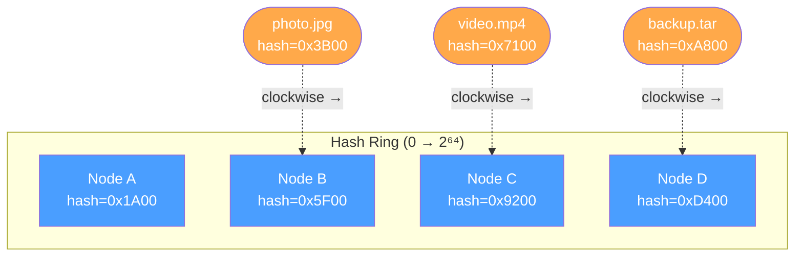
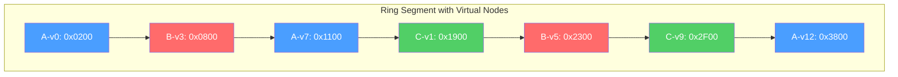
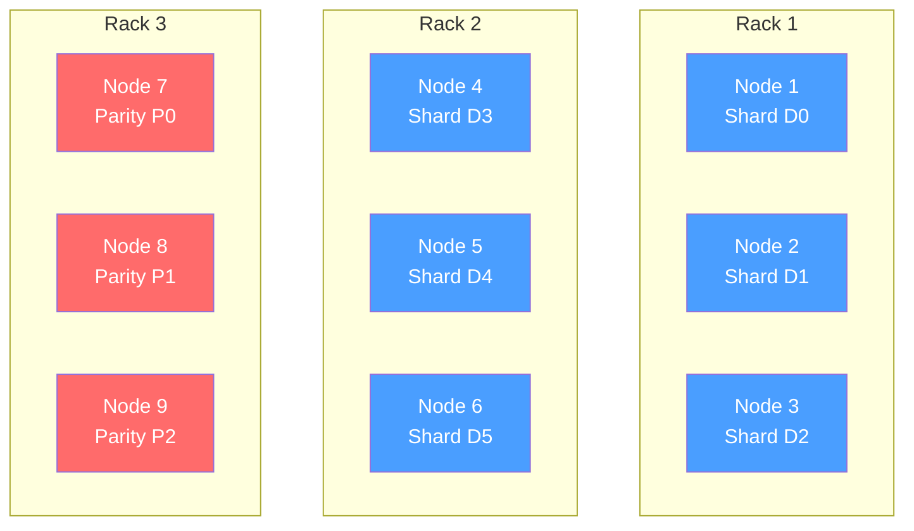
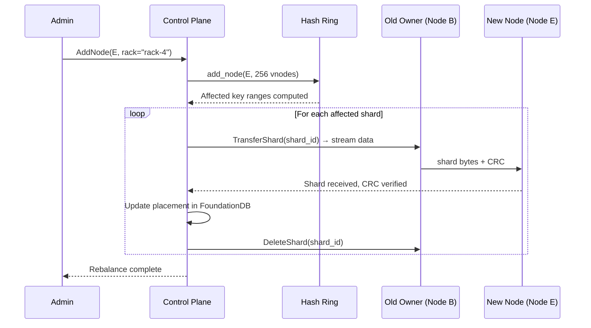

# 2. Data Placement and Consistent Hashing 🟡

> **The Problem:** You have 1,000 storage nodes and a client wants to `GET /bucket/image.jpg`. Which node(s) hold the shards? A naive approach—querying the metadata store for every single read—adds a network round-trip and makes the metadata store a throughput bottleneck. We need a **deterministic** function that both the API server and any node can evaluate locally: `f(object_key) → set of nodes`. And when we add or remove nodes, we need to move the *minimum* number of shards.

---

## Why Naive Hashing Fails

The simplest approach is modular hashing:

```
node = hash(key) % num_nodes
```

This works until you change `num_nodes`. Adding a single node remaps almost every key:

| Object Key | `hash(key)` | `% 4 nodes` | `% 5 nodes` | Moved? |
|---|---|---|---|---|
| `photo_001.jpg` | 7 | **3** | **2** | ✅ Yes |
| `photo_002.jpg` | 12 | **0** | **2** | ✅ Yes |
| `photo_003.jpg` | 15 | **3** | **0** | ✅ Yes |
| `photo_004.jpg` | 20 | **0** | **0** | ❌ No |
| `photo_005.jpg` | 25 | **1** | **0** | ✅ Yes |

**Result:** Adding 1 node to a 4-node cluster moves **~75%** of all data. At petabyte scale, that's hundreds of terabytes of unnecessary data migration saturating the network for days.

---

## Consistent Hashing: The Core Idea

Consistent hashing maps both **nodes** and **keys** onto the same circular hash space (typically `0..2^64`). To find which node owns a key:

1. Hash the key onto the ring.
2. Walk clockwise until you hit the first node.



When **Node C is removed**, only the keys between B and C need to move (they now land on D). When **Node E is added** between B and C, only the keys between B and E move to E. Everything else stays put.

| Operation | Naive `% N` | Consistent Hashing |
|---|---|---|
| Add 1 node to 100-node cluster | ~99% keys move | ~1% keys move |
| Remove 1 node from 100-node cluster | ~99% keys move | ~1% keys move |
| Deterministic (no central lookup) | ✅ | ✅ |

---

## The Virtual Node Problem

Plain consistent hashing with one point per physical node creates **uneven load distribution**. If you have 4 nodes, their random positions on the ring create arcs of wildly different sizes—one node might own 40% of the keyspace while another owns 10%.

**Solution: Virtual Nodes (vnodes).** Each physical node places **many points** on the ring (e.g., 256 vnodes per physical node). The law of large numbers ensures the load converges toward uniform.



With 256 vnodes per physical node and 100 physical nodes, you have 25,600 points on the ring. Standard deviation of load per node drops from ~50% (1 point) to ~3% (256 points).

### Load Balance vs. Virtual Node Count

| Vnodes per Node | Std Dev of Load (100 nodes) | Memory per Ring |
|---|---|---|
| 1 | ~50% | 100 × 16 B = 1.6 KB |
| 32 | ~10% | 3,200 × 16 B = 50 KB |
| 128 | ~5% | 12,800 × 16 B = 200 KB |
| 256 | ~3% | 25,600 × 16 B = 400 KB |
| 512 | ~2% | 51,200 × 16 B = 800 KB |

Even at 512 vnodes, the entire ring fits in L2 cache. The memory cost is negligible.

---

## Rust Implementation: The Hash Ring

### Data Structures

```rust,ignore
use std::collections::BTreeMap;
use std::hash::{Hash, Hasher};

/// A physical storage node in the cluster.
#[derive(Debug, Clone, PartialEq, Eq, Hash)]
struct PhysicalNode {
    id: u32,
    address: String,
    /// Rack/zone for failure-domain-aware placement.
    failure_domain: String,
}

/// A point on the consistent hash ring.
#[derive(Debug, Clone)]
struct VirtualNode {
    physical: PhysicalNode,
    vnode_index: u16,
}

/// The consistent hash ring.
struct HashRing {
    /// Sorted map of ring position → virtual node.
    ring: BTreeMap<u64, VirtualNode>,
    /// Number of virtual nodes per physical node.
    vnodes_per_node: u16,
}
```

### Hashing Function

We use `xxhash` (xxh3) for speed and excellent distribution. Unlike cryptographic hashes, xxh3 can hash a key in **~5 ns**, fast enough to compute on every request without caching.

```rust,ignore
/// Hash a byte slice to a position on the ring.
fn ring_hash(data: &[u8]) -> u64 {
    xxhash_rust::xxh3::xxh3_64(data)
}

/// Hash a physical node + vnode index to a ring position.
fn vnode_hash(node_id: u32, vnode_index: u16) -> u64 {
    let mut buf = [0u8; 6];
    buf[0..4].copy_from_slice(&node_id.to_le_bytes());
    buf[4..6].copy_from_slice(&vnode_index.to_le_bytes());
    ring_hash(&buf)
}
```

### Ring Operations

```rust,ignore
impl HashRing {
    /// Create an empty ring.
    fn new(vnodes_per_node: u16) -> Self {
        HashRing {
            ring: BTreeMap::new(),
            vnodes_per_node,
        }
    }

    /// Add a physical node to the ring (places `vnodes_per_node` virtual nodes).
    fn add_node(&mut self, node: PhysicalNode) {
        for i in 0..self.vnodes_per_node {
            let pos = vnode_hash(node.id, i);
            self.ring.insert(pos, VirtualNode {
                physical: node.clone(),
                vnode_index: i,
            });
        }
    }

    /// Remove a physical node from the ring.
    fn remove_node(&mut self, node_id: u32) {
        self.ring.retain(|_, vn| vn.physical.id != node_id);
    }

    /// Find the node responsible for a given key.
    /// Walks clockwise from the key's hash position.
    fn lookup(&self, key: &[u8]) -> Option<&PhysicalNode> {
        if self.ring.is_empty() {
            return None;
        }

        let hash = ring_hash(key);

        // Find the first vnode at or after `hash` (clockwise walk).
        // If we wrap past the end, take the first vnode on the ring.
        let node = self
            .ring
            .range(hash..)
            .next()
            .or_else(|| self.ring.iter().next())
            .map(|(_, vn)| &vn.physical);

        node
    }

    /// Find N *distinct physical nodes* for a key (for erasure group placement).
    /// This ensures shards land on different physical machines.
    fn lookup_n(&self, key: &[u8], n: usize) -> Vec<&PhysicalNode> {
        if self.ring.is_empty() {
            return Vec::new();
        }

        let hash = ring_hash(key);
        let mut result = Vec::with_capacity(n);
        let mut seen_ids = std::collections::HashSet::with_capacity(n);

        // Walk clockwise, skipping vnodes that belong to already-selected nodes.
        let iter = self
            .ring
            .range(hash..)
            .chain(self.ring.iter())
            .map(|(_, vn)| &vn.physical);

        for node in iter {
            if seen_ids.insert(node.id) {
                result.push(node);
                if result.len() == n {
                    break;
                }
            }
        }

        result
    }
}
```

---

## Failure-Domain-Aware Placement

Placing 9 shards on 9 *random* nodes is not enough. If 4 of those nodes share the same rack, a single top-of-rack switch failure loses 4 shards—exceeding our 3-shard tolerance.

We need **rack-aware** (or zone-aware) placement: no two shards in the same erasure group should share a failure domain.



**Rule:** For a `k + m` erasure group (k data + m parity), distribute shards across at least `m + 1` distinct failure domains. For 6+3, that's ≥ 4 racks. With 3 shards per rack (across 3 racks), a single rack failure loses at most 3 shards—exactly our tolerance.

### Rack-Aware Lookup

```rust,ignore
impl HashRing {
    /// Find N distinct physical nodes across at least `min_domains` failure domains.
    fn lookup_n_rack_aware(
        &self,
        key: &[u8],
        n: usize,
        min_domains: usize,
    ) -> Option<Vec<&PhysicalNode>> {
        if self.ring.is_empty() {
            return None;
        }

        let hash = ring_hash(key);
        let mut result = Vec::with_capacity(n);
        let mut seen_ids = std::collections::HashSet::with_capacity(n);
        let mut domain_counts: std::collections::HashMap<&str, usize> =
            std::collections::HashMap::new();

        let max_per_domain = (n + min_domains - 1) / min_domains; // ceil(n / min_domains)

        let iter = self
            .ring
            .range(hash..)
            .chain(self.ring.iter())
            .map(|(_, vn)| &vn.physical);

        for node in iter {
            if seen_ids.contains(&node.id) {
                continue;
            }

            let count = domain_counts
                .get(node.failure_domain.as_str())
                .copied()
                .unwrap_or(0);

            // Don't over-pack any single failure domain.
            if count >= max_per_domain {
                continue;
            }

            seen_ids.insert(node.id);
            *domain_counts
                .entry(&node.failure_domain)
                .or_insert(0) += 1;
            result.push(node);

            if result.len() == n {
                break;
            }
        }

        // Verify we hit the minimum domain requirement.
        if domain_counts.len() >= min_domains && result.len() == n {
            Some(result)
        } else {
            None // Cluster too small or too few racks
        }
    }
}
```

---

## Cluster Scaling: Adding and Removing Nodes

### Adding a Node

When a new storage node joins:

1. The control plane adds its vnodes to the ring.
2. For each vnode, the keys that *used to* map to the clockwise successor now map to the new node.
3. A **background rebalancer** migrates the affected shards.



**Key property:** During rebalancing, the old node still serves reads for shards that haven't been transferred yet. There is **no downtime**.

### How Much Data Moves?

With `N` nodes and `V` vnodes per node:

```
Data moved ≈ Total Data / (N + 1)
```

Adding 1 node to a 100-node, 10 PB cluster moves ~100 TB. At 10 Gbps per node, this takes:

```
100 TB / 10 Gbps ≈ 22 hours
```

During this window, the cluster operates at slightly uneven load, which is acceptable.

### Removing a Node (Graceful Decommission)

```rust,ignore
/// Gracefully decommission a node by migrating all its shards.
async fn decommission_node(
    ring: &mut HashRing,
    db: &Database,
    node_id: u32,
) -> Result<(), Box<dyn std::error::Error>> {
    // 1. Mark node as "draining" — no new shards placed here.
    // (Update node status in FoundationDB)

    // 2. For each shard on this node, find the new owner.
    let shards_on_node = list_shards_on_node(db, node_id).await?;

    for shard in &shards_on_node {
        // Temporarily remove this node to find where the shard would go.
        let new_owner = ring
            .lookup(&shard.shard_id)
            .expect("ring should not be empty");

        // 3. Copy shard to new owner.
        transfer_shard(node_id, new_owner.id, &shard.shard_id).await?;

        // 4. Update metadata.
        update_shard_placement(db, &shard.shard_id, node_id, new_owner.id).await?;
    }

    // 5. Remove from ring after all shards migrated.
    ring.remove_node(node_id);

    Ok(())
}
```

---

## Weighted Nodes: Heterogeneous Hardware

Not all storage nodes are equal. A node with 12× 8 TB NVMe drives (96 TB) should hold 4× more data than a node with 4× 6 TB drives (24 TB). We achieve this by assigning **proportional vnode counts**:

```rust,ignore
impl HashRing {
    /// Add a node with a weight proportional to its capacity.
    /// A weight of 1.0 gets `vnodes_per_node` vnodes.
    /// A weight of 4.0 gets `4 × vnodes_per_node` vnodes.
    fn add_node_weighted(&mut self, node: PhysicalNode, weight: f64) {
        let count = (self.vnodes_per_node as f64 * weight).round() as u16;
        for i in 0..count {
            let pos = vnode_hash(node.id, i);
            self.ring.insert(pos, VirtualNode {
                physical: node.clone(),
                vnode_index: i,
            });
        }
    }
}
```

| Node | Drives | Capacity | Weight | Vnodes (base=256) | Expected Load Share |
|---|---|---|---|---|---|
| Node A | 12 × 8 TB | 96 TB | 4.0 | 1024 | ~40% |
| Node B | 4 × 6 TB | 24 TB | 1.0 | 256 | ~10% |
| Node C | 8 × 8 TB | 64 TB | 2.67 | 683 | ~27% |
| Node D | 6 × 10 TB | 60 TB | 2.5 | 640 | ~23% |

---

## Putting It All Together: The Erasure Group Selector

The API server (from Chapter 1) uses the hash ring to select the **9 nodes** forming the erasure group for a `PUT`:

```rust,ignore
/// The cluster map holds the hash ring and can select erasure groups.
struct ClusterMap {
    ring: HashRing,
}

/// An erasure group: the set of nodes that will store one object's shards.
struct ErasureGroup {
    id: u64,
    node_ids: Vec<u32>,
}

impl ClusterMap {
    /// Select a 6+3 erasure group for the given object key.
    fn select_erasure_group(&self, bucket: &str, key: &str) -> ErasureGroup {
        // Combine bucket + key for the hash input.
        let mut hash_input = Vec::with_capacity(bucket.len() + key.len() + 1);
        hash_input.extend_from_slice(bucket.as_bytes());
        hash_input.push(0x00); // separator
        hash_input.extend_from_slice(key.as_bytes());

        // Total shards: 6 data + 3 parity = 9
        const TOTAL_SHARDS: usize = 9;
        const MIN_FAILURE_DOMAINS: usize = 4; // survive loss of any 1 rack

        let nodes = self
            .ring
            .lookup_n_rack_aware(&hash_input, TOTAL_SHARDS, MIN_FAILURE_DOMAINS)
            .expect("Not enough nodes/racks in the cluster");

        let group_id = ring_hash(&hash_input);

        ErasureGroup {
            id: group_id,
            node_ids: nodes.iter().map(|n| n.id).collect(),
        }
    }
}
```

---

## Comparison: Consistent Hashing vs. Alternatives

| Strategy | Data Movement on Scale | Central Lookup | Failure Locality | Complexity |
|---|---|---|---|---|
| `hash % N` | ~100% remapped | No | Poor | Trivial |
| Consistent Hashing (basic) | ~1/N | No | Moderate | Low |
| Consistent Hashing + vnodes | ~1/N, even distribution | No | Good (rack-aware) | Medium |
| CRUSH (Ceph) | ~1/N, weighted | No | Excellent (topology tree) | High |
| Central placement table | 0% (manual) | **Yes** — single point of failure | Manual | Low |

Our implementation sits at the **vnodes + rack-aware** level, which is the sweet spot for an object store: deterministic placement, no central bottleneck, and failure-domain safety—without the full complexity of CRUSH's recursive descent tree.

---

> **Key Takeaways**
>
> 1. **Never use `hash % N`** for distributed data placement. Adding or removing a single node reshuffles nearly all data.
> 2. **Consistent hashing** maps both keys and nodes onto a ring. Only `~1/N` of data moves when the cluster changes.
> 3. **Virtual nodes** (256+ per physical node) smooth out load imbalance to within ~3% standard deviation. The entire ring fits in CPU cache.
> 4. **Rack-aware placement** is non-negotiable. An erasure group with `m` parity shards must span at least `m + 1` failure domains to survive a full rack failure.
> 5. **Weighted vnodes** handle heterogeneous hardware—a node with 4× the disk capacity gets 4× the vnodes and 4× the data.
> 6. **Rebalancing is gradual and online.** The old node serves reads until migration completes. There is zero downtime.
