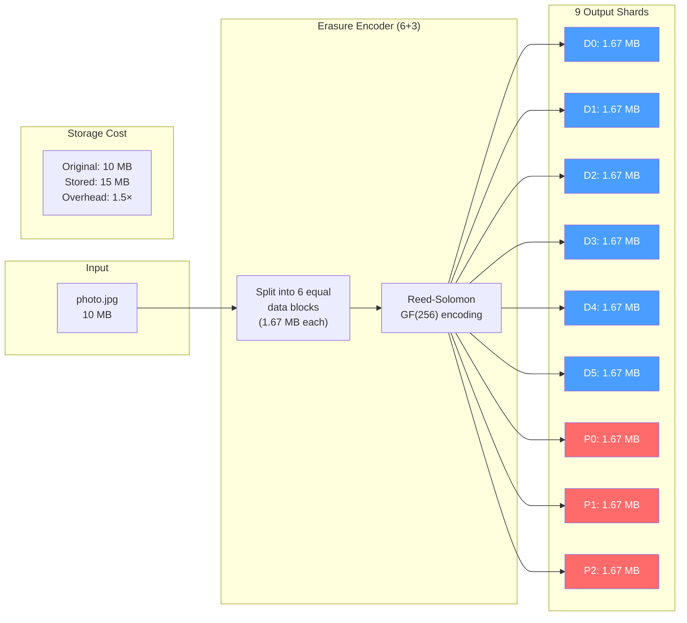
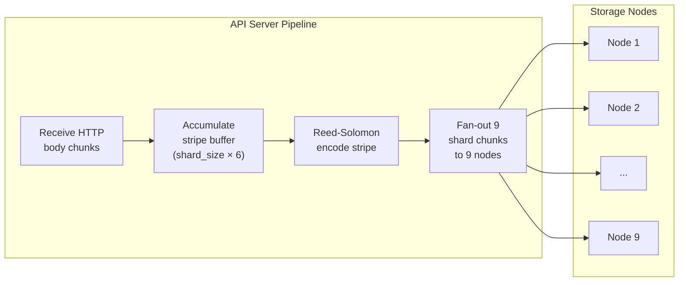

# 3. Erasure Coding (Reed-Solomon) 🔴

> **The Problem:** To survive disk and node failures, we must store redundant data. The naive approach—**3× replication**—stores three complete copies of every object. At 1 exabyte of user data, that requires 3 exabytes of raw storage. At $20/TB/year for NVMe, the annual storage cost alone is **$60 million**. Reed-Solomon erasure coding achieves the same (or better) fault tolerance at **1.5×** overhead, cutting the bill to **$30 million**. The math is not optional at this scale.

---

## Replication vs. Erasure Coding

| Property | 3× Replication | Reed-Solomon 6+3 |
|---|---|---|
| Storage overhead | 3.0× | 1.5× (9 shards / 6 data) |
| Tolerated failures | 2 (need 1 surviving copy) | 3 (any 3 of 9 shards) |
| Write amplification | 3× (3 full copies) | 1.5× (9 smaller shards) |
| Repair I/O | Copy 1 full object | Read 6 shards, reconstruct 1 |
| Read in happy path | Read 1 copy | Read 6 shards (or 1 for small obj) |
| CPU cost | None | Galois Field arithmetic |
| Complexity | Trivial | Moderate |
| Cost at 1 EB | $60M/year | $30M/year |

**Key insight:** Erasure coding *trades CPU for storage*. At modern CPU speeds, Galois Field multiplication using SIMD is so fast (~10 GB/s per core) that the CPU cost is negligible compared to the disk and network savings.

---

## Reed-Solomon: The Math (Simplified)

Reed-Solomon coding operates over a **Galois Field** (GF(2⁸) = GF(256)). Think of it as arithmetic where every number fits in one byte and division always produces an exact result (no remainders, no floating point).

### The Encoding Matrix

Given `k` data shards and `m` parity shards (total `n = k + m`), we construct an `n × k` **encoding matrix** where:

- The top `k × k` block is the identity matrix (data shards pass through unchanged).
- The bottom `m × k` block is a Cauchy or Vandermonde matrix (generates parity).

```
Encoding Matrix (6+3 = 9×6):

┌                     ┐   ┌     ┐     ┌     ┐
│ 1  0  0  0  0  0    │   │ D0  │     │ D0  │  ← Data shard 0 (unchanged)
│ 0  1  0  0  0  0    │   │ D1  │     │ D1  │  ← Data shard 1 (unchanged)
│ 0  0  1  0  0  0    │   │ D2  │     │ D2  │  ← Data shard 2 (unchanged)
│ 0  0  0  1  0  0    │ × │ D3  │  =  │ D3  │  ← Data shard 3 (unchanged)
│ 0  0  0  0  1  0    │   │ D4  │     │ D4  │  ← Data shard 4 (unchanged)
│ 0  0  0  0  0  1    │   │ D5  │     │ D5  │  ← Data shard 5 (unchanged)
│ a  b  c  d  e  f    │   └     ┘     │ P0  │  ← Parity shard 0
│ g  h  i  j  k  l    │              │ P1  │  ← Parity shard 1
│ m  n  o  p  q  r    │              │ P2  │  ← Parity shard 2
└                     ┘              └     ┘
```

Each letter (`a`, `b`, ... `r`) is an element of GF(256). The specific values come from a **Cauchy matrix** which guarantees that any `k × k` sub-matrix (any 6 rows out of 9) is invertible.

### Why Any 6 of 9 Works

To **reconstruct** the original data from any 6 surviving shards:

1. Take the 6 rows of the encoding matrix corresponding to the surviving shards.
2. This gives a `6 × 6` sub-matrix.
3. Because the Cauchy matrix is **MDS (Maximum Distance Separable)**, this sub-matrix is always invertible.
4. Multiply the inverse by the 6 surviving shard vectors to recover all 6 data shards.

This is why we can lose **any 3** of 9 shards and still recover the original file.

---

## The Shard Split: A 10 MB File Example



**Shard size calculation:**

```
Original file:   10,000,000 bytes
Data shards (k): 6
Shard size:      ceil(10,000,000 / 6) = 1,666,667 bytes
Padding:         2 bytes (to make divisible by 6)
Total stored:    9 × 1,666,667 = 15,000,003 bytes
Overhead:        15,000,003 / 10,000,000 = 1.5×
```

---

## Rust Implementation: Encoding and Decoding

We use the `reed-solomon-erasure` crate, which provides a SIMD-optimized GF(256) implementation and handles the matrix algebra internally.

### Encoding

```rust,ignore
use reed_solomon_erasure::galois_8::ReedSolomon;

const DATA_SHARDS: usize = 6;
const PARITY_SHARDS: usize = 3;
const TOTAL_SHARDS: usize = DATA_SHARDS + PARITY_SHARDS;

/// Split a file into DATA_SHARDS data shards + PARITY_SHARDS parity shards.
///
/// Returns a Vec of TOTAL_SHARDS byte vectors, each of equal length.
fn erasure_encode(data: &[u8]) -> Result<Vec<Vec<u8>>, Box<dyn std::error::Error>> {
    let rs = ReedSolomon::new(DATA_SHARDS, PARITY_SHARDS)?;

    // Calculate shard size (pad to be evenly divisible).
    let shard_size = (data.len() + DATA_SHARDS - 1) / DATA_SHARDS;

    // Create shard buffers.
    let mut shards: Vec<Vec<u8>> = Vec::with_capacity(TOTAL_SHARDS);

    // Fill data shards.
    for i in 0..DATA_SHARDS {
        let start = i * shard_size;
        let end = std::cmp::min(start + shard_size, data.len());
        let mut shard = vec![0u8; shard_size];
        if start < data.len() {
            let copy_len = end - start;
            shard[..copy_len].copy_from_slice(&data[start..end]);
        }
        // Remaining bytes are zero-padded.
        shards.push(shard);
    }

    // Add empty parity shards (Reed-Solomon will fill them).
    for _ in 0..PARITY_SHARDS {
        shards.push(vec![0u8; shard_size]);
    }

    // Encode: fills parity shards using Galois Field arithmetic.
    rs.encode(&mut shards)?;

    Ok(shards)
}
```

### Decoding (Reconstruction)

```rust,ignore
/// Reconstruct the original data from any DATA_SHARDS surviving shards.
///
/// `shards` must have TOTAL_SHARDS entries. Missing shards are `None`.
/// At least DATA_SHARDS entries must be `Some`.
fn erasure_decode(
    shards: &mut Vec<Option<Vec<u8>>>,
    original_size: usize,
) -> Result<Vec<u8>, Box<dyn std::error::Error>> {
    let rs = ReedSolomon::new(DATA_SHARDS, PARITY_SHARDS)?;

    // Count available shards.
    let available = shards.iter().filter(|s| s.is_some()).count();
    if available < DATA_SHARDS {
        return Err(format!(
            "Need at least {DATA_SHARDS} shards, only {available} available"
        )
        .into());
    }

    // Reconstruct missing shards.
    rs.reconstruct(shards)?;

    // Concatenate data shards and truncate to original size.
    let mut result = Vec::with_capacity(original_size);
    for shard in shards.iter().take(DATA_SHARDS) {
        if let Some(data) = shard {
            result.extend_from_slice(data);
        }
    }
    result.truncate(original_size);

    Ok(result)
}
```

### Complete Encode/Decode Example

```rust,ignore
fn example_encode_decode() -> Result<(), Box<dyn std::error::Error>> {
    // --- ENCODE ---
    let original = b"Hello, Exabyte-Scale Object Store! This is our test data.";
    println!("Original ({} bytes): {:?}", original.len(), 
             String::from_utf8_lossy(original));

    let shards = erasure_encode(original)?;
    println!("\nEncoded into {} shards of {} bytes each:",
             shards.len(), shards[0].len());
    for (i, shard) in shards.iter().enumerate() {
        let label = if i < DATA_SHARDS { "DATA" } else { "PARITY" };
        println!("  Shard {i} ({label}): {:02x}{:02x}{:02x}{:02x}...",
                 shard[0], shard[1], shard[2], shard[3]);
    }

    // --- SIMULATE FAILURE: Lose shards 1, 4, and 7 (2 data + 1 parity) ---
    let mut recovery: Vec<Option<Vec<u8>>> = shards.into_iter().map(Some).collect();
    recovery[1] = None; // Lost data shard 1
    recovery[4] = None; // Lost data shard 4
    recovery[7] = None; // Lost parity shard 1

    println!("\nSimulated loss of shards 1, 4, 7 (2 data + 1 parity)");
    println!("Remaining shards: {}/{}",
             recovery.iter().filter(|s| s.is_some()).count(),
             TOTAL_SHARDS);

    // --- DECODE ---
    let recovered = erasure_decode(&mut recovery, original.len())?;
    println!("\nRecovered ({} bytes): {:?}",
             recovered.len(), String::from_utf8_lossy(&recovered));

    assert_eq!(original.as_slice(), recovered.as_slice());
    println!("✅ Original and recovered data match!");

    Ok(())
}
```

---

## Performance: SIMD-Accelerated Galois Field Arithmetic

Reed-Solomon encoding is CPU-bound. The core operation is **Galois Field matrix-vector multiplication**: for each byte of each parity shard, we multiply and XOR across all data shards.

Modern implementations use **SSSE3/AVX2** lookup tables to compute GF(256) multiplication 32 bytes at a time:

```
GF multiply (scalar):     1 byte/cycle  →  ~3 GB/s at 3 GHz
GF multiply (SSSE3):     16 bytes/cycle  → ~48 GB/s
GF multiply (AVX2):      32 bytes/cycle  → ~96 GB/s
```

### Benchmark: Encoding Throughput

| Data Size | Encoding (6+3) | Throughput | CPU Cores |
|---|---|---|---|
| 1 MB | 0.05 ms | 20 GB/s | 1 (AVX2) |
| 10 MB | 0.5 ms | 20 GB/s | 1 (AVX2) |
| 100 MB | 5 ms | 20 GB/s | 1 (AVX2) |
| 1 GB | 50 ms | 20 GB/s | 1 (AVX2) |
| 1 GB (parallel) | 7 ms | 140 GB/s | 8 (AVX2) |

At 20 GB/s single-core encoding, the CPU is **never the bottleneck**. A single NVMe SSD writes at ~3 GB/s, and 10 GbE network delivers ~1.2 GB/s. Erasure coding adds negligible latency to the PUT path.

---

## The Encoding Pipeline on the API Server

In production, the API server does not buffer the entire object in memory before encoding. It operates in a **streaming pipeline**:



### Stripe-Based Streaming Encoder

```rust,ignore
use bytes::BytesMut;
use tokio::sync::mpsc;

/// Configures the streaming encoder.
const STRIPE_SIZE: usize = 1024 * 1024; // 1 MB stripe
const SHARD_CHUNK: usize = STRIPE_SIZE / DATA_SHARDS; // ~170 KB per shard per stripe

/// A channel sender for each of the 9 storage nodes.
type ShardSender = mpsc::Sender<Vec<u8>>;

/// Streaming encoder that processes the input in fixed-size stripes.
struct StreamingEncoder {
    rs: ReedSolomon,
    buffer: BytesMut,
    shard_senders: Vec<ShardSender>,
    total_bytes: usize,
}

impl StreamingEncoder {
    fn new(shard_senders: Vec<ShardSender>) -> Result<Self, Box<dyn std::error::Error>> {
        Ok(StreamingEncoder {
            rs: ReedSolomon::new(DATA_SHARDS, PARITY_SHARDS)?,
            buffer: BytesMut::with_capacity(STRIPE_SIZE),
            shard_senders,
            total_bytes: 0,
        })
    }

    /// Feed a chunk of the incoming HTTP body.
    async fn feed(&mut self, chunk: &[u8]) -> Result<(), Box<dyn std::error::Error>> {
        self.buffer.extend_from_slice(chunk);
        self.total_bytes += chunk.len();

        // Process complete stripes.
        while self.buffer.len() >= STRIPE_SIZE {
            let stripe = self.buffer.split_to(STRIPE_SIZE);
            self.encode_and_send_stripe(&stripe).await?;
        }

        Ok(())
    }

    /// Flush any remaining bytes as a final (possibly smaller) stripe.
    async fn finish(&mut self) -> Result<(), Box<dyn std::error::Error>> {
        if !self.buffer.is_empty() {
            // Pad to be divisible by DATA_SHARDS.
            let remainder = self.buffer.len() % DATA_SHARDS;
            if remainder != 0 {
                let padding = DATA_SHARDS - remainder;
                self.buffer.extend_from_slice(&vec![0u8; padding]);
            }
            let stripe = self.buffer.split();
            self.encode_and_send_stripe(&stripe).await?;
        }
        Ok(())
    }

    /// Encode one stripe and send shard chunks to storage nodes.
    async fn encode_and_send_stripe(
        &self,
        stripe: &[u8],
    ) -> Result<(), Box<dyn std::error::Error>> {
        let shard_size = stripe.len() / DATA_SHARDS;

        // Build shard slices.
        let mut shards: Vec<Vec<u8>> = Vec::with_capacity(TOTAL_SHARDS);
        for i in 0..DATA_SHARDS {
            shards.push(stripe[i * shard_size..(i + 1) * shard_size].to_vec());
        }
        for _ in 0..PARITY_SHARDS {
            shards.push(vec![0u8; shard_size]);
        }

        // Encode parity.
        self.rs.encode(&mut shards)?;

        // Send each shard chunk to its designated storage node.
        for (i, shard_data) in shards.into_iter().enumerate() {
            self.shard_senders[i].send(shard_data).await?;
        }

        Ok(())
    }
}
```

---

## Reconstruction: Handling Failures During GET

When the API server reads an object and one or more data shards are unavailable (node down, CRC mismatch), it transparently fetches parity shards and reconstructs:

```rust,ignore
/// Fetch an object, tolerating up to PARITY_SHARDS failures.
async fn get_object_with_recovery(
    meta: &ObjectMeta,
    cluster: &ClusterMap,
) -> Result<Vec<u8>, Box<dyn std::error::Error>> {
    let rs = ReedSolomon::new(DATA_SHARDS, PARITY_SHARDS)?;

    // Attempt to fetch all 9 shards in parallel.
    let mut shard_results: Vec<Option<Vec<u8>>> = vec![None; TOTAL_SHARDS];
    let mut tasks = Vec::with_capacity(TOTAL_SHARDS);

    for (i, (node_id, _shard_idx)) in meta.shard_placements.iter().enumerate() {
        let node = cluster.get_node(*node_id).clone();
        let shard_id = compute_shard_id(&meta.bucket, &meta.key, i);
        tasks.push(tokio::spawn(async move {
            (i, node.read_shard(&shard_id).await)
        }));
    }

    let mut failures = 0;
    for task in tasks {
        let (idx, result) = task.await?;
        match result {
            Ok(data) => shard_results[idx] = Some(data),
            Err(e) => {
                eprintln!("Shard {idx} unavailable: {e}");
                failures += 1;
            }
        }
    }

    if failures > PARITY_SHARDS {
        return Err(format!(
            "Too many failures: {failures} shards lost, max tolerable is {PARITY_SHARDS}"
        ).into());
    }

    if failures == 0 {
        // Happy path: all data shards available, no reconstruction needed.
        let mut result = Vec::with_capacity(meta.size_bytes as usize);
        for shard in shard_results.iter().take(DATA_SHARDS) {
            if let Some(data) = shard {
                result.extend_from_slice(data);
            }
        }
        result.truncate(meta.size_bytes as usize);
        return Ok(result);
    }

    // Degraded path: reconstruct missing shards.
    rs.reconstruct(&mut shard_results)?;

    let mut result = Vec::with_capacity(meta.size_bytes as usize);
    for shard in shard_results.iter().take(DATA_SHARDS) {
        if let Some(data) = shard {
            result.extend_from_slice(data);
        }
    }
    result.truncate(meta.size_bytes as usize);

    Ok(result)
}

/// Compute the shard ID from (bucket, key, shard_index).
fn compute_shard_id(bucket: &str, key: &str, shard_index: usize) -> [u8; 32] {
    use sha2::{Sha256, Digest};
    let mut h = Sha256::new();
    h.update(bucket.as_bytes());
    h.update(key.as_bytes());
    h.update(&[shard_index as u8]);
    let result = h.finalize();
    let mut id = [0u8; 32];
    id.copy_from_slice(&result);
    id
}
```

---

## Choosing k and m: Trade-offs

The choice of `k` (data shards) and `m` (parity shards) is a fundamental architecture decision:

| Scheme | k | m | Overhead | Tolerated Failures | Read Fan-Out | Repair Cost |
|---|---|---|---|---|---|---|
| 3× Replication | 1 | 2 | 3.00× | 2 | 1 | Copy 1 full object |
| RS(4,2) | 4 | 2 | 1.50× | 2 | 4 | Read 4 shards |
| **RS(6,3)** | **6** | **3** | **1.50×** | **3** | **6** | **Read 6 shards** |
| RS(10,4) | 10 | 4 | 1.40× | 4 | 10 | Read 10 shards |
| RS(16,4) | 16 | 4 | 1.25× | 4 | 16 | Read 16 shards |

**Trade-offs as you increase k:**

- **Lower overhead** (cheaper storage).
- **Higher read fan-out** (more network connections per GET).
- **Higher repair cost** (more shards to read for reconstruction).
- **Higher tail latency** (p99 GET depends on the slowest of k nodes).

**Our choice of RS(6,3):**

- 1.5× overhead is the sweet spot for most object stores.
- 3-failure tolerance handles rack-level failures.
- 6-shard read fan-out is manageable with async I/O.
- Industry standard: Azure Storage, Google Colossus, and Facebook f4 use similar schemes.

---

## Durability Mathematics: The 11-Nines Claim

With RS(6,3) across 9 independent nodes, what is the probability of data loss?

**Assumptions:**
- Annual disk failure rate (AFR): 2% per node
- Mean time to repair (MTTR): 4 hours
- Shards distributed across independent failure domains

**Probability calculation:**

The object is lost only if 4+ of 9 shards fail simultaneously (before repair):

```
P(single shard unavailable during MTTR) = AFR × (MTTR / 8760 hours)
                                        = 0.02 × (4 / 8760)
                                        = 9.13 × 10⁻⁶

P(4+ of 9 shards fail) = C(9,4) × p⁴ × (1-p)⁵
                        = 126 × (9.13 × 10⁻⁶)⁴ × (0.999991)⁵
                        ≈ 8.8 × 10⁻¹⁹
```

That's approximately **18 nines of durability**—far exceeding the 11-nines target. Even with correlated failures (e.g., a power event taking out an entire rack), the rack-aware placement from Chapter 2 ensures at most 3 shards share a failure domain, staying within the 3-shard tolerance.

---

> **Key Takeaways**
>
> 1. **3× replication is prohibitively expensive at exabyte scale.** RS(6,3) achieves better fault tolerance (3 vs. 2 failures) at half the storage cost (1.5× vs. 3.0×).
> 2. **Reed-Solomon operates over GF(256).** Any `k` of `n = k + m` shards can reconstruct the original data because every `k × k` sub-matrix of the encoding matrix is invertible.
> 3. **SIMD makes erasure coding essentially free.** AVX2-accelerated GF multiplication runs at ~20 GB/s per core—faster than any single NVMe SSD.
> 4. **Stream, don't buffer.** The API server processes data in 1 MB stripes, encoding and fanning out to 9 nodes in parallel. It never holds the entire object in memory.
> 5. **Degraded reads are transparent.** If a data shard is unavailable, the API server fetches a parity shard and reconstructs on the fly. The client never knows.
> 6. **RS(6,3) across independent failure domains yields ~18 nines of durability**, far exceeding industry-standard 11-nines targets.
