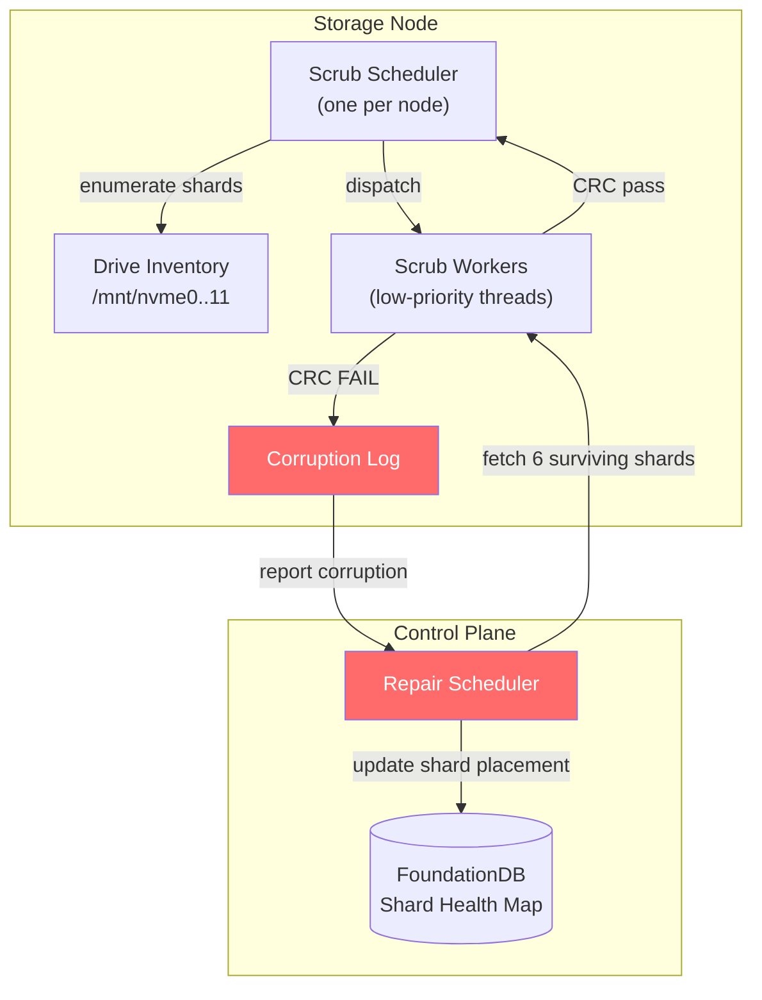
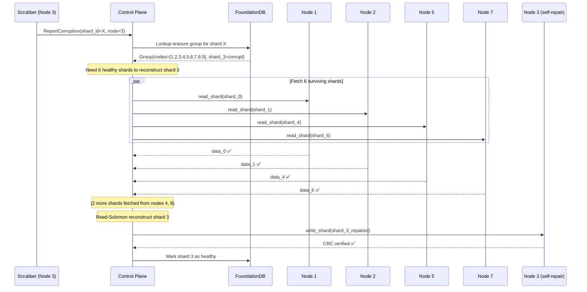
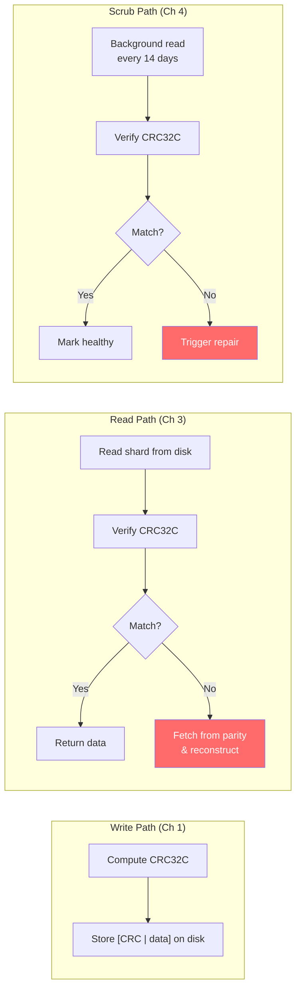

# 4. Bitrot Detection and Background Scrubbing 🔴

> **The Problem:** Hard drives and SSDs silently corrupt data. A single flipped bit in a 10 MB photo is invisible to the storage node—the file still opens, the size is still correct, and no I/O error is raised. Over time, at exabyte scale with millions of drives, silent bitrot is not a possibility—it is a **statistical certainty**. Without proactive detection, a corrupted data shard may sit unnoticed for months until a second failure strikes the same erasure group, making recovery impossible. We need a background process that continuously verifies every byte on every disk and triggers repair before corruption compounds.

---

## How Bitrot Happens

| Cause | Mechanism | Detection |
|---|---|---|
| **Cosmic rays** | High-energy particles flip bits in DRAM and NAND cells | ECC corrects most; some escape |
| **Firmware bugs** | Drive writes correct data to wrong sector (misdirected write) | CRC mismatch on subsequent read |
| **Media degradation** | NAND cells lose charge over time (read disturb, retention) | Bit errors accumulate beyond ECC threshold |
| **Controller errors** | RAID/HBA silently drops writes or returns stale data | Data looks valid but is outdated |
| **Phantom writes** | Write acknowledged but never actually persisted | Block reads as zeros or previous data |

**Industry data:**
- Google's study (2007): **0.5% of drives** exhibit silent data corruption per year.
- CERN (2007): **1 in 10⁷** sector reads returns corrupt data undetected.
- At 1 million drives storing 1 EB: expect **~5,000 drives** with at least one corrupted sector *per year*.

If each drive has 100,000 shards, that is potentially **500 million shards at risk annually**. The scrubber is not optional.

---

## The Defense: CRC32C on Every Shard

From Chapter 1, every shard written to disk has a **CRC32C checksum** embedded in its header:

```
┌─────────────────────────────────┐
│  crc32c: u32 (4 bytes)          │  ← Written at PUT time
│  shard_data: [u8; shard_size]   │
└─────────────────────────────────┘
```

The scrubber's job is simple: **re-read the shard, recompute the CRC32C, and compare.**

### Why CRC32C?

| Hash | Speed (per core) | Collision Resistance | Hardware Acceleration |
|---|---|---|---|
| CRC32C | ~30 GB/s | 32-bit (1 in 4B) | Intel SSE 4.2 `crc32` instruction |
| xxHash64 | ~20 GB/s | 64-bit | No dedicated instruction |
| SHA-256 | ~1 GB/s | 256-bit | SHA-NI extension (slower) |
| BLAKE3 | ~8 GB/s | 256-bit | AVX2/AVX-512 |

CRC32C is the standard for data integrity because it detects all 1-bit, 2-bit, and most burst errors, and it runs at **memory bandwidth** on modern CPUs via the dedicated `crc32` instruction. SHA-256 is overkill for integrity (we're not defending against adversaries—we're detecting random bit flips).

---

## Scrubber Architecture



### Scrub Cycle Design

The scrubber must read **every shard on every drive** within a configurable cycle (e.g., 14 days). This determines the read bandwidth budget:

```
Example node: 12 NVMe drives × 8 TB each = 96 TB per node
Scrub cycle:  14 days = 1,209,600 seconds
Required throughput: 96 TB / 1,209,600 s ≈ 83 MB/s sustained

NVMe sequential read: ~3,000 MB/s
Scrub bandwidth share: 83 / 3,000 = 2.8% of drive bandwidth
```

At under 3% bandwidth utilization, the scrubber is nearly invisible to production traffic. We enforce this via **I/O priority** and **rate limiting**.

---

## Rust Implementation: The Scrubber

### Core Types

```rust,ignore
use std::path::PathBuf;
use std::time::{Duration, Instant};
use tokio::sync::mpsc;

/// Configuration for the background scrubber.
#[derive(Debug, Clone)]
struct ScrubConfig {
    /// Target duration to scrub all shards on this node.
    cycle_duration: Duration,
    /// Maximum bytes per second to read (to limit I/O impact).
    max_bytes_per_sec: u64,
    /// Number of concurrent scrub workers.
    worker_count: usize,
    /// How long to sleep between shards (for fairness).
    inter_shard_delay: Duration,
}

impl Default for ScrubConfig {
    fn default() -> Self {
        ScrubConfig {
            cycle_duration: Duration::from_secs(14 * 24 * 3600), // 14 days
            max_bytes_per_sec: 100 * 1024 * 1024,                // 100 MB/s
            worker_count: 2,
            inter_shard_delay: Duration::from_millis(1),
        }
    }
}

/// Result of scrubbing a single shard.
#[derive(Debug)]
enum ScrubResult {
    /// Shard is intact.
    Ok { shard_id: [u8; 32], bytes_read: u64 },
    /// Shard is corrupt.
    Corrupt {
        shard_id: [u8; 32],
        expected_crc: u32,
        actual_crc: u32,
    },
    /// Shard file is missing (deleted or failed read).
    Missing { shard_id: [u8; 32], error: String },
}
```

### The CRC32C Verification Function

```rust,ignore
use crc32fast::Hasher;
use tokio::fs;
use tokio::io::AsyncReadExt;

/// Verify a single shard's integrity by recomputing its CRC32C.
///
/// Reads the 4-byte CRC header, then streams the data in chunks
/// to avoid loading the entire shard into memory.
async fn verify_shard(path: &PathBuf) -> std::io::Result<(bool, u32, u32)> {
    let mut file = fs::File::open(path).await?;

    // Read the stored CRC32C from the header.
    let mut crc_buf = [0u8; 4];
    file.read_exact(&mut crc_buf).await?;
    let stored_crc = u32::from_le_bytes(crc_buf);

    // Stream the data and compute the actual CRC32C.
    let mut hasher = Hasher::new();
    let mut buf = vec![0u8; 256 * 1024]; // 256 KB read buffer

    loop {
        let n = file.read(&mut buf).await?;
        if n == 0 {
            break;
        }
        hasher.update(&buf[..n]);
    }

    let actual_crc = hasher.finalize();
    Ok((stored_crc == actual_crc, stored_crc, actual_crc))
}
```

### Rate-Limited Scrub Worker

```rust,ignore
use tokio::time::sleep;

/// A token-bucket rate limiter for scrub I/O.
struct RateLimiter {
    bytes_per_sec: u64,
    tokens: u64,
    last_refill: Instant,
}

impl RateLimiter {
    fn new(bytes_per_sec: u64) -> Self {
        RateLimiter {
            bytes_per_sec,
            tokens: bytes_per_sec, // start with 1 second of tokens
            last_refill: Instant::now(),
        }
    }

    /// Wait until enough tokens are available for `bytes` of I/O.
    async fn acquire(&mut self, bytes: u64) {
        loop {
            // Refill tokens based on elapsed time.
            let elapsed = self.last_refill.elapsed();
            let new_tokens = (elapsed.as_secs_f64() * self.bytes_per_sec as f64) as u64;
            if new_tokens > 0 {
                self.tokens = std::cmp::min(
                    self.tokens + new_tokens,
                    self.bytes_per_sec * 2, // cap at 2 seconds of burst
                );
                self.last_refill = Instant::now();
            }

            if self.tokens >= bytes {
                self.tokens -= bytes;
                return;
            }

            // Not enough tokens — sleep briefly and retry.
            sleep(Duration::from_millis(10)).await;
        }
    }
}
```

### The Scrub Scheduler

```rust,ignore
/// Enumerate all shard files on a drive.
async fn enumerate_shards(drive_path: &PathBuf) -> std::io::Result<Vec<PathBuf>> {
    let shards_dir = drive_path.join("shards");
    let mut shard_paths = Vec::new();

    let mut prefixes = fs::read_dir(&shards_dir).await?;
    while let Some(prefix_entry) = prefixes.next_entry().await? {
        if prefix_entry.file_type().await?.is_dir() {
            let mut files = fs::read_dir(prefix_entry.path()).await?;
            while let Some(file_entry) = files.next_entry().await? {
                if file_entry.file_type().await?.is_file() {
                    let path = file_entry.path();
                    // Skip temp files.
                    if path.extension().is_some_and(|ext| ext == "tmp") {
                        continue;
                    }
                    shard_paths.push(path);
                }
            }
        }
    }

    Ok(shard_paths)
}

/// Run the scrub loop for a single drive.
async fn scrub_drive(
    drive_path: PathBuf,
    config: &ScrubConfig,
    results_tx: mpsc::Sender<ScrubResult>,
) -> std::io::Result<()> {
    let mut limiter = RateLimiter::new(
        config.max_bytes_per_sec / config.worker_count as u64,
    );

    loop {
        let shards = enumerate_shards(&drive_path).await?;
        let total = shards.len();
        let mut checked = 0u64;
        let mut corrupted = 0u64;

        eprintln!(
            "[scrubber] Starting cycle for {}: {} shards",
            drive_path.display(),
            total
        );

        for shard_path in &shards {
            // Get file size for rate limiting.
            let metadata = fs::metadata(shard_path).await?;
            let file_size = metadata.len();

            // Acquire rate limit tokens before reading.
            limiter.acquire(file_size).await;

            // Extract shard_id from filename.
            let shard_id = parse_shard_id_from_path(shard_path);

            match verify_shard(shard_path).await {
                Ok((true, _, _)) => {
                    let _ = results_tx
                        .send(ScrubResult::Ok {
                            shard_id,
                            bytes_read: file_size,
                        })
                        .await;
                }
                Ok((false, expected, actual)) => {
                    corrupted += 1;
                    eprintln!(
                        "[scrubber] CORRUPTION DETECTED: {} (expected CRC {expected:#x}, got {actual:#x})",
                        shard_path.display()
                    );
                    let _ = results_tx
                        .send(ScrubResult::Corrupt {
                            shard_id,
                            expected_crc: expected,
                            actual_crc: actual,
                        })
                        .await;
                }
                Err(e) => {
                    let _ = results_tx
                        .send(ScrubResult::Missing {
                            shard_id,
                            error: e.to_string(),
                        })
                        .await;
                }
            }

            checked += 1;

            // Inter-shard delay for fairness.
            sleep(config.inter_shard_delay).await;
        }

        eprintln!(
            "[scrubber] Cycle complete for {}: {checked}/{total} checked, {corrupted} corrupted",
            drive_path.display()
        );

        // If we finished faster than the target cycle, sleep the remainder.
        // (In practice, the rate limiter handles pacing.)
    }
}

/// Parse a shard ID from its hex-encoded filename.
fn parse_shard_id_from_path(path: &PathBuf) -> [u8; 32] {
    let filename = path
        .file_name()
        .and_then(|f| f.to_str())
        .unwrap_or("");
    let mut id = [0u8; 32];
    if let Ok(bytes) = hex::decode(filename) {
        if bytes.len() == 32 {
            id.copy_from_slice(&bytes);
        }
    }
    id
}
```

---

## Repair Pipeline: Reconstructing Corrupted Shards

When the scrubber detects a corrupt shard, the **repair scheduler** on the control plane orchestrates reconstruction:



### Repair Worker

```rust,ignore
use reed_solomon_erasure::galois_8::ReedSolomon;

const DATA_SHARDS: usize = 6;
const PARITY_SHARDS: usize = 3;
const TOTAL_SHARDS: usize = DATA_SHARDS + PARITY_SHARDS;

/// Repair a single corrupt or missing shard in an erasure group.
async fn repair_shard(
    corrupt_shard_index: usize,
    erasure_group_nodes: &[(u32, u8)], // (node_id, shard_index)
    cluster: &ClusterMap,
    bucket: &str,
    key: &str,
) -> Result<Vec<u8>, Box<dyn std::error::Error>> {
    let rs = ReedSolomon::new(DATA_SHARDS, PARITY_SHARDS)?;

    // Fetch all shards except the corrupt one.
    let mut shards: Vec<Option<Vec<u8>>> = vec![None; TOTAL_SHARDS];
    let mut tasks = Vec::new();

    for (i, (node_id, _)) in erasure_group_nodes.iter().enumerate() {
        if i == corrupt_shard_index {
            continue; // Skip the corrupt shard.
        }
        let node = cluster.get_node(*node_id).clone();
        let shard_id = compute_shard_id(bucket, key, i);
        tasks.push(tokio::spawn(async move {
            (i, node.read_shard(&shard_id).await)
        }));
    }

    let mut available = 0;
    for task in tasks {
        let (idx, result) = task.await?;
        match result {
            Ok(data) => {
                shards[idx] = Some(data);
                available += 1;
            }
            Err(e) => {
                eprintln!("Shard {idx} also unavailable during repair: {e}");
            }
        }
    }

    if available < DATA_SHARDS {
        return Err(format!(
            "Cannot repair: only {available} shards available, need {DATA_SHARDS}"
        ).into());
    }

    // Reconstruct the missing shard.
    rs.reconstruct(&mut shards)?;

    let repaired = shards[corrupt_shard_index]
        .take()
        .ok_or("Reconstruction failed to produce shard")?;

    // Write the repaired shard back to the node.
    let (node_id, _) = erasure_group_nodes[corrupt_shard_index];
    let node = cluster.get_node(node_id);
    let shard_id = compute_shard_id(bucket, key, corrupt_shard_index);
    node.write_shard(&shard_id, &repaired).await?;

    Ok(repaired)
}
```

---

## Repair Prioritization

Not all repairs are equally urgent. The repair scheduler uses a **priority queue** based on the number of surviving shards in each erasure group:

| Surviving Shards | Urgency | Priority | SLA |
|---|---|---|---|
| 9/9 | Healthy | — | — |
| 8/9 | Low | P3 | Repair within 7 days |
| 7/9 | Medium | P2 | Repair within 24 hours |
| 6/9 | **Critical** | **P1** | **Repair within 1 hour** |
| 5/9 or fewer | **DATA AT RISK** | **P0** | **Immediate** — halt other repairs |

```rust,ignore
/// Priority queue entry for the repair scheduler.
#[derive(Debug, Clone, PartialEq, Eq)]
struct RepairTask {
    /// Lower = higher priority.
    priority: u8,
    /// The erasure group needing repair.
    erasure_group_id: u64,
    /// Which shard indices are corrupt/missing.
    corrupt_shards: Vec<usize>,
    /// Object reference for fetching metadata.
    bucket: String,
    key: String,
}

impl Ord for RepairTask {
    fn cmp(&self, other: &Self) -> std::cmp::Ordering {
        // Lower priority number = higher urgency = should come first.
        other.priority.cmp(&self.priority)
    }
}

impl PartialOrd for RepairTask {
    fn partial_cmp(&self, other: &Self) -> Option<std::cmp::Ordering> {
        Some(self.cmp(other))
    }
}

/// Compute repair priority based on surviving shard count.
fn compute_priority(total_shards: usize, surviving: usize) -> u8 {
    let lost = total_shards - surviving;
    match lost {
        0 => 255,       // healthy, no repair needed
        1 => 3,         // P3: comfortable margin
        2 => 2,         // P2: getting thin
        3 => 1,         // P1: at the limit — any further loss = data loss
        _ => 0,         // P0: EMERGENCY — below minimum
    }
}
```

---

## Scrub Metrics and Observability

The scrubber must expose metrics for monitoring dashboards and alerting:

```rust,ignore
use std::sync::atomic::{AtomicU64, Ordering};

/// Scrubber metrics exposed via Prometheus endpoint.
struct ScrubMetrics {
    /// Total shards verified since node start.
    shards_verified: AtomicU64,
    /// Total bytes read by the scrubber.
    bytes_scanned: AtomicU64,
    /// Number of corrupt shards detected.
    corruptions_detected: AtomicU64,
    /// Number of shards successfully repaired.
    repairs_completed: AtomicU64,
    /// Number of repair failures (not enough surviving shards).
    repair_failures: AtomicU64,
    /// Timestamp of last completed full scrub cycle.
    last_cycle_completed_epoch: AtomicU64,
}

impl ScrubMetrics {
    fn new() -> Self {
        ScrubMetrics {
            shards_verified: AtomicU64::new(0),
            bytes_scanned: AtomicU64::new(0),
            corruptions_detected: AtomicU64::new(0),
            repairs_completed: AtomicU64::new(0),
            repair_failures: AtomicU64::new(0),
            last_cycle_completed_epoch: AtomicU64::new(0),
        }
    }

    fn record_verification(&self, bytes: u64) {
        self.shards_verified.fetch_add(1, Ordering::Relaxed);
        self.bytes_scanned.fetch_add(bytes, Ordering::Relaxed);
    }

    fn record_corruption(&self) {
        self.corruptions_detected.fetch_add(1, Ordering::Relaxed);
    }

    fn record_repair(&self, success: bool) {
        if success {
            self.repairs_completed.fetch_add(1, Ordering::Relaxed);
        } else {
            self.repair_failures.fetch_add(1, Ordering::Relaxed);
        }
    }
}
```

### Alerting Rules

| Metric | Condition | Severity |
|---|---|---|
| `corruptions_detected` rate | > 10/hour on single node | **Warning** — possible bad drive |
| `corruptions_detected` rate | > 100/hour on single node | **Critical** — drive failing, decommission |
| `repair_failures` | > 0 | **Critical** — data at risk |
| `last_cycle_completed_epoch` | > 21 days ago | **Warning** — scrubber falling behind |
| Sum of P0 repair tasks cluster-wide | > 0 | **Page on-call immediately** |

---

## Interaction with Other Subsystems

### Scrubber vs. Production I/O

The scrubber must not starve production `GET`/`PUT` traffic. We achieve this via:

1. **Linux I/O priority:** Scrub reads use `ionice -c3` (idle class). The kernel scheduler only services scrub I/O when the drive has spare bandwidth.
2. **Rate limiter:** The token-bucket from above caps scrub throughput explicitly.
3. **Backoff on load:** The scrubber monitors drive queue depth. If the queue exceeds a threshold (e.g., 32 outstanding I/Os), the scrubber pauses.

```rust,ignore
/// Check if the drive is too busy for scrubbing.
async fn drive_is_busy(drive_path: &PathBuf) -> bool {
    // Read /sys/block/<dev>/stat for queue depth.
    // Field 9 (inflight) gives the number of I/Os currently in the driver.
    let dev_name = drive_path
        .file_name()
        .and_then(|f| f.to_str())
        .unwrap_or("nvme0n1");

    let stat_path = format!("/sys/block/{dev_name}/stat");
    if let Ok(stat) = fs::read_to_string(&stat_path).await {
        let fields: Vec<&str> = stat.split_whitespace().collect();
        if fields.len() > 8 {
            if let Ok(inflight) = fields[8].parse::<u64>() {
                return inflight > 32;
            }
        }
    }
    false // If we can't read stats, assume not busy.
}
```

### Scrubber vs. Rebalancer

When the cluster rebalances (Chapter 2), shards are migrating between nodes. The scrubber must:

- **Skip shards marked as "migrating"** — they're about to move, so verifying them is wasted work.
- **Immediately scrub newly received shards** — verify the transfer was error-free.

### Scrubber vs. Garbage Collection

Deleted objects leave behind orphaned shards (after a tombstone grace period). The scrubber doubles as a **garbage collector**: if it encounters a shard file whose ID is not in the metadata store, it queues it for deletion after a safety delay.

---

## End-to-End Bitrot Defense



**Triple defense:**
1. **Write-time:** CRC32C embedded in every shard header.
2. **Read-time:** CRC verified on every `GET`. Corrupt shards trigger transparent reconstruction.
3. **Background:** Scrubber catches corruption before the next failure compounds it.

---

> **Key Takeaways**
>
> 1. **Silent data corruption is a statistical certainty at scale.** ~0.5% of drives per year exhibit bitrot. At exabyte scale, thousands of shards are at risk.
> 2. **CRC32C is the right checksum for data integrity.** It runs at 30 GB/s on modern CPUs via dedicated hardware instructions, with sufficient collision resistance for random bit flips.
> 3. **The scrubber is a low-priority background daemon** that reads every shard on every drive within a 14-day cycle, consuming less than 3% of drive bandwidth.
> 4. **Rate limiting and I/O priority** ensure the scrubber never starves production traffic. Back off when drives are busy.
> 5. **Repair is prioritized by urgency.** An erasure group with only 6/9 surviving shards (at the failure threshold) is repaired within 1 hour. Groups with 8/9 can wait days.
> 6. **The triple defense**—write-time CRC, read-time verification, and background scrubbing—ensures that corruption is caught and repaired before it can compound with additional failures.
