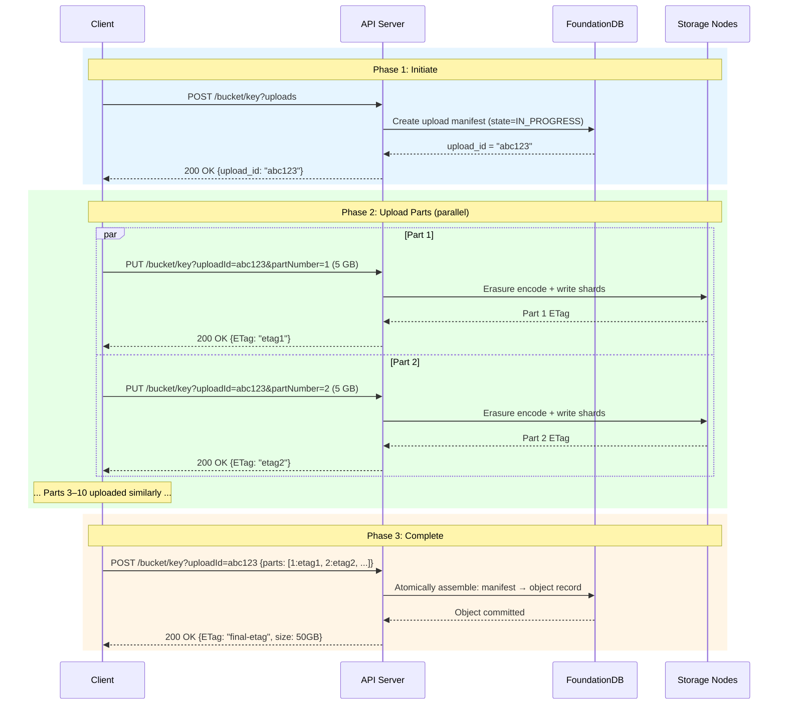
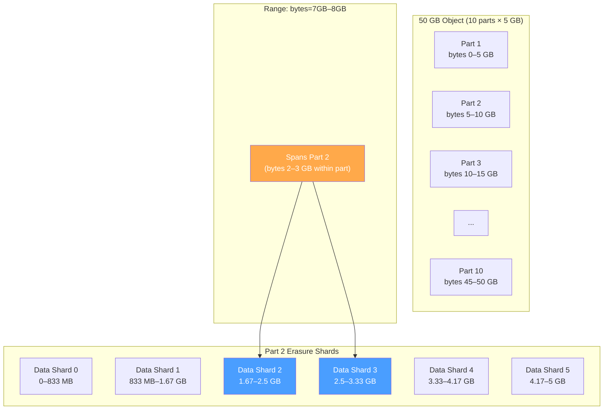

# 5. Multi-Part Uploads and Range Requests 🟡

> **The Problem:** A client wants to upload a 50 GB database backup over a residential internet connection that drops every 20 minutes. In a naive single-PUT API, any interruption means re-uploading all 50 GB from the start. Similarly, a video streaming client needs to seek to minute 45 of a 4K movie—downloading the entire 20 GB file to extract 100 MB is wasteful. We need an upload protocol that supports **resumable, parallel chunked uploads** and a download protocol that supports **arbitrary byte-range reads**.

---

## The S3 Multi-Part Upload Protocol

Amazon S3 established the de facto standard for multi-part uploads. Our API follows the same three-phase protocol:



### Protocol Properties

| Property | Benefit |
|---|---|
| **Resumable** | Only re-upload the failed part, not the entire file |
| **Parallel** | Upload 10 parts on 10 connections simultaneously |
| **Atomic** | Object is invisible until `CompleteMultiPartUpload` commits |
| **Idempotent** | Re-uploading a part with the same number overwrites it safely |
| **Expirable** | Incomplete uploads are garbage-collected after a timeout (e.g., 7 days) |

---

## Data Model: The Upload Manifest

The metadata store tracks the state of each in-progress upload:

```rust,ignore
use serde::{Deserialize, Serialize};

/// State machine for a multi-part upload.
#[derive(Debug, Clone, Serialize, Deserialize, PartialEq)]
enum UploadState {
    /// Parts are being uploaded.
    InProgress,
    /// All parts finalized, object record created.
    Completed,
    /// Explicitly aborted by the client.
    Aborted,
    /// Expired (garbage collected).
    Expired,
}

/// Metadata for a single uploaded part.
#[derive(Debug, Clone, Serialize, Deserialize)]
struct PartRecord {
    /// 1-indexed part number (1..=10,000).
    part_number: u32,
    /// Size of this part in bytes.
    size: u64,
    /// ETag (MD5 or SHA-256 of the part's raw bytes).
    etag: String,
    /// The erasure group storing this part's shards.
    erasure_group_id: u64,
    /// Shard placements for this part.
    shard_placements: Vec<(u32, u8)>,
}

/// The upload manifest stored in FoundationDB.
#[derive(Debug, Clone, Serialize, Deserialize)]
struct UploadManifest {
    upload_id: String,
    bucket: String,
    key: String,
    state: UploadState,
    /// Parts uploaded so far, keyed by part number.
    parts: Vec<PartRecord>,
    content_type: String,
    created_at: i64,
    /// Auto-expire after this timestamp if not completed.
    expires_at: i64,
}
```

---

## Phase 1: Initiate Multi-Part Upload

```rust,ignore
use uuid::Uuid;
use chrono::Utc;

const UPLOAD_EXPIRY_DAYS: i64 = 7;

/// Initiate a new multi-part upload.
/// Returns a unique upload_id that the client uses for subsequent part uploads.
async fn initiate_upload(
    db: &Database,
    bucket: &str,
    key: &str,
    content_type: &str,
) -> Result<String, Box<dyn std::error::Error>> {
    let upload_id = Uuid::new_v4().to_string();
    let now = Utc::now().timestamp_millis();
    let expires = now + (UPLOAD_EXPIRY_DAYS * 24 * 3600 * 1000);

    let manifest = UploadManifest {
        upload_id: upload_id.clone(),
        bucket: bucket.to_string(),
        key: key.to_string(),
        state: UploadState::InProgress,
        parts: Vec::new(),
        content_type: content_type.to_string(),
        created_at: now,
        expires_at: expires,
    };

    let manifest_key = format!("upload\x00{upload_id}");
    let manifest_value = bincode::serialize(&manifest)?;

    db.run(|tx, _| async move {
        tx.set(manifest_key.as_bytes(), &manifest_value);
        Ok(())
    })
    .await?;

    Ok(upload_id)
}
```

---

## Phase 2: Upload Individual Parts

Each part is independently erasure-encoded and stored, just like a standalone PUT. The only difference is that the metadata is written to the upload manifest instead of creating an object record.

```rust,ignore
use sha2::{Sha256, Digest};

/// Upload a single part of a multi-part upload.
///
/// - `part_number`: 1-indexed, must be in 1..=10,000.
/// - `body`: The raw bytes of this part (typically 5 MB to 5 GB).
///
/// Returns the part's ETag.
async fn upload_part(
    db: &Database,
    cluster: &ClusterMap,
    upload_id: &str,
    part_number: u32,
    body: &[u8],
) -> Result<String, Box<dyn std::error::Error>> {
    // Validate part number.
    if !(1..=10_000).contains(&part_number) {
        return Err("Part number must be between 1 and 10,000".into());
    }

    // Validate upload exists and is in progress.
    let manifest = get_upload_manifest(db, upload_id).await?;
    if manifest.state != UploadState::InProgress {
        return Err(format!("Upload {upload_id} is not in progress").into());
    }

    // Select erasure group for this part (hash includes upload_id + part_number
    // so different parts land on different groups for parallelism).
    let hash_input = format!("{upload_id}\x00{part_number}");
    let group = cluster.select_erasure_group(&manifest.bucket, &hash_input);

    // Erasure encode the part.
    let shards = erasure_encode(body)?;

    // Compute ETag for this part.
    let mut hasher = Sha256::new();
    hasher.update(body);
    let etag = format!("{:x}", hasher.finalize());

    // Write shards to storage nodes (same as single-object PUT).
    let shard_ids: Vec<[u8; 32]> = (0..TOTAL_SHARDS)
        .map(|i| compute_shard_id(upload_id, &part_number.to_string(), i))
        .collect();

    let mut tasks = Vec::new();
    for (i, (shard_data, node_id)) in
        shards.iter().zip(group.node_ids.iter()).enumerate()
    {
        let node = cluster.get_node(*node_id).clone();
        let shard_id = shard_ids[i];
        let data = shard_data.clone();
        tasks.push(tokio::spawn(async move {
            node.write_shard(&shard_id, &data).await
        }));
    }
    for task in tasks {
        task.await??;
    }

    // Update the manifest in FoundationDB.
    let part_record = PartRecord {
        part_number,
        size: body.len() as u64,
        etag: etag.clone(),
        erasure_group_id: group.id,
        shard_placements: group.node_ids.iter().enumerate()
            .map(|(i, &nid)| (nid, i as u8))
            .collect(),
    };

    update_manifest_part(db, upload_id, part_record).await?;

    Ok(etag)
}

/// Add or replace a part record in the upload manifest.
async fn update_manifest_part(
    db: &Database,
    upload_id: &str,
    part: PartRecord,
) -> Result<(), Box<dyn std::error::Error>> {
    let manifest_key = format!("upload\x00{upload_id}");

    db.run(|tx, _| async move {
        let raw = tx.get(manifest_key.as_bytes(), false).await?
            .ok_or_else(|| foundationdb::FdbError::from(1000))?;
        let mut manifest: UploadManifest = bincode::deserialize(&raw)
            .map_err(|_| foundationdb::FdbError::from(1000))?;

        // Replace existing part or add new one.
        if let Some(existing) = manifest.parts.iter_mut()
            .find(|p| p.part_number == part.part_number)
        {
            *existing = part;
        } else {
            manifest.parts.push(part);
        }

        let new_value = bincode::serialize(&manifest)
            .map_err(|_| foundationdb::FdbError::from(1000))?;
        tx.set(manifest_key.as_bytes(), &new_value);
        Ok(())
    })
    .await?;

    Ok(())
}
```

---

## Phase 3: Complete Multi-Part Upload

The `CompleteMultiPartUpload` call is the **atomic commit**. It verifies that all declared parts exist and match their ETags, then atomically creates the object record and deletes the manifest.

```rust,ignore
/// A part reference sent by the client in the complete request.
#[derive(Debug, Deserialize)]
struct PartRef {
    part_number: u32,
    etag: String,
}

/// Complete a multi-part upload, assembling the parts into a single object.
async fn complete_upload(
    db: &Database,
    upload_id: &str,
    client_parts: &[PartRef],
) -> Result<ObjectMeta, Box<dyn std::error::Error>> {
    let manifest = get_upload_manifest(db, upload_id).await?;

    if manifest.state != UploadState::InProgress {
        return Err(format!("Upload {upload_id} is not in progress").into());
    }

    // Validate: every part the client declared must exist with matching ETag.
    let mut total_size: u64 = 0;
    let mut ordered_parts: Vec<&PartRecord> = Vec::with_capacity(client_parts.len());

    for client_part in client_parts {
        let server_part = manifest.parts.iter()
            .find(|p| p.part_number == client_part.part_number)
            .ok_or_else(|| {
                format!("Part {} not found in upload", client_part.part_number)
            })?;

        if server_part.etag != client_part.etag {
            return Err(format!(
                "ETag mismatch for part {}: expected {}, got {}",
                client_part.part_number, server_part.etag, client_part.etag
            ).into());
        }

        total_size += server_part.size;
        ordered_parts.push(server_part);
    }

    // Sort parts by part number.
    ordered_parts.sort_by_key(|p| p.part_number);

    // Compute the composite ETag (hash of all part ETags — S3 convention).
    let mut composite_hasher = Sha256::new();
    for part in &ordered_parts {
        composite_hasher.update(part.etag.as_bytes());
    }
    let composite_etag = format!(
        "{:x}-{}",
        composite_hasher.finalize(),
        ordered_parts.len()
    );

    // Collect all shard placements from all parts.
    // The object record stores a list of parts, each with its own erasure group.
    let all_placements: Vec<(u32, u8)> = ordered_parts
        .iter()
        .flat_map(|p| p.shard_placements.clone())
        .collect();

    // Atomic transaction: create object record + delete upload manifest.
    let object_meta = ObjectMeta {
        bucket: manifest.bucket.clone(),
        key: manifest.key.clone(),
        version: 1,
        size_bytes: total_size,
        etag: composite_etag,
        erasure_group_id: 0, // Multi-part: uses per-part groups
        shard_placements: all_placements,
        created_at: chrono::Utc::now().timestamp_millis(),
        content_type: manifest.content_type.clone(),
    };

    let obj_key = meta_key(&manifest.bucket, &manifest.key, 1);
    let obj_value = bincode::serialize(&object_meta)?;
    let manifest_key = format!("upload\x00{upload_id}");

    db.run(|tx, _| async move {
        // Create the object.
        tx.set(&obj_key, &obj_value);
        // Delete the manifest.
        tx.clear(manifest_key.as_bytes());
        Ok(())
    })
    .await?;

    Ok(object_meta)
}
```

---

## Abort and Garbage Collection

If the client abandons an upload (or it expires), we must clean up the orphaned shards:

```rust,ignore
/// Abort a multi-part upload and schedule shard cleanup.
async fn abort_upload(
    db: &Database,
    cluster: &ClusterMap,
    upload_id: &str,
) -> Result<(), Box<dyn std::error::Error>> {
    let manifest = get_upload_manifest(db, upload_id).await?;

    // Delete shards for all uploaded parts.
    for part in &manifest.parts {
        for (i, (node_id, _)) in part.shard_placements.iter().enumerate() {
            let node = cluster.get_node(*node_id);
            let shard_id = compute_shard_id(
                upload_id,
                &part.part_number.to_string(),
                i,
            );
            // Best-effort deletion; GC will catch stragglers.
            let _ = node.delete_shard(&shard_id).await;
        }
    }

    // Remove the manifest.
    let manifest_key = format!("upload\x00{upload_id}");
    db.run(|tx, _| async move {
        tx.clear(manifest_key.as_bytes());
        Ok(())
    })
    .await?;

    Ok(())
}

/// Background task: expire uploads past their deadline.
async fn gc_expired_uploads(
    db: &Database,
    cluster: &ClusterMap,
) -> Result<u64, Box<dyn std::error::Error>> {
    let now = chrono::Utc::now().timestamp_millis();
    let mut expired_count = 0u64;

    // Scan all upload manifests.
    let manifests = list_all_uploads(db).await?;

    for manifest in manifests {
        if manifest.state == UploadState::InProgress && manifest.expires_at < now {
            eprintln!(
                "[gc] Expiring upload {} (bucket={}, key={})",
                manifest.upload_id, manifest.bucket, manifest.key
            );
            abort_upload(db, cluster, &manifest.upload_id).await?;
            expired_count += 1;
        }
    }

    Ok(expired_count)
}
```

---

## Range Requests: Byte-Level Reads

HTTP `Range` headers allow clients to request arbitrary byte ranges:

```
GET /bucket/movie.mp4 HTTP/1.1
Range: bytes=104857600-115343359
```

This requests bytes 100 MB through 110 MB of a file—exactly what a video player does when seeking.

### The Challenge: Mapping Byte Ranges to Shards

A multi-part object is stored as multiple parts, each erasure-coded into separate shard groups. To serve a byte range, the API server must:

1. Determine which **part(s)** contain the requested bytes.
2. For each part, determine which **stripe(s)** within the erasure coding contain those bytes.
3. Fetch only the necessary data shards from those stripes.



For a 1 GB range within a 5 GB part with 6 data shards (~833 MB each), we need to read from **at most 2 data shards**—not all 6.

### Range Resolution

```rust,ignore
/// Describes a byte range within a specific part and shard.
#[derive(Debug)]
struct ShardReadPlan {
    /// Which part of the multi-part upload.
    part_number: u32,
    /// Which shard within the erasure group.
    shard_index: usize,
    /// Byte offset within the shard to start reading.
    shard_offset: u64,
    /// Number of bytes to read from this shard.
    length: u64,
    /// Node and shard ID for fetching.
    node_id: u32,
    shard_id: [u8; 32],
}

/// Resolve an HTTP Range header into a set of shard reads.
///
/// `parts`: Ordered list of parts with their sizes.
/// `range_start`, `range_end`: Byte offsets in the logical object.
fn resolve_range(
    parts: &[PartRecord],
    range_start: u64,
    range_end: u64, // inclusive
) -> Vec<ShardReadPlan> {
    let mut plans = Vec::new();
    let mut object_offset: u64 = 0;

    for part in parts {
        let part_end = object_offset + part.size;

        // Skip parts entirely before the range.
        if part_end <= range_start {
            object_offset = part_end;
            continue;
        }

        // Stop if we've passed the range entirely.
        if object_offset > range_end {
            break;
        }

        // Calculate the byte range within this part.
        let local_start = if range_start > object_offset {
            range_start - object_offset
        } else {
            0
        };
        let local_end = std::cmp::min(range_end - object_offset, part.size - 1);

        // Map local byte range to shard indices and offsets.
        let shard_size = (part.size + DATA_SHARDS as u64 - 1) / DATA_SHARDS as u64;
        let first_shard = (local_start / shard_size) as usize;
        let last_shard = (local_end / shard_size) as usize;

        for shard_idx in first_shard..=std::cmp::min(last_shard, DATA_SHARDS - 1) {
            let shard_byte_start = shard_idx as u64 * shard_size;
            let shard_byte_end = std::cmp::min(shard_byte_start + shard_size - 1, part.size - 1);

            // Intersect with the requested range.
            let read_start = if local_start > shard_byte_start {
                local_start - shard_byte_start
            } else {
                0
            };
            let read_end = if local_end < shard_byte_end {
                local_end - shard_byte_start
            } else {
                shard_byte_end - shard_byte_start
            };

            let (node_id, _) = part.shard_placements[shard_idx];
            let shard_id = compute_shard_id(
                &part.part_number.to_string(),
                &shard_idx.to_string(),
                shard_idx,
            );

            plans.push(ShardReadPlan {
                part_number: part.part_number,
                shard_index: shard_idx,
                shard_offset: read_start,
                length: read_end - read_start + 1,
                node_id,
                shard_id,
            });
        }

        object_offset = part_end;
    }

    plans
}
```

### Serving a Range GET

```rust,ignore
use hyper::{Body, Response, StatusCode};

/// Handle a GET request with an optional Range header.
async fn handle_get(
    db: &Database,
    cluster: &ClusterMap,
    bucket: &str,
    key: &str,
    range_header: Option<&str>,
) -> Result<Response<Body>, Box<dyn std::error::Error>> {
    // 1. Fetch object metadata.
    let meta = get_object_meta(db, bucket, key).await?
        .ok_or("Object not found")?;

    // 2. Parse the Range header (if present).
    let (range_start, range_end) = match range_header {
        Some(header) => parse_range_header(header, meta.size_bytes)?,
        None => (0, meta.size_bytes - 1), // Full object
    };

    let content_length = range_end - range_start + 1;

    // 3. Resolve to shard read plans.
    let parts = get_object_parts(db, &meta).await?;
    let read_plans = resolve_range(&parts, range_start, range_end);

    // 4. Fetch shard ranges in parallel.
    let mut tasks = Vec::new();
    for plan in &read_plans {
        let node = cluster.get_node(plan.node_id).clone();
        let shard_id = plan.shard_id;
        let offset = plan.shard_offset;
        let length = plan.length;
        tasks.push(tokio::spawn(async move {
            node.read_shard_range(&shard_id, offset, length).await
        }));
    }

    // 5. Assemble the response body in order.
    let mut body_bytes = Vec::with_capacity(content_length as usize);
    for task in tasks {
        let chunk = task.await??;
        body_bytes.extend_from_slice(&chunk);
    }

    // 6. Build the HTTP response.
    let status = if range_header.is_some() {
        StatusCode::PARTIAL_CONTENT // 206
    } else {
        StatusCode::OK // 200
    };

    let response = Response::builder()
        .status(status)
        .header("Content-Length", content_length.to_string())
        .header("Content-Type", &meta.content_type)
        .header("ETag", format!("\"{}\"", meta.etag))
        .header("Accept-Ranges", "bytes")
        .header(
            "Content-Range",
            format!("bytes {range_start}-{range_end}/{}", meta.size_bytes),
        )
        .body(Body::from(body_bytes))?;

    Ok(response)
}

/// Parse an HTTP Range header like "bytes=100-200" or "bytes=100-".
fn parse_range_header(
    header: &str,
    total_size: u64,
) -> Result<(u64, u64), Box<dyn std::error::Error>> {
    let header = header.trim();
    if !header.starts_with("bytes=") {
        return Err("Unsupported range unit".into());
    }

    let range_spec = &header[6..]; // Remove "bytes="
    let parts: Vec<&str> = range_spec.splitn(2, '-').collect();

    if parts.len() != 2 {
        return Err("Invalid range format".into());
    }

    let start: u64 = if parts[0].is_empty() {
        // Suffix range: "bytes=-500" means last 500 bytes.
        let suffix_len: u64 = parts[1].parse()?;
        total_size.saturating_sub(suffix_len)
    } else {
        parts[0].parse()?
    };

    let end: u64 = if parts[1].is_empty() {
        // Open-ended: "bytes=100-" means from 100 to end.
        total_size - 1
    } else {
        parts[1].parse()?
    };

    // Clamp to valid range.
    let end = std::cmp::min(end, total_size - 1);

    if start > end || start >= total_size {
        return Err("Range not satisfiable".into());
    }

    Ok((start, end))
}
```

---

## Part Size Strategy

The choice of part size affects upload parallelism, metadata overhead, and range-read efficiency:

| Part Size | Parts for 50 GB | Metadata Overhead | Upload Parallelism | Range Precision |
|---|---|---|---|---|
| 5 MB | 10,000 | High (10K records) | Extreme (but diminishing returns) | Very fine |
| 64 MB | 800 | Moderate | High | Good |
| 256 MB | 200 | Low | Good | Moderate |
| 1 GB | 50 | Very Low | Moderate | Coarse |
| **5 GB** | **10** | **Minimal** | **Good** | **Moderate** |

**Our recommendation:** Default to **64 MB – 256 MB** parts. This balances:
- Enough parallelism for fast uploads (8–16 concurrent parts).
- Small enough that a failed part retry wastes minimal bandwidth.
- Large enough to amortize the per-part erasure coding overhead.

### Part Size Constraints

```rust,ignore
/// Validate client-requested part size.
const MIN_PART_SIZE: u64 = 5 * 1024 * 1024;         // 5 MB (S3 minimum)
const MAX_PART_SIZE: u64 = 5 * 1024 * 1024 * 1024;   // 5 GB (S3 maximum)
const MAX_PARTS: u32 = 10_000;

fn validate_part(part_number: u32, part_size: u64) -> Result<(), String> {
    if part_number < 1 || part_number > MAX_PARTS {
        return Err(format!("Part number must be 1–{MAX_PARTS}"));
    }
    if part_size < MIN_PART_SIZE {
        return Err(format!(
            "Part size {} is below minimum {MIN_PART_SIZE}",
            part_size
        ));
    }
    if part_size > MAX_PART_SIZE {
        return Err(format!(
            "Part size {} exceeds maximum {MAX_PART_SIZE}",
            part_size
        ));
    }
    Ok(())
}
```

---

## Streaming: Never Buffer the Whole Part

The API server must **stream** part data through to storage nodes. Buffering a 5 GB part in memory would require impractical amounts of RAM across dozens of concurrent uploads.

```rust,ignore
use tokio::io::AsyncRead;
use futures::StreamExt;

/// Stream a part upload through the erasure encoder to storage nodes
/// without buffering the entire part in memory.
async fn stream_upload_part<R: AsyncRead + Unpin>(
    body: &mut R,
    shard_senders: Vec<ShardSender>,
) -> Result<(u64, String), Box<dyn std::error::Error>> {
    let mut encoder = StreamingEncoder::new(shard_senders)?;
    let mut etag_hasher = Sha256::new();
    let mut total_bytes = 0u64;

    let mut buf = vec![0u8; 256 * 1024]; // 256 KB read buffer

    loop {
        let n = body.read(&mut buf).await?;
        if n == 0 {
            break;
        }
        let chunk = &buf[..n];

        // Feed chunk into the streaming erasure encoder.
        encoder.feed(chunk).await?;

        // Update the ETag hash.
        etag_hasher.update(chunk);

        total_bytes += n as u64;
    }

    // Flush any remaining buffered data.
    encoder.finish().await?;

    let etag = format!("{:x}", etag_hasher.finalize());
    Ok((total_bytes, etag))
}
```

---

## API Summary

| Endpoint | Method | Description |
|---|---|---|
| `/bucket/key?uploads` | `POST` | Initiate multi-part upload → returns `upload_id` |
| `/bucket/key?uploadId=X&partNumber=N` | `PUT` | Upload part N → returns part ETag |
| `/bucket/key?uploadId=X` | `POST` | Complete upload (body: part list with ETags) |
| `/bucket/key?uploadId=X` | `DELETE` | Abort upload, clean up parts |
| `/bucket?uploads` | `GET` | List in-progress uploads for a bucket |
| `/bucket/key` | `GET` | Download object (full or range) |
| `/bucket/key` | `HEAD` | Get object metadata (size, ETag, content-type) |

### Range Request Headers

| Request Header | Example | Meaning |
|---|---|---|
| `Range: bytes=0-1023` | First 1 KB | Fixed range |
| `Range: bytes=1048576-` | From 1 MB to end | Open-ended |
| `Range: bytes=-512` | Last 512 bytes | Suffix range |

| Response Header | Example | Meaning |
|---|---|---|
| `Content-Range: bytes 0-1023/10485760` | | Range served / total size |
| `Accept-Ranges: bytes` | | Server supports range requests |
| HTTP Status `206 Partial Content` | | Range response |
| HTTP Status `416 Range Not Satisfiable` | | Invalid range |

---

## Comparison: Multi-Part Upload Strategies

| Strategy | Resumable? | Parallel? | Max Object Size | Server Memory |
|---|---|---|---|---|
| Single PUT (buffer all) | ❌ | ❌ | Limited by RAM | O(object_size) |
| Single PUT (streaming) | ❌ | ❌ | Unlimited | O(buffer) |
| **Multi-Part (ours)** | **✅** | **✅** | **5 TB (10K × 5 GB)** | **O(part_buffer)** |
| `tus` protocol | ✅ | ❌ | Unlimited | O(chunk) |
| gRPC streaming | ✅ | ✅ (client) | Unlimited | O(buffer) |

Multi-part upload is the gold standard for large object storage APIs because it provides both resumability and parallelism while keeping server memory constant.

---

> **Key Takeaways**
>
> 1. **Multi-part upload is a three-phase protocol:** Initiate → Upload Parts (parallel) → Complete (atomic commit). The object is invisible until the final commit.
> 2. **Each part is independently erasure-coded** and stored, making parts self-contained. Failed parts can be retried without re-uploading the whole object.
> 3. **The upload manifest in FoundationDB** tracks the state machine (InProgress → Completed/Aborted/Expired). Expired uploads are garbage-collected automatically.
> 4. **Range requests map byte offsets to shard reads.** The API server fetches only the data shards covering the requested range—not the entire object. This enables efficient video streaming and partial downloads.
> 5. **Never buffer the entire part in memory.** The API server streams data through a stripe-based encoder that fans out to storage nodes in real time. Memory usage is O(stripe_size), not O(part_size).
> 6. **Part size of 64 MB–256 MB** balances upload parallelism, retry cost, and metadata overhead for most workloads.
