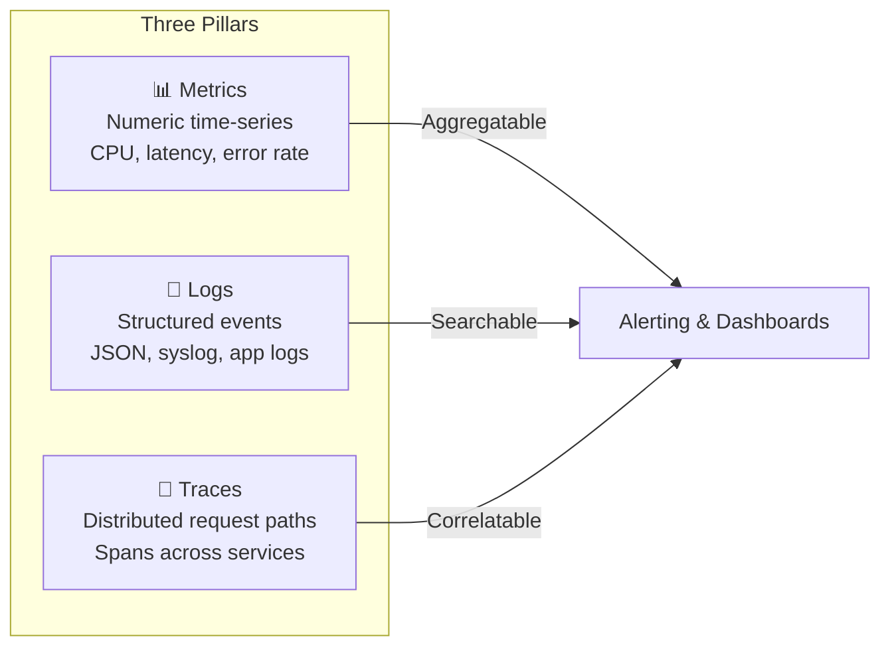
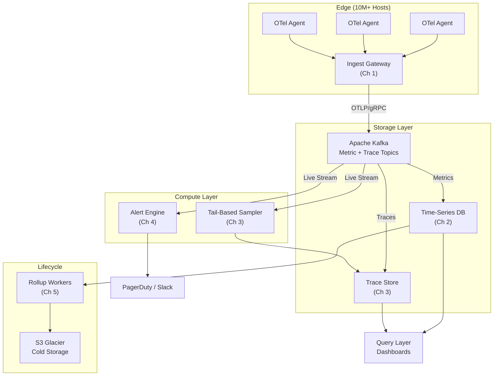

# System Design: The Petabyte-Scale Observability Platform

> *"You cannot fix what you cannot see. And at petabyte scale, you cannot even see what you cannot compress, sample, and stream — in real time — from ten million sources."*

---

## About This Guide

This is a principal-level system design handbook for building the infrastructure that monitors all other infrastructure: **the observability platform**. When Datadog ingests 40 trillion metrics per day, when Grafana Labs stores 700 PB of logs, when Honeycomb processes 2 million trace spans per second — this is the system underneath.

Observability is not "monitoring with a fancier name." Monitoring asks "Is this thing broken?" Observability asks "Why is this thing broken, and which of the 50 microservices in the request path caused it?" The platform you will design in this book answers both questions — simultaneously — at the scale of millions of hosts, billions of containers, and trillions of data points per day.

We approach the problem in layers, from the edge where telemetry is born to the glacier where it goes to die:

```
Agents → Ingest Gateway → Kafka → TSDB / Trace Store → Alert Engine → Query Layer → Cold Storage
```

The design space is shaped by five brutal constraints:

| Constraint | Why It Matters |
|---|---|
| **Cardinality** | A single tag like `user_id` with 100M unique values creates 100M time series. Your TSDB will OOM in minutes. |
| **Write Volume** | 10 million hosts × 200 metrics × 1/sec = **2 billion data points per second**. You cannot `INSERT INTO metrics` your way out of this. |
| **Query Latency** | An on-call engineer at 3 AM needs a dashboard in < 500ms, not 5 minutes. Read performance cannot be sacrificed for write throughput. |
| **Cost** | Storing 1-second resolution data for 13 months at naively 16 bytes/point would cost **$400M/year** in S3 alone. Compression and rollups are existential. |
| **Reliability Paradox** | The observability platform must be more reliable than every system it monitors. If it goes down during an incident, you are flying blind. |

---

## The Three Pillars of Observability

Before we dive into architecture, we must define what we are ingesting, storing, and querying.



| Pillar | Shape | Volume | Retention | Query Pattern |
|---|---|---|---|---|
| **Metrics** | `(timestamp, value, tags{})` | Billions/sec | 13 months (SEC/SOX) | Aggregate: `avg(cpu) WHERE host=X GROUP BY 1m` |
| **Logs** | `(timestamp, body, fields{})` | TB/hour | 30–90 days hot, 1 year cold | Search: `level=ERROR AND service=payment` |
| **Traces** | `(trace_id, span_id, parent, tags{})` | Millions of spans/sec | 7–30 days | Lookup: `trace_id=abc123` + scatter: "slowest traces" |

This book focuses primarily on **metrics** and **traces** — the two pillars with the most interesting systems challenges. Log storage follows patterns covered in the [Search Engine book](../search-engine-book/src/SUMMARY.md) (inverted indices, segment merges).

---

## Speaker Intro

This material is written from the perspective of a **Principal SRE & Observability Architect** with deep experience building planet-scale telemetry infrastructure:

- **Ingest Gateway** — designed and shipped gateways handling 5M+ data points/second per node using OTLP/gRPC with adaptive backpressure, tag validation, and cardinality limiting before Kafka admission.
- **Time-Series Storage** — built custom TSDBs using Gorilla compression (XOR float encoding, Delta-of-Delta timestamps) achieving 1.37 bits/point average, on top of a LSM-tree backed storage engine serving 200K queries/sec.
- **Distributed Tracing** — architected tail-based sampling pipelines buffering 100% of trace spans in ring buffers, making keep/drop decisions only after the root span completes — reducing storage by 95% while keeping 100% of error traces.
- **Streaming Alerting** — built Flink-based alert evaluation engines processing 50,000+ concurrent rules against live metric streams with p99 evaluation latency < 200ms, integrated with PagerDuty, Slack, and OpsGenie.
- **Tiered Storage & Rollups** — designed rollup pipelines that downsample 1-second data into 1-minute and 1-hour resolutions, saving $30M+/year in storage costs while maintaining query-time transparency via the query layer's automatic resolution selection.
- **OpenTelemetry** — contributed to the OpenTelemetry Collector ecosystem; deep expertise in OTLP protocol, SDK instrumentation, and the Collector's processor/exporter pipeline.

---

## Who This Is For

- **Senior backend engineers building internal observability platforms** — at companies that have outgrown Datadog's pricing or Prometheus's single-node limits.
- **SREs and platform engineers** designing the telemetry pipeline that monitors production — from agent configuration to alert routing.
- **System design interview candidates** — preparing for staff+ interviews at companies where "design an observability platform" or "design a metrics system" is a common prompt.
- **Rust developers building high-throughput data pipelines** — the observability domain is one of the best showcases for Rust's zero-cost abstractions, as every byte and every microsecond matters at this scale.

### What This Guide Is NOT

- It is not a guide to *using* Prometheus, Grafana, or Datadog. We design the internals, not the dashboards.
- It is not a networking deep-dive. We cover Kafka and gRPC architecture but not kernel-level packet processing.
- It is not an OpenTelemetry tutorial. We assume familiarity with OTLP, spans, and metric types. The [OpenTelemetry docs](https://opentelemetry.io/docs/) cover the basics.

---

## Prerequisites

| Concept | Required Level | Where to Learn |
|---|---|---|
| Rust ownership, borrowing, lifetimes | Fluent | [Rust Memory Management](../memory-management-book/src/SUMMARY.md) |
| Data structures (B-trees, LSM-trees, hash maps) | Strong | [Algorithms & Concurrency](../algorithms-concurrency-book/src/SUMMARY.md) |
| Distributed systems (consensus, replication, partitioning) | Intermediate | [Distributed Systems](../distributed-systems-book/src/SUMMARY.md) |
| Async Rust (tokio, futures, channels) | Working knowledge | [Async Rust](../async-book/src/SUMMARY.md) |
| Kafka basics (topics, partitions, consumer groups) | Awareness | Chapter 1 of this book covers what you need |

---

## How to Use This Book

| Indicator | Meaning |
|---|---|
| 🟢 **Architecture** | System-level design, data flow, and component boundaries |
| 🟡 **Time-Series Storage** | Compression algorithms, storage engine internals, query optimization |
| 🔴 **Distributed Tracing** | Sampling strategies, distributed state, streaming computation |

### Pacing Guide

| Chapters | Topic | Estimated Time | Checkpoint |
|---|---|---|---|
| Ch 0 | Introduction & Observability Primer | 1–2 hours | Can explain the three pillars, cardinality explosion, and why naive storage fails at scale |
| Ch 1 | Ingest Gateway & High Cardinality | 4–6 hours | Can design an OTLP ingest layer with Kafka buffering and cardinality limiting |
| Ch 2 | The Time-Series Database | 6–8 hours | Can implement Gorilla compression and explain LSM-tree based TSDB internals |
| Ch 3 | Distributed Tracing & Tail-Based Sampling | 6–8 hours | Can architect a tail-based sampling pipeline with trace assembly and error-biased retention |
| Ch 4 | Streaming Alert Engine | 4–6 hours | Can design a Flink-based rule evaluation engine with sliding windows and deduplication |
| Ch 5 | Rollups & Cold Storage | 4–6 hours | Can implement a tiered storage system with automatic downsampling and S3 Glacier archival |

**Fast Track (Interview Prep):** Chapters 1, 2, 3 — covers the core pipeline that staff-level interviewers care about.

**Full Track (Mastery):** All chapters sequentially. Budget 2 weeks of focused study.

---

## Table of Contents

### Part I: Data Ingestion

| Chapter | Description |
|---|---|
| **1. The Ingest Gateway and High Cardinality** 🟢 | Handling the metric firehose. The "Tag Explosion" problem. OTLP/gRPC reception, tag validation, cardinality limiting, and Kafka-based buffering with backpressure. |

### Part II: Storage

| Chapter | Description |
|---|---|
| **2. The Time-Series Database (TSDB)** 🟡 | Storing billions of data points efficiently. Gorilla compression (XOR encoding for floats, Delta-of-Delta for timestamps). LSM-tree storage engine. Inverted index for tag-based lookups. |

### Part III: Distributed Analysis

| Chapter | Description |
|---|---|
| **3. Distributed Tracing and Tail-Based Sampling** 🔴 | Following a request across 50 microservices. Trace assembly from span streams. Why head-based sampling misses errors. Tail-based sampling with in-memory ring buffers. |
| **4. The Streaming Alert Engine** 🔴 | Real-time alert evaluation against live data streams. Sliding window aggregation via Apache Flink. Rule compilation, deduplication, and PagerDuty integration. |

### Part IV: Lifecycle Management

| Chapter | Description |
|---|---|
| **5. Rollups and Cold Storage** 🟡 | You can't keep 1-second data forever. Background rollup workers, resolution-aware query routing, and tiered storage from NVMe → S3 → Glacier. |

---

## The Architecture at a Glance

Before diving into individual chapters, here is the end-to-end system we are building:



Each chapter is self-contained but builds on the previous one. The Kafka bus is the spine — every downstream consumer (TSDB, alert engine, trace sampler) reads from the same partitioned stream, enabling independent scaling and replay.

Let's begin.
