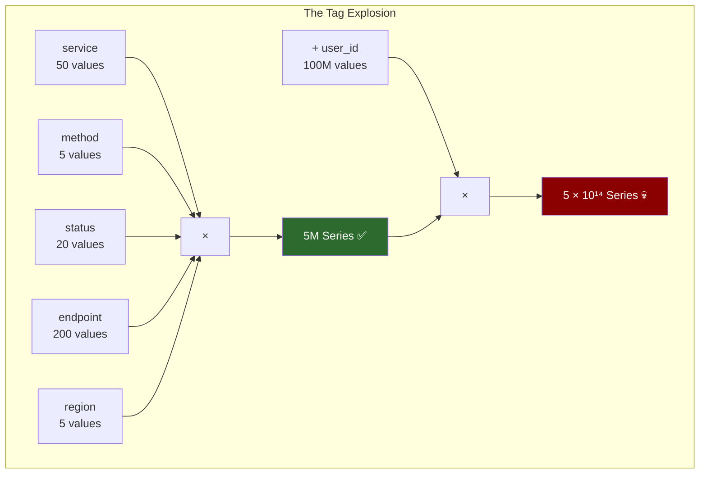
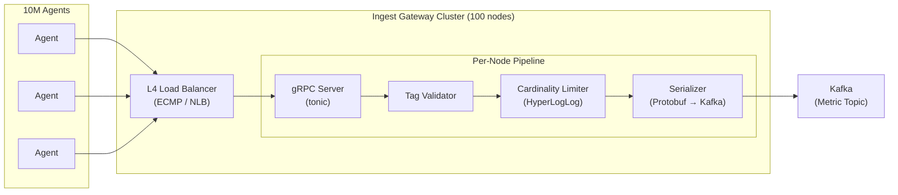
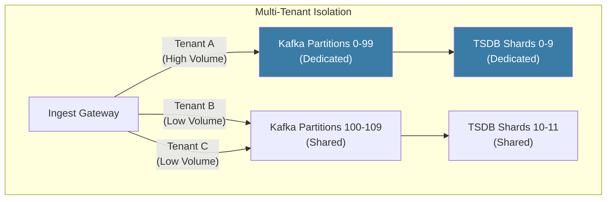

# Chapter 1: The Ingest Gateway and High Cardinality 🟢

> **The Problem:** Your platform receives 2 billion data points per second from 10 million hosts. Each data point carries a set of tags (key-value pairs) that describe *what* was measured and *where*. A single high-cardinality tag — like `user_id` or `container_id` — can create millions of unique time series, exploding your storage and query costs by 1000×. You need an ingest layer that receives OpenTelemetry data at line rate, validates and normalizes tags, enforces cardinality limits, and buffers everything into Kafka — without dropping a single legitimate data point.

---

## 1.1 The Metric Firehose: What Actually Arrives

Every OpenTelemetry (OTel) agent on every host continuously emits metrics via the OTLP (OpenTelemetry Protocol) over gRPC. A single metric data point looks like this:

```rust
/// A single metric data point as received from an OTel agent.
struct MetricPoint {
    /// The metric name, e.g., "http.server.request.duration"
    name: String,
    /// Unix timestamp in nanoseconds
    timestamp_ns: u64,
    /// The measured value (gauge, counter, or histogram bucket)
    value: f64,
    /// Tags / labels that identify the time series
    tags: HashMap<String, String>,
}
```

A typical host emits ~200 metrics per second. With 10 million hosts, that's **2 billion points/second**. But data points are small — the real bottleneck is not the bytes, it's the **unique combinations of tags**.

### What is a "Time Series"?

A single time series is defined by the unique combination of **metric name + all tag key-value pairs**:

```
Series A: http.request.duration {service=checkout, method=POST, status=200}
Series B: http.request.duration {service=checkout, method=POST, status=500}
Series C: http.request.duration {service=checkout, method=GET, status=200}
```

These are **three different time series**, even though the metric name is the same. The TSDB must maintain a separate append-only stream for each one. The total number of active time series is the **cardinality** of your metrics — and it is the single most dangerous scaling dimension in the entire platform.

---

## 1.2 The Tag Explosion Problem

> **Key Insight:** Cardinality is multiplicative. If you have 5 tag keys, each with moderate unique values, the total series count is the *product* of all tag cardinalities.

Consider a seemingly innocent metric:

```
http.request.duration {
    service    = "checkout",      // 50 services
    method     = "POST",          // 5 HTTP methods
    status     = "200",           // 20 status codes
    endpoint   = "/api/v1/pay",   // 200 endpoints
    region     = "us-east-1",     // 5 regions
}
```

**Total series = 50 × 5 × 20 × 200 × 5 = 5,000,000 series** — manageable.

Now an engineer adds `user_id` as a tag:

```
http.request.duration {
    service    = "checkout",
    method     = "POST",
    status     = "200",
    endpoint   = "/api/v1/pay",
    region     = "us-east-1",
    user_id    = "u-8f3a21c9",   // 💀 100 million unique users
}
```

**New total: 5,000,000 × 100,000,000 = 5 × 10¹⁴ series.** Your TSDB needs an in-memory index entry for every active series. At ~200 bytes per index entry, that's **100 petabytes of RAM** just for the index. The database crashes within seconds.



This is not a hypothetical — it is the **#1 production incident** at every company that builds an observability platform. Datadog, New Relic, and Grafana Cloud all have cardinality limits for exactly this reason.

### The High-Cardinality Tag Taxonomy

| Tag Type | Example | Cardinality | Safe as Metric Tag? |
|---|---|---|---|
| **Enum** | `method=GET` | < 10 | ✅ Always |
| **Low-cardinality** | `region=us-east-1` | < 100 | ✅ Always |
| **Medium-cardinality** | `endpoint=/api/v1/users` | < 10K | ⚠️ With limits |
| **High-cardinality** | `container_id=abc123` | < 1M | ❌ Use as trace/log attribute only |
| **Unbounded** | `user_id=u-8f3a21c9` | 100M+ | ❌ Never — this is a log/trace attribute |

> **Rule of Thumb:** If a tag's unique value count is unbounded or proportional to user/request volume, it belongs in **traces or logs**, not metrics. Metrics are for aggregates; traces are for individuals.

---

## 1.3 Architecting the Ingest Gateway

The ingest gateway sits between the OTel agents and Kafka. It has four responsibilities:

1. **Receive** — Accept OTLP/gRPC streams from millions of agents
2. **Validate** — Reject malformed metric names and tag values
3. **Limit** — Enforce per-tenant cardinality limits
4. **Buffer** — Serialize validated data into Kafka partitions



### The gRPC Receiver

Each gateway node runs a `tonic` gRPC server accepting `ExportMetricsServiceRequest` messages (the OTLP standard). The key design choice: **streaming RPCs, not unary RPCs**. A single agent keeps a persistent HTTP/2 connection and streams batches continuously, avoiding the per-request overhead of connection setup.

```rust
use tonic::{Request, Response, Status, Streaming};

/// OTLP Metrics gRPC service implementation.
pub struct IngestService {
    kafka_producer: KafkaProducer,
    cardinality_limiter: CardinalityLimiter,
    tag_validator: TagValidator,
}

#[tonic::async_trait]
impl MetricsService for IngestService {
    async fn export(
        &self,
        request: Request<ExportMetricsServiceRequest>,
    ) -> Result<Response<ExportMetricsServiceResponse>, Status> {
        let metrics = request.into_inner();
        
        for resource_metrics in &metrics.resource_metrics {
            for scope_metrics in &resource_metrics.scope_metrics {
                for metric in &scope_metrics.metrics {
                    // Step 1: Validate tag names and values
                    let tags = extract_tags(resource_metrics, metric);
                    self.tag_validator.validate(&tags)
                        .map_err(|e| Status::invalid_argument(e.to_string()))?;
                    
                    // Step 2: Check cardinality limits
                    let series_key = compute_series_key(&metric.name, &tags);
                    if !self.cardinality_limiter.check_and_register(&series_key) {
                        // Drop the point — cardinality limit exceeded
                        METRICS.cardinality_drops.increment(1);
                        continue;
                    }
                    
                    // Step 3: Serialize and send to Kafka
                    let partition_key = compute_partition_key(&tags);
                    self.kafka_producer.send(&partition_key, metric).await
                        .map_err(|e| Status::internal(e.to_string()))?;
                }
            }
        }
        
        Ok(Response::new(ExportMetricsServiceResponse {
            partial_success: None,
        }))
    }
}
```

### Tag Validation

The validator enforces structural rules before the data enters the pipeline:

```rust
pub struct TagValidator {
    /// Maximum number of tags per data point
    max_tags: usize,            // typically 30
    /// Maximum tag key length in bytes
    max_key_len: usize,         // typically 200
    /// Maximum tag value length in bytes
    max_value_len: usize,       // typically 500
    /// Forbidden tag keys (known high-cardinality offenders)
    blocked_keys: HashSet<String>,
}

impl TagValidator {
    pub fn validate(&self, tags: &HashMap<String, String>) -> Result<(), ValidationError> {
        if tags.len() > self.max_tags {
            return Err(ValidationError::TooManyTags {
                count: tags.len(),
                limit: self.max_tags,
            });
        }
        
        for (key, value) in tags {
            if self.blocked_keys.contains(key) {
                return Err(ValidationError::BlockedTagKey(key.clone()));
            }
            if key.len() > self.max_key_len {
                return Err(ValidationError::KeyTooLong(key.clone()));
            }
            if value.len() > self.max_value_len {
                return Err(ValidationError::ValueTooLong(key.clone()));
            }
            // Enforce ASCII alphanumeric + dots + underscores + hyphens
            if !key.chars().all(|c| c.is_ascii_alphanumeric() || c == '.' || c == '_' || c == '-') {
                return Err(ValidationError::InvalidKeyChars(key.clone()));
            }
        }
        Ok(())
    }
}
```

---

## 1.4 Cardinality Limiting with HyperLogLog

The cardinality limiter must answer: "How many unique time series has tenant X created in the current window?" Maintaining an exact count would require storing every series key — potentially millions per tenant. Instead, we use **HyperLogLog (HLL)**, a probabilistic data structure that estimates set cardinality using only ~12 KB of memory per tenant with ±2% error.

```rust
use hyperloglog::HyperLogLog;
use std::collections::HashMap;
use std::sync::RwLock;

pub struct CardinalityLimiter {
    /// Per-tenant HLL sketches, reset every window_duration
    tenant_sketches: RwLock<HashMap<TenantId, HyperLogLog>>,
    /// Maximum unique series per tenant per window
    limit_per_tenant: u64,
}

impl CardinalityLimiter {
    /// Returns `true` if the series is within the cardinality limit.
    /// Returns `false` if the tenant has exceeded their limit (drop the point).
    pub fn check_and_register(&self, tenant: &TenantId, series_key: &[u8]) -> bool {
        let sketches = self.tenant_sketches.read().unwrap();
        
        if let Some(hll) = sketches.get(tenant) {
            let estimated_cardinality = hll.len();
            if estimated_cardinality >= self.limit_per_tenant as f64 {
                return false; // Over limit — reject
            }
        }
        drop(sketches);
        
        // Register the series key in the HLL
        let mut sketches = self.tenant_sketches.write().unwrap();
        let hll = sketches.entry(tenant.clone()).or_insert_with(HyperLogLog::new);
        hll.insert(series_key);
        true
    }
}
```

### Why HyperLogLog and Not a HashSet?

| Approach | Memory per Tenant (1M series) | Accuracy | Speed |
|---|---|---|---|
| `HashSet<SeriesKey>` | ~200 MB | Exact | O(1) amortized |
| **HyperLogLog** | **12 KB** | ±2% | O(1) |
| Bloom Filter | ~1.2 MB | No count — only membership | O(k) |

With 10,000 tenants and HLL, total memory is **120 MB**. With HashSets, it would be **2 TB**. The 2% error margin is acceptable — we are protecting the TSDB from 100× overload, not counting beans.

### Cardinality Limiting Strategies

When a tenant exceeds their cardinality limit, the gateway has several options:

| Strategy | Description | Pros | Cons |
|---|---|---|---|
| **Hard Drop** | Reject new series entirely | Simple, safe | Loses data silently |
| **Aggregate Overflow** | Route excess series to a catch-all `__overflow__` bucket | No data loss | Loses tag granularity |
| **Notify & Drop** | Drop + emit a `cardinality.limit.exceeded` metric | Visibility | Still loses data |
| **Adaptive Sampling** | Accept 1-in-N points for excess series | Preserves trends | Adds complexity |

Production systems typically use **Notify & Drop** as the default, with **Aggregate Overflow** as an opt-in for tenants who want zero data loss.

---

## 1.5 The Kafka Buffer Layer

Kafka sits between the ingest gateway and all downstream consumers (TSDB, alert engine, trace sampler). It serves three critical purposes:

1. **Decoupling** — The ingest gateway never blocks on slow consumers. If the TSDB is doing a compaction and writes slow down, Kafka absorbs the backlog.
2. **Replay** — If the TSDB crashes, it can replay from Kafka's last committed offset. No data is lost.
3. **Fan-out** — Multiple consumers (TSDB, alert engine, rollup workers) can each read the same data stream independently.

### Topic Design

```
metrics.raw.v1          — All validated metric points (partitioned by series key hash)
traces.spans.v1         — All trace spans (partitioned by trace_id)
metrics.alerts.v1       — Alert evaluation results
```

**Partitioning Strategy:** Metric points are partitioned by `hash(metric_name + sorted_tags)` — the series key. This ensures all points for the same time series land on the same partition, which is critical for the TSDB's write path (each partition is consumed by exactly one TSDB shard).

```rust
/// Compute the Kafka partition key for a metric data point.
/// All points for the same time series MUST go to the same partition.
fn compute_partition_key(metric_name: &str, tags: &BTreeMap<String, String>) -> Vec<u8> {
    use std::hash::{Hash, Hasher};
    use std::collections::hash_map::DefaultHasher;
    
    let mut hasher = DefaultHasher::new();
    metric_name.hash(&mut hasher);
    for (k, v) in tags {
        k.hash(&mut hasher);
        v.hash(&mut hasher);
    }
    hasher.finish().to_be_bytes().to_vec()
}
```

### Backpressure: When Kafka Can't Keep Up

If the Kafka cluster is overloaded (disk I/O saturation, broker failures), the ingest gateway must not crash or silently drop data. We implement **adaptive backpressure** using a bounded in-memory buffer and a semaphore:

```rust
use tokio::sync::Semaphore;

pub struct BackpressuredProducer {
    producer: rdkafka::producer::FutureProducer,
    /// Limits the number of in-flight Kafka produce requests.
    /// When all permits are taken, the gRPC handler blocks (applies backpressure).
    in_flight: Semaphore,
}

impl BackpressuredProducer {
    pub fn new(producer: rdkafka::producer::FutureProducer, max_in_flight: usize) -> Self {
        Self {
            producer,
            in_flight: Semaphore::new(max_in_flight),
        }
    }
    
    pub async fn send(&self, key: &[u8], payload: &[u8], topic: &str) -> Result<(), ProduceError> {
        // Acquire permit — blocks if Kafka is slow (backpressure propagates to agents)
        let _permit = self.in_flight.acquire().await
            .map_err(|_| ProduceError::Shutdown)?;
        
        let record = rdkafka::producer::FutureRecord::to(topic)
            .key(key)
            .payload(payload);
        
        self.producer.send(record, rdkafka::util::Timeout::After(
            std::time::Duration::from_secs(5)
        )).await
            .map_err(|(err, _)| ProduceError::Kafka(err))?;
        
        Ok(())
    }
}
```

When the semaphore is exhausted, the `send()` future awaits a permit — which means the gRPC handler blocks — which means the OTel agent's HTTP/2 stream applies flow control — which means the agent buffers locally. The backpressure propagates end-to-end without any data loss.

---

## 1.6 Kafka Sizing and Durability

At 2 billion points/second, Kafka's capacity planning is not trivial:

| Parameter | Value | Rationale |
|---|---|---|
| **Message size** | ~150 bytes (compressed) | Metric name + tags + timestamp + value, Snappy-compressed |
| **Throughput** | 2B pts/sec × 150 bytes = **300 GB/s** | Aggregate across all partitions |
| **Partition count** | 10,000 | Each partition handles ~200K pts/sec (well within Kafka's per-partition throughput) |
| **Replication factor** | 3 | Tolerate 2 broker failures without data loss |
| **Retention** | 24 hours | Enough for TSDB replay after a crash; long-term storage is the TSDB's job |
| **Broker count** | ~300 | Each broker handles ~1 GB/s of write throughput (NVMe SSDs) |
| **Total storage** | 300 GB/s × 86,400s × 3 replicas = **~77 PB/day** | This is why retention is only 24 hours |

### Why Not Skip Kafka?

A common question: "Why not write directly from the gateway to the TSDB?"

| Design | Pros | Cons |
|---|---|---|
| **Gateway → TSDB directly** | Lower latency (skip one hop) | TSDB backpressure blocks ingestion; no replay; tight coupling |
| **Gateway → Kafka → TSDB** | Decoupled; replay on crash; fan-out to alert engine | Extra hop (~2ms); Kafka cluster operational cost |

The Kafka hop adds ~2 ms of latency — irrelevant for metrics (nobody alerts on sub-millisecond metric freshness). The benefits — crash recovery, fan-out, and decoupling — are worth far more.

---

## 1.7 Multi-Tenant Isolation

In a shared observability platform, one noisy tenant must not degrade performance for others. Isolation happens at three layers:

### Layer 1: Rate Limiting at the Gateway

```rust
use governor::{Quota, RateLimiter};
use std::num::NonZeroU32;

pub struct TenantRateLimiter {
    limiters: HashMap<TenantId, RateLimiter</* ... */>>,
    default_quota: Quota,
}

impl TenantRateLimiter {
    pub fn check(&self, tenant: &TenantId) -> bool {
        if let Some(limiter) = self.limiters.get(tenant) {
            limiter.check().is_ok()
        } else {
            // Unknown tenant gets default quota
            true // simplified — real impl creates limiter lazily
        }
    }
}
```

### Layer 2: Kafka Topic Partitioning

High-value tenants get **dedicated Kafka partitions** (or even dedicated topics), preventing their traffic from competing with smaller tenants for partition throughput.

### Layer 3: TSDB Shard Isolation

Each TSDB shard is assigned a set of Kafka partitions. By controlling partition-to-shard assignment, we can ensure a large tenant's data lands on dedicated TSDB nodes.



---

## 1.8 Observability of the Observability

The ingest gateway itself must be instrumented. These are the golden metrics:

| Metric | Type | What It Tells You |
|---|---|---|
| `gateway.points.received` | Counter | Total ingest volume |
| `gateway.points.dropped.cardinality` | Counter | Data lost due to cardinality limits |
| `gateway.points.dropped.rate_limit` | Counter | Data lost due to rate limits |
| `gateway.points.dropped.validation` | Counter | Data lost due to malformed tags |
| `gateway.kafka.produce.latency` | Histogram | Kafka health (spikes = broker issues) |
| `gateway.kafka.in_flight` | Gauge | Backpressure indicator (near max = danger) |
| `gateway.grpc.active_connections` | Gauge | Agent connectivity health |
| `gateway.cardinality.estimated` | Gauge (per-tenant) | Early warning for tag explosion |

**Meta-observability rule:** The observability platform's own metrics are routed to a **separate, smaller TSDB instance** with its own alerting. If the main platform goes down, you can still see *why* it went down.

---

## 1.9 The Ingest Path: End-to-End Latency Breakdown

| Stage | Latency | Notes |
|---|---|---|
| OTel Agent → Gateway (network) | 1–5 ms | Depends on datacenter topology |
| gRPC deserialization | ~50 µs | Protobuf decode |
| Tag validation | ~5 µs | String checks |
| Cardinality check (HLL) | ~1 µs | Hash + register |
| Kafka produce (async) | 2–10 ms | Batch + network + broker ack |
| **Total agent-to-Kafka** | **~5–20 ms** | Well within observability SLOs |

For comparison, Prometheus's scrape interval is typically 15–60 seconds. A 20ms ingest latency is three orders of magnitude faster than the data generation rate.

---

## 1.10 Summary and Design Decisions

| Decision | Choice | Alternative | Why |
|---|---|---|---|
| Transport protocol | OTLP/gRPC (HTTP/2) | OTLP/HTTP, StatsD/UDP | gRPC gives streaming, backpressure, and mTLS for free |
| Cardinality estimation | HyperLogLog | Exact HashSet, Count-Min Sketch | 12 KB per tenant with ±2% error — unbeatable space efficiency |
| Cardinality enforcement | Notify & Drop | Hard drop, Aggregate overflow | Balance between safety and visibility |
| Buffer layer | Apache Kafka | Redis Streams, Pulsar, direct write | Proven at PB scale, consumer groups, exactly-once semantics |
| Partition key | `hash(metric_name + sorted_tags)` | `hash(tenant_id)`, round-robin | Same series on same partition → sequential TSDB writes |
| Backpressure | Semaphore-bounded in-flight | Unbounded queue, circuit breaker | Propagates backpressure to agents cleanly |
| Multi-tenant isolation | Dedicated partitions + TSDB shards | Namespace-level throttling only | Prevents noisy-neighbor at the storage layer |

> **Key Takeaways**
> 
> 1. **Cardinality is the enemy.** The single most important job of the ingest gateway is preventing unbounded tag values from reaching the TSDB. A tag like `user_id` is a ticking time bomb.
> 2. **Kafka is the spine.** It decouples ingest from storage, enables crash recovery via replay, and fans out to multiple consumers (TSDB, alert engine, sampler) independently.
> 3. **Backpressure must be end-to-end.** From Kafka → gateway → gRPC → HTTP/2 flow control → agent. If any link in this chain drops silently, you lose data without knowing.
> 4. **Observe the observer.** The gateway's own metrics must flow to a separate monitoring stack. If the main platform is the only thing monitoring itself, you have a single point of observability failure.
