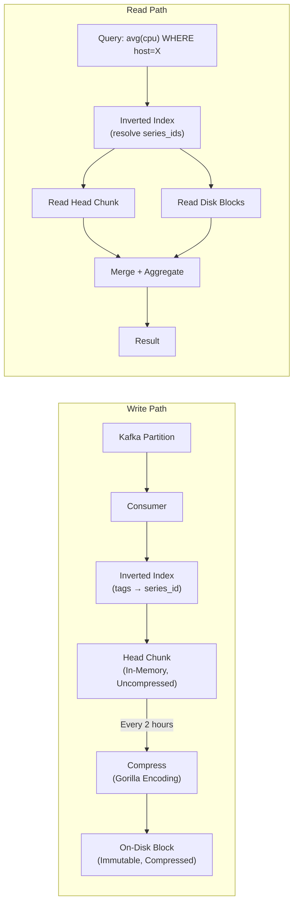
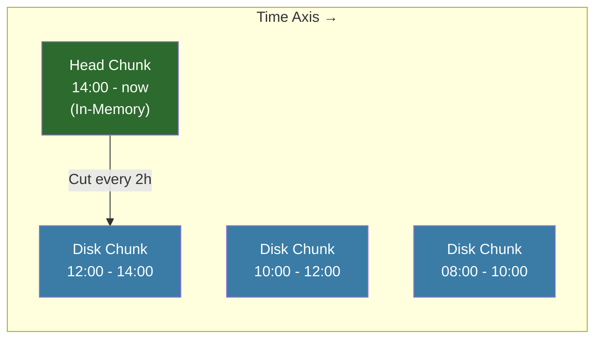
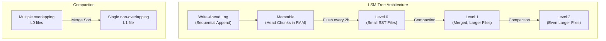
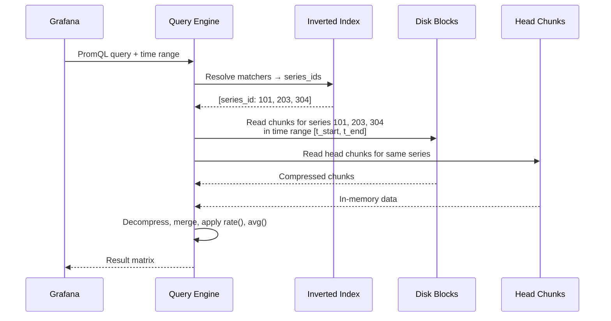
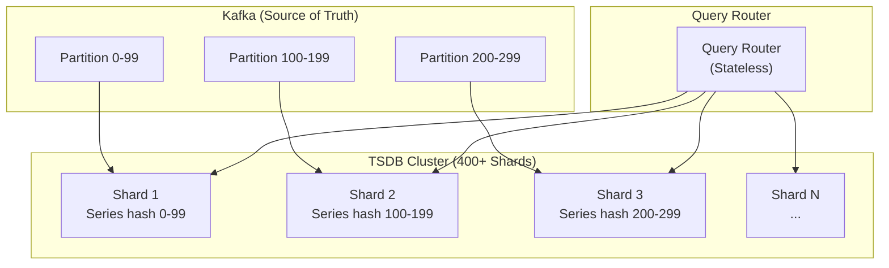

# Chapter 2: The Time-Series Database (TSDB) 🟡

> **The Problem:** You have 2 billion data points per second arriving via Kafka. Each point is a `(timestamp, float64_value)` pair attached to a unique time series. Stored naively, each point consumes 16 bytes (8 for timestamp + 8 for value). At 2B pts/sec, that's **32 GB/s** of raw writes — 2.7 PB/day. This is economically impossible. You need a custom storage engine that compresses a 16-byte data point down to **1.37 bits on average** using Gorilla compression, organized in an LSM-tree backed engine that can serve both high-throughput writes and sub-second dashboard queries.

---

## 2.1 Why Not Use PostgreSQL (or Any General-Purpose Database)?

Let's calculate the naive approach:

```
2 billion points/sec × 16 bytes/point = 32 GB/s raw data
× 86,400 sec/day = 2.76 PB/day
× 365 days = 1,008 PB/year ≈ 1 exabyte/year
```

At S3 pricing (~$0.023/GB/month), storing one year costs **$23.2 million per month** — for the data alone, before indexes or replicas.

| Property | PostgreSQL / MySQL | Purpose-Built TSDB |
|---|---|---|
| **Compression** | Generic (zstd on pages) ~4:1 | Domain-specific (Gorilla) ~100:1 |
| **Write pattern** | B-tree: random I/O per insert | Append-only: sequential I/O |
| **Index** | B-tree on timestamp | Inverted index on tags + time partitioning |
| **Query pattern** | Point lookups, joins | Range scans with aggregation |
| **Storage per point** | ~100+ bytes (row overhead, index) | **~1.37 bits** |

The 100:1 compression ratio is the difference between a viable business and bankruptcy.

---

## 2.2 The Anatomy of a Time-Series Write

When a Kafka consumer reads a metric point, it needs to:

1. **Resolve the series** — Map `(metric_name, tags)` to an internal `series_id` using an inverted index
2. **Append the point** — Write `(timestamp, value)` to the correct chunk for that series
3. **Flush periodically** — Compress and persist chunks to disk



---

## 2.3 Gorilla Compression: From 16 Bytes to 1.37 Bits

Facebook's Gorilla paper (2015) introduced two compression techniques tailored for time-series data: **Delta-of-Delta encoding for timestamps** and **XOR encoding for float values**. The key insight is that adjacent points in a time series are highly similar — timestamps increment by a near-constant interval, and values change slowly.

### 2.3.1 Delta-of-Delta Timestamp Encoding

Metrics typically arrive at a regular interval (e.g., every 10 seconds). The raw timestamps look like:

```
t0 = 1717200000
t1 = 1717200010    delta = 10
t2 = 1717200020    delta = 10
t3 = 1717200030    delta = 10
t4 = 1717200041    delta = 11    (slight jitter)
```

The deltas are nearly constant, so the **delta-of-delta** (DoD) is almost always zero:

```
DoD(t1) = 0     (10 - 10)
DoD(t2) = 0     (10 - 10)
DoD(t3) = 0     (10 - 10)
DoD(t4) = 1     (11 - 10)
```

We encode zero with a single `0` bit:

| Delta-of-Delta Range | Encoding | Bits Used |
|---|---|---|
| DoD = 0 | `0` | **1 bit** |
| DoD ∈ [-63, 64] | `10` + 7-bit value | 9 bits |
| DoD ∈ [-255, 256] | `110` + 9-bit value | 12 bits |
| DoD ∈ [-2047, 2048] | `1110` + 12-bit value | 16 bits |
| Otherwise | `1111` + 32-bit value | 36 bits |

In practice, **96% of timestamps encode as a single bit** (DoD = 0).

```rust
/// Encode a timestamp using Delta-of-Delta compression.
pub struct TimestampEncoder {
    prev_timestamp: u64,
    prev_delta: i64,
    writer: BitWriter,
}

impl TimestampEncoder {
    pub fn encode(&mut self, timestamp: u64) {
        let delta = timestamp as i64 - self.prev_timestamp as i64;
        let dod = delta - self.prev_delta;
        
        match dod {
            0 => {
                // Single zero bit — most common case (~96%)
                self.writer.write_bit(false);
            }
            -63..=64 => {
                self.writer.write_bits(0b10, 2);
                self.writer.write_signed(dod, 7);
            }
            -255..=256 => {
                self.writer.write_bits(0b110, 3);
                self.writer.write_signed(dod, 9);
            }
            -2047..=2048 => {
                self.writer.write_bits(0b1110, 4);
                self.writer.write_signed(dod, 12);
            }
            _ => {
                self.writer.write_bits(0b1111, 4);
                self.writer.write_signed(dod, 32);
            }
        }
        
        self.prev_delta = delta;
        self.prev_timestamp = timestamp;
    }
}
```

### 2.3.2 XOR Encoding for Float Values

CPU usage might look like: `72.5, 72.5, 72.6, 72.5, 72.7`. Adjacent values are often identical or differ only in the low-order bits. XOR of two similar IEEE 754 floats produces a value with many leading and trailing zeros.

The algorithm:

1. XOR the current value with the previous value
2. If XOR = 0 (identical values): write a single `0` bit
3. If XOR ≠ 0: encode the position and length of the "meaningful" (non-zero) bits

```
prev  = 72.5  → 0x40522000_00000000
curr  = 72.6  → 0x40522666_66666666
XOR          = 0x00000666_66666666
                 ^^^^^^^^^^^^^^^^^^
                 leading zeros: 21
                 meaningful bits: 35
                 trailing zeros: 8
```

Instead of storing 64 bits, we store `0` + the 35 meaningful XOR bits = **~37 bits**. And when values repeat (which happens often for gauges), it's just **1 bit**.

```rust
/// Encode a float64 value using XOR compression (Gorilla algorithm).
pub struct ValueEncoder {
    prev_value: u64,       // IEEE 754 bits of previous value
    prev_leading: u8,      // Leading zeros of previous XOR
    prev_trailing: u8,     // Trailing zeros of previous XOR
    writer: BitWriter,
}

impl ValueEncoder {
    pub fn encode(&mut self, value: f64) {
        let current_bits = value.to_bits();
        let xor = current_bits ^ self.prev_value;
        
        if xor == 0 {
            // Identical to previous value — single zero bit
            self.writer.write_bit(false);  // '0'
        } else {
            self.writer.write_bit(true);   // '1' — value changed
            
            let leading = xor.leading_zeros() as u8;
            let trailing = xor.trailing_zeros() as u8;
            
            if leading >= self.prev_leading && trailing >= self.prev_trailing {
                // XOR fits within the previous meaningful-bit window
                self.writer.write_bit(false);  // '0' — reuse window
                let meaningful_bits = 64 - self.prev_leading - self.prev_trailing;
                let shifted = xor >> self.prev_trailing;
                self.writer.write_bits(shifted, meaningful_bits as usize);
            } else {
                // New window needed
                self.writer.write_bit(true);   // '1' — new window
                self.writer.write_bits(leading as u64, 5);   // 5 bits for leading zeros count
                let meaningful_bits = 64 - leading - trailing;
                self.writer.write_bits(meaningful_bits as u64, 6);  // 6 bits for length
                let shifted = xor >> trailing;
                self.writer.write_bits(shifted, meaningful_bits as usize);
            }
            
            self.prev_leading = leading;
            self.prev_trailing = trailing;
        }
        
        self.prev_value = current_bits;
    }
}
```

### 2.3.3 Compression Results

| Scenario | Bits per Timestamp | Bits per Value | Total per Point |
|---|---|---|---|
| **Best case** (constant value, regular interval) | 1 bit | 1 bit | **2 bits** |
| **Average case** (real production data) | 1.05 bits | 0.32 bits | **1.37 bits** |
| **Worst case** (random values, jittery timestamps) | ~16 bits | ~38 bits | ~54 bits |
| **Uncompressed** | 64 bits | 64 bits | 128 bits |

The average case of **1.37 bits/point** (from Facebook's Gorilla paper) represents a **93.3× compression ratio** over raw storage.

Recalculating our earlier numbers:

```
2B pts/sec × 1.37 bits/pt = 342 MB/s (compressed)
vs. 32 GB/s uncompressed → 93× smaller
Daily: 29.6 TB/day (vs. 2.76 PB/day)
Yearly: 10.8 PB/year (vs. 1,008 PB/year)
```

At S3 pricing, that's **$248K/month** instead of $23.2M/month.

---

## 2.4 The Chunk Model

Data is organized into **chunks** — fixed-duration (typically 2-hour) blocks of compressed time-series data:

```rust
/// A single chunk stores all data points for one time series
/// within a 2-hour window, compressed using Gorilla encoding.
pub struct Chunk {
    /// The time series this chunk belongs to
    series_id: u64,
    /// Chunk start time (inclusive)
    min_time: i64,
    /// Chunk end time (inclusive)
    max_time: i64,
    /// Number of data points in this chunk
    num_samples: u32,
    /// Gorilla-compressed data (timestamps + values interleaved)
    data: Vec<u8>,
}
```

### Head Chunk vs. Disk Chunks

| Property | Head Chunk (In-Memory) | Disk Chunk (Immutable) |
|---|---|---|
| **State** | Active — new points appended here | Frozen — read-only after flush |
| **Storage** | RAM | Memory-mapped file on NVMe SSD |
| **Compression** | Gorilla-encoded in real time | Same encoding, stored as contiguous block |
| **Lifespan** | Current 2-hour window | Until rollup or deletion |
| **Mutation** | Append-only | Never mutated |

When the 2-hour window elapses, the head chunk is **cut**: the compressed data is flushed to disk as an immutable block, and a new empty head chunk is created.



---

## 2.5 The Write-Ahead Log (WAL)

Head chunks live in RAM — if the process crashes, all in-memory data is lost. We protect against this with a **Write-Ahead Log**: every incoming point is appended to a sequential log file *before* being added to the head chunk.

```rust
pub struct WriteAheadLog {
    /// The active WAL segment file
    file: std::fs::File,
    /// Current offset in the file
    offset: u64,
    /// Buffer for batching small writes
    buffer: Vec<u8>,
}

impl WriteAheadLog {
    /// Append a data point to the WAL. Called before updating the head chunk.
    pub fn append(&mut self, series_id: u64, timestamp: i64, value: f64) -> std::io::Result<()> {
        // Simple binary format: [series_id:8][timestamp:8][value:8] = 24 bytes
        self.buffer.extend_from_slice(&series_id.to_le_bytes());
        self.buffer.extend_from_slice(&timestamp.to_le_bytes());
        self.buffer.extend_from_slice(&value.to_le_bytes());
        
        // Flush the buffer when it exceeds 4 KB (batch small writes)
        if self.buffer.len() >= 4096 {
            self.flush()?;
        }
        Ok(())
    }
    
    pub fn flush(&mut self) -> std::io::Result<()> {
        use std::io::Write;
        self.file.write_all(&self.buffer)?;
        self.file.sync_data()?;  // fsync — ensures durability
        self.offset += self.buffer.len() as u64;
        self.buffer.clear();
        Ok(())
    }
}
```

On recovery after a crash:

1. Read the last successful disk chunks to establish baseline state
2. Replay the WAL from the beginning to reconstruct head chunks
3. Truncate the WAL and resume normal operation

The WAL is **not compressed** (raw 24-byte records) because write speed matters more than size here — the WAL is short-lived (deleted on each successful chunk cut).

---

## 2.6 The Inverted Index: From Tags to Series

When a user queries `avg(cpu.usage) WHERE service=checkout AND region=us-east-1`, the TSDB must quickly find all `series_id` values matching those tag constraints. This is the job of the **inverted index**.

The index structure mirrors a search engine's inverted index:

```
Tag Key=Value              → Sorted list of series_ids (posting list)
─────────────────────────────────────────────────────────────────────
service=checkout           → [101, 203, 304, 412, 567, ...]
service=payment            → [102, 205, 308, ...]
region=us-east-1           → [101, 102, 203, 205, 304, ...]
region=eu-west-1           → [308, 412, 567, ...]
__name__=cpu.usage         → [101, 102, 203, 304, ...]
```

A query like `service=checkout AND region=us-east-1` is resolved by **intersecting** the posting lists:

```
service=checkout:    [101, 203, 304, 412, 567]
region=us-east-1:    [101, 102, 203, 205, 304]
───────────────────────────────────────────────
Intersection:        [101, 203, 304]
```

Since posting lists are sorted, intersection runs in $O(n + m)$ using a merge-join — no hash table needed.

```rust
/// Intersect two sorted posting lists in O(n + m) time.
pub fn intersect_posting_lists(a: &[u64], b: &[u64]) -> Vec<u64> {
    let mut result = Vec::new();
    let (mut i, mut j) = (0, 0);
    
    while i < a.len() && j < b.len() {
        match a[i].cmp(&b[j]) {
            std::cmp::Ordering::Equal => {
                result.push(a[i]);
                i += 1;
                j += 1;
            }
            std::cmp::Ordering::Less => i += 1,
            std::cmp::Ordering::Greater => j += 1,
        }
    }
    
    result
}
```

### Index Storage

The inverted index is stored on disk as an **SSTable-like structure**: sorted `(tag_key_value, posting_list)` pairs in immutable segment files, with a top-level index mapping tag prefixes to file offsets. This allows:

- **O(log n)** lookup for any tag value (binary search on segment index)
- **Sequential I/O** for posting list reads (contiguous on disk)
- **Efficient compaction** (merge segments in the background, like an LSM-tree)

---

## 2.7 The LSM-Tree Storage Engine

The TSDB's on-disk storage follows the **Log-Structured Merge-tree (LSM-tree)** pattern, which is ideal for write-heavy workloads:



### Why LSM-tree for Time-Series?

| Property | B-tree (PostgreSQL) | LSM-tree (TSDB) |
|---|---|---|
| **Write amplification** | High (random I/O, page splits) | Low (sequential writes) |
| **Write throughput** | ~50K pts/sec | ~5M pts/sec |
| **Space amplification** | Low | Moderate (before compaction) |
| **Read amplification** | Low (single B-tree lookup) | Moderate (check multiple levels) |
| **Compaction cost** | None (in-place updates) | Background CPU + I/O |

For a write-heavy workload like metrics ingestion, the LSM-tree's sequential write pattern is essential. Compaction runs in the background and never blocks the write path.

### Block Structure

Each on-disk block (SSTable) contains:

```
┌─────────────────────────────────────────┐
│ Block Header                             │
│   magic: [u8; 4]                        │
│   version: u16                          │
│   min_time: i64                         │
│   max_time: i64                         │
│   series_count: u32                     │
├─────────────────────────────────────────┤
│ Series Index                             │
│   [(series_id, chunk_offset, chunk_len)] │
├─────────────────────────────────────────┤
│ Chunk Data                               │
│   [Gorilla-compressed chunks...]         │
├─────────────────────────────────────────┤
│ Tag Index                                │
│   [(tag_kv, posting_list)]               │
├─────────────────────────────────────────┤
│ Footer                                   │
│   series_index_offset: u64              │
│   tag_index_offset: u64                 │
│   crc32: u32                            │
└─────────────────────────────────────────┘
```

```rust
/// On-disk block (SSTable) containing compressed time-series data.
pub struct Block {
    pub header: BlockHeader,
    /// Maps series_id → offset in the chunk data section
    pub series_index: Vec<SeriesIndexEntry>,
    /// Gorilla-compressed chunk data (contiguous bytes)
    pub chunk_data: Vec<u8>,
    /// Inverted index for tag-based lookups
    pub tag_index: Vec<TagIndexEntry>,
}

pub struct SeriesIndexEntry {
    pub series_id: u64,
    pub chunk_offset: u64,
    pub chunk_length: u32,
}

pub struct TagIndexEntry {
    pub tag_key_value: String,   // e.g., "service=checkout"
    pub posting_list: Vec<u64>,  // sorted series_ids
}
```

---

## 2.8 Compaction

As chunks are flushed to disk, Level 0 accumulates many small, potentially overlapping files. **Compaction** merges these into larger, non-overlapping files at higher levels:

```rust
/// Compact multiple Level-N blocks into a single Level-(N+1) block.
pub fn compact(blocks: &[Block]) -> Block {
    // 1. Merge all series data by series_id
    let mut merged_series: BTreeMap<u64, Vec<Chunk>> = BTreeMap::new();
    for block in blocks {
        for entry in &block.series_index {
            let chunk = block.read_chunk(entry);
            merged_series
                .entry(entry.series_id)
                .or_default()
                .push(chunk);
        }
    }
    
    // 2. For each series, merge and re-compress chunks
    let mut new_block = Block::new();
    for (series_id, chunks) in merged_series {
        let merged_chunk = merge_chunks(&chunks);
        new_block.add_series(series_id, merged_chunk);
    }
    
    // 3. Rebuild the tag index from all contributing blocks
    new_block.tag_index = merge_tag_indices(
        blocks.iter().map(|b| &b.tag_index)
    );
    
    new_block
}
```

Compaction is **essential** for read performance: without it, a query would need to check dozens of Level-0 files for each series. After compaction, each time range has exactly one file per level — reducing read amplification dramatically.

---

## 2.9 The Query Path: From PromQL to Bytes

When a user types `avg(rate(http_request_duration_seconds[5m])) by (service)` in Grafana:



### Query Performance Optimizations

| Optimization | Description | Impact |
|---|---|---|
| **Time partitioning** | Blocks are partitioned by 2-hour windows; only relevant blocks are scanned | Skip 90%+ of data for narrow queries |
| **Posting list caching** | Frequently-queried tag intersections cached in LRU | 10× speedup on dashboard queries |
| **Chunk prefetch** | When reading one chunk, prefetch adjacent chunks for same series | Reduces random I/O on range queries |
| **Parallel decompression** | Decompress chunks across `rayon` thread pool | Linear speedup with CPU cores |
| **Predicate pushdown** | Push time-range predicate to block selection layer | Avoid decompressing chunks outside query range |

```rust
/// Execute a time-series query with predicate pushdown.
pub fn query(
    index: &InvertedIndex,
    blocks: &BlockStore,
    head: &HeadChunkStore,
    matchers: &[TagMatcher],
    time_range: Range<i64>,
) -> Vec<TimeSeries> {
    // Step 1: Resolve series_ids from tag matchers
    let series_ids = index.resolve_matchers(matchers);
    
    // Step 2: Find relevant blocks (time-range pushdown)
    let relevant_blocks = blocks.blocks_in_range(&time_range);
    
    // Step 3: Read and decompress chunks in parallel
    let disk_data: Vec<_> = relevant_blocks
        .par_iter()  // rayon parallel iterator
        .flat_map(|block| {
            series_ids.iter().filter_map(|&sid| {
                block.read_chunk_if_exists(sid, &time_range)
            })
        })
        .collect();
    
    // Step 4: Read head chunks (in-memory, always fast)
    let head_data: Vec<_> = series_ids.iter()
        .filter_map(|&sid| head.read_chunk(sid, &time_range))
        .collect();
    
    // Step 5: Merge disk + head data per series
    merge_and_aggregate(disk_data, head_data, &series_ids)
}
```

---

## 2.10 TSDB Sharding and Replication

A single TSDB node can handle ~5M points/sec of writes and ~200K queries/sec. For our 2B pts/sec ingestion rate, we need **400+ TSDB shards**. Sharding is based on a consistent hash of the series key — the same key used for Kafka partitioning (Chapter 1).

| Component | Scaling Strategy | Failure Mode |
|---|---|---|
| **Write path** | Shard by series key hash | Shard failure → Kafka lag builds; recover by replay |
| **Read path** | Query router fans out to all shards holding relevant data | Shard failure → partial results (mark as incomplete) |
| **Inverted index** | Co-located with data shard | Rebuild from WAL on recovery |
| **Replication** | Kafka-based (each replica consumes same partitions) | Replica failure → promote standby |



### Replication via Kafka Replay

Unlike traditional databases that replicate via leader-follower log shipping, we use **Kafka as the replication mechanism**:

- Each TSDB shard consumes from a set of Kafka partitions
- The **replica shard** consumes the same partitions (via a different consumer group)
- Both shards contain identical data — Kafka guarantees the same messages in the same order
- On primary failure, the replica is already caught up and can serve reads immediately

This is simpler and more robust than building a custom replication protocol.

---

## 2.11 Benchmarks: Putting It All Together

| Metric | Naive (PostgreSQL) | Gorilla TSDB |
|---|---|---|
| **Bytes per point** | ~100 bytes | **0.17 bytes** (1.37 bits) |
| **Write throughput (single node)** | 50K pts/sec | **5M pts/sec** |
| **Storage (1 year, 2B pts/sec)** | 1,008 PB | **10.8 PB** |
| **Storage cost (S3, 1 year)** | $278M | **$3M** |
| **Query latency (1 series, 1 hour)** | ~500 ms | **< 10 ms** |
| **Query latency (1000 series, 1 hour)** | ~30 seconds | **< 200 ms** |
| **RAM per active series (index)** | ~1 KB | **~200 bytes** |

---

## 2.12 Summary and Design Decisions

| Decision | Choice | Alternative | Why |
|---|---|---|---|
| Compression | Gorilla (DoD + XOR) | zstd, LZ4, dictionary | Domain-specific: 93× vs. ~4× compression |
| Storage engine | LSM-tree | B-tree, append-only log | Write-optimized; compaction keeps reads fast |
| Chunk duration | 2 hours | 1 hour, 4 hours | Balance between flush frequency and chunk size |
| WAL format | Uncompressed 24-byte records | Compressed WAL | WAL is short-lived; speed > size |
| Inverted index | Posting lists with merge-join | Hash index, Bitmap index | Sorted lists enable efficient intersection and range queries |
| Sharding | Consistent hash on series key | Time-based sharding | Keeps all points for one series on one shard |
| Replication | Kafka-based (consumer group) | Leader-follower, Raft | Simpler; Kafka already guarantees ordering |
| Query parallelism | Rayon thread pool | Sequential, async I/O | CPU-bound decompression benefits from parallelism |

> **Key Takeaways**
> 
> 1. **Gorilla compression is the foundation.** The 93× compression ratio makes petabyte-scale time-series storage economically viable. Without it, the platform cannot exist.
> 2. **The inverted index is the TSDB's brain.** Fast tag-to-series resolution via posting list intersection enables sub-second dashboard queries across billions of series.
> 3. **LSM-trees match time-series write patterns perfectly.** Append-only writes → sequential I/O → maximum disk throughput. Background compaction keeps read amplification under control.
> 4. **Kafka as the replication layer** eliminates the need for a custom replication protocol. Each shard is just a Kafka consumer — recovery is replay.
> 5. **The chunk model (2-hour immutable blocks)** bridges the gap between in-memory write speed and on-disk read efficiency. Head chunks absorb writes; disk chunks serve historical queries.
