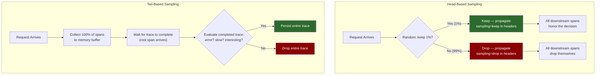
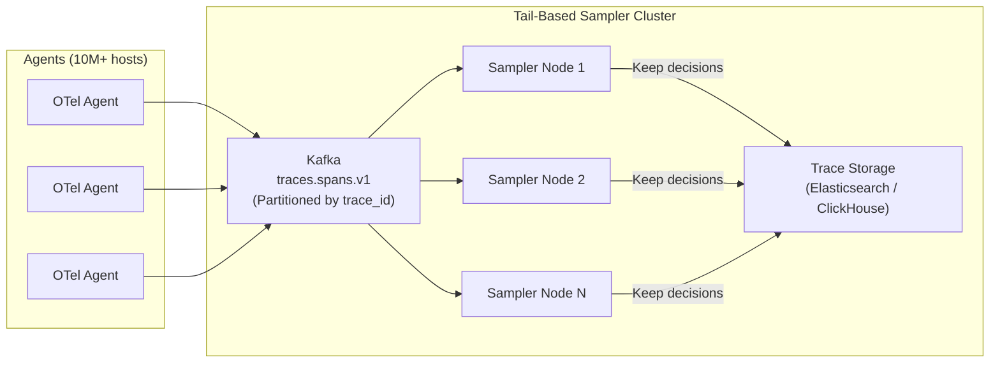
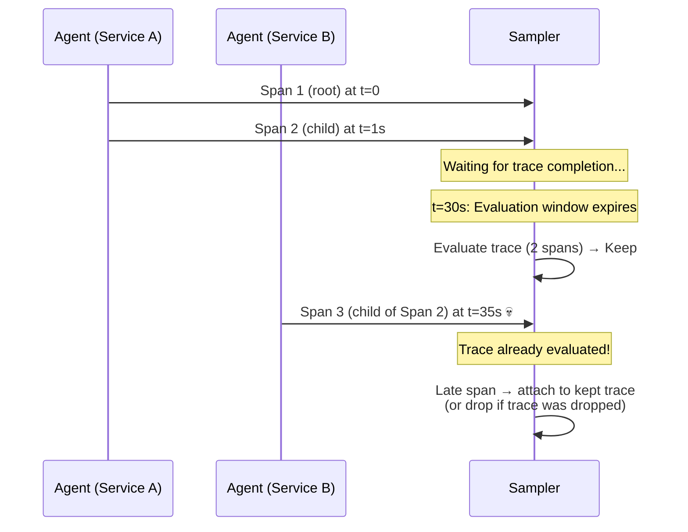
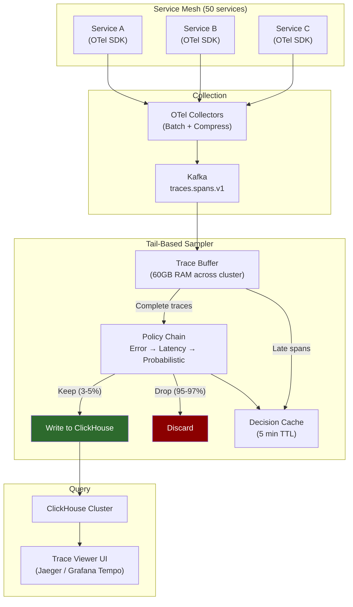

# Chapter 3: Distributed Tracing and Tail-Based Sampling 🔴

> **The Problem:** A user's checkout request traverses 50 microservices, spawning 200+ trace spans across 15 different teams' codebases. You need to capture the entire request lifecycle — every service hop, every database query, every cache miss — and reconstruct it into a single, visualizable trace. But at 2 million spans per second, storing 100% of traces would cost $50M/year. Head-based sampling (randomly keeping 1%) saves money but **guarantees you will miss the errors and slow requests that actually matter**. You need a tail-based sampling architecture that holds 100% of spans in memory, waits for the trace to complete, and only persists the traces that contain errors, high latency, or other interesting signals.

---

## 3.1 What Is a Distributed Trace?

A **trace** represents the complete journey of a single request through a distributed system. It is composed of **spans** — each span represents one unit of work (an HTTP call, a database query, a message publish).

```
Trace ID: abc-123-def-456

├─ [Span A] API Gateway         (0ms → 250ms)          root span
│  ├─ [Span B] Auth Service      (5ms → 30ms)          child of A
│  ├─ [Span C] Checkout Service  (35ms → 240ms)        child of A
│  │  ├─ [Span D] Inventory DB   (40ms → 60ms)         child of C
│  │  ├─ [Span E] Payment Service(65ms → 200ms)        child of C
│  │  │  ├─ [Span F] Stripe API  (70ms → 190ms)        child of E
│  │  │  └─ [Span G] Fraud Check (72ms → 85ms)         child of E
│  │  └─ [Span H] Order DB Write (205ms → 230ms)       child of C
│  └─ [Span I] Response Marshal  (242ms → 248ms)       child of A
```

Each span carries:

```rust
/// A single span in a distributed trace.
pub struct Span {
    /// Globally unique trace identifier (128-bit, hex-encoded)
    pub trace_id: TraceId,
    /// Unique identifier for this span within the trace
    pub span_id: SpanId,
    /// The parent span (None for root spans)
    pub parent_span_id: Option<SpanId>,
    /// Service that generated this span
    pub service_name: String,
    /// Operation name (e.g., "POST /checkout", "SELECT orders")
    pub operation_name: String,
    /// Start time in nanoseconds since epoch
    pub start_time_ns: u64,
    /// Duration in nanoseconds
    pub duration_ns: u64,
    /// Status: Ok, Error, or Unset
    pub status: SpanStatus,
    /// Key-value attributes (high cardinality is fine here!)
    pub attributes: HashMap<String, AttributeValue>,
    /// Timestamped log events within the span
    pub events: Vec<SpanEvent>,
}
```

**Critical insight:** Unlike metrics, traces *can* carry high-cardinality attributes like `user_id`, `order_id`, and `request_id`. These are attributes on spans, not metric tags — they do not create new time series. This is exactly where high-cardinality data belongs.

---

## 3.2 The Sampling Problem

At scale, storing every trace is economically impossible:

```
2 million spans/sec × 500 bytes/span = 1 GB/sec raw
× 86,400 sec/day = 86 TB/day
× 30 days retention = 2.6 PB
```

Storage alone would cost $60K/month on S3, plus compute for indexing and querying. Most companies cannot justify this when **99% of traces are completely normal** — the same happy path, over and over.

We need sampling. The question is: **when do you decide which traces to keep?**

### Head-Based vs. Tail-Based Sampling



| Property | Head-Based (1% Random) | Tail-Based (Error-Biased) |
|---|---|---|
| **Decision point** | At the root span, before the request starts | After the trace completes |
| **Error retention** | 1% of errors (same rate as happy paths) | **100% of errors** |
| **Latency outlier retention** | 1% of slow requests | **100% of p99+ requests** |
| **Infrastructure cost** | Very low (discard 99% immediately) | High (buffer 100% in RAM temporarily) |
| **Complexity** | Trivial (random coin flip) | High (trace assembly, timeout handling, distributed state) |
| **Storage savings** | 99% | 95–99% (keeps all interesting traces) |

> **The fundamental truth:** Head-based sampling is statistically sound for aggregate analysis ("what is the average latency?") but **catastrophically bad for debugging**. If your checkout service has a 0.1% error rate and you sample at 1%, you keep 0.001% of error traces — essentially zero. The one trace an on-call engineer needs at 3 AM is almost certainly in the 99% you discarded.

---

## 3.3 Architecting Tail-Based Sampling

The tail-based sampler sits between Kafka and the trace storage backend. It consumes 100% of spans from the `traces.spans.v1` Kafka topic and makes keep/drop decisions only after a trace is "complete."



### The Core Challenge: Trace Assembly

Spans for a single trace arrive from different services, at different times, potentially to different sampler nodes. The sampler must **assemble all spans for a trace on a single node** before making a keep/drop decision.

This is solved by **Kafka's partitioning**: spans are partitioned by `trace_id`, so all spans for the same trace are consumed by the same sampler node.

```rust
/// Compute the Kafka partition key for a span.
/// All spans with the same trace_id MUST go to the same partition.
fn span_partition_key(trace_id: &TraceId) -> Vec<u8> {
    // trace_id is a 128-bit random value; its hash distribution is already uniform
    trace_id.as_bytes()[0..8].to_vec()
}
```

---

## 3.4 The In-Memory Trace Buffer

Each sampler node maintains an in-memory buffer that temporarily holds all spans for traces that haven't completed yet. The buffer is organized as a hash map from `trace_id` to a `PendingTrace`:

```rust
use std::collections::HashMap;
use std::time::Instant;

/// A trace that is still being assembled — collecting spans.
pub struct PendingTrace {
    /// All spans received so far for this trace
    pub spans: Vec<Span>,
    /// When the first span for this trace was received
    pub first_seen: Instant,
    /// Whether we've seen the root span (parent_span_id = None)
    pub has_root: bool,
    /// Running state: have any spans reported errors?
    pub has_error: bool,
    /// Running state: maximum span duration seen so far
    pub max_duration_ns: u64,
}

pub struct TraceBuffer {
    /// In-flight traces, keyed by trace_id
    pending: HashMap<TraceId, PendingTrace>,
    /// Maximum number of traces to hold in memory
    max_traces: usize,
    /// Maximum time to wait for a trace to complete
    completion_timeout: Duration,
}

impl TraceBuffer {
    /// Called for every span consumed from Kafka.
    pub fn add_span(&mut self, span: Span) -> Option<SamplingDecision> {
        let trace = self.pending
            .entry(span.trace_id.clone())
            .or_insert_with(|| PendingTrace {
                spans: Vec::new(),
                first_seen: Instant::now(),
                has_root: false,
                has_error: false,
                max_duration_ns: 0,
            });
        
        // Update running state
        if span.parent_span_id.is_none() {
            trace.has_root = true;
        }
        if span.status == SpanStatus::Error {
            trace.has_error = true;
        }
        if span.duration_ns > trace.max_duration_ns {
            trace.max_duration_ns = span.duration_ns;
        }
        
        trace.spans.push(span);
        
        // Check if this trace is ready for a sampling decision
        if trace.has_root && self.is_complete(&trace) {
            let trace = self.pending.remove(&trace.spans[0].trace_id)?;
            Some(self.evaluate(trace))
        } else {
            None
        }
    }
    
    /// A trace is "complete" when we have the root span and
    /// a grace period has passed for late-arriving child spans.
    fn is_complete(&self, trace: &PendingTrace) -> bool {
        trace.has_root && trace.first_seen.elapsed() > Duration::from_secs(30)
    }
}
```

### Memory Sizing

| Parameter | Value |
|---|---|
| **Span size in memory** | ~1 KB (including attributes) |
| **Average spans per trace** | 50 |
| **Average trace duration** | 5 seconds |
| **Buffer hold time** | 30 seconds (grace period for late spans) |
| **Span ingest rate** | 2M spans/sec |
| **Spans in buffer at steady state** | 2M × 30s = 60M spans |
| **RAM required** | 60M × 1 KB = **60 GB** |

With 10 sampler nodes, each holds ~6 GB — well within a single machine's RAM. The buffer is ephemeral — traces older than 30 seconds are force-evaluated and evicted.

---

## 3.5 Sampling Policies

When a trace is complete (or times out), the sampler evaluates it against a set of **sampling policies** to decide keep or drop:

```rust
/// A sampling policy determines whether a completed trace should be kept.
pub trait SamplingPolicy: Send + Sync {
    fn evaluate(&self, trace: &PendingTrace) -> SamplingVerdict;
    fn name(&self) -> &str;
}

pub enum SamplingVerdict {
    /// Definitely keep this trace (overrides drop decisions)
    Keep,
    /// Suggest dropping (can be overridden by other policies)
    Drop,
    /// No opinion — let other policies decide
    Abstain,
}
```

### Built-in Policies

```rust
/// Always keep traces that contain errors.
pub struct ErrorPolicy;

impl SamplingPolicy for ErrorPolicy {
    fn evaluate(&self, trace: &PendingTrace) -> SamplingVerdict {
        if trace.has_error {
            SamplingVerdict::Keep
        } else {
            SamplingVerdict::Abstain
        }
    }
    
    fn name(&self) -> &str { "error" }
}

/// Keep traces where the root span duration exceeds a threshold.
pub struct LatencyPolicy {
    threshold_ms: u64,
}

impl SamplingPolicy for LatencyPolicy {
    fn evaluate(&self, trace: &PendingTrace) -> SamplingVerdict {
        let root_duration_ms = trace.spans.iter()
            .find(|s| s.parent_span_id.is_none())
            .map(|s| s.duration_ns / 1_000_000)
            .unwrap_or(0);
        
        if root_duration_ms > self.threshold_ms {
            SamplingVerdict::Keep
        } else {
            SamplingVerdict::Abstain
        }
    }
    
    fn name(&self) -> &str { "latency" }
}

/// Keep a random percentage of all traces (for baseline coverage).
pub struct ProbabilisticPolicy {
    keep_rate: f64,  // 0.0 to 1.0
}

impl SamplingPolicy for ProbabilisticPolicy {
    fn evaluate(&self, trace: &PendingTrace) -> SamplingVerdict {
        // Use trace_id as seed for deterministic sampling
        let hash = hash_trace_id(&trace.spans[0].trace_id);
        if (hash as f64 / u64::MAX as f64) < self.keep_rate {
            SamplingVerdict::Keep
        } else {
            SamplingVerdict::Drop
        }
    }
    
    fn name(&self) -> &str { "probabilistic" }
}

/// Keep traces matching specific attribute patterns (e.g., VIP users).
pub struct AttributePolicy {
    key: String,
    value_pattern: regex::Regex,
}

impl SamplingPolicy for AttributePolicy {
    fn evaluate(&self, trace: &PendingTrace) -> SamplingVerdict {
        for span in &trace.spans {
            if let Some(AttributeValue::String(val)) = span.attributes.get(&self.key) {
                if self.value_pattern.is_match(val) {
                    return SamplingVerdict::Keep;
                }
            }
        }
        SamplingVerdict::Abstain
    }
    
    fn name(&self) -> &str { "attribute" }
}
```

### Policy Evaluation

Policies are evaluated in order. A single `Keep` verdict wins. If all policies `Abstain`, the fallback `ProbabilisticPolicy` decides.

```rust
pub struct PolicyChain {
    policies: Vec<Box<dyn SamplingPolicy>>,
}

impl PolicyChain {
    pub fn evaluate(&self, trace: &PendingTrace) -> bool {
        for policy in &self.policies {
            match policy.evaluate(trace) {
                SamplingVerdict::Keep => {
                    METRICS.sampling_kept.with_label(policy.name()).increment(1);
                    return true;
                }
                SamplingVerdict::Drop => {
                    METRICS.sampling_dropped.with_label(policy.name()).increment(1);
                    return false;
                }
                SamplingVerdict::Abstain => continue,
            }
        }
        false // Default: drop if no policy has an opinion
    }
}
```

### Typical Policy Configuration

| Policy | Priority | Rate | Effect |
|---|---|---|---|
| **Error** | 1 (highest) | 100% of error traces | Never miss a bug |
| **Latency** (> 5s) | 2 | 100% of slow traces | Catch performance regressions |
| **VIP Users** | 3 | 100% of traces with `user.tier=enterprise` | Debug VIP issues immediately |
| **New Deployments** | 4 | 100% of traces with `deployment.version=canary` | Full visibility during rollouts |
| **Probabilistic** | 5 (lowest) | 1% random baseline | Aggregate analysis, capacity planning |

With this configuration, the sampler typically keeps **3–5%** of all traces — but it keeps **100% of the traces that matter**.

---

## 3.6 Handling Late and Orphaned Spans

Distributed systems are messy. Spans do not arrive in order, root spans may arrive last, and some spans may never arrive at all.

### Late Span Arrival

A child span from a slow downstream service may arrive after the trace's 30-second evaluation window:



**Solution:** Maintain a **decision cache** — a map from `trace_id` to the sampling decision, kept for 5 minutes after evaluation. Late-arriving spans check the cache:

```rust
pub struct DecisionCache {
    /// Maps trace_id → (keep/drop, expiry_time)
    decisions: HashMap<TraceId, (bool, Instant)>,
}

impl DecisionCache {
    pub fn record_decision(&mut self, trace_id: TraceId, keep: bool) {
        self.decisions.insert(trace_id, (keep, Instant::now() + Duration::from_secs(300)));
    }
    
    pub fn lookup(&self, trace_id: &TraceId) -> Option<bool> {
        self.decisions.get(trace_id)
            .filter(|(_, expiry)| Instant::now() < *expiry)
            .map(|(keep, _)| *keep)
    }
}
```

### Orphaned Spans

Some spans may arrive but their root span never does (the originating service crashed, or the root span was dropped by a buggy agent). The 30-second evaluation timeout handles this — orphaned traces are force-evaluated. If they contain errors, they're still kept (even without the root span providing full context).

---

## 3.7 Trace Storage Backend

Kept traces are written to a trace storage backend optimized for two query patterns:

1. **Point lookup:** "Show me trace `abc-123-def-456`" — retrieve all spans for a single trace
2. **Scatter query:** "Show me the slowest traces for `service=checkout` in the last hour" — scan + filter + sort

| Backend | Point Lookup | Scatter Query | Compression | Operational Complexity |
|---|---|---|---|---|
| **Elasticsearch** | ✅ Excellent (by trace_id) | ✅ Good (full-text + numeric) | ~5:1 | High (JVM tuning, shard management) |
| **ClickHouse** | ✅ Good (primary key) | ✅ Excellent (columnar scans) | ~10:1 | Medium (simpler operations) |
| **Cassandra** | ✅ Excellent (partition key) | ❌ Poor (no efficient scanning) | ~3:1 | Medium |
| **Custom (Parquet + S3)** | ⚠️ Requires index | ✅ Good (columnar) | ~12:1 | Low (serverless) |

For most deployments, **ClickHouse** provides the best balance: columnar storage gives excellent compression and scan performance, while the primary key on `(trace_id, span_id)` enables fast point lookups.

### Schema Design (ClickHouse)

```sql
CREATE TABLE traces.spans (
    trace_id        FixedString(32),
    span_id         FixedString(16),
    parent_span_id  Nullable(FixedString(16)),
    service_name    LowCardinality(String),
    operation_name  String,
    start_time_ns   UInt64,
    duration_ns     UInt64,
    status          Enum8('OK' = 0, 'ERROR' = 1, 'UNSET' = 2),
    -- Attributes stored as parallel arrays (columnar-friendly)
    attribute_keys   Array(String),
    attribute_values Array(String),
    -- Materialized columns for common query patterns
    has_error        UInt8 MATERIALIZED (status = 'ERROR'),
    duration_ms      Float64 MATERIALIZED (duration_ns / 1000000.0)
) ENGINE = MergeTree()
PARTITION BY toDate(fromUnixTimestamp64Nano(start_time_ns))
ORDER BY (trace_id, span_id)
TTL toDate(fromUnixTimestamp64Nano(start_time_ns)) + INTERVAL 30 DAY;
```

---

## 3.8 The Trace Assembly Pipeline: End-to-End

Putting it all together, here is the complete data flow from agent to query:



---

## 3.9 Context Propagation: The Invisible Backbone

None of this works without **distributed context propagation** — the mechanism that ensures every service in a request path uses the same `trace_id`. The W3C Trace Context standard defines two HTTP headers:

```
traceparent: 00-abc123def456789012345678abcdef01-0102030405060708-01
             ^^  ^^^^^^^^^^^^^^^^^^^^^^^^^^^^^^^^  ^^^^^^^^^^^^^^^^  ^^
             ver           trace_id                    span_id     flags
             
tracestate: vendor1=value1,vendor2=value2
```

Every service extracts `trace_id` from the incoming request, creates a new `span_id`, and propagates the updated `traceparent` to all outgoing calls:

```rust
/// Extract trace context from incoming HTTP headers.
pub fn extract_context(headers: &http::HeaderMap) -> Option<TraceContext> {
    let traceparent = headers.get("traceparent")?.to_str().ok()?;
    let parts: Vec<&str> = traceparent.split('-').collect();
    
    if parts.len() != 4 || parts[0] != "00" {
        return None;
    }
    
    Some(TraceContext {
        trace_id: TraceId::from_hex(parts[1]).ok()?,
        parent_span_id: SpanId::from_hex(parts[2]).ok()?,
        trace_flags: u8::from_str_radix(parts[3], 16).ok()?,
    })
}

/// Inject trace context into outgoing HTTP headers.
pub fn inject_context(headers: &mut http::HeaderMap, ctx: &TraceContext, new_span_id: &SpanId) {
    let traceparent = format!(
        "00-{}-{}-{:02x}",
        ctx.trace_id.to_hex(),
        new_span_id.to_hex(),
        ctx.trace_flags
    );
    headers.insert("traceparent", traceparent.parse().unwrap());
}
```

If even one service in the chain fails to propagate context, the trace is broken — you get disconnected fragments instead of a coherent tree. This is why **OTel auto-instrumentation** (which wraps HTTP clients and servers at the framework level) is critical.

---

## 3.10 Metrics Derived from Traces: RED Signals

A powerful side-effect of collecting traces is that you can derive **RED metrics** (Rate, Errors, Duration) directly from the span stream — before sampling:

```rust
/// Derive RED metrics from the raw span stream (pre-sampling).
/// These counters are emitted as metrics to the TSDB.
pub fn derive_red_metrics(span: &Span) {
    // Rate: count every root span
    if span.parent_span_id.is_none() {
        METRICS.request_rate
            .with_labels(&[
                ("service", &span.service_name),
                ("operation", &span.operation_name),
            ])
            .increment(1);
    }
    
    // Errors: count error spans
    if span.status == SpanStatus::Error {
        METRICS.error_rate
            .with_labels(&[
                ("service", &span.service_name),
                ("operation", &span.operation_name),
            ])
            .increment(1);
    }
    
    // Duration: record span duration in histogram
    METRICS.request_duration
        .with_labels(&[
            ("service", &span.service_name),
            ("operation", &span.operation_name),
        ])
        .observe(span.duration_ns as f64 / 1_000_000.0);
}
```

These metrics are computed from **100% of spans** (before the sampler drops anything), which means they are statistically accurate — unlike metrics derived from sampled data.

---

## 3.11 Scaling the Sampler

| Parameter | Value |
|---|---|
| **Span ingest rate** | 2M spans/sec |
| **Sampler nodes** | 10 |
| **Spans per node** | 200K/sec |
| **RAM per node** | 6 GB (buffer) + 2 GB (decision cache) = 8 GB |
| **CPU per node** | 4 cores (hashing, policy evaluation) |
| **Kafka partitions** | 1000 (100 partitions per sampler node) |

Scaling is horizontal and stateless (except for the in-memory buffer, which is reconstructed from Kafka on restart):

- **More throughput:** Add sampler nodes + rebalance Kafka partitions
- **More buffer time:** Increase RAM per node
- **More complex policies:** Add CPU per node

---

## 3.12 Summary and Design Decisions

| Decision | Choice | Alternative | Why |
|---|---|---|---|
| Sampling strategy | Tail-based | Head-based, hybrid | 100% error retention is non-negotiable for debugging |
| Trace partitioning | By `trace_id` in Kafka | By service name, random | All spans for a trace on one sampler node |
| Buffer duration | 30 seconds | 10s, 60s, 5 min | Covers 99.9% of trace durations without excessive RAM |
| Completion detection | Root span received + grace period | Span count heuristic, timeout only | Root span is the reliable "trace is done" signal |
| Late span handling | Decision cache (5min TTL) | Drop, buffer indefinitely | Bounded memory with good late-span coverage |
| Storage backend | ClickHouse | Elasticsearch, Cassandra | Best balance of columnar compression and point lookups |
| Context propagation | W3C Trace Context | B3, Jaeger native | Industry standard; prevents vendor lock-in |
| RED metrics | Derived pre-sampling from 100% of spans | Derived post-sampling | Accurate aggregates even at 1% sample rate |

> **Key Takeaways**
> 
> 1. **Tail-based sampling is the only strategy that guarantees you keep 100% of error traces.** Head-based sampling is a coin flip that discards errors at the same rate as successes — unacceptable for production debugging.
> 2. **The in-memory trace buffer is the core architectural challenge.** Sizing it correctly (spans × hold time × span size) determines your RAM requirements. Kafka partitioning by `trace_id` is what makes single-node assembly possible.
> 3. **Sampling policies are a product, not a feature.** The ability to define "keep all error traces" + "keep all traces > 5s" + "keep all VIP traces" + "1% random baseline" is what separates a toy sampler from a production-grade system.
> 4. **Derive RED metrics before sampling.** The span stream contains statistically perfect rate, error, and duration data. Extract it before the sampler drops 97% of the data.
> 5. **Context propagation is the invisible backbone.** If any service breaks the `traceparent` header chain, the entire trace fragments. Auto-instrumentation via the OTel SDK is essential.
