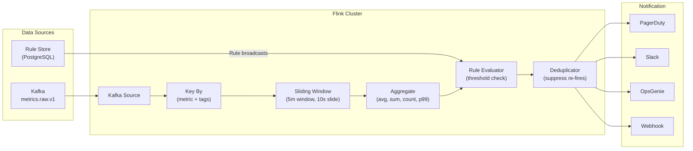
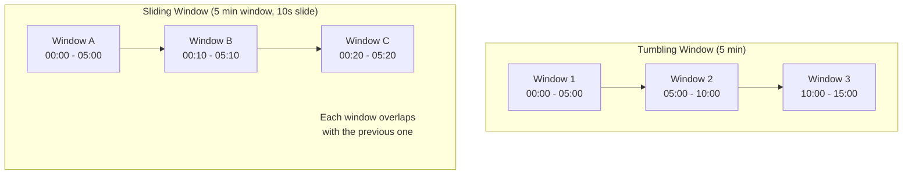
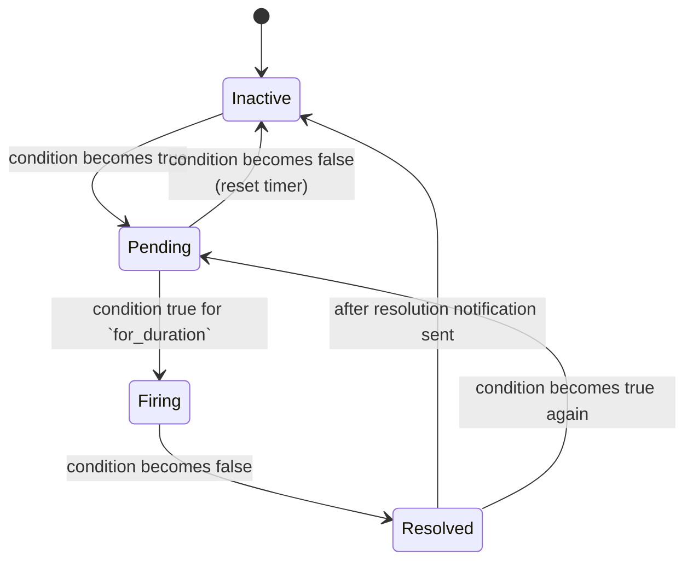

# Chapter 4: The Streaming Alert Engine 🔴

> **The Problem:** You have 50,000 alert rules like *"Error rate > 5% over a 5-minute sliding window for service=checkout"*. These rules must be evaluated against the **live metric stream** — before the data hits the TSDB — because an alert that fires 30 seconds late is an alert that pages an engineer 30 seconds into a cascading failure. You need a streaming computation engine that continuously evaluates complex windowed aggregations over 2 billion data points per second, with p99 evaluation latency under 200 milliseconds, while handling rule changes, deduplication, and multi-channel notification routing.

---

## 4.1 Why Not Query the TSDB for Alerts?

The naive approach: run a cron job every 60 seconds that executes each alert rule as a PromQL query against the TSDB.

```
Every 60 seconds:
  For each of 50,000 rules:
    Execute: avg(rate(http_errors[5m])) / avg(rate(http_requests[5m])) > 0.05
    If true: fire alert
```

This fails at scale for three reasons:

| Problem | Impact |
|---|---|
| **Latency** | 50K queries × ~50ms each = **41 minutes** to evaluate all rules. By the time rule #50,000 fires, the incident is 41 minutes old. |
| **TSDB load** | 50K queries/minute = 833 queries/sec *on top of* dashboard traffic. This doubles the TSDB's read load. |
| **Granularity** | With 60-second evaluation intervals, you can miss a 30-second error spike that starts and ends between evaluations. |

The streaming approach eliminates all three problems: rules are evaluated **continuously** as data arrives, with sub-second latency, zero TSDB load, and no blind spots.

| Property | Poll-Based (TSDB Query) | Streaming (Flink) |
|---|---|---|
| **Evaluation frequency** | Every 60 seconds | Continuous (per-event) |
| **Alert delay** | 60–120 seconds | **< 5 seconds** |
| **TSDB load** | +833 queries/sec | **Zero** (reads from Kafka) |
| **Missed spikes** | Anything < eval interval | **None** (every point triggers evaluation) |
| **Scalability** | Limited by TSDB read capacity | Scales horizontally with Kafka partitions |

---

## 4.2 Architecture: Apache Flink as the Alert Engine

Apache Flink is a distributed stream processing engine designed for exactly this workload: stateful, windowed computation over high-throughput data streams. We embed alert evaluation logic as a Flink job.



### Why Flink?

| Requirement | Flink Feature |
|---|---|
| **Sliding windows** | Native sliding/tumbling/session window support |
| **Stateful computation** | Managed state with RocksDB backend + checkpointing |
| **Exactly-once semantics** | Kafka source checkpointing ensures no missed or duplicate evaluations |
| **Horizontal scaling** | Parallelism = Kafka partition count |
| **Late data handling** | Watermarks + allowed lateness for out-of-order events |
| **Backpressure** | Builtin; slow operators cause upstream buffering, not data loss |

---

## 4.3 Alert Rule Data Model

An alert rule is a declarative specification of what condition to monitor and how to respond:

```rust
/// A single alert rule configuration.
pub struct AlertRule {
    /// Unique rule identifier
    pub id: RuleId,
    /// Human-readable name: "Checkout Error Rate High"
    pub name: String,
    /// The metric to evaluate
    pub metric: String,
    /// Tag matchers (filters): service=checkout, region=us-east-1
    pub matchers: Vec<TagMatcher>,
    /// Aggregation function: Avg, Sum, Count, P99, Rate
    pub aggregation: AggregationFunction,
    /// Window duration: how far back to look
    pub window: Duration,
    /// Comparison operator and threshold
    pub condition: AlertCondition,
    /// How long the condition must be true before firing
    pub for_duration: Duration,
    /// Severity: Critical, Warning, Info
    pub severity: Severity,
    /// Notification channels
    pub notify: Vec<NotificationChannel>,
    /// Labels to attach to fired alerts (for routing)
    pub labels: HashMap<String, String>,
    /// Annotations (human-readable context)
    pub annotations: HashMap<String, String>,
}

pub enum AggregationFunction {
    Avg,
    Sum,
    Count,
    Min,
    Max,
    P50,
    P99,
    Rate,
}

pub enum AlertCondition {
    Above(f64),       // value > threshold
    Below(f64),       // value < threshold
    AboveOrEqual(f64),
    BelowOrEqual(f64),
    OutsideRange(f64, f64),  // value < low OR value > high
}

pub enum Severity {
    Critical,  // Pages on-call immediately
    Warning,   // Slack notification, no page
    Info,      // Dashboard annotation only
}
```

### Example Rules

```yaml
# Rule 1: High error rate on checkout
- name: "Checkout Error Rate > 5%"
  metric: "http.server.request.count"
  matchers:
    - service = checkout
    - status =~ "5.."
  aggregation: rate
  window: 5m
  condition: above 0.05
  for: 2m
  severity: critical
  notify: [pagerduty-oncall, slack-incidents]

# Rule 2: High memory usage
- name: "Memory Usage > 90%"
  metric: "system.memory.usage_percent"
  matchers:
    - env = production
  aggregation: avg
  window: 3m
  condition: above 90.0
  for: 5m
  severity: warning
  notify: [slack-infra]

# Rule 3: Anomaly — traffic drop
- name: "Traffic Drop > 50% vs Last Week"
  metric: "http.server.request.count"
  matchers:
    - service = api-gateway
  aggregation: rate
  window: 10m
  condition: below_relative 0.5  # 50% of 7-day-ago value
  for: 5m
  severity: critical
  notify: [pagerduty-oncall]
```

---

## 4.4 The Sliding Window: Heart of the Alert Engine

The sliding window is the core abstraction. A rule like *"average CPU > 80% over a 5-minute window"* means: at **every point in time**, compute the average of all CPU values in the preceding 5 minutes, and check if it exceeds 80%.

### Tumbling vs. Sliding Windows



| Window Type | Evaluation Frequency | Blind Spots | Cost |
|---|---|---|---|
| **Tumbling** (5 min) | Once per 5 minutes | Can miss spikes straddling window boundaries | Low |
| **Sliding** (5 min window, 10s slide) | Every 10 seconds | None | Higher (overlapping state) |

For alerting, **sliding windows** are essential. A tumbling window could miss a 4-minute error spike that starts at minute 3 and ends at minute 7 — it straddles two windows, each seeing only half the spike.

### Efficient Sliding Window Implementation

Naively, a 5-minute sliding window sliding every 10 seconds would recompute the full 5-minute aggregate from scratch 30 times — wasteful. Instead, we use **sub-windows** (also called "panes" or "slices"):

```rust
/// Efficient sliding window using fixed-size sub-windows (panes).
/// A 5-minute sliding window with 10-second panes has 30 panes.
pub struct SlidingWindowAggregator {
    /// Fixed-size ring buffer of sub-window aggregates
    panes: VecDeque<PaneAggregate>,
    /// Duration of each pane
    pane_duration: Duration,
    /// Total window duration
    window_duration: Duration,
    /// Number of panes in a full window
    num_panes: usize,
}

/// Pre-aggregated state for a single pane (10-second slice).
struct PaneAggregate {
    pub sum: f64,
    pub count: u64,
    pub min: f64,
    pub max: f64,
    /// T-Digest for percentile computation
    pub digest: TDigest,
    pub pane_start: i64,
}

impl SlidingWindowAggregator {
    pub fn new(window: Duration, slide: Duration) -> Self {
        let num_panes = (window.as_secs() / slide.as_secs()) as usize;
        Self {
            panes: VecDeque::with_capacity(num_panes + 1),
            pane_duration: slide,
            window_duration: window,
            num_panes,
        }
    }
    
    /// Add a data point to the current pane.
    pub fn add(&mut self, timestamp: i64, value: f64) {
        let pane_start = timestamp - (timestamp % self.pane_duration.as_nanos() as i64);
        
        // Create new pane if needed
        if self.panes.is_empty() || self.panes.back().unwrap().pane_start != pane_start {
            self.panes.push_back(PaneAggregate {
                sum: 0.0,
                count: 0,
                min: f64::MAX,
                max: f64::MIN,
                digest: TDigest::new(100),
                pane_start,
            });
            
            // Evict panes outside the window
            while self.panes.len() > self.num_panes {
                self.panes.pop_front();
            }
        }
        
        let pane = self.panes.back_mut().unwrap();
        pane.sum += value;
        pane.count += 1;
        pane.min = pane.min.min(value);
        pane.max = pane.max.max(value);
        pane.digest.insert(value);
    }
    
    /// Compute the full-window aggregate by merging all panes.
    /// This is O(panes) ≈ O(30), not O(data_points).
    pub fn evaluate(&self, function: AggregationFunction) -> f64 {
        match function {
            AggregationFunction::Avg => {
                let total_sum: f64 = self.panes.iter().map(|p| p.sum).sum();
                let total_count: u64 = self.panes.iter().map(|p| p.count).sum();
                if total_count == 0 { 0.0 } else { total_sum / total_count as f64 }
            }
            AggregationFunction::Sum => {
                self.panes.iter().map(|p| p.sum).sum()
            }
            AggregationFunction::Count => {
                self.panes.iter().map(|p| p.count).sum::<u64>() as f64
            }
            AggregationFunction::Min => {
                self.panes.iter().map(|p| p.min).fold(f64::MAX, f64::min)
            }
            AggregationFunction::Max => {
                self.panes.iter().map(|p| p.max).fold(f64::MIN, f64::max)
            }
            AggregationFunction::P99 => {
                // Merge T-Digests from all panes for approximate percentile
                let merged = self.panes.iter()
                    .fold(TDigest::new(100), |acc, p| acc.merge(&p.digest));
                merged.quantile(0.99)
            }
            AggregationFunction::Rate => {
                let total_count: u64 = self.panes.iter().map(|p| p.count).sum();
                let window_secs = self.window_duration.as_secs_f64();
                total_count as f64 / window_secs
            }
        }
    }
}
```

### Why Panes?

When the window slides by 10 seconds:
- **Without panes:** Re-scan all data points in the 5-minute window (~30K points per series) → O(n)
- **With panes:** Drop the oldest pane, add the newest pane, merge 30 pre-computed aggregates → O(30) ≈ O(1)

This is the difference between evaluating 50K rules in 50ms vs. 50 minutes.

---

## 4.5 The `for` Duration: Avoiding Flapping

A rule like `error_rate > 5% FOR 2m` means the condition must be **continuously true for 2 minutes** before the alert fires. This prevents flapping — transient spikes that resolve immediately.

```rust
/// Tracks whether an alert condition has been continuously true.
pub struct PendingAlert {
    /// When the condition first became true
    started_at: Option<Instant>,
    /// Whether the alert has fired (notification sent)
    fired: bool,
}

impl PendingAlert {
    /// Called every evaluation cycle.
    pub fn update(
        &mut self,
        condition_met: bool,
        for_duration: Duration,
    ) -> AlertTransition {
        if condition_met {
            if self.started_at.is_none() {
                self.started_at = Some(Instant::now());
            }
            
            let elapsed = self.started_at.unwrap().elapsed();
            if elapsed >= for_duration && !self.fired {
                self.fired = true;
                return AlertTransition::Fire;
            }
        } else {
            // Condition no longer true — reset
            if self.fired {
                self.started_at = None;
                self.fired = false;
                return AlertTransition::Resolve;
            }
            self.started_at = None;
        }
        
        AlertTransition::NoChange
    }
}

pub enum AlertTransition {
    Fire,     // Condition met for `for_duration` — send notification
    Resolve,  // Condition was true, now false — send resolution
    NoChange, // Pending or still firing
}
```

### Alert State Machine



---

## 4.6 Alert Deduplication and Grouping

Without deduplication, a sustained incident generates a notification **every evaluation cycle** (every 10 seconds) — 360 pages per hour. On-call engineers would quit.

### Deduplication

Once an alert fires, suppress further notifications for the same alert until it resolves:

```rust
pub struct AlertDeduplicator {
    /// Active (firing) alerts: rule_id + label set → last fire time
    active_alerts: HashMap<AlertFingerprint, ActiveAlert>,
    /// Minimum time between repeat notifications for the same alert
    repeat_interval: Duration,
}

/// A unique fingerprint for an alert instance.
/// Two alerts are "the same" if they have the same rule + same label values.
#[derive(Hash, Eq, PartialEq)]
pub struct AlertFingerprint {
    rule_id: RuleId,
    label_hash: u64,  // hash of all label key-value pairs
}

impl AlertDeduplicator {
    pub fn should_notify(&mut self, fingerprint: &AlertFingerprint) -> bool {
        if let Some(active) = self.active_alerts.get(fingerprint) {
            // Already firing — only re-notify if repeat_interval has passed
            if active.last_notified.elapsed() < self.repeat_interval {
                return false;
            }
        }
        // New alert or repeat interval has passed
        self.active_alerts.insert(fingerprint.clone(), ActiveAlert {
            last_notified: Instant::now(),
        });
        true
    }
}
```

### Grouping

Related alerts are grouped to avoid notification spam. For example, if 50 hosts all trigger "CPU > 90%", they should be grouped into a single notification:

```
🔥 [CRITICAL] CPU > 90% — 50 hosts affected

Hosts: web-01, web-02, ..., web-50
Region: us-east-1
Average: 94.2%
Started: 2026-04-01 14:32:00 UTC
Duration: 3 minutes
```

```rust
pub struct AlertGrouper {
    /// Group by these label keys (e.g., ["alertname", "service", "region"])
    group_by: Vec<String>,
    /// Wait this long to collect alerts before sending grouped notification
    group_wait: Duration,
    /// Pending groups waiting to be sent
    pending_groups: HashMap<GroupKey, PendingGroup>,
}

impl AlertGrouper {
    /// Returns a batch of alerts to send as a single grouped notification.
    pub fn add_and_maybe_flush(
        &mut self,
        alert: FiredAlert,
    ) -> Option<Vec<FiredAlert>> {
        let group_key = self.compute_group_key(&alert);
        let group = self.pending_groups
            .entry(group_key)
            .or_insert_with(|| PendingGroup {
                alerts: Vec::new(),
                created_at: Instant::now(),
            });
        
        group.alerts.push(alert);
        
        // Flush the group if the wait period has expired
        if group.created_at.elapsed() >= self.group_wait {
            let group = self.pending_groups.remove(&self.compute_group_key(
                group.alerts.first().unwrap()
            ));
            group.map(|g| g.alerts)
        } else {
            None
        }
    }
}
```

---

## 4.7 Notification Routing

Different severities route to different channels. Critical alerts page the on-call; warnings go to Slack; infos are silent annotations.

```rust
pub enum NotificationChannel {
    PagerDuty { service_key: String, escalation_policy: String },
    Slack { webhook_url: String, channel: String },
    OpsGenie { api_key: String, team: String },
    Webhook { url: String, headers: HashMap<String, String> },
    Email { recipients: Vec<String> },
}

pub struct NotificationRouter {
    channels: HashMap<String, NotificationChannel>,
    http_client: reqwest::Client,
}

impl NotificationRouter {
    pub async fn send(
        &self,
        channel_name: &str,
        alerts: &[FiredAlert],
    ) -> Result<(), NotifyError> {
        let channel = self.channels.get(channel_name)
            .ok_or(NotifyError::UnknownChannel(channel_name.to_string()))?;
        
        match channel {
            NotificationChannel::PagerDuty { service_key, .. } => {
                let payload = build_pagerduty_payload(service_key, alerts);
                self.http_client
                    .post("https://events.pagerduty.com/v2/enqueue")
                    .json(&payload)
                    .send()
                    .await?;
            }
            NotificationChannel::Slack { webhook_url, channel } => {
                let payload = build_slack_payload(channel, alerts);
                self.http_client
                    .post(webhook_url)
                    .json(&payload)
                    .send()
                    .await?;
            }
            NotificationChannel::Webhook { url, headers } => {
                let mut req = self.http_client.post(url).json(&alerts);
                for (k, v) in headers {
                    req = req.header(k, v);
                }
                req.send().await?;
            }
            _ => { /* other channels */ }
        }
        
        Ok(())
    }
}
```

---

## 4.8 Flink Job Architecture

The complete Flink job is structured as a directed acyclic graph (DAG) of operators:

```mermaid
graph TD
    subgraph "Flink Job: Alert Evaluator"
        SRC["KafkaSource<br/>metrics.raw.v1"]
        
        DESER["Deserialize<br/>(Protobuf → MetricPoint)"]
        
        MATCH["Rule Matcher<br/>(Which rules apply<br/>to this metric?)"]
        
        KEYBY["KeyBy<br/>(rule_id, series_key)"]
        
        WIN["SlidingWindow<br/>(per-rule window config)"]
        
        AGG["WindowAggregator<br/>(avg, sum, rate, p99)"]
        
        THRESH["Threshold Evaluator<br/>(condition check)"]
        
        FORCHECK["For-Duration Check<br/>(state machine)"]
        
        DEDUP["Deduplicator"]
        
        GROUP["Grouper"]
        
        NOTIFY["NotificationSink<br/>(PagerDuty, Slack)"]
    end
    
    SRC --> DESER
    DESER --> MATCH
    MATCH --> KEYBY
    KEYBY --> WIN
    WIN --> AGG
    AGG --> THRESH
    THRESH --> FORCHECK
    FORCHECK --> DEDUP
    DEDUP --> GROUP
    GROUP --> NOTIFY
```



### Rule Matching: Which Rules Apply?

When a metric point arrives, we need to find all rules whose matchers match its tags. With 50K rules, iterating all of them per point is O(50K) per point — far too slow at 2B pts/sec.

We build a **trie-based matcher** that indexes rules by metric name and common tag values:

```rust
use std::collections::HashMap;

/// Efficient rule matcher using a metric-name index.
/// Rules are first grouped by metric name, then matched by tag predicates.
pub struct RuleMatcher {
    /// metric_name → list of rules for that metric
    rules_by_metric: HashMap<String, Vec<AlertRule>>,
}

impl RuleMatcher {
    /// Find all rules matching this data point's metric name and tags.
    /// Typical: 1-3 matching rules per point (not 50K).
    pub fn find_matching_rules(
        &self,
        metric_name: &str,
        tags: &HashMap<String, String>,
    ) -> Vec<&AlertRule> {
        let candidates = match self.rules_by_metric.get(metric_name) {
            Some(rules) => rules,
            None => return Vec::new(),
        };
        
        candidates.iter()
            .filter(|rule| {
                rule.matchers.iter().all(|m| match m {
                    TagMatcher::Exact { key, value } =>
                        tags.get(key).map(|v| v == value).unwrap_or(false),
                    TagMatcher::Regex { key, pattern } =>
                        tags.get(key).map(|v| pattern.is_match(v)).unwrap_or(false),
                    TagMatcher::NotEqual { key, value } =>
                        tags.get(key).map(|v| v != value).unwrap_or(true),
                })
            })
            .collect()
    }
}
```

With the metric-name index, we go from O(50K) to O(rules_for_this_metric) ≈ O(5) per point.

---

## 4.9 Flink State Management and Checkpointing

Flink maintains the window state (pane aggregates, pending alerts, deduplication state) in **managed state** — either in-heap or in RocksDB. Periodic **checkpoints** snapshot this state to a durable store (S3, HDFS) for fault tolerance.

| State Type | Size per Rule | Total (50K rules) |
|---|---|---|
| Window panes (30 panes per rule) | ~2 KB | 100 MB |
| Pending alert state | ~100 bytes | 5 MB |
| Deduplication cache | ~100 bytes per active alert | 50 MB |
| **Total managed state** | | **~155 MB** |

This is small enough to fit in-heap (no RocksDB needed). Checkpoints complete in < 1 second.

### Recovery

When a Flink task manager crashes:

1. Flink restarts the task on a different node
2. State is restored from the last checkpoint (< 10 seconds old)
3. Kafka consumer offsets are reset to the checkpoint's offsets
4. All events between the checkpoint and the crash are re-processed (exactly-once)

No alerts are lost and no duplicate alerts are sent (deduplication state is also checkpointed).

---

## 4.10 Handling Rule Updates

Rules change frequently — new services, updated thresholds, disabled alerts. Rule changes must take effect within seconds, without restarting the Flink job.

We implement this using a **broadcast stream**: rule changes are published to a dedicated Kafka topic and broadcast to all Flink operators:

```rust
/// Rule updates arrive on a broadcast stream and update the rule matcher
/// on all parallel instances simultaneously.
pub fn process_rule_update(
    rule_matcher: &mut RuleMatcher,
    update: RuleUpdate,
) {
    match update {
        RuleUpdate::Create(rule) => {
            rule_matcher.add_rule(rule);
        }
        RuleUpdate::Update(rule) => {
            rule_matcher.update_rule(rule);
        }
        RuleUpdate::Delete(rule_id) => {
            rule_matcher.remove_rule(&rule_id);
        }
    }
}
```

The broadcast mechanism ensures all parallel task instances see the same rule changes in the same order — preventing inconsistent evaluation across partitions.

---

## 4.11 Alert Fatigue and Noise Reduction

The biggest operational problem with alerting is not missing alerts — it's **too many alerts**. Alert fatigue causes on-call engineers to ignore pages, leading to missed real incidents.

### Strategies

| Strategy | Implementation | Effect |
|---|---|---|
| **`for` duration** | Condition must hold for N minutes | Eliminates transient spikes |
| **Deduplication** | Suppress repeats within interval | Prevents notification storm |
| **Grouping** | Batch related alerts into one message | Fewer notifications for correlated issues |
| **Inhibition** | Critical alert suppresses related warnings | Avoids cascading noise |
| **Silencing** | Temporary mute during maintenance windows | No pages during deploys |
| **Auto-resolution** | Send "resolved" when condition clears | Clear the on-call's queue |

### Inhibition Rules

```rust
/// Inhibition: when a critical alert fires, suppress matching warnings.
pub struct InhibitionRule {
    /// The source alert (inhibitor)
    pub source_matchers: Vec<TagMatcher>,
    /// The target alerts (inhibited)
    pub target_matchers: Vec<TagMatcher>,
    /// Labels that must match between source and target
    pub equal_labels: Vec<String>,
}

impl InhibitionRule {
    pub fn should_inhibit(
        &self,
        source: &FiredAlert,
        target: &FiredAlert,
    ) -> bool {
        // Check that source matches the source_matchers
        if !self.source_matchers.iter().all(|m| m.matches(&source.labels)) {
            return false;
        }
        // Check that target matches the target_matchers
        if !self.target_matchers.iter().all(|m| m.matches(&target.labels)) {
            return false;
        }
        // Check that specified labels have equal values
        self.equal_labels.iter().all(|label| {
            source.labels.get(label) == target.labels.get(label)
        })
    }
}
```

Example: If `ServiceDown{service=checkout}` fires (critical), inhibit `HighLatency{service=checkout}` (warning) — the high latency is a *symptom*, not a separate incident.

---

## 4.12 Benchmarks and Scaling

| Parameter | Value |
|---|---|
| **Input throughput** | 2B metric points/sec |
| **Active rules** | 50,000 |
| **Flink parallelism** | 100 task slots |
| **Points per task slot** | 20M/sec |
| **Rule evaluation latency (p99)** | < 200 ms |
| **Alert fire latency (end-to-end)** | < 5 seconds from metric emission |
| **Checkpoint interval** | 10 seconds |
| **State size per task** | ~1.5 MB |

Scaling is linear with Kafka partitions: doubling partitions → doubling Flink parallelism → doubling throughput.

---

## 4.13 Summary and Design Decisions

| Decision | Choice | Alternative | Why |
|---|---|---|---|
| Computation model | Streaming (Apache Flink) | Polling (cron + TSDB query) | Sub-second alert latency; zero TSDB read load |
| Window type | Sliding with pane optimization | Tumbling | No blind spots between window edges |
| Aggregation state | In-heap managed state | RocksDB state backend | Total state ~155 MB — fits in memory easily |
| Percentile estimation | T-Digest per pane | Full sort, HDR Histogram | Mergeable across panes, ~1% error at p99 |
| Rule distribution | Kafka broadcast stream | REST API polling, config reload | Instant propagation to all task instances |
| Deduplication | Fingerprint-based with repeat interval | Time-based suppression only | Correct for multi-label alert instances |
| Notification | Async HTTP via channel-specific adapters | Synchronous, single channel | Non-blocking; supports PagerDuty, Slack, OpsGenie, Webhooks |
| Fault tolerance | Flink checkpointing (exactly-once) | At-least-once with idempotent notifications | Prevents both missed and duplicate pages |

> **Key Takeaways**
> 
> 1. **Streaming evaluation is non-negotiable at scale.** Polling 50K rules against the TSDB every minute is slower than processing the live Kafka stream continuously. The data passes through the alert engine on its way to the TSDB — for free.
> 2. **The pane-based sliding window** reduces per-evaluation cost from O(data_points) to O(panes) ≈ O(30). This is what makes 50K concurrent rules feasible.
> 3. **The `for` duration is the most important alerting knob.** Without it, every metric fluctuation becomes a page. With it, only sustained anomalies trigger notifications. Start with 2–5 minutes for most rules.
> 4. **Alert fatigue kills.** Deduplication + grouping + inhibition are not nice-to-haves — they are the difference between a functioning on-call rotation and a team with 80% turnover.
> 5. **Flink's exactly-once semantics** guarantee no missed alerts (data replayed on crash) and no duplicate pages (deduplication state is checkpointed).
