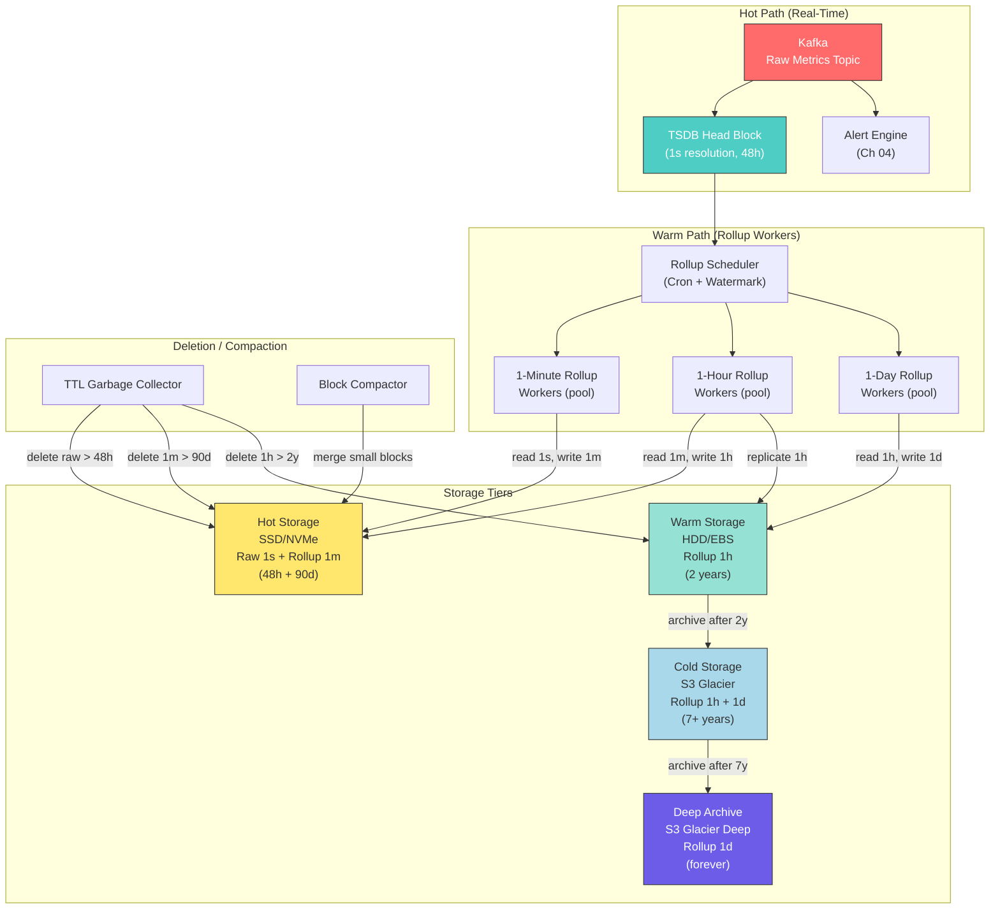
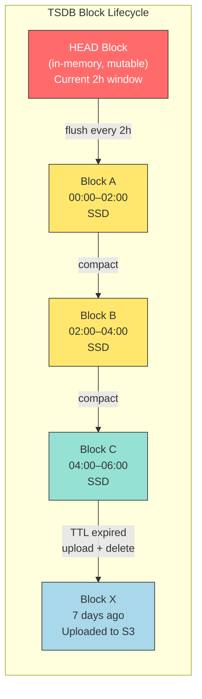
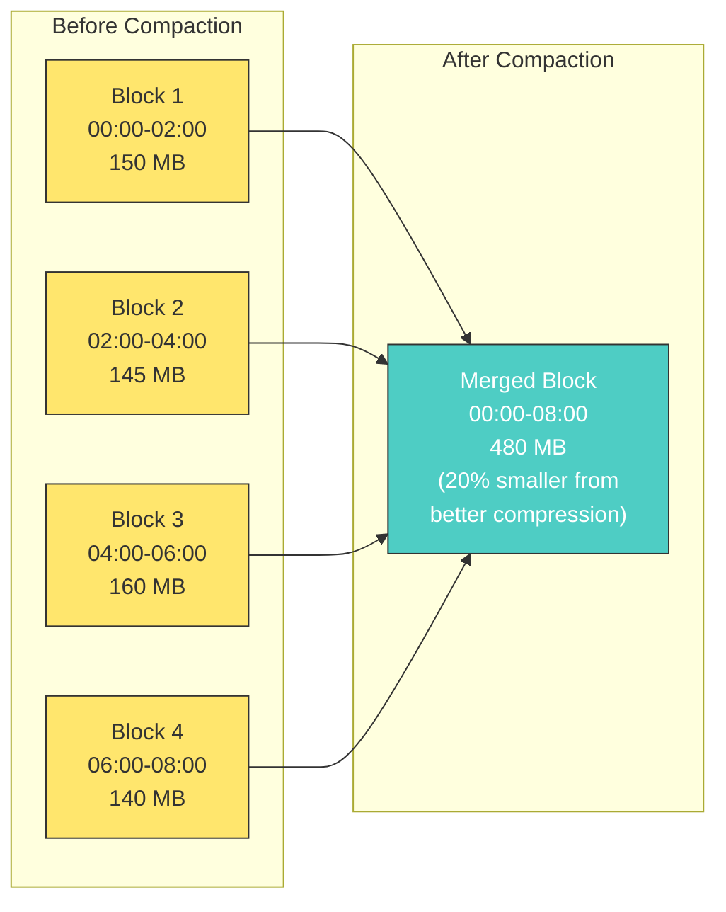
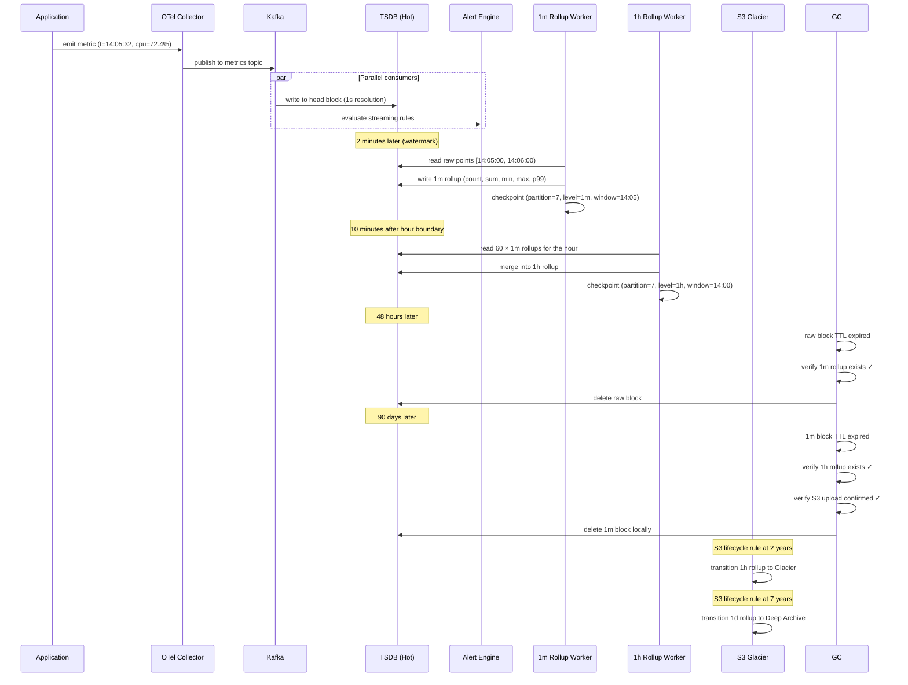

# Chapter 5: Rollups and Cold Storage 🟡

> **The Problem:**
> Your observability platform ingests 2.8 million data points per second at 1-second resolution. That's 242 billion points per day — roughly 3.6 TB of raw time-series data every 24 hours. Queries over the last hour are fast because data sits in the TSDB's in-memory head block. But when an engineer asks "What was the p99 latency trend over the last 6 months?", the TSDB must scan 650 TB of historical data. The query times out. Storage costs spiral. You cannot keep full-resolution data forever, but you also cannot delete it — SREs need post-mortem evidence, capacity planners need year-over-year trends, and compliance audits demand 7-year retention. You need a system that **continuously compresses the timeline** — rolling 1-second data into 1-minute summaries, then into 1-hour summaries — and migrates the raw data to cheap object storage, all without dropping a single alert or blocking a single query.

---

## 5.1 Why Rollups Are Unavoidable

The arithmetic is simple and unforgiving:

| Resolution | Points/Series/Day | 1M Series (Daily) | 1M Series (1 Year) |
|---|---|---|---|
| 1 second | 86,400 | 86.4 billion | 31.5 trillion |
| 1 minute | 1,440 | 1.44 billion | 525.6 billion |
| 1 hour | 24 | 24 million | 8.76 billion |

A single metric series at 1-second resolution generates 86,400 points per day. Across one million active series that's 86.4 billion points daily. At ~12 bytes per compressed point (Gorilla encoding from Chapter 2), that's **~1 TB/day** for metrics alone. Over a year: **365 TB**.

At 1-minute resolution, the same data shrinks to **~6 GB/day** — a 166× reduction. At 1-hour, it shrinks to **~100 MB/day** — a 10,000× reduction.

The insight: **nobody zooms into second-level granularity for a 6-month dashboard.** Human eyes can't distinguish 15.8 million pixels on a 1920-wide monitor. A 6-month chart at 1-minute resolution already has 262,800 points per series — still far more than any screen can render.

```
Retention strategy:
  Raw (1s)   → keep for 48 hours   → then delete
  Rollup-1m  → keep for 90 days    → then delete  
  Rollup-1h  → keep for 2 years    → then archive to S3 Glacier
  Rollup-1d  → keep forever        → in S3 Glacier Deep Archive
```

---

## 5.2 The Rollup Data Model

A rollup is not a simple average. It is a **statistical summary** that preserves enough information for meaningful querying.

### 5.2.1 The Rollup Record

For each (series_id, aligned_window), the rollup stores:

```rust
/// A single rollup record — the statistical summary of all raw
/// data points within one aligned time window for one series.
#[derive(Debug, Clone, Serialize, Deserialize)]
pub struct RollupRecord {
    /// The unique identifier for the time series.
    pub series_id: u64,
    /// Window start, aligned to the rollup interval.
    /// For 1-minute rollup: truncated to minute boundary.
    pub window_start: i64,  // epoch seconds
    /// Window duration in seconds (60, 3600, 86400).
    pub window_seconds: u32,
    /// Number of raw data points aggregated.
    pub count: u64,
    /// Sum of all values (enables avg = sum / count).
    pub sum: f64,
    /// Minimum value observed in the window.
    pub min: f64,
    /// Maximum value observed in the window.
    pub max: f64,
    /// Last value observed (for gauge metrics).
    pub last: f64,
    /// Pre-computed average (sum / count).
    pub avg: f64,
    /// Approximate p50 / p90 / p99 via T-Digest.
    pub percentiles: PercentileSketch,
}

#[derive(Debug, Clone, Serialize, Deserialize)]
pub struct PercentileSketch {
    /// Serialized T-Digest centroid array.
    /// Mergeable across windows for higher-level rollups.
    pub centroids: Vec<Centroid>,
    pub total_count: u64,
}

#[derive(Debug, Clone, Serialize, Deserialize)]
pub struct Centroid {
    pub mean: f64,
    pub weight: u64,
}
```

### 5.2.2 Why Not Just Average?

| Query | Needs | Just `avg` sufficient? |
|---|---|---|
| "What was the average CPU over 1 hour?" | `sum / count` | ✅ Yes |
| "What was the peak memory in the last day?" | `max` | ❌ No — average hides spikes |
| "What % of requests exceeded 500ms?" | percentile sketch | ❌ No — average hides tail latency |
| "How many requests hit this endpoint?" | `count` (for counters) | ❌ No — average of a count is meaningless |
| "What was the last-known disk usage?" | `last` | ❌ No — average of a gauge misrepresents state |

Storing `(count, sum, min, max, last, percentile_sketch)` enables the query engine to answer any of these questions from rolled-up data alone.

### 5.2.3 Counter vs. Gauge Rollups

Counters (monotonically increasing) and gauges (arbitrary values) require different rollup semantics:

```rust
pub enum MetricType {
    Counter,
    Gauge,
    Histogram,
}

impl RollupRecord {
    /// Build a rollup from raw data points.
    pub fn from_raw_points(
        series_id: u64,
        metric_type: MetricType,
        window_start: i64,
        window_seconds: u32,
        points: &[(i64, f64)],  // (timestamp, value)
    ) -> Self {
        let count = points.len() as u64;
        let values: Vec<f64> = points.iter().map(|(_, v)| *v).collect();

        let (sum, min, max, last) = match metric_type {
            MetricType::Counter => {
                // For counters, the "sum" is the delta (last - first),
                // representing the total increment in this window.
                // Handle resets: if value decreases, assume counter reset.
                let rate_sum = compute_counter_delta(points);
                let min_rate = compute_min_rate(points);
                let max_rate = compute_max_rate(points);
                let last_val = values.last().copied().unwrap_or(0.0);
                (rate_sum, min_rate, max_rate, last_val)
            }
            MetricType::Gauge | MetricType::Histogram => {
                let sum: f64 = values.iter().sum();
                let min = values.iter().cloned().fold(f64::INFINITY, f64::min);
                let max = values
                    .iter()
                    .cloned()
                    .fold(f64::NEG_INFINITY, f64::max);
                let last = values.last().copied().unwrap_or(0.0);
                (sum, min, max, last)
            }
        };

        let avg = if count > 0 { sum / count as f64 } else { 0.0 };

        let percentiles = build_tdigest(&values);

        RollupRecord {
            series_id,
            window_start,
            window_seconds,
            count,
            sum,
            min,
            max,
            last,
            avg,
            percentiles,
        }
    }
}

/// Compute the total counter increase, handling resets.
fn compute_counter_delta(points: &[(i64, f64)]) -> f64 {
    let mut delta = 0.0;
    for window in points.windows(2) {
        let diff = window[1].1 - window[0].1;
        if diff >= 0.0 {
            delta += diff;
        } else {
            // Counter reset detected — treat new value as increment from 0.
            delta += window[1].1;
        }
    }
    delta
}
```

---

## 5.3 The Rollup Pipeline Architecture



The pipeline is a **cascade**: each rollup level reads from the level below it. 1-minute rollups read raw 1-second data. 1-hour rollups read 1-minute rollup data (not raw data). This means the 1-hour worker processes 60× fewer records than if it re-read raw data.

---

## 5.4 The Rollup Scheduler

The scheduler is the brain of the rollup pipeline. It decides **when** a given time window is safe to roll up.

### 5.4.1 The Watermark Problem

You cannot roll up the window `[14:05:00, 14:06:00)` at exactly `14:06:00` because:
1. **Late-arriving data**: Network delays, clock skew, and buffering mean some 14:05:xx data points arrive after 14:06:00.
2. **TSDB write lag**: The TSDB's WAL may not have flushed all 14:05:xx points to queryable storage yet.

The solution: a **watermark** — a configurable delay that defines when a window is considered "complete."

```rust
pub struct RollupScheduler {
    /// How long to wait after window_end before rolling up.
    watermark_delay: Duration,
    /// Track which (series_partition, window) combos have been rolled up.
    checkpoint_store: Arc<dyn CheckpointStore>,
    /// The rollup worker pool.
    worker_pool: WorkerPool,
}

#[derive(Debug, Clone, Hash, Eq, PartialEq, Serialize, Deserialize)]
pub struct RollupTask {
    pub partition_id: u32,
    pub window_start: i64,
    pub window_seconds: u32,
    pub rollup_level: RollupLevel,
}

#[derive(Debug, Clone, Copy, Hash, Eq, PartialEq, Serialize, Deserialize)]
pub enum RollupLevel {
    OneMinute,
    OneHour,
    OneDay,
}

impl RollupScheduler {
    /// Main scheduling loop — runs every 10 seconds.
    pub async fn run(&self) -> Result<(), RollupError> {
        let mut interval = tokio::time::interval(Duration::from_secs(10));

        loop {
            interval.tick().await;

            let now = Utc::now().timestamp();

            for level in &[
                RollupLevel::OneMinute,
                RollupLevel::OneHour,
                RollupLevel::OneDay,
            ] {
                let window_secs = level.window_seconds();
                let watermark = level.watermark_delay().as_secs() as i64;

                // The latest window whose end + watermark ≤ now.
                let latest_safe_window_end = now - watermark;
                let latest_safe_window_start =
                    align_down(latest_safe_window_end, window_secs as i64)
                        - window_secs as i64;

                // Find all windows between last checkpoint and now.
                let tasks = self
                    .generate_pending_tasks(
                        *level,
                        latest_safe_window_start,
                    )
                    .await?;

                for task in tasks {
                    self.worker_pool.submit(task).await?;
                }
            }
        }
    }

    async fn generate_pending_tasks(
        &self,
        level: RollupLevel,
        up_to_window_start: i64,
    ) -> Result<Vec<RollupTask>, RollupError> {
        let mut tasks = Vec::new();
        let window_secs = level.window_seconds();

        for partition_id in 0..self.worker_pool.num_partitions() {
            let last_checkpoint = self
                .checkpoint_store
                .get_last_completed(partition_id, level)
                .await?;

            let mut window_start =
                last_checkpoint + window_secs as i64;

            while window_start <= up_to_window_start {
                tasks.push(RollupTask {
                    partition_id,
                    window_start,
                    window_seconds: window_secs,
                    rollup_level: level,
                });
                window_start += window_secs as i64;
            }
        }

        Ok(tasks)
    }
}

impl RollupLevel {
    pub fn window_seconds(&self) -> u32 {
        match self {
            RollupLevel::OneMinute => 60,
            RollupLevel::OneHour => 3_600,
            RollupLevel::OneDay => 86_400,
        }
    }

    pub fn watermark_delay(&self) -> Duration {
        match self {
            RollupLevel::OneMinute => Duration::from_secs(120),   // 2 min
            RollupLevel::OneHour => Duration::from_secs(600),     // 10 min
            RollupLevel::OneDay => Duration::from_secs(7_200),    // 2 hours
        }
    }
}

/// Align a timestamp down to the nearest multiple of `interval`.
fn align_down(ts: i64, interval: i64) -> i64 {
    ts - (ts % interval)
}
```

### 5.4.2 Watermark Tuning

| Level | Window | Watermark | Rationale |
|---|---|---|---|
| 1-minute | 60s | 2 minutes | Covers typical network jitter + TSDB flush lag |
| 1-hour | 3,600s | 10 minutes | All 1-minute rollups for the hour must complete first |
| 1-day | 86,400s | 2 hours | All 1-hour rollups for the day must complete; covers timezone edge cases |

Setting the watermark too short risks incomplete rollups (missing late data). Setting it too long delays rollup availability and increases raw-data retention requirements.

---

## 5.5 The Rollup Worker

Each worker receives a `RollupTask`, reads the source data, computes the aggregate, writes the result, and checkpoints.

```rust
pub struct RollupWorker {
    tsdb_reader: Arc<dyn TsdbReader>,
    rollup_writer: Arc<dyn RollupWriter>,
    checkpoint_store: Arc<dyn CheckpointStore>,
}

impl RollupWorker {
    pub async fn execute(&self, task: RollupTask) -> Result<(), RollupError> {
        let window_end = task.window_start + task.window_seconds as i64;

        // Step 1: Read source data for all series in this partition.
        let source_data = match task.rollup_level {
            RollupLevel::OneMinute => {
                // Read raw 1s data from TSDB.
                self.tsdb_reader
                    .read_raw(
                        task.partition_id,
                        task.window_start,
                        window_end,
                    )
                    .await?
            }
            RollupLevel::OneHour => {
                // Read 1-minute rollup data (NOT raw data).
                self.tsdb_reader
                    .read_rollups(
                        task.partition_id,
                        task.window_start,
                        window_end,
                        RollupLevel::OneMinute,
                    )
                    .await?
            }
            RollupLevel::OneDay => {
                // Read 1-hour rollup data.
                self.tsdb_reader
                    .read_rollups(
                        task.partition_id,
                        task.window_start,
                        window_end,
                        RollupLevel::OneHour,
                    )
                    .await?
            }
        };

        // Step 2: Aggregate per series.
        let rollups = self.aggregate(task.clone(), source_data)?;

        // Step 3: Write rollup records (batched).
        self.rollup_writer
            .write_batch(&rollups, task.rollup_level)
            .await?;

        // Step 4: Checkpoint — marks this (partition, level, window) as done.
        self.checkpoint_store
            .set_completed(
                task.partition_id,
                task.rollup_level,
                task.window_start,
            )
            .await?;

        Ok(())
    }

    fn aggregate(
        &self,
        task: RollupTask,
        source_data: HashMap<u64, Vec<DataPoint>>,
    ) -> Result<Vec<RollupRecord>, RollupError> {
        let mut rollups = Vec::with_capacity(source_data.len());

        for (series_id, points) in source_data {
            if points.is_empty() {
                continue;
            }

            let metric_type = self
                .tsdb_reader
                .get_metric_type(series_id);

            let record = RollupRecord::from_raw_points(
                series_id,
                metric_type,
                task.window_start,
                task.window_seconds,
                &points
                    .iter()
                    .map(|p| (p.timestamp, p.value))
                    .collect::<Vec<_>>(),
            );

            rollups.push(record);
        }

        Ok(rollups)
    }
}
```

### 5.5.1 Merging Rollups from Rollups

The beautiful property of `(count, sum, min, max)`: they are **algebraically composable**.

```rust
impl RollupRecord {
    /// Merge multiple lower-level rollups into one higher-level rollup.
    /// Used when building 1h from 1m, or 1d from 1h.
    pub fn merge(
        series_id: u64,
        window_start: i64,
        window_seconds: u32,
        children: &[RollupRecord],
    ) -> Self {
        let count: u64 = children.iter().map(|r| r.count).sum();
        let sum: f64 = children.iter().map(|r| r.sum).sum();
        let min: f64 = children
            .iter()
            .map(|r| r.min)
            .fold(f64::INFINITY, f64::min);
        let max: f64 = children
            .iter()
            .map(|r| r.max)
            .fold(f64::NEG_INFINITY, f64::max);
        let last: f64 = children
            .iter()
            .max_by_key(|r| r.window_start)
            .map(|r| r.last)
            .unwrap_or(0.0);
        let avg = if count > 0 { sum / count as f64 } else { 0.0 };

        // T-Digest centroids are mergeable.
        let percentiles = merge_tdigests(
            children.iter().map(|r| &r.percentiles).collect(),
        );

        RollupRecord {
            series_id,
            window_start,
            window_seconds,
            count,
            sum,
            min,
            max,
            last,
            avg,
            percentiles,
        }
    }
}

/// Merge multiple T-Digest sketches into one.
fn merge_tdigests(sketches: Vec<&PercentileSketch>) -> PercentileSketch {
    let mut all_centroids: Vec<Centroid> = sketches
        .iter()
        .flat_map(|s| s.centroids.iter().cloned())
        .collect();

    // Sort by mean and re-compress into ≤200 centroids.
    all_centroids.sort_by(|a, b| {
        a.mean.partial_cmp(&b.mean).unwrap_or(std::cmp::Ordering::Equal)
    });

    let total_count: u64 = sketches.iter().map(|s| s.total_count).sum();

    let compressed = compress_centroids(all_centroids, 200);

    PercentileSketch {
        centroids: compressed,
        total_count,
    }
}
```

This cascade property means we **never** re-read raw data for higher-level rollups:

```
Raw 1s data  ──[aggregate]──▶  1-minute rollup
                                     │
                            [merge 60 records]
                                     ▼
                               1-hour rollup
                                     │
                            [merge 24 records]
                                     ▼
                               1-day rollup
```

---

## 5.6 Idempotency and Exactly-Once Rollups

What happens if a rollup worker crashes halfway through writing a batch? On restart, the scheduler re-emits the task. We need the rollup to be **idempotent** — running it twice for the same window must produce the same result with no duplicates.

### 5.6.1 Write-Then-Checkpoint (Not Safe)

```
1. Read source data
2. Write rollup records          ← crash here
3. Checkpoint as completed       ← never reached
```

On retry, step 2 executes again → **duplicate rollup records**.

### 5.6.2 Atomic Write + Checkpoint (Safe)

```rust
impl RollupWorker {
    pub async fn execute_idempotent(
        &self,
        task: RollupTask,
    ) -> Result<(), RollupError> {
        // Check if already completed (idempotency guard).
        if self
            .checkpoint_store
            .is_completed(
                task.partition_id,
                task.rollup_level,
                task.window_start,
            )
            .await?
        {
            return Ok(()); // Already done — skip.
        }

        let source_data = self.read_source(&task).await?;
        let rollups = self.aggregate(task.clone(), source_data)?;

        // Atomic: write rollup records AND checkpoint in ONE transaction.
        // If the storage backend supports transactions (e.g., FoundationDB,
        // PostgreSQL), wrap both in a single transaction.
        // If using a TSDB without transactions, use a two-phase approach:
        //   1. Write rollups with a unique batch_id
        //   2. On retry, delete any existing records with the same
        //      (partition, level, window) before re-writing.
        self.rollup_writer
            .write_batch_with_checkpoint(
                &rollups,
                task.rollup_level,
                task.partition_id,
                task.window_start,
            )
            .await?;

        Ok(())
    }
}
```

For TSDB backends that lack transactions, the idempotency strategy uses **replace semantics**: each rollup record is keyed by `(series_id, rollup_level, window_start)`. Writing the same key again overwrites — no duplicates.

---

## 5.7 The Storage Tier Architecture

### 5.7.1 Why Multiple Tiers?

| Tier | Medium | Cost ($/GB/month) | Latency | Data |
|---|---|---|---|---|
| **Hot** | NVMe SSD | $0.17 | < 1ms | Raw 1s (48h) + 1m rollup (90d) |
| **Warm** | HDD / EBS gp3 | $0.045 | 5–20ms | 1h rollup (2 years) |
| **Cold** | S3 Glacier Flexible | $0.0036 | 1–5 hours | 1h rollup (7+ years) |
| **Deep** | S3 Glacier Deep Archive | $0.00099 | 12–48 hours | 1d rollup (forever) |

At petabyte scale, the cost difference is staggering:

```
1 PB on NVMe SSD:  $170,000 / month
1 PB on S3 Glacier: $3,600 / month
1 PB on Deep Archive: $990 / month

Savings: 98% by tiering correctly.
```

### 5.7.2 The Block-Based Tiering Model

The TSDB (from Chapter 2) stores data in immutable, time-bounded **blocks**. Each block covers a fixed time range (e.g., 2 hours of raw data). Tiering operates on entire blocks, not individual data points.



---

## 5.8 Cold Storage: Writing to S3

### 5.8.1 The Block Upload Process

When a TSDB block's TTL expires (e.g., raw data older than 48 hours), the block uploader:

1. **Verifies** the corresponding rollup is complete (checks the checkpoint store).
2. **Uploads** the block to S3 as an immutable object.
3. **Registers** the block metadata in a catalog.
4. **Deletes** the local copy only after upload confirmation.

```rust
pub struct BlockUploader {
    s3_client: Arc<S3Client>,
    catalog: Arc<dyn BlockCatalog>,
    checkpoint_store: Arc<dyn CheckpointStore>,
    bucket: String,
}

impl BlockUploader {
    /// Upload a TSDB block to S3 cold storage.
    pub async fn upload_block(
        &self,
        block: &TsdbBlock,
    ) -> Result<(), UploadError> {
        // Safety check: ensure rollups covering this block's time range
        // have been completed before we delete the raw data.
        let rollup_complete = self
            .checkpoint_store
            .is_range_completed(
                block.partition_id,
                RollupLevel::OneMinute,
                block.min_time,
                block.max_time,
            )
            .await?;

        if !rollup_complete {
            return Err(UploadError::RollupIncomplete {
                block_id: block.id.clone(),
                time_range: (block.min_time, block.max_time),
            });
        }

        // Build the S3 key with a deterministic path for easy retrieval.
        let key = format!(
            "blocks/{partition}/{level}/{date}/{block_id}.block",
            partition = block.partition_id,
            level = block.resolution.as_str(),
            date = format_date(block.min_time),
            block_id = block.id,
        );

        // Upload with server-side encryption.
        let data = block.serialize_to_bytes()?;
        let checksum = sha256_digest(&data);

        self.s3_client
            .put_object()
            .bucket(&self.bucket)
            .key(&key)
            .body(ByteStream::from(data))
            .server_side_encryption(ServerSideEncryption::Aws256)
            .checksum_sha256(&checksum)
            .storage_class(self.storage_class_for(block))
            .send()
            .await
            .map_err(UploadError::S3)?;

        // Register in catalog — this is the source of truth for
        // "where is block X?"
        self.catalog
            .register(BlockLocation {
                block_id: block.id.clone(),
                partition_id: block.partition_id,
                min_time: block.min_time,
                max_time: block.max_time,
                resolution: block.resolution,
                s3_bucket: self.bucket.clone(),
                s3_key: key,
                size_bytes: block.size_bytes(),
                checksum,
            })
            .await?;

        Ok(())
    }

    fn storage_class_for(&self, block: &TsdbBlock) -> StorageClass {
        let age_days = (Utc::now().timestamp() - block.max_time) / 86400;
        match block.resolution {
            Resolution::Raw | Resolution::OneMinute => {
                if age_days > 365 {
                    StorageClass::GlacierFlexibleRetrieval
                } else {
                    StorageClass::StandardInfrequentAccess
                }
            }
            Resolution::OneHour => {
                if age_days > 730 {
                    StorageClass::GlacierFlexibleRetrieval
                } else {
                    StorageClass::StandardInfrequentAccess
                }
            }
            Resolution::OneDay => StorageClass::DeepArchive,
        }
    }
}
```

### 5.8.2 The Block Catalog

The catalog is a lightweight database (PostgreSQL or DynamoDB) that maps time ranges to S3 locations:

```sql
CREATE TABLE block_catalog (
    block_id       TEXT PRIMARY KEY,
    partition_id   INT NOT NULL,
    min_time       BIGINT NOT NULL,
    max_time       BIGINT NOT NULL,
    resolution     TEXT NOT NULL,  -- 'raw', '1m', '1h', '1d'
    s3_bucket      TEXT NOT NULL,
    s3_key         TEXT NOT NULL,
    size_bytes     BIGINT NOT NULL,
    checksum       TEXT NOT NULL,
    storage_class  TEXT NOT NULL,
    uploaded_at    TIMESTAMPTZ DEFAULT NOW(),

    -- Index for time-range queries.
    INDEX idx_time_range (partition_id, resolution, min_time, max_time)
);
```

When the query engine receives a request spanning historical data, it:
1. Queries the catalog for blocks covering the requested time range.
2. Downloads the relevant blocks from S3 (or reads from local cache).
3. Merges results with any data still in the hot TSDB.

---

## 5.9 The TTL Garbage Collector

The GC runs as a background service that continuously scans for expired data and deletes it — but only after verifying the safety invariants.

```rust
pub struct TtlGarbageCollector {
    tsdb: Arc<dyn TsdbAdmin>,
    catalog: Arc<dyn BlockCatalog>,
    checkpoint_store: Arc<dyn CheckpointStore>,
    policies: Vec<RetentionPolicy>,
}

#[derive(Debug, Clone)]
pub struct RetentionPolicy {
    pub resolution: Resolution,
    pub max_age: Duration,
    pub requires_rollup_complete: bool,
    pub requires_s3_upload: bool,
}

impl TtlGarbageCollector {
    pub fn default_policies() -> Vec<RetentionPolicy> {
        vec![
            RetentionPolicy {
                resolution: Resolution::Raw,
                max_age: Duration::from_secs(48 * 3600),   // 48 hours
                requires_rollup_complete: true,  // 1m rollup must exist
                requires_s3_upload: false,       // raw data not archived
            },
            RetentionPolicy {
                resolution: Resolution::OneMinute,
                max_age: Duration::from_secs(90 * 86400),  // 90 days
                requires_rollup_complete: true,  // 1h rollup must exist
                requires_s3_upload: true,
            },
            RetentionPolicy {
                resolution: Resolution::OneHour,
                max_age: Duration::from_secs(730 * 86400),  // 2 years (local)
                requires_rollup_complete: true,  // 1d rollup must exist
                requires_s3_upload: true,
            },
            // 1-day rollups: never deleted locally (small), archived to Deep.
        ]
    }

    /// Main GC loop — runs every 5 minutes.
    pub async fn run(&self) -> Result<(), GcError> {
        let mut interval = tokio::time::interval(Duration::from_secs(300));

        loop {
            interval.tick().await;

            for policy in &self.policies {
                let cutoff = Utc::now().timestamp()
                    - policy.max_age.as_secs() as i64;

                let expired_blocks = self
                    .tsdb
                    .list_blocks_before(policy.resolution, cutoff)
                    .await?;

                for block in expired_blocks {
                    if let Err(e) = self
                        .try_delete_block(&block, policy)
                        .await
                    {
                        tracing::warn!(
                            block_id = %block.id,
                            error = %e,
                            "GC skipped block — safety check failed"
                        );
                    }
                }
            }
        }
    }

    async fn try_delete_block(
        &self,
        block: &TsdbBlock,
        policy: &RetentionPolicy,
    ) -> Result<(), GcError> {
        // Safety invariant 1: rollup must be complete.
        if policy.requires_rollup_complete {
            let next_level = policy.resolution.next_rollup_level()
                .ok_or(GcError::NoNextLevel)?;

            let complete = self
                .checkpoint_store
                .is_range_completed(
                    block.partition_id,
                    next_level,
                    block.min_time,
                    block.max_time,
                )
                .await?;

            if !complete {
                return Err(GcError::RollupIncomplete);
            }
        }

        // Safety invariant 2: block must be uploaded to S3.
        if policy.requires_s3_upload {
            let in_catalog = self
                .catalog
                .exists(&block.id)
                .await?;

            if !in_catalog {
                return Err(GcError::NotYetUploaded);
            }
        }

        // All checks passed — delete the local block.
        self.tsdb.delete_block(&block.id).await?;

        tracing::info!(
            block_id = %block.id,
            resolution = ?policy.resolution,
            age_hours = (Utc::now().timestamp() - block.max_time) / 3600,
            "GC deleted expired block"
        );

        Ok(())
    }
}
```

The critical design: **the GC never deletes data unless the next-level rollup exists and (if required) the block is safely in S3.** This prevents data loss even if the rollup pipeline falls behind.

---

## 5.10 Query-Time Resolution Selection

When a user opens a Grafana dashboard, the query engine must automatically pick the right resolution. Loading 6 months of 1-second data would take minutes; loading 1-hour rollups returns in milliseconds.

### 5.10.1 Auto-Resolution Algorithm

```rust
pub struct QueryPlanner {
    catalog: Arc<dyn BlockCatalog>,
    tsdb: Arc<dyn TsdbReader>,
}

#[derive(Debug)]
pub struct ResolvedQuery {
    /// Which resolution to use for each time segment.
    pub segments: Vec<QuerySegment>,
}

#[derive(Debug)]
pub struct QuerySegment {
    pub start: i64,
    pub end: i64,
    pub resolution: Resolution,
    pub source: DataSource,
}

#[derive(Debug)]
pub enum DataSource {
    HotTsdb,
    S3Block { bucket: String, key: String },
}

impl QueryPlanner {
    /// Given a query time range and a maximum number of data points
    /// (determined by the chart pixel width), select the optimal resolution.
    pub async fn plan(
        &self,
        series_id: u64,
        start: i64,
        end: i64,
        max_points: u32,
    ) -> Result<ResolvedQuery, QueryError> {
        let range_seconds = end - start;

        // Pick the coarsest resolution that still provides
        // at least `max_points` data points.
        let ideal_step = range_seconds / max_points as i64;

        let resolution = if ideal_step <= 1 {
            Resolution::Raw
        } else if ideal_step <= 60 {
            Resolution::OneMinute
        } else if ideal_step <= 3600 {
            Resolution::OneHour
        } else {
            Resolution::OneDay
        };

        // Determine data source for each sub-range.
        let mut segments = Vec::new();
        let now = Utc::now().timestamp();

        // Hot TSDB boundary: raw data is available for last 48h,
        // 1m rollups for 90d, etc.
        let hot_boundary = match resolution {
            Resolution::Raw => now - 48 * 3600,
            Resolution::OneMinute => now - 90 * 86400,
            Resolution::OneHour => now - 730 * 86400,
            Resolution::OneDay => 0,  // always check S3
        };

        if start >= hot_boundary {
            // Entire range is in hot storage.
            segments.push(QuerySegment {
                start,
                end,
                resolution,
                source: DataSource::HotTsdb,
            });
        } else if end <= hot_boundary {
            // Entire range is in cold storage.
            let blocks = self
                .catalog
                .find_blocks(series_id, resolution, start, end)
                .await?;
            for block in blocks {
                segments.push(QuerySegment {
                    start: block.min_time.max(start),
                    end: block.max_time.min(end),
                    resolution,
                    source: DataSource::S3Block {
                        bucket: block.s3_bucket,
                        key: block.s3_key,
                    },
                });
            }
        } else {
            // Split: cold portion + hot portion.
            let cold_blocks = self
                .catalog
                .find_blocks(
                    series_id,
                    resolution,
                    start,
                    hot_boundary,
                )
                .await?;
            for block in cold_blocks {
                segments.push(QuerySegment {
                    start: block.min_time.max(start),
                    end: block.max_time.min(hot_boundary),
                    resolution,
                    source: DataSource::S3Block {
                        bucket: block.s3_bucket,
                        key: block.s3_key,
                    },
                });
            }
            segments.push(QuerySegment {
                start: hot_boundary,
                end,
                resolution,
                source: DataSource::HotTsdb,
            });
        }

        Ok(ResolvedQuery { segments })
    }
}
```

### 5.10.2 Resolution Selection Matrix

| Dashboard Time Range | Typical Chart Width | Ideal Step | Selected Resolution |
|---|---|---|---|
| Last 1 hour | 1920 px | ~1.9s | Raw (1s) |
| Last 24 hours | 1920 px | ~45s | 1-minute rollup |
| Last 7 days | 1920 px | ~315s | 1-minute rollup |
| Last 30 days | 1920 px | ~1350s | 1-hour rollup |
| Last 6 months | 1920 px | ~8100s | 1-hour rollup |
| Last 2 years | 1920 px | ~33000s | 1-day rollup |

The user never manually picks a resolution — the query engine selects the most efficient one automatically.

---

## 5.11 Block Compaction

Over time, the TSDB accumulates many small blocks (each covering 2 hours). Queries spanning large ranges must open hundreds of blocks, which is slow. The **compactor** merges small blocks into larger ones.



Benefits of compaction:
- **Fewer files to open** per query → lower I/O overhead.
- **Better compression** — longer runs of sorted data compress more efficiently.
- **Tombstone removal** — deleted series are actually purged during compaction.

```rust
pub struct Compactor {
    tsdb: Arc<dyn TsdbAdmin>,
    max_block_duration: Duration,
    max_block_size: u64,
}

impl Compactor {
    /// Select adjacent blocks that should be merged.
    pub async fn plan_compaction(
        &self,
        resolution: Resolution,
    ) -> Result<Vec<CompactionPlan>, CompactError> {
        let blocks = self
            .tsdb
            .list_blocks(resolution)
            .await?;

        let mut plans = Vec::new();
        let mut group: Vec<TsdbBlock> = Vec::new();
        let mut group_size: u64 = 0;

        for block in blocks {
            let would_exceed_duration = if let Some(first) = group.first() {
                Duration::from_secs(
                    (block.max_time - first.min_time) as u64,
                ) > self.max_block_duration
            } else {
                false
            };

            let would_exceed_size =
                group_size + block.size_bytes() > self.max_block_size;

            if would_exceed_duration || would_exceed_size {
                if group.len() >= 2 {
                    plans.push(CompactionPlan {
                        source_blocks: std::mem::take(&mut group),
                    });
                } else {
                    group.clear();
                }
                group_size = 0;
            }

            group_size += block.size_bytes();
            group.push(block);
        }

        if group.len() >= 2 {
            plans.push(CompactionPlan {
                source_blocks: group,
            });
        }

        Ok(plans)
    }

    /// Execute a compaction plan: merge blocks, write new block,
    /// delete old blocks.
    pub async fn compact(
        &self,
        plan: CompactionPlan,
    ) -> Result<(), CompactError> {
        let min_time = plan.source_blocks.first().unwrap().min_time;
        let max_time = plan.source_blocks.last().unwrap().max_time;

        // Merge-sort all series data from source blocks.
        let merged_data = self.merge_blocks(&plan.source_blocks).await?;

        // Write the merged block.
        let new_block = self
            .tsdb
            .write_block(min_time, max_time, merged_data)
            .await?;

        // Atomically swap: register new block, mark old blocks for deletion.
        self.tsdb
            .swap_blocks(
                &plan
                    .source_blocks
                    .iter()
                    .map(|b| b.id.clone())
                    .collect::<Vec<_>>(),
                &new_block.id,
            )
            .await?;

        Ok(())
    }
}
```

---

## 5.12 S3 Lifecycle Policies

AWS S3 lifecycle rules automate the transition between storage classes, reducing operational burden:

```json
{
  "Rules": [
    {
      "ID": "RawBlocksToIA",
      "Filter": { "Prefix": "blocks/raw/" },
      "Status": "Enabled",
      "Transitions": [
        {
          "Days": 30,
          "StorageClass": "STANDARD_IA"
        },
        {
          "Days": 180,
          "StorageClass": "GLACIER"
        }
      ]
    },
    {
      "ID": "HourlyRollupsToGlacier",
      "Filter": { "Prefix": "blocks/1h/" },
      "Status": "Enabled",
      "Transitions": [
        {
          "Days": 365,
          "StorageClass": "GLACIER"
        }
      ]
    },
    {
      "ID": "DailyRollupsToDeepArchive",
      "Filter": { "Prefix": "blocks/1d/" },
      "Status": "Enabled",
      "Transitions": [
        {
          "Days": 730,
          "StorageClass": "DEEP_ARCHIVE"
        }
      ]
    }
  ]
}
```

---

## 5.13 Disaster Recovery and Data Integrity

### 5.13.1 The Safety Chain

Data loss in an observability platform erodes trust. The entire rollup/tiering pipeline is designed with a **safety chain** — each step verifies the previous step before proceeding:

```
   ┌────────────────────────────────────────────────────────┐
   │                    SAFETY CHAIN                         │
   │                                                         │
   │  Raw data ──────▶ 1m rollup complete?                  │
   │       │                 │                               │
   │       │            YES ─┘                               │
   │       │                                                 │
   │  GC deletes raw    1m data ──────▶ 1h rollup complete? │
   │                         │                │              │
   │                         │           YES ─┘              │
   │                         │                               │
   │                    S3 upload confirmed?                  │
   │                         │          │                    │
   │                         │     YES ─┘                    │
   │                         │                               │
   │                    GC deletes 1m local copy             │
   └────────────────────────────────────────────────────────┘
```

**Invariant:** No data at resolution N is deleted until resolution N+1 rollup is checkpointed AND (if applicable) the block is confirmed in S3 with a matching checksum.

### 5.13.2 Checksum Verification

Every block uploaded to S3 includes a SHA-256 checksum. A background verifier periodically samples blocks and re-downloads them to confirm integrity:

```rust
pub struct IntegrityVerifier {
    s3_client: Arc<S3Client>,
    catalog: Arc<dyn BlockCatalog>,
    sample_rate: f64,  // e.g., 0.01 = verify 1% of blocks per day
}

impl IntegrityVerifier {
    pub async fn verify_sample(&self) -> Result<VerifyReport, VerifyError> {
        let all_blocks = self.catalog.list_all().await?;
        let sample_size =
            (all_blocks.len() as f64 * self.sample_rate).ceil() as usize;

        let mut rng = rand::thread_rng();
        let sample: Vec<_> = all_blocks
            .choose_multiple(&mut rng, sample_size)
            .collect();

        let mut report = VerifyReport::default();

        for entry in sample {
            let response = self
                .s3_client
                .get_object()
                .bucket(&entry.s3_bucket)
                .key(&entry.s3_key)
                .send()
                .await;

            match response {
                Ok(output) => {
                    let body = output
                        .body
                        .collect()
                        .await
                        .map_err(VerifyError::Stream)?
                        .into_bytes();
                    let actual_checksum = sha256_digest(&body);

                    if actual_checksum == entry.checksum {
                        report.verified += 1;
                    } else {
                        report.corrupted.push(entry.block_id.clone());
                        tracing::error!(
                            block_id = %entry.block_id,
                            expected = %entry.checksum,
                            actual = %actual_checksum,
                            "INTEGRITY VIOLATION: block corrupted in S3"
                        );
                    }
                }
                Err(e) => {
                    report.missing.push(entry.block_id.clone());
                    tracing::error!(
                        block_id = %entry.block_id,
                        error = %e,
                        "INTEGRITY VIOLATION: block missing from S3"
                    );
                }
            }
        }

        Ok(report)
    }
}
```

---

## 5.14 Operational Metrics for the Rollup Pipeline

The rollup pipeline itself must be monitored — it's an internal service with its own failure modes.

| Metric | Description | Alert Threshold |
|---|---|---|
| `rollup.lag_seconds` | Time since last successful rollup per level | > 5 min (1m), > 30 min (1h) |
| `rollup.tasks.pending` | Number of pending rollup tasks | > 1000 |
| `rollup.tasks.failed` | Tasks that failed (bad data, I/O error) | > 0 (page immediately) |
| `rollup.worker.duration_ms` | P99 latency of rollup execution | > 30000 (1m level) |
| `gc.blocks_deleted` | Blocks deleted per GC cycle | Alert if 0 for 24h (GC stuck) |
| `gc.safety_check_failures` | Times GC refused to delete (invariant held) | Monitor — spikes indicate rollup lag |
| `s3.upload.duration_ms` | Time to upload a block to S3 | > 60000 |
| `s3.upload.failures` | Failed S3 uploads | > 0 |
| `integrity.corrupted_blocks` | Blocks with checksum mismatch | > 0 (page immediately) |
| `catalog.block_count` | Total blocks tracked in catalog | Capacity planning |

---

## 5.15 Cost Model and Capacity Planning

### 5.15.1 Worked Example: 1M Active Series

| Parameter | Value |
|---|---|
| Active series | 1,000,000 |
| Scrape interval | 1 second |
| Raw point size (Gorilla-compressed) | ~1.5 bytes |

**Storage per tier per month:**

| Tier | Resolution | Points/Day | Size/Day | Retention | Total Stored |
|---|---|---|---|---|---|
| Hot (SSD) | 1s raw | 86.4B | ~120 GB | 48 hours | ~240 GB |
| Hot (SSD) | 1m rollup | 1.44B | ~25 GB | 90 days | ~2.2 TB |
| Warm (HDD) | 1h rollup | 24M | ~1.5 GB | 2 years | ~1.1 TB |
| Cold (S3 Glacier) | 1h rollup | 24M | ~1.5 GB | 5 years | ~2.7 TB |
| Deep (S3 DA) | 1d rollup | 1M | ~60 MB | forever | Grows ~22 GB/yr |

**Monthly cost estimate:**

```
Hot SSD (2.4 TB):                    2,400 × $0.17  = $408
Warm HDD (1.1 TB):                  1,100 × $0.045 = $49.50
S3 Glacier (2.7 TB):                2,700 × $0.0036 = $9.72
S3 Deep Archive (22 GB/yr → ~80 GB): 80 × $0.00099 = $0.08
────────────────────────────────────────────────────────────
Total storage:                        ~$467 / month

VS keeping everything at 1s on SSD:
  86.4B pts/day × 365 × 12 bytes = ~365 TB
  365,000 × $0.17 = $62,050 / month
```

**Savings: 99.2% by implementing rollups and tiering.**

### 5.15.2 Compute Costs

| Component | Instance Type | Count | Purpose | Monthly Cost |
|---|---|---|---|---|
| Rollup workers (1m) | c6g.xlarge | 4 | CPU-bound aggregation | ~$440 |
| Rollup workers (1h) | c6g.large | 2 | Much less data | ~$110 |
| Rollup workers (1d) | c6g.large | 1 | Trivial volume | ~$55 |
| Block uploader | r6g.large | 2 | I/O bound (S3 uploads) | ~$150 |
| GC + Compactor | c6g.large | 1 | Background, low priority | ~$55 |
| **Total compute** | | **10** | | **~$810** |

---

## 5.16 End-to-End Data Flow: From Metric to Glacier

Putting it all together — the complete lifecycle of a single data point:



---

## 5.17 Common Failure Scenarios

| Failure | Impact | Mitigation |
|---|---|---|
| Rollup worker crashes mid-batch | Window not checkpointed → re-processed on restart | Idempotent writes (overwrite semantics) |
| Rollup pipeline falls 6+ hours behind | GC cannot delete raw data → disk fills | Alert on `rollup.lag_seconds`; auto-scale workers |
| S3 upload fails repeatedly | GC cannot delete local 1m data → disk fills | Alert on `s3.upload.failures`; retry with exponential backoff |
| S3 block corruption detected | Historical queries return bad data | Integrity verifier alerts; re-generate from source rollup if within retention |
| Clock skew between TSDB and rollup workers | Data points land in wrong windows | Use NTP; watermark absorbs small skew; alert on skew > 2s |
| Late data arrives after rollup + GC | Data point silently lost | Extend watermark; monitor `late_data.dropped` counter |
| Catalog (PostgreSQL) goes down | Queries can't find archived blocks | HA PostgreSQL with streaming replication; read replicas |
| Compactor merges blocks being uploaded | Race between compactor and uploader | Blocks are immutable; uploader re-reads after compaction |

---

## 5.18 Advanced: Downsampling Strategies for Histograms

Histograms (e.g., request latency buckets) are the hardest metric type to roll up because bucket boundaries are fixed at instrumentation time.

### 5.18.1 The Bucket Merging Problem

```
Raw histogram at t=14:05:32:
  le=10ms:  150 requests
  le=50ms:  480 requests
  le=100ms: 520 requests
  le=250ms: 530 requests
  le=+Inf:  532 requests

Raw histogram at t=14:05:33:
  le=10ms:  155 requests  (counters — monotonically increasing)
  le=50ms:  490 requests
  le=100ms: 535 requests
  le=250ms: 546 requests
  le=+Inf:  548 requests
```

Rollup approach: store the **delta per bucket per window**, which preserves the distribution shape:

```rust
#[derive(Debug, Clone, Serialize, Deserialize)]
pub struct HistogramRollup {
    pub series_id: u64,
    pub window_start: i64,
    pub window_seconds: u32,
    /// Bucket boundaries (le values).
    pub boundaries: Vec<f64>,
    /// Count increment per bucket in this window.
    pub bucket_deltas: Vec<u64>,
    /// Total sum of observed values (for avg calculation).
    pub sum: f64,
    /// Total count of observations.
    pub count: u64,
}
```

The T-Digest stored in the standard `RollupRecord.percentiles` field provides percentile estimates, while the `HistogramRollup` preserves the exact bucket distribution for heatmap visualizations.

---

## 5.19 Summary and Design Decisions

| Decision | Choice | Alternative | Why |
|---|---|---|---|
| Rollup model | Statistical summary (count, sum, min, max, last, T-Digest) | Simple average | Preserves enough information for max, min, percentile queries |
| Rollup cascade | 1m reads raw → 1h reads 1m → 1d reads 1h | All levels read raw data | 60× less I/O for each successive level |
| Window completeness | Watermark-based delay | Wall-clock trigger | Absorbs late-arriving data without complex out-of-order handling |
| Idempotency | Overwrite semantics + checkpoint | Write-ahead log, deduplication bloom filters | Simpler; leverages TSDB's natural key-based upsert |
| Storage tiering | 4 tiers (SSD → HDD → Glacier → Deep Archive) | 2 tiers (SSD + S3 Standard) | 99% cost reduction at petabyte scale |
| GC safety | Verify rollup + S3 upload before delete | Timeout-based deletion | Zero data-loss guarantee; GC simply pauses if pipeline lags |
| Resolution selection | Auto based on query range ÷ chart width | Manual per-dashboard | Transparent to users; always returns optimal density |
| Block compaction | Merge small blocks into larger blocks | Keep all 2h blocks | Fewer file opens per query; better compression ratios |
| Histogram rollups | Bucket deltas + T-Digest percentiles | Drop histograms from rollups | Heatmaps work at all resolutions |
| Integrity verification | Sampling-based checksum verification | Trust S3 durability | Defense-in-depth against bit rot and silent corruption |

> **Key Takeaways**
>
> 1. **Rollups are not optional at scale.** The math is unforgiving: 1M series × 86,400 points/day × 365 days = 31.5 trillion points per year. No SSD array survives that without tiering.
> 2. **Store `(count, sum, min, max, last, percentile_sketch)` — never just the average.** An average hides spikes, drops, and distribution shape. A single rolled-up record must answer any reasonable query about its window.
> 3. **The cascade property is the key optimization.** 1-hour rollups read 1-minute rollups (60 records), not raw data (3,600 records). 1-day rollups read 1-hour rollups (24 records). Each level amplifies the savings.
> 4. **Never delete data until the next level is confirmed.** The safety chain (rollup checkpointed → S3 upload confirmed → GC deletes) is the single most important invariant in the system. Violating it means data loss.
> 5. **Auto-resolution at query time makes rollups invisible to users.** Engineers see a smooth dashboard whether they look at the last hour (raw 1s) or the last year (1h rollups). The system decides; the human never has to think about it.
> 6. **Cost savings compound dramatically.** Rollups reduce data volume by 10,000×. Object storage reduces per-GB cost by 50×. Combined: a system that would cost $62K/month on raw SSD costs $467/month with rollups + tiering — a **99.2% reduction**.