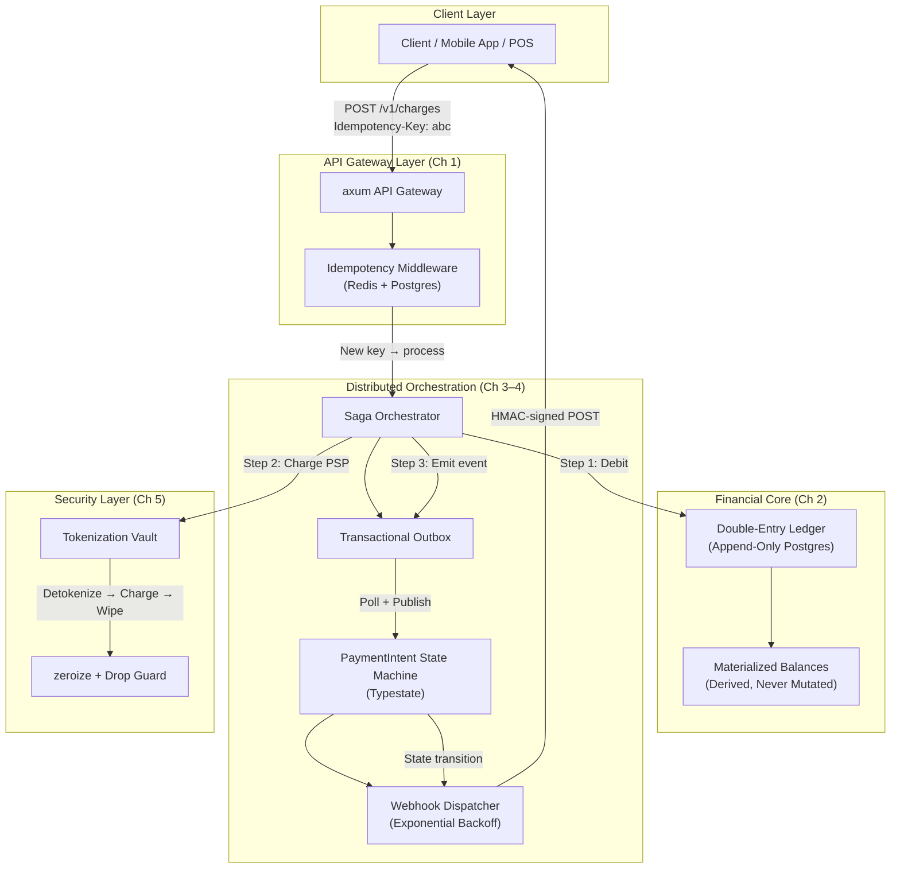

# System Design: The Zero-Downtime Distributed Payment Gateway

## Speaker Intro

This handbook is written from the perspective of a **Principal Fintech Architect** who has designed, shipped, and operated mission-critical payment processing engines at scale. The content draws from first-hand experience building PCI-DSS Level 1 compliant gateways that process billions of dollars annually, operating distributed ledger systems across multi-region Kubernetes clusters, and implementing the kind of idempotency and consistency guarantees that prevent real humans from being double-charged at 3 AM on Black Friday.

## Who This Is For

- **Backend engineers** building or maintaining payment, billing, or checkout systems who want to understand the architectural decisions behind Stripe, Adyen, and Square — and implement them in Rust.
- **Rust systems programmers** looking for a concrete, production-grade project that exercises `axum`, `sqlx`, `tokio`, and `serde` in a domain where correctness is not optional.
- **Fintech architects** evaluating Rust as a replacement for JVM-based or Go-based payment stacks, and who need a blueprint for compliance, consistency, and throughput.
- **Anyone who has built a `POST /charge` endpoint** and then lost sleep wondering what happens when the client retries, the database commits but the response never arrives, or the card network returns an ambiguous timeout.
- **Staff+ engineers** preparing for system design interviews where "design a payment system" is the single most common question — and where hand-waving about idempotency is no longer enough.

## Prerequisites

| Concept | Where to Learn |
|---|---|
| Intermediate Rust (ownership, traits, `async/.await`) | [Async Rust](../async-book/src/SUMMARY.md) |
| `axum` web framework basics (handlers, extractors, middleware) | [Rust Microservices](../microservices-book/src/SUMMARY.md) |
| PostgreSQL fundamentals (transactions, constraints, indexes) | [The SQL Rosetta Stone](../sql-rosetta-book/src/SUMMARY.md) |
| Distributed systems intuition (CAP, consensus, failure modes) | [Distributed Systems](../distributed-systems-book/src/SUMMARY.md) |
| Type-driven design (newtypes, phantom types) | [Type-Driven Correctness](../type-driven-correctness-book/src/SUMMARY.md) |

## How to Use This Book

| Emoji | Meaning |
|---|---|
| 🟢 | **Architecture** — foundational patterns every payment system must implement on Day 1 |
| 🟡 | **Implementation** — production-grade data modeling and database engineering |
| 🔴 | **Advanced Consistency** — distributed transaction patterns, state machines, and security hardening |

Each chapter solves **one specific failure mode** of a distributed payment system. Read them in order — later chapters assume the idempotency layer, ledger, and saga infrastructure from earlier chapters exist.

## The Problem We Are Solving

> Design a **zero-downtime, strictly consistent, PCI-compliant distributed payment gateway** in Rust that processes charges across multiple microservices while guaranteeing: (a) no customer is ever double-charged, (b) no money is ever lost or created, (c) partial failures are automatically compensated, and (d) sensitive card data is cryptographically wiped from memory the instant it is no longer needed.

The system we will build has these non-negotiable requirements:

| Requirement | Target |
|---|---|
| Idempotency | Every mutation is safe to retry — network failures never cause duplicate charges |
| Consistency model | Strict serializability within a service, eventual consistency across services via Saga |
| Ledger integrity | Double-entry bookkeeping — every credit has a matching debit, balances derived from the log |
| State machine safety | Payment lifecycle transitions enforced at compile time via Rust's type system |
| Webhook reliability | At-least-once delivery with cryptographic signature verification and exponential backoff |
| PCI-DSS compliance | Card PANs zeroed from RAM immediately; no plaintext card data in logs, heap dumps, or core files |
| Availability | Zero-downtime deployments; graceful degradation under partial outages |
| Throughput | ≥ 10,000 transactions/second per node on commodity hardware |

## Pacing Guide

| Chapter | Topic | Time | Checkpoint |
|---|---|---|---|
| Ch 0 | Introduction & Architecture Overview | 30 min | Understand the full system canvas |
| Ch 1 | Idempotency and API Design | 6–8 hours | Working `axum` API with Redis-backed idempotency middleware |
| Ch 2 | The Double-Entry Ledger | 6–8 hours | Append-only ledger with DB-level balance constraints |
| Ch 3 | Distributed Transactions (Saga Pattern) | 8–10 hours | Multi-step payment flow with compensating transactions |
| Ch 4 | State Machines and Webhook Delivery | 6–8 hours | Typestate PaymentIntent + reliable webhook dispatcher |
| Ch 5 | PCI Compliance and Memory Wiping | 4–6 hours | `zeroize`-hardened card handling with audit proof |

**Total: ~31–40 hours** of focused study.

## Table of Contents

### Part I: The Payment API Surface
- **Chapter 1 — Idempotency and API Design 🟢** — The golden rule of payments: every request must be safe to retry. Designing the `axum` API to accept `Idempotency-Key` headers. Storing key states (Started, Completed, Failed) in Redis + Postgres to ensure a user clicking "Buy" twice on a flaky mobile connection only triggers one charge.

### Part II: The Financial Core
- **Chapter 2 — The Double-Entry Ledger 🟡** — Why you never `UPDATE` a balance. Architecting a strictly append-only double-entry ledger in PostgreSQL using `sqlx`. Using `CHECK` constraints and `SERIALIZABLE` transactions to make negative balances physically impossible at the database level.

### Part III: Distributed Consistency
- **Chapter 3 — Distributed Transactions — The Saga Pattern 🔴** — Handling multi-step workflows (Reserve Inventory → Charge Card → Emit Event). Why 2-Phase Commit blocks too much and fails open. Implementing a choreographed Saga in Rust using the Transactional Outbox Pattern to guarantee eventual consistency even when the network fails midway through a payment.
- **Chapter 4 — State Machines and Webhook Delivery 🔴** — Managing the lifecycle of a `PaymentIntent` from `Created` → `Processing` → `Succeeded`/`Failed`. Encoding state transitions into Rust's type system (Typestates) so invalid transitions (e.g., refunding a payment that hasn't been captured) fail at compile time. Building a reliable webhook dispatcher with exponential backoff, jitter, and HMAC-SHA256 signature verification.

### Part IV: Security & Compliance
- **Chapter 5 — PCI Compliance and Memory Wiping 🔴** — Security at the lowest level. Using the `zeroize` crate to ensure plaintext credit card PANs are cryptographically wiped from RAM the millisecond they are no longer needed, preventing heap-dump attacks. Implementing `Drop`-on-clear patterns and audit logging for PCI-DSS compliance.

## Architecture Overview

The system divides cleanly into **four layers**, each addressed by a chapter:

### The Five Failure Modes This Book Solves

| # | Failure Mode | Consequence if Unhandled | Chapter |
|---|---|---|---|
| 1 | Client retries on timeout | Double charge | Ch 1 |
| 2 | Balance updated in place | Lost money, audit failure | Ch 2 |
| 3 | Network dies mid-saga | Orphaned charge without inventory | Ch 3 |
| 4 | Invalid state transition | Refunding an uncaptured payment | Ch 4 |
| 5 | Heap dump leaks card PAN | PCI violation, $500K+ fine | Ch 5 |

## Companion Guides

This handbook focuses narrowly on the **payment domain**. For deeper treatment of the underlying infrastructure, see:

| Topic | Book |
|---|---|
| `axum`, `Tower`, `SQLx` fundamentals | [Rust Microservices](../microservices-book/src/SUMMARY.md) |
| Async runtime internals | [Tokio Internals](../tokio-internals-book/src/SUMMARY.md) |
| Distributed consensus & replication | [Distributed Systems](../distributed-systems-book/src/SUMMARY.md) |
| Type-driven design patterns | [Type-Driven Correctness](../type-driven-correctness-book/src/SUMMARY.md) |
| Error handling architecture | [Error Handling Mastery](../error-handling-book/src/SUMMARY.md) |
| Security & supply chain hygiene | [Enterprise Rust](../enterprise-rust-book/src/SUMMARY.md) |
