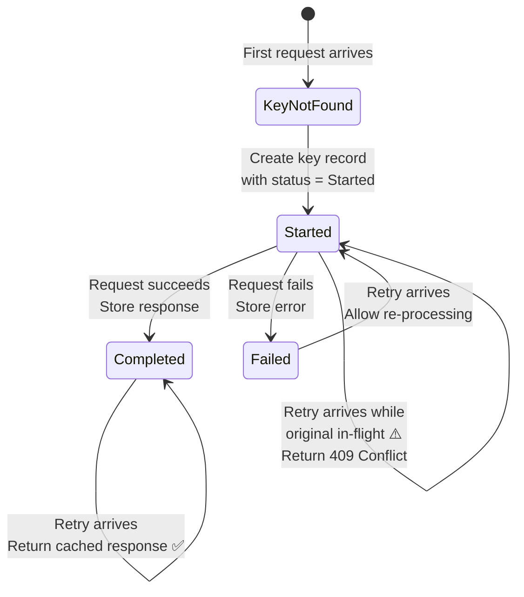
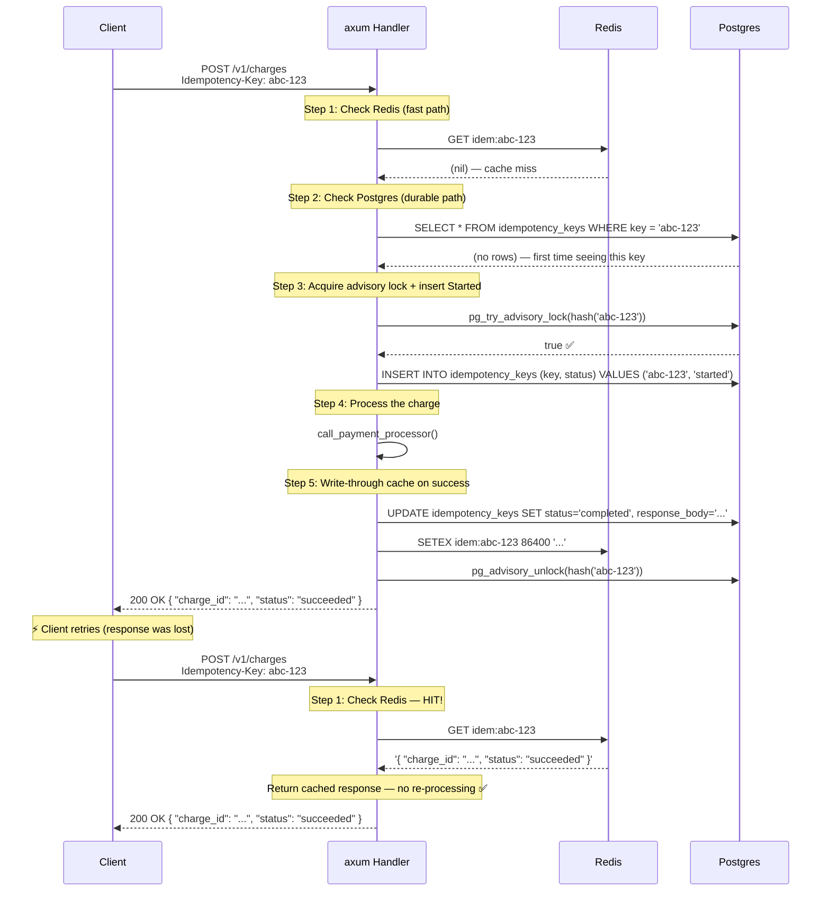

# 1. Idempotency and API Design 🟢

> **The Problem:** A customer on a flaky mobile connection taps "Buy" on a $499 laptop. The HTTP request reaches our server, the charge succeeds, but the response is lost in transit. The client retries. Without idempotency, we charge the customer **twice** — $998 for one laptop. This is the single most common production incident in payment systems, and it is entirely preventable.

---

## Why Idempotency Is the Golden Rule of Payments

In distributed systems, the network is unreliable. Every HTTP request to a payment API can result in one of three outcomes:

| Outcome | Client Sees | Server State |
|---|---|---|
| **Success** | `200 OK` with charge details | Charge committed |
| **Failure** | `4xx` or `5xx` error | No charge (or rolled back) |
| **Ambiguous** | Timeout / connection reset | **Unknown** — charge may or may not have committed |

The third outcome is the killer. The client *must* retry — it has no other option. But if the server treats retries as new requests, it creates duplicate charges.

**Idempotency** means: *Performing the same operation multiple times produces the same result as performing it once.*

### How the Industry Solves This

| Provider | Mechanism |
|---|---|
| **Stripe** | `Idempotency-Key` header; keys expire after 24 hours |
| **PayPal** | `PayPal-Request-Id` header |
| **Adyen** | Merchant-supplied `reference` field (unique per charge) |
| **Square** | `idempotency_key` in request body |

Every major payment processor uses the same pattern: a **client-generated unique key** accompanies each request. The server uses this key to detect and deduplicate retries.

---

## The Idempotency Key Lifecycle

An idempotency key moves through a strict state machine:



### Key Design Decisions

| Decision | Choice | Rationale |
|---|---|---|
| Key generation | Client-side (UUID v7) | Server cannot predict client intent; client owns dedup |
| Key storage | Redis (hot) + Postgres (durable) | Redis for sub-millisecond lookups; Postgres for crash recovery |
| Key TTL | 24 hours | Matches Stripe; prevents unbounded storage growth |
| In-flight handling | `409 Conflict` | Prevents two concurrent requests from racing |
| Failed key behavior | Allow retry | Failed requests should be retryable (the user wants to try again) |

---

## Naive Approach: No Idempotency

Let's start with what most tutorials teach — the dangerous way:

```rust,no_run
// 💥 DOUBLE CHARGE HAZARD: No idempotency protection.
// If the client retries a timed-out request, we charge them again.

use axum::{extract::Json, http::StatusCode, response::IntoResponse};
use serde::{Deserialize, Serialize};

#[derive(Deserialize)]
struct ChargeRequest {
    amount_cents: i64,
    currency: String,
    card_token: String,
}

#[derive(Serialize)]
struct ChargeResponse {
    charge_id: String,
    status: String,
}

// 💥 Every call creates a NEW charge — retries are indistinguishable from new requests.
async fn create_charge(
    Json(req): Json<ChargeRequest>,
) -> Result<impl IntoResponse, StatusCode> {
    // This runs EVERY TIME, even on retries!
    let charge_id = uuid::Uuid::now_v7().to_string();

    // 💥 Call payment processor — may succeed but response lost to client
    let _result = call_payment_processor(&charge_id, req.amount_cents).await;

    Ok(Json(ChargeResponse {
        charge_id,
        status: "succeeded".into(),
    }))
}
#
# async fn call_payment_processor(_id: &str, _amount: i64) -> Result<(), String> { Ok(()) }
```

**What goes wrong:**

1. Client sends `POST /v1/charges` → server charges $499 → response times out.
2. Client retries the exact same `POST /v1/charges` → server **charges another $499**.
3. Customer is out $998. Your ops team gets a 3 AM page. Your finance team spends a week on reconciliation.

---

## Production Approach: Redis-Backed Idempotency with Database Locking

```rust,no_run
// ✅ FIX: Redis-backed idempotency check with Postgres locking.
// Retries return the cached response. Concurrent duplicates get 409 Conflict.

use axum::{
    extract::{Json, State},
    http::{HeaderMap, StatusCode},
    response::IntoResponse,
    middleware,
    Router,
};
use serde::{Deserialize, Serialize};
use sqlx::PgPool;
use std::sync::Arc;
use uuid::Uuid;

// --- Domain Types ---

#[derive(Debug, Clone, Copy, PartialEq, Eq, sqlx::Type)]
#[sqlx(type_name = "idempotency_status", rename_all = "snake_case")]
enum IdempotencyStatus {
    Started,
    Completed,
    Failed,
}

#[derive(Debug, Clone, Serialize, Deserialize)]
struct ChargeResponse {
    charge_id: String,
    amount_cents: i64,
    status: String,
}

#[derive(Deserialize)]
struct ChargeRequest {
    amount_cents: i64,
    currency: String,
    card_token: String,
}

// --- Application State ---

#[derive(Clone)]
struct AppState {
    db: PgPool,
    redis: Arc<redis::Client>,
}

// --- Idempotency Layer ---

/// Check Redis first (fast path), then fall back to Postgres (durable path).
async fn check_idempotency_key(
    state: &AppState,
    key: &str,
) -> Result<Option<(IdempotencyStatus, Option<String>)>, StatusCode> {
    // 1. Fast path: check Redis
    let mut conn = state.redis.get_multiplexed_async_connection().await
        .map_err(|_| StatusCode::INTERNAL_SERVER_ERROR)?;

    let cached: Option<String> = redis::cmd("GET")
        .arg(format!("idem:{key}"))
        .query_async(&mut conn)
        .await
        .map_err(|_| StatusCode::INTERNAL_SERVER_ERROR)?;

    if let Some(cached_response) = cached {
        return Ok(Some((IdempotencyStatus::Completed, Some(cached_response))));
    }

    // 2. Slow path: check Postgres (for crash recovery)
    let row = sqlx::query_as::<_, (IdempotencyStatus, Option<String>)>(
        "SELECT status, response_body FROM idempotency_keys WHERE key = $1"
    )
    .bind(key)
    .fetch_optional(&state.db)
    .await
    .map_err(|_| StatusCode::INTERNAL_SERVER_ERROR)?;

    Ok(row)
}

/// Acquire the idempotency key with a Postgres advisory lock.
/// Returns `true` if we acquired it, `false` if another request holds it.
async fn acquire_idempotency_key(
    state: &AppState,
    key: &str,
) -> Result<bool, StatusCode> {
    // Use a hash of the key as the advisory lock ID
    let lock_id = hash_key_to_i64(key);

    // Try to acquire an advisory lock (non-blocking)
    let acquired: (bool,) = sqlx::query_as(
        "SELECT pg_try_advisory_lock($1)"
    )
    .bind(lock_id)
    .fetch_one(&state.db)
    .await
    .map_err(|_| StatusCode::INTERNAL_SERVER_ERROR)?;

    if !acquired.0 {
        return Ok(false); // Another request is processing this key
    }

    // Insert the key with Started status
    sqlx::query(
        r#"
        INSERT INTO idempotency_keys (key, status, created_at)
        VALUES ($1, 'started', NOW())
        ON CONFLICT (key) DO NOTHING
        "#,
    )
    .bind(key)
    .execute(&state.db)
    .await
    .map_err(|_| StatusCode::INTERNAL_SERVER_ERROR)?;

    Ok(true)
}

/// Mark the key as complete and cache the response in both Postgres and Redis.
async fn complete_idempotency_key(
    state: &AppState,
    key: &str,
    response_body: &str,
) -> Result<(), StatusCode> {
    // 1. Update Postgres (durable)
    sqlx::query(
        r#"
        UPDATE idempotency_keys
        SET status = 'completed', response_body = $1, completed_at = NOW()
        WHERE key = $2
        "#,
    )
    .bind(response_body)
    .bind(key)
    .execute(&state.db)
    .await
    .map_err(|_| StatusCode::INTERNAL_SERVER_ERROR)?;

    // 2. Cache in Redis with 24-hour TTL (fast path for retries)
    let mut conn = state.redis.get_multiplexed_async_connection().await
        .map_err(|_| StatusCode::INTERNAL_SERVER_ERROR)?;

    let _: () = redis::cmd("SETEX")
        .arg(format!("idem:{key}"))
        .arg(86_400) // 24 hours
        .query_async(&mut conn)
        .await
        .map_err(|_| StatusCode::INTERNAL_SERVER_ERROR)?;

    // 3. Release the advisory lock
    let lock_id = hash_key_to_i64(key);
    let _ = sqlx::query("SELECT pg_advisory_unlock($1)")
        .bind(lock_id)
        .execute(&state.db)
        .await;

    Ok(())
}

// --- The Idempotent Charge Handler ---

// ✅ SAFE: Retries return cached responses. Concurrent duplicates get 409.
async fn create_charge(
    State(state): State<AppState>,
    headers: HeaderMap,
    Json(req): Json<ChargeRequest>,
) -> Result<impl IntoResponse, StatusCode> {
    // 1. Extract the idempotency key (required for all mutations)
    let idem_key = headers
        .get("idempotency-key")
        .and_then(|v| v.to_str().ok())
        .ok_or(StatusCode::BAD_REQUEST)?;

    // 2. Check if we've already processed this key
    if let Some((status, response)) = check_idempotency_key(&state, idem_key).await? {
        return match status {
            // ✅ Already completed — return the cached response (idempotent!)
            IdempotencyStatus::Completed => {
                let body = response.ok_or(StatusCode::INTERNAL_SERVER_ERROR)?;
                Ok((StatusCode::OK, body).into_response())
            }
            // ⚠️ Another request is currently processing this key
            IdempotencyStatus::Started => {
                Err(StatusCode::CONFLICT) // 409 — tell client to wait and retry
            }
            // Failed previously — allow retry by falling through
            IdempotencyStatus::Failed => {
                // Fall through to re-process
                Ok(process_charge(&state, idem_key, &req).await?.into_response())
            }
        };
    }

    // 3. New key — acquire the lock
    if !acquire_idempotency_key(&state, idem_key).await? {
        return Err(StatusCode::CONFLICT); // 409 — race condition with concurrent request
    }

    // 4. Process the charge (the actual business logic)
    Ok(process_charge(&state, idem_key, &req).await?.into_response())
}

async fn process_charge(
    state: &AppState,
    idem_key: &str,
    req: &ChargeRequest,
) -> Result<(StatusCode, String), StatusCode> {
    let charge_id = Uuid::now_v7().to_string();

    // Call payment processor (the dangerous part)
    let charge_result = call_payment_processor(&charge_id, req.amount_cents).await;

    match charge_result {
        Ok(()) => {
            let response = serde_json::json!({
                "charge_id": charge_id,
                "amount_cents": req.amount_cents,
                "currency": req.currency,
                "status": "succeeded"
            });
            let response_str = response.to_string();

            // ✅ Cache the successful response
            complete_idempotency_key(state, idem_key, &response_str).await?;

            Ok((StatusCode::OK, response_str))
        }
        Err(_) => {
            // Mark key as failed so retries are allowed
            mark_idempotency_key_failed(state, idem_key).await?;
            Err(StatusCode::BAD_GATEWAY)
        }
    }
}

fn hash_key_to_i64(key: &str) -> i64 {
    use std::hash::{Hash, Hasher};
    let mut hasher = std::collections::hash_map::DefaultHasher::new();
    key.hash(&mut hasher);
    hasher.finish() as i64
}
#
# async fn call_payment_processor(_id: &str, _amount: i64) -> Result<(), String> { Ok(()) }
# async fn mark_idempotency_key_failed(_s: &AppState, _k: &str) -> Result<(), StatusCode> { Ok(()) }
```

---

## The Database Schema

```sql
-- The idempotency_keys table: the source of truth for deduplication.
CREATE TYPE idempotency_status AS ENUM ('started', 'completed', 'failed');

CREATE TABLE idempotency_keys (
    key          TEXT PRIMARY KEY,      -- Client-generated UUID v7
    status       idempotency_status NOT NULL DEFAULT 'started',
    request_path TEXT NOT NULL,          -- e.g., '/v1/charges'
    request_hash BYTEA NOT NULL,         -- SHA-256 of request body (detect mismatched retries)
    response_body TEXT,                  -- Cached JSON response (only when completed)
    created_at   TIMESTAMPTZ NOT NULL DEFAULT NOW(),
    completed_at TIMESTAMPTZ,
    expires_at   TIMESTAMPTZ NOT NULL DEFAULT NOW() + INTERVAL '24 hours'
);

-- Index for TTL cleanup job
CREATE INDEX idx_idempotency_keys_expires ON idempotency_keys (expires_at)
    WHERE status != 'started';

-- Periodic cleanup: delete expired keys
-- Run via pg_cron or a background Tokio task
-- DELETE FROM idempotency_keys WHERE expires_at < NOW();
```

### Request Hash Verification

A subtle but critical detail: what if a client reuses an idempotency key with a **different** request body? (e.g., key `abc` for $499 the first time, then key `abc` for $999 the second time.)

This is a client bug, and we must reject it — not silently return the original $499 response:

```rust,no_run
use sha2::{Sha256, Digest};

fn compute_request_hash(body: &[u8]) -> Vec<u8> {
    let mut hasher = Sha256::new();
    hasher.update(body);
    hasher.finalize().to_vec()
}

// During idempotency check:
// if existing_key.request_hash != compute_request_hash(&new_body) {
//     return Err(StatusCode::UNPROCESSABLE_ENTITY);
//     // 422 — "Idempotency key reused with different request parameters"
// }
```

---

## Architecture: Two-Layer Caching

The idempotency system uses a **write-through cache** pattern:



---

## Race Condition: Concurrent Duplicate Requests

The advisory lock prevents a subtle race condition:

| Time | Request A | Request B |
|---|---|---|
| T1 | Check Redis → miss | |
| T2 | Check Postgres → no rows | Check Redis → miss |
| T3 | `pg_try_advisory_lock` → **true** | Check Postgres → no rows |
| T4 | INSERT Started | `pg_try_advisory_lock` → **false** |
| T5 | Processing charge... | Return `409 Conflict` |
| T6 | UPDATE Completed + cache | |
| T7 | Return `200 OK` | |
| T8 | | Client retries → Redis HIT → `200 OK` |

Without the advisory lock, both requests would race through the SELECT, both see no rows, both INSERT (one would fail on the UNIQUE constraint but the other would charge), and the customer might still be double-charged.

---

## Middleware Extraction: Making Idempotency Reusable

In a real payment gateway, idempotency isn't just for charges — it's for refunds, captures, payouts, and every other mutation. Extract it into a Tower middleware:

```rust,no_run
use axum::{
    body::Body,
    extract::State,
    http::{Request, StatusCode},
    middleware::Next,
    response::Response,
};

/// Tower middleware that enforces idempotency on all mutation endpoints.
/// Non-mutation methods (GET, HEAD, OPTIONS) are passed through unchanged.
async fn idempotency_middleware(
    State(state): State<AppState>,
    request: Request<Body>,
    next: Next,
) -> Result<Response, StatusCode> {
    // Skip idempotency for safe methods
    if request.method().is_safe() {
        return Ok(next.run(request).await);
    }

    // Extract the Idempotency-Key header
    let idem_key = request
        .headers()
        .get("idempotency-key")
        .and_then(|v| v.to_str().ok())
        .map(|s| s.to_owned());

    let idem_key = match idem_key {
        Some(k) => k,
        None => {
            // All mutations MUST have an idempotency key
            return Err(StatusCode::BAD_REQUEST);
        }
    };

    // Check for cached response (Redis → Postgres fallback)
    if let Some((_status, Some(cached))) = check_idempotency_key(&state, &idem_key).await? {
        // ✅ Return cached response without hitting the handler
        return Ok(Response::builder()
            .status(StatusCode::OK)
            .header("x-idempotent-replayed", "true")
            .body(Body::from(cached))
            .unwrap());
    }

    // Acquire the lock or return 409
    if !acquire_idempotency_key(&state, &idem_key).await? {
        return Err(StatusCode::CONFLICT);
    }

    // Proceed to the actual handler
    let response = next.run(request).await;

    // Cache the response for future retries
    // (In production, you'd extract the response body here)

    Ok(response)
}
#
# #[derive(Clone)] struct AppState { db: sqlx::PgPool, redis: std::sync::Arc<redis::Client> }
# async fn check_idempotency_key(_: &AppState, _: &str) -> Result<Option<(IdempotencyStatus, Option<String>)>, StatusCode> { Ok(None) }
# async fn acquire_idempotency_key(_: &AppState, _: &str) -> Result<bool, StatusCode> { Ok(true) }
# #[derive(Debug, Clone, Copy, PartialEq, Eq)] enum IdempotencyStatus { Started, Completed, Failed }
```

### Router Setup

```rust,no_run
# use axum::{Router, routing::post, middleware};
# #[derive(Clone)] struct AppState;
# async fn idempotency_middleware() {}
# async fn create_charge() {}
# async fn create_refund() {}
# async fn capture_payment() {}
# async fn get_charge() {}

let app = Router::new()
    // All mutation routes go through idempotency middleware
    .route("/v1/charges", post(create_charge))
    .route("/v1/refunds", post(create_refund))
    .route("/v1/charges/:id/capture", post(capture_payment))
    .layer(middleware::from_fn_with_state(
        state.clone(),
        idempotency_middleware,
    ))
    // Read routes don't need idempotency
    .route("/v1/charges/:id", axum::routing::get(get_charge))
    .with_state(state);
```

---

## Comparison: Idempotency Strategies

| Strategy | Pros | Cons | When to Use |
|---|---|---|---|
| **Client-generated key** (this chapter) | Simple, no server state needed on first request | Client must remember its key per retry | Standard for payment APIs |
| **Server-generated token** (two-step) | Server controls uniqueness | Extra round-trip to obtain token | Rarely used in payments |
| **Natural key** (e.g., order_id) | No extra headers | Ties idempotency to business logic; hard to reuse | Internal microservice calls |
| **Database UNIQUE constraint only** | Simple | No cached response; still processes the request | CRUD apps (not payments) |

---

## Testing Idempotency

Idempotency is one of the most testable properties in a payment system:

```rust,no_run
#[cfg(test)]
mod tests {
    use super::*;

    #[tokio::test]
    async fn test_retry_returns_same_response() {
        let app = setup_test_app().await;
        let key = uuid::Uuid::now_v7().to_string();

        // First request — creates the charge
        let res1 = app.post("/v1/charges")
            .header("idempotency-key", &key)
            .json(&charge_body(499))
            .send().await;

        assert_eq!(res1.status(), 200);
        let body1: ChargeResponse = res1.json().await;

        // Second request — exact same key, should return cached response
        let res2 = app.post("/v1/charges")
            .header("idempotency-key", &key)
            .json(&charge_body(499))
            .send().await;

        assert_eq!(res2.status(), 200);
        let body2: ChargeResponse = res2.json().await;

        // ✅ Same charge_id — we did NOT create a second charge
        assert_eq!(body1.charge_id, body2.charge_id);
    }

    #[tokio::test]
    async fn test_different_body_same_key_is_rejected() {
        let app = setup_test_app().await;
        let key = uuid::Uuid::now_v7().to_string();

        // First request — $499
        let res1 = app.post("/v1/charges")
            .header("idempotency-key", &key)
            .json(&charge_body(499))
            .send().await;
        assert_eq!(res1.status(), 200);

        // Second request — same key, but $999 (client bug!)
        let res2 = app.post("/v1/charges")
            .header("idempotency-key", &key)
            .json(&charge_body(999))
            .send().await;

        // ✅ Rejected — mismatched request body for the same key
        assert_eq!(res2.status(), 422);
    }

    #[tokio::test]
    async fn test_concurrent_requests_one_wins() {
        let app = setup_test_app().await;
        let key = uuid::Uuid::now_v7().to_string();

        // Fire two concurrent requests with the same key
        let (res1, res2) = tokio::join!(
            app.post("/v1/charges")
                .header("idempotency-key", &key)
                .json(&charge_body(499))
                .send(),
            app.post("/v1/charges")
                .header("idempotency-key", &key)
                .json(&charge_body(499))
                .send(),
        );

        // ✅ Exactly one succeeds, the other gets 409 Conflict
        let statuses = vec![res1.status(), res2.status()];
        assert!(statuses.contains(&200));
        assert!(statuses.contains(&409));
    }
#
#   fn charge_body(_amount: i64) -> serde_json::Value {
#       serde_json::json!({"amount_cents": _amount, "currency": "usd", "card_token": "tok_test"})
#   }
#   async fn setup_test_app() -> TestApp { todo!() }
#   struct TestApp;
#   impl TestApp {
#       fn post(&self, _: &str) -> RequestBuilder { todo!() }
#   }
#   struct RequestBuilder;
#   impl RequestBuilder {
#       fn header(self, _: &str, _: &str) -> Self { self }
#       fn json(self, _: &serde_json::Value) -> Self { self }
#       async fn send(self) -> TestResponse { todo!() }
#   }
#   struct TestResponse;
#   impl TestResponse {
#       fn status(&self) -> u16 { 200 }
#       async fn json<T: serde::de::DeserializeOwned>(&self) -> T { todo!() }
#   }
}
```

---

## Operational Concerns

### Key Expiry and Garbage Collection

Idempotency keys cannot live forever. Strategy:

```rust,no_run
# use std::sync::Arc;
/// Background task: purge expired idempotency keys every hour.
async fn purge_expired_keys(db: sqlx::PgPool) {
    let mut interval = tokio::time::interval(std::time::Duration::from_secs(3600));

    loop {
        interval.tick().await;

        let deleted = sqlx::query(
            "DELETE FROM idempotency_keys WHERE expires_at < NOW() AND status != 'started'"
        )
        .execute(&db)
        .await;

        match deleted {
            Ok(result) => tracing::info!(count = result.rows_affected(), "purged expired idempotency keys"),
            Err(e) => tracing::error!(error = %e, "failed to purge idempotency keys"),
        }
    }
}
```

### Monitoring Dashboard

Track these metrics in production:

| Metric | Alert Threshold | Meaning |
|---|---|---|
| `idempotency.cache_hit_rate` | < 5% (normal) | Ratio of retries to first-time requests |
| `idempotency.conflict_rate` | > 1% | Concurrent duplicate requests — check client SDK |
| `idempotency.started_stuck` | > 0 for 5 min | Key stuck in Started — processing may have crashed |
| `idempotency.key_reuse_mismatch` | > 0 | Client reusing keys with different bodies — SDK bug |

---

> **Key Takeaways**
>
> 1. **Every mutation endpoint in a payment system must be idempotent.** This is not optional — it is the foundational guarantee that prevents double-charges.
> 2. **The client generates the idempotency key** (UUID v7). The server's job is to detect duplicates, not prevent them.
> 3. **Use a two-layer cache** — Redis for sub-millisecond retry responses, Postgres for crash recovery and durability.
> 4. **Advisory locks prevent race conditions** between concurrent requests with the same key. Without them, two in-flight requests can both pass the SELECT check and both process the charge.
> 5. **Hash the request body** and reject retries where the body has changed. This catches client-side bugs that would otherwise silently return stale data.
> 6. **Expire keys after 24 hours.** Idempotency is a retry mechanism, not a permanent dedup store.
> 7. **Extract idempotency into middleware** so every mutation endpoint gets protection without repeating the logic.
