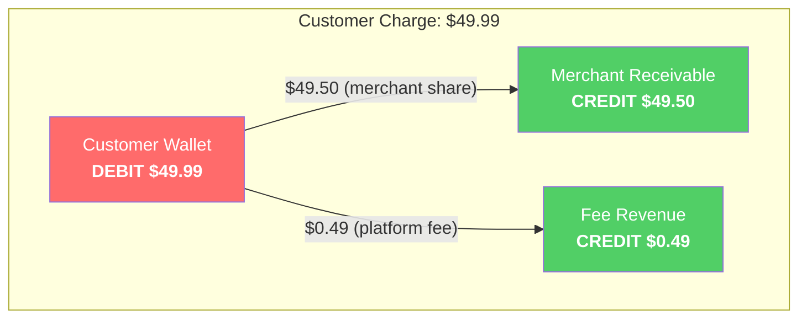
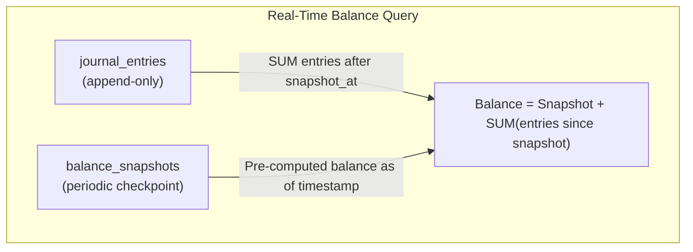
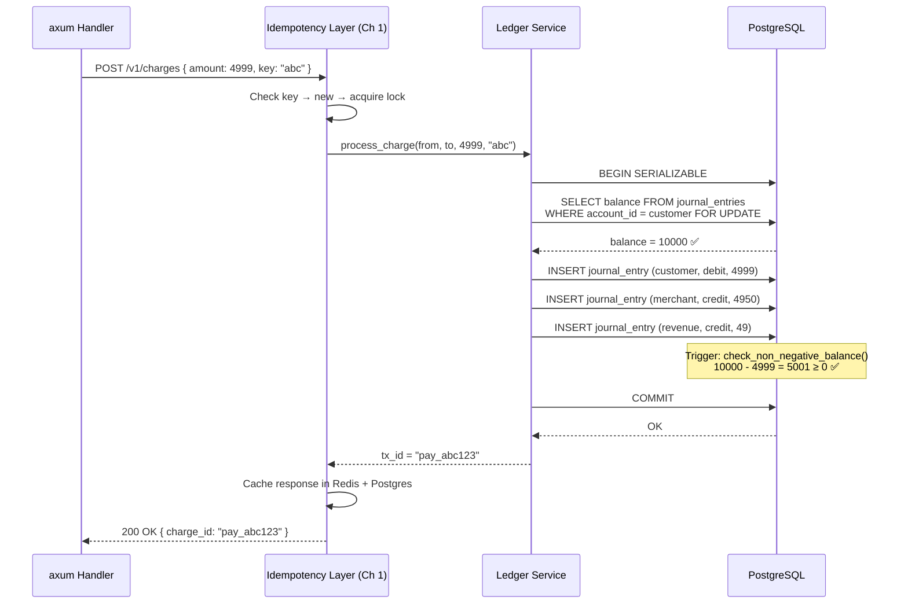

# 2. The Double-Entry Ledger 🟡

> **The Problem:** A payment system stores user balances as a single `balance` column and uses `UPDATE accounts SET balance = balance - 100 WHERE id = 42` to process charges. During a partial failure, the debit succeeds but the corresponding credit doesn't — and $100 vanishes into thin air. There is no audit trail, no way to reconstruct what happened, and the finance team discovers the discrepancy three weeks later during reconciliation. This architecture is a ticking time bomb.

---

## Why Double-Entry Bookkeeping?

Every financial system since 15th-century Venice has used the same invariant:

> **For every debit, there must be an equal and opposite credit. The sum of all entries must always be zero.**

This is not an accounting preference — it is a **conservation law**. Money, like energy, cannot be created or destroyed. If it leaves one account, it must arrive in another.

### Single-Entry vs. Double-Entry

| Property | Single-Entry (UPDATE balance) | Double-Entry (Append-Only Log) |
|---|---|---|
| Audit trail | ❌ No — only the current state | ✅ Yes — full history of every movement |
| Reconstruction | ❌ Impossible — overwritten | ✅ Replay the log from genesis |
| Concurrent safety | ⚠️ Requires row-level locks | ✅ Append-only — no update conflicts |
| Negative balance detection | ⚠️ Race condition window | ✅ DB constraint on derived sum |
| Regulatory compliance | ❌ Fails audit | ✅ Complete trail for regulators |
| Debugging production issues | ❌ "The balance is wrong" — why? | ✅ Exact sequence of events visible |

---

## The Schema: Append-Only Journal

The core of the ledger is a single, append-only table. Balances are **never stored directly** — they are always derived by summing journal entries.

```sql
-- The fundamental unit: a journal entry.
-- Once inserted, rows are NEVER updated or deleted.
CREATE TABLE journal_entries (
    id            BIGSERIAL PRIMARY KEY,
    transaction_id UUID NOT NULL,          -- Groups related entries (e.g., debit + credit)
    account_id    UUID NOT NULL REFERENCES accounts(id),
    entry_type    TEXT NOT NULL CHECK (entry_type IN ('debit', 'credit')),
    amount_cents  BIGINT NOT NULL CHECK (amount_cents > 0),  -- Always positive
    currency      TEXT NOT NULL DEFAULT 'USD',
    description   TEXT NOT NULL,
    created_at    TIMESTAMPTZ NOT NULL DEFAULT NOW(),
    idempotency_key TEXT REFERENCES idempotency_keys(key)  -- Links to Ch 1
);

-- Enforce double-entry: the sum of debits and credits per transaction must be zero.
-- This is verified by a trigger, not application code.

CREATE TABLE accounts (
    id            UUID PRIMARY KEY DEFAULT gen_random_uuid(),
    name          TEXT NOT NULL,
    account_type  TEXT NOT NULL CHECK (account_type IN ('asset', 'liability', 'revenue', 'expense')),
    currency      TEXT NOT NULL DEFAULT 'USD',
    created_at    TIMESTAMPTZ NOT NULL DEFAULT NOW()
);

-- Materialized balance view — derived, never directly written.
-- Refresh periodically or use a trigger for real-time.
CREATE MATERIALIZED VIEW account_balances AS
SELECT
    account_id,
    currency,
    SUM(CASE WHEN entry_type = 'debit'  THEN amount_cents ELSE 0 END) AS total_debits,
    SUM(CASE WHEN entry_type = 'credit' THEN amount_cents ELSE 0 END) AS total_credits,
    SUM(CASE
        WHEN entry_type = 'credit' THEN  amount_cents
        WHEN entry_type = 'debit'  THEN -amount_cents
    END) AS balance_cents
FROM journal_entries
GROUP BY account_id, currency;

CREATE UNIQUE INDEX idx_account_balances ON account_balances (account_id, currency);
```

### Why `BIGINT` and Not `DECIMAL`?

| Type | Precision | Performance | Gotcha |
|---|---|---|---|
| `FLOAT` / `DOUBLE` | ❌ Lossy (0.1 + 0.2 ≠ 0.3) | Fast | **Never use for money** |
| `DECIMAL(19,4)` | ✅ Exact | Slower | Fine, but variable-width |
| `BIGINT` (cents) | ✅ Exact | Fastest | Requires convention: 499 = $4.99 |

We use `BIGINT` in cents. No floating point. No rounding errors. No "$0.01 off" reconciliation bugs at scale.

---

## Naive Approach: Mutable Balance Column

```rust,no_run
// 💥 BALANCE CORRUPTION HAZARD: Updating balances in place.
// Lost updates, no audit trail, impossible to debug.

use sqlx::PgPool;

async fn charge_customer_naive(
    db: &PgPool,
    customer_id: &str,
    amount_cents: i64,
) -> Result<(), sqlx::Error> {
    // 💥 Race condition: two concurrent charges can read the same balance,
    // both subtract, and one charge's debit is silently lost.
    sqlx::query(
        "UPDATE accounts SET balance = balance - $1 WHERE id = $2"
    )
    .bind(amount_cents)
    .bind(customer_id)
    .execute(db)
    .await?;

    // 💥 No corresponding credit entry. Where did the money go?
    // 💥 No transaction_id grouping related movements.
    // 💥 No audit trail. If this was wrong, no way to reconstruct.

    Ok(())
}
```

**What goes wrong:**

1. Two charges of $50 arrive concurrently for a $100 balance.
2. Both read `balance = 100`.
3. Both compute `100 - 50 = 50`.
4. Both write `balance = 50`.
5. Customer paid $100 total, but balance shows $50 deducted. **$50 vanished.**

---

## Production Approach: Append-Only Double-Entry with SQLx

```rust,no_run
// ✅ FIX: Append-only double-entry ledger.
// Money cannot be created or destroyed. Every movement is auditable.

use sqlx::PgPool;
use uuid::Uuid;

#[derive(Debug, Clone)]
struct LedgerEntry {
    transaction_id: Uuid,
    account_id: Uuid,
    entry_type: EntryType,
    amount_cents: i64,
    currency: String,
    description: String,
}

#[derive(Debug, Clone, Copy)]
enum EntryType {
    Debit,
    Credit,
}

impl EntryType {
    fn as_str(&self) -> &'static str {
        match self {
            EntryType::Debit => "debit",
            EntryType::Credit => "credit",
        }
    }
}

/// Transfer money between two accounts using double-entry bookkeeping.
///
/// Invariants enforced:
/// 1. Debit amount == Credit amount (entries balance to zero).
/// 2. Source account has sufficient funds (checked via `HAVING` clause).
/// 3. Both entries are written atomically in a single transaction.
/// 4. No existing row is ever updated or deleted.
async fn transfer(
    db: &PgPool,
    from_account: Uuid,
    to_account: Uuid,
    amount_cents: i64,
    currency: &str,
    description: &str,
    idempotency_key: &str,
) -> Result<Uuid, LedgerError> {
    if amount_cents <= 0 {
        return Err(LedgerError::InvalidAmount);
    }

    let tx_id = Uuid::now_v7();

    // Use a SERIALIZABLE transaction to prevent phantom reads
    let mut tx = db.begin().await.map_err(LedgerError::Database)?;

    // ✅ Step 1: Verify sufficient funds using the append-only log.
    // This query computes the current balance by summing ALL journal entries.
    // No mutable balance column — the log IS the balance.
    let balance: (i64,) = sqlx::query_as(
        r#"
        SELECT COALESCE(SUM(
            CASE
                WHEN entry_type = 'credit' THEN  amount_cents
                WHEN entry_type = 'debit'  THEN -amount_cents
            END
        ), 0) AS balance
        FROM journal_entries
        WHERE account_id = $1 AND currency = $2
        FOR UPDATE  -- Lock rows to prevent concurrent balance reads
        "#,
    )
    .bind(from_account)
    .bind(currency)
    .fetch_one(&mut *tx)
    .await
    .map_err(LedgerError::Database)?;

    if balance.0 < amount_cents {
        return Err(LedgerError::InsufficientFunds {
            available: balance.0,
            requested: amount_cents,
        });
    }

    // ✅ Step 2: Append the debit entry (money leaves source account)
    sqlx::query(
        r#"
        INSERT INTO journal_entries
            (transaction_id, account_id, entry_type, amount_cents, currency, description, idempotency_key)
        VALUES ($1, $2, 'debit', $3, $4, $5, $6)
        "#,
    )
    .bind(tx_id)
    .bind(from_account)
    .bind(amount_cents)
    .bind(currency)
    .bind(description)
    .bind(idempotency_key)
    .execute(&mut *tx)
    .await
    .map_err(LedgerError::Database)?;

    // ✅ Step 3: Append the credit entry (money arrives in destination account)
    sqlx::query(
        r#"
        INSERT INTO journal_entries
            (transaction_id, account_id, entry_type, amount_cents, currency, description, idempotency_key)
        VALUES ($1, $2, 'credit', $3, $4, $5, $6)
        "#,
    )
    .bind(tx_id)
    .bind(to_account)
    .bind(amount_cents)
    .bind(currency)
    .bind(description)
    .bind(idempotency_key)
    .execute(&mut *tx)
    .await
    .map_err(LedgerError::Database)?;

    // ✅ Step 4: Commit atomically — both entries or neither.
    tx.commit().await.map_err(LedgerError::Database)?;

    Ok(tx_id)
}

#[derive(Debug)]
enum LedgerError {
    InvalidAmount,
    InsufficientFunds { available: i64, requested: i64 },
    Database(sqlx::Error),
}
```

---

## The Accounting Model

Every payment involves at least four accounts:



### The Account Types

| Account Type | Normal Balance | Role in Payment System |
|---|---|---|
| **Asset** | Debit | Cash, receivables, funds held in transit |
| **Liability** | Credit | Customer wallets, merchant payables, refund reserves |
| **Revenue** | Credit | Platform fees, interest income |
| **Expense** | Debit | Chargebacks, processor fees, refunds |

### A Complete Charge Flow

For a $49.99 charge with a 1% platform fee:

| # | Account | Type | Debit | Credit | Description |
|---|---|---|---|---|---|
| 1 | Customer Wallet | Liability | $49.99 | | Reduce customer's stored value |
| 2 | Merchant Receivable | Liability | | $49.50 | Merchant's payout balance increases |
| 3 | Fee Revenue | Revenue | | $0.49 | Platform earns 1% fee |

**Verification:** Total debits ($49.99) = Total credits ($49.50 + $0.49 = $49.99). ✅

---

## Database-Level Safety: Preventing Negative Balances

Application code can have bugs. The database must be the last line of defense:

```sql
-- Trigger: Prevent any transaction that would make an account balance negative.
-- This runs INSIDE the transaction, BEFORE commit.
CREATE OR REPLACE FUNCTION check_non_negative_balance()
RETURNS TRIGGER AS $$
DECLARE
    current_balance BIGINT;
BEGIN
    -- Only check on debits (money leaving an account)
    IF NEW.entry_type = 'debit' THEN
        SELECT COALESCE(SUM(
            CASE
                WHEN entry_type = 'credit' THEN  amount_cents
                WHEN entry_type = 'debit'  THEN -amount_cents
            END
        ), 0) INTO current_balance
        FROM journal_entries
        WHERE account_id = NEW.account_id
          AND currency = NEW.currency;

        -- After this debit, the balance would be:
        IF (current_balance - NEW.amount_cents) < 0 THEN
            RAISE EXCEPTION 'Insufficient funds: account % has % cents, cannot debit %',
                NEW.account_id, current_balance, NEW.amount_cents;
        END IF;
    END IF;

    RETURN NEW;
END;
$$ LANGUAGE plpgsql;

CREATE TRIGGER trg_check_balance
    BEFORE INSERT ON journal_entries
    FOR EACH ROW
    EXECUTE FUNCTION check_non_negative_balance();
```

### Why a Trigger and Not Just Application Code?

| Layer | Can Prevent Negative Balance? | Bypass Risk |
|---|---|---|
| Frontend validation | ⚠️ Stale balance | Easily bypassed |
| Application code | ⚠️ Race conditions without `FOR UPDATE` | Another service can write directly |
| Database trigger | ✅ Atomic, inside transaction | Cannot be bypassed by any client |
| Database `CHECK` constraint | ✅ But only for stored columns | Cannot check derived values |

The trigger is the **belt**. The `FOR UPDATE` lock in the Rust code is the **suspenders**. Production systems need both.

---

## Double-Entry Verification Query

This query detects violations of the fundamental invariant — transactions where debits ≠ credits:

```sql
-- Find any transactions that violate the double-entry invariant.
-- In a healthy system, this query must ALWAYS return zero rows.
SELECT
    transaction_id,
    SUM(CASE WHEN entry_type = 'debit'  THEN amount_cents ELSE 0 END) AS total_debits,
    SUM(CASE WHEN entry_type = 'credit' THEN amount_cents ELSE 0 END) AS total_credits
FROM journal_entries
GROUP BY transaction_id
HAVING SUM(CASE WHEN entry_type = 'debit' THEN amount_cents ELSE 0 END)
    != SUM(CASE WHEN entry_type = 'credit' THEN amount_cents ELSE 0 END);

-- Run this as a scheduled health check. If it ever returns rows,
-- you have a critical bug and should page engineering immediately.
```

---

## Refunds: Just Another Journal Entry

Refunds are not `DELETE`s or `UPDATE`s — they are new entries that reverse the original flow:

```rust,no_run
# use sqlx::PgPool;
# use uuid::Uuid;
# #[derive(Debug)] enum LedgerError { Database(sqlx::Error), RefundExceedsCharge }

/// Refund a charge by appending reverse entries.
/// The original charge entries remain untouched (immutable log).
async fn refund(
    db: &PgPool,
    original_transaction_id: Uuid,
    refund_amount_cents: i64,
    idempotency_key: &str,
) -> Result<Uuid, LedgerError> {
    let refund_tx_id = Uuid::now_v7();
    let mut tx = db.begin().await.map_err(LedgerError::Database)?;

    // 1. Fetch the original transaction entries
    let original_entries: Vec<(Uuid, String, i64, String)> = sqlx::query_as(
        r#"
        SELECT account_id, entry_type, amount_cents, currency
        FROM journal_entries
        WHERE transaction_id = $1
        ORDER BY id
        "#,
    )
    .bind(original_transaction_id)
    .fetch_all(&mut *tx)
    .await
    .map_err(LedgerError::Database)?;

    // 2. Compute total already refunded for this original transaction
    let already_refunded: (i64,) = sqlx::query_as(
        r#"
        SELECT COALESCE(SUM(amount_cents), 0)
        FROM journal_entries
        WHERE description LIKE 'Refund of %'
          AND entry_type = 'credit'
          AND account_id = $1
        "#,
    )
    .bind(original_entries[0].0) // The customer's account
    .fetch_one(&mut *tx)
    .await
    .map_err(LedgerError::Database)?;

    let original_charge = original_entries.iter()
        .find(|e| e.1 == "debit")
        .map(|e| e.2)
        .unwrap_or(0);

    if already_refunded.0 + refund_amount_cents > original_charge {
        return Err(LedgerError::RefundExceedsCharge);
    }

    // 3. Append reversed entries — debit where there was credit, credit where debit
    for (account_id, entry_type, _amount, currency) in &original_entries {
        let reversed_type = match entry_type.as_str() {
            "debit" => "credit",   // Money flows BACK to the customer
            "credit" => "debit",   // Money flows AWAY from the merchant/revenue
            _ => unreachable!(),
        };

        // Scale the refund proportionally if it's a partial refund
        let entry_amount = if *_amount == original_charge {
            refund_amount_cents
        } else {
            // Proportional: (original_entry / original_total) * refund_amount
            ((*_amount as f64 / original_charge as f64) * refund_amount_cents as f64).round() as i64
        };

        sqlx::query(
            r#"
            INSERT INTO journal_entries
                (transaction_id, account_id, entry_type, amount_cents, currency, description, idempotency_key)
            VALUES ($1, $2, $3, $4, $5, $6, $7)
            "#,
        )
        .bind(refund_tx_id)
        .bind(account_id)
        .bind(reversed_type)
        .bind(entry_amount)
        .bind(currency)
        .bind(format!("Refund of {}", original_transaction_id))
        .bind(idempotency_key)
        .execute(&mut *tx)
        .await
        .map_err(LedgerError::Database)?;
    }

    tx.commit().await.map_err(LedgerError::Database)?;
    Ok(refund_tx_id)
}
```

---

## Performance: Scaling the Append-Only Log

The obvious concern: if balances are computed by summing the entire log, won't queries slow down as the log grows?

### Strategy: Periodic Snapshots



```sql
-- Snapshot table: materialized balance at a point in time.
CREATE TABLE balance_snapshots (
    account_id    UUID NOT NULL REFERENCES accounts(id),
    currency      TEXT NOT NULL,
    balance_cents BIGINT NOT NULL,
    snapshot_at   TIMESTAMPTZ NOT NULL,  -- Only sum entries AFTER this timestamp
    created_at    TIMESTAMPTZ NOT NULL DEFAULT NOW(),
    PRIMARY KEY (account_id, currency)
);

-- Efficient balance query: snapshot + recent entries only
SELECT
    s.balance_cents + COALESCE(SUM(
        CASE
            WHEN j.entry_type = 'credit' THEN  j.amount_cents
            WHEN j.entry_type = 'debit'  THEN -j.amount_cents
        END
    ), 0) AS current_balance
FROM balance_snapshots s
LEFT JOIN journal_entries j
    ON j.account_id = s.account_id
    AND j.currency = s.currency
    AND j.created_at > s.snapshot_at
WHERE s.account_id = $1 AND s.currency = $2
GROUP BY s.balance_cents;
```

### Snapshot Background Job

```rust,no_run
# use sqlx::PgPool;

/// Periodically snapshot all account balances.
/// Snapshots reduce balance-query cost from O(all entries) to O(recent entries).
async fn snapshot_balances(db: &PgPool) -> Result<(), sqlx::Error> {
    sqlx::query(
        r#"
        INSERT INTO balance_snapshots (account_id, currency, balance_cents, snapshot_at)
        SELECT
            account_id,
            currency,
            SUM(CASE
                WHEN entry_type = 'credit' THEN  amount_cents
                WHEN entry_type = 'debit'  THEN -amount_cents
            END) AS balance_cents,
            NOW() AS snapshot_at
        FROM journal_entries
        GROUP BY account_id, currency
        ON CONFLICT (account_id, currency)
        DO UPDATE SET
            balance_cents = EXCLUDED.balance_cents,
            snapshot_at = EXCLUDED.snapshot_at,
            created_at = NOW()
        "#,
    )
    .execute(db)
    .await?;

    tracing::info!("balance snapshots refreshed");
    Ok(())
}
```

### Performance Comparison

| Approach | Balance Query Cost | Write Cost | Storage |
|---|---|---|---|
| Mutable `balance` column | O(1) | O(1) but unsafe | Minimal |
| Full log scan | O(N) where N = all entries | O(1) append | Log grows forever |
| Log + periodic snapshots | O(K) where K = entries since snapshot | O(1) append | Log + snapshot table |
| Log + real-time materialized view | O(1) read | O(1) write + trigger cost | Log + view |

For most payment systems, **periodic snapshots** (every 1–6 hours) strike the right balance. High-frequency trading systems may prefer real-time materialized views with triggers.

---

## The Complete Data Flow



---

## Common Pitfalls

| Pitfall | Consequence | Prevention |
|---|---|---|
| Using `FLOAT` for amounts | Rounding errors accumulate | Always `BIGINT` (cents) |
| `UPDATE balance` | Lost updates, no audit trail | Append-only journal |
| No `FOR UPDATE` on balance reads | Race conditions | Pessimistic locking |
| Allowing `DELETE` on journal entries | Audit trail destroyed | Revoke DELETE privilege at DB level |
| Not verifying debit == credit per TX | Money appears/disappears | Trigger + scheduled health check |
| Refund by deleting the charge entry | History lost | Append reverse entries |

---

> **Key Takeaways**
>
> 1. **Never `UPDATE` a balance column.** Balances are derived values — compute them by summing the append-only journal. This guarantees a complete, immutable audit trail.
> 2. **Double-entry is a conservation law**, not an accounting preference. For every debit there is an equal credit. The sum of all entries in a transaction is always zero.
> 3. **Use `BIGINT` for money.** Store amounts in the smallest currency unit (cents). Never use floating point.
> 4. **Defense in depth:** The Rust application code checks balances with `FOR UPDATE` locks. The database trigger rejects negative balances. Both must pass for a debit to succeed.
> 5. **Refunds are new entries**, not deletions. The original charge entries remain forever in the immutable log.
> 6. **Periodic balance snapshots** solve the O(N) query cost of summing the full log, reducing it to O(K) where K is only the entries since the last snapshot.
> 7. **Run a scheduled health check** that verifies debits == credits for every transaction. If it ever returns rows, you have a critical bug.
