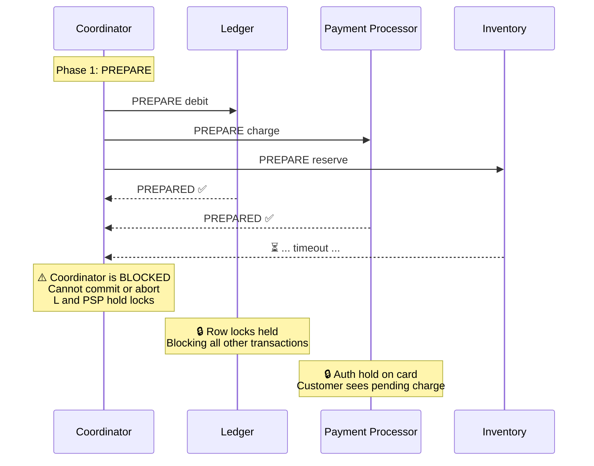
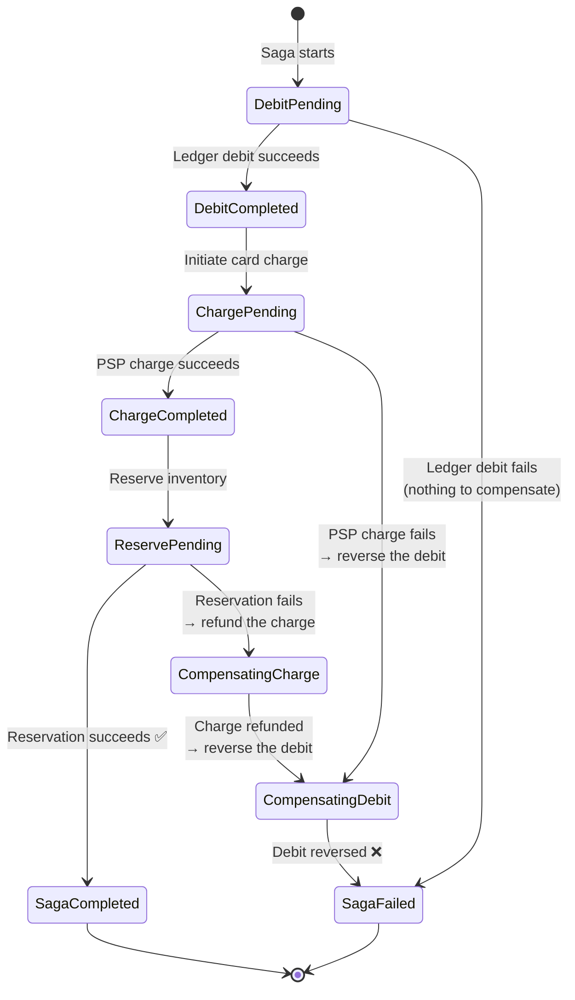
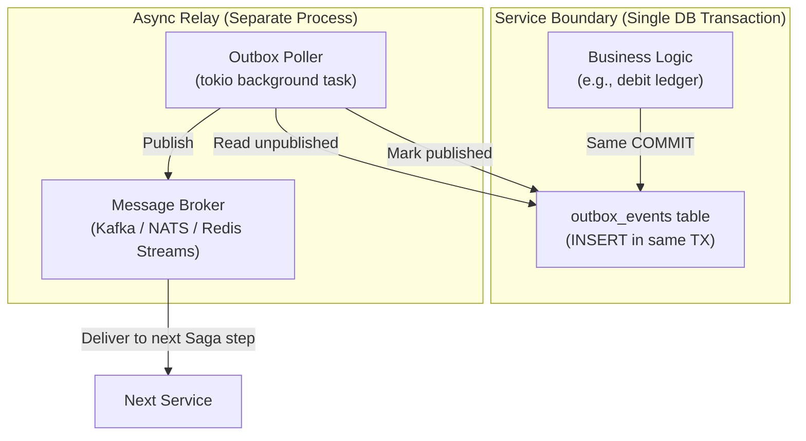
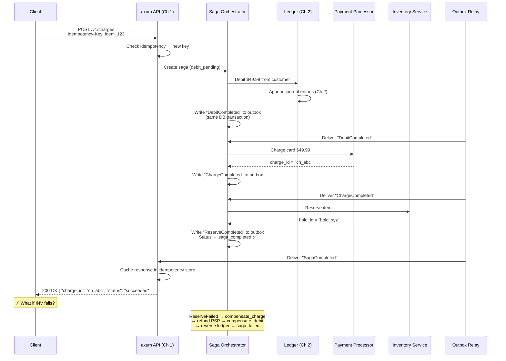

# 3. Distributed Transactions — The Saga Pattern 🔴

> **The Problem:** A payment involves multiple services: the **Ledger** debits the customer, the **Payment Processor** charges the card, and the **Inventory Service** reserves the item. If the card charge succeeds but the inventory reservation fails (out of stock), the customer has been charged for an item they can't receive. A traditional database transaction can't span three services. We need a pattern that guarantees either all steps succeed or all are compensated — even when the network partitions midway.

---

## Why Not 2-Phase Commit (2PC)?

The textbook solution for distributed transactions is 2-Phase Commit. Here's why the payments industry abandoned it:



### 2PC vs. Saga: The Comparison

| Property | 2-Phase Commit (2PC) | Saga Pattern |
|---|---|---|
| Consistency | Strong (ACID) | Eventual (BASE) |
| Availability | ❌ Blocks on participant failure | ✅ Continues despite failures |
| Latency | High (2 round-trips + lock holding) | Lower (asynchronous steps) |
| Lock duration | Entire transaction | Per-step only |
| Participant failure | **Blocks all** until resolved | Compensating actions undo completed steps |
| Coordinator failure | **Blocks all** — requires manual intervention | Outbox relay retries automatically |
| Suitable for payments | ❌ Too fragile at scale | ✅ Industry standard (Stripe, Adyen) |

> **The verdict:** 2PC trades availability for consistency. In payments, a system that is unavailable *loses money*. We need a pattern that is both eventually consistent *and* operationally resilient. That pattern is the **Saga**.

---

## The Saga Pattern

A Saga is a sequence of local transactions where each step has a **compensating action** — a reverse operation that undoes its effect if a later step fails.

### Our Payment Saga: Three Steps

| Step | Service | Action | Compensating Action |
|---|---|---|---|
| 1 | Ledger | Debit customer wallet | Credit customer wallet (reverse the debit) |
| 2 | Payment Processor | Charge the card | Void/refund the charge |
| 3 | Inventory | Reserve the item | Release the reservation |

### The State Machine



---

## Naive Approach: Sequential HTTP Calls

```rust,no_run
// 💥 ORPHANED CHARGE HAZARD: If step 3 fails, the customer is charged
// but gets no item. No automatic compensation.

async fn process_payment_naive(
    order_id: &str,
    customer_id: &str,
    amount_cents: i64,
) -> Result<(), String> {
    // Step 1: Debit the ledger
    debit_ledger(customer_id, amount_cents).await?;

    // Step 2: Charge the card
    charge_card(customer_id, amount_cents).await?;

    // 💥 Step 3: Reserve inventory — FAILS (out of stock)
    reserve_inventory(order_id).await?;
    // ^ If this fails, the customer has been charged $499 for nothing.
    //   The debit is committed. The card is charged.
    //   Manual intervention required to fix.

    Ok(())
}

// 💥 "But I'll just add error handling!" — you're thinking:
async fn process_payment_still_broken(
    order_id: &str,
    customer_id: &str,
    amount_cents: i64,
) -> Result<(), String> {
    debit_ledger(customer_id, amount_cents).await?;
    charge_card(customer_id, amount_cents).await?;

    if let Err(e) = reserve_inventory(order_id).await {
        // 💥 What if THIS refund call also fails? (network partition)
        // Now you have a charged customer AND a failed refund.
        // Your manual exception queue just grew by one.
        refund_card(customer_id, amount_cents).await?;
        credit_ledger(customer_id, amount_cents).await?;
        return Err(e);
    }

    Ok(())
}
#
# async fn debit_ledger(_: &str, _: i64) -> Result<(), String> { Ok(()) }
# async fn charge_card(_: &str, _: i64) -> Result<(), String> { Ok(()) }
# async fn reserve_inventory(_: &str) -> Result<(), String> { Ok(()) }
# async fn refund_card(_: &str, _: i64) -> Result<(), String> { Ok(()) }
# async fn credit_ledger(_: &str, _: i64) -> Result<(), String> { Ok(()) }
```

**The fundamental flaw:** compensation itself can fail, and there's no mechanism to retry it.

---

## Production Approach: Saga Orchestrator with Transactional Outbox

The solution has two components:

1. **Saga Orchestrator** — a state machine that tracks which step we're on and what to compensate if something fails.
2. **Transactional Outbox** — events are written to a database table *inside the same transaction* as the business logic, then asynchronously published. This guarantees that if the business logic commits, the event is eventually published.

### The Outbox Pattern



### The Outbox Table

```sql
CREATE TABLE outbox_events (
    id            BIGSERIAL PRIMARY KEY,
    aggregate_id  UUID NOT NULL,         -- e.g., the saga_id or payment_id
    event_type    TEXT NOT NULL,          -- e.g., 'DebitCompleted', 'ChargeFailed'
    payload       JSONB NOT NULL,         -- Serialized event data
    published     BOOLEAN NOT NULL DEFAULT FALSE,
    created_at    TIMESTAMPTZ NOT NULL DEFAULT NOW()
);

-- Index for the polling query
CREATE INDEX idx_outbox_unpublished ON outbox_events (created_at)
    WHERE published = FALSE;
```

### The Saga State Table

```sql
CREATE TYPE saga_status AS ENUM (
    'debit_pending', 'debit_completed',
    'charge_pending', 'charge_completed',
    'reserve_pending', 'saga_completed',
    'compensating_charge', 'compensating_debit',
    'saga_failed'
);

CREATE TABLE payment_sagas (
    id              UUID PRIMARY KEY DEFAULT gen_random_uuid(),
    order_id        UUID NOT NULL,
    customer_id     UUID NOT NULL,
    amount_cents    BIGINT NOT NULL,
    currency        TEXT NOT NULL DEFAULT 'USD',
    status          saga_status NOT NULL DEFAULT 'debit_pending',
    idempotency_key TEXT NOT NULL UNIQUE,
    ledger_tx_id    UUID,                  -- Filled after debit succeeds
    psp_charge_id   TEXT,                  -- Filled after card charge succeeds
    inventory_hold  UUID,                  -- Filled after reservation succeeds
    error_message   TEXT,
    created_at      TIMESTAMPTZ NOT NULL DEFAULT NOW(),
    updated_at      TIMESTAMPTZ NOT NULL DEFAULT NOW()
);
```

---

## The Saga Orchestrator in Rust

```rust,no_run
// ✅ FIX: Saga orchestrator with transactional outbox.
// Every step writes its event atomically with its business logic.
// Compensation is automatic and retryable.

use sqlx::PgPool;
use uuid::Uuid;
use serde::{Deserialize, Serialize};

#[derive(Debug, Clone, Copy, PartialEq, Eq, sqlx::Type)]
#[sqlx(type_name = "saga_status", rename_all = "snake_case")]
enum SagaStatus {
    DebitPending,
    DebitCompleted,
    ChargePending,
    ChargeCompleted,
    ReservePending,
    SagaCompleted,
    CompensatingCharge,
    CompensatingDebit,
    SagaFailed,
}

#[derive(Debug, Serialize, Deserialize)]
struct SagaEvent {
    saga_id: Uuid,
    event_type: String,
    payload: serde_json::Value,
}

struct SagaOrchestrator {
    db: PgPool,
}

impl SagaOrchestrator {
    /// Advance the saga to its next step based on the incoming event.
    /// This is the central dispatch — every event routes here.
    async fn handle_event(&self, event: SagaEvent) -> Result<(), SagaError> {
        match event.event_type.as_str() {
            "SagaStarted"       => self.step_debit(event.saga_id).await,
            "DebitCompleted"     => self.step_charge(event.saga_id).await,
            "ChargeCompleted"    => self.step_reserve(event.saga_id).await,
            "ReserveCompleted"   => self.complete_saga(event.saga_id).await,

            // Failure events → trigger compensation chain
            "ChargeFailed"       => self.compensate_debit(event.saga_id).await,
            "ReserveFailed"      => self.compensate_charge(event.saga_id).await,
            "ChargeCompensated"  => self.compensate_debit(event.saga_id).await,
            "DebitCompensated"   => self.fail_saga(event.saga_id).await,

            other => {
                tracing::warn!(event_type = other, "unknown saga event");
                Ok(())
            }
        }
    }

    /// Step 1: Debit the customer's ledger.
    async fn step_debit(&self, saga_id: Uuid) -> Result<(), SagaError> {
        let mut tx = self.db.begin().await?;

        let saga = self.load_saga(&mut tx, saga_id).await?;

        // Perform the ledger debit (using Ch 2's double-entry system)
        let ledger_tx_id = perform_ledger_debit(
            &mut tx,
            saga.customer_id,
            saga.amount_cents,
            &saga.currency,
        ).await?;

        // Update saga state
        sqlx::query(
            "UPDATE payment_sagas SET status = 'debit_completed', ledger_tx_id = $1, updated_at = NOW() WHERE id = $2"
        )
        .bind(ledger_tx_id)
        .bind(saga_id)
        .execute(&mut *tx)
        .await?;

        // ✅ Write outbox event IN THE SAME TRANSACTION as the debit.
        // If the debit commits, this event is guaranteed to be published.
        sqlx::query(
            r#"
            INSERT INTO outbox_events (aggregate_id, event_type, payload)
            VALUES ($1, 'DebitCompleted', $2)
            "#,
        )
        .bind(saga_id)
        .bind(serde_json::json!({
            "saga_id": saga_id,
            "ledger_tx_id": ledger_tx_id,
            "amount_cents": saga.amount_cents,
        }))
        .execute(&mut *tx)
        .await?;

        // ✅ Atomic commit: debit + state update + outbox event
        tx.commit().await?;

        Ok(())
    }

    /// Step 2: Charge the card via the PSP.
    async fn step_charge(&self, saga_id: Uuid) -> Result<(), SagaError> {
        let mut tx = self.db.begin().await?;
        let saga = self.load_saga(&mut tx, saga_id).await?;

        // Update status to charge_pending
        sqlx::query(
            "UPDATE payment_sagas SET status = 'charge_pending', updated_at = NOW() WHERE id = $1"
        )
        .bind(saga_id)
        .execute(&mut *tx)
        .await?;

        tx.commit().await?;

        // Call external PSP (outside of our DB transaction — we can't wrap external calls)
        match call_psp_charge(saga.amount_cents, &saga.currency).await {
            Ok(psp_charge_id) => {
                // Record success + emit event atomically
                let mut tx = self.db.begin().await?;

                sqlx::query(
                    "UPDATE payment_sagas SET status = 'charge_completed', psp_charge_id = $1, updated_at = NOW() WHERE id = $2"
                )
                .bind(&psp_charge_id)
                .bind(saga_id)
                .execute(&mut *tx)
                .await?;

                sqlx::query(
                    r#"INSERT INTO outbox_events (aggregate_id, event_type, payload) VALUES ($1, 'ChargeCompleted', $2)"#,
                )
                .bind(saga_id)
                .bind(serde_json::json!({
                    "saga_id": saga_id,
                    "psp_charge_id": psp_charge_id,
                }))
                .execute(&mut *tx)
                .await?;

                tx.commit().await?;
            }
            Err(e) => {
                // Record failure + emit compensation event atomically
                let mut tx = self.db.begin().await?;

                sqlx::query(
                    "UPDATE payment_sagas SET status = 'compensating_debit', error_message = $1, updated_at = NOW() WHERE id = $2"
                )
                .bind(e.to_string())
                .bind(saga_id)
                .execute(&mut *tx)
                .await?;

                sqlx::query(
                    r#"INSERT INTO outbox_events (aggregate_id, event_type, payload) VALUES ($1, 'ChargeFailed', $2)"#,
                )
                .bind(saga_id)
                .bind(serde_json::json!({
                    "saga_id": saga_id,
                    "error": e.to_string(),
                }))
                .execute(&mut *tx)
                .await?;

                tx.commit().await?;
            }
        }

        Ok(())
    }

    /// Step 3: Reserve inventory.
    async fn step_reserve(&self, saga_id: Uuid) -> Result<(), SagaError> {
        let mut tx = self.db.begin().await?;
        let saga = self.load_saga(&mut tx, saga_id).await?;

        sqlx::query(
            "UPDATE payment_sagas SET status = 'reserve_pending', updated_at = NOW() WHERE id = $1"
        )
        .bind(saga_id)
        .execute(&mut *tx)
        .await?;

        tx.commit().await?;

        match reserve_inventory(saga.order_id).await {
            Ok(hold_id) => {
                let mut tx = self.db.begin().await?;

                sqlx::query(
                    "UPDATE payment_sagas SET status = 'saga_completed', inventory_hold = $1, updated_at = NOW() WHERE id = $2"
                )
                .bind(hold_id)
                .bind(saga_id)
                .execute(&mut *tx)
                .await?;

                sqlx::query(
                    r#"INSERT INTO outbox_events (aggregate_id, event_type, payload) VALUES ($1, 'ReserveCompleted', $2)"#,
                )
                .bind(saga_id)
                .bind(serde_json::json!({ "saga_id": saga_id, "hold_id": hold_id }))
                .execute(&mut *tx)
                .await?;

                tx.commit().await?;
            }
            Err(e) => {
                let mut tx = self.db.begin().await?;

                sqlx::query(
                    "UPDATE payment_sagas SET status = 'compensating_charge', error_message = $1, updated_at = NOW() WHERE id = $2"
                )
                .bind(e.to_string())
                .bind(saga_id)
                .execute(&mut *tx)
                .await?;

                sqlx::query(
                    r#"INSERT INTO outbox_events (aggregate_id, event_type, payload) VALUES ($1, 'ReserveFailed', $2)"#,
                )
                .bind(saga_id)
                .bind(serde_json::json!({ "saga_id": saga_id, "error": e.to_string() }))
                .execute(&mut *tx)
                .await?;

                tx.commit().await?;
            }
        }

        Ok(())
    }

    /// Compensation: Refund the PSP charge.
    async fn compensate_charge(&self, saga_id: Uuid) -> Result<(), SagaError> {
        let saga = self.load_saga_direct(saga_id).await?;

        if let Some(psp_charge_id) = &saga.psp_charge_id {
            refund_psp_charge(psp_charge_id).await?;
        }

        let mut tx = self.db.begin().await?;

        sqlx::query(
            "UPDATE payment_sagas SET status = 'compensating_debit', updated_at = NOW() WHERE id = $1"
        )
        .bind(saga_id)
        .execute(&mut *tx)
        .await?;

        sqlx::query(
            r#"INSERT INTO outbox_events (aggregate_id, event_type, payload) VALUES ($1, 'ChargeCompensated', $2)"#,
        )
        .bind(saga_id)
        .bind(serde_json::json!({ "saga_id": saga_id }))
        .execute(&mut *tx)
        .await?;

        tx.commit().await?;
        Ok(())
    }

    /// Compensation: Reverse the ledger debit.
    async fn compensate_debit(&self, saga_id: Uuid) -> Result<(), SagaError> {
        let mut tx = self.db.begin().await?;
        let saga = self.load_saga(&mut tx, saga_id).await?;

        if let Some(ledger_tx_id) = saga.ledger_tx_id {
            reverse_ledger_debit(&mut tx, ledger_tx_id).await?;
        }

        sqlx::query(
            "UPDATE payment_sagas SET status = 'saga_failed', updated_at = NOW() WHERE id = $1"
        )
        .bind(saga_id)
        .execute(&mut *tx)
        .await?;

        sqlx::query(
            r#"INSERT INTO outbox_events (aggregate_id, event_type, payload) VALUES ($1, 'DebitCompensated', $2)"#,
        )
        .bind(saga_id)
        .bind(serde_json::json!({ "saga_id": saga_id }))
        .execute(&mut *tx)
        .await?;

        tx.commit().await?;
        Ok(())
    }

    async fn complete_saga(&self, saga_id: Uuid) -> Result<(), SagaError> {
        sqlx::query(
            "UPDATE payment_sagas SET status = 'saga_completed', updated_at = NOW() WHERE id = $1"
        )
        .bind(saga_id)
        .execute(&self.db)
        .await?;

        tracing::info!(%saga_id, "saga completed successfully");
        Ok(())
    }

    async fn fail_saga(&self, saga_id: Uuid) -> Result<(), SagaError> {
        sqlx::query(
            "UPDATE payment_sagas SET status = 'saga_failed', updated_at = NOW() WHERE id = $1"
        )
        .bind(saga_id)
        .execute(&self.db)
        .await?;

        tracing::error!(%saga_id, "saga failed — all compensations applied");
        Ok(())
    }

    async fn load_saga(
        &self,
        tx: &mut sqlx::Transaction<'_, sqlx::Postgres>,
        saga_id: Uuid,
    ) -> Result<PaymentSaga, SagaError> {
        sqlx::query_as::<_, PaymentSaga>(
            "SELECT * FROM payment_sagas WHERE id = $1 FOR UPDATE"
        )
        .bind(saga_id)
        .fetch_one(&mut **tx)
        .await
        .map_err(SagaError::from)
    }

    async fn load_saga_direct(&self, saga_id: Uuid) -> Result<PaymentSaga, SagaError> {
        sqlx::query_as::<_, PaymentSaga>(
            "SELECT * FROM payment_sagas WHERE id = $1"
        )
        .bind(saga_id)
        .fetch_one(&self.db)
        .await
        .map_err(SagaError::from)
    }
}

#[derive(Debug, sqlx::FromRow)]
struct PaymentSaga {
    id: Uuid,
    order_id: Uuid,
    customer_id: Uuid,
    amount_cents: i64,
    currency: String,
    status: SagaStatus,
    idempotency_key: String,
    ledger_tx_id: Option<Uuid>,
    psp_charge_id: Option<String>,
    inventory_hold: Option<Uuid>,
    error_message: Option<String>,
}

#[derive(Debug)]
enum SagaError {
    Database(sqlx::Error),
    ExternalService(String),
}

impl From<sqlx::Error> for SagaError {
    fn from(e: sqlx::Error) -> Self { SagaError::Database(e) }
}
#
# async fn perform_ledger_debit(_: &mut sqlx::Transaction<'_, sqlx::Postgres>, _: Uuid, _: i64, _: &str) -> Result<Uuid, SagaError> { Ok(Uuid::now_v7()) }
# async fn call_psp_charge(_: i64, _: &str) -> Result<String, SagaError> { Ok("ch_123".into()) }
# async fn reserve_inventory(_: Uuid) -> Result<Uuid, SagaError> { Ok(Uuid::now_v7()) }
# async fn refund_psp_charge(_: &str) -> Result<(), SagaError> { Ok(()) }
# async fn reverse_ledger_debit(_: &mut sqlx::Transaction<'_, sqlx::Postgres>, _: Uuid) -> Result<(), SagaError> { Ok(()) }
```

---

## The Outbox Relay

The outbox relay is a background task that polls the `outbox_events` table and publishes events to the message broker:

```rust,no_run
use sqlx::PgPool;
use std::time::Duration;

/// Background task: poll the outbox table and publish unpublished events.
/// This guarantees at-least-once delivery — events may be published more than
/// once if the relay crashes after publishing but before marking as published.
/// Consumers MUST be idempotent.
async fn outbox_relay(db: PgPool) {
    let mut interval = tokio::time::interval(Duration::from_millis(100));

    loop {
        interval.tick().await;

        // Fetch a batch of unpublished events
        let events: Vec<(i64, String, serde_json::Value)> = match sqlx::query_as(
            r#"
            SELECT id, event_type, payload
            FROM outbox_events
            WHERE published = FALSE
            ORDER BY created_at
            LIMIT 100
            FOR UPDATE SKIP LOCKED  -- Allow multiple relay instances
            "#,
        )
        .fetch_all(&db)
        .await {
            Ok(events) => events,
            Err(e) => {
                tracing::error!(error = %e, "outbox relay: failed to fetch events");
                continue;
            }
        };

        for (event_id, event_type, payload) in &events {
            // Publish to message broker (Kafka, NATS, Redis Streams, etc.)
            if let Err(e) = publish_to_broker(event_type, payload).await {
                tracing::error!(error = %e, event_id, "outbox relay: failed to publish");
                continue; // Will retry on next poll
            }

            // Mark as published
            if let Err(e) = sqlx::query(
                "UPDATE outbox_events SET published = TRUE WHERE id = $1"
            )
            .bind(event_id)
            .execute(&db)
            .await {
                tracing::error!(error = %e, event_id, "outbox relay: failed to mark published");
                // Not critical — will be re-published (at-least-once)
            }
        }
    }
}
#
# async fn publish_to_broker(_: &str, _: &serde_json::Value) -> Result<(), String> { Ok(()) }
```

### Why `FOR UPDATE SKIP LOCKED`?

This allows **multiple relay instances** to poll concurrently without processing the same event twice:

| Instance A | Instance B |
|---|---|
| Lock events 1–5 | Events 1–5 are locked → skip to 6–10 |
| Publish events 1–5 | Publish events 6–10 |
| Mark 1–5 published | Mark 6–10 published |

---

## Failure Scenarios and Recovery

### Scenario 1: Service Crashes After Debit But Before Emitting Event

| What happened | Ledger debit committed, but outbox event was in the same TX → also committed |
|---|---|
| Recovery | Outbox relay picks up the event and publishes it. Saga continues. |
| Customer impact | None — brief delay (~100ms) |

### Scenario 2: PSP Returns Ambiguous Timeout

| What happened | Card may or may not have been charged |
|---|---|
| Recovery | Saga enters `charge_pending` with a PSP reference. Background job queries PSP for status. |
| Customer impact | "Processing" state; resolved within seconds |

### Scenario 3: Network Partition During Compensation

| What happened | Refund call to PSP failed |
|---|---|
| Recovery | Compensation event stays in outbox. Relay retries with exponential backoff. |
| Customer impact | Temporary double-charge; automatically resolved |

### Scenario 4: Database Crashes

| What happened | Postgres restarts; uncommitted transactions are rolled back |
|---|---|
| Recovery | Saga is in its last committed state. Outbox relay resumes from last unpublished event. |
| Customer impact | In-flight sagas resume automatically |

---

## Choreography vs. Orchestration

There are two flavors of the Saga pattern:

| Aspect | Choreography | Orchestration (this chapter) |
|---|---|---|
| Control flow | Each service knows the next step | Central orchestrator drives all steps |
| Coupling | Services coupled to each other | Services coupled only to orchestrator |
| Debugging | Hard — events scattered across services | Easy — single saga table shows full state |
| Adding steps | Requires modifying multiple services | Modify orchestrator only |
| Best for | Simple flows (2–3 steps) | Complex flows (3+ steps with branching) |

We use **orchestration** because payment flows have complex failure modes and branching compensation logic that are much easier to reason about in a single state machine.

---

## Monitoring: The Stuck Saga Detector

Sagas that get stuck in an intermediate state indicate a bug or infrastructure failure:

```rust,no_run
# use sqlx::PgPool;

/// Alert on sagas stuck in non-terminal states for too long.
async fn detect_stuck_sagas(db: &PgPool) {
    let stuck: Vec<(uuid::Uuid, String, chrono::DateTime<chrono::Utc>)> = sqlx::query_as(
        r#"
        SELECT id, status::TEXT, updated_at
        FROM payment_sagas
        WHERE status NOT IN ('saga_completed', 'saga_failed')
          AND updated_at < NOW() - INTERVAL '5 minutes'
        ORDER BY updated_at
        "#,
    )
    .fetch_all(db)
    .await
    .unwrap_or_default();

    for (saga_id, status, updated_at) in &stuck {
        tracing::error!(
            %saga_id,
            status,
            ?updated_at,
            "STUCK SAGA: has not progressed for >5 minutes"
        );
        // In production: emit metric, page on-call, auto-retry
    }
}
```

---

## End-to-End Flow With All Safeguards



---

> **Key Takeaways**
>
> 1. **Never use 2-Phase Commit for payment workflows.** It blocks on participant failure and trades availability for consistency — the wrong tradeoff for payments.
> 2. **The Saga Pattern models multi-step workflows** as a sequence of local transactions, each with a compensating action. If step N fails, steps N-1, N-2, ... are compensated in reverse order.
> 3. **The Transactional Outbox guarantees** that if the business logic commits, the event *will* be published. No dual-write problem. No lost events.
> 4. **Business logic and outbox event must be in the same database transaction.** This is the critical invariant that makes the pattern work.
> 5. **Compensating actions must be idempotent.** The outbox relay provides at-least-once delivery, so compensations may be invoked more than once.
> 6. **Use orchestration (not choreography) for payment sagas.** The central state machine makes debugging, monitoring, and adding new steps dramatically simpler.
> 7. **Monitor for stuck sagas.** Any saga in a non-terminal state for more than a few minutes indicates a bug or infrastructure failure and should page on-call.
