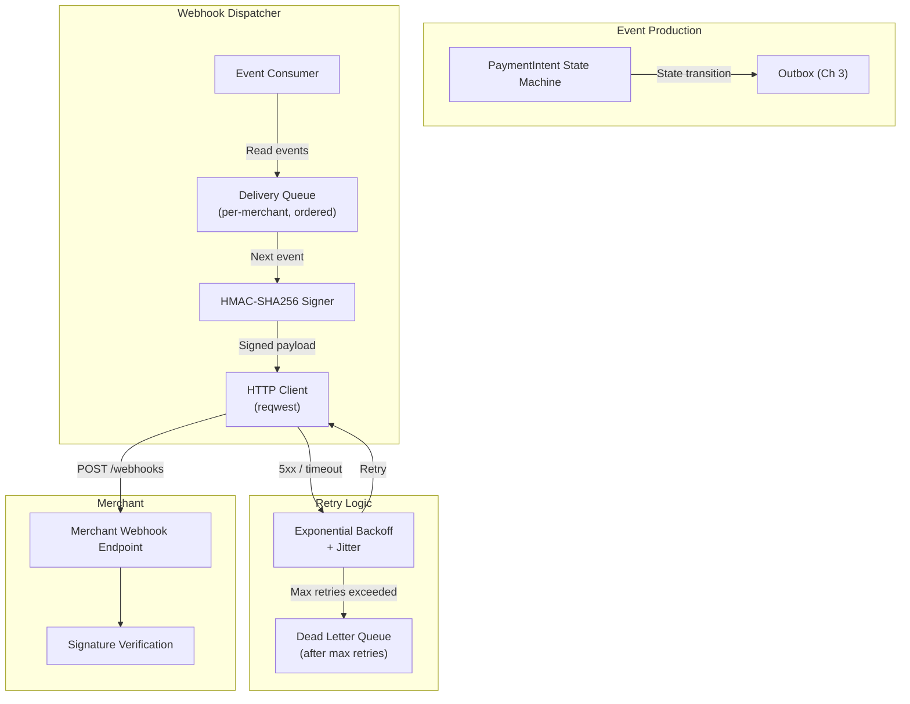

# 4. State Machines and Webhook Delivery 🔴

> **The Problem:** A `PaymentIntent` can be in one of many states: `Created`, `Processing`, `Succeeded`, `Failed`, `Refunded`, `Disputed`. A bug in the application code attempts to refund a payment that was never captured, or transitions a `Failed` payment directly to `Refunded` — creating an impossible financial state. Meanwhile, the merchant's webhook endpoint receives duplicate events in random order, processes a `payment.succeeded` event for a payment they've already refunded, and double-credits the customer. Both problems — invalid state transitions and unreliable event delivery — have the same root cause: **state is controlled by convention instead of the type system.**

---

## Part 1: Encoding State Machines in Rust's Type System

### The Typestate Pattern

The Typestate pattern uses Rust's type system to make illegal state transitions **unrepresentable** — they don't just fail at runtime, they fail at compile time.

The key insight: instead of storing the state as a `String` or `enum` field, encode the state into the **type itself**. A `PaymentIntent<Created>` and a `PaymentIntent<Succeeded>` are different types. You literally cannot call `.refund()` on a `PaymentIntent<Created>` because the method doesn't exist on that type.

### Naive Approach: Runtime Enum Checking

```rust,no_run
// 💥 INVALID STATE TRANSITION: Runtime checking of payment states.
// Nothing prevents calling .refund() on a payment in the wrong state.

#[derive(Debug, Clone, PartialEq)]
enum PaymentStatus {
    Created,
    Processing,
    Succeeded,
    Failed,
    Refunded,
    Disputed,
}

struct PaymentIntent {
    id: String,
    status: PaymentStatus,
    amount_cents: i64,
}

impl PaymentIntent {
    // 💥 This compiles fine, but is wrong at runtime if status != Succeeded
    fn refund(&mut self) -> Result<(), String> {
        if self.status != PaymentStatus::Succeeded {
            // 💥 Runtime error — discovered in production, not at compile time
            return Err(format!("Cannot refund payment in state: {:?}", self.status));
        }
        self.status = PaymentStatus::Refunded;
        Ok(())
    }

    // 💥 What about this? Processing → Refunded? The compiler says "sure!"
    fn force_refund(&mut self) {
        self.status = PaymentStatus::Refunded; // Compiles. Ships. Breaks.
    }
}
```

**What goes wrong:**

1. A new engineer adds a code path that calls `.refund()` without checking the status.
2. The runtime check catches it — in production, at 2 AM, on the highest-throughput day of the year.
3. The error handling for "invalid state" either panics (taking down the service) or silently fails (leaving the system in an inconsistent state).

### Production Approach: Compile-Time Typestate

```rust,no_run
// ✅ FIX: Typestate pattern — invalid transitions are compile-time errors.
// You literally cannot call .refund() on a PaymentIntent<Created>.

use std::marker::PhantomData;
use uuid::Uuid;

// --- State marker types (zero-sized, no runtime cost) ---

#[derive(Debug)] struct Created;
#[derive(Debug)] struct Processing;
#[derive(Debug)] struct Succeeded;
#[derive(Debug)] struct Failed;
#[derive(Debug)] struct Refunded;

// --- PaymentIntent is generic over its state ---

#[derive(Debug)]
struct PaymentIntent<S> {
    id: Uuid,
    amount_cents: i64,
    currency: String,
    _state: PhantomData<S>,
}

// --- Transitions are methods that CONSUME self and return a new type ---

impl PaymentIntent<Created> {
    fn new(amount_cents: i64, currency: &str) -> Self {
        PaymentIntent {
            id: Uuid::now_v7(),
            amount_cents,
            currency: currency.to_owned(),
            _state: PhantomData,
        }
    }

    /// Created → Processing: Begin processing the payment.
    fn process(self) -> PaymentIntent<Processing> {
        PaymentIntent {
            id: self.id,
            amount_cents: self.amount_cents,
            currency: self.currency,
            _state: PhantomData,
        }
    }

    // ✅ No .refund() method exists here. Calling it on PaymentIntent<Created>
    //    is a COMPILE ERROR, not a runtime error.
}

impl PaymentIntent<Processing> {
    /// Processing → Succeeded: Payment was captured.
    fn succeed(self) -> PaymentIntent<Succeeded> {
        PaymentIntent {
            id: self.id,
            amount_cents: self.amount_cents,
            currency: self.currency,
            _state: PhantomData,
        }
    }

    /// Processing → Failed: Payment was declined.
    fn fail(self) -> PaymentIntent<Failed> {
        PaymentIntent {
            id: self.id,
            amount_cents: self.amount_cents,
            currency: self.currency,
            _state: PhantomData,
        }
    }
}

impl PaymentIntent<Succeeded> {
    /// Succeeded → Refunded: Only succeeded payments can be refunded.
    fn refund(self) -> PaymentIntent<Refunded> {
        PaymentIntent {
            id: self.id,
            amount_cents: self.amount_cents,
            currency: self.currency,
            _state: PhantomData,
        }
    }
}

// --- Usage: The compiler enforces the state machine ---

fn demo() {
    let payment = PaymentIntent::new(4999, "USD");

    // ✅ Valid: Created → Processing → Succeeded → Refunded
    let payment = payment.process();
    let payment = payment.succeed();
    let _refunded = payment.refund();

    // ❌ COMPILE ERROR: PaymentIntent<Created> has no method named `refund`
    // let invalid = PaymentIntent::new(4999, "USD").refund();

    // ❌ COMPILE ERROR: PaymentIntent<Failed> has no method named `refund`
    // let also_invalid = PaymentIntent::new(4999, "USD").process().fail().refund();
}
```

### The Valid State Transition Graph

```mermaid
stateDiagram-v2
    [*] --> Created: PaymentIntent::new()
    Created --> Processing: .process()
    Processing --> Succeeded: .succeed()
    Processing --> Failed: .fail()
    Succeeded --> Refunded: .refund()

    note right of Created: Only .process() is available
    note right of Processing: .succeed() OR .fail()
    note right of Succeeded: .refund() is available
    note right of Failed: Terminal — no transitions
    note right of Refunded: Terminal — no transitions
```

### Comparison: Runtime vs. Compile-Time Safety

| Property | Runtime Enum | Typestate Pattern |
|---|---|---|
| Invalid transitions detected | At runtime (production) | At compile time (IDE) |
| Test coverage needed | Every invalid transition must be tested | Zero tests needed — impossible to express |
| New engineer risk | High — can bypass checks | Zero — compiler rejects invalid code |
| Performance overhead | Match on enum every transition | **Zero** — PhantomData is ZST, optimized away |
| Serialization | Easy (it's just a String) | Requires adapter (see below) |
| Database storage | Easy | Requires adapter (see below) |

---

## Bridging Typestate and the Database

The typestate pattern shines inside a request handler, but the database stores the payment as a single row. We need an adapter:

```rust,no_run
use uuid::Uuid;
use serde::{Serialize, Deserialize};
use std::marker::PhantomData;

# #[derive(Debug)] struct Created;
# #[derive(Debug)] struct Processing;
# #[derive(Debug)] struct Succeeded;
# #[derive(Debug)] struct Failed;
# #[derive(Debug)] struct Refunded;
# #[derive(Debug)]
# struct PaymentIntent<S> { id: Uuid, amount_cents: i64, currency: String, _state: PhantomData<S> }

/// The database row — state is a string. Used for persistence only.
#[derive(Debug, sqlx::FromRow, Serialize, Deserialize)]
struct PaymentRow {
    id: Uuid,
    amount_cents: i64,
    currency: String,
    status: String, // "created", "processing", "succeeded", "failed", "refunded"
}

/// Load from DB → reconstruct the typestate → perform transition → save back.
enum TypedPayment {
    Created(PaymentIntent<Created>),
    Processing(PaymentIntent<Processing>),
    Succeeded(PaymentIntent<Succeeded>),
    Failed(PaymentIntent<Failed>),
    Refunded(PaymentIntent<Refunded>),
}

impl TypedPayment {
    fn from_row(row: PaymentRow) -> Result<Self, String> {
        let mk = |_state| PaymentIntent {
            id: row.id, amount_cents: row.amount_cents,
            currency: row.currency.clone(), _state: PhantomData,
        };

        match row.status.as_str() {
            "created"    => Ok(TypedPayment::Created(mk(PhantomData::<Created>))),
            "processing" => Ok(TypedPayment::Processing(mk(PhantomData::<Processing>))),
            "succeeded"  => Ok(TypedPayment::Succeeded(mk(PhantomData::<Succeeded>))),
            "failed"     => Ok(TypedPayment::Failed(mk(PhantomData::<Failed>))),
            "refunded"   => Ok(TypedPayment::Refunded(mk(PhantomData::<Refunded>))),
            other        => Err(format!("unknown payment status: {other}")),
        }
    }
}

/// Example: the /v1/charges/:id/refund handler.
/// The typestate pattern guarantees that only Succeeded payments can be refunded.
async fn refund_handler(
    db: &sqlx::PgPool,
    payment_id: Uuid,
) -> Result<PaymentRow, String> {
    let row = sqlx::query_as::<_, PaymentRow>(
        "SELECT * FROM payments WHERE id = $1"
    )
    .bind(payment_id)
    .fetch_one(db)
    .await
    .map_err(|e| e.to_string())?;

    let typed = TypedPayment::from_row(row)?;

    match typed {
        TypedPayment::Succeeded(payment) => {
            // ✅ Type system guarantees .refund() is valid here
            let refunded = payment.refund();

            sqlx::query(
                "UPDATE payments SET status = 'refunded', updated_at = NOW() WHERE id = $1"
            )
            .bind(refunded.id)
            .execute(db)
            .await
            .map_err(|e| e.to_string())?;

            Ok(PaymentRow {
                id: refunded.id,
                amount_cents: refunded.amount_cents,
                currency: refunded.currency,
                status: "refunded".into(),
            })
        }
        _ => Err("Only succeeded payments can be refunded".into()),
    }
}
```

---

## Part 2: Reliable Webhook Delivery

Merchants integrate with our payment gateway by receiving webhook events (e.g., `payment.succeeded`, `payment.refunded`). These webhooks must be:

1. **At-least-once delivered** — if the merchant's server is down, we retry.
2. **Signature-verified** — the merchant must be able to verify the webhook came from us, not an attacker.
3. **Ordered within a payment** — `payment.succeeded` must arrive before `payment.refunded` for the same payment.
4. **Idempotent** — merchants may receive the same event twice and must handle it safely.

### The Webhook Delivery Pipeline



### The Webhook Events Table

```sql
CREATE TABLE webhook_events (
    id              BIGSERIAL PRIMARY KEY,
    event_id        UUID NOT NULL UNIQUE DEFAULT gen_random_uuid(),
    event_type      TEXT NOT NULL,           -- 'payment.succeeded', 'payment.refunded', etc.
    merchant_id     UUID NOT NULL,
    payment_id      UUID NOT NULL,
    payload         JSONB NOT NULL,
    status          TEXT NOT NULL DEFAULT 'pending'
                    CHECK (status IN ('pending', 'delivered', 'failed', 'dead_letter')),
    attempts        INT NOT NULL DEFAULT 0,
    max_attempts    INT NOT NULL DEFAULT 8,  -- 8 retries with exponential backoff ≈ ~24 hours
    next_attempt_at TIMESTAMPTZ NOT NULL DEFAULT NOW(),
    last_error      TEXT,
    delivered_at    TIMESTAMPTZ,
    created_at      TIMESTAMPTZ NOT NULL DEFAULT NOW()
);

CREATE INDEX idx_webhook_pending ON webhook_events (next_attempt_at)
    WHERE status = 'pending';
```

---

### Cryptographic Signature: HMAC-SHA256

Every webhook is signed so merchants can verify authenticity:

```rust,no_run
// ✅ HMAC-SHA256 webhook signature — prevents spoofing.

use hmac::{Hmac, Mac};
use sha2::Sha256;

type HmacSha256 = Hmac<Sha256>;

/// Sign a webhook payload.
/// The merchant uses the same secret to verify the signature.
fn sign_webhook(payload: &[u8], secret: &[u8], timestamp: i64) -> String {
    // Include the timestamp to prevent replay attacks
    let signed_content = format!("{}.{}", timestamp, std::str::from_utf8(payload).unwrap_or(""));

    let mut mac = HmacSha256::new_from_slice(secret)
        .expect("HMAC can take key of any size");
    mac.update(signed_content.as_bytes());

    let result = mac.finalize();
    hex::encode(result.into_bytes())
}

/// Merchant-side: verify the webhook signature.
fn verify_webhook(
    payload: &[u8],
    signature: &str,
    secret: &[u8],
    timestamp: i64,
    tolerance_seconds: i64,
) -> Result<(), WebhookError> {
    // 1. Reject stale timestamps (prevent replay attacks)
    let now = chrono::Utc::now().timestamp();
    if (now - timestamp).abs() > tolerance_seconds {
        return Err(WebhookError::TimestampTooOld);
    }

    // 2. Recompute the signature
    let expected = sign_webhook(payload, secret, timestamp);

    // 3. Constant-time comparison (prevents timing attacks)
    if !constant_time_eq(expected.as_bytes(), signature.as_bytes()) {
        return Err(WebhookError::InvalidSignature);
    }

    Ok(())
}

/// Constant-time byte comparison to prevent timing side-channel attacks.
fn constant_time_eq(a: &[u8], b: &[u8]) -> bool {
    if a.len() != b.len() {
        return false;
    }
    a.iter()
        .zip(b.iter())
        .fold(0u8, |acc, (x, y)| acc | (x ^ y))
        == 0
}

#[derive(Debug)]
enum WebhookError {
    InvalidSignature,
    TimestampTooOld,
}
```

### Webhook Headers Sent to Merchant

| Header | Value | Purpose |
|---|---|---|
| `X-Webhook-Id` | `evt_abc123` | Unique event ID for idempotency |
| `X-Webhook-Timestamp` | `1711900000` | Unix timestamp of signing |
| `X-Webhook-Signature` | `hmac_sha256=a1b2c3...` | HMAC-SHA256 of `{timestamp}.{payload}` |
| `Content-Type` | `application/json` | Standard JSON body |

---

### Exponential Backoff with Jitter

Retries use exponential backoff with full jitter to avoid thundering herds:

```rust,no_run
use std::time::Duration;

/// Calculate the next retry delay with exponential backoff and full jitter.
///
/// Attempt 0: ~1 second
/// Attempt 1: ~2 seconds
/// Attempt 2: ~4 seconds
/// Attempt 3: ~8 seconds
/// ...
/// Attempt 7: ~128 seconds (~2 minutes)
///
/// Total coverage over 8 attempts: ~4.25 minutes to ~8.5 hours
fn next_retry_delay(attempt: u32) -> Duration {
    let base_ms: u64 = 1000; // 1 second
    let max_ms: u64 = 3_600_000; // 1 hour cap

    let exponential_ms = base_ms.saturating_mul(2u64.saturating_pow(attempt));
    let capped_ms = exponential_ms.min(max_ms);

    // Full jitter: uniform random in [0, capped_ms]
    let jittered_ms = rand::random::<u64>() % (capped_ms + 1);

    Duration::from_millis(jittered_ms)
}
```

### The Webhook Dispatcher

```rust,no_run
use sqlx::PgPool;
use reqwest::Client;
use std::time::Duration;

struct WebhookDispatcher {
    db: PgPool,
    http: Client,
}

impl WebhookDispatcher {
    /// Background task: poll for pending webhook events and deliver them.
    async fn run(&self) {
        let mut interval = tokio::time::interval(Duration::from_millis(500));

        loop {
            interval.tick().await;

            let events: Vec<WebhookEvent> = match sqlx::query_as(
                r#"
                SELECT id, event_id, event_type, merchant_id, payload, attempts, max_attempts
                FROM webhook_events
                WHERE status = 'pending'
                  AND next_attempt_at <= NOW()
                ORDER BY created_at
                LIMIT 50
                FOR UPDATE SKIP LOCKED
                "#,
            )
            .fetch_all(&self.db)
            .await {
                Ok(events) => events,
                Err(e) => {
                    tracing::error!(error = %e, "webhook dispatcher: query failed");
                    continue;
                }
            };

            for event in events {
                self.deliver(event).await;
            }
        }
    }

    async fn deliver(&self, event: WebhookEvent) {
        // 1. Look up the merchant's webhook URL and signing secret
        let merchant = match self.load_merchant_config(event.merchant_id).await {
            Ok(m) => m,
            Err(e) => {
                tracing::error!(error = %e, merchant_id = %event.merchant_id, "failed to load merchant config");
                return;
            }
        };

        // 2. Sign the payload
        let timestamp = chrono::Utc::now().timestamp();
        let payload_bytes = serde_json::to_vec(&event.payload).unwrap_or_default();
        let signature = sign_webhook(&payload_bytes, merchant.webhook_secret.as_bytes(), timestamp);

        // 3. Send the webhook
        let result = self.http
            .post(&merchant.webhook_url)
            .header("Content-Type", "application/json")
            .header("X-Webhook-Id", event.event_id.to_string())
            .header("X-Webhook-Timestamp", timestamp.to_string())
            .header("X-Webhook-Signature", format!("hmac_sha256={signature}"))
            .body(payload_bytes)
            .timeout(Duration::from_secs(30))
            .send()
            .await;

        match result {
            Ok(response) if response.status().is_success() => {
                // ✅ Delivered successfully
                let _ = sqlx::query(
                    "UPDATE webhook_events SET status = 'delivered', delivered_at = NOW(), attempts = attempts + 1 WHERE id = $1"
                )
                .bind(event.id)
                .execute(&self.db)
                .await;
            }
            Ok(response) => {
                // Non-2xx response — schedule retry
                let error_msg = format!("HTTP {}", response.status());
                self.schedule_retry(event.id, event.attempts, event.max_attempts, &error_msg).await;
            }
            Err(e) => {
                // Network error or timeout — schedule retry
                self.schedule_retry(event.id, event.attempts, event.max_attempts, &e.to_string()).await;
            }
        }
    }

    async fn schedule_retry(&self, event_id: i64, attempts: i32, max_attempts: i32, error: &str) {
        let new_attempts = attempts + 1;

        if new_attempts >= max_attempts {
            // 💀 Max retries exceeded — move to dead letter queue
            let _ = sqlx::query(
                "UPDATE webhook_events SET status = 'dead_letter', attempts = $1, last_error = $2 WHERE id = $3"
            )
            .bind(new_attempts)
            .bind(error)
            .bind(event_id)
            .execute(&self.db)
            .await;

            tracing::error!(event_id, attempts = new_attempts, "webhook moved to dead letter queue");
            return;
        }

        let delay = next_retry_delay(new_attempts as u32);
        let next_attempt = chrono::Utc::now() + chrono::Duration::from_std(delay).unwrap_or_default();

        let _ = sqlx::query(
            r#"
            UPDATE webhook_events
            SET attempts = $1,
                next_attempt_at = $2,
                last_error = $3
            WHERE id = $4
            "#,
        )
        .bind(new_attempts)
        .bind(next_attempt)
        .bind(error)
        .bind(event_id)
        .execute(&self.db)
        .await;

        tracing::warn!(event_id, attempts = new_attempts, ?delay, "webhook delivery failed, scheduled retry");
    }

    async fn load_merchant_config(&self, _merchant_id: uuid::Uuid) -> Result<MerchantConfig, String> {
        // In production: query the merchants table
        todo!()
    }
}

#[derive(Debug, sqlx::FromRow)]
struct WebhookEvent {
    id: i64,
    event_id: uuid::Uuid,
    event_type: String,
    merchant_id: uuid::Uuid,
    payload: serde_json::Value,
    attempts: i32,
    max_attempts: i32,
}

struct MerchantConfig {
    webhook_url: String,
    webhook_secret: String,
}

# fn sign_webhook(_: &[u8], _: &[u8], _: i64) -> String { String::new() }
# fn next_retry_delay(_: u32) -> std::time::Duration { std::time::Duration::from_secs(1) }
```

---

## Retry Schedule Visualization

| Attempt | Delay (max) | Cumulative (max) | What's Happening |
|---|---|---|---|
| 1 | ~1s | ~1s | Immediate retry (transient glitch) |
| 2 | ~2s | ~3s | Quick retry |
| 3 | ~4s | ~7s | Merchant server restarting? |
| 4 | ~8s | ~15s | Still down |
| 5 | ~16s | ~31s | Possible deploy in progress |
| 6 | ~32s | ~63s | Getting serious |
| 7 | ~64s | ~2 min | Infrastructure incident likely |
| 8 | ~128s | ~4 min | Final attempt before dead letter |

For production systems requiring longer retry windows (e.g., 24 hours), increase `max_attempts` to 15–20 and use larger base intervals for later attempts.

---

## Merchant-Side: Handling Webhooks Correctly

Guidance we provide to merchants integrating with our webhook API:

```rust,no_run
// Merchant's webhook handler — our developer docs recommend this pattern.

use axum::{
    extract::Json,
    http::{HeaderMap, StatusCode},
};

async fn handle_webhook(
    headers: HeaderMap,
    body: axum::body::Bytes,
) -> StatusCode {
    let webhook_secret = std::env::var("WEBHOOK_SECRET").unwrap_or_default();

    // 1. Extract signature headers
    let timestamp: i64 = headers
        .get("x-webhook-timestamp")
        .and_then(|v| v.to_str().ok())
        .and_then(|v| v.parse().ok())
        .unwrap_or(0);

    let signature = headers
        .get("x-webhook-signature")
        .and_then(|v| v.to_str().ok())
        .unwrap_or("")
        .strip_prefix("hmac_sha256=")
        .unwrap_or("");

    // 2. Verify signature (rejects spoofed webhooks)
    if verify_webhook(&body, signature, webhook_secret.as_bytes(), timestamp, 300).is_err() {
        return StatusCode::UNAUTHORIZED;
    }

    // 3. Parse the event
    let event: serde_json::Value = match serde_json::from_slice(&body) {
        Ok(v) => v,
        Err(_) => return StatusCode::BAD_REQUEST,
    };

    // 4. Idempotency: check if we've already processed this event
    let event_id = event["event_id"].as_str().unwrap_or("");
    if already_processed(event_id).await {
        // ✅ Return 200 — we've already handled this event.
        // The gateway will stop retrying.
        return StatusCode::OK;
    }

    // 5. Process the event
    match event["event_type"].as_str() {
        Some("payment.succeeded") => {
            // Merchant business logic: fulfill order, send receipt, etc.
        }
        Some("payment.refunded") => {
            // Merchant business logic: update order status, notify customer, etc.
        }
        _ => { /* Unknown event type — log and acknowledge */ }
    }

    // 6. Mark as processed
    mark_processed(event_id).await;

    // ✅ Return 200 to acknowledge receipt
    StatusCode::OK
}
#
# fn verify_webhook(_: &[u8], _: &str, _: &[u8], _: i64, _: i64) -> Result<(), ()> { Ok(()) }
# async fn already_processed(_: &str) -> bool { false }
# async fn mark_processed(_: &str) {}
```

---

## Tying State Machine Events to Webhooks

Each typestate transition in the `PaymentIntent` generates a webhook event:

| Transition | Webhook Event Type | Payload |
|---|---|---|
| `Created → Processing` | `payment.processing` | payment_id, amount, currency |
| `Processing → Succeeded` | `payment.succeeded` | payment_id, amount, charge_id |
| `Processing → Failed` | `payment.failed` | payment_id, amount, error |
| `Succeeded → Refunded` | `payment.refunded` | payment_id, refund_id, amount |

```rust,no_run
# use uuid::Uuid;
# use sqlx::PgPool;
# use std::marker::PhantomData;
# struct PaymentIntent<S> { id: Uuid, amount_cents: i64, currency: String, _state: PhantomData<S> }
# struct Processing; struct Succeeded;

/// Transition: Processing → Succeeded, with webhook emission.
async fn succeed_payment(
    db: &PgPool,
    payment: PaymentIntent<Processing>,
    charge_id: &str,
    merchant_id: Uuid,
) -> Result<PaymentIntent<Succeeded>, sqlx::Error> {
    let mut tx = db.begin().await?;

    // 1. Update payment status
    sqlx::query("UPDATE payments SET status = 'succeeded', updated_at = NOW() WHERE id = $1")
        .bind(payment.id)
        .execute(&mut *tx)
        .await?;

    // 2. Emit webhook event (in the same transaction)
    sqlx::query(
        r#"
        INSERT INTO webhook_events (event_type, merchant_id, payment_id, payload)
        VALUES ('payment.succeeded', $1, $2, $3)
        "#,
    )
    .bind(merchant_id)
    .bind(payment.id)
    .bind(serde_json::json!({
        "event_type": "payment.succeeded",
        "payment_id": payment.id,
        "amount_cents": payment.amount_cents,
        "currency": payment.currency,
        "charge_id": charge_id,
    }))
    .execute(&mut *tx)
    .await?;

    // 3. Atomic commit: payment update + webhook event
    tx.commit().await?;

    Ok(PaymentIntent {
        id: payment.id,
        amount_cents: payment.amount_cents,
        currency: payment.currency,
        _state: PhantomData,
    })
}
```

---

> **Key Takeaways**
>
> 1. **Use the Typestate pattern to encode payment state machines.** Invalid transitions become compile-time errors, not runtime panics in production.
> 2. **PhantomData makes typestates zero-cost.** The state markers are zero-sized types — no runtime overhead whatsoever.
> 3. **Bridge typestates to the database** by loading the enum-based row, converting to a typed variant, performing the transition, and saving back. The type system guards the critical section.
> 4. **Sign all webhooks with HMAC-SHA256** including a timestamp to prevent both spoofing and replay attacks. Use constant-time comparison to prevent timing side-channels.
> 5. **Exponential backoff with jitter** prevents thundering herds when a merchant's endpoint recovers from an outage.
> 6. **Dead letter queues** catch events that fail after max retries. These should be monitored and manually investigated.
> 7. **Webhook events are written in the same transaction as the state transition.** This is the outbox pattern from Chapter 3 applied to webhooks — if the transition commits, the webhook is guaranteed to be eventually delivered.
> 8. **Merchants must handle duplicate events.** Our at-least-once delivery guarantee means the same event may arrive twice. Document this clearly in the API docs.
