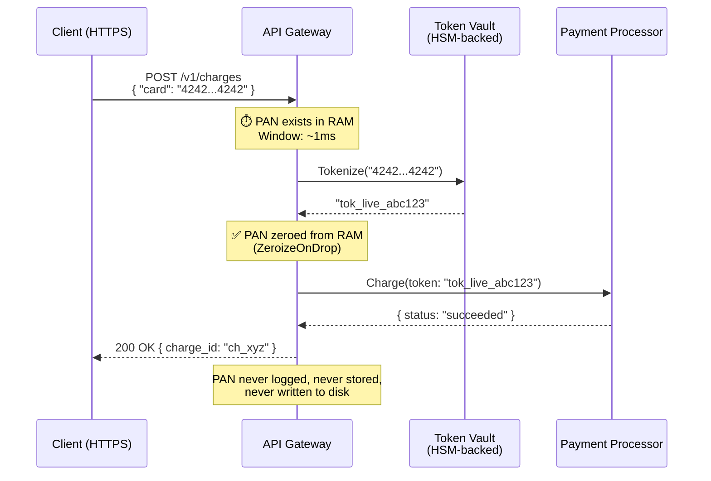
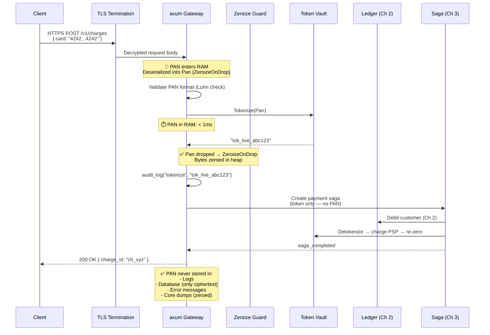

# 5. PCI Compliance and Memory Wiping 🔴

> **The Problem:** A payment gateway processes millions of credit card numbers daily. Each card number (PAN) exists in RAM — inside request buffers, deserialized structs, and String allocations — for the brief window between receiving the API call and tokenizing the card. If an attacker dumps the process's heap during that window, they can harvest thousands of live card numbers. Even after the struct is dropped, Rust's default allocator does *not* zero memory — the bytes remain on the heap until another allocation reuses that address. A core dump, a heap profiler, or a cold-boot attack can recover these "dead" card numbers. PCI-DSS Requirement 3.4 mandates that PANs be rendered unreadable wherever they are stored — and RAM counts as storage.

---

## PCI-DSS: What Payment Engineers Must Know

PCI-DSS (Payment Card Industry Data Security Standard) is not optional. Any system that stores, processes, or transmits cardholder data must comply. Fines for non-compliance range from $5,000 to $500,000 **per month**, plus liability for all fraudulent transactions.

### The Requirements That Affect Rust Code

| PCI-DSS Requirement | What It Means for Rust |
|---|---|
| **3.4** Render PAN unreadable anywhere it is stored | Zero PAN bytes in RAM immediately after use |
| **3.5** Protect cryptographic keys used to protect PANs | Key material in `zeroize`-protected buffers |
| **6.5.1** Injection flaws | Use parameterized queries (sqlx compile-time checks) |
| **6.5.3** Insecure cryptographic storage | Never log PANs, never include in error messages |
| **8.2.1** Strong authentication for all access | mTLS between services, short-lived tokens |
| **10.2** Audit trail of access to cardholder data | Log every PAN access (but not the PAN itself) |

---

## The Threat Model: How Card Data Leaks from RAM

```mermaid
graph TB
    subgraph "Attack Vectors"
        HD["Heap Dump<br/>(core dump, /proc/pid/mem)"]
        SWAP["Swap File<br/>(PAN paged to disk)"]
        COLD["Cold-Boot Attack<br/>(freeze RAM, read residual data)"]
        LOG["Log Leak<br/>(PAN in error message or debug output)"]
        PROF["Heap Profiler<br/>(Valgrind, DHAT)"]
    end

    subgraph "Memory Timeline"
        RECV["1. Receive HTTP body<br/>(PAN in request buffer)"]
        DESER["2. Deserialize JSON<br/>(PAN in String field)"]
        TOK["3. Tokenize<br/>(PAN → tok_xxx)"]
        DROP["4. Drop struct<br/>(PAN bytes STILL IN HEAP)"]
        REUSE["5. Allocator reuses address<br/>(PAN finally overwritten)"]
    end

    RECV --> DESER --> TOK --> DROP --> REUSE

    HD -.->|"Attack window: steps 1–5"| DROP
    SWAP -.->|"PAN written to swap at any step"| DESER
    COLD -.->|"Residual data after power off"| REUSE
    LOG -.->|"Debug!(\"{:?}\", card)"| DESER
    PROF -.->|"Snapshot at any time"| TOK

    style HD fill:#ff6b6b,color:#fff
    style SWAP fill:#ff6b6b,color:#fff
    style COLD fill:#ff6b6b,color:#fff
    style LOG fill:#ff6b6b,color:#fff
    style PROF fill:#ff6b6b,color:#fff
```

**The critical insight:** Between step 4 (Drop) and step 5 (Reuse), the PAN bytes are "dead" from Rust's perspective but **fully readable in physical memory**. The `zeroize` crate closes this gap.

---

## Naive Approach: Plain Strings for Card Data

```rust,no_run
// 💥 PCI VIOLATION: Card PAN stored in a plain String.
// Bytes persist in RAM after Drop. Visible in heap dumps, core dumps, swap.

use serde::Deserialize;

#[derive(Debug, Deserialize)]  // 💥 Debug prints the PAN to logs!
struct CardDetails {
    pan: String,       // 💥 Plain String — not zeroed on drop
    expiry: String,
    cvv: String,       // 💥 CVV in a regular String
}

async fn process_card(card: CardDetails) -> Result<String, String> {
    // 💥 The PAN exists in at least 3 places in RAM right now:
    //   1. The original HTTP request buffer
    //   2. The serde-deserialized String
    //   3. Any intermediate copies from String::clone()

    let token = tokenize(&card.pan)?;

    // card is dropped here, but the bytes "4242424242424242"
    // remain at the same heap address until the allocator reuses it.
    // That could be SECONDS, MINUTES, or NEVER.

    Ok(token)
}
#
# fn tokenize(_: &str) -> Result<String, String> { Ok("tok_test".into()) }
```

**What goes wrong:**

1. `Debug` trait prints `CardDetails { pan: "4242424242424242", ... }` to logs if any handler uses `tracing::debug!("{:?}", card)`.
2. After `card` is dropped, the PAN bytes persist in heap memory.
3. A core dump triggered by any bug captures the PAN.
4. The OS may swap the page to disk — PAN written to unencrypted swap file.

---

## Production Approach: `zeroize` + Custom Types

```rust,no_run
// ✅ FIX: PAN stored in a zeroize-protected type.
// Bytes are cryptographically zeroed on Drop. Cannot be printed to logs.

use zeroize::{Zeroize, ZeroizeOnDrop};
use serde::Deserialize;
use std::fmt;

/// A credit card PAN that is automatically zeroed in RAM when dropped.
///
/// Invariants:
/// - Cannot be printed (Debug and Display are redacted).
/// - Cannot be logged (no Debug output leaks the PAN).
/// - Automatically zeroed on drop (ZeroizeOnDrop).
/// - Cannot be cloned (prevents unnecessary copies in RAM).
#[derive(Zeroize, ZeroizeOnDrop, Deserialize)]
struct Pan(String);

impl fmt::Debug for Pan {
    fn fmt(&self, f: &mut fmt::Formatter<'_>) -> fmt::Result {
        // ✅ Never print the actual PAN — even in debug builds
        write!(f, "Pan(****)")
    }
}

impl fmt::Display for Pan {
    fn fmt(&self, f: &mut fmt::Formatter<'_>) -> fmt::Result {
        // ✅ Show only the last 4 digits (PCI allows this)
        if self.0.len() >= 4 {
            write!(f, "****{}", &self.0[self.0.len() - 4..])
        } else {
            write!(f, "****")
        }
    }
}

/// CVV — even more sensitive. Zero on drop, no display at all.
#[derive(Zeroize, ZeroizeOnDrop, Deserialize)]
struct Cvv(String);

impl fmt::Debug for Cvv {
    fn fmt(&self, f: &mut fmt::Formatter<'_>) -> fmt::Result {
        write!(f, "Cvv(***)")
    }
}

/// Expiry date — less sensitive, but still zero on drop for good hygiene.
#[derive(Zeroize, ZeroizeOnDrop, Deserialize)]
struct Expiry(String);

impl fmt::Debug for Expiry {
    fn fmt(&self, f: &mut fmt::Formatter<'_>) -> fmt::Result {
        write!(f, "Expiry(**/**)")
    }
}

/// The incoming card details — all fields zero on drop.
#[derive(Debug, Deserialize, ZeroizeOnDrop)]
struct SecureCardDetails {
    pan: Pan,
    expiry: Expiry,
    cvv: Cvv,
}

/// Process a card: tokenize immediately, then the struct is dropped
/// and all sensitive bytes are zeroed in RAM.
async fn process_card_secure(card: SecureCardDetails) -> Result<String, String> {
    // Access the raw PAN only for the tokenization call
    let token = tokenize_card(&card.pan.0)?;

    // ✅ When `card` is dropped (here, at end of scope), ZeroizeOnDrop fires:
    //   - card.pan.0 bytes → all zeroed
    //   - card.cvv.0 bytes → all zeroed
    //   - card.expiry.0 bytes → all zeroed
    //
    // The heap memory now contains 0x00 bytes, not card digits.

    Ok(token)
}
#
# fn tokenize_card(_: &str) -> Result<String, String> { Ok("tok_test".into()) }
```

---

## How `zeroize` Works Under the Hood

The `zeroize` crate uses compiler barriers to ensure the zeroing write is never optimized away:

```rust,no_run
// Simplified view of what zeroize does internally:

use std::ptr;
use std::sync::atomic::{self, Ordering};

/// Write zeros to a byte slice, ensuring the compiler cannot optimize it away.
fn zeroize_bytes(bytes: &mut [u8]) {
    // Use volatile write to prevent dead-store elimination.
    // The compiler MUST perform this write, even though the data is "about to be freed."
    unsafe {
        ptr::write_volatile(bytes.as_mut_ptr(), 0);
        for byte in bytes.iter_mut() {
            ptr::write_volatile(byte, 0);
        }
    }

    // Memory fence: ensure the zeroing write is visible before any subsequent operation.
    atomic::compiler_fence(Ordering::SeqCst);
}
```

### Why Can't the Compiler Optimize Away Normal Zeroing?

| Approach | Optimized Away? | Reason |
|---|---|---|
| `bytes.fill(0)` | ✅ **Yes** — dead store elimination | Compiler sees the write is "useless" before free |
| `ptr::write_volatile` | ❌ **No** — volatile semantics | Compiler must perform volatile writes |
| `zeroize` crate | ❌ **No** — uses volatile + fence | Belt and suspenders |

The C/C++ world has the same problem — `memset(buf, 0, len)` before `free(buf)` is routinely optimized away. This is why `memset_s` (C11 Annex K) and `SecureZeroMemory` (Windows) exist. Rust's `zeroize` is the equivalent.

---

## Preventing PAN Data from Reaching the Heap at All

The most secure PAN is one that never exists in a heap-allocated `String`. For the highest-security environments:

```rust,no_run
use zeroize::{Zeroize, ZeroizeOnDrop};

/// Stack-allocated PAN buffer. Never touches the heap.
/// Maximum PAN length is 19 digits (per ISO/IEC 7812).
#[derive(ZeroizeOnDrop)]
struct StackPan {
    buf: [u8; 19],   // Stack-allocated, not heap
    len: usize,
}

impl StackPan {
    fn from_bytes(input: &[u8]) -> Option<Self> {
        if input.len() > 19 || input.is_empty() {
            return None;
        }
        // Validate: only ASCII digits
        if !input.iter().all(|b| b.is_ascii_digit()) {
            return None;
        }
        let mut buf = [0u8; 19];
        buf[..input.len()].copy_from_slice(input);
        Some(StackPan { buf, len: input.len() })
    }

    fn as_str(&self) -> &str {
        // Safe: we validated ASCII digits in from_bytes
        std::str::from_utf8(&self.buf[..self.len]).unwrap_or("")
    }
}

impl std::fmt::Debug for StackPan {
    fn fmt(&self, f: &mut std::fmt::Formatter<'_>) -> std::fmt::Result {
        write!(f, "StackPan(****)")
    }
}
```

### Stack vs. Heap: Security Tradeoffs

| Property | Heap (`String`) | Stack (`[u8; 19]`) |
|---|---|---|
| Visible in heap dumps | ✅ Yes | ❌ No (stack frame only) |
| Visible in core dumps | ✅ Yes | ⚠️ Yes (but stack is shorter-lived) |
| Swappable to disk | ✅ Yes (unless `mlock`) | ⚠️ Yes (unless `mlock`) |
| Lifetime | Until allocator reuses address | Until function returns |
| `zeroize` effectiveness | ✅ Zeros the heap allocation | ✅ Zeros the stack frame |

For maximum security, combine stack allocation with `mlock` (Linux) to prevent the OS from swapping the page to disk:

```rust,no_run
#[cfg(target_os = "linux")]
fn lock_current_stack_page() {
    unsafe {
        let stack_var: u8 = 0;
        let page_size = libc::sysconf(libc::_SC_PAGESIZE) as usize;
        let page_start = (&stack_var as *const u8 as usize) & !(page_size - 1);
        libc::mlock(page_start as *const libc::c_void, page_size);
    }
}
```

---

## The Tokenization Pipeline

The safest architecture minimizes the time any service handles raw PAN data. The industry standard is **immediate tokenization**:



### The Token Vault Service

```rust,no_run
use zeroize::ZeroizeOnDrop;
use uuid::Uuid;

/// The tokenization service — the only component that ever sees the raw PAN.
/// In production, this is a separate, heavily audited microservice with:
/// - HSM-backed encryption for stored PANs
/// - mTLS-only access
/// - No logging of request/response bodies
/// - Physical isolation (separate VPC, dedicated hosts)
struct TokenVault {
    db: sqlx::PgPool,
    encryption_key: EncryptionKey,
}

#[derive(ZeroizeOnDrop)]
struct EncryptionKey(Vec<u8>);

impl TokenVault {
    /// Tokenize a PAN: encrypt it, store the ciphertext, return a token.
    /// The raw PAN is zeroed from RAM immediately after encryption.
    async fn tokenize(&self, pan: Pan) -> Result<String, TokenError> {
        let token = format!("tok_live_{}", Uuid::now_v7().simple());

        // Encrypt the PAN using AES-256-GCM
        let ciphertext = encrypt_aes_gcm(pan.0.as_bytes(), &self.encryption_key.0)?;

        // Store the encrypted PAN (ciphertext only — never plaintext)
        sqlx::query(
            "INSERT INTO card_tokens (token, encrypted_pan, created_at) VALUES ($1, $2, NOW())"
        )
        .bind(&token)
        .bind(&ciphertext)
        .execute(&self.db)
        .await
        .map_err(TokenError::Database)?;

        // ✅ `pan` is dropped here → ZeroizeOnDrop fires
        //    The plaintext PAN bytes are zeroed in RAM.

        Ok(token)
    }

    /// Detokenize: retrieve and decrypt the PAN for a one-time use (e.g., PSP charge).
    /// The decrypted PAN is returned in a zeroize-protected wrapper.
    async fn detokenize(&self, token: &str) -> Result<Pan, TokenError> {
        let row: (Vec<u8>,) = sqlx::query_as(
            "SELECT encrypted_pan FROM card_tokens WHERE token = $1"
        )
        .bind(token)
        .fetch_one(&self.db)
        .await
        .map_err(TokenError::Database)?;

        let plaintext = decrypt_aes_gcm(&row.0, &self.encryption_key.0)?;

        // Return as Pan (ZeroizeOnDrop) — caller must use and drop quickly
        Ok(Pan(String::from_utf8(plaintext).map_err(|_| TokenError::InvalidData)?))
    }
}

#[derive(Debug)]
enum TokenError {
    Database(sqlx::Error),
    Encryption(String),
    InvalidData,
}
#
# #[derive(zeroize::ZeroizeOnDrop, serde::Deserialize)]
# struct Pan(String);
# impl std::fmt::Debug for Pan { fn fmt(&self, f: &mut std::fmt::Formatter) -> std::fmt::Result { write!(f, "****") } }
# fn encrypt_aes_gcm(_: &[u8], _: &[u8]) -> Result<Vec<u8>, TokenError> { Ok(vec![]) }
# fn decrypt_aes_gcm(_: &[u8], _: &[u8]) -> Result<Vec<u8>, TokenError> { Ok(vec![]) }
```

---

## Audit Logging: What to Log (and What Never to Log)

PCI-DSS Requirement 10.2 mandates logging access to cardholder data. But logging the data itself violates Requirement 3.4. The solution:

```rust,no_run
use tracing;
use uuid::Uuid;

/// Log that a PAN was accessed — but NEVER log the PAN itself.
fn audit_log_pan_access(
    action: &str,       // "tokenize", "detokenize", "charge"
    token: &str,        // "tok_live_abc123" (safe to log)
    actor: &str,        // Service or user that accessed the PAN
    request_id: Uuid,   // Correlation ID
) {
    // ✅ Safe: logs the token (not the PAN), the action, and who did it
    tracing::info!(
        action = action,
        token = token,
        actor = actor,
        request_id = %request_id,
        "cardholder data accessed"
    );

    // 💥 NEVER do this:
    // tracing::info!("Processing card {}", pan);           // PCI violation
    // tracing::debug!("{:?}", card_details);               // PCI violation
    // log::error!("Charge failed for card {}", pan);       // PCI violation
}
```

### Compile-Time Protection Against Logging PANs

Our `Pan` type's `Debug` and `Display` implementations make accidental logging safe:

```rust,no_run
# struct Pan(String);
# impl std::fmt::Debug for Pan {
#     fn fmt(&self, f: &mut std::fmt::Formatter) -> std::fmt::Result { write!(f, "Pan(****)") }
# }

fn example() {
    let pan = Pan("4242424242424242".into());

    // Even if someone writes this, the PAN is NOT exposed:
    println!("Debug: {:?}", pan);    // Output: "Debug: Pan(****)"

    // The ONLY way to access the raw PAN is through the .0 field,
    // which requires explicit, deliberate action — not an accident.
}
```

---

## Security Comparison: Defense-in-Depth Layers

| Layer | Threat Mitigated | Implementation |
|---|---|---|
| `ZeroizeOnDrop` | Heap dump reveals PAN after Drop | Zeros bytes on drop, volatile write |
| Redacted `Debug`/`Display` | PAN in log files | `Pan(****)` in all output |
| Stack allocation | PAN in heap dump | `[u8; 19]` instead of `String` |
| `mlock` | PAN in swap file | Lock memory page from swapping |
| Tokenization | PAN exposure window | Replace PAN with token in < 1ms |
| mTLS | Network interception | Mutual TLS between all services |
| HSM-backed encryption | Encryption key theft | Key never leaves hardware module |
| Audit logging | Unauthorized access | Log token + actor, never PAN |

---

## Testing Memory Wiping

How do you verify that `zeroize` actually works? You can inspect memory after drop:

```rust,no_run
#[cfg(test)]
mod tests {
    use super::*;
    use zeroize::Zeroize;

    #[test]
    fn test_pan_is_zeroed_after_drop() {
        let pan_string = String::from("4242424242424242");
        let pan_ptr = pan_string.as_ptr();
        let pan_len = pan_string.len();

        // Create the Pan and immediately drop it
        {
            let pan = Pan(pan_string);
            // pan is dropped here → ZeroizeOnDrop
        }

        // ✅ Verify the memory at the original address is zeroed.
        // NOTE: This test is inherently unsafe and fragile — it accesses
        // freed memory. It's a verification tool, not a production test.
        // Run it under Miri for soundness checking.
        unsafe {
            let bytes = std::slice::from_raw_parts(pan_ptr, pan_len);
            assert!(
                bytes.iter().all(|&b| b == 0),
                "PAN bytes were not zeroed after drop!"
            );
        }
    }

    #[test]
    fn test_debug_does_not_leak_pan() {
        let pan = Pan("4242424242424242".into());
        let debug_output = format!("{:?}", pan);

        assert!(!debug_output.contains("4242"));
        assert!(debug_output.contains("****"));
    }

    #[test]
    fn test_display_shows_last_four_only() {
        let pan = Pan("4242424242424242".into());
        let display_output = format!("{}", pan);

        assert_eq!(display_output, "****4242");
        assert!(!display_output.contains("424242424242"));
    }
}
#
# #[derive(zeroize::Zeroize, zeroize::ZeroizeOnDrop, serde::Deserialize)]
# struct Pan(String);
# impl std::fmt::Debug for Pan {
#     fn fmt(&self, f: &mut std::fmt::Formatter) -> std::fmt::Result { write!(f, "Pan(****)") }
# }
# impl std::fmt::Display for Pan {
#     fn fmt(&self, f: &mut std::fmt::Formatter) -> std::fmt::Result {
#         if self.0.len() >= 4 { write!(f, "****{}", &self.0[self.0.len()-4..]) }
#         else { write!(f, "****") }
#     }
# }
```

---

## PCI-Compliant Request Handling: End-to-End

Putting it all together — the full lifecycle of a card number in our system:



---

## Checklist: PCI-DSS Compliance in Rust

| # | Requirement | Status | Implementation |
|---|---|---|---|
| 1 | PAN zeroed from RAM after use | ✅ | `ZeroizeOnDrop` on `Pan`, `Cvv`, `Expiry` |
| 2 | PAN never in log output | ✅ | Redacted `Debug` and `Display` |
| 3 | PAN encrypted at rest | ✅ | AES-256-GCM in Token Vault |
| 4 | PAN encrypted in transit | ✅ | TLS 1.3 everywhere, mTLS between services |
| 5 | Minimal PAN exposure window | ✅ | Tokenize in < 1ms, then zero |
| 6 | No PAN in error messages | ✅ | `Pan(****)` in Debug output |
| 7 | Audit trail of PAN access | ✅ | `audit_log_pan_access()` on every tokenize/detokenize |
| 8 | Encryption keys protected | ✅ | `EncryptionKey` has `ZeroizeOnDrop`; HSM in production |
| 9 | No PAN in swap/page file | ✅ | `mlock` on sensitive pages (Linux) |
| 10 | Compile-time enforcement | ✅ | Type system prevents accidental PAN leakage |

---

> **Key Takeaways**
>
> 1. **RAM is storage.** PCI-DSS treats any medium that holds cardholder data as "storage" — including heap memory, stack frames, and swap files. Plaintext PANs must be zeroed the instant they are no longer needed.
> 2. **Rust's default allocator does not zero freed memory.** After `drop()`, the bytes remain at the same heap address until another allocation reuses that space. The `zeroize` crate fixes this by using volatile writes that the compiler cannot optimize away.
> 3. **The `Pan` type is your first line of defense.** By making `Debug` and `Display` redact the PAN, you make accidental logging physically impossible — regardless of what other engineers write.
> 4. **Tokenize immediately.** The raw PAN should exist in your system's RAM for less than 1 millisecond. Replace it with a token (e.g., `tok_live_abc123`) and use the token for all subsequent operations.
> 5. **Defense in depth:** `ZeroizeOnDrop` (RAM) + redacted formatting (logs) + encryption at rest (database) + TLS (transit) + `mlock` (swap) + HSM (keys) + audit logging (access). No single layer is sufficient.
> 6. **Test your zeroing.** Write tests that inspect memory after `drop()` to verify that PAN bytes are actually zeroed. Run under Miri for soundness.
> 7. **The Token Vault is the only service that handles raw PANs.** Every other service — the API gateway, the ledger, the saga orchestrator — works exclusively with tokens. This minimizes your PCI scope to a single, heavily audited microservice.
