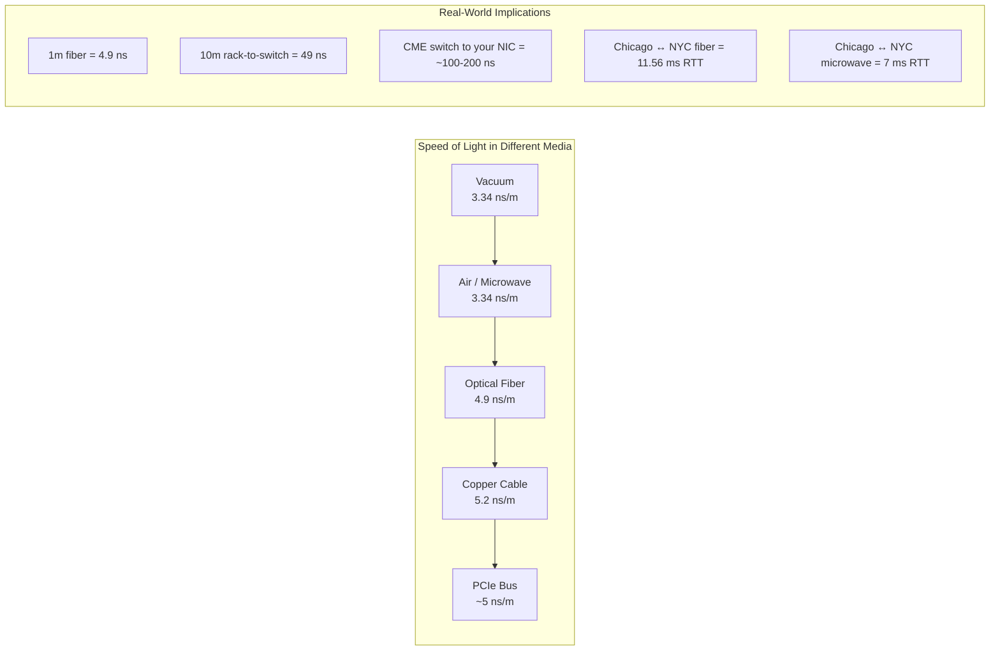

# Hardcore Quantitative Finance: Low-Latency Systems and HFT Architecture

> *"The market doesn't care about your architecture diagrams. It cares about how many nanoseconds it takes you to read a packet, update a price, and fire an order. Everything else is commentary."*

---

## About This Guide

Welcome. This is a principal-level training guide written from the trenches of quantitative finance infrastructure — the world of sub-microsecond tick-to-trade engines, kernel-bypass networking, and FPGA-accelerated order entry. It is not a survey of trading strategies. It is not a quant math primer. It is a systematic, first-principles descent from market micro-structure down through the full hardware stack: NICs, PCIe buses, CPU caches, memory controllers, and silicon.

Every chapter in this book starts with a question a senior engineer would ask in a system design interview at a top-tier prop shop: *"Why is this too slow?"* We then rebuild the system from scratch, eliminating every unnecessary layer — system calls, memory allocations, kernel network stacks, scheduler interference — until we arrive at the architecture that actually runs in production at firms processing billions of dollars of daily volume.

The gap between "fast web backend" and "competitive HFT system" is not 2× or 5×. It is 1,000× to 10,000×. A JSON-over-HTTP order entry system operating at 10ms is **ten thousand times slower** than a binary-protocol kernel-bypass system operating at 1µs. This book teaches you to cross that chasm.

---

## Speaker Intro

This material is written from the perspective of a **Principal Low-Latency Architect** with deep experience building tick-to-trade execution infrastructure:

- **Core Tick-to-Trade Engines** — wire-to-wire latencies of 800ns–2µs, processing full-book CME market data (MDP 3.0) at 10M+ messages per second with zero allocations on the hot path.
- **Kernel-Bypass Feed Handlers** — using Solarflare `ef_vi` and DPDK to read UDP multicast packets directly from NIC RX queues into pre-pinned user-space ring buffers, bypassing the entire Linux network stack.
- **FPGA-Accelerated Order Entry** — sub-100ns order generation on Xilinx UltraScale+ FPGAs connected directly to exchange gateways over 10GbE, eliminating the CPU entirely from the order-fire path.
- **Co-Location Infrastructure** — designing server racks inside CME Aurora, NYSE Mahwah, and Nasdaq Carteret data centers, including fiber-length calculations, NIC selection, BIOS tuning, and NUMA topology optimization.
- **Production Incidents at the Nanosecond Level** — including a 4µs latency regression caused by a single TLB miss from a `mmap` call leaking into the hot path, a UDP gap storm that crashed a feed handler processing 2M packets/sec, and a NUMA cross-socket memory access that added 90ns per order book lookup.

The lessons in this book are hard-won. Every anti-pattern shown here has caused real financial loss.

---

## Who This Is For

This guide is designed for:

- **Senior engineers preparing for systems interviews at quantitative trading firms** — Jane Street, Citadel Securities, Jump Trading, Two Sigma, Virtu Financial, Hudson River Trading, Tower Research, DE Shaw, and similar firms where the interview focus is on low-latency systems design, not LeetCode.
- **Backend engineers transitioning from web-scale to finance** — if you've built high-throughput systems at FAANG (millions of RPS with p99 < 50ms) but have never dealt with *microsecond-level* latency budgets, this bridges that gap.
- **Rust and C++ developers building real-time systems** — market data handlers, telemetry ingestors, game netcode, autonomous vehicle pipelines — anywhere that tail latency matters more than throughput.
- **Quantitative developers who need to understand the plumbing** — you write the alpha models in Python or kdb+, but you need to understand the execution layer that turns your signals into actual exchange orders.

### What This Guide Is NOT

- It is not a trading strategy book. We do not cover alpha generation, statistical arbitrage, or portfolio construction.
- It is not a finance primer. You should know what a stock exchange is and what "buying AAPL at $150" means.
- It is not language-specific indoctrination. Code examples are primarily in Rust (with C/C++ for kernel and FPGA references), but the architectural principles apply universally.
- It is not theoretical. Every architecture decision is justified by measured latency numbers from production systems.

---

## Prerequisites

| Concept | Required Level | Where to Learn |
|---|---|---|
| Rust ownership, borrowing, lifetimes | Fluent | [Rust Memory Management](../memory-management-book/src/SUMMARY.md) |
| Systems programming (pointers, memory layout) | Strong | [Rust for C/C++ Programmers](../c-cpp-book/src/SUMMARY.md) |
| Networking fundamentals (TCP/IP, UDP, sockets) | Working knowledge | Stevens, *UNIX Network Programming* |
| Concurrency (threads, atomics, lock-free basics) | Intermediate | [Algorithms & Concurrency](../algorithms-concurrency-book/src/SUMMARY.md) |
| Linux systems (syscalls, `perf`, `strace`) | Comfortable | [Tooling & Profiling](../tooling-profiling-book/src/SUMMARY.md) |
| Basic financial markets | Awareness | Chapters 1–2 of this book cover the essentials |

---

## How to Use This Book

| Indicator | Meaning |
|---|---|
| 🟢 **Finance/Market Core** | Market structure and domain fundamentals — no hardware deep-dives yet |
| 🟡 **Low-Latency Applied** | Protocol engineering, pipeline design, and OS-level optimization |
| 🔴 **Hardware/Nanosecond Internals** | Kernel bypass, NUMA topology, FPGA offloading, silicon-level design |

### Pacing Guide

| Chapters | Topic | Estimated Time | Checkpoint |
|---|---|---|---|
| Ch 1 | Market Micro-Structure | 3–4 hours | Can explain bid/ask dynamics, maker/taker, and order book price-time priority |
| Ch 2–3 | Protocols & Pipeline | 6–8 hours | Can design a binary feed handler and trace the full tick-to-trade critical path |
| Ch 4–6 | OS Bypass & Networking | 8–12 hours | Can explain why `epoll` is too slow for HFT and design a DPDK-based feed handler |
| Ch 7–8 | Hardware & FPGA | 6–8 hours | Can design a NUMA-aware thread topology and explain FPGA tick-to-trade offloading |
| Ch 9 | Capstone | 8–12 hours | Can whiteboard a complete co-located market-making system at staff-engineer level |

**Fast Track (Interview Prep):** Chapters 1, 3, 5, 7, 9 — covers the core material for prop-shop systems design interviews.

**Full Track (Mastery):** All chapters sequentially. Budget 2–3 weeks of focused study.

---

## Table of Contents

### Part I: Market Micro-Structure and Protocols

| Chapter | Description |
|---|---|
| **1. The Limit Order Book (LOB)** 🟢 | How exchanges actually work. Bids, asks, spreads, market depth. Maker vs taker orders. Price-time priority matching. |
| **2. Market Data and Order Entry Protocols** 🟡 | Why JSON/REST will bankrupt you. FIX protocol. Binary protocols: Nasdaq ITCH (market data) and OUCH (order entry). |
| **3. The Tick-to-Trade Pipeline** 🟡 | The critical path: UDP packet → normalize → update book → signal → risk check → fire order. Every nanosecond accounted for. |

### Part II: Bypassing the Operating System

| Chapter | Description |
|---|---|
| **4. The Cost of a Syscall** 🟡 | Why `epoll`, `read()`, and the Linux kernel network stack are dead on arrival. Context switches, IRQ handling, and copy overhead. |
| **5. Kernel Bypass Networking** 🔴 | Reading packets directly from the NIC into user-space memory. DPDK, Solarflare `ef_vi`, XDP. Zero-copy packet processing. |
| **6. UDP Multicast vs. TCP** 🔴 | How exchanges broadcast market data via UDP Multicast (IGMP). A/B line arbitration, sequence number tracking, gap detection without TCP retransmission. |

### Part III: Nanosecond Compute & Hardware

| Chapter | Description |
|---|---|
| **7. NUMA and CPU Pinning** 🔴 | Non-Uniform Memory Access. QPI/UPI cross-socket penalties. `isolcpus`, `taskset`, IRQ affinity. Preventing the OS scheduler from stealing your cycles. |
| **8. State Machines and FPGA Offloading** 🔴 | When software is still too slow. Transferring the tick-to-trade pipeline onto silicon. FPGAs, Verilog/VHDL, deterministic sub-100ns execution. |

### Part IV: The HFT Capstone

| Chapter | Description |
|---|---|
| **9. Capstone: Architect a Co-Located Market Maker** 🔴 | Staff-level system design. Dual-NIC feed handler, lock-free ring buffers, pre-allocated memory pools, sub-µs risk gating — inside the CME Aurora data center. |

### Appendices

| Section | Description |
|---|---|
| **Appendix A: Summary & Reference Card** | Latency Numbers Every Quant Should Know, FIX Protocol Tags, Kernel Tuning Boot Parameters |

---

## The Speed of Light: A First-Principles Anchor

Before we begin, let us establish the one constant that governs all of electronic trading: **the speed of light**.

Light travels at approximately $299{,}792{,}458$ m/s in a vacuum. In optical fiber (refractive index ~1.47), the effective speed is:

$$v_{\text{fiber}} = \frac{c}{n} \approx \frac{3 \times 10^8}{1.47} \approx 2.04 \times 10^8 \text{ m/s}$$

This means:

| Distance | Medium | One-Way Latency |
|---|---|---|
| 1 meter of fiber | Fiber | ~4.9 ns |
| 10 meters (rack-to-switch) | Fiber | ~49 ns |
| 100 meters (within data center) | Fiber | ~490 ns |
| Chicago → New York (1,180 km fiber) | Fiber | ~5.78 ms |
| Chicago → New York (microwave, ~1,050 km) | Air | ~3.5 ms |

> **Key insight:** The difference between fiber ($\sim$5.78ms) and microwave ($\sim$3.5ms) on the Chicago–New York route is **2.28ms**. Firms spend tens of millions of dollars on microwave tower networks to capture this advantage. When the signal fades in rain, they fall back to millimeter-wave or fiber, losing those 2.28ms — and with them, their edge.

This is the world we inhabit. Nanoseconds are currency.

---

## Companion Guides

This book builds on and complements several other guides in this training series:

| Guide | Relationship |
|---|---|
| [Algorithms & Concurrency](../algorithms-concurrency-book/src/SUMMARY.md) | Lock-free data structures, CAS, epoch reclamation — the compute layer this book uses |
| [Zero-Copy Architecture](../zero-copy-book/src/SUMMARY.md) | io_uring, rkyv, shared-nothing — alternative I/O models we reference |
| [Compiler Optimizations](../compiler-optimizations-book/src/SUMMARY.md) | SIMD, LTO, PGO — the compiler-level optimizations applied to trading codebases |
| [Unsafe Rust & FFI](../unsafe-ffi-book/src/SUMMARY.md) | FFI to C/C++ kernel-bypass libraries (DPDK, ef_vi) |
| [Tooling & Profiling](../tooling-profiling-book/src/SUMMARY.md) | `perf`, flamegraphs, Criterion — measurement tools used throughout |
| [Distributed Systems](../distributed-systems-book/src/SUMMARY.md) | Consensus, replication — the distributed infrastructure behind exchange matching engines |

Now turn the page. The market opens in 6 hours, and your feed handler isn't fast enough.
