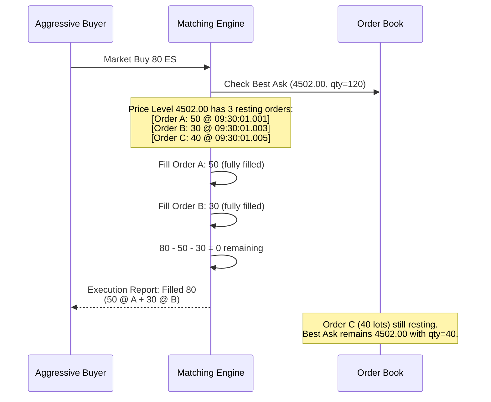
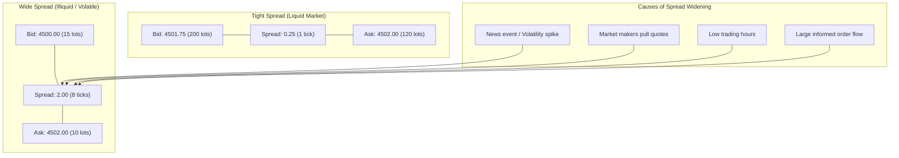

# Chapter 1: The Limit Order Book (LOB) 🟢

> **What you'll learn:**
> - How modern electronic exchanges match orders using price-time priority
> - The anatomy of a Limit Order Book: bids, asks, spreads, and market depth
> - The difference between Maker and Taker orders — and why this distinction drives exchange economics
> - How to represent an order book in memory for nanosecond-level access

---

## 1.1 What Actually Happens When You "Buy a Stock"

When a retail investor clicks "Buy 100 shares of AAPL" on their brokerage app, the order traverses a chain of intermediaries before arriving at an exchange's **matching engine** — a purpose-built system that pairs buyers with sellers according to strict rules.

The matching engine maintains a data structure called the **Limit Order Book (LOB)**. This is not a metaphorical concept — it is a literal, in-memory data structure that holds every resting order for a given instrument. Understanding its mechanics is the foundation of everything that follows.

> **HFT Reality:** The CME's Globex matching engine processes over **25 million messages per day** across thousands of instruments. Nasdaq's INET can handle bursts of **1 million messages per second**. Your feed handler must keep pace with every one of these messages, updating your local order book replica in under 1µs per update. If you fall behind, your view of the market is stale, and stale views lose money.

---

## 1.2 Anatomy of the Limit Order Book

A Limit Order Book for any instrument (say, ES futures — the E-mini S&P 500) has two sides:

- **Bid side:** Orders from buyers. "I want to buy X contracts at price P or lower."
- **Ask side** (also called the **Offer**): Orders from sellers. "I want to sell X contracts at price P or higher."

Orders are organized by **price level**, and within each price level, by **time of arrival** (first-in, first-out). This is called **price-time priority**.

```
                    The Limit Order Book (ES Futures)
    ┌──────────────────────────────────────────────────────────┐
    │                      ASK (Sell) Side                     │
    │  Price   │  Qty  │  Orders  │  Cumulative               │
    │──────────│───────│──────────│────────────                │
    │  4,502.50│   15  │  [5,5,5] │     15                    │
    │  4,502.25│   42  │  [10,12,20] │  57                    │
    │  4,502.00│  120  │  [50,30,40] │ 177      ← Best Ask   │
    ├──────────┼───────┼──────────┼────────────────────────────┤
    │          │ SPREAD = $0.25 (1 tick)                       │
    ├──────────┼───────┼──────────┼────────────────────────────┤
    │  4,501.75│  200  │  [80,60,60] │ 200      ← Best Bid   │
    │  4,501.50│   85  │  [40,25,20] │ 285                    │
    │  4,501.25│   30  │  [15,15]    │ 315                    │
    │──────────│───────│──────────│────────────                │
    │                      BID (Buy) Side                      │
    └──────────────────────────────────────────────────────────┘
```

### Key Terminology

| Term | Definition |
|---|---|
| **Best Bid** | The highest price any buyer is willing to pay. Also called the "top of book" bid. |
| **Best Ask** | The lowest price any seller is willing to accept. Also called the "top of book" ask. |
| **Spread** | Best Ask − Best Bid. In liquid markets, this is often 1 tick (the minimum price increment). |
| **Mid Price** | (Best Bid + Best Ask) / 2. Used as a theoretical "fair value" reference. |
| **Market Depth** | The total quantity available at each price level. Deeper books absorb larger orders without price movement. |
| **Tick Size** | The minimum price increment. For ES futures, this is $0.25 per contract. |
| **Top of Book (BBO)** | Best Bid and Offer — the tightest prices currently available. |

---

## 1.3 Order Types That Drive the Book

### Limit Orders (Passive / Maker)

A **limit order** specifies both *price* and *quantity*. It rests in the book until it is filled, canceled, or expires.

```
Limit Buy: "Buy 50 ES @ 4501.75"
→ If best ask > 4501.75: order RESTS in book on bid side
→ If best ask ≤ 4501.75: order CROSSES the spread and matches immediately
```

### Market Orders (Aggressive / Taker)

A **market order** specifies only *quantity*. It matches immediately against the best available resting orders.

```
Market Buy: "Buy 50 ES at market"
→ Matches against best ask (4502.00): takes 50 from the 120 available
→ Best ask now has 70 remaining
```

### The Maker–Taker Model

Exchanges incentivize liquidity provision (resting orders) and charge for liquidity taking (aggressive orders):

| Role | Action | Exchange Fee (typical) | Why |
|---|---|---|---|
| **Maker** | Places a resting limit order | **Rebate** (−$0.15/contract) | You add liquidity to the book, making the market more efficient |
| **Taker** | Sends a market/crossing limit order | **Fee** (+$0.30/contract) | You remove liquidity, consuming what makers provide |

> **HFT Insight:** A market-making strategy profits from the **spread** (buying at bid, selling at ask) plus **maker rebates**. If the spread on ES is 1 tick ($0.25/contract) and you capture it with a rebate of $0.15 on each side, your gross profit per round trip is $0.25 + $0.15 + $0.15 = $0.55/contract. At 100,000 round trips per day, that's $55,000/day gross — before infrastructure and risk costs.

---

## 1.4 Price-Time Priority: The Matching Algorithm

When an aggressive order arrives, the matching engine fills it against resting orders in strict **price-time priority**:

1. **Best price first.** A buy market order matches against the lowest ask price.
2. **Earliest order first** at the same price level (FIFO within a price level).



### Pro-Rata Matching (An Alternative)

Some exchanges (notably CME for certain options products) use **pro-rata matching** at a price level, where each resting order gets filled proportionally to its size rather than by time. This incentivizes large displayed orders:

| Matching Type | Priority | Favors | Used By |
|---|---|---|---|
| **Price-Time (FIFO)** | Price → Time | Fast entrants, small orders | Most equity exchanges (Nasdaq, NYSE) |
| **Pro-Rata** | Price → Size proportion | Large displayed size | CME options, some futures |
| **Price-Time with Allocation** | Price → Time → LMM preference | Designated market makers | NYSE specialist system |

---

## 1.5 Level 1, Level 2, and Level 3 Market Data

Exchanges distribute market data at different granularities:

| Level | Content | Update Rate | Use Case |
|---|---|---|---|
| **Level 1 (BBO)** | Best Bid/Ask price and size only | Per-change | Retail displays, simple strategies |
| **Level 2 (Depth)** | Top N price levels (typically 5–10) | Per-change | Intraday traders, basic market making |
| **Level 3 (Full Book)** | Every individual order in the book | Per-order event (add/modify/delete) | HFT, sophisticated market making |

Level 3 data is what powers HFT systems. It arrives as a stream of **order-by-order events**:

| Event Type | Message | Book Action |
|---|---|---|
| **Add Order** | "Order #12345: Buy 50 @ 4501.75" | Insert into bid side at price level |
| **Order Executed** | "Order #12345: Filled 30" | Reduce quantity at price level |
| **Order Canceled** | "Order #12345: Canceled" | Remove from book |
| **Order Modified** | "Order #12345: New qty 20, new price 4501.50" | Remove and re-insert (loses time priority) |

Your feed handler must process each of these events and maintain a **local replica** of the exchange's order book. If your replica diverges from the exchange's true state, your trading signals are wrong.

---

## 1.6 In-Memory Representation: Designing for Speed

The naive approach — `HashMap<Price, Vec<Order>>` — is catastrophically slow for HFT. Here's why, and what to do instead.

### The Web Way (Too Slow)

```rust
use std::collections::{BTreeMap, VecDeque};

// 💥 LATENCY SPIKE: BTreeMap allocates nodes on the heap.
// Every insert/remove triggers pointer chasing through a tree.
// Cache-hostile: nodes scattered across memory.
struct SlowOrderBook {
    // 💥 LATENCY SPIKE: String keys? Dynamic allocation per price level.
    bids: BTreeMap<i64, VecDeque<Order>>,  // price → FIFO queue
    asks: BTreeMap<i64, VecDeque<Order>>,
}

struct Order {
    id: u64,
    qty: u32,
    // 💥 LATENCY SPIKE: String field causes heap allocation
    trader: String,
}
```

### The HFT Way: Array-Indexed by Price Level

```rust
/// ✅ FIX: Pre-allocated, array-indexed order book.
/// Prices are converted to integer tick offsets.
/// No heap allocation on the hot path. No pointer chasing.
/// L1/L2 cache-friendly: price levels are contiguous in memory.

const MAX_PRICE_LEVELS: usize = 65_536; // covers ±32K ticks from reference price

#[repr(C)]
struct PriceLevel {
    total_qty: u32,         // aggregate quantity at this level
    order_count: u16,       // number of resting orders
    // ✅ FIX: Fixed-capacity inline array avoids heap allocation
    orders: [OrderSlot; 64], // pre-allocated slots per level
}

#[repr(C)]
#[derive(Clone, Copy)]
struct OrderSlot {
    order_id: u64,
    qty: u32,
    _pad: u32,  // ✅ Explicit padding for cache alignment
}

struct FastOrderBook {
    // ✅ FIX: Contiguous array indexed by tick offset.
    // Price 4501.75 with tick_size=0.25 → tick_offset = 18007
    // Access is O(1): levels[tick_offset]
    levels: Box<[PriceLevel; MAX_PRICE_LEVELS]>,
    reference_price_ticks: i64,
    best_bid_idx: usize,
    best_ask_idx: usize,
}

impl FastOrderBook {
    /// Convert decimal price to tick index. Zero allocation.
    #[inline(always)]
    fn price_to_index(&self, price_ticks: i64) -> usize {
        // ✅ FIX: Simple integer arithmetic. No floating point.
        let offset = price_ticks - self.reference_price_ticks
            + (MAX_PRICE_LEVELS as i64 / 2);
        offset as usize
    }

    /// Process an Add Order event. O(1). No allocation.
    #[inline(always)]
    fn add_order(&mut self, price_ticks: i64, order_id: u64, qty: u32) {
        let idx = self.price_to_index(price_ticks);
        let level = &mut self.levels[idx];
        let slot = level.order_count as usize;
        // ✅ Bounds check elided by compiler when MAX < 64
        level.orders[slot] = OrderSlot {
            order_id,
            qty,
            _pad: 0,
        };
        level.order_count += 1;
        level.total_qty += qty;
    }
}
```

**The critical difference:** The `BTreeMap` approach requires pointer chasing through heap-allocated tree nodes — each access is a potential cache miss (~60ns). The array-indexed approach accesses `levels[idx]` in a single memory operation — and because nearby price levels are contiguous, the hot levels (near BBO) stay in L1/L2 cache.

---

## 1.7 Spread Dynamics and Market Impact

The spread is not static. It reflects the real-time balance between liquidity supply (makers) and demand (takers).



**Market Impact** is what happens when a large aggressive order consumes multiple price levels:

```
Before:
  Ask 4502.00: 120 lots
  Ask 4502.25:  42 lots
  Ask 4502.50:  15 lots

Market Buy 150 lots:
  → Fills 120 @ 4502.00 (best ask consumed)
  → Fills  30 @ 4502.25 (partial fill)
  → New best ask = 4502.25 (12 lots remaining)

Average execution price: (120 × 4502.00 + 30 × 4502.25) / 150 = 4502.05
Slippage from mid: 4502.05 - 4501.875 (mid) = $0.175/contract
```

> **Key insight:** Market impact is the enemy of every large order. HFT market makers profit by providing liquidity *and* by detecting when a large informed order is "sweeping the book," allowing them to adjust their quotes before they are adversely selected.

---

<details>
<summary><strong>🏋️ Exercise: Build an Order Book from a Message Stream</strong> (click to expand)</summary>

You receive the following stream of Level 3 market data messages for instrument XYZ (tick size = $0.01):

```
09:30:00.001  ADD    order_id=1001  side=BUY   price=100.50  qty=100
09:30:00.002  ADD    order_id=1002  side=BUY   price=100.50  qty=50
09:30:00.003  ADD    order_id=1003  side=BUY   price=100.49  qty=200
09:30:00.004  ADD    order_id=2001  side=SELL  price=100.52  qty=75
09:30:00.005  ADD    order_id=2002  side=SELL  price=100.52  qty=25
09:30:00.006  ADD    order_id=2003  side=SELL  price=100.53  qty=150
09:30:00.010  EXEC   order_id=2001  filled_qty=75
09:30:00.011  EXEC   order_id=2002  filled_qty=10
09:30:00.020  CANCEL order_id=1003
```

**Tasks:**

1. Draw the order book state after all 9 messages are processed.
2. What is the BBO (Best Bid/Offer) after the final message?
3. What is the spread?
4. If a Market Sell for 120 lots arrives next, describe the fills and the resulting BBO.

<details>
<summary>🔑 Solution</summary>

**Step-by-step processing:**

After messages 1–6 (all ADDs):
```
ASK:  100.53 [2003: 150]
      100.52 [2001: 75, 2002: 25]
      ─── spread = 0.02 ───
BID:  100.50 [1001: 100, 1002: 50]
      100.49 [1003: 200]
```

After message 7 (EXEC order_id=2001, filled=75):
```
Order 2001 fully filled → removed from book.
ASK:  100.53 [2003: 150]
      100.52 [2002: 25]        ← only 2002 remains
BID:  100.50 [1001: 100, 1002: 50]
      100.49 [1003: 200]
```

After message 8 (EXEC order_id=2002, filled=10):
```
Order 2002 partially filled → qty reduced from 25 to 15.
ASK:  100.53 [2003: 150]
      100.52 [2002: 15]
BID:  100.50 [1001: 100, 1002: 50]
      100.49 [1003: 200]
```

After message 9 (CANCEL order_id=1003):
```
Order 1003 removed from book entirely.
ASK:  100.53 [2003: 150]
      100.52 [2002: 15]
      ─── spread = 0.02 ───
BID:  100.50 [1001: 100, 1002: 50]
```

**Answers:**

1. **Final book state** — shown above.
2. **BBO:** Best Bid = 100.50 (qty 150), Best Ask = 100.52 (qty 15).
3. **Spread:** 100.52 − 100.50 = **$0.02** (2 ticks).
4. **Market Sell 120 lots:**
   - Fill 100 @ 100.50 from order 1001 (fully filled, removed)
   - Fill 20 @ 100.50 from order 1002 (partially filled, 30 remaining)
   - **New BBO:** Best Bid = 100.50 (qty 30), Best Ask = 100.52 (qty 15)
   - Spread remains $0.02
   - Average sell price = 100.50 (all fills at same level)

</details>
</details>

---

> **Key Takeaways**
>
> - The **Limit Order Book** is the central data structure of electronic markets. Every HFT system maintains a local replica.
> - Orders follow **price-time priority**: best price first, then FIFO within a price level.
> - **Makers** provide liquidity (resting orders, earn rebates). **Takers** consume it (aggressive orders, pay fees).
> - The **spread** is the cost of immediacy. It widens during volatility and narrows in liquid markets.
> - An HFT order book must be **array-indexed by price tick** with pre-allocated memory — no heap allocation, no pointer chasing, no `BTreeMap`.
> - Every order book event (add, execute, cancel, modify) must be processed in **sub-microsecond** time to avoid falling behind the exchange feed.

---

> **See also:**
> - [Chapter 2: Market Data and Order Entry Protocols](ch02-market-data-protocols.md) — How these order book events are encoded on the wire
> - [Chapter 3: The Tick-to-Trade Pipeline](ch03-tick-to-trade-pipeline.md) — How order book updates trigger trading signals
> - [Algorithms & Concurrency, Chapter 8: Lock-Free Order Book](../algorithms-concurrency-book/src/ch08-capstone-lock-free-order-book.md) — Lock-free concurrent order book implementation
