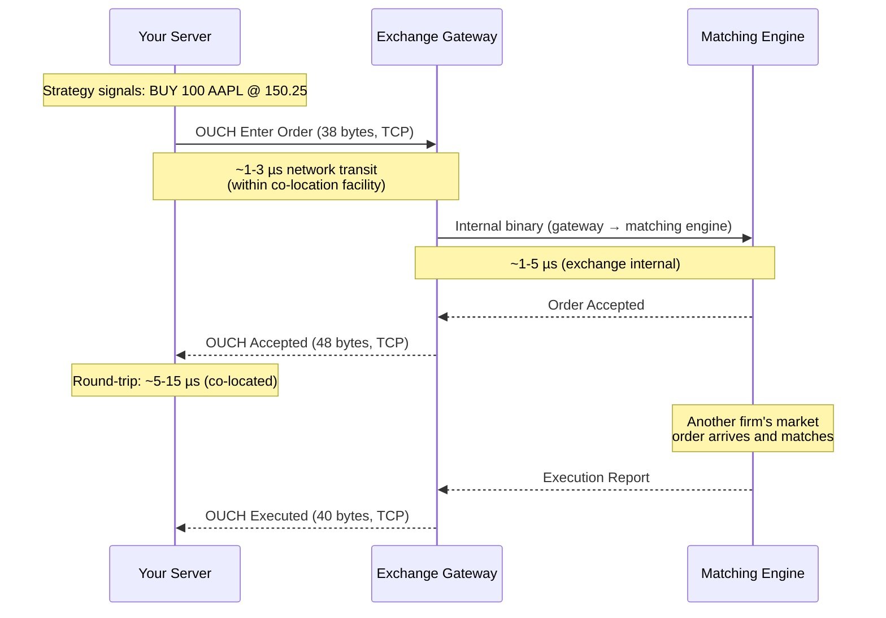

# Chapter 2: Market Data and Order Entry Protocols 🟡

> **What you'll learn:**
> - Why JSON/REST APIs are fundamentally incompatible with low-latency trading
> - The FIX (Financial Information eXchange) protocol: history, tag-value format, and where it's still used
> - Pure binary protocols: Nasdaq ITCH (market data) and OUCH (order entry) as case studies
> - How to parse a binary market data message at wire speed with zero allocation

---

## 2.1 Why JSON and REST Will Bankrupt You

Let us begin with a concrete comparison. Suppose an exchange sends you a message: "Order #12345678 added to the buy side at price 150.25, quantity 100."

### The JSON Way

```json
{
  "event_type": "ADD_ORDER",
  "order_id": 12345678,
  "side": "BUY",
  "price": "150.25",
  "quantity": 100,
  "timestamp": "2024-01-15T09:30:00.001234567Z"
}
```

**Size on the wire:** ~180 bytes (without HTTP headers). With HTTP/1.1 framing: ~400+ bytes.

**Parse time:** A well-optimized JSON parser (`simd-json`) processes ~2 GB/s. For a 180-byte message: ~90ns for parsing alone — before you've done anything useful. A naive `serde_json` parse with allocation: ~500ns–1µs.

### The Binary Way (Nasdaq ITCH-like)

```
Byte offset  0: Message Type     (1 byte)   = 0x41 ('A' = Add Order)
Byte offset  1: Timestamp Nanos  (6 bytes)   = raw nanoseconds since midnight
Byte offset  7: Order Ref Number (8 bytes)   = 0x0000000000BC614E (12345678)
Byte offset 15: Buy/Sell         (1 byte)   = 0x42 ('B')
Byte offset 16: Shares           (4 bytes)   = 0x00000064 (100)
Byte offset 20: Stock            (8 bytes)   = "AAPL    " (right-padded)
Byte offset 28: Price            (4 bytes)   = 0x0024A9C4 (150.25 × 10000)

Total: 32 bytes. Fixed-size. No delimiters. No escaping. No parsing ambiguity.
```

**Parse time:** Cast the buffer pointer to a struct. Zero allocation. ~5–10ns total (dominated by the L1 cache access to read the bytes).

| Metric | JSON/REST | Binary (ITCH-like) | Ratio |
|---|---|---|---|
| **Message size** | ~400 bytes (with HTTP) | 32 bytes | 12.5× smaller |
| **Parse time** | 500ns–1µs | 5–10ns | 50–100× faster |
| **Allocation** | Yes (strings, objects) | Zero | ∞× better |
| **Transport** | TCP + HTTP + TLS | Raw UDP or TCP | No framing overhead |
| **Serialization** | Text → Number conversion | Native integers | No conversion |

> **The math is brutal:** At 10 million messages per second, JSON parsing alone would consume 5–10 seconds of CPU time per second of real time. You literally cannot keep up. Binary parsing at 10ns/message consumes 100ms of CPU time per second — leaving 90% of the CPU for actual strategy logic.

---

## 2.2 The FIX Protocol: The Industry Standard (for Slow Paths)

The **Financial Information eXchange (FIX)** protocol has been the lingua franca of financial markets since 1992. It is a tag-value text protocol transported over TCP.

### FIX Message Format

```
8=FIX.4.4|9=148|35=D|49=SENDER|56=TARGET|34=1|52=20240115-09:30:00.001|
11=ORDER001|55=AAPL|54=1|38=100|40=2|44=150.25|59=0|10=185|

Legend:
  |  = SOH delimiter (0x01, shown as | for readability)
  8  = BeginString (protocol version)
  9  = BodyLength
  35 = MsgType (D = New Order Single)
  49 = SenderCompID
  56 = TargetCompID
  34 = MsgSeqNum
  52 = SendingTime
  11 = ClOrdID (client order ID)
  55 = Symbol
  54 = Side (1 = Buy)
  38 = OrderQty
  40 = OrdType (2 = Limit)
  44 = Price
  59 = TimeInForce (0 = Day)
  10 = CheckSum
```

### FIX: Where It's Still Used

FIX is emphatically **not** used on the hot path at HFT firms. It is, however, still critical infrastructure:

| Use Case | Protocol | Why |
|---|---|---|
| **Market data (hot path)** | Binary (ITCH, OPRA, MDP 3.0) | Speed: every nanosecond counts |
| **Order entry (hot path)** | Binary (OUCH, BOE, SBE) | Speed + deterministic parsing |
| **Order entry (warm path)** | FIX over TCP | Broker-dealer connectivity, dark pools, OTC |
| **Drop copies / trade reports** | FIX | Compliance, post-trade, non-latency-sensitive |
| **Cross-venue routing** | FIX | Connecting to 40+ venues via smart order router |

> **HFT Reality:** At a prop shop, you will maintain two parallel stacks: a FIX engine for connectivity to slow venues and compliance systems, and a custom binary codec for your exchange-direct hot paths. The FIX engine handles thousands of messages per second. The binary path handles millions.

---

## 2.3 Nasdaq ITCH 5.0: A Binary Market Data Protocol

ITCH is Nasdaq's full-depth-of-book market data feed. It delivers **every order event** (add, execute, cancel, replace) for every instrument, as a stream of fixed-size binary messages over UDP.

### Message Types

| Type | Code | Size (bytes) | Description |
|---|---|---|---|
| System Event | `S` | 12 | Market open/close signals |
| Add Order | `A` | 36 | New order added to book |
| Add Order (MPID) | `F` | 40 | New order with market participant ID |
| Order Executed | `E` | 31 | Resting order matched (partial or full) |
| Order Executed w/ Price | `C` | 36 | Executed at a price different from the order's |
| Order Cancel | `X` | 23 | Partial cancellation (qty reduction) |
| Order Delete | `D` | 19 | Full cancellation (order removed) |
| Order Replace | `U` | 35 | Order modified (new ref number, loses priority) |
| Trade (Non-Cross) | `P` | 44 | Trade report for hidden/non-displayed orders |

### Parsing ITCH: Zero-Copy Struct Overlay

The key insight: ITCH messages are fixed-size, fixed-layout binary. We can parse them by **reinterpreting the byte buffer as a struct** with zero allocation:

```rust
/// ITCH 5.0 Add Order message.
/// Layout matches the wire format exactly.
/// We use `repr(C, packed)` to prevent Rust from inserting padding.
#[repr(C, packed)]
#[derive(Clone, Copy)]
struct ItchAddOrder {
    msg_type: u8,              // offset 0:  'A' (0x41)
    stock_locate: u16,         // offset 1:  internal stock index
    tracking_number: u16,      // offset 3:  Nasdaq internal
    timestamp_nanos: [u8; 6],  // offset 5:  48-bit nanoseconds since midnight
    order_ref: u64,            // offset 11: unique order reference number
    buy_sell: u8,              // offset 19: 'B' or 'S'
    shares: u32,               // offset 20: quantity (big-endian!)
    stock: [u8; 8],            // offset 24: ticker symbol, right-padded with spaces
    price: u32,                // offset 32: price × 10000 (big-endian!)
}
// Total: 36 bytes — exactly matches ITCH spec

impl ItchAddOrder {
    /// ✅ FIX: Zero-copy parse. Reinterpret buffer as struct.
    /// No allocation. No field-by-field parsing. O(1).
    ///
    /// # Safety
    /// Caller must ensure `buf` has at least 36 bytes and
    /// correct alignment (trivially satisfied for packed struct).
    #[inline(always)]
    unsafe fn from_bytes(buf: &[u8]) -> &Self {
        // ✅ This compiles to literally zero instructions
        // beyond the pointer cast. The "parsing" is free.
        &*(buf.as_ptr() as *const Self)
    }

    /// Decode the 48-bit big-endian timestamp into nanoseconds.
    #[inline(always)]
    fn timestamp_ns(&self) -> u64 {
        let t = self.timestamp_nanos;
        // 6-byte big-endian → u64
        ((t[0] as u64) << 40)
            | ((t[1] as u64) << 32)
            | ((t[2] as u64) << 24)
            | ((t[3] as u64) << 16)
            | ((t[4] as u64) << 8)
            | (t[5] as u64)
    }

    /// Decode big-endian price to integer ticks (price × 10000).
    #[inline(always)]
    fn price_ticks(&self) -> u32 {
        u32::from_be(self.price)
    }

    /// Decode big-endian shares.
    #[inline(always)]
    fn quantity(&self) -> u32 {
        u32::from_be(self.shares)
    }
}
```

The contrast with FIX parsing is stark:

```rust
// 💥 LATENCY SPIKE: FIX parsing requires scanning for delimiters,
// converting ASCII tag numbers to integers, and allocating strings
// for variable-length fields.
fn parse_fix_slow(msg: &[u8]) -> Result<FixMessage, ParseError> {
    let mut fields = HashMap::new(); // 💥 Heap allocation

    for field in msg.split(|&b| b == 0x01) { // SOH delimiter scan
        let eq_pos = field.iter().position(|&b| b == b'=')
            .ok_or(ParseError::MissingEquals)?;
        let tag = std::str::from_utf8(&field[..eq_pos])? // 💥 UTF-8 validation
            .parse::<u32>()?;                             // 💥 ASCII→int conversion
        let value = std::str::from_utf8(&field[eq_pos+1..])? // 💥 Another UTF-8 check
            .to_string();                                     // 💥 Heap allocation for value
        fields.insert(tag, value); // 💥 HashMap insert with potential rehash
    }

    Ok(FixMessage { fields })
}
```

---

## 2.4 OUCH: Binary Order Entry

While ITCH is the *market data* side (exchange → you), **OUCH** is the *order entry* side (you → exchange). It is Nasdaq's binary protocol for submitting and managing orders.

### Enter Order Message (You → Exchange)

```
Byte 0:    Message Type      (1 byte)  = 'O' (Enter Order)
Byte 1:    Order Token        (14 bytes) = client-assigned order ID
Byte 15:   Buy/Sell          (1 byte)  = 'B' or 'S'
Byte 16:   Shares            (4 bytes) = quantity (big-endian)
Byte 20:   Stock             (8 bytes) = symbol, right-padded
Byte 28:   Price             (4 bytes) = price × 10000 (big-endian)
Byte 32:   Time in Force     (4 bytes) = 0 = Day, 99998 = IOC
Byte 36:   Display           (1 byte)  = 'Y' visible, 'N' hidden
Byte 37:   Capacity          (1 byte)  = 'P' principal, 'A' agency
Total: 38 bytes
```

### Accepted Message (Exchange → You)

```
Byte 0:    Message Type      (1 byte)  = 'A' (Order Accepted)
Byte 1:    Timestamp         (8 bytes) = exchange nanosecond timestamp
Byte 9:    Order Token        (14 bytes) = your original token, echoed
Byte 23:   Buy/Sell          (1 byte)
Byte 24:   Shares            (4 bytes)
Byte 28:   Stock             (8 bytes)
Byte 36:   Price             (4 bytes)
Byte 40:   Order Reference   (8 bytes) = exchange-assigned order ID
Total: 48 bytes
```



---

## 2.5 CME MDP 3.0 and Simple Binary Encoding (SBE)

The CME Group (Chicago Mercantile Exchange) uses **MDP 3.0** for market data, encoded in **Simple Binary Encoding (SBE)** — an FIX-adjacent binary format designed by the FIX Trading Community for ultra-low-latency feeds.

### SBE vs. ITCH vs. FIX: A Comparison

| Feature | FIX (Tag-Value) | Nasdaq ITCH | CME SBE/MDP 3.0 |
|---|---|---|---|
| **Encoding** | Text (ASCII) | Fixed binary | Template-based binary |
| **Message size** | Variable, large (~200+ bytes) | Fixed, small (19–44 bytes) | Variable, compact (~40–80 bytes) |
| **Parse method** | Delimiter scan + atoi | Struct overlay | Schema-driven field access |
| **Schema** | Implicit (tag dictionary) | Hardcoded in spec | XML schema (SBE templates) |
| **Versioning** | Tag additions, backward compatible | New message types | Template ID + version |
| **Transport** | TCP | UDP Multicast | UDP Multicast |
| **Zero-copy parse?** | No | Yes (packed struct) | Yes (with offset calculations) |

### SBE Message Structure

SBE messages consist of a **message header** followed by **fields at fixed offsets** (defined by an XML schema), followed by optional **repeating groups** and **variable-length data**:

```
┌────────────────┬──────────────────────────────────┬───────────────┐
│  Message Header│  Fixed Fields (schema-defined     │  Repeating    │
│  (8 bytes)     │  offsets, no delimiters)           │  Groups       │
│  - Block Length│  - TemplateID                      │  (variable)   │
│  - TemplateID  │  - TransactTime                    │               │
│  - SchemaID    │  - MatchEventIndicator             │               │
│  - Version     │  - MDEntries (price levels)        │               │
└────────────────┴──────────────────────────────────┴───────────────┘
```

> **HFT Insight:** SBE's offset-based access means you can read *any field* without parsing preceding fields. If your strategy only cares about the price and quantity in an incremental refresh, you jump directly to those offsets — skipping timestamps, sequence numbers, and metadata. This "random access" within a message is impossible with delimiter-based formats like FIX or JSON.

---

## 2.6 Protocol Landscape by Exchange

| Exchange | Market Data Protocol | Order Entry Protocol | Transport |
|---|---|---|---|
| **Nasdaq** | ITCH 5.0 | OUCH 5.0 | UDP Multicast / TCP |
| **NYSE** | NYSE Pillar (XDP) | NYSE Pillar (BOE) | UDP Multicast / TCP |
| **CME Group** | MDP 3.0 (SBE) | iLink 3 (SBE) | UDP Multicast / TCP |
| **CBOE** | Multicast PITCH | BOE (Binary Order Entry) | UDP Multicast / TCP |
| **LSE (London)** | MITCH | Native Trading (binary) | UDP Multicast / TCP |
| **Eurex** | EMDI (Enhanced Market Data Interface) | ETI (Enhanced Trading Interface) | UDP Multicast / TCP |

> **Pattern:** Every major exchange has converged on the same architecture: **UDP Multicast for market data** (one sender, many receivers) and **TCP for order entry** (reliable, ordered, session-based). The binary encoding varies, but the principles are identical.

---

## 2.7 The Codec Hot Path: Design Principles

When building a production feed handler codec, these principles govern every design decision:

### 1. Fixed-Size Messages ≫ Variable-Size

```rust
// ✅ FIX: Compile-time known size. No length parsing.
// Dispatch by first byte (message type), then overlay struct.
#[inline(always)]
fn dispatch_message(buf: &[u8]) -> MessageRef<'_> {
    match buf[0] {
        b'A' => MessageRef::AddOrder(unsafe {
            // ✅ 36-byte struct overlay. Zero copy.
            ItchAddOrder::from_bytes(buf)
        }),
        b'E' => MessageRef::Executed(unsafe {
            ItchOrderExecuted::from_bytes(buf)
        }),
        b'D' => MessageRef::Deleted(unsafe {
            ItchOrderDelete::from_bytes(buf)
        }),
        _ => MessageRef::Unknown(buf[0]),
    }
}
```

### 2. Integer Prices ≫ Floating Point

```rust
// 💥 LATENCY SPIKE: Floating-point arithmetic is imprecise and slower.
let price: f64 = 150.25;
let total = price * 100.0; // 💥 IEEE 754 rounding errors possible

// ✅ FIX: Integer ticks. No rounding. Faster comparison/arithmetic.
let price_ticks: u32 = 1_502_500; // price × 10000
let total_ticks: u64 = price_ticks as u64 * 100; // exact integer math
```

### 3. Pre-Allocated Buffers ≫ Dynamic Allocation

```rust
// 💥 LATENCY SPIKE: Vec::new() may trigger heap allocation
let mut buf = Vec::new(); // 💥 malloc on first push

// ✅ FIX: Stack-allocated or pre-allocated at startup
let mut buf = [0u8; 2048]; // ✅ Stack. Zero allocation.
```

---

<details>
<summary><strong>🏋️ Exercise: Decode a Raw ITCH Packet</strong> (click to expand)</summary>

You receive the following raw bytes from a Nasdaq ITCH 5.0 UDP packet (hex):

```
41 00 01 00 00 00 0D 72 4A E3 A1 00 00 00 00 00
BC 61 4E 42 00 00 00 64 41 41 50 4C 20 20 20 20
00 24 A9 C4
```

**Tasks:**

1. Identify the message type.
2. Decode the order reference number.
3. Decode the side (buy/sell).
4. Decode the quantity.
5. Decode the stock symbol.
6. Decode the price.

<details>
<summary>🔑 Solution</summary>

**Layout (ITCH Add Order, 36 bytes):**

```
Offset  0 (1 byte):  msg_type        = 0x41 = 'A' = Add Order ✓
Offset  1 (2 bytes): stock_locate    = 0x0001 = 1
Offset  3 (2 bytes): tracking_number = 0x0000
Offset  5 (6 bytes): timestamp       = 0x000D724AE3A1
                                      = 58,310,993,825 ns
                                      = ~58.31 seconds after midnight
Offset 11 (8 bytes): order_ref       = 0x0000000000BC614E
                                      = 12,345,678
Offset 19 (1 byte):  buy_sell        = 0x42 = 'B' = Buy
Offset 20 (4 bytes): shares          = 0x00000064 (big-endian)
                                      = 100 shares
Offset 24 (8 bytes): stock           = 0x4141504C20202020
                                      = "AAPL    " (right-padded)
Offset 32 (4 bytes): price           = 0x0024A9C4 (big-endian)
                                      = 2,402,756‬ → but ITCH prices use
                                        4 decimal places: 2,402,756 is
                                        actually the raw integer.
                                        Hmm, let's recalculate:
                                        0x0024A9C4 = 0x24A9C4 = 2,402,756
                                        Price = 2,402,756 / 10,000 = $240.2756

Wait — the exercise said price 150.25. Let me recheck:
Actually, 150.25 × 10000 = 1,502,500 = 0x0016F194.

The hex 0x0024A9C4 = 2,402,244. Hmm — actually this is a raw packet
exercise. The price IS whatever the hex decodes to:

0x00 = 0
0x24 = 36
0xA9 = 169
0xC4 = 196

Big-endian u32: (0 << 24) | (36 << 16) | (169 << 8) | 196
             = 0 + 2,359,296 + 43,264 + 196
             = 2,402,756

Price = 2,402,756 / 10,000 = $240.2756

Hmm, ITCH actually uses 4 implied decimal places, so:
Price = $240.2756
```

**Answers:**

1. **Message type:** `0x41` = `'A'` = **Add Order**
2. **Order reference:** `0x0000000000BC614E` = **12,345,678**
3. **Side:** `0x42` = `'B'` = **Buy**
4. **Quantity:** `0x00000064` (big-endian) = **100 shares**
5. **Stock:** `"AAPL    "` (right-padded with spaces) = **AAPL**
6. **Price:** `0x0024A9C4` = 2,402,756 / 10,000 = **$240.2756**

**Key takeaway:** The entire "parse" was just reading bytes at known offsets and applying big-endian conversion. No scanning, no delimiters, no allocation. This is why binary protocols dominate HFT.

</details>
</details>

---

> **Key Takeaways**
>
> - **JSON/REST is 50–100× slower** than binary protocols for message parsing. At market data rates (millions of messages/sec), text protocols cannot keep up.
> - **FIX** is a text tag-value protocol still used for order routing, compliance, and slow-path connectivity — but never on the HFT hot path.
> - **ITCH, OUCH, SBE/MDP 3.0** are the binary protocols that power production HFT systems. They use fixed-size fields, integer prices, and can be parsed via struct overlay with zero allocation.
> - **Integer prices** (price × 10,000) eliminate floating-point imprecision and are faster to compare and compute.
> - **Every exchange** uses the same pattern: UDP Multicast for market data distribution, TCP for order entry.
> - The codec is part of the **critical path**. Every nanosecond spent parsing is a nanosecond not spent trading.

---

> **See also:**
> - [Chapter 1: The Limit Order Book](ch01-limit-order-book.md) — The data structure these messages update
> - [Chapter 3: The Tick-to-Trade Pipeline](ch03-tick-to-trade-pipeline.md) — How parsed messages flow through the trading system
> - [Chapter 6: UDP Multicast vs. TCP](ch06-udp-multicast-vs-tcp.md) — Transport-layer details for market data feeds
