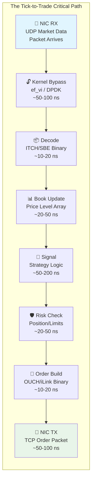
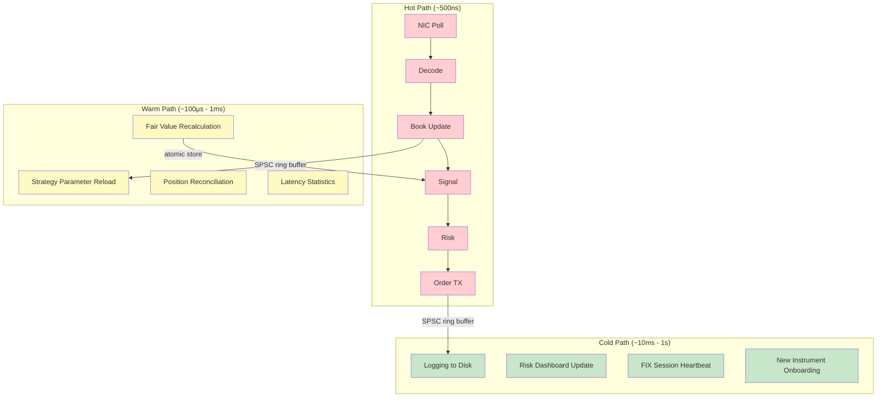

# Chapter 3: The Tick-to-Trade Pipeline 🟡

> **What you'll learn:**
> - The complete critical path from an exchange UDP packet arriving at your NIC to an order leaving your server
> - How to decompose the pipeline into stages and assign nanosecond-level latency budgets
> - Why every system call, allocation, and cache miss on the hot path is a competitive disadvantage
> - The architectural patterns used by production HFT systems: single-threaded hot paths, lock-free handoff, and pre-computed decisions

---

## 3.1 The Critical Path: End-to-End

The **tick-to-trade** pipeline is the most latency-sensitive code path in all of software engineering. It is the sequence of operations between:

1. **Tick:** A UDP packet containing a market data update arrives at your Network Interface Card (NIC).
2. **Trade:** A TCP packet containing your order leaves your NIC toward the exchange gateway.

The elapsed time between these two events — the **wire-to-wire latency** — is the single most important performance metric in HFT. Competitive firms achieve wire-to-wire latencies of **800ns–5µs** depending on the complexity of their strategy.



### Latency Budget Breakdown

| Stage | Operation | Typical Latency | Cumulative |
|---|---|---|---|
| 1. NIC → User Space | Kernel bypass (ef_vi poll) | 50–100 ns | 50–100 ns |
| 2. Decode | Binary struct overlay | 10–20 ns | 60–120 ns |
| 3. Book Update | Array-indexed price level update | 20–50 ns | 80–170 ns |
| 4. Signal Generation | Strategy evaluation (pre-computed) | 50–200 ns | 130–370 ns |
| 5. Risk Check | Position limits, fat-finger checks | 20–50 ns | 150–420 ns |
| 6. Order Serialization | Binary order encoding | 10–20 ns | 160–440 ns |
| 7. NIC TX | TCP send via kernel bypass | 50–100 ns | 210–540 ns |
| **Overhead** | Cache misses, branch mispredictions | 100–500 ns | **310–1,040 ns** |

> **The pitiless math:** Your latency budget for the *entire pipeline* — from photon hitting the NIC to photon leaving the NIC — is roughly **1 microsecond**. That's 1,000 nanoseconds. A single `malloc` call takes 50–200ns. A single L3 cache miss takes 40–60ns. A single system call takes 200–1,000ns. You cannot afford *any* of these on the hot path.

---

## 3.2 The Web Way vs. The HFT Way

### The Standard Backend Architecture (Too Slow)

```rust
// 💥 This is how a web backend might process a market data event.
// Every line annotated with its latency cost.

async fn handle_market_data(socket: &UdpSocket) -> Result<()> {
    let mut buf = vec![0u8; 65536];       // 💥 LATENCY SPIKE: Heap allocation (~100ns)

    let n = socket.recv(&mut buf).await?;  // 💥 LATENCY SPIKE: syscall (recvfrom)
                                           //    + async runtime poll overhead
                                           //    + potential context switch
                                           //    Total: ~1,000-5,000 ns

    let msg: MarketData = serde_json::from_slice(&buf[..n])?;
                                           // 💥 LATENCY SPIKE: JSON parse + alloc
                                           //    ~500-1,000 ns

    let mut book = order_book.lock().await; // 💥 LATENCY SPIKE: Mutex contention
                                            //    + potential task yield
                                            //    ~100-10,000 ns (unbounded!)

    book.update(msg.price, msg.qty);        // Actual useful work: ~50ns

    if strategy.should_trade(&book) {       // ~100ns
        let order = Order::new(/* ... */);  // 💥 LATENCY SPIKE: Heap allocation
        let payload = serde_json::to_vec(&order)?; // 💥 JSON serialization

        tcp_stream.write_all(&payload).await?; // 💥 LATENCY SPIKE: syscall (write)
                                               //    + Nagle's algorithm delay
                                               //    + TCP send buffer copy
    }

    Ok(())
    // Total: ~5,000-50,000 ns (5-50 µs)
    // At peak market data rates, you're already 10-100x too slow.
}
```

### The HFT Architecture

```rust
/// ✅ The HFT hot path. Single-threaded. No syscalls. No allocation.
/// Everything is pre-allocated at startup and accessed via direct memory.
///
/// This function is the ENTIRE critical path. It runs in a tight
/// busy-poll loop on a dedicated, isolated CPU core.
#[inline(never)] // Prevent inlining so we can measure it precisely
fn hot_path_tick_to_trade(
    nic: &mut EfViInterface,       // ✅ Kernel bypass NIC handle
    book: &mut FastOrderBook,      // ✅ Pre-allocated array-indexed book
    strategy: &mut Strategy,       // ✅ Pre-computed signal thresholds
    risk: &mut RiskGate,           // ✅ Inline risk limits
    order_pool: &mut OrderPool,    // ✅ Pre-allocated order memory pool
    tx_ring: &mut TxRingBuffer,    // ✅ Pre-allocated TX ring buffer
) {
    // Stage 1: Poll NIC for incoming packet (~50ns)
    // ✅ FIX: No syscall. ef_vi polls the NIC RX descriptor ring
    //         directly from user-space via memory-mapped I/O.
    let pkt = match nic.poll_rx() {
        Some(pkt) => pkt,
        None => return, // No packet ready — loop again
    };

    // Stage 2: Decode binary message (~10ns)
    // ✅ FIX: Zero-copy struct overlay. No parsing. No allocation.
    let msg = unsafe { ItchAddOrder::from_bytes(pkt.payload()) };

    // Stage 3: Update order book (~30ns)
    // ✅ FIX: Array-indexed by price tick. O(1) access.
    let book_changed = book.apply_event(msg);

    // Stage 4: Evaluate strategy (~100ns)
    // ✅ FIX: Pre-computed thresholds. No floating point.
    //         Signal = f(book imbalance, spread, recent trades)
    if !book_changed { return; }
    let signal = strategy.evaluate(book);

    if signal == Signal::None { return; }

    // Stage 5: Risk check (~30ns)
    // ✅ FIX: Inline integer comparisons. No function pointer dispatch.
    if !risk.check(signal.side, signal.qty, signal.price) {
        return; // Risk limit breached — do not trade
    }

    // Stage 6: Build order (~15ns)
    // ✅ FIX: Grab a pre-allocated order slot from the pool.
    //         No malloc. No heap. Just bump a pointer.
    let order = order_pool.alloc();
    order.encode_ouch(signal.side, signal.qty, signal.price);

    // Stage 7: Send order (~50ns)
    // ✅ FIX: Write to pre-allocated TX ring buffer.
    //         NIC will DMA it directly from this memory.
    tx_ring.enqueue(order.as_bytes());
    nic.kick_tx(); // ✅ Doorbell write to NIC — triggers DMA send

    // Total: ~300-500 ns (0.3-0.5 µs)
}
```

---

## 3.3 Architectural Principles of the Hot Path

### Principle 1: Single-Threaded Hot Path

The hot path is **single-threaded**. There is no locking, no atomic contention, no inter-thread synchronization on the critical path.

```
                    ┌─────────────────────────────────┐
                    │         HOT PATH THREAD          │
                    │     (Pinned to Core 3,           │
                    │      isolated via isolcpus)      │
                    │                                  │
                    │  NIC Poll → Decode → Book        │
                    │  → Signal → Risk → Order → TX    │
                    │                                  │
                    │  NO locks. NO syscalls.           │
                    │  NO allocation. NO I/O.           │
                    └──────────┬───────────────────────┘
                               │ Lock-free SPSC
                               │ ring buffer
                    ┌──────────▼───────────────────────┐
                    │       LOGGING THREAD              │
                    │     (Pinned to Core 5)            │
                    │                                  │
                    │  Reads events from ring buffer   │
                    │  Writes to disk (async I/O)      │
                    │  Sends to monitoring dashboard   │
                    └──────────────────────────────────┘
```

**Why single-threaded?** Because multi-threaded access to shared state — even with lock-free atomics — introduces cache-line bouncing. A `fetch_add` on a shared `AtomicU64` takes ~40ns due to the MESI invalidation round-trip (see Chapter 7). On a 500ns total budget, that's 8% of your latency gone on a single counter increment.

### Principle 2: Pre-Compute Everything

The signal generation stage should not *compute* anything complex in real-time. Instead, the strategy pre-computes thresholds and lookup tables during slower market periods:

```rust
struct Strategy {
    // ✅ Pre-computed at strategy reload (every ~100ms on a warm path)
    fair_value_ticks: i64,
    bid_offset_ticks: i64,     // how far below fair value to bid
    ask_offset_ticks: i64,     // how far above fair value to ask
    imbalance_threshold: u32,  // book imbalance trigger

    // ✅ Pre-computed lookup table: imbalance → adjustment
    // Indexed by quantized imbalance ratio. No division on hot path.
    adjustment_table: [i16; 256],
}

impl Strategy {
    /// ✅ Hot-path signal evaluation. ~50-100ns.
    /// All integer arithmetic. No division. No branches on data-dependent values.
    #[inline(always)]
    fn evaluate(&self, book: &FastOrderBook) -> Signal {
        let bid_qty = book.best_bid_qty();
        let ask_qty = book.best_ask_qty();

        // ✅ Pre-computed lookup instead of division
        // Quantize imbalance to 0-255 range
        let total = bid_qty + ask_qty;
        if total == 0 { return Signal::None; }
        let imbalance_idx = ((bid_qty as u64 * 255) / total as u64) as u8;
        let adjustment = self.adjustment_table[imbalance_idx as usize];

        let target_bid = self.fair_value_ticks - self.bid_offset_ticks
                         + adjustment as i64;
        let target_ask = self.fair_value_ticks + self.ask_offset_ticks
                         - adjustment as i64;

        // Generate signal if our quotes need updating
        if (target_bid - book.our_bid_price).unsigned_abs() > 1 {
            Signal::Quote {
                bid_price: target_bid,
                ask_price: target_ask,
                qty: 10,
            }
        } else {
            Signal::None
        }
    }
}
```

### Principle 3: Zero Allocation on the Hot Path

Every memory allocation on the hot path is **forbidden**. All memory is pre-allocated at startup:

```rust
/// ✅ Pre-allocated memory pool for outgoing orders.
/// Uses a simple bump allocator with circular reuse.
/// No malloc. No free. No fragmentation.
struct OrderPool {
    buffer: Box<[OrderSlot; 4096]>,  // allocated once at startup
    head: usize,                      // next free slot (wraps around)
}

impl OrderPool {
    /// Allocate an order slot. O(1). No syscall.
    #[inline(always)]
    fn alloc(&mut self) -> &mut OrderSlot {
        let slot = &mut self.buffer[self.head];
        self.head = (self.head + 1) & 4095; // ✅ Power-of-2 mask instead of modulo
        slot
    }
}
```

### Principle 4: Branch-Free Where Possible

Branch mispredictions cost ~15–20 cycles (~5–7ns). On the hot path, use branchless techniques:

```rust
// 💥 LATENCY SPIKE: Branch misprediction if side is unpredictable
fn update_bbo_branchy(book: &mut FastOrderBook, side: Side, price: i64) {
    if side == Side::Buy {
        if price > book.best_bid {
            book.best_bid = price;
        }
    } else {
        if price < book.best_ask {
            book.best_ask = price;
        }
    }
}

// ✅ FIX: Branchless BBO update using conditional moves
fn update_bbo_branchless(book: &mut FastOrderBook, side: Side, price: i64) {
    // Compiler will emit CMOV instructions — no branch prediction needed
    let is_buy = side == Side::Buy;
    let new_bid = if is_buy { price.max(book.best_bid) } else { book.best_bid };
    let new_ask = if !is_buy { price.min(book.best_ask) } else { book.best_ask };
    book.best_bid = new_bid;
    book.best_ask = new_ask;
}
```

---

## 3.4 The Warm Path and Cold Path

Not everything runs at nanosecond speed. A well-designed system separates concerns into three paths:



| Path | Latency Target | Memory Allocation | Syscalls | Threading |
|---|---|---|---|---|
| **Hot** | < 1µs | Forbidden | Forbidden | Single-threaded, isolated core |
| **Warm** | < 1ms | Pool-allocated | Minimal (timers) | Dedicated core, may share |
| **Cold** | < 1s | Unrestricted | Unrestricted | Thread pool, async I/O |

The paths communicate via **lock-free SPSC ring buffers** (hot → warm, hot → cold) and **atomic loads** (warm → hot, for parameter updates).

---

## 3.5 Measuring the Pipeline: Timestamping Strategy

You cannot optimize what you cannot measure. Production pipelines timestamp at multiple points:

```rust
/// ✅ Hardware timestamps using RDTSC (Read Time-Stamp Counter).
/// On a 3 GHz CPU, each tick ≈ 0.33 ns. Much cheaper than clock_gettime().
#[inline(always)]
fn rdtsc() -> u64 {
    #[cfg(target_arch = "x86_64")]
    unsafe {
        core::arch::x86_64::_rdtsc()
    }
}

struct PipelineTimestamps {
    nic_rx: u64,         // When ef_vi reported the packet
    decode_done: u64,    // After binary parse
    book_done: u64,      // After order book update
    signal_done: u64,    // After strategy evaluation
    risk_done: u64,      // After risk check
    order_done: u64,     // After order encoding
    nic_tx: u64,         // After TX doorbell ring
}

impl PipelineTimestamps {
    fn wire_to_wire_ns(&self, tsc_freq_ghz: f64) -> f64 {
        (self.nic_tx - self.nic_rx) as f64 / tsc_freq_ghz
    }
}
```

> **Production practice:** Timestamps are written to the SPSC ring buffer alongside each event and consumed by the cold-path logging thread. You never write to disk from the hot path. You never call `clock_gettime()` from the hot path (it's a vDSO call but still ~20ns). RDTSC is ~1ns.

---

<details>
<summary><strong>🏋️ Exercise: Design a Tick-to-Trade Latency Budget</strong> (click to expand)</summary>

You are designing a market-making system for CME ES futures, co-located in the Aurora data center. Your target wire-to-wire latency is **1.5 µs** (1,500 ns).

Your hardware:
- CPU: Intel Xeon Gold 6354 @ 3.0 GHz (Turbo 3.6 GHz on isolated cores)
- NIC: Solarflare X2522 (ef_vi kernel bypass)
- Memory: DDR4-3200 (CL22)

**Tasks:**

1. Allocate a nanosecond budget for each stage of the pipeline. The stages must total ≤ 1,500 ns including overhead.
2. Identify three specific things that, if present on the hot path, would blow the budget by themselves.
3. Your strategy needs to evaluate a 200-element array (parameter table). Is this feasible within the signal generation budget? Calculate the expected cache access pattern.
4. Your risk check needs to verify that the order quantity × price doesn't exceed a position limit. Can you do this with integer arithmetic only? Show the calculation.

<details>
<summary>🔑 Solution</summary>

**1. Latency Budget:**

| Stage | Budget | Justification |
|---|---|---|
| NIC RX → User Space (ef_vi poll) | 80 ns | ef_vi poll + DMA completion |
| Decode (SBE struct overlay) | 15 ns | Pointer cast + 2 big-endian conversions |
| Book Update | 40 ns | Array index + qty accumulation. 1 L1 cache access. |
| Signal Generation | 150 ns | Lookup table (fits in L1: 200 × 2 bytes = 400 bytes) |
| Risk Check | 30 ns | 2 integer comparisons + 1 multiplication |
| Order Encoding | 20 ns | Write 38 bytes to pre-allocated buffer |
| NIC TX (ef_vi send) | 80 ns | Write TX descriptor + doorbell |
| **Overhead / margin** | **1,085 ns** | Cache misses, branch mispredictions, pipeline stalls |
| **Total** | **1,500 ns** | ✅ Within budget |

Note: The large overhead margin is deliberate. In practice, you'll hit occasional L2/L3 misses, TLB misses, and instruction cache misses that eat into this margin. A 50% margin is typical for production systems.

**2. Three Budget-Killers:**

1. **A single `malloc`/`Vec::push`**: 50–200 ns. That's 3–13% of the total budget for one allocation.
2. **A single syscall (`recvfrom`, `sendto`)**: 200–1,000 ns. This alone could exceed the entire budget.
3. **A `Mutex::lock` with contention**: Unbounded. Even uncontended, a `pthread_mutex_lock` is ~25ns (futex syscall). With contention, it can be microseconds to milliseconds.

**3. 200-Element Parameter Table:**

200 elements × 2 bytes each = 400 bytes. An L1 cache line is 64 bytes.

- 400 / 64 = 6.25 → **7 cache lines**
- If the table is accessed frequently (every tick), it will be **hot in L1 cache**: 7 × ~4 cycles = **28 cycles ≈ 9 ns** at 3 GHz.
- If the table is accessed rarely and gets evicted, worst case is 7 L2 cache hits: 7 × ~12 cycles = **84 cycles ≈ 28 ns**.
- **Verdict:** Yes, feasible within the 150ns signal budget. The entire table fits in L1 comfortably.

**4. Risk Check with Integer Arithmetic:**

```rust
/// Risk check: does order_qty × price exceed max_notional?
/// All values in ticks (price × 10000) and contracts.
#[inline(always)]
fn risk_check_notional(
    order_qty: u32,        // contracts
    price_ticks: u64,      // price × 10000
    max_notional_ticks: u64, // limit × 10000
) -> bool {
    // ✅ Single integer multiply + compare. ~3 cycles.
    // No floating point. No division. No overflow for reasonable values.
    // max: 1,000,000 contracts × 10,000,000 ticks = 10^13 < u64::MAX
    let notional = order_qty as u64 * price_ticks;
    notional <= max_notional_ticks
}

// Example: Buy 100 contracts @ $4,502.25
// price_ticks = 45_022_500
// notional = 100 × 45_022_500 = 4,502,250,000 ticks
// max_notional_ticks = 500_000 × 10_000 × 10_000 = 50,000,000,000
// 4,502,250,000 ≤ 50,000,000,000 → ✅ PASS
```

Total risk check cost: 1 multiply + 1 compare ≈ **2–3 ns**. Well within the 30ns budget.

</details>
</details>

---

> **Key Takeaways**
>
> - The **tick-to-trade pipeline** is the critical path: NIC RX → Decode → Book → Signal → Risk → Order → NIC TX.
> - Competitive wire-to-wire latency is **500ns–2µs**. Each nanosecond matters.
> - The hot path must be **single-threaded**, with **zero allocations**, **zero syscalls**, and **zero locks**.
> - Separate your system into **hot**, **warm**, and **cold** paths with different latency budgets and resource constraints.
> - Use **pre-computation** (lookup tables, pre-calculated thresholds) to minimize real-time compute in the signal stage.
> - Communicate between paths using **lock-free SPSC ring buffers** and **atomic stores**.
> - Measure with **RDTSC** timestamps at each pipeline stage. Never call `clock_gettime()` on the hot path.

---

> **See also:**
> - [Chapter 4: The Cost of a Syscall](ch04-cost-of-a-syscall.md) — Deep dive into why syscalls are forbidden on the hot path
> - [Chapter 5: Kernel Bypass Networking](ch05-kernel-bypass-networking.md) — How to read packets without the kernel
> - [Chapter 7: NUMA and CPU Pinning](ch07-numa-and-cpu-pinning.md) — How to isolate and pin the hot path thread
> - [Algorithms & Concurrency, Chapter 1: CPU Cache](../algorithms-concurrency-book/src/ch01-cpu-cache-and-false-sharing.md) — Cache hierarchy and false sharing
