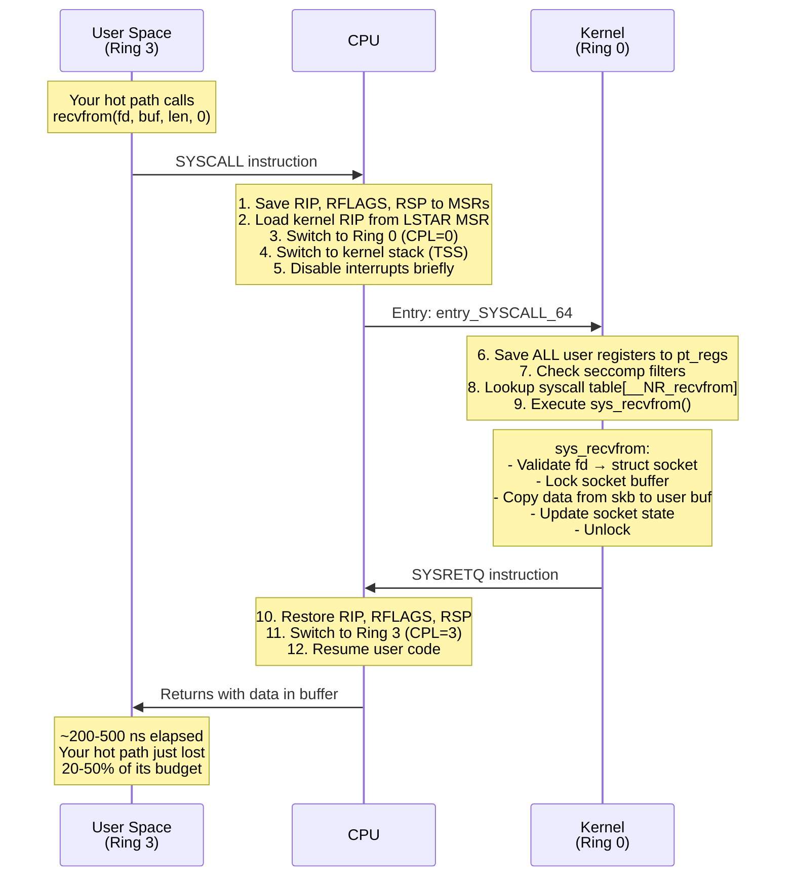
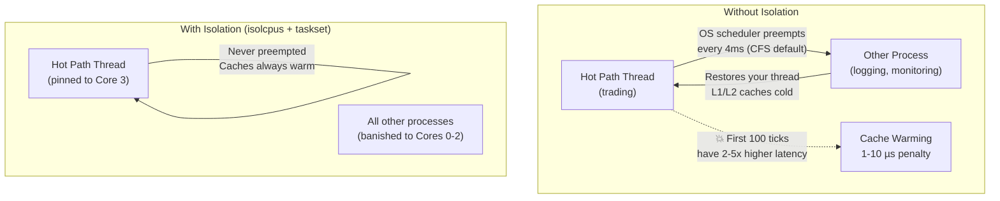

# Chapter 4: The Cost of a Syscall 🟡

> **What you'll learn:**
> - The precise hardware mechanics of a system call: user/kernel mode transitions, TLB flushes, and register saves
> - Why `epoll`, `read()`, and the Linux kernel network stack introduce microseconds of latency
> - The overhead of interrupt handling (IRQ) and how interrupts destroy cache locality
> - How to quantify syscall overhead with `perf`, `strace`, and `bpftrace`

---

## 4.1 What Happens During a System Call

A system call is the mechanism by which user-space code requests a service from the Linux kernel. On x86-64, the `syscall` instruction triggers a hardware-level transition:



### Cost Breakdown

| Component | Cost (cycles @ 3 GHz) | Cost (ns) |
|---|---|---|
| `SYSCALL` instruction | ~30 cycles | ~10 ns |
| Register save (pt_regs) | ~50 cycles | ~17 ns |
| Syscall table lookup + dispatch | ~20 cycles | ~7 ns |
| Kernel function execution (simple) | ~200–1,000 cycles | ~70–330 ns |
| `SYSRETQ` instruction | ~30 cycles | ~10 ns |
| Register restore | ~50 cycles | ~17 ns |
| **Potential TLB flush** (KPTI/Meltdown mitigation) | ~200–500 cycles | ~70–170 ns |
| **Potential L1d/L1i cache pollution** | ~100–500 cycles | ~30–170 ns |
| **Total (fast path, no data)** | ~700–2,500 cycles | **~230–830 ns** |

> **The KPTI tax:** After the Meltdown vulnerability disclosure (2018), Linux enables Kernel Page Table Isolation by default. This means *every* syscall flushes portions of the TLB (Translation Lookaside Buffer), adding ~100–200ns of overhead. On a hardware platform with mitigations, the penalty is even worse. This single mitigation can double the cost of a syscall.

---

## 4.2 The Linux Network Stack: A Tour of Overhead

When you call `recvfrom()` on a UDP socket, here is what the kernel does *before* you see a single byte of market data:

```
    Your call: recvfrom(fd, buf, 4096, 0, NULL, NULL)
    ─────────────────────────────────────────────────
    │
    ├──> sys_recvfrom()
    │    ├──> sockfd_lookup_light(fd)      // fd table lookup
    │    ├──> sock_recvmsg()
    │    │    ├──> security_socket_recvmsg() // LSM (SELinux) hook
    │    │    ├──> udp_recvmsg()
    │    │    │    ├──> __skb_recv_udp()     // dequeue from socket buffer
    │    │    │    │    ├──> spin_lock()     // 💥 LOCK on socket queue
    │    │    │    │    ├──> __skb_try_recv_from_queue()
    │    │    │    │    └──> spin_unlock()
    │    │    │    ├──> skb_copy_datagram_msg()
    │    │    │    │    └──> copy_to_user()  // 💥 COPY: kernel buffer → user buffer
    │    │    │    ├──> sock_recv_timestamp() // timestamp bookkeeping
    │    │    │    └──> skb_free_datagram()  // free the sk_buff
    │    │    │         └──> kfree_skb()     // 💥 ALLOCATION: returns memory to SLAB
    │    │    └──> ...
    │    └──> ...
    └──> return bytes_read

    Hidden costs you DON'T see in the call:
    ─────────────────────────────────────────
    Before recvfrom() returns, the packet had to ARRIVE:
    1. NIC receives packet → DMA to kernel ring buffer (~1-5 µs)
    2. NIC raises hardware interrupt (IRQ)
    3. IRQ handler runs → schedules NAPI softirq
    4. Softirq runs → processes packet through netfilter/iptables
    5. IP layer → UDP layer → socket buffer enqueue
    6. Wake up blocked process (if it was sleeping on epoll/poll)
    7. Context switch back to your process
```

### The Interrupt (IRQ) Problem

When a packet arrives at the NIC, the NIC raises a **hardware interrupt**. This is catastrophic for latency because:

1. **The CPU stops whatever it was doing** — including your hot path code.
2. **L1/L2 caches are polluted** by the interrupt handler code and data.
3. **After the IRQ handler returns**, your code resumes with cold caches and potentially a TLB miss.

```
Timeline of a packet arrival (standard Linux kernel stack):

Time  0.0 µs: Packet arrives at NIC
Time  0.5 µs: NIC DMAs packet to kernel ring buffer
Time  1.0 µs: NIC raises MSI-X interrupt
Time  1.2 µs: CPU receives IRQ, saves state, jumps to handler
Time  1.5 µs: IRQ handler schedules NAPI softirq, returns
Time  1.7 µs: Softirq runs, processes packet through IP/UDP stack
Time  3.0 µs: Packet placed in socket receive buffer
Time  3.2 µs: epoll_wait() returns (your process wakes up)
Time  3.5 µs: Context switch to your process
Time  4.0 µs: recvfrom() copies data to user-space buffer
Time  4.5 µs: Your code finally sees the packet

Total: ~4.5 µs from wire to user-space.
Your hot path budget was 1.5 µs TOTAL.
The kernel just took 3x your entire budget.
```

---

## 4.3 Why `epoll` Is Dead on Arrival

`epoll` is the gold standard for scalable I/O in web servers. It is hopelessly slow for HFT.

| Feature | `epoll` / Standard Kernel | Kernel Bypass (ef_vi/DPDK) |
|---|---|---|
| **Packet arrival notification** | IRQ → softirq → socket → epoll_wait | Direct NIC → user-space poll |
| **Data copy** | Kernel buffer → user buffer (copy_to_user) | Zero-copy (DMA directly to user memory) |
| **System calls per packet** | 2+ (epoll_wait + recvfrom) | 0 (polling, no syscall) |
| **Context switches** | Yes (sleeping → waking) | Never (busy-polling, always awake) |
| **Cache impact** | IRQ handler pollutes L1/L2 | NIC-to-cache, no kernel interference |
| **Latency (wire → user)** | 3–10 µs | 50–200 ns |
| **Tail latency (p99)** | 10–100 µs (scheduler jitter) | < 1 µs (deterministic polling) |

### The `io_uring` Question

`io_uring` (Linux 5.1+) reduces syscall overhead via **submission/completion queues** shared between user space and kernel. It eliminates per-I/O syscalls but still:

- Goes through the kernel network stack (netfilter, IP, UDP layers)
- Requires the packet to be DMA'd into kernel memory first
- Does not bypass IRQ handling

`io_uring` is a significant improvement for general I/O workloads and even high-throughput servers. But for **nanosecond-level HFT**, it still introduces ~1–3µs of overhead compared to true kernel bypass.

| I/O Model | Syscalls/packet | Wire-to-User Latency | Use Case |
|---|---|---|---|
| `read()`/`poll()` | 2 | 5–10 µs | Simple tools, scripts |
| `epoll` | 1–2 | 3–10 µs | Web servers, databases |
| `io_uring` | 0 (amortized) | 1–3 µs | High-throughput I/O, storage |
| Kernel bypass (DPDK/ef_vi) | 0 (never) | 50–200 ns | HFT, telecom, NFV |

---

## 4.4 Quantifying Syscall Overhead: Measurement Tools

### Using `strace` to Count Syscalls

```bash
# Count all syscalls made by your trading process over 10 seconds.
# WARNING: strace adds ~50µs per syscall. Never use on a live hot path.
strace -c -p <pid> -e trace=network sleep 10

# Example output:
# % time     seconds  usecs/call     calls    errors syscall
# ------ ----------- ----------- --------- --------- ----------------
#  45.00    0.090000          90      1000           recvfrom
#  30.00    0.060000          60      1000           sendto
#  20.00    0.040000          40      1000           epoll_wait
#   5.00    0.010000          10      1000           clock_gettime
# ------ ----------- ----------- --------- --------- ----------------
# 100.00    0.200000                  4000           total
#
# 4000 syscalls in 10 seconds = 400 syscalls/sec
# Each recvfrom: 90 µs (with strace overhead)
# Without strace: ~0.5-2 µs each
```

### Using `perf` to Measure Syscall Latency

```bash
# Trace recvfrom latency distribution (requires root or perf_event_paranoid=1)
perf trace -e recvfrom -p <pid> --duration 10 --summary

# Or use perf stat for cycle-level accounting:
perf stat -e cycles,instructions,cache-misses,context-switches \
  -p <pid> sleep 10
```

### Using `bpftrace` for Zero-Overhead Measurement

```bash
# Measure time spent in sys_recvfrom kernel function
# Minimal overhead (~100ns per event) via eBPF
bpftrace -e '
  kprobe:__sys_recvfrom { @start[tid] = nsecs; }
  kretprobe:__sys_recvfrom /@start[tid]/ {
    @recvfrom_ns = hist(nsecs - @start[tid]);
    delete(@start[tid]);
  }
'
# Output: histogram of recvfrom latency in nanoseconds
```

---

## 4.5 The vDSO Escape Hatch

Not all "syscalls" actually enter the kernel. The **vDSO** (virtual Dynamic Shared Object) is a kernel-provided shared library mapped into every process that implements certain syscalls entirely in user space:

| Function | vDSO? | Cost | Notes |
|---|---|---|---|
| `clock_gettime(CLOCK_MONOTONIC)` | ✅ Yes | ~20 ns | Reads kernel-maintained page in user space |
| `clock_gettime(CLOCK_REALTIME)` | ✅ Yes | ~20 ns | Same mechanism |
| `gettimeofday()` | ✅ Yes | ~20 ns | Legacy, prefer clock_gettime |
| `getcpu()` | ✅ Yes | ~5 ns | Reads RDTSCP auxiliary register |
| `time()` | ✅ Yes | ~20 ns | Coarse, second resolution |
| `recvfrom()` | ❌ No | ~500 ns+ | Must enter kernel |
| `sendto()` | ❌ No | ~500 ns+ | Must enter kernel |
| `epoll_wait()` | ❌ No | ~200 ns+ | Must enter kernel |

> **HFT Practice:** Even vDSO `clock_gettime` at ~20ns is expensive if called per-message at 10M msg/sec. That's 200ms/sec of CPU time just for timestamps. This is why production systems use `RDTSC` (~1ns) and calibrate the TSC frequency once at startup.

---

## 4.6 Context Switches: The Hidden Assassin

Even on systems where you avoid explicit syscalls, the OS scheduler can preempt your thread and context-switch to another process. Each context switch costs:

| Component | Cost |
|---|---|
| Save/restore registers | ~50–100 ns |
| TLB flush (process switch) | ~200–500 ns |
| L1/L2 cache warming | ~1–10 µs (data-dependent) |
| **Total** | **~1–10 µs** |

The cache warming cost is the real killer. After a context switch, your hot data — the order book, the strategy parameters, the ring buffer pointers — is no longer in L1/L2 cache. You pay L3 or even DRAM access costs for the first few hundred nanoseconds of execution.



**The fix:** Isolate CPU cores from the scheduler using `isolcpus` kernel boot parameter and pin your hot path thread using `taskset` or `sched_setaffinity()`. This is covered in detail in Chapter 7.

---

<details>
<summary><strong>🏋️ Exercise: Measure and Eliminate Syscalls</strong> (click to expand)</summary>

You have a prototype market data handler that uses standard Linux UDP sockets:

```rust
use std::net::UdpSocket;

fn main() {
    let socket = UdpSocket::bind("0.0.0.0:12345").unwrap();
    let mut buf = [0u8; 2048];
    let mut count: u64 = 0;

    loop {
        let (n, _src) = socket.recv_from(&mut buf).unwrap();
        // Process message...
        count += 1;
        if count % 1_000_000 == 0 {
            println!("Processed {} messages", count); // 💥
        }
    }
}
```

**Tasks:**

1. List every system call made per received packet in this code.
2. Identify one syscall that's hidden inside `println!`.
3. If the system processes 1M packets/sec and each `recv_from` takes 500ns in kernel time, what percentage of CPU time is spent in the kernel?
4. Redesign this loop to eliminate all syscalls. Describe (pseudocode or prose) what replaces each one.

<details>
<summary>🔑 Solution</summary>

**1. Syscalls per packet:**

| Syscall | Source | Per-Packet? |
|---|---|---|
| `recvfrom()` | `socket.recv_from()` | Every packet |
| `write()` | `println!` (to stdout) | Every 1M packets |
| `clock_gettime()` | Possibly inside Rust's `Instant::now()` if used | — |

Primary offender: **`recvfrom()`** — called once per packet.

**2. Hidden syscall in `println!`:**

`println!` calls `write(1, buf, len)` — a syscall to write to file descriptor 1 (stdout). If stdout is a terminal, this can block for **10–100µs** (terminal rendering). Even if stdout is piped, it's ~1µs per write syscall.

Additionally, `format!` inside `println!` performs **heap allocation** for the formatted string.

**3. CPU time in kernel:**

- 1,000,000 packets/sec × 500ns per `recvfrom` = 500,000,000 ns/sec = **500ms/sec**
- That's **50% of one CPU core** spent entirely in kernel code.
- Your strategy logic gets the other 50% — but with constant cache pollution from kernel execution.

**4. Redesign without syscalls:**

```
BEFORE → AFTER:

recv_from() → Kernel bypass (ef_vi/DPDK) polling.
              The NIC DMAs packets directly into a user-space
              ring buffer. We poll the ring buffer head pointer.
              No syscall. No kernel involvement.

println!()  → Write to a lock-free SPSC ring buffer.
              A separate logging thread (on a different core)
              reads from the ring buffer and writes to disk.
              No syscall on the hot path.

Pseudocode:
    loop {
        if let Some(pkt) = nic.poll_rx() {    // ✅ No syscall
            let msg = decode(pkt.payload());   // ✅ Zero-copy
            book.update(msg);                  // ✅ Array-indexed
            count += 1;
            if count % 1_000_000 == 0 {
                log_ring.push(count);          // ✅ Lock-free ring buffer
            }
        }
        // No else: just spin. This core does nothing but poll.
        // CPU usage: 100%. By design.
    }
```

**Key insight:** The hot-path thread consumes 100% of its core at all times. This is intentional — it's cheaper to dedicate a core to busy-polling than to pay the cost of a single context switch or interrupt.

</details>
</details>

---

> **Key Takeaways**
>
> - A system call costs **200–1,000ns** due to ring transitions, register saves, potential TLB flushes (KPTI), and cache pollution.
> - The Linux kernel network stack adds **3–5µs** per packet: IRQ handling, softirq processing, protocol stack traversal, and data copying.
> - **`epoll` is too slow for HFT.** It still goes through the full kernel stack. `io_uring` reduces overhead but doesn't eliminate it.
> - **Context switches** cost 1–10µs due to cache warming — the scheduler is the enemy of latency.
> - Use `strace -c`, `perf trace`, and `bpftrace` to quantify syscall overhead — but never profile a live trading hot path with `strace`.
> - The only way to achieve sub-microsecond latency is to **eliminate the kernel entirely** from the data path — which leads us to Chapter 5.

---

> **See also:**
> - [Chapter 5: Kernel Bypass Networking](ch05-kernel-bypass-networking.md) — The solution to everything in this chapter
> - [Chapter 7: NUMA and CPU Pinning](ch07-numa-and-cpu-pinning.md) — Isolating cores to prevent context switches
> - [Zero-Copy Architecture, io_uring](../zero-copy-book/src/SUMMARY.md) — io_uring as a middle ground
