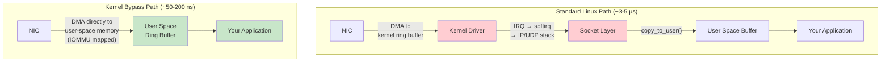
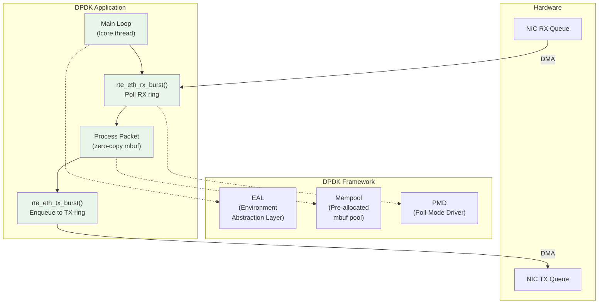

# Chapter 5: Kernel Bypass Networking 🔴

> **What you'll learn:**
> - How kernel bypass reads packets directly from the NIC into user-space memory, eliminating the entire Linux network stack
> - The three major kernel bypass technologies: DPDK, Solarflare ef_vi, and XDP
> - The DMA and ring buffer mechanics that make zero-copy packet processing possible
> - How to design a feed handler that processes 10M+ packets/sec with sub-200ns per-packet latency

---

## 5.1 The Fundamental Insight: Cut Out the Middle Man

In Chapter 4, we measured the Linux kernel network stack at 3–5µs per packet. The kernel provides:

1. **IRQ handling** — notifying the CPU that a packet arrived
2. **Protocol processing** — IP header validation, UDP checksum, netfilter rules
3. **Socket buffering** — enqueuing the packet in a socket receive buffer
4. **Data copy** — `copy_to_user()` from kernel buffer to your buffer

For an HFT feed handler, **none of this is needed.** You know the exact packet format (ITCH/SBE). You know the source IP and port. You don't need netfilter. You don't need socket abstraction. You just need the raw bytes from the NIC, as fast as physically possible.

Kernel bypass gives you exactly this: the NIC DMAs packets directly into memory that your user-space process can read. No kernel involvement. No interrupts. No copies.



---

## 5.2 How DMA and Ring Buffers Work

### Direct Memory Access (DMA)

The NIC has a **DMA engine** — a hardware component that can read from and write to main memory without CPU involvement. When a packet arrives:

1. The NIC's DMA engine reads a **descriptor** from a ring buffer in memory. The descriptor tells the NIC *where* to write the packet data.
2. The NIC DMAs the packet payload into the memory address specified by the descriptor.
3. The NIC updates the descriptor's **completion flag** (or advances a head pointer).
4. The application polls the completion flag and reads the packet.

```
    ┌────────────────── NIC Hardware ──────────────────┐
    │                                                   │
    │   Packet arrives on wire (10GbE)                 │
    │   ├──> MAC filter (is this packet for us?)       │
    │   ├──> RSS hash (which RX queue?)                │
    │   ├──> Read RX descriptor from ring buffer       │
    │   │    (descriptor contains user-space VA → PA)  │
    │   ├──> DMA packet data to described address      │
    │   └──> Write completion to descriptor ring       │
    │                                                   │
    └──────────────────────────────────────────────────┘
          │
          │  DMA writes directly to user-space memory
          │  (via IOMMU translation)
          ▼
    ┌──────────────── User Space ──────────────────────┐
    │                                                   │
    │   RX Ring Buffer (pre-allocated at startup):     │
    │   ┌────┬────┬────┬────┬────┬────┬────┬────┐     │
    │   │pkt0│pkt1│pkt2│****│    │    │    │    │     │
    │   └────┴────┴────┴────┴────┴────┴────┴────┘     │
    │    done done done ^^^^                            │
    │                   NIC just wrote this one         │
    │                                                   │
    │   Application polls: "Is slot 3 complete?"       │
    │   → Yes! Process packet. Advance read pointer.   │
    │                                                   │
    └──────────────────────────────────────────────────┘
```

### The IOMMU

For the NIC to DMA directly into user-space memory, we need the **IOMMU** (I/O Memory Management Unit, also called VT-d on Intel). The IOMMU translates I/O virtual addresses (used by the NIC) to physical addresses, with permission checks. This is what makes kernel bypass safe: the NIC can only write to memory regions explicitly mapped for it.

---

## 5.3 Solarflare ef_vi: The HFT Standard

**Solarflare** (now AMD/Xilinx) NICs are the de facto standard in HFT co-location facilities. Their proprietary **`ef_vi`** library provides the lowest-latency kernel bypass available on commodity hardware.

### Why Solarflare Dominates HFT

| Feature | Solarflare ef_vi | Mellanox/NVIDIA ConnectX (DPDK) |
|---|---|---|
| **Wire-to-user latency** | ~500 ns (typical) | ~800–1,200 ns |
| **Minimum latency** | ~200 ns (hardware timestamped) | ~400 ns |
| **Jitter (p99-p50)** | ~100–200 ns | ~500–1,000 ns |
| **CPU overhead per packet** | ~50–100 ns | ~100–200 ns |
| **Hardware timestamps** | Yes (NIC-stamped, sub-ns resolution) | Yes |
| **Kernel bypass library** | ef_vi (proprietary, C API) | DPDK (open-source, C API) |
| **Onload acceleration** | Yes (transparent socket acceleration) | No |
| **Market share in HFT** | ~60–70% of co-lo racks | ~20–30% |

### ef_vi Architecture

```rust
// Pseudocode: ef_vi feed handler initialization and hot loop.
// In practice, this is C code calling the ef_vi C API,
// wrapped in a Rust FFI layer.

/// Initialization (cold path — runs once at startup)
fn init_ef_vi() -> EfViHandle {
    // 1. Open the Solarflare NIC driver
    let driver = ef_driver_open();

    // 2. Allocate a protection domain (IOMMU mapping context)
    let pd = ef_pd_alloc(&driver, /*ifindex=*/ 0, EF_PD_DEFAULT);

    // 3. Allocate a virtual interface (NIC RX/TX queue pair)
    let vi = ef_vi_alloc_from_pd(
        &driver, &pd,
        /*evq_capacity=*/ 4096,  // event queue slots
        /*rxq_capacity=*/ 4096,  // RX descriptor ring size
        /*txq_capacity=*/ 2048,  // TX descriptor ring size
        EF_VI_FLAGS_DEFAULT,
    );

    // 4. Allocate DMA-mapped memory for packet buffers
    let pkt_bufs = ef_memreg_alloc(
        &driver, &pd,
        /*size=*/ 4096 * 2048,  // 4096 buffers × 2048 bytes each
    );

    // 5. Push empty buffer descriptors into the RX ring
    // (Tell the NIC where to DMA incoming packets)
    for i in 0..4096 {
        ef_vi_receive_init(&vi, pkt_bufs.dma_addr(i), /*id=*/ i);
    }
    ef_vi_receive_push(&vi); // commit descriptors to NIC

    // 6. Set up multicast filter
    // (Tell NIC to deliver packets for this multicast group)
    ef_filter_spec_set_ip4_local(
        &filter, IPPROTO_UDP,
        "224.0.100.1".parse(), // multicast group
        12345,                  // port
    );
    ef_vi_filter_add(&vi, &driver, &filter);

    EfViHandle { driver, pd, vi, pkt_bufs }
}

/// Hot loop (runs forever on an isolated core)
fn hot_loop(handle: &mut EfViHandle) -> ! {
    let mut events = [EfEvent::default(); 64]; // stack-allocated event batch

    loop {
        // ✅ Poll for completed RX events. NO SYSCALL.
        // This reads the NIC's event queue doorbell register
        // via memory-mapped I/O.
        let n = ef_eventq_poll(&handle.vi, &mut events);

        for i in 0..n {
            match events[i].event_type() {
                EF_EVENT_TYPE_RX => {
                    let buf_id = events[i].rx_buf_id();
                    let pkt = handle.pkt_bufs.get(buf_id);

                    // ✅ Zero-copy access to packet payload.
                    // `pkt` points directly to the DMA'd memory.
                    // No copy. No kernel. No allocation.
                    let payload = &pkt[42..]; // skip Ethernet(14)+IP(20)+UDP(8) headers

                    process_market_data(payload); // your hot path

                    // ✅ Return buffer to NIC for reuse
                    ef_vi_receive_init(&handle.vi, pkt.dma_addr(), buf_id);
                }
                EF_EVENT_TYPE_TX => {
                    // TX completion — buffer can be reused
                }
                _ => {}
            }
        }

        // ✅ Push any refilled RX descriptors to the NIC
        if n > 0 {
            ef_vi_receive_push(&handle.vi);
        }

        // No sleep. No yield. No syscall. Busy-poll forever.
    }
}
```

---

## 5.4 DPDK: The Open-Source Alternative

The **Data Plane Development Kit (DPDK)** is an open-source, vendor-neutral kernel bypass framework originally developed by Intel. It supports NICs from Intel, Mellanox/NVIDIA, Broadcom, and others.

### DPDK Architecture



### DPDK vs. ef_vi Comparison

| Aspect | DPDK | Solarflare ef_vi |
|---|---|---|
| **License** | BSD open-source | Proprietary (NIC-bundled) |
| **NIC support** | Multi-vendor (Intel, Mellanox, ...) | Solarflare NICs only |
| **API style** | Batch-oriented (`rx_burst`/`tx_burst`) | Event-driven (event queue) |
| **Memory model** | mbuf pools (pre-allocated) | User-managed DMA buffers |
| **Hugepages** | Required (2MB or 1GB) | Optional but recommended |
| **IOMMU** | Supported (VFIO) | Supported |
| **Community** | Large, active | Small, specialized |
| **Latency** | ~800–1,200 ns (NIC-dependent) | ~200–500 ns (Solarflare HW advantage) |
| **Use in HFT** | Second choice, growing | First choice, dominant |

### DPDK: Initialization Skeleton

```c
// DPDK initialization (C code — typically wrapped via FFI in Rust)
// This runs once at startup.

int main(int argc, char **argv) {
    // 1. Initialize the Environment Abstraction Layer
    //    - Claims hugepage memory
    //    - Binds NICs to VFIO/UIO driver (removing from kernel)
    //    - Sets up per-core thread affinity
    rte_eal_init(argc, argv);

    // 2. Create a memory pool for packet buffers
    //    ✅ Pre-allocate all mbufs at startup. No malloc later.
    struct rte_mempool *mbuf_pool = rte_pktmbuf_pool_create(
        "MBUF_POOL",
        8192,          // number of mbufs
        256,           // cache size per core
        0,             // private data size
        RTE_MBUF_DEFAULT_BUF_SIZE,
        rte_socket_id()  // ✅ NUMA-local allocation
    );

    // 3. Configure the NIC port
    struct rte_eth_conf port_conf = {
        .rxmode = { .mq_mode = RTE_ETH_MQ_RX_RSS },  // RSS for multi-queue
    };
    rte_eth_dev_configure(port_id, 1, 1, &port_conf);

    // 4. Set up RX and TX queues
    rte_eth_rx_queue_setup(port_id, 0, 1024, rte_socket_id(), NULL, mbuf_pool);
    rte_eth_tx_queue_setup(port_id, 0, 1024, rte_socket_id(), NULL);

    // 5. Start the NIC
    rte_eth_dev_start(port_id);

    // 6. Enter the hot loop (never returns)
    hot_loop(port_id, mbuf_pool);
}

// ✅ DPDK hot loop — batch-oriented polling
void hot_loop(uint16_t port_id, struct rte_mempool *pool) {
    struct rte_mbuf *bufs[32];  // batch of up to 32 packets

    for (;;) {
        // ✅ Poll for received packets. NO SYSCALL.
        // Returns 0-32 packets in a single call.
        uint16_t nb_rx = rte_eth_rx_burst(port_id, 0, bufs, 32);

        for (uint16_t i = 0; i < nb_rx; i++) {
            // ✅ Zero-copy access to packet data
            uint8_t *payload = rte_pktmbuf_mtod(bufs[i], uint8_t *);
            payload += 42; // skip Eth+IP+UDP headers

            process_market_data(payload);

            // ✅ Return mbuf to pool (no free, just pointer return)
            rte_pktmbuf_free(bufs[i]);
        }
    }
}
```

---

## 5.5 XDP: Kernel-Adjacent Fast Path

**XDP (eXpress Data Path)** is a Linux kernel feature that allows you to run eBPF programs at the NIC driver level, *before* the packet enters the regular kernel network stack. It's not true kernel bypass (the program runs in kernel context), but it's significantly faster than the standard path.

| Feature | XDP | DPDK | ef_vi |
|---|---|---|---|
| **Runs in** | Kernel (eBPF VM) | User space | User space |
| **Language** | C (compiled to eBPF bytecode) | C/Rust | C/Rust (via FFI) |
| **Syscalls** | None (BPF program is event-driven) | None (polling) | None (polling) |
| **NIC ownership** | Shared with kernel | Exclusive (NIC unbound from kernel) | Exclusive |
| **Latency** | ~1–3 µs | ~800–1,200 ns | ~200–500 ns |
| **Use case** | Packet filtering, DDoS mitigation, load balancing | Telecom, HFT | HFT |
| **Complexity** | Low–Medium | High | High |
| **Kernel required?** | Yes (≥ 4.8) | No (runs in user space) | No (runs in user space) |

XDP is excellent for **pre-filtering** — dropping unwanted packets at line rate before they consume CPU cycles in your DPDK/ef_vi hot path.

---

## 5.6 Putting It Together: Feed Handler Architecture

A production HFT feed handler combines kernel bypass with the pipeline from Chapter 3:

```
    ┌──────────────────────────────────────────────────────────────────┐
    │                 Co-Location Server (CME Aurora)                  │
    │                                                                  │
    │  ┌──────────┐    ┌──────────┐                                   │
    │  │ NIC 0    │    │ NIC 1    │   Dual-NIC for A/B feed lines    │
    │  │(ef_vi)   │    │(ef_vi)   │   (Chapter 6: redundancy)        │
    │  └────┬─────┘    └────┬─────┘                                   │
    │       │               │                                          │
    │       ▼               ▼                                          │
    │  ┌─────────────────────────────────┐                            │
    │  │    Feed Handler Thread          │  Pinned to Core 2         │
    │  │    (isolated, busy-poll)        │  NUMA Node 0              │
    │  │                                 │                            │
    │  │  1. ef_vi_poll(nic0) → packets  │  ~50 ns                   │
    │  │  2. ef_vi_poll(nic1) → packets  │  ~50 ns                   │
    │  │  3. A/B arbitrate (seq nums)    │  ~10 ns                   │
    │  │  4. Decode ITCH/SBE binary      │  ~15 ns                   │
    │  │  5. Write to SPSC ring buffer   │  ~10 ns                   │
    │  └─────────────┬───────────────────┘                            │
    │                │ SPSC Ring Buffer (lock-free)                    │
    │                ▼                                                 │
    │  ┌─────────────────────────────────┐                            │
    │  │    Strategy Thread              │  Pinned to Core 3         │
    │  │    (isolated, busy-poll)        │  NUMA Node 0              │
    │  │                                 │                            │
    │  │  1. Read from ring buffer       │  ~5 ns                    │
    │  │  2. Update order book           │  ~30 ns                   │
    │  │  3. Evaluate signal             │  ~100 ns                  │
    │  │  4. Risk check                  │  ~30 ns                   │
    │  │  5. Build + send order (ef_vi)  │  ~80 ns                   │
    │  └─────────────────────────────────┘                            │
    │                                                                  │
    └──────────────────────────────────────────────────────────────────┘
```

---

## 5.7 The Hugepage Requirement

Kernel bypass libraries require **hugepages** (2 MB or 1 GB) for DMA buffer allocation. Standard 4 KB pages are too small — the NIC would need millions of IOMMU page table entries for a reasonable buffer pool, and TLB misses would dominate.

```bash
# Reserve 1024 hugepages of 2MB each (2GB total) at boot
# Add to /etc/default/grub:
GRUB_CMDLINE_LINUX="hugepages=1024 hugepagesz=2M"

# Or at runtime:
echo 1024 > /proc/sys/vm/nr_hugepages

# For 1GB hugepages (requires boot-time reservation):
GRUB_CMDLINE_LINUX="hugepagesz=1G hugepages=4 default_hugepagesz=1G"
```

| Page Size | TLB Entries (typical) | Coverage | TLB Miss Rate |
|---|---|---|---|
| 4 KB | ~1,024 | 4 MB | High for large datasets |
| 2 MB | ~32 | 64 MB | Low |
| 1 GB | ~4 | 4 GB | Near-zero |

> **HFT Practice:** Always use 1 GB hugepages for packet buffer pools and order book arrays. The TLB coverage ensures that every memory access in the hot path hits the TLB, avoiding the ~10–50ns penalty of a page table walk.

---

<details>
<summary><strong>🏋️ Exercise: Design a Kernel-Bypass Feed Handler</strong> (click to expand)</summary>

You are building a feed handler for NYSE Arca (XDP protocol), which sends market data via UDP Multicast at a peak rate of 5 million messages per second. Each message is 40–80 bytes.

Your hardware:
- NIC: Solarflare X2522 (ef_vi)
- CPU: Intel Xeon Gold 6348 @ 2.6 GHz, 28 cores, 2 sockets
- Memory: 256 GB DDR4-3200, 1 GB hugepages

**Tasks:**

1. Calculate the bandwidth requirement (bytes/sec) at peak rate.
2. How many RX ring buffer slots do you need if you want to absorb a 100µs burst without dropping packets?
3. Design the memory layout: how many hugepages, how large is the packet buffer pool, and where (which NUMA node) should it be allocated?
4. Your feed handler thread must poll two NIC queues (A-line and B-line). Should they be on the same core or different cores? Justify.

<details>
<summary>🔑 Solution</summary>

**1. Bandwidth calculation:**

- Peak rate: 5M messages/sec
- Average message size: 60 bytes (midpoint of 40–80)
- UDP/IP overhead: 42 bytes (Ethernet=14, IP=20, UDP=8)
- Total per-packet wire size: 60 + 42 = 102 bytes
- Plus Ethernet preamble (8), IFG (12): 102 + 20 = 122 bytes
- **Bandwidth: 5M × 122 B = 610 MB/s ≈ 4.88 Gbps**
- This fits comfortably within a single 10GbE link.

**2. Ring buffer sizing:**

- Peak rate: 5M msg/sec = 5,000 msg/ms = 500 msg per 100µs
- We need to absorb 100µs of burst → **500 slots minimum**
- Standard practice: 4× headroom → **2,048 slots** (power of 2)
- Each slot holds one packet: 2048 bytes max MTU → pool = 2048 × 2048 = 4 MB
- For A+B lines: 2 × 2,048 = 4,096 slots total → **8 MB**

**3. Memory layout:**

- Packet buffer pool: 8 MB (fits in 1 × 2MB hugepage per NIC queue, or 1 × 1GB hugepage for everything)
- Order book: ~65,536 price levels × ~1 KB each = ~64 MB
- Strategy parameters: < 1 MB
- **Total: ~73 MB → 1 × 1GB hugepage** (with room to spare)
- **NUMA allocation: Node 0**, same node as the NIC's PCIe slot
- Verify with: `cat /sys/class/net/ens1f0/device/numa_node`

**4. Same core or different cores?**

**Same core.** Reasons:

1. **Cache sharing:** Both A-line and B-line packets update the same order book data structures. If they're on the same core, the order book stays in L1 cache. If on different cores, every update requires a cache-line transfer (~40ns).
2. **A/B arbitration:** You need to compare sequence numbers from both lines to determine which packet arrived first. This comparison is trivial if both lines are read in the same polling loop.
3. **Latency:** Polling two ef_vi handles in a single loop adds ~50ns per additional poll, but avoids the ~100ns+ inter-core communication cost.
4. **Throughput check:** 5M msg/sec × 2 lines = 10M polls/sec. At ~100ns per poll, that's 1 second of CPU time per second — 100% of one core. This is expected and acceptable.

```
// Polling pattern:
loop {
    let a_pkts = ef_vi_poll(&nic_a);  // A-line
    let b_pkts = ef_vi_poll(&nic_b);  // B-line
    let merged = arbitrate(a_pkts, b_pkts); // sequence number merge
    for pkt in merged {
        process(pkt); // decode + write to ring buffer
    }
}
```

</details>
</details>

---

> **Key Takeaways**
>
> - **Kernel bypass** eliminates the entire Linux network stack, reducing wire-to-user latency from ~3–5µs to **50–200ns**.
> - The **NIC DMAs packets directly** into user-space memory via IOMMU-mapped ring buffers. No interrupts, no copies, no syscalls.
> - **Solarflare ef_vi** is the dominant technology in HFT co-location (~200–500ns). **DPDK** is the open-source alternative (~800–1,200ns).
> - **XDP** is kernel-adjacent (eBPF at the driver level) — useful for filtering but not fast enough for the hot path.
> - Kernel bypass requires **hugepages** (2MB or 1GB) to ensure TLB coverage for DMA buffer pools.
> - The hot path thread **busy-polls** the NIC at 100% CPU utilization. This is by design — the cost of a single sleep/wake cycle exceeds the cost of continuous polling.

---

> **See also:**
> - [Chapter 4: The Cost of a Syscall](ch04-cost-of-a-syscall.md) — Why we need kernel bypass in the first place
> - [Chapter 6: UDP Multicast vs. TCP](ch06-udp-multicast-vs-tcp.md) — How market data is distributed over UDP Multicast
> - [Chapter 7: NUMA and CPU Pinning](ch07-numa-and-cpu-pinning.md) — Placing the feed handler thread on the right CPU core
> - [Unsafe Rust & FFI](../unsafe-ffi-book/src/SUMMARY.md) — Wrapping C libraries (ef_vi, DPDK) in safe Rust
