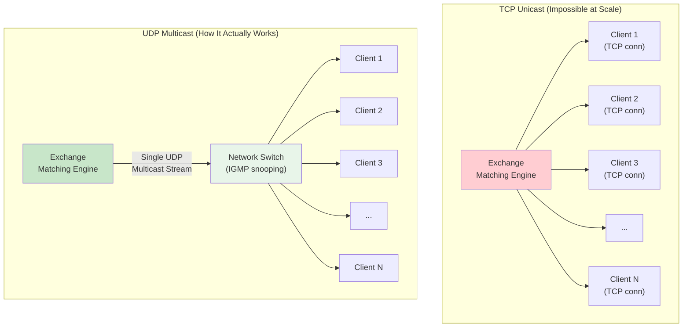
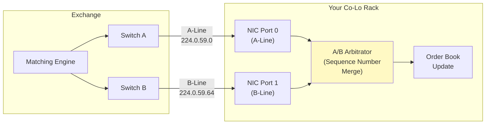
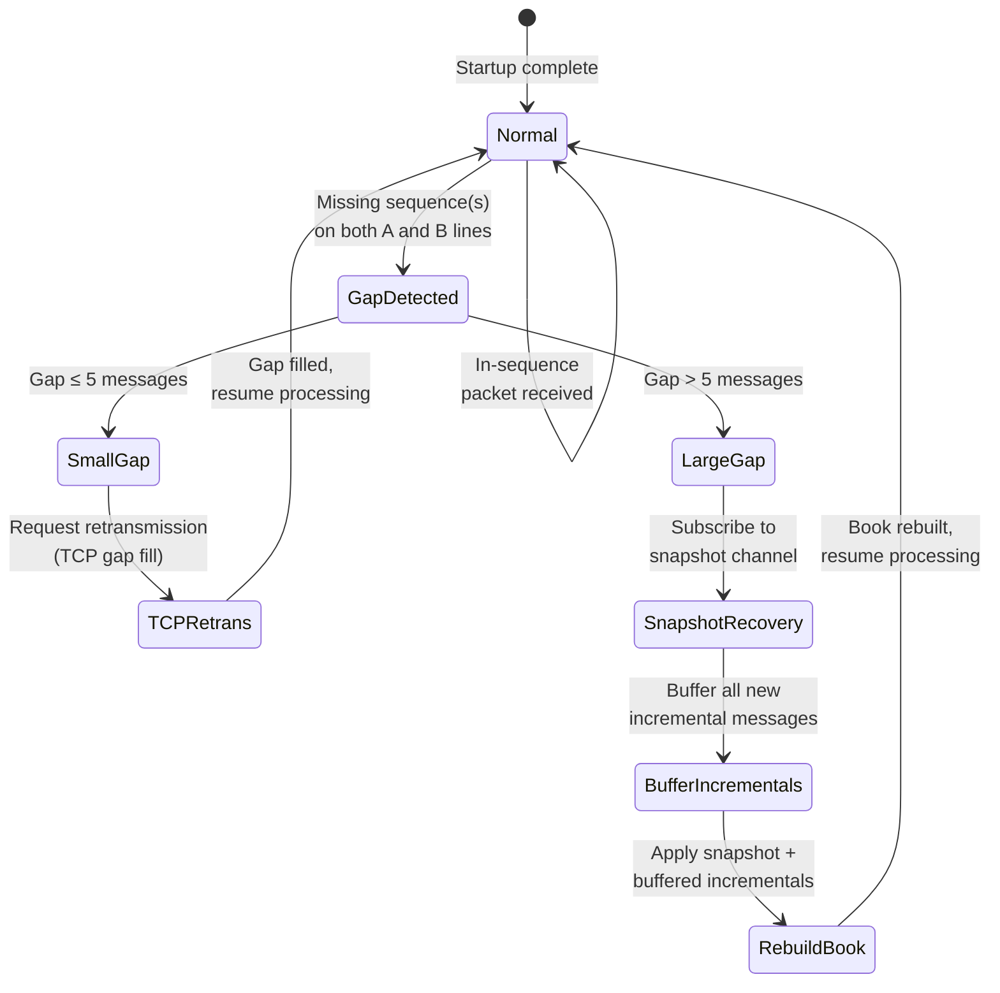

# Chapter 6: UDP Multicast vs. TCP 🔴

> **What you'll learn:**
> - How exchanges broadcast market data to thousands of participants simultaneously using UDP Multicast and IGMP
> - Why TCP's head-of-line blocking and retransmission make it unsuitable for real-time market data
> - A/B line arbitration: how to handle packet drops without TCP, using dual redundant feeds and sequence number tracking
> - Gap detection, gap fill requests, and snapshot recovery when you fall behind

---

## 6.1 The Broadcast Problem

An exchange like Nasdaq generates a continuous stream of market data events — order adds, cancels, executions, trades — for thousands of instruments. This data must be delivered to **hundreds or thousands of co-located participants** simultaneously.

**TCP cannot do this efficiently.**

| Delivery Model | TCP Unicast | UDP Multicast |
|---|---|---|
| **Connections** | 1 per subscriber (N connections) | 1 stream for all subscribers |
| **Exchange CPU** | O(N) — copy + send per client | O(1) — send once, NIC replicates |
| **Exchange bandwidth** | O(N × data rate) | O(data rate) |
| **Retransmission** | Per-client, blocking | None (handled by subscriber) |
| **Latency fairness** | Unequal (first-sent gets it first) | Equal (all receive same multicast packet) |
| **Packet ordering** | Guaranteed (TCP sequence numbers) | Not guaranteed (UDP is best-effort) |

For 1,000 subscribers and 5M messages/sec at 100 bytes each:
- **TCP:** Exchange must maintain 1,000 TCP connections, each sending 500 MB/s = **500 GB/s total bandwidth**. Impossible.
- **UDP Multicast:** Exchange sends 500 MB/s once. Network switches replicate to all subscribers. **500 MB/s total bandwidth.** Trivial.



---

## 6.2 UDP Multicast Mechanics

### Multicast IP Addresses

Multicast uses IPv4 addresses in the **Class D range** (224.0.0.0 – 239.255.255.255). Each exchange feed is assigned a specific multicast group:

| Exchange | Feed | Multicast Group (example) | Port |
|---|---|---|---|
| Nasdaq ITCH | Full book | 224.0.59.0 – 224.0.59.63 | 26400–26463 |
| CME MDP 3.0 | Incremental | 224.0.31.0 – 224.0.31.31 | 14310–14341 |
| CME MDP 3.0 | Snapshot | 224.0.32.0 – 224.0.32.31 | 15310–15341 |
| NYSE Arca | XDP | 224.0.59.128 – 224.0.59.191 | 11000–11063 |

### IGMP: Joining a Multicast Group

To receive multicast traffic, your server sends an **IGMP (Internet Group Management Protocol)** join message to the network switch. The switch then forwards multicast packets for that group to your port.

```
Your Server → Switch: IGMP Membership Report
  "I want to receive packets for group 224.0.59.0"

Switch adds your port to its multicast forwarding table.
All packets destined for 224.0.59.0 are now copied to your port.

When you leave: IGMP Leave Group message.
Switch removes your port from the forwarding table.
```

### With Kernel Bypass

In an ef_vi/DPDK setup, the IGMP join is handled differently — you program a **multicast filter directly on the NIC** hardware:

```rust
// ef_vi: program NIC hardware filter for multicast group
let mut filter = EfFilterSpec::new();
filter.set_ip4_local(
    IPPROTO_UDP,
    "224.0.59.0".parse().unwrap(),  // multicast group
    26400,                            // port
);
nic.add_filter(&filter); // ✅ NIC hardware delivers matching packets to our RX queue
```

The NIC itself filters packets in hardware — non-matching multicast traffic never reaches CPU memory.

---

## 6.3 The Packet Drop Problem

UDP is **best-effort**. Packets can be dropped due to:

1. **NIC ring buffer overflow** — you're not polling fast enough, and the NIC's RX ring fills up.
2. **Network switch buffer overflow** — during extreme burst periods.
3. **Transient hardware errors** — CRC errors, electrical interference.

In TCP, dropped packets trigger retransmission. In UDP, they're simply **gone**. Your order book replica is now **incorrect** — you missed an event, and your state diverged from the exchange's true state.

> **HFT Reality:** A single missed packet can mean your order book shows a bid at 4502.00 when the real bid has moved to 4501.75. Your strategy, seeing the stale bid, might send an order that gets adversely filled at a worse price. One dropped packet → one bad trade → potentially thousands of dollars lost.

---

## 6.4 A/B Line Arbitration

To handle UDP packet loss, exchanges publish **two identical copies** of every market data stream on separate network paths:

- **A-line:** Primary feed, multicast group 224.0.59.0
- **B-line:** Redundant copy, multicast group 224.0.59.64

Both streams carry the **same messages with the same sequence numbers**, but they travel through different network switches and fiber paths. If you miss sequence number 12345 on the A-line, you'll likely receive it on the B-line.



### The Arbitration Algorithm

The A/B arbitrator maintains:
- `next_expected_seq: u64` — the next sequence number we expect to process
- A small **reorder buffer** for handling out-of-order delivery between the two lines

```rust
struct ABArbitrator {
    next_expected_seq: u64,
    // Ring buffer for out-of-order packets (typically tiny: 8-32 slots)
    reorder_buf: [Option<PacketRef>; 32],
}

impl ABArbitrator {
    /// Process a packet from either A or B line.
    /// Returns `Some(packet)` if this is the next in-sequence packet,
    /// or `None` if it's a duplicate or future packet (buffered).
    #[inline(always)]
    fn ingest(&mut self, seq: u64, pkt: PacketRef) -> Option<PacketRef> {
        if seq == self.next_expected_seq {
            // ✅ This is the next in-sequence packet. Deliver it.
            self.next_expected_seq += 1;
            // Check if buffered packets can now be delivered
            self.drain_reorder_buffer();
            Some(pkt)
        } else if seq < self.next_expected_seq {
            // ✅ Duplicate (already delivered from the other line). Drop.
            None
        } else if seq < self.next_expected_seq + 32 {
            // Future packet — buffer it for later delivery
            let slot = (seq % 32) as usize;
            self.reorder_buf[slot] = Some(pkt);
            None
        } else {
            // ✅ Sequence gap too large — trigger gap recovery
            self.trigger_gap_recovery(self.next_expected_seq, seq);
            None
        }
    }

    fn drain_reorder_buffer(&mut self) {
        loop {
            let slot = (self.next_expected_seq % 32) as usize;
            match self.reorder_buf[slot].take() {
                Some(pkt) => {
                    self.deliver(pkt);
                    self.next_expected_seq += 1;
                }
                None => break,
            }
        }
    }
}
```

### A/B Arbitration Scenarios

| Scenario | A-Line | B-Line | Action |
|---|---|---|---|
| **Normal** | seq=100 arrives first | seq=100 arrives second | Deliver from A, drop B duplicate |
| **A-Line drop** | seq=100 missing | seq=100 arrives | Deliver from B |
| **Both arrive, B first** | seq=100 arrives second | seq=100 arrives first | Deliver from B, drop A duplicate |
| **Both drop** | seq=100 missing | seq=100 missing | Gap detected → recovery |
| **Burst reorder** | seq=101 before 100 | seq=100 arrives | Buffer 101, deliver 100, then 101 |

---

## 6.5 Gap Detection and Recovery

When you detect a sequence gap (missing packets on both A and B lines), you have two recovery options:

### Option 1: Gap Fill Request (TCP Retransmission)

Most exchanges offer a **TCP-based retransmission service**. You send a request for the missing sequence range, and the exchange replays those messages over TCP.

```
Your Server → Exchange Retransmission Server (TCP):
  "Please resend sequences 12345–12350 for channel 5"

Exchange → Your Server (TCP):
  [seq=12345] [seq=12346] [seq=12347] [seq=12348] [seq=12349] [seq=12350]
```

**The problem:** This takes **10–100µs** for the TCP round-trip. During that time, your strategy is running on a stale book. Most firms tolerate this for small gaps (1–5 messages).

### Option 2: Snapshot Recovery (Full Book Rebuild)

For large gaps, exchanges publish periodic **snapshot messages** on a separate multicast channel. A snapshot contains the complete state of the order book at a specific sequence number.

```
Snapshot Channel (224.0.32.0):
  Every ~1 second:
    "Snapshot for AAPL as of sequence 1,234,567:
     Bid 150.25 × 500, Bid 150.24 × 300, ...
     Ask 150.26 × 200, Ask 150.27 × 450, ..."

Recovery procedure:
  1. Subscribe to snapshot channel
  2. Receive full book snapshot (seq = S)
  3. Buffer all incremental messages with seq > S
  4. Apply buffered messages to snapshot
  5. Resume normal processing
```



---

## 6.6 TCP for Order Entry: Why It's Acceptable

While market data uses UDP Multicast (one → many), order entry uses TCP (one → one). This seems contradictory — why tolerate TCP's overhead for orders?

| Factor | Market Data | Order Entry |
|---|---|---|
| **Direction** | Exchange → many subscribers | Your server → exchange |
| **Rate** | 5–25M messages/sec | 100–10,000 orders/sec |
| **Latency budget** | ~100ns per message | ~1–5µs per order |
| **Loss tolerance** | Zero (must rebuild book) | Zero (must know order status) |
| **Delivery guarantee** | Not needed (UDP + A/B + recovery) | Required (TCP ack guarantees delivery) |
| **Bandwidth** | 500 MB/s+ | < 1 MB/s |

Order entry rates are **3–5 orders of magnitude lower** than market data rates. The TCP overhead (~1µs for send) is acceptable because:

1. You're only sending 100–10,000 orders/sec, not millions.
2. **Delivery guarantee matters**: if your cancel order is lost, your resting order stays live and could be filled adversely.
3. TCP's sequencing ensures the exchange processes your orders in the order you sent them.

### TCP Tuning for Order Entry

Even though TCP is "slow" compared to UDP, there are critical optimizations:

```bash
# Disable Nagle's algorithm — CRITICAL for low-latency
# Nagle coalesces small writes into fewer TCP segments,
# adding up to 40ms of delay for small messages.
setsockopt(fd, IPPROTO_TCP, TCP_NODELAY, &1, sizeof(int));

# Enable TCP_QUICKACK — disable delayed ACKs
setsockopt(fd, IPPROTO_TCP, TCP_QUICKACK, &1, sizeof(int));

# Set small send/receive buffers to avoid buffering
setsockopt(fd, SOL_SOCKET, SO_SNDBUF, &(65536 as i32), sizeof(int));
setsockopt(fd, SOL_SOCKET, SO_RCVBUF, &(65536 as i32), sizeof(int));
```

> **HFT Critical:** Nagle's algorithm is the single most common misconfiguration in trading systems. If you forget `TCP_NODELAY`, your 38-byte OUCH order sits in the TCP send buffer for up to 40ms, waiting for more data to coalesce. At market speed, 40ms is an eternity — the opportunity has evaporated a thousand times over.

---

<details>
<summary><strong>🏋️ Exercise: Design an A/B Feed Arbitrator</strong> (click to expand)</summary>

You receive market data for CME ES futures on two multicast lines:
- **A-Line:** 224.0.31.1:14310
- **B-Line:** 224.0.31.33:14342

Each message contains a 32-bit sequence number. During a 10-second test window, you observe:

```
Time (µs)  Line  Seq
0          A     1001
1          B     1001
5          A     1002
6          B     1002
10         A     1003
15         B     1003
20         A     1005    ← seq 1004 missing on A!
21         B     1004    ← B has it
22         B     1005
30         A     1006
31         B     1006
40         B     1008    ← seq 1007 missing on BOTH lines!
45         A     1008
```

**Tasks:**

1. Trace through the A/B arbitrator. For each delivered message, note the source line and delivery time.
2. When is the first gap detected? What type of recovery should be triggered?
3. Calculate the effective packet loss rate for each line and the combined loss rate.
4. If the TCP gap fill request takes 50µs round-trip, what is the total time from gap detection to book resynchronization for sequence 1007?

<details>
<summary>🔑 Solution</summary>

**1. Arbitration trace:**

| Time (µs) | Event | Action | Delivered Seq | Source |
|---|---|---|---|---|
| 0 | A:1001 | next_expected=1001, deliver | **1001** | A |
| 1 | B:1001 | 1001 < 1002 (already delivered), drop | — | — |
| 5 | A:1002 | next_expected=1002, deliver | **1002** | A |
| 6 | B:1002 | duplicate, drop | — | — |
| 10 | A:1003 | next_expected=1003, deliver | **1003** | A |
| 15 | B:1003 | duplicate, drop | — | — |
| 20 | A:1005 | next_expected=1004, but seq=1005. Buffer 1005. | — | — |
| 21 | B:1004 | next_expected=1004, deliver. Then drain: 1005 in buffer → deliver. | **1004**, **1005** | B, A(buffered) |
| 22 | B:1005 | duplicate (already delivered from buffer), drop | — | — |
| 30 | A:1006 | next_expected=1006, deliver | **1006** | A |
| 31 | B:1006 | duplicate, drop | — | — |
| 40 | B:1008 | next_expected=1007, but seq=1008. Buffer 1008. **GAP DETECTED.** | — | — |
| 45 | A:1008 | duplicate of buffered 1008, drop. | — | — |

After time=45µs, we have not received seq=1007 from either line. Wait a short timeout (~10µs), then trigger recovery.

**2. First gap:**

- The gap for **sequence 1007** is detected at time ~40µs when B:1008 arrives and we're expecting 1007.
- After a configurable timeout (e.g., 10µs with no 1007 from either line), trigger **TCP gap fill request** for sequence 1007 (small gap = 1 message).

**3. Packet loss rates:**

- **A-Line:** Received 1001, 1002, 1003, 1005, 1006, 1008 (6 of 8). Missing: 1004, 1007. **Loss rate: 2/8 = 25%** (abnormally high — typical is < 0.01%)
- **B-Line:** Received 1001, 1002, 1003, 1004, 1005, 1006, 1008 (7 of 8). Missing: 1007. **Loss rate: 1/8 = 12.5%**
- **Combined (A∪B):** Missing from BOTH: only 1007. **Combined loss rate: 1/8 = 12.5%**
- (In production, if loss rates were this high, you'd investigate NIC hardware, switch buffers, or cable issues.)

**4. Gap fill timing for seq 1007:**

```
Time  40 µs: Gap detected (B:1008 received, expecting 1007)
Time  50 µs: Timeout expires (10µs wait for 1007 on either line)
Time  50 µs: TCP gap fill request sent to exchange
Time 100 µs: TCP response received with seq 1007
Time 100 µs: Deliver 1007, then drain buffer → deliver 1008
```

**Total resync time: ~60µs** from detection (40µs) to delivery (100µs).

During those 60µs, your strategy is running on a stale book (missing the event at seq 1007). If 1007 was a large trade execution that moved the BBO significantly, your strategy might send an order at the wrong price.

</details>
</details>

---

> **Key Takeaways**
>
> - Exchanges use **UDP Multicast** for market data because it's the only way to deliver 5–25M messages/sec to hundreds of subscribers simultaneously.
> - UDP is best-effort — packets can be dropped. Exchanges solve this with **A/B dual-redundant feeds**.
> - The **A/B arbitrator** merges two feeds by sequence number, delivering each message exactly once from whichever line has it first.
> - When both lines drop a packet, you need **gap recovery**: TCP retransmission for small gaps, snapshot rebuild for large gaps.
> - **TCP is used for order entry** (not market data) because order rates are 1,000× lower and delivery guarantees matter.
> - **Always set `TCP_NODELAY`** on order entry connections. Nagle's algorithm is the most common misconfiguration in trading systems.

---

> **See also:**
> - [Chapter 5: Kernel Bypass Networking](ch05-kernel-bypass-networking.md) — How to receive multicast packets without the kernel
> - [Chapter 2: Market Data Protocols](ch02-market-data-protocols.md) — The binary message formats carried inside these UDP packets
> - [Distributed Systems, Chapter on Consensus](../distributed-systems-book/src/SUMMARY.md) — For deeper exploration of ordering guarantees and replication
