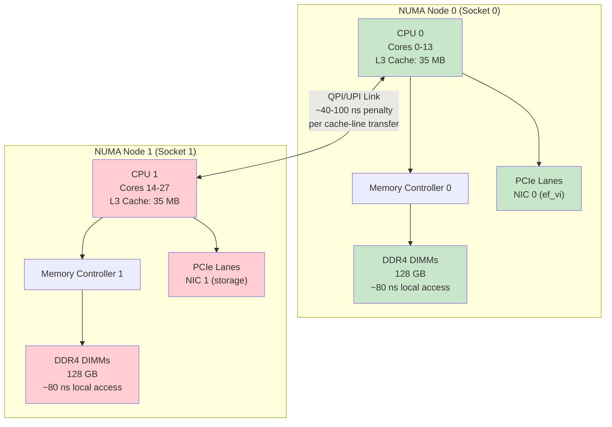

# Chapter 7: NUMA and CPU Pinning 🔴

> **What you'll learn:**
> - Non-Uniform Memory Access (NUMA) topology and why accessing memory on the wrong socket adds 40–100ns per access
> - The QPI/UPI interconnect: how data crosses between CPU sockets and why it's a latency cliff
> - CPU pinning with `isolcpus`, `taskset`, and `sched_setaffinity()` to prevent OS scheduler interference
> - IRQ affinity: steering NIC interrupts away from your hot-path cores

---

## 7.1 NUMA: Not All Memory Is Created Equal

Modern servers have 2 or more CPU sockets, each with its own **memory controller** connected to a set of DIMM slots. Each socket can access its **local memory** quickly, but accessing memory attached to the **other socket** requires traversing an inter-socket link (Intel QPI/UPI or AMD Infinity Fabric). This architecture is called **Non-Uniform Memory Access (NUMA)**.



### The Cost of Getting It Wrong

| Access Pattern | Latency | Relative Cost |
|---|---|---|
| L1 cache hit | ~1 ns | 1× |
| L2 cache hit | ~4 ns | 4× |
| L3 cache hit (same socket) | ~12 ns | 12× |
| **Local DRAM** (same NUMA node) | ~80 ns | 80× |
| **Remote DRAM** (cross-socket via UPI) | ~140 ns | 140× |
| Remote L3 snoop (cross-socket) | ~100 ns | 100× |

The cross-socket penalty is **~60ns per access**. For a hot path that accesses the order book 10 times per message, that's **600ns of unnecessary latency** — more than the entire budget for some firms.

> **Production Incident:** A team deployed a new feed handler binary and saw wire-to-wire latency jump from 900ns to 2.1µs overnight. Root cause: the Linux `numactl` default policy changed after an OS update, and the order book array was allocated on NUMA node 1 while the hot-path thread was running on NUMA node 0. Every order book access crossed the UPI link. Fix: `numactl --membind=0 --cpunodebind=0 ./feedhandler`.

---

## 7.2 Discovering Your NUMA Topology

### Command-Line Tools

```bash
# Show NUMA layout: which cores belong to which node
$ numactl --hardware
available: 2 nodes (0-1)
node 0 cpus: 0 1 2 3 4 5 6 7 8 9 10 11 12 13
node 0 size: 128000 MB
node 0 free: 95000 MB
node 1 cpus: 14 15 16 17 18 19 20 21 22 23 24 25 26 27
node 1 size: 128000 MB
node 1 free: 98000 MB
node distances:
node   0   1
  0:  10  21
  1:  21  10

# The distance matrix is KEY:
# Local access (same node): distance = 10
# Remote access (cross-node): distance = 21
# Ratio: 21/10 = 2.1x penalty for remote access

# Which NUMA node is the NIC on?
$ cat /sys/class/net/ens1f0/device/numa_node
0

# Which NUMA node is a specific core on?
$ cat /sys/devices/system/cpu/cpu3/topology/physical_package_id
0
```

### Mapping NIC → NUMA Node → CPU Cores

The golden rule: **your hot-path thread, the NIC, and all hot-path memory must be on the same NUMA node.**

```
    ✅ CORRECT: Everything on NUMA Node 0
    ┌─────────────────────────────────────────┐
    │  NUMA Node 0                            │
    │                                         │
    │  Core 3 ← Hot-path thread (pinned)      │
    │  NIC 0  ← ef_vi feed handler            │
    │  128 GB ← Order book + ring buffers     │
    │           (allocated with numactl)       │
    └─────────────────────────────────────────┘

    ❌ WRONG: Thread on Node 0, memory on Node 1
    ┌──────────────────┐    ┌──────────────────┐
    │  NUMA Node 0     │    │  NUMA Node 1     │
    │                  │    │                  │
    │  Core 3 ← Thread│◄───│  Order book ← 💥 │
    │  NIC 0           │ UPI│  Every access     │
    │                  │link│  +60ns penalty    │
    └──────────────────┘    └──────────────────┘
```

---

## 7.3 CPU Isolation: Kicking the Scheduler Off Your Cores

The Linux CFS (Completely Fair Scheduler) time-slices all processes across all available cores. This means your hot-path thread can be **preempted** at any time — a context switch that costs 1–10µs in cache warming alone (Chapter 4).

The fix: **isolate** specific CPU cores from the scheduler entirely.

### `isolcpus` Kernel Boot Parameter

```bash
# /etc/default/grub
GRUB_CMDLINE_LINUX="isolcpus=2,3,4,5 nohz_full=2,3,4,5 rcu_nocbs=2,3,4,5"

# After update-grub and reboot:
# - Cores 2,3,4,5 are INVISIBLE to the scheduler
# - No user processes will be scheduled on them
# - No kernel housekeeping timers will fire on them
# - The only way to use them is explicit affinity (taskset)
```

| Parameter | Effect |
|---|---|
| `isolcpus=2,3,4,5` | Remove cores 2–5 from the scheduler's CPU set. No process runs there unless explicitly pinned. |
| `nohz_full=2,3,4,5` | Disable the tick timer (scheduler interrupt) on these cores when only one task is running. Eliminates ~4ms tick jitter. |
| `rcu_nocbs=2,3,4,5` | Move RCU callback processing off these cores. RCU callbacks can cause 10–100µs stalls. |

### Pinning Threads with `taskset` and `sched_setaffinity`

```bash
# Pin the feed handler process to core 3
taskset -c 3 ./feedhandler

# Alternatively, from within the process:
```

```rust
use libc::{cpu_set_t, sched_setaffinity, CPU_SET, CPU_ZERO};

/// Pin the current thread to a specific CPU core.
/// This ensures the thread NEVER migrates to another core.
fn pin_to_core(core_id: usize) {
    unsafe {
        let mut cpuset: cpu_set_t = std::mem::zeroed();
        CPU_ZERO(&mut cpuset);
        CPU_SET(core_id, &mut cpuset);
        let result = sched_setaffinity(
            0, // 0 = current thread
            std::mem::size_of::<cpu_set_t>(),
            &cpuset,
        );
        assert_eq!(result, 0, "Failed to pin thread to core {}", core_id);
    }
}

/// Set the thread to maximum real-time priority (SCHED_FIFO).
/// This gives the thread absolute priority over all non-RT processes.
fn set_realtime_priority() {
    unsafe {
        let param = libc::sched_param {
            sched_priority: 99, // maximum RT priority
        };
        let result = libc::sched_setscheduler(
            0, // current thread
            libc::SCHED_FIFO,
            &param,
        );
        assert_eq!(result, 0, "Failed to set SCHED_FIFO");
    }
}
```

---

## 7.4 IRQ Affinity: Steering Interrupts Away

Even with `isolcpus`, hardware interrupts (IRQs) can fire on your isolated cores unless you redirect them. A single IRQ handler execution takes ~1–5µs and pollutes L1/L2 caches.

```bash
# Find the IRQ number for your NIC
$ cat /proc/interrupts | grep ens1f0
  45:  1234567  0  IR-PCI-MSI  ens1f0-0

# The '0' in column 2 means CPU 1 has handled 0 interrupts from this IRQ
# (all handled by CPU 0)

# Redirect ALL NIC IRQs to core 0 (which is NOT our isolated hot-path core)
echo 1 > /proc/irq/45/smp_affinity   # bitmask: CPU 0 only

# Better: use irqbalance's --banirq or manually set affinity for ALL IRQs
for irq in /proc/irq/*/smp_affinity; do
    echo 1 > "$irq" 2>/dev/null  # pin all IRQs to core 0
done
```

> **Note:** When using kernel bypass (ef_vi/DPDK), the NIC doesn't generate IRQs for data path traffic (we're busy-polling). But NIC management interrupts (link up/down, firmware events) still fire. Redirect those too.

---

## 7.5 The Complete Core Allocation Map

A production HFT server with 28 cores (2 sockets, 14 cores each) might allocate cores like this:

```
    ┌─────────────────────────────────────────────────────────┐
    │                    NUMA Node 0 (Socket 0)               │
    │                                                         │
    │  Core  0: OS + housekeeping + IRQ handling              │
    │  Core  1: OS + monitoring agents                        │
    │  Core  2: Feed handler A/B (isolated, SCHED_FIFO)  🔥  │
    │  Core  3: Strategy + order entry (isolated, FIFO)  🔥  │
    │  Core  4: Risk manager (isolated)                  🔥  │
    │  Core  5: Warm path (parameter reload, recon)           │
    │  Core  6: Logging thread (SPSC consumer)                │
    │  Cores 7-13: Available for secondary strategies         │
    │                                                         │
    │  NIC 0 (Solarflare, ef_vi) ← PCIe on this node         │
    │  Memory: Order book, ring buffers, packet pool          │
    └─────────────────────────────────────────────────────────┘

    ┌─────────────────────────────────────────────────────────┐
    │                    NUMA Node 1 (Socket 1)               │
    │                                                         │
    │  Cores 14-20: FIX engine, SOR, back-office             │
    │  Cores 21-27: Available / development                   │
    │                                                         │
    │  NIC 1 (management / storage network)                   │
    │  Memory: Logs, historical data, non-latency-sensitive   │
    └─────────────────────────────────────────────────────────┘
```

### BIOS Settings for Maximum Isolation

| BIOS Setting | Recommended Value | Why |
|---|---|---|
| **Hyper-Threading** | **Disabled** | HT shares L1/L2 with the sibling core — destroys isolation |
| **C-States** | **Disabled (C0 only)** | Deep C-states add ~10–100µs wake-up latency |
| **P-States / SpeedStep** | **Disabled (max frequency)** | Frequency transitions cause ~10µs stalls |
| **Turbo Boost** | **Enabled** or **Disabled** | Turbo gives higher frequency but can cause thermal throttling; depends on workload |
| **NUMA interleaving** | **Disabled** | Interleaving distributes memory across nodes — defeats NUMA-aware allocation |
| **Prefetchers** | **Enabled** | Hardware prefetching helps sequential access patterns |
| **LLC Prefetch** | **Enabled** | Prefetch to Last-Level Cache on anticipated accesses |

---

## 7.6 Memory Allocation: NUMA-Aware Patterns

```rust
// 💥 LATENCY SPIKE: Default allocator has no NUMA awareness.
// Memory may be allocated on any NUMA node.
let book = Box::new(FastOrderBook::new());
// Where is this physically? Unknown. Could be on the wrong node.

// ✅ FIX: Use numactl or libnuma for explicit placement.
```

```bash
# Launch with NUMA-local allocation
numactl --cpunodebind=0 --membind=0 ./trading_engine

# Flags:
#   --cpunodebind=0   → Only schedule on NUMA node 0 cores
#   --membind=0       → Only allocate memory on NUMA node 0
#   (Note: isolcpus + taskset gives finer control than cpunodebind)
```

For more precise control within the process:

```rust
// Using libc::mmap with MAP_HUGETLB + mbind for NUMA placement
use libc::{mmap, MAP_ANONYMOUS, MAP_HUGETLB, MAP_PRIVATE, PROT_READ, PROT_WRITE};

/// Allocate a NUMA-local hugepage buffer.
/// This is how you allocate the order book and ring buffers.
unsafe fn alloc_numa_hugepage(size: usize, numa_node: i32) -> *mut u8 {
    let ptr = mmap(
        std::ptr::null_mut(),
        size,
        PROT_READ | PROT_WRITE,
        MAP_PRIVATE | MAP_ANONYMOUS | MAP_HUGETLB,
        -1,
        0,
    ) as *mut u8;

    assert!(!ptr.is_null(), "mmap failed for hugepage allocation");

    // Bind to specific NUMA node using mbind
    // (requires libnuma or direct syscall)
    // let nodemask: u64 = 1 << numa_node;
    // mbind(ptr, size, MPOL_BIND, &nodemask, 64, 0);

    // Touch every page to ensure physical allocation (avoid lazy faults)
    for offset in (0..size).step_by(2 * 1024 * 1024) { // 2MB hugepage stride
        std::ptr::write_volatile(ptr.add(offset), 0u8);
    }

    ptr
}
```

---

## 7.7 Verifying Your Topology at Runtime

```rust
/// Verify that the current thread is running on the expected NUMA node.
/// Call this in debug builds to catch misconfigurations.
fn assert_numa_node(expected_node: usize) {
    let cpu = unsafe { libc::sched_getcpu() } as usize;
    // Read the NUMA node of this CPU from sysfs
    let path = format!(
        "/sys/devices/system/cpu/cpu{}/topology/physical_package_id",
        cpu
    );
    let node: usize = std::fs::read_to_string(&path)
        .expect("Cannot read CPU topology")
        .trim()
        .parse()
        .expect("Cannot parse node ID");
    assert_eq!(
        node, expected_node,
        "Thread running on NUMA node {} but expected {}. \
         Hot-path will suffer cross-socket penalties.",
        node, expected_node
    );
}
```

---

<details>
<summary><strong>🏋️ Exercise: NUMA Topology Audit</strong> (click to expand)</summary>

You have a new server delivered to your co-location rack with the following specs:

- **CPU:** 2× Intel Xeon Gold 6348 (28 cores per socket, HT disabled = 56 cores total)
- **Memory:** 512 GB DDR4-3200 (256 GB per socket, 8 channels)
- **NICs:** 2× Solarflare X2522 (one per PCIe slot)
- **PCIe topology from `lspci`:**
  - NIC 0 → PCIe Bus 0x3a → NUMA Node 0
  - NIC 1 → PCIe Bus 0xd8 → NUMA Node 1

You are deploying a market-making system with:
- Feed handler thread (polls NIC 0 for CME MDP 3.0 market data)
- Strategy thread (evaluates signals, generates orders)
- Order entry thread (sends orders via NIC 0 TCP)
- Logging thread (writes to NVMe SSD on NUMA Node 1)

**Tasks:**

1. Assign each thread to a specific core. Justify the NUMA node choice for each.
2. Write the kernel boot parameters (`GRUB_CMDLINE_LINUX`) for this deployment.
3. What BIOS settings should be changed from defaults?
4. A junior engineer suggests running the logging thread on NUMA Node 0 "to keep everything together." Explain why this is wrong.

<details>
<summary>🔑 Solution</summary>

**1. Thread → Core Assignment:**

| Thread | Core | NUMA Node | Justification |
|---|---|---|---|
| Feed handler | Core 2 | Node 0 | ✅ Must be on same node as NIC 0 (PCIe on Node 0). Isolated. |
| Strategy | Core 3 | Node 0 | ✅ Reads order book (Node 0 memory). Adjacent to feed handler for SPSC ring warmth. Isolated. |
| Order entry | Core 4 | Node 0 | ✅ Sends via NIC 0 (Node 0 PCIe). Isolated. |
| OS + IRQs | Core 0 | Node 0 | Handles all hardware IRQs, kernel housekeeping. |
| Logging | Core 28 | Node 1 | ✅ NVMe SSD is on Node 1. Logging is cold-path — cross-socket access for the SPSC read is acceptable (logging is not latency-sensitive). |
| FIX engine | Core 29 | Node 1 | Warm-path, not time-critical. |

**2. Kernel boot parameters:**

```bash
GRUB_CMDLINE_LINUX="isolcpus=2,3,4 nohz_full=2,3,4 rcu_nocbs=2,3,4 \
  hugepagesz=1G hugepages=8 default_hugepagesz=1G \
  intel_pstate=disable processor.max_cstate=0 intel_idle.max_cstate=0 \
  nosoftlockup tsc=reliable"
```

| Parameter | Purpose |
|---|---|
| `isolcpus=2,3,4` | Remove hot-path cores from scheduler |
| `nohz_full=2,3,4` | Disable tick timer on hot-path cores |
| `rcu_nocbs=2,3,4` | Move RCU callbacks off hot-path cores |
| `hugepagesz=1G hugepages=8` | Reserve 8 GB of 1 GB hugepages for DMA buffers + order book |
| `intel_pstate=disable` | Disable P-state driver (locked to max frequency) |
| `processor.max_cstate=0 intel_idle.max_cstate=0` | Disable all C-states (prevent sleep) |
| `nosoftlockup` | Suppress false lockup warnings from busy-polling cores |
| `tsc=reliable` | Tell kernel the TSC is reliable (no fallback to HPET) |

**3. BIOS changes:**

| Setting | Change to | Why |
|---|---|---|
| Hyper-Threading | Disabled | Eliminates L1/L2 sharing with sibling |
| C-States | Disabled | Eliminates wake-up latency |
| SpeedStep / Intel P-States | Disabled, fixed max freq | Eliminates frequency transition stalls |
| Power Policy | Max Performance | Related to P-states |
| NUMA interleaving | Disabled | We want explicit NUMA-local allocation |
| Sub-NUMA Clustering (SNC) | Disabled (or evaluate per-case) | SNC can help or hurt — benchmark |

**4. Why logging should NOT be on Node 0:**

The logging thread reads from a SPSC ring buffer (written by the hot-path thread on Node 0). If the logging thread is also on Node 0, it **shares the L3 cache** with the hot-path threads. This means:

1. **Cache pollution:** The logging thread's working set (disk I/O buffers, formatting strings) contends for L3 cache space with the order book and ring buffer.
2. **L3 evictions:** The logging thread can evict hot-path data from L3, causing the strategy thread to suffer L3 misses → +12ns per miss.
3. **Memory bandwidth contention:** The logging thread reading from the ring buffer and writing to the NVMe SSD consumes memory bandwidth on Node 0's memory controller.

**The cross-socket penalty for the logging thread reading the SPSC ring buffer is ~60ns per cache-line transfer.** But the logging thread processes messages at 1–10K/sec (not millions), so total cross-socket overhead is 60ns × 10K = 0.6ms/sec — negligible. The benefit of keeping Node 0's L3 and memory bandwidth clean for the hot path far outweighs this cost.

</details>
</details>

---

> **Key Takeaways**
>
> - **NUMA** means memory access latency depends on which socket owns the memory. Cross-socket access adds **40–100ns per cache-line transfer**.
> - **All hot-path resources** (thread, NIC, memory) must be on the **same NUMA node**. Verify with `/sys/class/net/<iface>/device/numa_node`.
> - Use **`isolcpus` + `nohz_full` + `rcu_nocbs`** to create scheduler-free cores for your hot path. No context switches, no timer ticks, no RCU callbacks.
> - **Pin threads** with `sched_setaffinity()` and set **`SCHED_FIFO`** priority for deterministic scheduling.
> - **Redirect all IRQs** away from isolated cores using `/proc/irq/*/smp_affinity`.
> - **Disable Hyper-Threading and C-States** in BIOS for maximum isolation and determinism.
> - The cold path (logging, monitoring) should be on the **other** NUMA node to avoid L3 cache pollution on the hot-path node.

---

> **See also:**
> - [Chapter 4: The Cost of a Syscall](ch04-cost-of-a-syscall.md) — Context switch costs that CPU pinning eliminates
> - [Chapter 5: Kernel Bypass Networking](ch05-kernel-bypass-networking.md) — Placing the NIC on the correct NUMA node
> - [Algorithms & Concurrency, Chapter 1: CPU Cache](../algorithms-concurrency-book/src/ch01-cpu-cache-and-false-sharing.md) — L1/L2/L3 cache hierarchy and the MESI protocol
