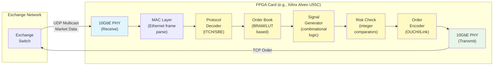

# Chapter 8: State Machines and FPGA Offloading 🔴

> **What you'll learn:**
> - Why even optimized software on isolated cores hits a latency floor of ~500ns–1µs
> - How FPGAs (Field-Programmable Gate Arrays) achieve deterministic sub-100ns tick-to-trade by executing logic directly in silicon
> - The architecture of an FPGA-based feed handler and order entry engine
> - When to use FPGAs vs. software, and the engineering trade-offs (development cost, flexibility, debugging)

---

## 8.1 The Software Latency Floor

After applying every optimization from Chapters 1–7 — kernel bypass, NUMA pinning, zero-allocation hot paths, binary protocols — you reach a floor:

| Pipeline Stage | Software (best case) | Why It Can't Go Lower |
|---|---|---|
| NIC → User Space (ef_vi poll) | 50–100 ns | PCIe latency + DMA completion + CPU cache fill |
| Decode binary message | 10–20 ns | CPU must execute instructions sequentially |
| Order book update | 20–50 ns | Memory access + arithmetic + branch resolution |
| Strategy signal | 50–200 ns | Dependent on complexity; memory lookups |
| Risk check | 20–50 ns | Integer arithmetic (fast, but still sequential) |
| Order encode + TX | 50–100 ns | Buffer write + NIC doorbell + PCIe TX DMA |
| **Total (best case)** | **~300–600 ns** | Limited by CPU clock speed and memory hierarchy |

For many firms, 500ns–1µs is competitive. But at the very top tier — where 50ns can determine who gets the fill — software isn't enough.

The fundamental limitation: a CPU executes instructions **sequentially** (even with pipelining and superscalar execution, each instruction has dependencies on previous results). An FPGA executes operations **in parallel** — every combinational logic stage completes in a single clock cycle, simultaneously.

---

## 8.2 What Is an FPGA?

A **Field-Programmable Gate Array** is a chip containing millions of configurable logic blocks (CLBs), each capable of implementing arbitrary boolean functions. Unlike a CPU, which fetches and executes instructions from memory, an FPGA is **configured at boot time** with a fixed circuit that implements your exact logic.

| Aspect | CPU | FPGA |
|---|---|---|
| **Execution model** | Sequential instructions (fetch-decode-execute) | Parallel combinational logic (all gates evaluate simultaneously) |
| **Clock speed** | 3–5 GHz | 200–400 MHz |
| **Operations per clock** | ~4–8 (superscalar) | Thousands (massive parallelism) |
| **Latency** | Variable (cache hits/misses, branch predictions) | **Deterministic** (fixed pipeline depth) |
| **Flexibility** | High (just reload the binary) | Low (reprogramming takes minutes to hours) |
| **Development language** | C/C++/Rust | Verilog/VHDL/SystemVerilog (or HLS) |
| **Development cost** | Low | Very high (specialized engineers, ~$500K+/year) |
| **Debugging** | GDB, printf, perf | Waveform simulation, ILA logic analyzers |

### Why FPGAs Are Fast: Determinism over Speed

A CPU at 3 GHz executes ~3 billion operations per second, but each operation may stall for cache misses, branch mispredictions, or pipeline hazards. The latency of any given path through the CPU is **unpredictable**.

An FPGA at 300 MHz executes ~300 million clock ticks per second — 10× fewer than the CPU. But every clock tick, **every gate in the design evaluates simultaneously**. The total latency through the FPGA is determined by the **pipeline depth** (number of clock stages), which is fixed at compile time:

$$t_{\text{FPGA}} = N_{\text{stages}} \times t_{\text{clock}} = N_{\text{stages}} \times \frac{1}{f_{\text{MHz}}}$$

Example: A 10-stage pipeline at 300 MHz:

$$t_{\text{FPGA}} = 10 \times 3.33 \text{ns} = 33.3 \text{ns}$$

This is **deterministic** — it's 33.3ns whether it's your first packet or your billionth. No cache misses. No branch mispredictions. No jitter.

---

## 8.3 FPGA-Based Tick-to-Trade Architecture

In an FPGA-accelerated trading system, the FPGA sits **between the NIC and the network**, processing packets directly in the data path:



### The Key Insight: No PCIe, No CPU, No Memory

In a pure FPGA implementation, the packet **never leaves the FPGA card**:

1. Photons arrive at the FPGA card's 10GbE SFP+ port.
2. The FPGA's internal Ethernet MAC extracts the frame.
3. The protocol decoder, order book, signal generator, risk check, and order encoder are all **pipelined hardware modules** inside the FPGA.
4. The outgoing order is emitted from the FPGA's TX port.

The packet never traverses the PCIe bus to the CPU. It never touches main memory. It never hits a cache. The entire tick-to-trade path is **on-chip**.

| Pipeline Stage | Software (CPU+ef_vi) | FPGA |
|---|---|---|
| Wire → Logic input | ~80 ns (PCIe DMA) | ~10 ns (PHY → MAC) |
| Decode | ~15 ns | ~3 ns (1 clock cycle) |
| Book update | ~30 ns | ~10 ns (3 cycles, BRAM lookup) |
| Signal generation | ~100 ns | ~7 ns (2 cycles, combinational) |
| Risk check | ~30 ns | ~3 ns (1 cycle, comparators) |
| Order encode + TX | ~80 ns | ~10 ns (PHY → wire) |
| **Total** | **~335–600 ns** | **~43–80 ns** |

---

## 8.4 FPGA Order Book: BRAM vs. LUT Implementation

The order book on an FPGA cannot use dynamic memory allocation (there is no heap). Instead, it uses:

- **Block RAM (BRAM):** On-chip SRAM blocks within the FPGA. Each BRAM is typically 36 Kbit (4.5 KB) with 1-cycle read latency. A Xilinx UltraScale+ has thousands of BRAMs.
- **Lookup Tables (LUTs):** The fundamental logic element of the FPGA. Can be configured as small distributed RAMs.

```verilog
// Simplified Verilog: BRAM-based price level array
// This is the FPGA equivalent of our software FastOrderBook

module order_book #(
    parameter NUM_LEVELS = 4096,    // price levels
    parameter QTY_WIDTH = 32        // quantity bit-width
)(
    input  wire        clk,
    input  wire        rst,

    // Input: new order book event
    input  wire        event_valid,
    input  wire [11:0] event_level_idx,   // which price level (0-4095)
    input  wire [1:0]  event_type,        // 00=add, 01=cancel, 10=exec
    input  wire [31:0] event_qty,

    // Output: best bid/ask (continuously updated)
    output reg  [11:0] best_bid_idx,
    output reg  [31:0] best_bid_qty,
    output reg  [11:0] best_ask_idx,
    output reg  [31:0] best_ask_qty
);

    // BRAM: stores total quantity at each price level
    // 1-cycle read latency, 1-cycle write latency
    reg [QTY_WIDTH-1:0] level_qty [0:NUM_LEVELS-1];

    // Pipeline stage 1: Read current quantity at the target level
    reg [31:0] current_qty_r;
    reg [11:0] level_idx_r;
    reg [1:0]  event_type_r;
    reg [31:0] event_qty_r;
    reg        valid_r;

    always @(posedge clk) begin
        if (event_valid) begin
            current_qty_r <= level_qty[event_level_idx]; // BRAM read
            level_idx_r   <= event_level_idx;
            event_type_r  <= event_type;
            event_qty_r   <= event_qty;
            valid_r       <= 1'b1;
        end else begin
            valid_r <= 1'b0;
        end
    end

    // Pipeline stage 2: Compute new quantity and write back
    always @(posedge clk) begin
        if (valid_r) begin
            case (event_type_r)
                2'b00: // Add order
                    level_qty[level_idx_r] <= current_qty_r + event_qty_r;
                2'b01: // Cancel order
                    level_qty[level_idx_r] <= current_qty_r - event_qty_r;
                2'b10: // Execute (reduce quantity)
                    level_qty[level_idx_r] <= current_qty_r - event_qty_r;
                default: ;
            endcase
        end
    end

    // Note: best_bid/best_ask tracking logic omitted for brevity.
    // In practice, this is a parallel comparator tree that
    // maintains the BBO indices as the book updates.

endmodule
```

**Key difference from software:** This order book processes **one event per clock cycle** (3.33ns at 300 MHz). The read and write to BRAM are **deterministic** — no cache misses, no TLB lookups, no address translation. The BRAM is physically on-die, with 1-cycle access guaranteed by construction.

---

## 8.5 Hybrid Architecture: FPGA + CPU

Pure-FPGA systems are inflexible — changing the strategy requires resynthesizing the FPGA bitstream, which takes hours. Most production systems use a **hybrid architecture**:

```
    ┌─────────────────────────────────────────────────────┐
    │                 FPGA Card                            │
    │                                                      │
    │  10GbE RX → Decode → Book Update → FAST SIGNAL    │
    │                                     │               │
    │                      ┌──────────────┤               │
    │                      │  Simple      │               │
    │                      │  threshold   │               │
    │                      │  crossed?    │               │
    │                      │  ┌───────┐   │               │
    │                      │  │  YES  │───────→ Risk → TX  │  ← ~50-80 ns
    │                      │  └───────┘   │               │
    │                      │  ┌───────┐   │               │
    │                      │  │  NO   │   │               │
    │                      │  └───┬───┘   │               │
    │                      └──────┼───────┘               │
    │                             │                        │
    │                        PCIe │ DMA                    │
    └─────────────────────────────┼────────────────────────┘
                                  │
                                  ▼
    ┌─────────────────────────────────────────────────────┐
    │                    CPU (Software)                     │
    │                                                      │
    │  Complex strategy evaluation                        │
    │  Machine learning inference                         │
    │  Portfolio-level risk management                    │
    │  Logging, monitoring, parameter management          │
    │                                                      │  ← ~500ns - 5µs
    │  New parameters → PCIe DMA → FPGA registers        │
    └─────────────────────────────────────────────────────┘
```

### The Two-Tier Decision Model

| Decision Type | Execution | Latency | Example |
|---|---|---|---|
| **Simple, pre-parameterized** | FPGA | ~50–80 ns | "If bid-ask imbalance > threshold, quote aggressively" |
| **Complex, model-driven** | CPU (via FPGA feed) | ~500ns–5µs | "Run ML inference on order flow features" |

The FPGA handles the **fast, simple decisions** (threshold crosses, delta hedging, simple market making) while the CPU handles **complex, evolving logic** (ML models, portfolio optimization). The CPU updates the FPGA's **parameter registers** (thresholds, offsets, limits) over PCIe, and the FPGA applies these parameters to every incoming packet at line rate.

---

## 8.6 FPGA Platforms Used in HFT

| Platform | FPGA Chip | Typical Use | Approximate Cost |
|---|---|---|---|
| **Xilinx Alveo U55C** | UltraScale+ | Market data processing, order entry | ~$5,000–$8,000 |
| **Intel Stratix 10** | Stratix GX | Feed handler, risk checking | ~$10,000–$20,000 |
| **Solarflare X2552** | Xilinx FPGA (integrated) | Application-level NIC with custom pipelines | ~$3,000–$5,000 |
| **Algo-Logic** | Various | Turnkey HFT FPGA solutions | Licensing model |
| **Custom boards** | Xilinx/Intel | Proprietary, in-house designed | $50,000+ (NRE) |

### Development Flow

```
    ┌─────────┐    ┌──────────┐    ┌───────────┐    ┌─────────┐
    │ Design  │    │ Simulate │    │ Synthesize│    │ Deploy  │
    │ (Verilog│───→│ (ModelSim│───→│ (Vivado/  │───→│ (Program│
    │  /VHDL) │    │  Verilator)   │  Quartus) │    │  FPGA)  │
    └─────────┘    └──────────┘    └───────────┘    └─────────┘
     ~1–4 weeks     ~1–2 days       ~2–8 hours       ~1 minute

    vs. Software:

    ┌─────────┐    ┌──────────┐    ┌───────────┐    ┌─────────┐
    │ Design  │    │ Test     │    │ Compile   │    │ Deploy  │
    │ (Rust/  │───→│ (cargo   │───→│ (cargo    │───→│ (scp +  │
    │  C++)   │    │  test)   │    │  build)   │    │  restart)│
    └─────────┘    └──────────┘    └───────────┘    └─────────┘
     ~1–5 days      ~minutes        ~seconds         ~seconds
```

> **The FPGA Trade-Off:** FPGA development is 10–50× slower than software development. A bug that takes 10 minutes to fix in Rust takes a full day in Verilog (simulate, synthesize, test). This is why only the highest-value, most stable parts of the pipeline are offloaded to FPGAs — usually the feed decoder and order encoder, which change infrequently.

---

## 8.7 When to Use FPGAs (Decision Framework)

| Factor | Favor FPGA | Favor Software |
|---|---|---|
| **Latency requirement** | < 200 ns wire-to-wire | > 500 ns acceptable |
| **Strategy complexity** | Simple, parameterized | Complex, ML-driven, frequently changing |
| **Market** | Competitive (CME, Nasdaq direct) | Less competitive (dark pools, regional) |
| **Development budget** | $2M+/year for FPGA team | < $500K/year |
| **Strategy change frequency** | Monthly or less | Daily or hourly |
| **Regulatory requirement** | Deterministic execution required | Best-effort acceptable |
| **Number of instruments** | Few (1–10 primary) | Many (1000+ instruments) |

---

<details>
<summary><strong>🏋️ Exercise: Design an FPGA Tick-to-Trade Pipeline</strong> (click to expand)</summary>

You are designing an FPGA-based feed handler and order entry system for CME ES futures. The FPGA is a Xilinx UltraScale+ running at 300 MHz (3.33ns per clock cycle).

The pipeline must:
1. Receive a UDP/IP Ethernet frame containing one SBE-encoded MDP 3.0 incremental refresh message.
2. Decode the SBE message (extract price, quantity, side).
3. Update the top-of-book (best bid/best ask) in BRAM.
4. Evaluate a simple threshold: "If best bid qty < threshold AND we have no resting bid, send a buy order."
5. Encode an iLink 3 order entry message.
6. Transmit via 10GbE.

**Tasks:**

1. Design the pipeline stages. How many clock cycles for each stage?
2. What is the total theoretical wire-to-wire latency?
3. If the FPGA receives market data at 5M messages/sec, is the pipeline capable of processing at this rate? Show the calculation.
4. What happens if two messages arrive back-to-back and the second one modifies the same price level as the first? Is there a data hazard? How do you resolve it?

<details>
<summary>🔑 Solution</summary>

**1. Pipeline stages:**

| Stage | Operation | Clock Cycles | Latency (ns) |
|---|---|---|---|
| 1 | Ethernet MAC: receive frame, strip headers | 3 | 10.0 |
| 2 | IP/UDP header check (checksum optional in HFT) | 1 | 3.3 |
| 3 | SBE decode: extract template ID, locate fields | 2 | 6.7 |
| 4 | Field extraction: price (4B), qty (4B), side (1B) | 1 | 3.3 |
| 5 | BRAM read: fetch current best bid/ask qty | 1 | 3.3 |
| 6 | Book update: compute new qty, write BRAM | 1 | 3.3 |
| 7 | Signal: compare bid_qty < threshold | 1 | 3.3 |
| 8 | Risk: check position limit (integer compare) | 1 | 3.3 |
| 9 | Order encode: build iLink 3 order message | 2 | 6.7 |
| 10 | Ethernet MAC: frame + transmit preamble | 3 | 10.0 |
| **Total** | | **16 cycles** | **53.3 ns** |

**2. Wire-to-wire latency:**

Add physical layer (PHY) serialization/deserialization:
- 10GbE RX PHY: ~50 ns (for a minimum-size 64-byte frame at 10 Gbps)
- 10GbE TX PHY: ~50 ns

**Total: 53.3 ns (pipeline) + 50 ns (RX PHY) + 50 ns (TX PHY) ≈ 153 ns**

In practice, with real-world margins: **~100–200 ns wire-to-wire.**

Compare to software: ~500–1,000 ns. The FPGA is **3–5× faster**.

**3. Throughput check:**

The pipeline is **fully pipelined** — once filled, it produces one result per clock cycle. The pipeline has 16 stages but the throughput is 1 message per clock = **300 million messages/sec**.

5M messages/sec is only 1.67% of the pipeline's capacity. **Easily handled.**

Even at the per-packet level: one message per 200ns (for 5M/sec), and the pipeline can process one per 3.33ns. The pipeline is idle 98% of the time.

**4. Data hazard: back-to-back updates to the same price level**

This IS a classic **read-after-write (RAW) hazard**:

- Clock N: Message 1 writes new qty to level 4502.00 (stage 6)
- Clock N+1: Message 2 reads qty from level 4502.00 (stage 5)
- **Problem:** Message 2 reads the OLD value because the BRAM write from Message 1 hasn't completed yet (BRAM has 1-cycle write latency, but the read is in the same cycle or earlier pipeline stage).

**Solutions:**

**a) Forwarding (bypass) logic:**
```verilog
// If the current read address matches the previous write address,
// forward the write data directly to the read output.
wire forward = (read_addr == prev_write_addr) && prev_write_valid;
wire [31:0] read_data = forward ? prev_write_data : bram_read_data;
```
This is the standard hardware solution — identical to CPU pipeline forwarding.

**b) Pipeline stall (bubble insertion):**
Insert a NOP cycle when a hazard is detected. Simple but adds 3.33ns of latency in the conflicting case. Acceptable for rare conflicts.

**In practice:** Forwarding is preferred. The area cost is trivial (a mux and a comparator), and it maintains full throughput with zero additional latency.

</details>
</details>

---

> **Key Takeaways**
>
> - Software tick-to-trade latency has a floor of **~300–600ns** even with kernel bypass and all CPU optimizations.
> - **FPGAs** achieve **~50–200ns** wire-to-wire by executing the entire pipeline in parallel hardware — no PCIe, no CPU, no memory hierarchy.
> - FPGA latency is **deterministic**: fixed pipeline depth × clock period. No jitter from cache misses or branch mispredictions.
> - Most production systems use a **hybrid FPGA + CPU** architecture: simple, parameterized decisions on FPGA; complex, evolving logic on CPU.
> - FPGA development is **10–50× slower and more expensive** than software. Only offload the most latency-critical, stable parts of the pipeline.
> - Data hazards in FPGA pipelines are solved with **forwarding logic** — the same technique CPUs use internally, but under your explicit control.

---

> **See also:**
> - [Chapter 3: The Tick-to-Trade Pipeline](ch03-tick-to-trade-pipeline.md) — The software version of this pipeline
> - [Chapter 5: Kernel Bypass Networking](ch05-kernel-bypass-networking.md) — The software alternative (ef_vi/DPDK)
> - [Chapter 9: Capstone](ch09-capstone-colocated-market-maker.md) — Full system design integrating FPGA and software
> - [Compiler Optimizations, SIMD](../compiler-optimizations-book/src/SUMMARY.md) — Software approaches to parallelism within the CPU
