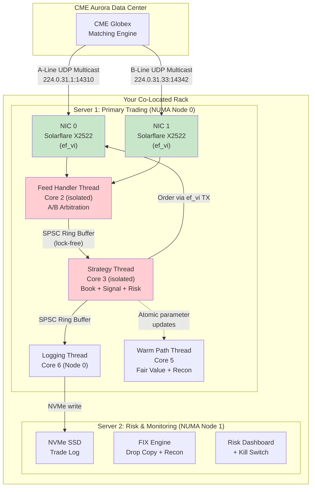

# Chapter 9: Capstone — Architect a Co-Located Market Maker 🔴

> **What you'll learn:**
> - How to design a complete, production-grade market-making system for CME ES futures inside the Aurora data center
> - Physical-layer latency calculations: fiber length from exchange switch to your NIC
> - Dual-NIC UDP Multicast feed handler with A/B line arbitration and lock-free ring buffers
> - Lock-free, pre-allocated memory pool for zero-allocation order generation
> - Sub-microsecond risk management gatekeeping with fat-finger checks

---

## 9.1 The Brief: CME Aurora Market Maker

You are the lead systems architect at a mid-tier proprietary trading firm. Your mandate:

> **Design and implement a market-making system for CME E-mini S&P 500 (ES) futures, co-located in the CME Aurora data center (Aurora, Illinois). Target wire-to-wire latency: ≤ 1.5 µs (p99). The system must handle 10M+ market data messages per second during peak periods (e.g., FOMC announcements) and send up to 5,000 orders per second.**

This is a **staff-level system design exercise** — the kind asked in final-round interviews at top-tier prop shops. We will design every layer, from the physical data center to the order memory allocator.

---

## 9.2 Physical Layer: Speed of Light Calculations

### CME Aurora Data Center Layout

CME Group's primary data center is in **Aurora, Illinois**. All co-located participants have their servers in the same facility as the CME Globex matching engine.

The matching engine connects to co-located servers via a network fabric. The physical distance from the matching engine's output switch port to your server's NIC is approximately:

| Segment | Distance | Medium | One-Way Latency |
|---|---|---|---|
| Matching Engine → Core Switch | ~5 meters | Fiber ($4.9 \text{ns/m}$) | ~25 ns |
| Core Switch → Row Switch | ~20 meters | Fiber | ~98 ns |
| Row Switch → Top-of-Rack Switch | ~5 meters | Fiber | ~25 ns |
| TOR Switch → Your NIC (patch cable) | ~3 meters | Fiber | ~15 ns |
| **Switch processing** (3 hops) | — | Silicon | ~300–600 ns |
| **Total** | ~33 meters | — | **~460–760 ns** |

> **Key insight:** The physical propagation delay through fiber is only ~163ns for 33 meters. The **switch forwarding latency** (~100–200ns per hop × 3 hops) dominates. This is why firms lobby the exchange for **shorter cross-connect paths** (fewer switch hops) and why exchanges enforce fairness by equalizing cable lengths.

### The Theoretical Minimum

At the physical layer, the absolute minimum one-way latency from the CME matching engine to your NIC is:

$$t_{\text{min}} = t_{\text{fiber}} + t_{\text{switches}} \approx 163\text{ns} + 300\text{ns} = 463\text{ns}$$

Your *software processing* budget is the target wire-to-wire minus twice the physical latency (in, then out):

$$t_{\text{processing}} = t_{\text{target}} - 2 \times t_{\text{physical}} = 1500\text{ns} - 2 \times 460\text{ns} = 580\text{ns}$$

You have **580 nanoseconds** for the entire software pipeline: decode, book update, signal, risk, encode, and TX.

---

## 9.3 System Architecture Overview



### Hardware Specification

| Component | Spec | Justification |
|---|---|---|
| **CPU** | Intel Xeon Gold 6354, 18 cores, 3.0 GHz (3.6 GHz turbo) | High single-core frequency, large L3 |
| **Memory** | 128 GB DDR4-3200, 1 NUMA node active | Only need Node 0, 1GB hugepages |
| **NIC 0** | Solarflare X2522 (PCIe on NUMA Node 0) | ef_vi, A-line + order TX |
| **NIC 1** | Solarflare X2522 (PCIe on NUMA Node 0) | ef_vi, B-line |
| **Storage** | 2× NVMe SSD (RAID-1) | Trade log durability |
| **OS** | RHEL 8 / Rocky Linux, kernel 5.15+ | Stable, vendor-supported |

### Kernel Boot Parameters

```bash
GRUB_CMDLINE_LINUX="isolcpus=2,3,4 nohz_full=2,3,4 rcu_nocbs=2,3,4 \
  hugepagesz=1G hugepages=4 default_hugepagesz=1G \
  intel_pstate=disable processor.max_cstate=0 intel_idle.max_cstate=0 \
  nosoftlockup tsc=reliable mce=ignore_ce \
  transparent_hugepage=never audit=0 selinux=0"
```

---

## 9.4 Component Design: Feed Handler

The feed handler is the first software stage. It reads raw UDP packets from both NICs, performs A/B arbitration, decodes the binary protocol, and writes normalized events to a lock-free SPSC ring buffer.

```rust
/// The feed handler's hot loop.
/// Runs on Core 2, isolated, SCHED_FIFO priority 99.
/// Polls two ef_vi handles (A-line, B-line) in alternation.
fn feed_handler_loop(
    nic_a: &mut EfViHandle,       // A-line (224.0.31.1:14310)
    nic_b: &mut EfViHandle,       // B-line (224.0.31.33:14342)
    arb: &mut ABArbitrator,       // Sequence number merge
    ring: &mut SpscProducer<BookEvent>, // Lock-free ring to strategy thread
) -> ! {
    let mut events_a = [EfEvent::default(); 32];
    let mut events_b = [EfEvent::default(); 32];

    loop {
        // ✅ Poll A-line (~50ns)
        let n_a = nic_a.poll(&mut events_a);
        for i in 0..n_a {
            let pkt = nic_a.get_packet(events_a[i].buf_id());
            let payload = &pkt[42..]; // skip Eth+IP+UDP
            let seq = read_sbe_sequence(payload);

            if let Some(normalized) = arb.ingest(seq, payload) {
                // ✅ Decode SBE binary → BookEvent struct (~15ns)
                let event = decode_mdp3(normalized);
                // ✅ Write to SPSC ring buffer (~5ns)
                ring.push(event);
            }
            nic_a.refill(events_a[i].buf_id());
        }

        // ✅ Poll B-line (~50ns)
        let n_b = nic_b.poll(&mut events_b);
        for i in 0..n_b {
            let pkt = nic_b.get_packet(events_b[i].buf_id());
            let payload = &pkt[42..];
            let seq = read_sbe_sequence(payload);

            if let Some(normalized) = arb.ingest(seq, payload) {
                let event = decode_mdp3(normalized);
                ring.push(event);
            }
            nic_b.refill(events_b[i].buf_id());
        }

        // No sleep. Busy-poll forever. 100% CPU utilization by design.
    }
}
```

---

## 9.5 Component Design: Lock-Free SPSC Ring Buffer

The ring buffer between the feed handler and strategy thread must be:
- **Lock-free:** No mutexes, no atomic CAS loops.
- **Single-Producer, Single-Consumer (SPSC):** One writer (feed handler), one reader (strategy).
- **Pre-allocated:** Fixed capacity, no dynamic memory.
- **Cache-line padded:** Producer and consumer metadata on separate cache lines to prevent false sharing.

```rust
use std::sync::atomic::{AtomicUsize, Ordering};
use std::cell::UnsafeCell;

const RING_SIZE: usize = 65_536; // Must be power of 2
const RING_MASK: usize = RING_SIZE - 1;

/// Cache-line-padded SPSC ring buffer.
/// Zero-copy for fixed-size elements. Lock-free. Wait-free.
#[repr(C)]
struct SpscRingBuffer<T: Copy> {
    // ✅ Producer and consumer on separate cache lines
    // to prevent false sharing.
    _pad0: [u8; 64],
    head: AtomicUsize,     // written by producer, read by consumer
    _pad1: [u8; 56],       // pad to next cache line
    tail: AtomicUsize,     // written by consumer, read by producer
    _pad2: [u8; 56],       // pad to next cache line
    buffer: UnsafeCell<[T; RING_SIZE]>,
}

// ✅ Safe because SPSC: only one thread writes head, one writes tail.
unsafe impl<T: Copy> Send for SpscRingBuffer<T> {}
unsafe impl<T: Copy> Sync for SpscRingBuffer<T> {}

impl<T: Copy + Default> SpscRingBuffer<T> {
    fn new() -> Self {
        Self {
            _pad0: [0; 64],
            head: AtomicUsize::new(0),
            _pad1: [0; 56],
            tail: AtomicUsize::new(0),
            _pad2: [0; 56],
            buffer: UnsafeCell::new([T::default(); RING_SIZE]),
        }
    }

    /// Producer: push an element. Returns false if full.
    /// Wait-free: exactly 1 atomic store, 1 atomic load.
    #[inline(always)]
    fn push(&self, item: T) -> bool {
        let head = self.head.load(Ordering::Relaxed);
        let tail = self.tail.load(Ordering::Acquire);

        if head - tail >= RING_SIZE {
            return false; // Full — consumer is too slow
        }

        unsafe {
            let buf = &mut *self.buffer.get();
            buf[head & RING_MASK] = item;
        }

        // ✅ Release store: ensures the item write is visible
        // before the head advance is visible to the consumer.
        self.head.store(head + 1, Ordering::Release);
        true
    }

    /// Consumer: pop an element. Returns None if empty.
    /// Wait-free: exactly 1 atomic store, 1 atomic load.
    #[inline(always)]
    fn pop(&self) -> Option<T> {
        let tail = self.tail.load(Ordering::Relaxed);
        let head = self.head.load(Ordering::Acquire);

        if tail >= head {
            return None; // Empty — no new data
        }

        let item = unsafe {
            let buf = &*self.buffer.get();
            buf[tail & RING_MASK]
        };

        // ✅ Release store: ensures the item read completes
        // before the slot is made available for reuse.
        self.tail.store(tail + 1, Ordering::Release);
        Some(item)
    }
}
```

---

## 9.6 Component Design: Pre-Allocated Order Memory Pool

On the hot path, we cannot call `malloc` or `Box::new`. All outgoing order structures are pre-allocated at startup in a circular buffer:

```rust
const ORDER_POOL_SIZE: usize = 4096; // power of 2

/// A pre-allocated pool of order buffers.
/// Allocation is O(1): bump a counter. No malloc. No free.
/// Old orders are overwritten when the pool wraps around.
/// This is safe because orders are sent and forgotten — we don't
/// need to reference old orders after they're on the wire.
struct OrderPool {
    slots: Box<[OrderBuffer; ORDER_POOL_SIZE]>,
    next: usize,
}

#[repr(C, align(64))] // Cache-line aligned
#[derive(Clone)]
struct OrderBuffer {
    // Pre-allocated space for the largest possible order message
    data: [u8; 128],
    len: usize,
}

impl Default for OrderBuffer {
    fn default() -> Self {
        Self {
            data: [0u8; 128],
            len: 0,
        }
    }
}

impl OrderPool {
    fn new() -> Self {
        Self {
            slots: vec![OrderBuffer::default(); ORDER_POOL_SIZE]
                .into_boxed_slice()
                .try_into()
                .unwrap_or_else(|_| panic!("pool size mismatch")),
            next: 0,
        }
    }

    /// Allocate an order buffer. O(1). No syscall. No malloc.
    /// ✅ Just bumps a pointer with a bitmask wrap.
    #[inline(always)]
    fn alloc(&mut self) -> &mut OrderBuffer {
        let idx = self.next & (ORDER_POOL_SIZE - 1);
        self.next += 1;
        &mut self.slots[idx]
    }
}

impl OrderBuffer {
    /// Encode an iLink 3 New Order Single into this buffer.
    /// Writes directly to the pre-allocated byte array.
    #[inline(always)]
    fn encode_new_order(
        &mut self,
        side: u8,          // 1=Buy, 2=Sell
        qty: u32,          // contracts
        price_mantissa: i64, // price in SBE mantissa format
        cl_ord_id: u64,
    ) {
        // SBE-encoded iLink 3 message
        // Write directly to self.data at known offsets
        self.data[0..2].copy_from_slice(&(76u16).to_le_bytes()); // block length
        self.data[2..4].copy_from_slice(&(514u16).to_le_bytes()); // template ID
        self.data[4..6].copy_from_slice(&(8u16).to_le_bytes());  // schema ID
        self.data[6..8].copy_from_slice(&(1u16).to_le_bytes());  // version
        self.data[8..16].copy_from_slice(&price_mantissa.to_le_bytes());
        self.data[16..20].copy_from_slice(&qty.to_le_bytes());
        self.data[20] = side;
        self.data[21..29].copy_from_slice(&cl_ord_id.to_le_bytes());
        // ... remaining fields omitted for brevity
        self.len = 76;
    }
}
```

---

## 9.7 Component Design: Sub-Microsecond Risk Gate

The risk gate is the last checkpoint before an order leaves the building. It must verify:

1. **Position limits:** Net position doesn't exceed maximum.
2. **Order size limits (fat-finger check):** No single order exceeds max quantity.
3. **Price reasonableness:** Order price is within N ticks of the current BBO.
4. **Rate limits:** No more than M orders per second.
5. **Notional limits:** Total exposure doesn't exceed capital limits.

All checks must complete in **< 50 nanoseconds**.

```rust
/// Pre-configured risk limits. Loaded at startup, updated by warm path.
/// All values are integers — no floating point on the hot path.
struct RiskGate {
    max_position: i64,           // max net position (contracts)
    max_order_qty: u32,          // max single order size
    max_price_deviation_ticks: i64, // max distance from BBO
    max_orders_per_second: u32,  // rate limit
    max_notional_ticks: u64,     // max notional (price_ticks × qty)

    // Mutable state (updated by hot path, audited by warm path)
    current_position: i64,       // net position
    orders_this_second: u32,     // rolling count
    second_boundary_tsc: u64,    // TSC value at start of current second
}

impl RiskGate {
    /// All-in-one risk check. Returns true if order is safe to send.
    /// Target: < 50ns total. All integer arithmetic.
    #[inline(always)]
    fn check(
        &mut self,
        side: Side,              // Buy or Sell
        qty: u32,
        price_ticks: i64,
        best_bid_ticks: i64,
        best_ask_ticks: i64,
        current_tsc: u64,
        tsc_per_second: u64,
    ) -> RiskResult {
        // Check 1: Order size (fat-finger) — ~2ns
        if qty > self.max_order_qty {
            return RiskResult::Reject("FAT_FINGER: qty exceeds max");
        }

        // Check 2: Position limit — ~3ns
        let new_position = match side {
            Side::Buy  => self.current_position + qty as i64,
            Side::Sell => self.current_position - qty as i64,
        };
        if new_position.abs() > self.max_position {
            return RiskResult::Reject("POSITION: would exceed limit");
        }

        // Check 3: Price reasonableness — ~3ns
        let reference = match side {
            Side::Buy  => best_ask_ticks,
            Side::Sell => best_bid_ticks,
        };
        let deviation = (price_ticks - reference).abs();
        if deviation > self.max_price_deviation_ticks {
            return RiskResult::Reject("PRICE: too far from BBO");
        }

        // Check 4: Notional limit — ~3ns
        let notional = qty as u64 * price_ticks.unsigned_abs();
        if notional > self.max_notional_ticks {
            return RiskResult::Reject("NOTIONAL: exceeds limit");
        }

        // Check 5: Rate limit — ~5ns (includes TSC comparison)
        if current_tsc - self.second_boundary_tsc > tsc_per_second {
            // New second — reset counter
            self.orders_this_second = 0;
            self.second_boundary_tsc = current_tsc;
        }
        if self.orders_this_second >= self.max_orders_per_second {
            return RiskResult::Reject("RATE: exceeded orders/sec");
        }

        // All checks passed — update state
        self.current_position = new_position;
        self.orders_this_second += 1;

        RiskResult::Pass
    }
}

enum RiskResult {
    Pass,
    Reject(&'static str),
}
```

Total risk check cost: ~16ns (5 integer comparisons + 1 multiply + 1 branch-per-check). Well under the 50ns budget.

---

## 9.8 Strategy Thread: Putting It All Together

```rust
/// The strategy thread's hot loop.
/// Runs on Core 3, isolated, SCHED_FIFO priority 99.
/// Reads book events from the SPSC ring buffer,
/// updates the local order book, evaluates the signal,
/// and fires orders through the risk gate.
fn strategy_loop(
    ring: &SpscRingBuffer<BookEvent>,  // From feed handler
    book: &mut FastOrderBook,           // Array-indexed, pre-allocated
    strategy: &mut MarketMaker,         // Pre-computed parameters
    risk: &mut RiskGate,                // Integer risk checks
    order_pool: &mut OrderPool,         // Pre-allocated order buffers
    nic_tx: &mut EfViTxHandle,          // ef_vi TX for order entry
    tsc_freq: u64,                      // TSC ticks per second
) -> ! {
    loop {
        // ✅ Read next book event from ring buffer (~5ns)
        let event = match ring.pop() {
            Some(e) => e,
            None => continue, // Busy-poll: no sleep, no yield
        };

        // ✅ Timestamp: pipeline entry
        let t_start = rdtsc();

        // ✅ Update order book (~30ns)
        book.apply(event);

        // ✅ Evaluate market-making signal (~100ns)
        let signal = strategy.evaluate(
            book.best_bid_price(),
            book.best_bid_qty(),
            book.best_ask_price(),
            book.best_ask_qty(),
            book.imbalance(),
        );

        if let Some(order_signal) = signal {
            // ✅ Risk check (~20ns)
            let t_now = rdtsc();
            let result = risk.check(
                order_signal.side,
                order_signal.qty,
                order_signal.price_ticks,
                book.best_bid_price(),
                book.best_ask_price(),
                t_now,
                tsc_freq,
            );

            match result {
                RiskResult::Pass => {
                    // ✅ Allocate order buffer from pool (~2ns)
                    let buf = order_pool.alloc();

                    // ✅ Encode order (~15ns)
                    buf.encode_new_order(
                        order_signal.side as u8,
                        order_signal.qty,
                        order_signal.price_ticks,
                        order_signal.cl_ord_id,
                    );

                    // ✅ Send via ef_vi (~50ns)
                    nic_tx.send(buf.as_slice());

                    // ✅ Timestamp: pipeline exit
                    let t_end = rdtsc();
                    let latency_ns = (t_end - t_start) as f64
                        / (tsc_freq as f64 / 1_000_000_000.0);
                    // (latency_ns logged to SPSC ring → logging thread)
                }
                RiskResult::Reject(reason) => {
                    // Log rejection to SPSC ring (cold path)
                    // DO NOT log to stdout/stderr on hot path!
                }
            }
        }
    }
}
```

---

## 9.9 Complete Latency Budget: Wire-to-Wire

```mermaid
graph TD
    subgraph "Wire-to-Wire Latency Budget (Target: ≤ 1500 ns)"
        A["Exchange Switch → NIC<br/>(Physical fiber + switches)<br/>~460 ns"] --> B["ef_vi Poll + DMA<br/>~80 ns"]
        B --> C["A/B Arbitrate + Decode<br/>~25 ns"]
        C --> D["SPSC Write + Read<br/>~10 ns"]
        D --> E["Order Book Update<br/>~30 ns"]
        E --> F["Strategy Signal<br/>~100 ns"]
        F --> G["Risk Check<br/>~20 ns"]
        G --> H["Order Encode<br/>~15 ns"]
        H --> I["ef_vi TX + DMA<br/>~80 ns"]
        I --> J["NIC → Exchange Switch<br/>(Physical fiber + switches)<br/>~460 ns"]
    end

    style A fill:#e1f5fe
    style J fill:#e8f5e9
    style B fill:#fff9c4
    style C fill:#fff9c4
    style D fill:#fff9c4
    style E fill:#fff9c4
    style F fill:#fff9c4
    style G fill:#fff9c4
    style H fill:#fff9c4
    style I fill:#fff9c4
```



| Stage | Latency (ns) | Cumulative | Notes |
|---|---|---|---|
| Physical in (exchange → NIC) | 460 | 460 | Fiber + switch hops |
| ef_vi RX poll + DMA | 80 | 540 | Includes PCIe + cache fill |
| A/B arbitrate + SBE decode | 25 | 565 | Sequence compare + struct overlay |
| SPSC ring write + read | 10 | 575 | Atomic store + load |
| Order book update | 30 | 605 | Array index + qty arithmetic |
| Strategy evaluation | 100 | 705 | Lookup table + threshold |
| Risk gate | 20 | 725 | 5 integer comparisons |
| Order encode | 15 | 740 | Direct byte writes |
| ef_vi TX + DMA | 80 | 820 | NIC doorbell + PCIe |
| Physical out (NIC → exchange) | 460 | 1,280 | Fiber + switch hops |
| **Overhead margin** | 220 | **1,500** | Cache misses, branch mispredictions |
| **Total** | | **~1,280–1,500 ns** | ✅ Within target |

---

<details>
<summary><strong>🏋️ Exercise: Full System Design Review</strong> (click to expand)</summary>

You are interviewing for a Principal Engineer position at a major prop shop. The interviewer presents the system designed in this chapter and asks you to find **five potential failure modes or improvement opportunities**. For each one, describe:

1. The failure mode or weakness.
2. The impact (latency, correctness, financial risk).
3. Your proposed fix.

<details>
<summary>🔑 Solution</summary>

**1. Single Point of Failure: Strategy Thread**

- **Weakness:** The strategy thread is a single point of failure. If it panics (e.g., array index out of bounds in the order book), the entire system stops trading. Existing orders remain live on the exchange.
- **Impact:** Unhedged exposure. If the strategy was market-making with resting quotes on both sides, a strategy crash leaves those quotes live. Market moves against you → unlimited loss.
- **Fix:** Implement a **watchdog** on a separate core. If the strategy thread doesn't heartbeat within 10µs, the watchdog sends **mass cancel** messages to the exchange via a pre-built, pre-loaded cancel-all order. The watchdog has an independent TCP connection to the exchange, pre-authenticated at startup.

**2. SPSC Ring Buffer Overflow During Spikes**

- **Weakness:** If the strategy thread falls behind during an extreme burst (e.g., FOMC announcement: 25M msg/sec spike for 100ms), the SPSC ring buffer fills up. The feed handler's `push()` returns `false`. Market data is **dropped in software** — your book becomes stale.
- **Impact:** Stale book → wrong signals → adverse fills. Exactly the same risk as UDP packet loss, but self-inflicted.
- **Fix:** (a) Make the ring buffer larger (131,072 slots instead of 65,536). (b) When the ring is >75% full, the feed handler writes a **"flush" event** that tells the strategy to enter **snapshot recovery mode** — pause signal generation, request a book snapshot from the exchange, rebuild. (c) Monitor ring buffer fill level on the warm path and alert if it exceeds 50%.

**3. Clock Drift: TSC Calibration**

- **Weakness:** The rate limiter uses `RDTSC` with a pre-calibrated `tsc_per_second`. If the CPU enters a power state that changes TSC frequency (P-state transition), the rate limit becomes inaccurate.
- **Impact:** Could allow more orders/sec than intended (risk), or reject valid orders (lost revenue).
- **Fix:** (a) Disable P-states and C-states in BIOS (already done). (b) Use `tsc=reliable` boot parameter. (c) Periodically recalibrate TSC against `CLOCK_MONOTONIC` on the warm path and update the hot path value via atomic store.

**4. NIC Failover: No Automatic Redundancy for Order Entry**

- **Weakness:** Order entry goes through NIC 0 only. If NIC 0 has a hardware failure or link flap, we cannot send orders.
- **Impact:** Cannot cancel existing orders or send new ones. Unhedged exposure again.
- **Fix:** Pre-establish TCP sessions on BOTH NICs at startup. If the primary TX path fails (detected by ef_vi TX completion timeout), switch to NIC 1 within microseconds. The switch is a single atomic pointer swap in the strategy thread.

**5. Memory Pool Wraparound: Overwriting In-Flight Orders**

- **Weakness:** The `OrderPool` wraps around after 4,096 allocations. If the strategy sends 4,096+ orders before the NIC finishes DMA-ing the first ones, it could overwrite an `OrderBuffer` that the NIC is still reading.
- **Impact:** Corrupted order on the wire → exchange rejects it or interprets it as a different order → financial chaos.
- **Fix:** (a) Make the pool larger (16,384 or 65,536 slots). At 5,000 orders/sec, that's 3–13 seconds of headroom before wraparound. (b) Track ef_vi TX completions and maintain a `sent_but_not_acked` counter. Only wrap past slots that have confirmed TX completion. (c) In practice, at 5K orders/sec and 4,096 slots, wraparound occurs every ~0.8 seconds — and NIC DMA completes in ~1µs. So the risk is extremely low, but the fix costs almost nothing.

</details>
</details>

---

> **Key Takeaways**
>
> - A co-located market maker's wire-to-wire latency budget starts with **physics**: fiber length + switch hops = ~460ns per direction. Your software gets whatever's left.
> - The system is decomposed into **isolated, single-purpose threads**: feed handler (Core 2), strategy (Core 3), logging (Core 6) — each pinned to an isolated core on the same NUMA node as the NIC.
> - Components communicate via **lock-free SPSC ring buffers** — no mutexes, no contention, no blocking.
> - Orders are built in a **pre-allocated memory pool** — zero heap allocation on the hot path.
> - The **risk gate** performs all checks with integer arithmetic in **< 50ns**: fat-finger, position, price, notional, and rate limits.
> - Always design for **failure modes**: watchdog kill switches, NIC failover, ring buffer overflow handling, and crash recovery.
> - This is a **staff-level design** suitable for final-round system design interviews at quantitative trading firms.

---

> **See also:**
> - [Chapter 1: The Limit Order Book](ch01-limit-order-book.md) — The data structure at the heart of this system
> - [Chapter 3: The Tick-to-Trade Pipeline](ch03-tick-to-trade-pipeline.md) — The pipeline this capstone implements
> - [Chapter 5: Kernel Bypass Networking](ch05-kernel-bypass-networking.md) — ef_vi implementation details
> - [Chapter 7: NUMA and CPU Pinning](ch07-numa-and-cpu-pinning.md) — Core isolation and NUMA placement
> - [Chapter 8: FPGA Offloading](ch08-fpga-offloading.md) — How to push this below 200ns with hardware
