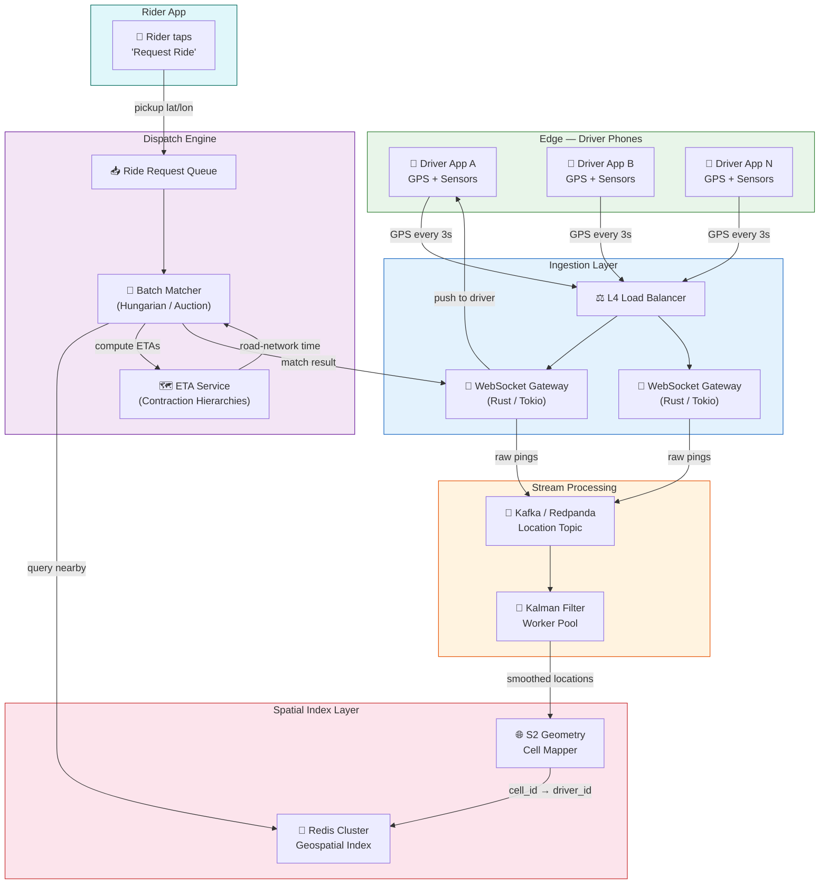

# System Design: The Real-Time Ride Dispatch Engine

## Speaker Intro

I'm a Principal Geospatial Architect with over a decade of experience building location-aware platforms at scale — from the real-time dispatch engines that power ride-hailing in cities of 20 million, to the spatial indexing infrastructure that turns billions of GPS pings into sub-second driver assignments. My background spans distributed systems, computational geometry, and mobile edge computing, with production deployments handling 10 million active location streams simultaneously.

This handbook distills what it actually takes to build a system where a rider taps "Request Ride" and — within 2 seconds — the best available driver from thousands of candidates is matched, notified, and en route.

---

## Who This Is For

- **Backend engineers** who've built CRUD APIs and want to understand why ride dispatch is an entirely different class of problem (real-time, geospatial, globally-optimized).
- **Systems architects** designing location-heavy platforms — delivery, logistics, fleet tracking — who need to choose between Geohash, S2, H3, and quadtrees.
- **Mobile developers** struggling with background location on iOS/Android who want to understand the *full pipeline* from GPS chip to dispatch decision.
- **Distributed systems engineers** who want a concrete case study of batched global optimization under tight latency budgets.
- **Tech leads and staff engineers** evaluating whether to build or buy a dispatch engine, and needing to understand the architectural trade-offs.

---

## Prerequisites

| Concept | Where to Learn |
|---|---|
| Rust ownership, async/await, tokio basics | [Async Rust Book](../async-book/src/SUMMARY.md) |
| WebSocket protocol fundamentals | [Tokio Internals Book](../tokio-internals-book/src/SUMMARY.md) |
| Distributed systems basics (consensus, partitioning) | [Distributed Systems Book](../distributed-systems-book/src/SUMMARY.md) |
| Flutter / Dart fundamentals | [Flutter Omni Book](../flutter-omni-book/src/SUMMARY.md) |
| Basic graph theory (shortest paths, bipartite graphs) | [Algorithms & Concurrency Book](../algorithms-concurrency-book/src/SUMMARY.md) |

---

## How to Use This Book

| Emoji | Meaning |
|---|---|
| 🟢 | **Architecture** — system-level design, data flow, infrastructure choices |
| 🟡 | **Spatial Algorithms** — geometric indexing, mobile edge computing, map data |
| 🔴 | **Distributed Matching** — global optimization, real-time routing, consensus under latency |

Read front-to-back for the full picture, or jump directly to the chapter that matches your current bottleneck.

---

## The Problem We Are Solving

> **The Problem:** A rider opens the app in downtown São Paulo during Friday rush hour and taps "Request Ride." There are 14,000 active drivers within 5 km. The system must — in under 2 seconds — ingest the rider's GPS coordinate, query the spatial index for nearby available drivers, compute accurate ETAs for the top candidates using live traffic data, run a global optimization algorithm that considers *all* pending ride requests simultaneously, and push the match to the selected driver's phone over a persistent connection. Now multiply this by 50,000 concurrent ride requests per minute, across 600 cities, on 6 continents. That is the ride dispatch problem.

### Performance Budget

| Stage | Latency Target | Throughput |
|---|---|---|
| GPS ping ingestion (WebSocket) | < 50 ms | 3.3 M pings/sec globally |
| Spatial index lookup (S2 + Redis) | < 5 ms | 500 K queries/sec per shard |
| ETA computation (routing graph) | < 10 ms per pair | 100 K ETA computations/sec |
| Batch matching (Hungarian / auction) | < 200 ms per batch | 50 K matches/min per city |
| Driver notification (push) | < 100 ms | 200 K notifications/sec |
| **End-to-end: tap to driver notified** | **< 2 seconds** | |

---

## Pacing Guide

| Chapter | Topic | Time | Checkpoint |
|---|---|---|---|
| 0 | Introduction & Architecture Overview | 1 hour | Can sketch the full data pipeline |
| 1 | GPS Ingestion — WebSocket Gateway | 4–6 hours | Running Rust WebSocket server with Kalman filter |
| 2 | Spatial Indexing — Geohash vs. S2 | 4–6 hours | In-memory S2 index querying nearby cells |
| 3 | Bipartite Matching Algorithm | 6–8 hours | Hungarian algorithm dispatching batches |
| 4 | ETAs & Routing Graph | 6–8 hours | Contraction Hierarchies answering sub-10ms queries |
| 5 | Flutter Driver App | 4–6 hours | Background location streaming with offline batching |

---

## Table of Contents

### Part I: Data Ingestion & Spatial Infrastructure

**Chapter 1 — Ingesting the Moving World 🟢**
The firehose of GPS pings. We architect a highly available WebSocket gateway in Rust to receive location updates from drivers every 3 seconds. We handle out-of-order packets, erratic GPS jumps (Kalman filtering), and the challenge of maintaining 500K concurrent connections per node.

**Chapter 2 — Spatial Indexing: Geohash vs. Google S2 🟡**
Why you cannot use `SELECT * WHERE lat BETWEEN ... AND lon BETWEEN ...` on a table of 14 million drivers. We map 2D coordinates to 1D space-filling curves, compare Geohash, S2, and H3, and build an in-memory spatial index on Redis that answers "find all drivers within 2 km" in under 5 ms.

### Part II: Core Dispatch Intelligence

**Chapter 3 — The Bipartite Matching Algorithm 🔴**
It's not just "closest driver." Assigning riders to the nearest driver creates cascade failures — one bad assignment propagates, increasing total city-wide wait time. We build a dispatch worker that uses the Hungarian algorithm and auction-based optimization to match batches of 100 riders to 100 drivers simultaneously, minimizing global ETA.

**Chapter 4 — ETAs and the Routing Graph 🔴**
Distance does not equal time. A driver 1 km away across a river bridge at rush hour is 20 minutes out; a driver 3 km away on an expressway is 4 minutes out. We integrate OpenStreetMap data, historical traffic speeds, and real-time probe data into a distributed routing engine using Contraction Hierarchies, answering ETA queries in under 10 ms.

### Part III: Edge & Client

**Chapter 5 — The Driver App: Flutter & Background Location 🟡**
The mobile phone is the edge node. We build a Flutter app that stays alive in the background on iOS and Android, transmits GPS pings reliably, batches offline pings during tunnel dead-zones, and uses Dart Isolates to prevent UI stutter during map rendering. We cover the practical horrors of Android Doze, iOS background app refresh, and carrier NAT timeouts.

---

## Architecture Overview

---

## Companion Guides

| Book | Relevance |
|---|---|
| [Async Rust](../async-book/src/SUMMARY.md) | Tokio runtime powering the WebSocket gateway |
| [Distributed Systems](../distributed-systems-book/src/SUMMARY.md) | Consensus protocols for dispatch state replication |
| [Algorithms & Concurrency](../algorithms-concurrency-book/src/SUMMARY.md) | Graph algorithms underlying routing engines |
| [Flutter Omni](../flutter-omni-book/src/SUMMARY.md) | Cross-platform mobile development for the driver app |
| [System Design: Message Broker](../system-design-book/src/SUMMARY.md) | Event streaming infrastructure for location pipelines |
| [Cloud Native Rust](../cloud-native-book/src/SUMMARY.md) | Kubernetes deployment of dispatch microservices |
