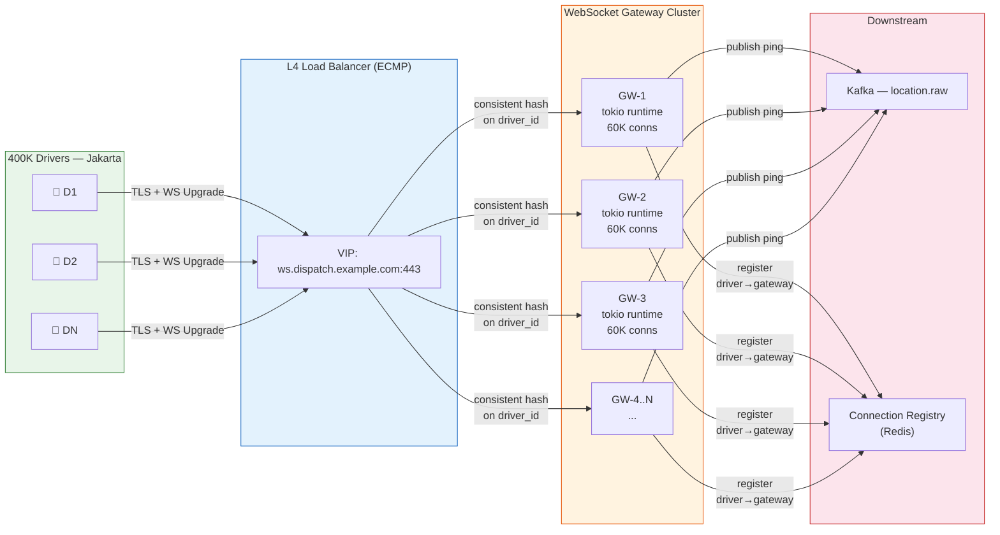
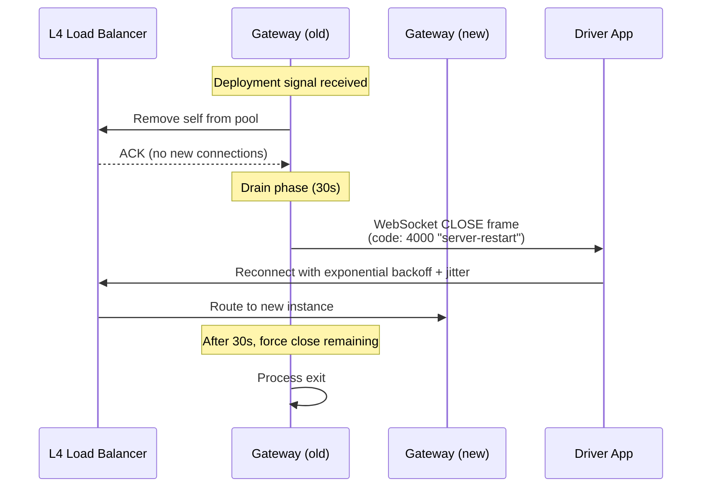

# Chapter 1: Ingesting the Moving World 🟢

> **The Problem:** Every active driver on the platform transmits a GPS coordinate every 3 seconds. In a city like Jakarta with 400,000 online drivers, that's 133,000 pings per second from a single metro area. Globally, we're looking at 3.3 million pings per second — a firehose of tiny, time-sensitive, frequently corrupted location data that must be received, validated, de-duplicated, smoothed, and written to a spatial index with less than 50 ms of end-to-end latency. The WebSocket gateway that ingests this stream is arguably the most critical piece of infrastructure in the entire dispatch pipeline.

---

## 1.1 Why WebSockets, Not HTTP Polling

The first design decision is the transport protocol. Let's compare the realistic options:

| Approach | Connection Overhead | Latency (p99) | Battery Impact | Server Memory per Driver |
|---|---|---|---|---|
| HTTP polling every 3s | Full TLS handshake each time | 200–500 ms | 💥 High (radio wakeup) | Stateless (0) |
| HTTP/2 server push | Single connection, half-duplex | 100–200 ms | Moderate | ~2 KB |
| **WebSocket (RFC 6455)** | **Single upgrade, full-duplex** | **15–40 ms** | **Low (persistent socket)** | **~8 KB** |
| gRPC bidirectional stream | Single HTTP/2 stream | 20–50 ms | Low | ~12 KB |
| QUIC / WebTransport | 0-RTT resume, multiplexed | 10–30 ms | Low | ~10 KB |

WebSocket wins for this use case because:

1. **Full-duplex** — the server pushes dispatch commands *back* to the driver on the same connection.
2. **Minimal framing** — a ping payload is ~60 bytes; WebSocket frame overhead is 2–6 bytes vs. HTTP's hundreds.
3. **Universal mobile support** — every Flutter/iOS/Android HTTP library supports WebSocket natively.
4. **Connection reuse** — a driver who's online for 8 hours maintains one TCP connection, not 9,600 HTTP requests.

---

## 1.2 The WebSocket Gateway Architecture



### Key design decisions

**Consistent hashing on `driver_id`** at the load balancer ensures a reconnecting driver lands on the same gateway node (most of the time), preserving session state. We use L4 (TCP-level) load balancing — not L7 — because we don't need to inspect HTTP headers after the initial upgrade.

**Connection Registry in Redis** maps `driver_id → gateway_node_id` so the dispatch engine knows which gateway to push a match notification through. An entry has a TTL of 30 seconds, refreshed with every ping.

---

## 1.3 Implementing the Gateway in Rust

Why Rust? Because a single gateway node with 64 GB of RAM must hold **500,000 concurrent WebSocket connections** with sub-millisecond per-message processing. Garbage-collected runtimes (Go, Java) would face unpredictable GC pauses exactly when latency matters most.

### The core structure

```rust,ignore
use tokio::net::TcpListener;
use tokio_tungstenite::accept_async;
use futures_util::{StreamExt, SinkExt};
use std::sync::Arc;
use dashmap::DashMap;

/// Each connected driver has an entry in the session map.
struct DriverSession {
    driver_id: u64,
    last_ping: std::time::Instant,
    gateway_tx: tokio::sync::mpsc::Sender<ServerMessage>,
}

/// The gateway holds all active sessions, sharded by driver_id.
struct Gateway {
    sessions: Arc<DashMap<u64, DriverSession>>,
    kafka_producer: rdkafka::producer::FutureProducer,
    redis_pool: deadpool_redis::Pool,
}

impl Gateway {
    async fn run(&self, addr: &str) -> anyhow::Result<()> {
        let listener = TcpListener::bind(addr).await?;
        println!("WebSocket gateway listening on {}", addr);

        loop {
            let (stream, peer_addr) = listener.accept().await?;
            let sessions = self.sessions.clone();
            let kafka = self.kafka_producer.clone();
            let redis = self.redis_pool.clone();

            tokio::spawn(async move {
                if let Err(e) = handle_connection(
                    stream, peer_addr, sessions, kafka, redis,
                ).await {
                    eprintln!("Connection error from {}: {}", peer_addr, e);
                }
            });
        }
    }
}
```

### Per-connection handler

```rust,ignore
use serde::Deserialize;

#[derive(Deserialize)]
struct GpsPing {
    driver_id: u64,
    lat: f64,
    lon: f64,
    heading: f32,        // degrees from north
    speed_mps: f32,      // meters per second
    accuracy_m: f32,     // GPS accuracy radius
    timestamp_ms: u64,   // client-side Unix millis
    seq: u64,            // monotonic sequence number
}

async fn handle_connection(
    stream: tokio::net::TcpStream,
    peer_addr: std::net::SocketAddr,
    sessions: Arc<DashMap<u64, DriverSession>>,
    kafka: rdkafka::producer::FutureProducer,
    redis: deadpool_redis::Pool,
) -> anyhow::Result<()> {
    let ws_stream = accept_async(stream).await?;
    let (mut ws_tx, mut ws_rx) = ws_stream.split();

    // Channel for server → driver messages (dispatch notifications)
    let (srv_tx, mut srv_rx) = tokio::sync::mpsc::channel::<ServerMessage>(32);

    // Forward server messages to the WebSocket
    tokio::spawn(async move {
        while let Some(msg) = srv_rx.recv().await {
            let payload = serde_json::to_string(&msg).unwrap();
            let _ = ws_tx.send(
                tokio_tungstenite::tungstenite::Message::Text(payload)
            ).await;
        }
    });

    // Read driver pings
    while let Some(Ok(msg)) = ws_rx.next().await {
        if let tokio_tungstenite::tungstenite::Message::Binary(data) = msg {
            // MessagePack for minimal wire size
            let ping: GpsPing = rmp_serde::from_slice(&data)?;

            // ✅ Validate: reject pings with impossible coordinates
            if ping.lat < -90.0 || ping.lat > 90.0
                || ping.lon < -180.0 || ping.lon > 180.0
            {
                continue; // silently drop
            }

            // ✅ Validate: reject pings with accuracy > 100m (indoor/reflected GPS)
            if ping.accuracy_m > 100.0 {
                continue;
            }

            // Register or refresh session
            sessions.insert(ping.driver_id, DriverSession {
                driver_id: ping.driver_id,
                last_ping: std::time::Instant::now(),
                gateway_tx: srv_tx.clone(),
            });

            // Publish to Kafka for downstream processing
            publish_to_kafka(&kafka, &ping).await?;

            // Refresh Redis connection registry (TTL 30s)
            refresh_registry(&redis, ping.driver_id).await?;
        }
    }

    Ok(())
}
```

> 💥 **Subtle Bug Alert:** The code above processes each ping sequentially within a single connection. For a driver sending pings every 3 seconds, this is fine. But if a driver reconnects and replays a batch of 200 buffered pings from a tunnel dead-zone, we'll block that connection's task for potentially hundreds of milliseconds. The fix: spawn the Kafka publish as a separate task or use a bounded channel.

---

## 1.4 Handling Out-of-Order Packets

GPS pings can arrive out of order for several reasons:

1. **TCP head-of-line blocking** — a retransmitted TCP segment delays all subsequent segments.
2. **Client-side batching** — the driver app batches pings during offline periods and replays them on reconnect.
3. **Load balancer failover** — during a gateway node restart, pings may be re-routed and arrive on a new node before the old node's buffer drains.

### The sequence number protocol

Every ping carries a monotonically increasing `seq` field set by the client. The gateway maintains a per-driver `last_seen_seq`:

```rust,ignore
use std::collections::HashMap;
use std::sync::Mutex;

struct SequenceTracker {
    /// driver_id → highest processed sequence number
    last_seq: DashMap<u64, u64>,
}

impl SequenceTracker {
    /// Returns true if this ping should be processed (not a duplicate).
    /// For out-of-order pings, we accept them but mark them for reordering downstream.
    fn should_process(&self, driver_id: u64, seq: u64) -> PingVerdict {
        let mut entry = self.last_seq.entry(driver_id).or_insert(0);
        let last = *entry;

        if seq <= last {
            // ✅ Duplicate or old — drop it
            PingVerdict::Drop
        } else if seq == last + 1 {
            // ✅ In order — update and process
            *entry = seq;
            PingVerdict::Process
        } else {
            // 🟡 Gap detected — accept but flag for reordering
            *entry = seq;
            PingVerdict::ProcessWithGap { expected: last + 1, got: seq }
        }
    }
}

enum PingVerdict {
    Drop,
    Process,
    ProcessWithGap { expected: u64, got: u64 },
}
```

### Reordering window downstream

The Kafka consumer (Kalman filter worker) maintains a small reordering buffer per driver — a `BTreeMap<u64, GpsPing>` keyed by sequence number. It waits up to 500 ms for out-of-order pings to fill gaps before processing them in order.

---

## 1.5 Kalman Filtering: Smoothing Erratic GPS

Raw GPS from a smartphone is noisy. Urban canyons (tall buildings reflecting signals) can produce jumps of 50–100 meters between consecutive pings. Feeding raw coordinates into the spatial index would cause a driver to "teleport" between grid cells, generating phantom proximity matches.

### The problem visually

| Ping # | Raw Lat | Raw Lon | Error |
|---|---|---|---|
| 1 | -6.20000 | 106.84500 | Accurate |
| 2 | -6.20045 | 106.84520 | 💥 50m jump (reflected signal) |
| 3 | -6.20002 | 106.84503 | Accurate (back to reality) |
| 4 | -6.19810 | 106.84700 | 💥 200m jump (GPS cold start) |
| 5 | -6.20005 | 106.84507 | Accurate |

### Kalman filter for 2D position + velocity

We use a linear Kalman filter with a constant-velocity motion model. The state vector tracks position and velocity in both axes:

$$
\mathbf{x} = \begin{bmatrix} \text{lat} \\ \text{lon} \\ v_{\text{lat}} \\ v_{\text{lon}} \end{bmatrix}
$$

The prediction step propagates the state forward by $\Delta t$ seconds:

$$
\mathbf{x}_{k|k-1} = \mathbf{F} \cdot \mathbf{x}_{k-1} \quad \text{where} \quad \mathbf{F} = \begin{bmatrix} 1 & 0 & \Delta t & 0 \\ 0 & 1 & 0 & \Delta t \\ 0 & 0 & 1 & 0 \\ 0 & 0 & 0 & 1 \end{bmatrix}
$$

The update step fuses the prediction with the noisy GPS measurement, weighted by the Kalman gain $\mathbf{K}$:

$$
\mathbf{K}_k = \mathbf{P}_{k|k-1} \mathbf{H}^T (\mathbf{H} \mathbf{P}_{k|k-1} \mathbf{H}^T + \mathbf{R})^{-1}
$$

$$
\mathbf{x}_k = \mathbf{x}_{k|k-1} + \mathbf{K}_k (\mathbf{z}_k - \mathbf{H} \mathbf{x}_{k|k-1})
$$

Where $\mathbf{R}$ is the measurement noise covariance — derived directly from the phone's reported `accuracy_m`.

### Rust implementation

```rust,ignore
/// 2D Kalman filter for GPS smoothing.
/// State: [lat, lon, v_lat, v_lon]
struct GpsKalmanFilter {
    x: [f64; 4],           // state vector
    p: [[f64; 4]; 4],      // covariance matrix
    q_scale: f64,           // process noise scaling factor
    initialized: bool,
}

impl GpsKalmanFilter {
    fn new() -> Self {
        Self {
            x: [0.0; 4],
            p: [
                [1.0, 0.0, 0.0, 0.0],
                [0.0, 1.0, 0.0, 0.0],
                [0.0, 0.0, 1.0, 0.0],
                [0.0, 0.0, 0.0, 1.0],
            ],
            q_scale: 0.1, // tuned for city driving
            initialized: false,
        }
    }

    fn update(&mut self, lat: f64, lon: f64, accuracy_m: f32, dt_secs: f64)
      -> (f64, f64)
    {
        if !self.initialized {
            self.x = [lat, lon, 0.0, 0.0];
            self.initialized = true;
            return (lat, lon);
        }

        // --- Prediction Step ---
        // x_predicted = F * x
        let x_pred = [
            self.x[0] + self.x[2] * dt_secs,
            self.x[1] + self.x[3] * dt_secs,
            self.x[2],
            self.x[3],
        ];

        // P_predicted = F * P * F^T + Q
        // (simplified: propagate position uncertainty by velocity uncertainty)
        let mut p_pred = self.p;
        p_pred[0][0] += dt_secs * dt_secs * self.p[2][2]
            + self.q_scale * dt_secs;
        p_pred[1][1] += dt_secs * dt_secs * self.p[3][3]
            + self.q_scale * dt_secs;

        // --- Update Step ---
        // Measurement noise from GPS accuracy (convert meters to degrees approx)
        let r = (accuracy_m as f64 / 111_000.0).powi(2); // ~111km per degree

        // Kalman gain for position components only (H = [I 0])
        let k0 = p_pred[0][0] / (p_pred[0][0] + r);
        let k1 = p_pred[1][1] / (p_pred[1][1] + r);

        // Innovation (measurement residual)
        let innov_lat = lat - x_pred[0];
        let innov_lon = lon - x_pred[1];

        // ✅ Reject outliers: if innovation > 5 * sqrt(S), skip this measurement
        let s0 = p_pred[0][0] + r;
        let s1 = p_pred[1][1] + r;
        if innov_lat * innov_lat > 25.0 * s0
            || innov_lon * innov_lon > 25.0 * s1
        {
            // GPS jump detected — trust prediction only
            self.x = x_pred;
            self.p = p_pred;
            return (x_pred[0], x_pred[1]);
        }

        // Update state
        self.x[0] = x_pred[0] + k0 * innov_lat;
        self.x[1] = x_pred[1] + k1 * innov_lon;
        self.x[2] = x_pred[2] + k0 * innov_lat / dt_secs;
        self.x[3] = x_pred[3] + k1 * innov_lon / dt_secs;

        // Update covariance
        self.p[0][0] = (1.0 - k0) * p_pred[0][0];
        self.p[1][1] = (1.0 - k1) * p_pred[1][1];

        (self.x[0], self.x[1])
    }
}
```

---

## 1.6 Scaling: 500K Connections per Node

### File descriptor limits

A default Linux box allows ~1,024 open file descriptors. Each WebSocket connection is a file descriptor. Scaling to 500K requires:

```bash
# /etc/security/limits.conf
*  soft  nofile  1048576
*  hard  nofile  1048576

# sysctl
net.core.somaxconn = 65535
net.ipv4.tcp_max_syn_backlog = 65535
net.ipv4.ip_local_port_range = 1024 65535
net.core.rmem_max = 16777216
net.core.wmem_max = 16777216
```

### Memory budget

| Component | Per Connection | 500K Connections |
|---|---|---|
| TLS session state | ~2 KB | 1.0 GB |
| tokio task stack | ~8 KB | 4.0 GB |
| WebSocket read buffer | ~4 KB | 2.0 GB |
| Application state (DashMap entry) | ~0.5 KB | 0.25 GB |
| mpsc channel (32-slot) | ~1 KB | 0.5 GB |
| **Total** | **~15.5 KB** | **~7.75 GB** |

With a 64 GB machine, this leaves ample headroom for the Kafka producer buffers and OS page cache.

### Tokio runtime tuning

```rust,ignore
fn main() {
    tokio::runtime::Builder::new_multi_thread()
        .worker_threads(16)          // match CPU cores
        .max_blocking_threads(64)    // for Redis/Kafka sync calls
        .enable_all()
        .build()
        .unwrap()
        .block_on(async {
            let gateway = Gateway::new().await;
            gateway.run("0.0.0.0:8443").await.unwrap();
        });
}
```

---

## 1.7 Graceful Shutdown and Connection Draining

When deploying a new version, we cannot abruptly kill 500K connections — 500K drivers would simultaneously reconnect, creating a thundering herd. Instead:



The driver app, upon receiving close code `4000`, initiates reconnection with **exponential backoff plus random jitter** (100ms–2s), spreading 500K reconnections across 30 seconds instead of a single spike.

---

## 1.8 Monitoring the Firehose

### Critical metrics

| Metric | What It Tells You | Alert Threshold |
|---|---|---|
| `ws_connections_active` | Current open connections per gateway | > 550K (capacity headroom) |
| `ws_pings_per_second` | Ingest throughput | < 80% expected (driver dropoff?) |
| `ws_ping_latency_p99` | End-to-end from receive to Kafka ACK | > 50 ms |
| `kafka_produce_errors` | Failed publishes | > 0 for > 60s |
| `kalman_outlier_rate` | Fraction of pings rejected by Kalman filter | > 15% (GPS quality degradation) |
| `ws_close_reason` | Distribution of close codes | Spike in abnormal closures |

### Structured logging

Every ping produces a log line (sampled at 1%) for debugging:

```rust,ignore
tracing::debug!(
    driver_id = ping.driver_id,
    seq = ping.seq,
    lat = ping.lat,
    lon = ping.lon,
    accuracy_m = ping.accuracy_m,
    kalman_lat = smoothed.0,
    kalman_lon = smoothed.1,
    kalman_innovation_m = innovation_meters,
    "ping processed"
);
```

---

## 1.9 Comparative: Naive vs. Production Ingestion

| Concern | 💥 Naive Approach | ✅ Production Approach |
|---|---|---|
| Transport | HTTP POST per ping | Persistent WebSocket with binary frames |
| Serialization | JSON (200+ bytes per ping) | MessagePack (60 bytes per ping) |
| GPS Noise | Trust raw coordinates | Kalman filter with outlier rejection |
| Ordering | Assume in-order | Sequence numbers + reordering buffer |
| Scaling | One thread per connection | Async (tokio) 500K conns/node |
| Deployment | Kill connections, restart | Graceful drain + jittered reconnect |
| Observability | `println!` | Structured tracing + Prometheus metrics |

---

## Exercises

### Exercise 1: Connection Stress Test

Write a `tokio` program that opens 10,000 concurrent WebSocket connections to a local gateway and sends randomized `GpsPing` messages at 3-second intervals. Measure throughput and p99 latency.

<details>
<summary>Hint</summary>

Use `tokio::task::JoinSet` to manage the 10K tasks. Use `tokio_tungstenite::connect_async` for each connection. Generate coordinates within a bounding box (e.g., Jakarta: lat -6.1 to -6.3, lon 106.7 to 107.0).

</details>

### Exercise 2: Kalman Filter Tuning

Given the following sequence of pings with known "true" positions, tune the `q_scale` parameter of the Kalman filter to minimize root-mean-square error:

| Ping | True Lat | True Lon | Measured Lat | Measured Lon | Accuracy (m) |
|---|---|---|---|---|---|
| 1 | -6.20000 | 106.84500 | -6.20003 | 106.84498 | 10 |
| 2 | -6.20010 | 106.84510 | -6.20050 | 106.84520 | 50 |
| 3 | -6.20020 | 106.84520 | -6.20018 | 106.84522 | 8 |
| 4 | -6.20030 | 106.84530 | -6.19850 | 106.84700 | 200 |
| 5 | -6.20040 | 106.84540 | -6.20042 | 106.84538 | 12 |

<details>
<summary>Solution Approach</summary>

Ping #4 has accuracy 200m and should be rejected by the outlier gate (innovation² > 25 × S). Try `q_scale` values from 0.01 to 1.0 and plot RMSE. The optimal value for urban driving is typically 0.05–0.2.

</details>

---

> **Key Takeaways**
>
> 1. **WebSocket is the right transport** for high-frequency location streaming — persistent, full-duplex, minimal framing, and the same connection carries dispatch notifications back to the driver.
> 2. **Rust + Tokio** enables 500K concurrent connections per node with predictable latency, eliminating GC-induced tail latency spikes.
> 3. **Kalman filtering is non-optional** — raw GPS from smartphones is too noisy for spatial indexing. The outlier rejection gate (5σ) prevents phantom driver teleportation.
> 4. **Sequence numbers + reordering buffers** handle the reality of out-of-order and batched pings without data loss.
> 5. **Graceful shutdown with jittered reconnect** prevents the thundering herd problem during deployments.
> 6. **The gateway is a bidirectional pipe** — it ingests pings *and* pushes dispatch notifications, making the connection registry (driver → gateway mapping) a critical piece of infrastructure.
