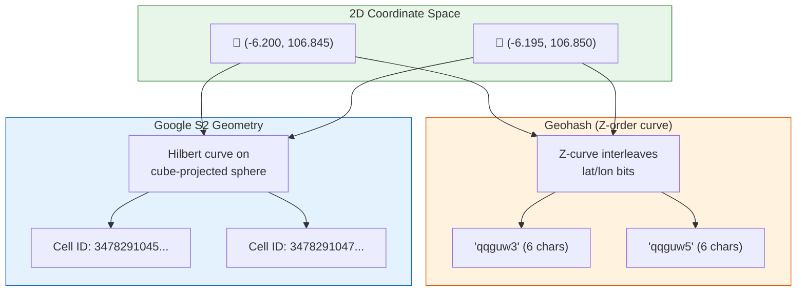
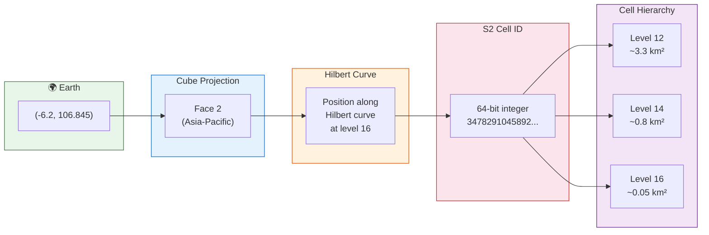
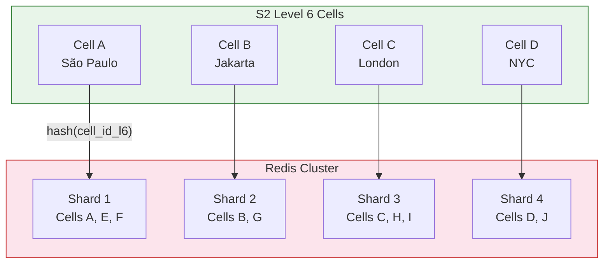

# Chapter 2: Spatial Indexing — Geohash vs. Google S2 🟡

> **The Problem:** A rider requests a car at coordinates (-6.2000, 106.8450). We need to find all available drivers within 2 km. The naive approach — `SELECT * FROM drivers WHERE ABS(lat - (-6.2)) < 0.018 AND ABS(lon - 106.845) < 0.018 AND available = true` — performs a full table scan across 14 million driver rows. Even with a B-tree index on `(lat, lon)`, this range query touches thousands of pages and takes 200+ ms. The dispatch engine needs this answer in under 5 ms. This chapter is about how to make that possible.

---

## 2.1 Why Databases Can't Solve This

### The dimensionality problem

A B-tree index is built for **one-dimensional** range lookups. A query like `WHERE lat BETWEEN -6.20 AND -6.18` is fast. But the moment you add `AND lon BETWEEN 106.84 AND 106.86`, the database faces a choice:

1. **Use the lat index**, find all rows in the lat range, then filter by lon. If many drivers share similar latitudes (they do — think of a highway), this touches millions of rows.
2. **Use a composite index** `(lat, lon)`. Better, but B-trees are still bad at 2D rectangles — the "range within a range" forces a scan of the first key's range.

### Side-by-side comparison

| Approach | Query Time (14M drivers) | Memory | Update Latency |
|---|---|---|---|
| 💥 `WHERE lat/lon BETWEEN` on PostgreSQL | 200–500 ms | Disk-backed | N/A (disk) |
| 💥 PostGIS `ST_DWithin` with R-tree | 20–50 ms | ~2 GB R-tree | ~5 ms per insert |
| 🟡 Geohash prefix scan on Redis | 2–8 ms | ~500 MB | < 1 ms |
| ✅ **S2 cell ID scan on Redis** | **1–5 ms** | **~500 MB** | **< 1 ms** |
| ✅ In-memory quadtree (Rust) | 0.5–2 ms | ~1 GB | < 0.1 ms |

The **key insight**: we need to reduce a 2D proximity problem into a 1D key lookup. That's exactly what **space-filling curves** do.

---

## 2.2 Space-Filling Curves: Mapping 2D to 1D

A space-filling curve visits every point in a 2D plane by traversing a 1D path. By assigning each point a position along this curve, we can use a regular sorted index (B-tree, sorted set) for spatial queries.



---

## 2.3 Geohash Deep Dive

### How it works

Geohash divides the Earth into a grid using interleaved binary subdivision:

1. Split the world into left/right halves (lon). Point in right half → bit `1`.
2. Split the world into top/bottom halves (lat). Point in top half → bit `1`.
3. Repeat, alternating lon/lat, to desired precision.
4. Encode the bit string as a base-32 string.

| Precision | Characters | Cell Size | Use Case |
|---|---|---|---|
| 4 | `qqgu` | ~39 km × 20 km | Country-level bucketing |
| 5 | `qqguw` | ~5 km × 5 km | City neighborhood |
| **6** | **`qqguw3`** | **~1.2 km × 0.6 km** | **Ride dispatch radius** |
| 7 | `qqguw3p` | ~153 m × 153 m | Street-level |
| 8 | `qqguw3pq` | ~38 m × 19 m | Building-level |

### The prefix property

All cells that share a common prefix are spatially close. To find "nearby" cells, we check the target cell and its **8 neighbors** (same prefix level):

```rust,ignore
/// Returns the geohash of the given coordinate and its 8 neighbors.
fn geohash_neighbors(lat: f64, lon: f64, precision: usize) -> Vec<String> {
    let center = geohash::encode(
        geohash::Coord { x: lon, y: lat },
        precision,
    ).unwrap();
    let mut cells = geohash::neighbors(&center).unwrap();
    cells.push(center);
    cells // 9 cells total
}
```

### Geohash's fatal flaw: edge discontinuities

Two points 10 meters apart can have **completely different geohash prefixes** if they happen to straddle a cell boundary. Worse, the Z-order curve that underlies Geohash has *large spatial jumps*:

```
Cell "qqguw3" and Cell "qqguw4" may be adjacent...
  but Cell "qqguw7" and Cell "qqguwh" (next in Z-order)
  might be 5 km apart!
```

This means:
- **You must always query 9 cells** (center + 8 neighbors), even if your radius is tiny.
- At cell boundaries, the neighbor lookup adds overhead and complexity.
- The *locality guarantee* of Geohash is weaker than Hilbert-curve-based systems.

---

## 2.4 Google S2 Geometry: The Superior Choice

### How S2 works

S2 Geometry, developed at Google, uses a fundamentally different approach:

1. **Project the sphere onto a cube** — the Earth is mapped onto 6 faces of a cube (numbered 0–5).
2. **Apply a Hilbert curve** to each cube face — this fills the 2D face with a 1D curve that has *better locality* than the Z-order curve.
3. **Assign a 64-bit cell ID** — encodes the face, the Hilbert curve position, and the level (0–30).



### Why S2 beats Geohash

| Property | Geohash | S2 Geometry |
|---|---|---|
| Curve type | Z-order (Lebesgue) | **Hilbert** (better locality) |
| Cell shape | Rectangle (aspect ratio varies) | **Roughly square** at all levels |
| Boundary handling | 8-neighbor lookup required | **Exact covering** with variable-level cells |
| Precision | Fixed levels (1–12 characters) | **30 levels** (0.7 cm² at max) |
| Pole coverage | ❌ Degenerates at poles | ✅ Uniform via cube projection |
| Cover a circle | 9 cells (often oversized) | **8–20 cells** (tight fit to radius) |
| Cell ID | String (base-32) | **64-bit integer** (faster comparison) |

### The killer feature: `S2RegionCoverer`

Given *any* region (circle, polygon, rectangle), S2 returns a set of cell ID *ranges* that tightly cover it. For "drivers within 2 km":

```rust,ignore
use s2::{
    cellid::CellID,
    region::RegionCoverer,
    cap::Cap,
    latlng::LatLng,
};

/// Returns S2 cell ID ranges covering a circle of given radius around a point.
fn cover_radius(lat: f64, lon: f64, radius_km: f64) -> Vec<CellIDRange> {
    let center = LatLng::from_degrees(lat, lon).to_point();
    // S2 Cap = spherical cap (a circle on a sphere)
    let angle = s2::s1::Angle::from(
        radius_km / 6371.0  // Earth radius in km
    );
    let cap = Cap::from_center_angle(&center, &angle);

    let coverer = RegionCoverer {
        min_level: 12,    // ~3.3 km² cells
        max_level: 16,    // ~216 m² cells
        max_cells: 20,    // at most 20 cells in the covering
        ..Default::default()
    };

    coverer.covering(&cap)
        .into_iter()
        .map(|cell| cell.range_min()..=cell.range_max())
        .collect()
}
```

This produces a **tight covering** — typically 8–12 cells for a 2 km radius — compared to Geohash's fixed 9-cell grid that often over-covers by 300%.

---

## 2.5 The In-Memory Spatial Index on Redis

We store the spatial index in Redis for three reasons:

1. **Sub-millisecond reads** — no disk I/O, no query parsing.
2. **Atomic updates** — a driver's location changes 133K times/sec per city; Redis handles this throughput.
3. **Shared state** — multiple dispatch workers query the same index.

### Data model

```
Key: s2:cell:{cell_id_level14}
Type: Redis Sorted Set
Score: cell_id_level30 (full-precision S2 cell ID as f64)
Member: driver_id

Key: driver:loc:{driver_id}
Type: Redis Hash
Fields: lat, lon, cell_id, heading, speed, updated_at, available
```

### Updating a driver's location

When a smoothed (post-Kalman) GPS ping arrives:

```rust,ignore
use redis::AsyncCommands;

async fn update_driver_location(
    redis: &mut redis::aio::Connection,
    driver_id: u64,
    lat: f64,
    lon: f64,
    heading: f32,
    speed: f32,
) -> anyhow::Result<()> {
    let cell_id = s2::cellid::CellID::from(
        s2::latlng::LatLng::from_degrees(lat, lon)
    );
    let cell_level14 = cell_id.parent(14);
    let cell_level30_score = cell_id.0 as f64;

    // Pipeline: atomic multi-command
    let mut pipe = redis::pipe();

    // 1. Remove from old cell (if the driver moved to a new level-14 cell)
    //    We track the previous cell in the driver hash
    pipe.cmd("HGET")
        .arg(format!("driver:loc:{}", driver_id))
        .arg("cell_id");

    // 2. Add to new cell's sorted set
    pipe.zadd(
        format!("s2:cell:{}", cell_level14.0),
        driver_id,
        cell_level30_score,
    );

    // 3. Update driver metadata
    pipe.hset_multiple(
        format!("driver:loc:{}", driver_id),
        &[
            ("lat", lat.to_string()),
            ("lon", lon.to_string()),
            ("cell_id", cell_level14.0.to_string()),
            ("heading", heading.to_string()),
            ("speed", speed.to_string()),
            ("updated_at", chrono::Utc::now().timestamp().to_string()),
        ],
    );

    pipe.query_async(redis).await?;
    Ok(())
}
```

### Querying nearby drivers

```rust,ignore
/// Find all available drivers within `radius_km` of the given point.
async fn find_nearby_drivers(
    redis: &mut redis::aio::Connection,
    lat: f64,
    lon: f64,
    radius_km: f64,
    limit: usize,
) -> anyhow::Result<Vec<NearbyDriver>> {
    // 1. Get S2 cell covering for the search radius
    let cell_ranges = cover_radius(lat, lon, radius_km);

    let mut driver_ids: Vec<u64> = Vec::new();

    // 2. For each cell range, query the sorted set
    for range in &cell_ranges {
        let cell_level14 = range.start().parent(14);
        let ids: Vec<u64> = redis.zrangebyscore(
            format!("s2:cell:{}", cell_level14.0),
            *range.start() as f64,
            *range.end() as f64,
        ).await?;
        driver_ids.extend(ids);
    }

    // 3. Deduplicate (a driver might appear in overlapping cell ranges)
    driver_ids.sort_unstable();
    driver_ids.dedup();

    // 4. Fetch metadata and filter by availability + exact distance
    let mut result = Vec::new();
    for &did in &driver_ids {
        let info: HashMap<String, String> = redis.hgetall(
            format!("driver:loc:{}", did),
        ).await?;

        let available = info.get("available")
            .map(|v| v == "true")
            .unwrap_or(false);
        if !available {
            continue;
        }

        let d_lat: f64 = info["lat"].parse()?;
        let d_lon: f64 = info["lon"].parse()?;

        // Haversine exact distance check (filter S2 over-covering)
        let dist = haversine_km(lat, lon, d_lat, d_lon);
        if dist <= radius_km {
            result.push(NearbyDriver {
                driver_id: did,
                lat: d_lat,
                lon: d_lon,
                distance_km: dist,
                heading: info["heading"].parse()?,
                speed: info["speed"].parse()?,
            });
        }

        if result.len() >= limit {
            break;
        }
    }

    // 5. Sort by distance
    result.sort_by(|a, b| a.distance_km.partial_cmp(&b.distance_km).unwrap());
    Ok(result)
}
```

---

## 2.6 The Haversine Formula

After the S2 covering gives us *candidate* drivers (fast, approximate), we compute **exact** distances using the Haversine formula:

$$
a = \sin^2\!\left(\frac{\Delta\phi}{2}\right) + \cos\phi_1 \cdot \cos\phi_2 \cdot \sin^2\!\left(\frac{\Delta\lambda}{2}\right)
$$

$$
d = 2R \cdot \arctan2\!\left(\sqrt{a},\, \sqrt{1-a}\right)
$$

Where $\phi$ = latitude, $\lambda$ = longitude, $R$ = Earth's radius (6,371 km).

```rust,ignore
fn haversine_km(lat1: f64, lon1: f64, lat2: f64, lon2: f64) -> f64 {
    let r = 6371.0; // Earth radius in km
    let d_lat = (lat2 - lat1).to_radians();
    let d_lon = (lon2 - lon1).to_radians();
    let lat1 = lat1.to_radians();
    let lat2 = lat2.to_radians();

    let a = (d_lat / 2.0).sin().powi(2)
        + lat1.cos() * lat2.cos() * (d_lon / 2.0).sin().powi(2);
    let c = 2.0 * a.sqrt().atan2((1.0 - a).sqrt());
    r * c
}
```

---

## 2.7 Alternative: In-Memory Quadtree

For ultra-low-latency use cases where Redis's network hop (0.5–1 ms) matters, we can build an in-memory quadtree directly in the dispatch service:

```rust,ignore
/// A point-region quadtree for 2D spatial indexing.
struct QuadTree {
    boundary: BoundingBox,
    points: Vec<DriverPoint>,
    capacity: usize,
    children: Option<Box<[QuadTree; 4]>>, // NW, NE, SW, SE
}

struct BoundingBox {
    center_lat: f64,
    center_lon: f64,
    half_lat: f64,
    half_lon: f64,
}

struct DriverPoint {
    driver_id: u64,
    lat: f64,
    lon: f64,
}

impl QuadTree {
    fn new(boundary: BoundingBox, capacity: usize) -> Self {
        Self {
            boundary,
            points: Vec::with_capacity(capacity),
            capacity,
            children: None,
        }
    }

    fn insert(&mut self, point: DriverPoint) -> bool {
        if !self.boundary.contains(point.lat, point.lon) {
            return false;
        }

        if self.points.len() < self.capacity && self.children.is_none() {
            self.points.push(point);
            return true;
        }

        if self.children.is_none() {
            self.subdivide();
        }

        for child in self.children.as_mut().unwrap().iter_mut() {
            if child.insert(point.clone()) {
                return true;
            }
        }
        false
    }

    fn query_radius(
        &self,
        lat: f64,
        lon: f64,
        radius_km: f64,
        results: &mut Vec<DriverPoint>,
    ) {
        if !self.boundary.intersects_circle(lat, lon, radius_km) {
            return;
        }

        for p in &self.points {
            if haversine_km(lat, lon, p.lat, p.lon) <= radius_km {
                results.push(p.clone());
            }
        }

        if let Some(children) = &self.children {
            for child in children.iter() {
                child.query_radius(lat, lon, radius_km, results);
            }
        }
    }

    fn subdivide(&mut self) {
        let b = &self.boundary;
        let hl = b.half_lat / 2.0;
        let hw = b.half_lon / 2.0;

        let children = [
            QuadTree::new(BoundingBox { // NW
                center_lat: b.center_lat + hl,
                center_lon: b.center_lon - hw,
                half_lat: hl, half_lon: hw,
            }, self.capacity),
            QuadTree::new(BoundingBox { // NE
                center_lat: b.center_lat + hl,
                center_lon: b.center_lon + hw,
                half_lat: hl, half_lon: hw,
            }, self.capacity),
            QuadTree::new(BoundingBox { // SW
                center_lat: b.center_lat - hl,
                center_lon: b.center_lon - hw,
                half_lat: hl, half_lon: hw,
            }, self.capacity),
            QuadTree::new(BoundingBox { // SE
                center_lat: b.center_lat - hl,
                center_lon: b.center_lon + hw,
                half_lat: hl, half_lon: hw,
            }, self.capacity),
        ];

        self.children = Some(Box::new(children));

        // Re-insert existing points into children
        let old_points = std::mem::take(&mut self.points);
        for p in old_points {
            for child in self.children.as_mut().unwrap().iter_mut() {
                if child.insert(p.clone()) {
                    break;
                }
            }
        }
    }
}
```

### When to use which

| Scenario | Recommendation |
|---|---|
| Multi-service architecture (dispatch + ETA + surge pricing all need location) | ✅ Redis with S2 (shared state) |
| Single monolithic dispatch engine | ✅ In-memory quadtree (lowest latency) |
| Need to persist driver locations across restarts | ✅ Redis (durable) |
| Sub-microsecond queries for real-time gaming | ✅ Quadtree with arena allocation |

---

## 2.8 Redis Cluster Topology for Spatial Data

### Sharding strategy

We shard by **S2 cell at level 6** (~50,000 km² per cell). This means all drivers within a large metro area hit the same Redis shard, ensuring that a spatial query never crosses shard boundaries for typical dispatch radii (< 10 km).



### Memory estimation

| City | Active Drivers | Redis Memory (per shard) |
|---|---|---|
| São Paulo | 600K | ~120 MB |
| Jakarta | 400K | ~80 MB |
| London | 150K | ~30 MB |
| Total (600 cities) | 14M | ~2.8 GB across 16 shards |

Each driver entry: 8 bytes (sorted set score) + 8 bytes (member) + 200 bytes (hash metadata) ≈ 216 bytes.

---

## 2.9 Comparative: Naive SQL GIS vs. In-Memory S2

| | 💥 Naive SQL GIS | ✅ In-Memory S2 + Redis |
|---|---|---|
| **Query** | `SELECT * FROM drivers WHERE ST_DWithin(geom, point, 2000)` | `ZRANGEBYSCORE s2:cell:X min max` for 8–12 cells |
| **Index** | R-tree on disk (PostGIS) | Sorted sets in RAM |
| **Latency** | 20–200 ms | **1–5 ms** |
| **Update cost** | `UPDATE` + R-tree rebalance (~5 ms) | `ZADD` + `HSET` (< 1 ms) |
| **Scale** | Single node with replicas | **Horizontally sharded** |
| **Covering** | Exact (ST_DWithin handles it) | Two-phase: S2 covering → Haversine exact |
| **Memory** | Disk-backed (GB on SSD) | **~200 MB per city** |
| **Pole handling** | ✅ (geometry types) | ✅ (S2 cube projection) |

---

## 2.10 H3: The Newcomer

Uber's H3 (Hexagonal Hierarchical Spatial Index) deserves mention. It uses hexagonal cells with 16 resolution levels:

| Resolution | Avg Area | Edge Length | Use Case |
|---|---|---|---|
| 7 | 5.16 km² | 1.22 km | Surge pricing zones |
| **9** | **0.105 km²** | **174 m** | **Ride dispatch** |
| 11 | 0.002 km² | 24 m | Street-level features |

**Pros**: Hexagons have uniform adjacency (6 neighbors, all equidistant) — better than Geohash's 8 neighbors with varying distances. **Cons**: No native Hilbert curve locality; cell IDs are 64-bit but encode differently than S2.

For ride dispatch, both S2 and H3 work well. We use S2 in this book because it's the battle-tested choice at Google Maps-scale.

---

## Exercises

### Exercise 1: S2 Covering Visualization

Write a program that takes a (lat, lon, radius_km) tuple and outputs the S2 cells covering that circle as GeoJSON polygons. Visualize them on [geojson.io](https://geojson.io).

<details>
<summary>Hint</summary>

Use the `s2` Rust crate's `RegionCoverer` with `max_cells: 20`, levels 12–16. Convert each `CellID` to 4 corner lat/lons using `cell.vertex(i)` and output a GeoJSON `FeatureCollection` of `Polygon` features.

</details>

### Exercise 2: Benchmark S2 vs. Geohash

Generate 100,000 random driver locations within a bounding box. Benchmark the time to:
1. Index all 100K drivers.
2. Find all drivers within 2 km of 1,000 random query points.

Compare Geohash (prefix + 8 neighbors) vs. S2 (RegionCoverer) vs. quadtree.

<details>
<summary>Expected Results</summary>

On a modern machine, S2 and quadtree should be within 2x of each other for query time (microsecond-scale). Geohash will be slightly faster for indexing (simple string prefix) but slower for queries due to over-covering. The main difference is *accuracy* — S2 produces tighter coverings.

</details>

---

> **Key Takeaways**
>
> 1. **Never use raw lat/lon range queries** on a relational database for real-time spatial lookups. They're O(n) scans that don't scale past thousands of rows.
> 2. **Space-filling curves** (Geohash, S2, H3) reduce 2D proximity to 1D range queries, enabling use of standard sorted indexes.
> 3. **S2 Geometry with Hilbert curves** offers better locality, tighter coverings, and uniform cell shapes compared to Geohash's Z-order curve.
> 4. **Two-phase querying** — fast approximate candidates from S2 cell ranges, then exact Haversine filtering — gives sub-5ms latency on millions of drivers.
> 5. **Redis Sorted Sets** indexed by S2 cell IDs provide the sweet spot of shared state, atomic updates, and sub-millisecond operations.
> 6. **Shard by large S2 cells** (level 6) so spatial queries within a city never cross shard boundaries.
