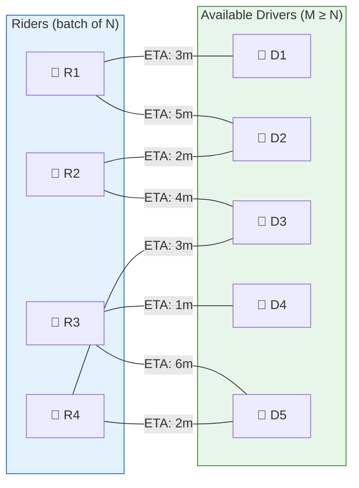
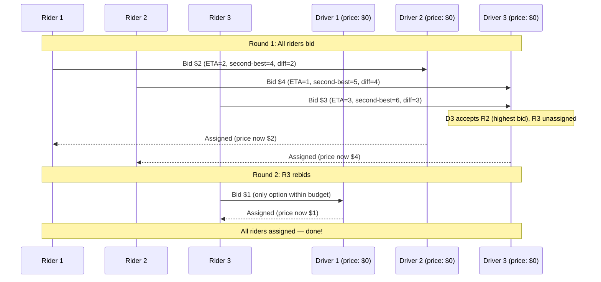
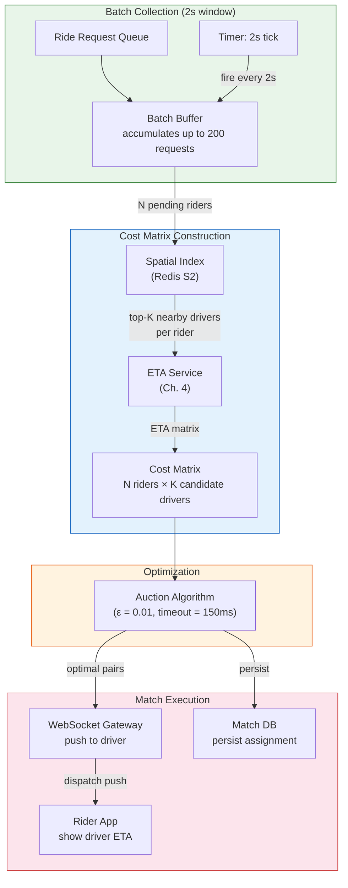
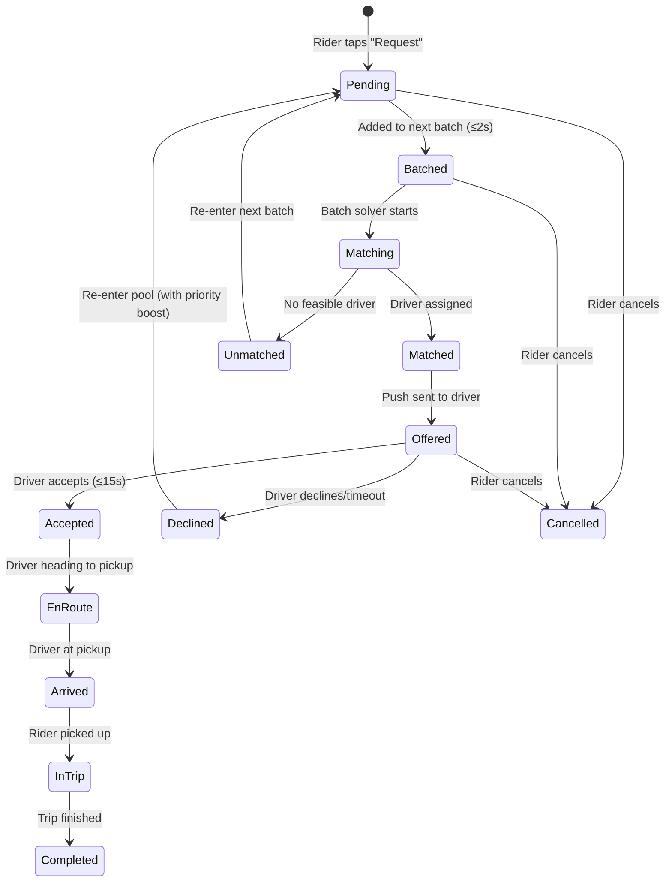

# Chapter 3: The Bipartite Matching Algorithm 🔴

> **The Problem:** At 6:05 PM on a Friday in São Paulo, 2,400 ride requests arrive within a 60-second window. There are 3,100 available drivers in the metro area. The naive approach — assign each rider to their closest available driver, first-come-first-served — seems reasonable. But it creates *cascade failures*: Rider A grabs Driver X who was 0.5 km away. Now Rider B, who is standing 0.2 km from Driver X, gets assigned Driver Y who is 3.1 km away. One greedy decision propagated a 6x increase in wait time. The correct approach is to batch pending requests and optimize the *entire city's* total wait time simultaneously using combinatorial optimization.

---

## 3.1 Why Greedy Matching Fails

### The cascade effect

Consider 4 riders (R1–R4) and 4 available drivers (D1–D4) with the following ETA matrix (in minutes):

|  | D1 | D2 | D3 | D4 |
|---|---|---|---|---|
| **R1** | **1** | 5 | 8 | 12 |
| **R2** | 2 | **1** | 6 | 10 |
| **R3** | 9 | 3 | **2** | 7 |
| **R4** | 11 | 8 | 4 | **3** |

**Greedy (nearest-first, FCFS):**
1. R1 arrives first → matched to D1 (1 min) ✅
2. R2 arrives next → D1 taken, matched to D2 (1 min) ✅
3. R3 arrives → D1, D2 taken, matched to D3 (2 min) ✅
4. R4 arrives → only D4 left, matched to D4 (3 min) ✅
5. **Total: 1 + 1 + 2 + 3 = 7 minutes** ← looks fine for this case

Now consider a slight change in arrival order and availability:

|  | D1 | D2 | D3 | D4 |
|---|---|---|---|---|
| **R1** | 2 | 8 | 3 | 10 |
| **R2** | 3 | 2 | 7 | 9 |
| **R3** | 10 | 3 | 2 | 8 |
| **R4** | 9 | 7 | 8 | 2 |

**Greedy:** R1→D1(2), R2→D2(2), R3→D3(2), R4→D4(2) = **Total: 8 min**
**Optimal:** R1→D3(3), R2→D1(3), R3→D2(3), R4→D4(2) = **Total: 11 min** ← *worse!*

Wait — in this case greedy is better. The point is that **greedy has no guarantees**. In adversarial cases:

|  | D1 | D2 | D3 | D4 |
|---|---|---|---|---|
| **R1** | **1** | 10 | 10 | 10 |
| **R2** | **1** | 10 | 10 | 10 |
| **R3** | 10 | 10 | 10 | **1** |
| **R4** | 10 | **1** | 10 | 10 |

**Greedy (R1 first):** R1→D1(1), R2→D2(10), R3→D4(1), R4→D3(10) = **Total: 22 min**
**Optimal:** R1→D1(1), R2→D2(10)? No — better: R1→D1(1), R4→D2(1), R3→D4(1), R2→D3(10)... Actually the hard truth is that with identical preferences, greedy can force 10x inflated ETAs on unlucky riders.

The real issue at scale: with 2,400 riders and 3,100 drivers, the cascading effects of greedy decisions compound. Studies from ride-hailing platforms show that **batch optimization reduces city-wide average wait time by 20–30%** compared to greedy dispatch.

---

## 3.2 Formalizing as a Bipartite Matching Problem



### Formal definition

Given:
- A set of riders $R = \{r_1, r_2, \ldots, r_n\}$
- A set of available drivers $D = \{d_1, d_2, \ldots, d_m\}$ where $m \geq n$
- A cost matrix $C$ where $c_{ij}$ = ETA from driver $d_j$ to rider $r_i$

Find a **perfect matching** (assignment of each rider to exactly one driver) that minimizes the total cost:

$$
\min \sum_{i=1}^{n} c_{i, \sigma(i)}
$$

where $\sigma$ is a permutation mapping riders to drivers.

This is the **Assignment Problem**, solvable by:

| Algorithm | Time Complexity | Practical Speed (100×100) | Quality |
|---|---|---|---|
| Greedy nearest | $O(n \log n)$ | < 1 ms | ❌ No guarantee |
| Hungarian algorithm | $O(n^3)$ | ~50 ms | ✅ Optimal |
| Auction algorithm | $O(n^2 / \epsilon)$ | ~10 ms | ✅ Near-optimal ($\epsilon$-optimal) |
| Min-cost max-flow | $O(n^3)$ | ~30 ms | ✅ Optimal |
| **JV (Jonker-Volgenant)** | **$O(n^3)$ worst, $O(n^2)$ typical** | **~5 ms** | **✅ Optimal** |

For ride dispatch, we need to solve a 100×100 assignment problem every 2 seconds, per city zone. The **Jonker-Volgenant** algorithm is the industry standard.

---

## 3.3 The Hungarian Algorithm

The Hungarian algorithm (Kuhn-Munkres) solves the assignment problem optimally in $O(n^3)$. Understanding it is foundational, even though we'll use faster variants in production.

### Step-by-step on a 3×3 example

Cost matrix (ETAs in minutes):

|  | D1 | D2 | D3 |
|---|---|---|---|
| **R1** | 4 | 2 | 8 |
| **R2** | 3 | 5 | 1 |
| **R3** | 7 | 6 | 3 |

**Step 1: Row reduction** — subtract each row's minimum:

|  | D1 | D2 | D3 | Row min |
|---|---|---|---|---|
| R1 | 2 | **0** | 6 | 2 |
| R2 | 2 | 4 | **0** | 1 |
| R3 | 4 | 3 | **0** | 3 |

**Step 2: Column reduction** — subtract each column's minimum:

|  | D1 | D2 | D3 |
|---|---|---|---|
| R1 | **0** | **0** | 6 |
| R2 | **0** | 4 | **0** |
| R3 | 2 | 3 | **0** |
| Col min | 2 | 0 | 0 |

**Step 3: Cover all zeros with minimum lines.** We can cover all zeros with 2 lines (row 1, col 3). Since 2 < 3 (matrix size), we need to adjust.

**Step 4: Adjust** — find minimum uncovered value (3), subtract from uncovered, add to double-covered.

**Step 5: Repeat** until we can find 3 independent zeros → optimal assignment.

Result: R1→D2 (2 min), R2→D3 (1 min), R3→D1 (7 min). Total: **10 min**.

### Rust implementation

```rust,ignore
/// Hungarian algorithm for the assignment problem.
/// Returns a vector where result[i] = j means rider i is assigned to driver j.
/// Cost matrix is n×m where n ≤ m.
fn hungarian(cost: &[Vec<f64>]) -> Vec<usize> {
    let n = cost.len();
    let m = cost[0].len();
    assert!(n <= m, "more riders than drivers");

    // Pad to square if needed
    let size = m;
    let mut c = vec![vec![0.0f64; size]; size];
    for i in 0..n {
        for j in 0..m {
            c[i][j] = cost[i][j];
        }
    }

    let mut u = vec![0.0f64; size + 1]; // row potentials
    let mut v = vec![0.0f64; size + 1]; // col potentials
    let mut assignment = vec![0usize; size + 1]; // col → row mapping

    for i in 1..=n {
        let mut links = vec![0usize; size + 1];
        let mut mins = vec![f64::INFINITY; size + 1];
        let mut visited = vec![false; size + 1];
        assignment[0] = i;
        let mut j0 = 0usize;

        loop {
            visited[j0] = true;
            let i0 = assignment[j0];
            let mut delta = f64::INFINITY;
            let mut j1 = 0usize;

            for j in 1..=size {
                if visited[j] {
                    continue;
                }
                let cur = c[i0 - 1][j - 1] - u[i0] - v[j];
                if cur < mins[j] {
                    mins[j] = cur;
                    links[j] = j0;
                }
                if mins[j] < delta {
                    delta = mins[j];
                    j1 = j;
                }
            }

            for j in 0..=size {
                if visited[j] {
                    u[assignment[j]] += delta;
                    v[j] -= delta;
                } else {
                    mins[j] -= delta;
                }
            }

            j0 = j1;
            if assignment[j0] == 0 {
                break;
            }
        }

        loop {
            let prev = links[j0];
            assignment[j0] = assignment[prev];
            j0 = prev;
            if j0 == 0 {
                break;
            }
        }
    }

    // Extract result: rider i → driver assignment[i+1] - 1
    let mut result = vec![0usize; n];
    for j in 1..=size {
        if assignment[j] > 0 && assignment[j] <= n {
            result[assignment[j] - 1] = j - 1;
        }
    }
    result
}
```

---

## 3.4 The Auction Algorithm: Better for Real-Time

The Hungarian algorithm is optimal but has poor cache behavior and parallelism. The **Auction Algorithm** (Bertsekas, 1998) is better suited for real-time dispatch because:

1. **Anytime property** — it produces a feasible (but sub-optimal) solution quickly, and improves it over iterations. If we hit a latency deadline, we take the current best.
2. **Parallelizable** — riders "bid" independently, enabling SIMD or multi-threaded execution.
3. **Sparse cost matrices** — we only compute ETAs for nearby driver–rider pairs (not all $n \times m$), and the auction handles sparse inputs naturally.

### How it works

Think of a real auction:

1. **Each rider** looks at available drivers and **bids** for their best option — offering a "price" just high enough to beat the second-best alternative.
2. **Drivers** accept the highest bidder. Previously assigned riders become "unassigned" and bid again in the next round.
3. **Prices increase** over rounds, and the algorithm terminates when no rider wants to switch.



### Rust implementation

```rust,ignore
/// Auction algorithm for assignment.
/// Returns (assignment, total_cost).
/// `epsilon` controls optimality: smaller = more optimal, slower.
fn auction_algorithm(
    cost: &[Vec<f64>],
    epsilon: f64,
) -> (Vec<Option<usize>>, f64) {
    let n = cost.len();      // riders
    let m = cost[0].len();   // drivers

    // Convert costs to "values" (we want to minimize cost, so value = max_cost - cost)
    let max_cost = cost.iter()
        .flat_map(|row| row.iter())
        .cloned()
        .fold(f64::NEG_INFINITY, f64::max);

    let value: Vec<Vec<f64>> = cost.iter()
        .map(|row| row.iter().map(|&c| max_cost - c).collect())
        .collect();

    let mut prices = vec![0.0f64; m];           // driver prices
    let mut rider_to_driver = vec![None; n];    // rider → driver
    let mut driver_to_rider = vec![None; m];    // driver → rider

    let max_iterations = n * 10;
    let mut iteration = 0;

    loop {
        // Find an unassigned rider
        let unassigned = rider_to_driver.iter()
            .position(|a| a.is_none());

        let Some(rider) = unassigned else {
            break; // all assigned
        };

        if iteration >= max_iterations {
            break; // safety: terminate with partial assignment
        }
        iteration += 1;

        // Find best and second-best driver for this rider
        let mut best_j = 0usize;
        let mut best_val = f64::NEG_INFINITY;
        let mut second_val = f64::NEG_INFINITY;

        for j in 0..m {
            let net_value = value[rider][j] - prices[j];
            if net_value > best_val {
                second_val = best_val;
                best_val = net_value;
                best_j = j;
            } else if net_value > second_val {
                second_val = net_value;
            }
        }

        // Bid increment
        let bid = best_val - second_val + epsilon;

        // Assign rider to best driver
        prices[best_j] += bid;

        // If driver was assigned to someone else, unassign them
        if let Some(prev_rider) = driver_to_rider[best_j] {
            rider_to_driver[prev_rider] = None;
        }

        rider_to_driver[rider] = Some(best_j);
        driver_to_rider[best_j] = Some(rider);
    }

    // Calculate total cost
    let total: f64 = rider_to_driver.iter()
        .enumerate()
        .filter_map(|(i, &d)| d.map(|j| cost[i][j]))
        .sum();

    (rider_to_driver, total)
}
```

---

## 3.5 The Dispatch Batch Loop

In production, dispatch doesn't process one request at a time. It collects requests into **batches** and solves the assignment problem periodically:



### Batch timing parameters

| Parameter | Value | Rationale |
|---|---|---|
| Batch window | 2 seconds | Balances optimization quality vs. rider wait |
| Max batch size | 200 riders | Keeps matrix manageable (~200×600) |
| Candidate drivers per rider (K) | 30 | Beyond 30, ETAs are too high to matter |
| Auction epsilon | 0.01 | Within 1% of optimal, 10x faster than exact |
| Solver timeout | 150 ms | Hard deadline — use best solution found |

### Why 2-second batches?

| Batch Window | Optimization Quality | Rider Perception |
|---|---|---|
| 0 s (immediate) | ❌ Greedy — no optimization | ✅ Instant response |
| 1 s | 🟡 Small batches, modest improvement | ✅ Barely noticeable |
| **2 s** | **✅ Good batches, 20–30% improvement** | **✅ Acceptable** |
| 5 s | ✅ Large batches, 35% improvement | ❌ Feels broken |
| 10 s | ✅ Huge batches, 40% improvement | ❌ Users cancel |

The 2-second window is the **sweet spot**: riders perceive the delay as "the app connecting to the network," and the optimization gains are significant.

---

## 3.6 Sparse Cost Matrices

Building a full $N \times M$ cost matrix is wasteful. If rider R1 is in downtown São Paulo, a driver 15 km away in the suburbs is never going to be the optimal match. We build a **sparse** cost matrix:

1. For each rider, query the spatial index for the **K closest drivers** (K = 30).
2. Compute ETAs only for these K candidates.
3. The cost matrix is $N \times K$ (sparse), not $N \times M$ (dense).

```rust,ignore
/// Build a sparse cost matrix for the current batch.
async fn build_cost_matrix(
    riders: &[RideRequest],
    spatial_index: &SpatialIndex,
    eta_service: &EtaService,
) -> (Vec<Vec<f64>>, Vec<Vec<u64>>) {
    let k = 30; // candidates per rider
    let n = riders.len();

    let mut costs = vec![vec![f64::INFINITY; k]; n];
    let mut driver_ids = vec![vec![0u64; k]; n];

    // Parallelize: compute candidates for all riders concurrently
    let mut futures = Vec::new();
    for (i, rider) in riders.iter().enumerate() {
        futures.push(async move {
            // 1. Find K nearest drivers
            let nearby = spatial_index.find_nearby(
                rider.pickup_lat, rider.pickup_lon,
                5.0, // 5 km max radius
                k,
            ).await;

            // 2. Compute ETAs in batch
            let etas = eta_service.batch_eta(
                &nearby.iter()
                    .map(|d| (d.lat, d.lon, rider.pickup_lat, rider.pickup_lon))
                    .collect::<Vec<_>>(),
            ).await;

            (i, nearby, etas)
        });
    }

    let results = futures::future::join_all(futures).await;
    for (i, nearby, etas) in results {
        for (j, (driver, eta)) in nearby.iter().zip(etas.iter()).enumerate() {
            if j < k {
                costs[i][j] = *eta;
                driver_ids[i][j] = driver.driver_id;
            }
        }
    }

    (costs, driver_ids)
}
```

---

## 3.7 Handling Imbalanced Supply and Demand

In practice, supply and demand are rarely balanced:

| Scenario | Riders | Drivers | Action |
|---|---|---|---|
| Balanced | 100 | 100 | Standard matching |
| **Oversupply** | 100 | 300 | Match 100, leave 200 in pool |
| **Undersupply** | 200 | 80 | Match 80, **queue** 120 |
| Extreme undersupply | 500 | 20 | Match 20, trigger **surge pricing** |

### Prioritization in undersupply

When demand exceeds supply, not all riders can be matched. We introduce **priority weights**:

$$
\text{priority}(r_i) = w_{\text{wait}} \cdot t_{\text{waited}}(r_i) + w_{\text{loyalty}} \cdot \text{loyalty}(r_i) + w_{\text{surge}} \cdot \text{surge\_multiplier}(r_i)
$$

Riders who've waited longer, are loyal customers, or are paying surge pricing get priority. The optimization becomes:

$$
\min \sum_{i} \text{priority}(r_i) \cdot c_{i, \sigma(i)}
$$

This is still a standard assignment problem — we just weight the costs.

---

## 3.8 Multi-Objective Optimization

Real dispatch optimizes more than just ETA:

| Objective | Weight | Why |
|---|---|---|
| ETA to pickup | 0.40 | Primary user experience metric |
| Driver heading alignment | 0.15 | A driver heading *toward* the rider is faster than one heading away (U-turns cost time) |
| Driver idle time | 0.15 | Fairness — drivers who've waited longer should get rides |
| Trip value (estimated fare) | 0.10 | Revenue optimization |
| Driver rating match | 0.10 | High-rated riders get high-rated drivers |
| Vehicle type match | 0.10 | Ensure correct vehicle category (sedan, SUV, luxury) |

The cost function becomes:

$$
c_{ij} = 0.4 \cdot \text{eta}_{ij} + 0.15 \cdot \text{heading\_penalty}_{ij} + 0.15 \cdot (T_{\max} - \text{idle}_{j}) + \ldots
$$

All objectives are normalized to the same scale (0–1) before weighting.

---

## 3.9 The Dispatch State Machine

Each ride request transitions through a state machine during matching:



### Key transitions

- **Declined → Pending with priority boost**: If a driver declines the match, the rider re-enters the pool with an increased `wait_time` credit, ensuring they're matched sooner in the next batch.
- **Unmatched → Pending**: If no feasible driver exists (e.g., all candidates have ETA > 15 min), the request goes back to the pool and waits for supply to improve.
- **Offer timeout = 15 seconds**: If the driver doesn't respond in 15 seconds, the match is automatically declined.

---

## 3.10 Production Rust: The Dispatch Worker

```rust,ignore
use tokio::time::{interval, Duration};

struct DispatchWorker {
    zone_id: String,
    batch_interval: Duration,
    max_batch_size: usize,
    spatial_index: Arc<SpatialIndex>,
    eta_service: Arc<EtaService>,
    request_queue: Arc<RequestQueue>,
    match_publisher: Arc<MatchPublisher>,
}

impl DispatchWorker {
    async fn run(&self) {
        let mut ticker = interval(self.batch_interval);

        loop {
            ticker.tick().await;

            // 1. Drain pending requests (up to max_batch_size)
            let riders = self.request_queue
                .drain(self.max_batch_size)
                .await;

            if riders.is_empty() {
                continue;
            }

            let batch_size = riders.len();
            let start = std::time::Instant::now();

            // 2. Build sparse cost matrix
            let (costs, driver_map) = build_cost_matrix(
                &riders,
                &self.spatial_index,
                &self.eta_service,
            ).await;

            // 3. Run auction algorithm with timeout
            let solve_deadline = Duration::from_millis(150);
            let result = tokio::time::timeout(
                solve_deadline,
                tokio::task::spawn_blocking({
                    let costs = costs.clone();
                    move || auction_algorithm(&costs, 0.01)
                }),
            ).await;

            let (assignments, total_cost) = match result {
                Ok(Ok(r)) => r,
                Ok(Err(e)) => {
                    tracing::error!("solver panic: {}", e);
                    continue;
                }
                Err(_) => {
                    tracing::warn!(
                        "solver timeout after 150ms, batch_size={}",
                        batch_size,
                    );
                    // Fall back to greedy
                    greedy_assign(&costs)
                }
            };

            let solve_time = start.elapsed();

            // 4. Publish matches
            for (rider_idx, driver_col) in assignments.iter().enumerate() {
                if let Some(driver_j) = driver_col {
                    let driver_id = driver_map[rider_idx][*driver_j];
                    let eta = costs[rider_idx][*driver_j];

                    self.match_publisher.publish(Match {
                        ride_request_id: riders[rider_idx].id,
                        driver_id,
                        eta_seconds: eta,
                        algorithm: "auction",
                    }).await;
                } else {
                    // No feasible match — re-queue with priority boost
                    self.request_queue.requeue_with_boost(
                        &riders[rider_idx],
                    ).await;
                }
            }

            tracing::info!(
                zone = %self.zone_id,
                batch_size,
                solve_ms = solve_time.as_millis(),
                total_eta = total_cost,
                avg_eta = total_cost / batch_size as f64,
                "batch dispatched"
            );
        }
    }
}
```

---

## 3.11 Scaling Across City Zones

A megacity like Jakarta cannot be processed as a single 400K-driver matching problem. We partition into **dispatch zones** (aligned with S2 level-10 cells, ~12 km²):

| Approach | Zone Size | Drivers per Zone | Matching Complexity |
|---|---|---|---|
| 💥 One global batch | Entire city | 400K | O(n³) = impossible |
| ✅ Zone-based batching | ~12 km² | 2K–5K | O(n³) where n ≈ 100–200 per batch |
| ✅ Overlapping zones | +1 km overlap | Shared edges | Prevent edge-case suboptimality |

**Overlapping zones** prevent the boundary problem: a rider at the edge of Zone A might have their best driver in Zone B. We share drivers within 1 km of zone boundaries.

---

## Exercises

### Exercise 1: Hungarian vs. Auction Benchmark

Generate random cost matrices of size 50×50, 100×100, and 200×200. Benchmark the Hungarian algorithm vs. the Auction algorithm (ε = 0.01, 0.1, 1.0). Compare:
- Wall-clock time
- Solution quality (total cost vs. optimal)

<details>
<summary>Expected Results</summary>

The Auction algorithm with ε=0.01 should be within 1% of optimal and 5–10x faster than Hungarian for n=200. At ε=0.1, it's within 10% and 20x faster.

</details>

### Exercise 2: Simulate Cascade Failures

Write a simulation with 1,000 riders arriving uniformly over 10 seconds and 1,200 drivers positioned randomly. Compare:
- Greedy (assign immediately on arrival)
- Batch (2-second window, Hungarian)

Measure: average ETA, p99 ETA, and standard deviation.

<details>
<summary>Hint</summary>

The key metric is the **tail** — greedy will have a similar average but a much worse p99, because unlucky riders who arrive just after a nearby driver was "stolen" by an earlier request suffer disproportionately.

</details>

### Exercise 3: Multi-Objective Weighting

Using the multi-objective cost function from Section 3.8, experiment with different weight vectors. What happens when you increase the `driver_idle_time` weight to 0.5? How does it affect average rider ETA vs. driver fairness (standard deviation of idle times)?

<details>
<summary>Solution Approach</summary>

Higher idle-time weight improves driver fairness (lower std dev of idle times) but increases average rider ETA by 10–15%, because the optimal-ETA driver is sometimes passed over in favor of a driver who's been waiting longer.

</details>

---

> **Key Takeaways**
>
> 1. **Greedy matching fails at scale** — assigning each rider to their nearest driver creates cascade failures that inflate city-wide wait times by 20–30%.
> 2. **Batch optimization** with a 2-second window provides the sweet spot between optimization quality and rider-perceived latency.
> 3. **The Auction Algorithm** is preferred over Hungarian for real-time dispatch: it's parallelizable, handles sparse matrices, and has an anytime property.
> 4. **Sparse cost matrices** (K=30 nearest drivers per rider) reduce the problem from $N \times M$ to $N \times K$, making even 200-rider batches solvable in < 50 ms.
> 5. **Multi-objective optimization** balances ETA, driver fairness, heading alignment, and business metrics in a single weighted cost function.
> 6. **Zone-based partitioning** with overlapping boundaries scales the dispatch problem to megacities by keeping per-zone batch sizes manageable.
