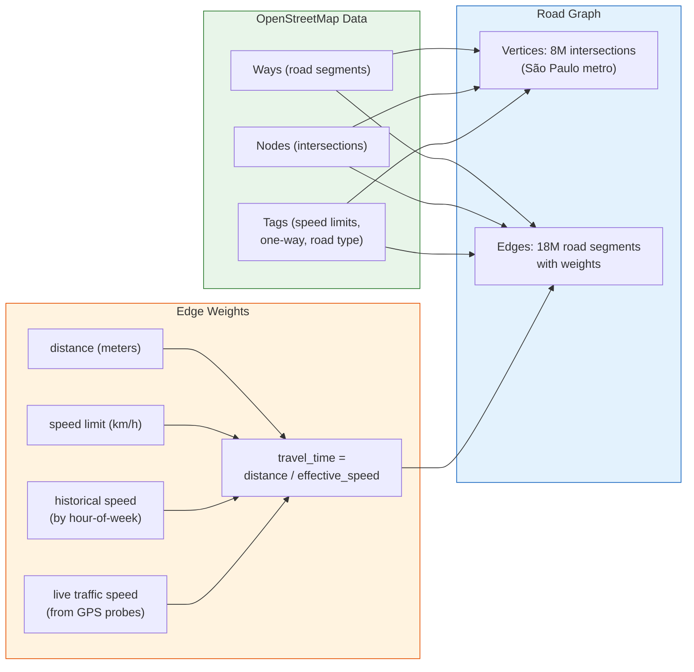
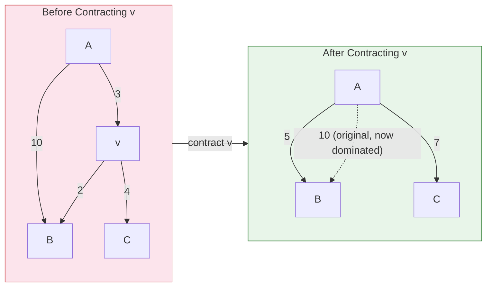
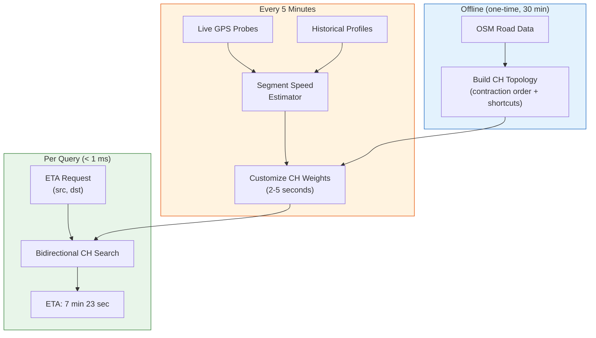

# Chapter 4: ETAs and the Routing Graph 🔴

> **The Problem:** Driver A is 1.2 km away from the rider — straight line. Driver B is 3.5 km away. The naive system dispatches Driver A. But Driver A is across a river, and the only bridge is 4 km upstream during rush hour. Actual ETA: 18 minutes. Driver B is on the same side of the river, on a clear arterial road. Actual ETA: 4 minutes. **Distance does not equal time.** The dispatch engine is only as good as its ETA computations, and computing accurate ETAs at scale — 100,000 queries per second, each answered in under 10 ms — requires a dedicated routing engine built on a preprocessed road graph.

---

## 4.1 Why Euclidean Distance Fails

### The gap between distance and time

| Scenario | Straight-Line Distance | Actual Road Distance | Actual ETA |
|---|---|---|---|
| Same side of highway, no turns | 1.0 km | 1.2 km | 2 min |
| Across a one-way grid (Manhattan) | 1.0 km | 1.8 km | 6 min |
| Across a river (bridge detour) | 1.0 km | 5.4 km | 14 min |
| Across a highway (no exit nearby) | 0.3 km | 4.2 km | 10 min |
| Through a construction zone | 2.0 km | 2.2 km | 25 min |

Euclidean distance has essentially **zero correlation** with travel time in urban environments. Even Haversine distance (which accounts for the Earth's curvature) tells you nothing about roads, one-way streets, bridges, traffic signals, and congestion.

### The cost of wrong ETAs

| ETA Source | Accuracy | Impact on Dispatch |
|---|---|---|
| 💥 Euclidean distance / 30 km/h | ±200–500% error | Matches drivers across rivers |
| 💥 Haversine × 1.4 (manhattan factor) | ±50–100% error | Better, but ignores one-ways and traffic |
| 🟡 OSRM (Open Source Routing Machine) | ±10–20% error | Good, but no live traffic |
| ✅ **Custom routing engine with live traffic** | **±5–10% error** | **Production-grade** |

Every 1% improvement in ETA accuracy translates to ~0.5% reduction in city-wide average wait time, because the matching algorithm makes better decisions.

---

## 4.2 The Road Network as a Graph

OpenStreetMap (OSM) provides the raw road data. We convert it into a weighted directed graph:



### Graph model

```rust,ignore
/// A directed road graph optimized for routing queries.
struct RoadGraph {
    /// Adjacency list: for each vertex, a list of outgoing edges.
    adj: Vec<Vec<Edge>>,
    /// Vertex coordinates (for A* heuristic).
    coords: Vec<(f64, f64)>,  // (lat, lon)
    /// Total number of vertices.
    num_vertices: usize,
}

struct Edge {
    target: u32,           // target vertex ID
    distance_m: u32,       // distance in meters
    base_travel_time_ms: u32, // travel time at speed limit
    road_class: RoadClass, // for Contraction Hierarchies ordering
}

#[derive(Clone, Copy, PartialEq, Eq, PartialOrd, Ord)]
enum RoadClass {
    Motorway,      // highest priority in contraction
    Trunk,
    Primary,
    Secondary,
    Tertiary,
    Residential,
    Service,       // lowest priority
}
```

### Scale of the graph

| City | OSM Vertices | OSM Edges | Graph File Size |
|---|---|---|---|
| São Paulo | 8.2M | 18.4M | ~1.2 GB |
| Jakarta | 5.1M | 11.3M | ~0.8 GB |
| London | 6.8M | 15.1M | ~1.0 GB |
| **Global** | **~800M** | **~2B** | **~120 GB** |

A global graph doesn't fit in a single machine's RAM. We partition by metro area and route within partitions (99% of dispatch queries are intra-city).

---

## 4.3 Dijkstra's Algorithm: The Baseline

The textbook shortest-path algorithm. It's correct but too slow for production:

```rust,ignore
use std::collections::BinaryHeap;
use std::cmp::Reverse;

/// Standard Dijkstra: finds shortest path from src to dst.
/// Returns travel time in milliseconds.
fn dijkstra(
    graph: &RoadGraph,
    src: u32,
    dst: u32,
) -> Option<u32> {
    let n = graph.num_vertices;
    let mut dist = vec![u32::MAX; n];
    let mut heap = BinaryHeap::new();

    dist[src as usize] = 0;
    heap.push(Reverse((0u32, src)));

    while let Some(Reverse((cost, u))) = heap.pop() {
        if u == dst {
            return Some(cost);
        }
        if cost > dist[u as usize] {
            continue; // stale entry
        }
        for edge in &graph.adj[u as usize] {
            let new_cost = cost + edge.base_travel_time_ms;
            if new_cost < dist[edge.target as usize] {
                dist[edge.target as usize] = new_cost;
                heap.push(Reverse((new_cost, edge.target)));
            }
        }
    }
    None
}
```

### Performance on São Paulo's graph

| Query Type | Vertices Explored | Time |
|---|---|---|
| Short trip (2 km) | ~50,000 | ~15 ms |
| Medium trip (10 km) | ~500,000 | ~150 ms |
| Long trip (30 km) | ~2,000,000 | ~600 ms |

That's **way too slow**. The dispatch engine needs 100K ETA computations per second, each under 10 ms. Dijkstra explores too many vertices because it expands in all directions equally (a "circle" of explored vertices).

---

## 4.4 A* Search: Better, But Not Enough

A* uses a heuristic to guide the search toward the destination:

$$
f(v) = g(v) + h(v)
$$

Where $g(v)$ is the known cost from source to $v$, and $h(v)$ is the estimated cost from $v$ to destination (we use Haversine distance ÷ max road speed as a lower bound).

```rust,ignore
fn astar(
    graph: &RoadGraph,
    src: u32,
    dst: u32,
) -> Option<u32> {
    let n = graph.num_vertices;
    let mut g = vec![u32::MAX; n];
    let mut heap = BinaryHeap::new();
    let (dst_lat, dst_lon) = graph.coords[dst as usize];

    // Heuristic: Haversine distance / max_speed (130 km/h motorway)
    let heuristic = |v: u32| -> u32 {
        let (lat, lon) = graph.coords[v as usize];
        let dist_km = haversine_km(lat, lon, dst_lat, dst_lon);
        // Convert to milliseconds: (km / 130km/h) * 3_600_000 ms/h
        (dist_km / 130.0 * 3_600_000.0) as u32
    };

    g[src as usize] = 0;
    heap.push(Reverse((heuristic(src), 0u32, src)));

    while let Some(Reverse((_f, cost, u))) = heap.pop() {
        if u == dst {
            return Some(cost);
        }
        if cost > g[u as usize] {
            continue;
        }
        for edge in &graph.adj[u as usize] {
            let new_cost = cost + edge.base_travel_time_ms;
            if new_cost < g[edge.target as usize] {
                g[edge.target as usize] = new_cost;
                let f = new_cost + heuristic(edge.target);
                heap.push(Reverse((f, new_cost, edge.target)));
            }
        }
    }
    None
}
```

### A* improvement over Dijkstra

| Query Type | Dijkstra Explored | A* Explored | A* Time |
|---|---|---|---|
| Short (2 km) | 50K | 10K | ~3 ms |
| Medium (10 km) | 500K | 80K | ~25 ms |
| Long (30 km) | 2M | 300K | ~90 ms |

Better — but still 25 ms for a medium query. We need < 10 ms for *all* queries. Enter Contraction Hierarchies.

---

## 4.5 Contraction Hierarchies: The Production Solution

Contraction Hierarchies (CH), introduced by Geisberger et al. (2008), is the workhorse behind Google Maps, OSRM, and every serious routing engine. The key insight: **preprocess the graph once (expensive), then answer queries instantly (cheap).**

### The preprocessing step

CH works by **contracting** (removing) vertices from the graph in order of "importance," adding **shortcut edges** to preserve shortest paths:

1. **Order vertices by importance**: Motorway intersections are "important" (contracted last), residential cul-de-sacs are "unimportant" (contracted first).
2. **Contract each vertex**: Remove vertex $v$ and add shortcut edges between its neighbors if the shortest path between them went through $v$.



After removing $v$: A→B was 3+2=5 (through $v$), but the direct edge is 10. Since 5 < 10, we add a shortcut A→B with weight 5. Also A→C = 3+4 = 7, no direct edge exists, so we add shortcut A→C with weight 7.

### The query algorithm: Bidirectional search on the hierarchy

After preprocessing, we have an **augmented graph** where each vertex has a "level" (importance). The CH query runs two Dijkstra searches simultaneously:

1. **Forward search** from the source, only relaxing edges going **upward** in the hierarchy.
2. **Backward search** from the destination, only relaxing edges going **upward** in the hierarchy.
3. The shortest path is found where the two search spaces **meet**.

```rust,ignore
/// Contraction Hierarchies query.
/// The graph is preprocessed with `level[v]` for each vertex
/// and shortcut edges added.
struct CHGraph {
    /// Forward adjacency: edges going to higher-level vertices
    up_adj: Vec<Vec<CHEdge>>,
    /// Backward adjacency: edges going to higher-level vertices (reversed)
    down_adj: Vec<Vec<CHEdge>>,
    /// Vertex levels (contraction order)
    level: Vec<u32>,
    num_vertices: usize,
}

struct CHEdge {
    target: u32,
    weight: u32, // travel time in ms
}

fn ch_query(graph: &CHGraph, src: u32, dst: u32) -> Option<u32> {
    let n = graph.num_vertices;
    let mut dist_fwd = vec![u32::MAX; n];
    let mut dist_bwd = vec![u32::MAX; n];
    let mut heap_fwd = BinaryHeap::new();
    let mut heap_bwd = BinaryHeap::new();

    dist_fwd[src as usize] = 0;
    dist_bwd[dst as usize] = 0;
    heap_fwd.push(Reverse((0u32, src)));
    heap_bwd.push(Reverse((0u32, dst)));

    let mut best = u32::MAX;

    // Alternating forward and backward searches
    while !heap_fwd.is_empty() || !heap_bwd.is_empty() {
        // Forward step
        if let Some(Reverse((cost, u))) = heap_fwd.pop() {
            if cost > best {
                // Can prune: no path through here can improve
            } else if cost <= dist_fwd[u as usize] {
                // Check meeting point
                if dist_bwd[u as usize] < u32::MAX {
                    let candidate = cost + dist_bwd[u as usize];
                    best = best.min(candidate);
                }
                // Relax upward edges only
                for edge in &graph.up_adj[u as usize] {
                    let new_cost = cost + edge.weight;
                    if new_cost < dist_fwd[edge.target as usize] {
                        dist_fwd[edge.target as usize] = new_cost;
                        heap_fwd.push(Reverse((new_cost, edge.target)));
                    }
                }
            }
        }

        // Backward step (symmetric)
        if let Some(Reverse((cost, u))) = heap_bwd.pop() {
            if cost > best {
                // prune
            } else if cost <= dist_bwd[u as usize] {
                if dist_fwd[u as usize] < u32::MAX {
                    let candidate = cost + dist_fwd[u as usize];
                    best = best.min(candidate);
                }
                for edge in &graph.down_adj[u as usize] {
                    let new_cost = cost + edge.weight;
                    if new_cost < dist_bwd[edge.target as usize] {
                        dist_bwd[edge.target as usize] = new_cost;
                        heap_bwd.push(Reverse((new_cost, edge.target)));
                    }
                }
            }
        }

        // Termination: both heaps' minimum > best found
        let fwd_min = heap_fwd.peek().map_or(u32::MAX, |Reverse((c, _))| *c);
        let bwd_min = heap_bwd.peek().map_or(u32::MAX, |Reverse((c, _))| *c);
        if fwd_min >= best && bwd_min >= best {
            break;
        }
    }

    if best < u32::MAX { Some(best) } else { None }
}
```

### CH performance

| Query Type | Dijkstra | A* | **CH** |
|---|---|---|---|
| Short (2 km) | 15 ms | 3 ms | **0.1 ms** |
| Medium (10 km) | 150 ms | 25 ms | **0.3 ms** |
| Long (30 km) | 600 ms | 90 ms | **0.5 ms** |
| Cross-city (80 km) | 2000 ms | 500 ms | **1.0 ms** |
| **Vertices explored** | millions | thousands | **hundreds** |
| **Preprocessing time** | N/A | N/A | **15–30 min** (one-time) |
| **Extra memory** | N/A | N/A | **~2x graph size** (shortcuts) |

Sub-millisecond queries. At 100K queries/sec, a single core handles the load with headroom.

---

## 4.6 Incorporating Traffic Data

The CH preprocessing assumes static edge weights (speed limits). But traffic changes throughout the day. We need **time-dependent routing**.

### Traffic data sources

| Source | Latency | Coverage | Accuracy |
|---|---|---|---|
| GPS probes from our own drivers | Real-time (30s delay) | Our coverage area | ±5% |
| Third-party traffic APIs (TomTom, HERE) | 1–5 min delay | Global | ±10% |
| Historical patterns (hour-of-week) | N/A (offline) | Global | ±15% (average) |
| Loop detectors / CCTV (government) | 1–5 min delay | Highways only | ±8% |

### The speed profile model

For each road segment, we maintain a **168-hour speed profile** (24 hours × 7 days):

```rust,ignore
/// Speed profile for a road segment: 168 slots (one per hour of the week).
/// Slot 0 = Monday 00:00, Slot 23 = Monday 23:00, Slot 24 = Tuesday 00:00, etc.
struct SpeedProfile {
    edge_id: u32,
    /// Speed in km/h for each hour-of-week slot.
    hourly_speeds: [f32; 168],
    /// Real-time override (from live GPS probes), if available.
    live_speed: Option<f32>,
    /// Timestamp of last live update.
    live_updated_at: Option<u64>,
}

impl SpeedProfile {
    /// Get the effective speed for this edge at the given timestamp.
    fn effective_speed(&self, timestamp: chrono::DateTime<chrono::Utc>) -> f32 {
        // Prefer live speed if fresh (< 5 minutes old)
        if let (Some(speed), Some(updated)) = (self.live_speed, self.live_updated_at) {
            let age_secs = timestamp.timestamp() as u64 - updated;
            if age_secs < 300 {
                return speed;
            }
        }

        // Fall back to historical hour-of-week profile
        let weekday = timestamp.weekday().num_days_from_monday() as usize;
        let hour = timestamp.hour() as usize;
        let slot = weekday * 24 + hour;
        self.hourly_speeds[slot]
    }
}
```

### Customizable CH (CCH)

Since standard CH assumes static weights, we use **Customizable Contraction Hierarchies** (Dibbelt et al., 2016):

1. **Preprocessing phase** (one-time, ~30 min): Build the contraction order and shortcut topology based on road graph structure (*not* weights).
2. **Customization phase** (every 5 min): Given new traffic speeds, update all shortcut weights in the existing hierarchy. This takes only **2–5 seconds** for an 8M-vertex graph.
3. **Query phase**: Same bidirectional CH search as before.



---

## 4.7 Map Matching: Snapping GPS to Roads

Before we can route, we need to know which road the driver is actually on. Raw GPS coordinates are offset from roads by 5–50 meters. **Map matching** snaps a GPS coordinate to the nearest road segment.

### Hidden Markov Model (HMM) approach

For a sequence of GPS pings, we find the most likely sequence of road segments using the Viterbi algorithm:

- **States**: Road segments near each GPS ping.
- **Emission probability**: How likely is this GPS reading given the driver is on segment $s$? (Gaussian based on perpendicular distance.)
- **Transition probability**: How likely is the driver to move from segment $s_i$ to segment $s_j$ between pings? (Based on route distance vs. Euclidean distance.)

```rust,ignore
/// Snap a single GPS point to the nearest road segment.
/// For production, use the HMM approach on a sequence of points.
fn snap_to_road(
    graph: &RoadGraph,
    spatial_index: &RoadSpatialIndex, // S2-indexed road segments
    lat: f64,
    lon: f64,
) -> Option<SnappedPoint> {
    // Find candidate road segments within 50m
    let candidates = spatial_index.find_nearby_segments(lat, lon, 0.05);

    candidates.into_iter()
        .filter_map(|seg| {
            let (proj_lat, proj_lon, offset_m) =
                project_point_to_segment(lat, lon, seg);
            if offset_m > 50.0 {
                return None;
            }
            Some(SnappedPoint {
                edge_id: seg.edge_id,
                lat: proj_lat,
                lon: proj_lon,
                offset_along_edge: seg.offset_fraction(proj_lat, proj_lon),
                distance_from_road_m: offset_m,
            })
        })
        .min_by(|a, b| {
            a.distance_from_road_m
                .partial_cmp(&b.distance_from_road_m)
                .unwrap()
        })
}
```

---

## 4.8 The ETA Service Architecture

Putting it all together — the ETA service that the dispatch engine calls:

```rust,ignore
use tonic::{Request, Response, Status};

/// gRPC service for ETA computation.
pub struct EtaService {
    ch_graph: Arc<CHGraph>,
    speed_profiles: Arc<SpeedProfiles>,
    road_index: Arc<RoadSpatialIndex>,
}

#[tonic::async_trait]
impl eta_proto::eta_server::Eta for EtaService {
    /// Compute ETA between a driver and a rider.
    async fn compute_eta(
        &self,
        request: Request<EtaRequest>,
    ) -> Result<Response<EtaResponse>, Status> {
        let req = request.into_inner();

        // 1. Snap driver and rider to road network
        let driver_snap = snap_to_road(
            &self.road_index,
            req.driver_lat, req.driver_lon,
        ).ok_or_else(|| Status::not_found("driver not near road"))?;

        let rider_snap = snap_to_road(
            &self.road_index,
            req.rider_lat, req.rider_lon,
        ).ok_or_else(|| Status::not_found("rider not near road"))?;

        // 2. Find nearest graph vertices
        let src_vertex = driver_snap.nearest_vertex();
        let dst_vertex = rider_snap.nearest_vertex();

        // 3. CH query (< 1 ms)
        let travel_time_ms = ch_query(&self.ch_graph, src_vertex, dst_vertex)
            .ok_or_else(|| Status::not_found("no route found"))?;

        // 4. Add edge offsets (partial edge traversal at start/end)
        let total_ms = travel_time_ms
            + driver_snap.time_to_vertex_ms()
            + rider_snap.time_from_vertex_ms();

        Ok(Response::new(EtaResponse {
            eta_seconds: (total_ms as f64 / 1000.0) as u32,
            distance_m: 0, // could compute from path
            route_polyline: String::new(), // optional
        }))
    }

    /// Batch ETA: compute multiple ETAs in a single call.
    /// Used by the dispatch engine for cost matrix construction.
    async fn batch_eta(
        &self,
        request: Request<BatchEtaRequest>,
    ) -> Result<Response<BatchEtaResponse>, Status> {
        let req = request.into_inner();
        let mut results = Vec::with_capacity(req.pairs.len());

        // Process pairs in parallel using rayon
        let etas: Vec<_> = req.pairs.par_iter()
            .map(|pair| {
                let d_snap = snap_to_road(
                    &self.road_index, pair.driver_lat, pair.driver_lon,
                );
                let r_snap = snap_to_road(
                    &self.road_index, pair.rider_lat, pair.rider_lon,
                );
                match (d_snap, r_snap) {
                    (Some(d), Some(r)) => {
                        ch_query(
                            &self.ch_graph,
                            d.nearest_vertex(),
                            r.nearest_vertex(),
                        ).unwrap_or(u32::MAX)
                    }
                    _ => u32::MAX,
                }
            })
            .collect();

        for eta_ms in etas {
            results.push(EtaPair {
                eta_seconds: if eta_ms == u32::MAX { -1 }
                    else { (eta_ms / 1000) as i32 },
            });
        }

        Ok(Response::new(BatchEtaResponse { results }))
    }
}
```

### Performance budget

| Operation | Latency | Notes |
|---|---|---|
| Snap to road (per point) | 0.05 ms | S2 spatial index lookup |
| CH query | 0.3–1.0 ms | Bidirectional search, ~500 vertices |
| Edge offset computation | 0.01 ms | Simple arithmetic |
| gRPC overhead | 0.1 ms | Serialization + network |
| **Total per ETA** | **~0.5–1.5 ms** | Well under 10 ms budget |
| **Batch of 30 ETAs** (parallel) | **~2–5 ms** | Using rayon threadpool |

---

## 4.9 Comparative: Routing Approaches

| | 💥 Haversine × Factor | 🟡 OSRM (Open Source) | ✅ Custom CH + Live Traffic |
|---|---|---|---|
| **Accuracy** | ±200% | ±10–20% | **±5–10%** |
| **Latency** | < 0.01 ms | 1–5 ms (network call) | **0.3–1 ms (in-process)** |
| **Traffic awareness** | None | Static profiles only | **Live + historical** |
| **Update frequency** | N/A | Requires full rebuild (~1h) | **5 min (customization)** |
| **Control** | Full | Limited (black box API) | **Full (own code)** |
| **Operational cost** | Zero | OSRM cluster | **CH preprocessing infra** |

---

## 4.10 Advanced: Many-to-Many Routing

The dispatch engine doesn't need single-source-single-target queries — it needs to compute ETAs from *N drivers* to *M riders*. The naive approach (N × M individual queries) is wasteful.

### Bucket-based CH

For many-to-many queries, we use the **bucket technique**:

1. Run backward CH searches from all M riders, storing (rider_id, distance) in buckets at each vertex reached.
2. Run forward CH searches from all N drivers, checking buckets at each vertex reached.
3. The best ETA from driver $d$ to rider $r$ is: $\min_{v} (\text{fwd}[d][v] + \text{bwd}[r][v])$.

This reduces the total work from $O(N \times M \times \text{CH\_query})$ to $O((N + M) \times \text{CH\_query})$.

```rust,ignore
/// Many-to-many ETA computation using CH buckets.
fn many_to_many(
    graph: &CHGraph,
    drivers: &[(u32, u32)],  // (driver_id, vertex)
    riders: &[(u32, u32)],   // (rider_id, vertex)
) -> Vec<Vec<u32>> {
    let n = graph.num_vertices;

    // Phase 1: Backward search from all riders
    let mut buckets: Vec<Vec<(usize, u32)>> = vec![Vec::new(); n];

    for (r_idx, &(_rider_id, dst)) in riders.iter().enumerate() {
        let mut dist = vec![u32::MAX; n];
        let mut heap = BinaryHeap::new();
        dist[dst as usize] = 0;
        heap.push(Reverse((0u32, dst)));

        while let Some(Reverse((cost, u))) = heap.pop() {
            if cost > dist[u as usize] { continue; }
            buckets[u as usize].push((r_idx, cost));

            for edge in &graph.down_adj[u as usize] {
                let nc = cost + edge.weight;
                if nc < dist[edge.target as usize] {
                    dist[edge.target as usize] = nc;
                    heap.push(Reverse((nc, edge.target)));
                }
            }
        }
    }

    // Phase 2: Forward search from all drivers, checking buckets
    let m = riders.len();
    let mut result = vec![vec![u32::MAX; m]; drivers.len()];

    for (d_idx, &(_driver_id, src)) in drivers.iter().enumerate() {
        let mut dist = vec![u32::MAX; n];
        let mut heap = BinaryHeap::new();
        dist[src as usize] = 0;
        heap.push(Reverse((0u32, src)));

        while let Some(Reverse((cost, u))) = heap.pop() {
            if cost > dist[u as usize] { continue; }

            // Check bucket entries at this vertex
            for &(r_idx, bwd_cost) in &buckets[u as usize] {
                let total = cost + bwd_cost;
                result[d_idx][r_idx] = result[d_idx][r_idx].min(total);
            }

            for edge in &graph.up_adj[u as usize] {
                let nc = cost + edge.weight;
                if nc < dist[edge.target as usize] {
                    dist[edge.target as usize] = nc;
                    heap.push(Reverse((nc, edge.target)));
                }
            }
        }
    }

    result
}
```

### Performance comparison

| Method | 30 drivers × 100 riders | Time |
|---|---|---|
| 💥 3,000 individual CH queries | 3,000 × 0.5 ms = 1,500 ms | 1.5 s |
| ✅ **Many-to-many bucket CH** | 130 CH searches (30 + 100) | **~65 ms** |

A 23× speedup. This makes cost matrix construction for the dispatch batch feasible within the 200 ms latency budget.

---

## Exercises

### Exercise 1: Parse OSM and Build a Graph

Download the São Paulo `.osm.pbf` file from Geofabrik. Parse it using the `osmpbf` Rust crate and build a `RoadGraph` struct. Print the number of vertices and edges.

<details>
<summary>Hint</summary>

Filter for ways tagged with `highway=*`. Only keep nodes that appear in at least one way. Use `highway` tag values to set `RoadClass`. Set base speed limits per road class (motorway=120, primary=60, residential=30).

</details>

### Exercise 2: Implement and Benchmark CH Preprocessing

Implement the CH contraction preprocessing for a small graph (10K vertices). Measure:
1. Preprocessing time
2. Number of shortcut edges added
3. Query speedup vs. Dijkstra

<details>
<summary>Expected Results</summary>

For a 10K-vertex road graph, preprocessing should take < 1 second. Shortcut edges are typically 1–2× the original edge count. Query time should be < 0.1 ms (vs. ~5 ms for Dijkstra).

</details>

### Exercise 3: Live Traffic Integration

Build a simple speed estimator that takes GPS probe data (from Chapter 1's Kafka topic) and computes per-segment speeds using a running average. Feed these speeds into CH customization and measure ETA accuracy improvement.

<details>
<summary>Solution Approach</summary>

Map-match each GPS ping to a road segment. For each segment, maintain a rolling 5-minute average of observed speeds. Compare ETA predictions using (a) speed-limit weights vs. (b) live probe-based weights against actual trip completion times.

</details>

---

> **Key Takeaways**
>
> 1. **Euclidean and Haversine distances are useless for ETAs** — rivers, one-way streets, and traffic make road-network time the only valid metric.
> 2. **Contraction Hierarchies** reduce routing queries from hundreds of milliseconds (Dijkstra) to **sub-millisecond**, enabling 100K ETA computations per second on a single core.
> 3. **Customizable CH** allows incorporating live traffic data without rebuilding the entire hierarchy — a 2–5 second customization step every 5 minutes.
> 4. **Map matching** (snapping GPS to roads) is a prerequisite for both routing queries and traffic speed estimation.
> 5. **Many-to-many bucket queries** provide a 20x+ speedup over individual CH queries for constructing dispatch cost matrices.
> 6. **The ETA service is the dispatch engine's accuracy bottleneck** — every 1% ETA improvement translates to measurable reductions in city-wide wait times.
