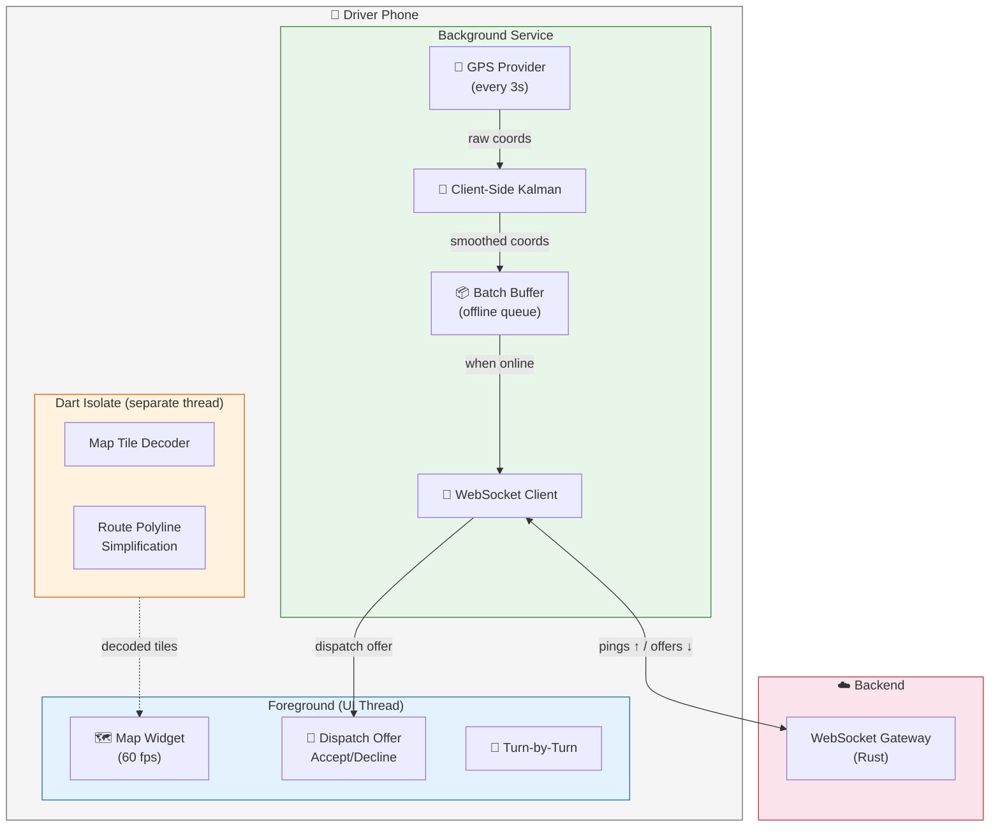
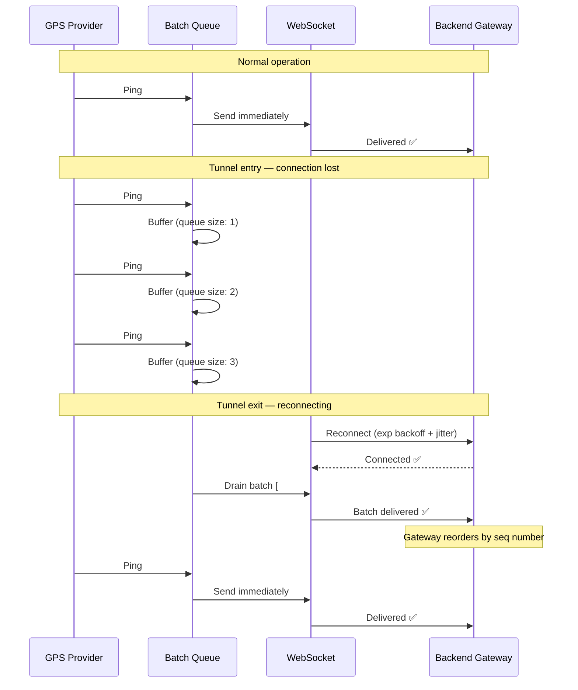
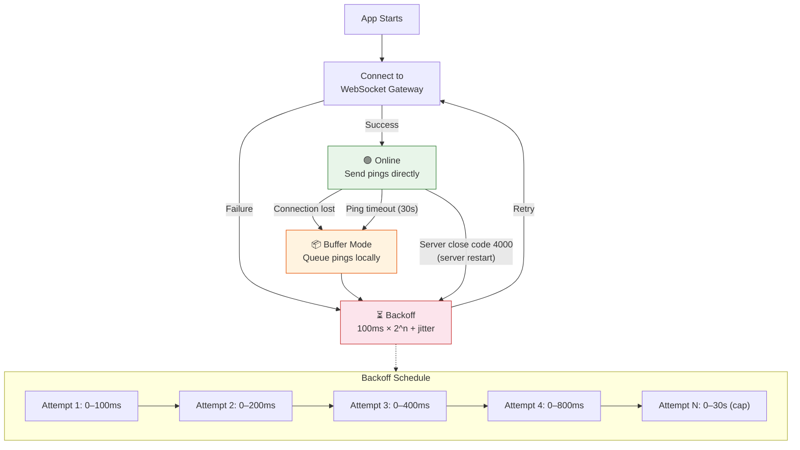

# Chapter 5: The Driver App — Flutter & Background Location 🟡

> **The Problem:** The phone in the driver's pocket is the edge node of the dispatch system. It must transmit GPS coordinates every 3 seconds — even when the app is in the background, the screen is off, the phone enters a tunnel, Android's Doze mode kicks in, or iOS suspends the app. Meanwhile, the foreground UI must render a smooth map at 60 fps, show incoming dispatch offers, and play audio alerts — none of which can stutter while the GPS pipeline runs. Building a reliable mobile location client is the most underestimated problem in ride dispatch.

---

## 5.1 The Mobile Edge Architecture



### Threading model

| Thread | Purpose | Priority |
|---|---|---|
| **UI thread** (main isolate) | Map rendering, offer display, user interaction | Highest — must never block |
| **Background service** | GPS acquisition, WebSocket I/O, batch management | High — must survive backgrounding |
| **Compute isolate** | Map tile decoding, polyline processing | Medium — offload heavy CPU work |

---

## 5.2 Flutter Project Structure

```
driver_app/
├── lib/
│   ├── main.dart
│   ├── app.dart
│   ├── services/
│   │   ├── location_service.dart       # GPS provider + Kalman filter
│   │   ├── websocket_service.dart      # WebSocket connection management
│   │   ├── batch_queue.dart            # Offline ping batching
│   │   └── dispatch_service.dart       # Handle offers from backend
│   ├── models/
│   │   ├── gps_ping.dart
│   │   ├── dispatch_offer.dart
│   │   └── driver_state.dart
│   ├── screens/
│   │   ├── home_screen.dart            # Map + status
│   │   ├── offer_screen.dart           # Accept/decline overlay
│   │   └── navigation_screen.dart      # Turn-by-turn
│   └── isolates/
│       └── map_processor.dart          # Heavy computation isolate
├── android/
│   └── app/src/main/
│       ├── AndroidManifest.xml         # Foreground service declaration
│       └── kotlin/.../LocationService.kt
├── ios/
│   └── Runner/
│       ├── Info.plist                  # Background modes
│       └── AppDelegate.swift
└── pubspec.yaml
```

---

## 5.3 Background Location: The Platform War

### The fundamental challenge

Both iOS and Android aggressively kill background apps to save battery. A ride-hailing driver app must be the exception — it needs continuous location access while consuming minimal power. The rules are different on each platform, and they change with every OS update.

| Capability | Android | iOS |
|---|---|---|
| Continuous background GPS | ✅ Foreground Service (notification required) | ✅ `location` background mode |
| Background execution limit | None with foreground service | ~30s after backgrounding, then suspended |
| Keep-alive mechanism | `START_STICKY` service + `FOREGROUND_SERVICE_LOCATION` | `allowsBackgroundLocationUpdates = true` |
| Doze mode impact | Delays alarms, but foreground service exempt | N/A (iOS uses own power management) |
| User-visible indicator | Persistent notification | Blue location bar |
| SDK permission | `ACCESS_FINE_LOCATION` + `FOREGROUND_SERVICE_LOCATION` | `NSLocationAlwaysAndWhenInUseUsageDescription` |

### Android: Foreground Service

```dart
// location_service.dart

import 'package:flutter_background_service/flutter_background_service.dart';
import 'package:geolocator/geolocator.dart';

class LocationService {
  static const _interval = Duration(seconds: 3);
  final BatchQueue _batchQueue;
  final GpsKalmanFilter _kalman = GpsKalmanFilter();

  LocationService(this._batchQueue);

  /// Start the foreground service (Android) or background location (iOS).
  Future<void> startTracking() async {
    // Request permissions
    final permission = await Geolocator.requestPermission();
    if (permission == LocationPermission.denied ||
        permission == LocationPermission.deniedForever) {
      throw Exception('Location permission required for driver mode');
    }

    // Platform-specific background setup
    final service = FlutterBackgroundService();
    await service.configure(
      androidConfiguration: AndroidConfiguration(
        onStart: _onBackgroundStart,
        isForegroundMode: true,          // ✅ Foreground service
        autoStart: true,
        notificationChannelId: 'driver_location',
        initialNotificationTitle: 'Driver Mode Active',
        initialNotificationContent: 'Sharing your location with riders',
        foregroundServiceNotificationId: 888,
      ),
      iosConfiguration: IosConfiguration(
        autoStart: true,
        onForeground: _onBackgroundStart,
        onBackground: _onIosBackground,
      ),
    );

    await service.startService();
  }

  @pragma('vm:entry-point')
  static Future<void> _onBackgroundStart(ServiceInstance service) async {
    final locationService = LocationService(BatchQueue());

    // GPS stream at 3-second intervals
    final positionStream = Geolocator.getPositionStream(
      locationSettings: const LocationSettings(
        accuracy: LocationAccuracy.high,
        distanceFilter: 5,       // minimum 5m movement
        timeLimit: Duration(seconds: 5), // force update if no movement
      ),
    );

    positionStream.listen((Position position) {
      locationService._onNewPosition(position);
    });
  }

  void _onNewPosition(Position position) {
    // 1. Apply client-side Kalman filter
    final smoothed = _kalman.update(
      position.latitude,
      position.longitude,
      position.accuracy,
      position.timestamp.millisecondsSinceEpoch / 1000.0,
    );

    // 2. Build ping
    final ping = GpsPing(
      lat: smoothed.lat,
      lon: smoothed.lon,
      rawLat: position.latitude,
      rawLon: position.longitude,
      accuracy: position.accuracy,
      heading: position.heading,
      speed: position.speed,
      timestamp: position.timestamp.millisecondsSinceEpoch,
      seq: _nextSeq(),
    );

    // 3. Enqueue for transmission
    _batchQueue.enqueue(ping);
  }
}
```

### iOS: Background Location Mode

In `ios/Runner/Info.plist`:

```xml
<key>UIBackgroundModes</key>
<array>
    <string>location</string>
    <string>fetch</string>
</array>
<key>NSLocationAlwaysAndWhenInUseUsageDescription</key>
<string>We need your location to match you with nearby riders
and provide accurate ETAs.</string>
<key>NSLocationWhenInUseUsageDescription</key>
<string>We need your location to show your position on the map.</string>
```

---

## 5.4 The Offline Batch Queue

Tunnels, parking garages, elevator shafts, areas with poor cellular coverage — drivers regularly lose connectivity. The app must buffer GPS pings and transmit them when connectivity resumes.

```dart
// batch_queue.dart

import 'dart:collection';
import 'package:hive/hive.dart'; // Lightweight local storage

class BatchQueue {
  static const _maxQueueSize = 1000; // ~50 minutes of pings at 3s intervals
  static const _batchSize = 50;

  late Box<GpsPing> _persistentQueue;
  final Queue<GpsPing> _memoryQueue = Queue();

  Future<void> init() async {
    // Hive persists to disk — survives app kill
    _persistentQueue = await Hive.openBox<GpsPing>('ping_queue');

    // Load any persisted pings from previous session
    for (final ping in _persistentQueue.values) {
      _memoryQueue.add(ping);
    }
  }

  void enqueue(GpsPing ping) {
    _memoryQueue.add(ping);

    // Persist to disk for crash recovery
    _persistentQueue.add(ping);

    // Evict oldest if queue is full (drop stale pings)
    while (_memoryQueue.length > _maxQueueSize) {
      final evicted = _memoryQueue.removeFirst();
      _persistentQueue.deleteAt(0);
    }
  }

  /// Drain up to [_batchSize] pings for transmission.
  List<GpsPing> drainBatch() {
    final batch = <GpsPing>[];
    while (batch.length < _batchSize && _memoryQueue.isNotEmpty) {
      batch.add(_memoryQueue.removeFirst());
    }
    // Remove from persistent storage
    for (var i = 0; i < batch.length; i++) {
      _persistentQueue.deleteAt(0);
    }
    return batch;
  }

  /// Re-enqueue a batch that failed to transmit.
  void requeue(List<GpsPing> batch) {
    for (final ping in batch.reversed) {
      _memoryQueue.addFirst(ping);
      _persistentQueue.add(ping);
    }
  }

  int get length => _memoryQueue.length;
  bool get isNotEmpty => _memoryQueue.isNotEmpty;
}
```

### Queue behavior during connectivity loss



---

## 5.5 WebSocket Client with Reconnection

The WebSocket connection must be resilient — reconnecting automatically with exponential backoff and handling server-initiated close codes:

```dart
// websocket_service.dart

import 'dart:async';
import 'dart:math';
import 'package:web_socket_channel/web_socket_channel.dart';
import 'package:msgpack_dart/msgpack_dart.dart' as msgpack;

class WebSocketService {
  static const _baseUrl = 'wss://ws.dispatch.example.com/driver';
  static const _maxBackoffMs = 30000; // 30 seconds

  WebSocketChannel? _channel;
  final BatchQueue _batchQueue;
  final DispatchService _dispatchService;
  final _random = Random();

  bool _connected = false;
  int _reconnectAttempts = 0;
  Timer? _drainTimer;

  WebSocketService(this._batchQueue, this._dispatchService);

  Future<void> connect(String authToken) async {
    try {
      _channel = WebSocketChannel.connect(
        Uri.parse('$_baseUrl?token=$authToken'),
      );

      await _channel!.ready;
      _connected = true;
      _reconnectAttempts = 0;

      // Start draining queued pings
      _startDrainLoop();

      // Listen for incoming messages (dispatch offers)
      _channel!.stream.listen(
        _onMessage,
        onError: _onError,
        onDone: _onDisconnect,
      );
    } catch (e) {
      _onDisconnect();
    }
  }

  void _onMessage(dynamic data) {
    if (data is List<int>) {
      final msg = msgpack.deserialize(data);
      if (msg['type'] == 'dispatch_offer') {
        _dispatchService.handleOffer(DispatchOffer.fromMap(msg));
      } else if (msg['type'] == 'cancel') {
        _dispatchService.handleCancel(msg['ride_request_id']);
      }
    }
  }

  void _onError(dynamic error) {
    _connected = false;
    _scheduleReconnect();
  }

  void _onDisconnect() {
    _connected = false;
    _drainTimer?.cancel();
    _scheduleReconnect();
  }

  /// Exponential backoff with full jitter.
  void _scheduleReconnect() {
    final backoffMs = min(
      _maxBackoffMs,
      (pow(2, _reconnectAttempts) * 100).toInt(),
    );
    final jitterMs = _random.nextInt(backoffMs);
    _reconnectAttempts++;

    Future.delayed(Duration(milliseconds: jitterMs), () {
      connect(_lastAuthToken!);
    });
  }

  /// Drain buffered pings every 100ms when connected.
  void _startDrainLoop() {
    _drainTimer = Timer.periodic(
      const Duration(milliseconds: 100),
      (_) {
        if (!_connected || !_batchQueue.isNotEmpty) return;

        final batch = _batchQueue.drainBatch();
        try {
          for (final ping in batch) {
            final encoded = msgpack.serialize(ping.toMap());
            _channel!.sink.add(encoded);
          }
        } catch (e) {
          // Failed to send — re-enqueue
          _batchQueue.requeue(batch);
          _onDisconnect();
        }
      },
    );
  }

  void sendPing(GpsPing ping) {
    if (_connected) {
      try {
        final encoded = msgpack.serialize(ping.toMap());
        _channel!.sink.add(encoded);
        return;
      } catch (_) {
        _onDisconnect();
      }
    }
    // Not connected — queue for later
    _batchQueue.enqueue(ping);
  }

  String? _lastAuthToken;
}
```

### Reconnection topology



---

## 5.6 Dart Isolates: Preventing UI Jank

The main Dart isolate runs the UI. Any computation longer than ~16 ms (one frame at 60 fps) causes visible jank. Heavy operations must be offloaded to a separate isolate.

### Operations that need isolates

| Operation | Time on Main Thread | Impact |
|---|---|---|
| Map tile protobuf decoding | 5–15 ms | 🟡 Occasional frame drops |
| Route polyline simplification | 10–30 ms | 🔴 Visible jank |
| JSON parsing (large payload) | 2–5 ms | 🟢 Usually fine |
| Kalman filter update | < 0.1 ms | 🟢 Negligible |
| MessagePack serialize | < 0.5 ms | 🟢 Negligible |
| **Batch of 200 buffered pings serialize** | **50–100 ms** | **🔴 Major jank** |

### Isolate for map processing

```dart
// isolates/map_processor.dart

import 'dart:isolate';
import 'package:flutter/services.dart';

class MapProcessor {
  late Isolate _isolate;
  late SendPort _sendPort;
  final _responses = <int, Completer<dynamic>>{};
  int _nextId = 0;

  Future<void> init() async {
    final receivePort = ReceivePort();
    _isolate = await Isolate.spawn(
      _isolateEntry,
      receivePort.sendPort,
    );

    // First message is the isolate's SendPort
    _sendPort = await receivePort.first as SendPort;

    // Listen for responses
    final responsePort = ReceivePort();
    _sendPort.send(responsePort.sendPort);
    responsePort.listen((message) {
      final id = message['id'] as int;
      final result = message['result'];
      _responses.remove(id)?.complete(result);
    });
  }

  static void _isolateEntry(SendPort mainSendPort) {
    final receivePort = ReceivePort();
    mainSendPort.send(receivePort.sendPort);

    late SendPort responseSendPort;

    receivePort.listen((message) {
      if (message is SendPort) {
        responseSendPort = message;
        return;
      }

      final id = message['id'] as int;
      final type = message['type'] as String;
      final data = message['data'];

      dynamic result;
      switch (type) {
        case 'decode_tile':
          result = _decodeTile(data);
          break;
        case 'simplify_polyline':
          result = _simplifyPolyline(data);
          break;
      }

      responseSendPort.send({'id': id, 'result': result});
    });
  }

  Future<List<MapFeature>> decodeTile(List<int> tileData) async {
    final id = _nextId++;
    final completer = Completer<dynamic>();
    _responses[id] = completer;
    _sendPort.send({
      'id': id,
      'type': 'decode_tile',
      'data': tileData,
    });
    return await completer.future as List<MapFeature>;
  }

  /// Douglas-Peucker polyline simplification (CPU-intensive).
  static List<LatLng> _simplifyPolyline(Map<String, dynamic> data) {
    final points = (data['points'] as List)
        .map((p) => LatLng(p['lat'], p['lon']))
        .toList();
    final epsilon = data['epsilon'] as double;
    return _douglasPeucker(points, epsilon);
  }

  static List<LatLng> _douglasPeucker(List<LatLng> points, double epsilon) {
    if (points.length <= 2) return points;

    // Find the point with maximum distance from the line
    double maxDist = 0;
    int maxIdx = 0;
    final first = points.first;
    final last = points.last;

    for (int i = 1; i < points.length - 1; i++) {
      final dist = _perpendicularDistance(points[i], first, last);
      if (dist > maxDist) {
        maxDist = dist;
        maxIdx = i;
      }
    }

    if (maxDist > epsilon) {
      final left = _douglasPeucker(points.sublist(0, maxIdx + 1), epsilon);
      final right = _douglasPeucker(points.sublist(maxIdx), epsilon);
      return [...left.sublist(0, left.length - 1), ...right];
    } else {
      return [first, last];
    }
  }
}
```

---

## 5.7 Android Doze Mode and Battery Optimization

Android Doze Mode (introduced in Android 6.0) aggressively restricts background activity when the screen is off and the device is stationary. Even with a foreground service, certain behaviors change:

### Doze restrictions

| Restriction | Impact on Driver App | Mitigation |
|---|---|---|
| Network access deferred | Pings queue up, not delivered | Foreground service exempts from full Doze |
| Alarms deferred | Timers fire late | Use `setExactAndAllowWhileIdle` |
| GPS restricted | Updates stop or become infrequent | `FOREGROUND_SERVICE_LOCATION` type exempts |
| Wakelocks limited | CPU may sleep | Foreground service holds partial wakelock |
| `JobScheduler` deferred | Background jobs delayed | Don't rely on JobScheduler for pings |

### Android Manifest configuration

```xml
<!-- android/app/src/main/AndroidManifest.xml -->
<manifest xmlns:android="http://schemas.android.com/apk/res/android">

    <!-- Location permissions -->
    <uses-permission android:name="android.permission.ACCESS_FINE_LOCATION" />
    <uses-permission android:name="android.permission.ACCESS_COARSE_LOCATION" />
    <uses-permission
        android:name="android.permission.ACCESS_BACKGROUND_LOCATION" />

    <!-- Foreground service -->
    <uses-permission
        android:name="android.permission.FOREGROUND_SERVICE" />
    <uses-permission
        android:name="android.permission.FOREGROUND_SERVICE_LOCATION" />

    <!-- Prevent Doze from killing us -->
    <uses-permission
        android:name="android.permission.REQUEST_IGNORE_BATTERY_OPTIMIZATIONS" />
    <uses-permission android:name="android.permission.WAKE_LOCK" />

    <application ...>
        <service
            android:name=".LocationForegroundService"
            android:foregroundServiceType="location"
            android:exported="false" />
    </application>
</manifest>
```

### Requesting battery optimization exemption

```dart
import 'package:permission_handler/permission_handler.dart';

Future<void> requestBatteryExemption() async {
  if (await Permission.ignoreBatteryOptimizations.isDenied) {
    // This shows a system dialog — cannot be customized
    await Permission.ignoreBatteryOptimizations.request();
  }
}
```

> 💥 **Warning:** Google Play restricts use of `REQUEST_IGNORE_BATTERY_OPTIMIZATIONS`. You must declare in your Play Store listing that your app is a "ride-hailing/delivery driver app" to use this permission. Misuse can lead to app rejection.

---

## 5.8 iOS Background App Refresh

iOS takes a different approach. Background location is allowed indefinitely with the `location` background mode, but other background tasks are heavily restricted:

### iOS-specific concerns

| Concern | Behavior | Mitigation |
|---|---|---|
| Background location | ✅ Works continuously | Must show blue status bar |
| WebSocket in background | ❌ Suspended after ~30s | Use `URLSessionWebSocketTask` with background configuration |
| Network requests | ❌ Deferred in background | Use `BGTaskScheduler` for non-urgent |
| Audio alerts | ❌ No playback in background | Use `AVAudioSession` in `playback` category |
| Silent push notifications | ✅ Wake app for 30s | Use for dispatch offers when WS down |

### NSURLSession background WebSocket (native)

Since Flutter's `web_socket_channel` doesn't survive iOS backgrounding, we use a platform channel to native `URLSessionWebSocketTask`:

```swift
// ios/Runner/AppDelegate.swift

import UIKit
import Flutter

@UIApplicationMain
@objc class AppDelegate: FlutterAppDelegate {
    
    private var locationManager: CLLocationManager?
    private var webSocketTask: URLSessionWebSocketTask?
    private lazy var backgroundSession: URLSession = {
        let config = URLSessionConfiguration.background(
            withIdentifier: "com.app.driver.websocket"
        )
        config.sessionSendsLaunchEvents = true
        config.isDiscretionary = false
        return URLSession(configuration: config, delegate: self, delegateQueue: nil)
    }()
    
    override func application(
        _ application: UIApplication,
        didFinishLaunchingWithOptions launchOptions: [UIApplication.LaunchOptionsKey: Any]?
    ) -> Bool {
        // Setup location manager
        locationManager = CLLocationManager()
        locationManager?.allowsBackgroundLocationUpdates = true
        locationManager?.showsBackgroundLocationIndicator = true
        locationManager?.desiredAccuracy = kCLLocationAccuracyBest
        locationManager?.distanceFilter = 5 // meters
        locationManager?.pausesLocationUpdatesAutomatically = false
        
        // Platform channel for native WebSocket
        let controller = window?.rootViewController as! FlutterViewController
        let channel = FlutterMethodChannel(
            name: "com.app.driver/native_ws",
            binaryMessenger: controller.binaryMessenger
        )
        channel.setMethodCallHandler(handleMethodCall)
        
        GeneratedPluginRegistrant.register(with: self)
        return super.application(application, didFinishLaunchingWithOptions: launchOptions)
    }
    
    private func handleMethodCall(call: FlutterMethodCall, result: @escaping FlutterResult) {
        switch call.method {
        case "connectWebSocket":
            let args = call.arguments as! [String: Any]
            let url = URL(string: args["url"] as! String)!
            connectWebSocket(url: url)
            result(nil)
        case "sendPing":
            let data = (call.arguments as! FlutterStandardTypedData).data
            sendPing(data: data)
            result(nil)
        default:
            result(FlutterMethodNotImplemented)
        }
    }
}
```

---

## 5.9 Handling the Dispatch Offer UI

When a dispatch offer arrives, the app must:
1. Play an alert sound (even if volume is low).
2. Show a full-screen overlay with rider details and ETA.
3. Start a 15-second countdown timer.
4. Vibrate the phone.

```dart
// screens/offer_screen.dart

import 'package:flutter/material.dart';
import 'dart:async';

class OfferOverlay extends StatefulWidget {
  final DispatchOffer offer;
  final VoidCallback onAccept;
  final VoidCallback onDecline;

  const OfferOverlay({
    required this.offer,
    required this.onAccept,
    required this.onDecline,
    super.key,
  });

  @override
  State<OfferOverlay> createState() => _OfferOverlayState();
}

class _OfferOverlayState extends State<OfferOverlay> {
  int _secondsRemaining = 15;
  Timer? _timer;

  @override
  void initState() {
    super.initState();
    // Start countdown
    _timer = Timer.periodic(const Duration(seconds: 1), (timer) {
      setState(() {
        _secondsRemaining--;
      });
      if (_secondsRemaining <= 0) {
        timer.cancel();
        widget.onDecline(); // Auto-decline on timeout
      }
    });
  }

  @override
  void dispose() {
    _timer?.cancel();
    super.dispose();
  }

  @override
  Widget build(BuildContext context) {
    return Material(
      color: Colors.black87,
      child: SafeArea(
        child: Column(
          mainAxisAlignment: MainAxisAlignment.center,
          children: [
            // Countdown ring
            SizedBox(
              width: 120,
              height: 120,
              child: Stack(
                fit: StackFit.expand,
                children: [
                  CircularProgressIndicator(
                    value: _secondsRemaining / 15.0,
                    strokeWidth: 8,
                    valueColor: AlwaysStoppedAnimation(
                      _secondsRemaining > 5 ? Colors.green : Colors.red,
                    ),
                  ),
                  Center(
                    child: Text(
                      '$_secondsRemaining',
                      style: const TextStyle(
                        color: Colors.white,
                        fontSize: 48,
                        fontWeight: FontWeight.bold,
                      ),
                    ),
                  ),
                ],
              ),
            ),
            const SizedBox(height: 32),
            // Ride details
            Text(
              'Pickup: ${widget.offer.pickupAddress}',
              style: const TextStyle(color: Colors.white, fontSize: 18),
            ),
            const SizedBox(height: 8),
            Text(
              'ETA: ${widget.offer.etaMinutes} min',
              style: const TextStyle(color: Colors.white70, fontSize: 16),
            ),
            Text(
              'Distance: ${widget.offer.distanceKm.toStringAsFixed(1)} km',
              style: const TextStyle(color: Colors.white70, fontSize: 16),
            ),
            Text(
              'Est. fare: \$${widget.offer.estimatedFare.toStringAsFixed(2)}',
              style: const TextStyle(color: Colors.greenAccent, fontSize: 20),
            ),
            const SizedBox(height: 48),
            // Accept / Decline buttons
            Row(
              mainAxisAlignment: MainAxisAlignment.spaceEvenly,
              children: [
                ElevatedButton(
                  onPressed: widget.onDecline,
                  style: ElevatedButton.styleFrom(
                    backgroundColor: Colors.red,
                    minimumSize: const Size(140, 56),
                  ),
                  child: const Text('DECLINE',
                      style: TextStyle(fontSize: 18)),
                ),
                ElevatedButton(
                  onPressed: widget.onAccept,
                  style: ElevatedButton.styleFrom(
                    backgroundColor: Colors.green,
                    minimumSize: const Size(140, 56),
                  ),
                  child: const Text('ACCEPT',
                      style: TextStyle(fontSize: 18)),
                ),
              ],
            ),
          ],
        ),
      ),
    );
  }
}
```

---

## 5.10 Client-Side Kalman Filter (Dart)

We run the same Kalman filter concept from Chapter 1 on the client, pre-filtering obviously bad GPS readings before they even hit the network:

```dart
// services/location_service.dart (Kalman filter portion)

class GpsKalmanFilter {
  // State: [lat, lon, v_lat, v_lon]
  List<double> _x = [0, 0, 0, 0];
  List<List<double>> _p = [
    [1, 0, 0, 0],
    [0, 1, 0, 0],
    [0, 0, 1, 0],
    [0, 0, 0, 1],
  ];
  double _qScale = 0.1;
  bool _initialized = false;
  double _lastTimestamp = 0;

  ({double lat, double lon}) update(
    double lat,
    double lon,
    double accuracyM,
    double timestampSecs,
  ) {
    if (!_initialized) {
      _x = [lat, lon, 0, 0];
      _initialized = true;
      _lastTimestamp = timestampSecs;
      return (lat: lat, lon: lon);
    }

    final dt = timestampSecs - _lastTimestamp;
    _lastTimestamp = timestampSecs;
    if (dt <= 0) return (lat: _x[0], lon: _x[1]);

    // Predict
    final xPred = [
      _x[0] + _x[2] * dt,
      _x[1] + _x[3] * dt,
      _x[2],
      _x[3],
    ];

    final pPred = List<List<double>>.from(
      _p.map((row) => List<double>.from(row)),
    );
    pPred[0][0] += dt * dt * _p[2][2] + _qScale * dt;
    pPred[1][1] += dt * dt * _p[3][3] + _qScale * dt;

    // Measurement noise (meters → degrees)
    final r = (accuracyM / 111000.0) * (accuracyM / 111000.0);

    // Kalman gain
    final k0 = pPred[0][0] / (pPred[0][0] + r);
    final k1 = pPred[1][1] / (pPred[1][1] + r);

    // Innovation
    final innovLat = lat - xPred[0];
    final innovLon = lon - xPred[1];

    // Outlier rejection (5-sigma gate)
    final s0 = pPred[0][0] + r;
    final s1 = pPred[1][1] + r;
    if (innovLat * innovLat > 25.0 * s0 || innovLon * innovLon > 25.0 * s1) {
      _x = xPred;
      _p = pPred;
      return (lat: xPred[0], lon: xPred[1]);
    }

    // Update
    _x[0] = xPred[0] + k0 * innovLat;
    _x[1] = xPred[1] + k1 * innovLon;
    _x[2] = xPred[2] + k0 * innovLat / dt;
    _x[3] = xPred[3] + k1 * innovLon / dt;

    _p[0][0] = (1 - k0) * pPred[0][0];
    _p[1][1] = (1 - k1) * pPred[1][1];

    return (lat: _x[0], lon: _x[1]);
  }
}
```

---

## 5.11 Comparative: Platform Behavior Summary

| Concern | 💥 Naive Implementation | ✅ Production Implementation |
|---|---|---|
| Background GPS | Timer-based polling (killed by OS) | Foreground Service (Android) / Background Location Mode (iOS) |
| Connectivity loss | Ping lost forever | Persistent batch queue with disk-backed storage |
| WebSocket drop | User sees frozen map | Auto-reconnect with exponential backoff + jitter |
| GPS noise | Raw coords sent to backend | Client-side Kalman filter with 5σ outlier gate |
| Heavy map processing | Jank on UI thread | Dart Isolate for tile decoding and polyline simplification |
| Battery drain | GPS at maximum frequency | `distanceFilter: 5m` + accuracy-aware interval |
| Doze mode (Android) | App silently killed | `FOREGROUND_SERVICE_LOCATION` + battery optimization exemption |
| iOS suspension | WebSocket dies after 30s | Native `URLSessionWebSocketTask` via platform channel |
| Dispatch offer | Missed while backgrounded | Platform-native push notification as fallback |

---

## 5.12 Battery Optimization

Continuous GPS is the #1 battery drain. Strategies to minimize impact:

| Strategy | Battery Savings | Accuracy Impact |
|---|---|---|
| `distanceFilter: 5m` (skip if < 5m moved) | 15–20% | Negligible (stationary driver) |
| Reduce GPS to 10s interval when stationary | 30–40% | None (not moving) |
| Use network location when accuracy doesn't matter | 50% | ±100m (ok for coarse index) |
| Switch to `balanced` accuracy in low-demand areas | 25% | ±20m (acceptable) |
| Batch pings in-memory, send every 10s instead of 3s | 10–15% (radio) | Increased latency |

```dart
/// Adaptive location settings based on driver state.
LocationSettings getAdaptiveSettings(DriverState state) {
  switch (state) {
    case DriverState.onTrip:
      return const LocationSettings(
        accuracy: LocationAccuracy.bestForNavigation,
        distanceFilter: 5,
      );
    case DriverState.available:
      return const LocationSettings(
        accuracy: LocationAccuracy.high,
        distanceFilter: 10,
      );
    case DriverState.idle:
      // Parked, waiting — save battery
      return const LocationSettings(
        accuracy: LocationAccuracy.balanced,
        distanceFilter: 50,
      );
  }
}
```

---

## Exercises

### Exercise 1: Offline Queue Stress Test

Write a test that simulates 5 minutes of GPS pings (100 pings), with a 2-minute connectivity gap in the middle. Verify that:
1. All pings are eventually delivered after reconnection.
2. Pings arrive in sequence-number order.
3. The disk-backed queue survives a simulated app restart during the gap.

<details>
<summary>Hint</summary>

Use Hive's in-memory adapter for testing (`Hive.init` with a temp directory). Simulate the gap by closing the mock WebSocket, accumulating pings, then reopening. Verify `seq` numbers are monotonically increasing in the received batch.

</details>

### Exercise 2: Isolate Performance Benchmark

Measure the UI frame time (using `SchedulerBinding.instance.currentFrameTimeStamp`) while:
1. Decoding a 500 KB map tile on the main thread.
2. Decoding the same tile on a Dart isolate.

Compare frames dropped in each case.

<details>
<summary>Expected Results</summary>

Main-thread decoding will drop 3–8 frames (visible stutter). Isolate decoding should drop 0 frames, with the result appearing ~50 ms after the request (one round-trip to the isolate).

</details>

### Exercise 3: Battery Profiling

Run the driver app for 1 hour with three configurations:
1. GPS every 3s, `high` accuracy, no distance filter.
2. GPS every 3s, `high` accuracy, `distanceFilter: 10m`.
3. Adaptive (from Section 5.12), assuming the driver is idle for 30 min, then on a trip for 30 min.

Measure battery consumption with Android's Battery Historian or Xcode's Energy Organizer.

<details>
<summary>Expected Results</summary>

Configuration 1 will use 8–12% battery per hour. Configuration 2 will use 6–9%. Configuration 3 will use 4–7% (the idle period uses very little power with balanced accuracy and large distance filter).

</details>

---

> **Key Takeaways**
>
> 1. **The phone is the edge node** — its reliability directly determines dispatch quality. A missed GPS ping means the driver is invisible to the matching algorithm.
> 2. **Background execution is a platform-specific battlefield.** Android requires foreground services with visible notifications; iOS requires background location mode and native WebSocket integrations.
> 3. **Offline batching with disk persistence** ensures zero ping loss through tunnels, poor coverage, and app restarts. The batch queue is the most important resilience mechanism.
> 4. **Exponential backoff with jitter** is non-negotiable for WebSocket reconnection — without jitter, 500K drivers reconnecting simultaneously will DDoS the gateway.
> 5. **Dart Isolates** prevent UI jank by offloading CPU-heavy work (tile decoding, polyline simplification) to a separate thread.
> 6. **Adaptive GPS settings** based on driver state (on-trip vs. available vs. idle) reduce battery consumption by 40–50% without meaningful accuracy loss.
> 7. **Client-side Kalman filtering** pre-filters GPS noise before it hits the network, reducing bandwidth and preventing phantom driver teleportation at the spatial index.
