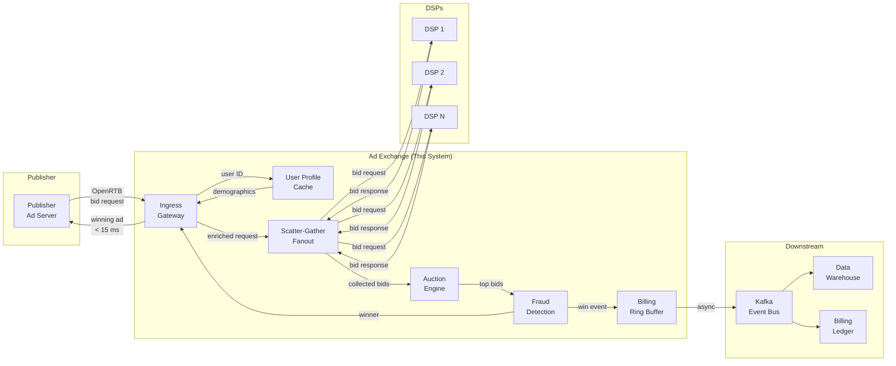

# System Design: The Real-Time Bidding (RTB) Ad Exchange

## Speaker Intro

This handbook is written from the perspective of a **Principal AdTech Architect** who has designed, optimized, and operated real-time bidding exchanges processing **10 million+ bid requests per second** with sub-15 ms end-to-end latency. The content draws from first-hand experience at the intersection of ultra-low-latency systems programming, probabilistic fraud-detection pipelines, and financial-grade event-sourced billing infrastructure.

## Who This Is For

- **Backend engineers** building latency-sensitive serving systems who want to understand why the RTB hot-path is one of the hardest real-time problems in the industry.
- **Systems programmers** who want a concrete, end-to-end project—a complete ad exchange—instead of isolated micro-benchmarks.
- **Architects evaluating Rust** for AdTech workloads that currently run on overprovisioned JVM or Go fleets, and who need proof that Rust can eliminate GC-induced tail-latency spikes.
- **Anyone who has integrated with** Google Ad Exchange, OpenRTB, or Header Bidding and wants to understand the server-side machinery that powers programmatic advertising.

## Prerequisites

| Concept | Where to Learn |
|---|---|
| Intermediate Rust (ownership, traits, `async`) | [Async Rust](../async-book/src/SUMMARY.md) |
| Tokio runtime basics (`spawn`, `select!`, channels) | [Tokio Internals](../tokio-internals-book/src/SUMMARY.md) |
| HTTP/2, Protocol Buffers, gRPC concepts | [Microservices Book](../microservices-book/src/SUMMARY.md) |
| Basic probability & statistics (for fraud models) | Any introductory statistics textbook |
| Linux networking (`epoll`, `io_uring`) | [Hardware Sympathy](../hardware-sympathy-book/src/SUMMARY.md) |

## How to Use This Book

| Emoji | Meaning |
|---|---|
| 🟢 | **Architecture** — foundational AdTech economics and ingress design |
| 🟡 | **Implementation** — production-grade scatter-gather, caching, and data paths |
| 🔴 | **Ultra-Low Latency** — auction logic, ML fraud detection, lock-free billing |

Each chapter solves **one critical constraint** in the 15-millisecond RTB pipeline. Read them in order—later chapters assume the ingress gateway and scatter-gather layer from earlier chapters exist.

## The Problem We Are Solving

> Design a **real-time bidding ad exchange** capable of receiving an ad impression opportunity, fanning out bid requests to dozens of Demand Side Platforms (DSPs), running a fraud-checked auction, and returning the winning creative URL—all **within 15 milliseconds end-to-end** at **10 million queries per second (QPS)**.

The system we will build has these non-negotiable requirements:

| Requirement | Target |
|---|---|
| End-to-end latency (p50) | < 10 ms |
| End-to-end latency (p999) | < 15 ms |
| Throughput | ≥ 10 M bid requests/sec across the fleet |
| DSP fanout | 30–80 DSPs per request |
| DSP timeout | 100 ms hard cap (industry standard) |
| Fraud detection | Inline ML scoring, < 500 µs |
| Billing accuracy | Exactly-once semantics, zero revenue leakage |
| Availability | 99.99 % (< 52 min downtime/year) |

## The RTB Request Lifecycle

Every ad impression triggers the following pipeline, which must complete in under 15 ms on the exchange side:

## Why Rust for an Ad Exchange?

The RTB hot-path is a **worst-case environment for garbage-collected runtimes**:

| Dimension | GC Runtime (Java/Go) | Rust |
|---|---|---|
| p50 latency | Comparable | Comparable |
| p999 latency | 5–50× worse during GC pauses | Deterministic, no GC |
| Memory footprint | 2–4× overhead (heap headers, GC metadata) | Byte-exact structs |
| Tail-latency variance | Unpredictable STW (Stop-The-World) events | Zero STW by design |
| Revenue impact of p999 spike | DSP timeouts → lost bids → lost revenue | Consistent throughput |

At 10 M QPS, even a **1 ms GC pause** causes **10,000 requests** to breach the 15 ms deadline. Each missed deadline is a lost auction—and lost revenue. Rust's zero-cost abstractions, deterministic destructors, and lack of a runtime GC make it uniquely suited to this problem domain.

## Pacing Guide

| Chapter | Topic | Time | Checkpoint |
|---|---|---|---|
| Ch 0 | Introduction & Problem Statement | 30 min | Understand the RTB pipeline and constraints |
| Ch 1 | The 15-Millisecond Deadline | 6–8 hours | Working `hyper`/`glommio` ingress gateway benchmarked |
| Ch 2 | Scatter-Gather and Timeout Management | 6–8 hours | Fanout to 50 DSPs with bounded timeout |
| Ch 3 | In-Memory Caching and User Profiling | 5–7 hours | Sub-millisecond user profile lookups with FlatBuffers |
| Ch 4 | The Auction Engine & Fraud Detection | 6–8 hours | Second-price auction with inline ONNX fraud scoring |
| Ch 5 | Asynchronous Billing and Event Sourcing | 6–8 hours | Lock-free ring buffer → Kafka pipeline |

**Total: ~30–40 hours** of focused study.

## Table of Contents

### Part I: Ingress & Latency
- **Chapter 1 — The 15-Millisecond Deadline 🟢** — The economics of RTB and why every microsecond matters. Designing the ingress gateway in Rust using `hyper` or `glommio` (thread-per-core). Why garbage-collected languages fail at p999 latency in AdTech.

### Part II: Fanout & Data Path
- **Chapter 2 — Scatter-Gather and Timeout Management 🟡** — Broadcasting bid requests to dozens of DSPs simultaneously. Implementing highly concurrent scatter-gather with strict bounded timeouts using Tokio's `select!` and `tokio::time::timeout`.
- **Chapter 3 — In-Memory Caching and User Profiling 🟡** — Looking up user demographics in under 1 ms. Using Aerospike or Redis Cluster for profile data. Structuring the cache with Protocol Buffers or FlatBuffers to eliminate deserialization overhead.

### Part III: Decisioning & Monetization
- **Chapter 4 — The Auction Engine & Fraud Detection 🔴** — Implementing second-price and first-price auction logic. Running synchronous ML-based fraud detection using a lightweight Rust-bound ONNX model in the hot path.
- **Chapter 5 — Asynchronous Billing and Event Sourcing 🔴** — You can't block the response to charge a credit card. Architecting a lock-free ring buffer that fires winning-bid events into a Kafka queue for asynchronous billing and data warehousing.

## Companion Guides

| Book | Relevance |
|---|---|
| [Tokio Internals](../tokio-internals-book/src/SUMMARY.md) | Deep understanding of the async runtime powering our scatter-gather |
| [Zero-Copy Architecture](../zero-copy-book/src/SUMMARY.md) | `io_uring`, `glommio`, and thread-per-core patterns used in Ch 1 |
| [Algorithms & Concurrency](../algorithms-concurrency-book/src/SUMMARY.md) | Lock-free ring buffers and SPSC queues used in Ch 5 |
| [Hardware Sympathy](../hardware-sympathy-book/src/SUMMARY.md) | CPU cache optimization critical for sub-ms auction scoring |
| [Distributed Systems](../distributed-systems-book/src/SUMMARY.md) | Event sourcing and exactly-once delivery patterns in Ch 5 |
| [Quant Finance](../quant-finance-book/src/SUMMARY.md) | Shared ultra-low-latency patterns: kernel bypass, NUMA awareness |
